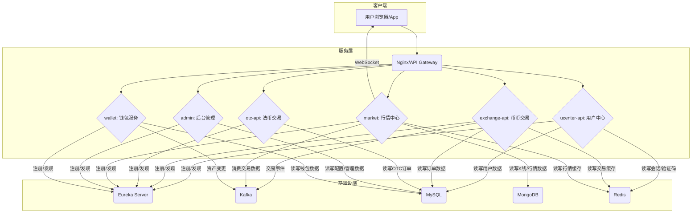
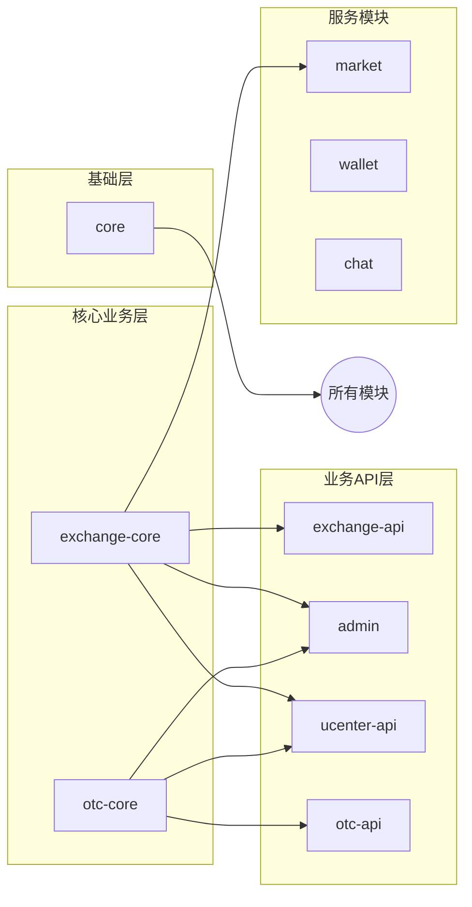
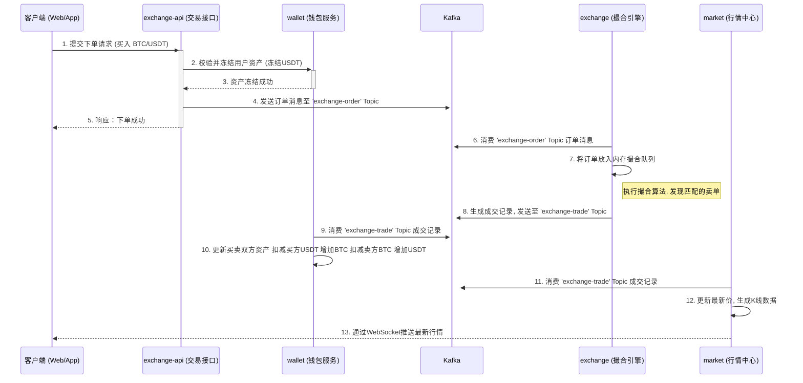
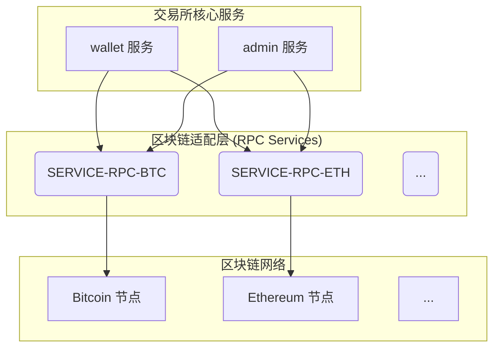
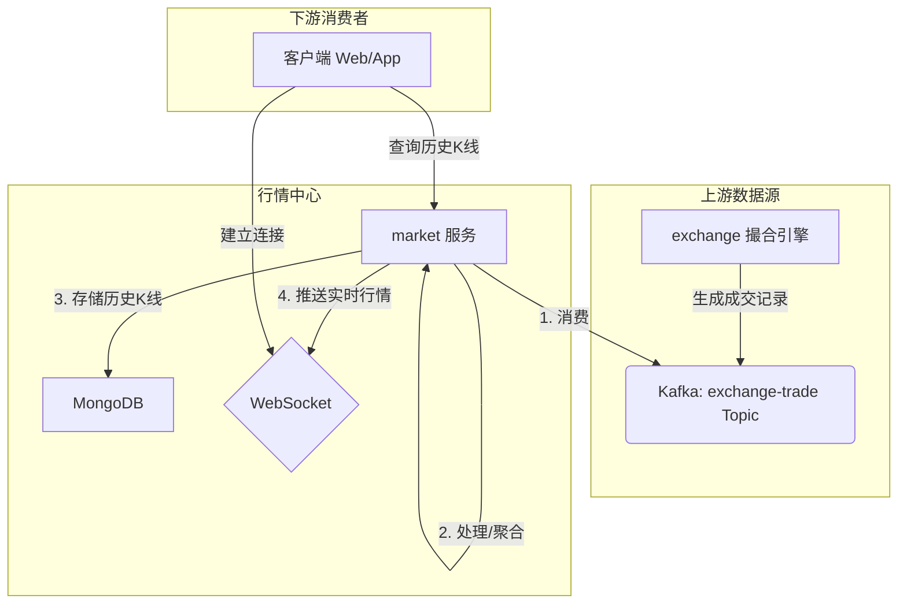

# 项目描述及架构设计文档

## 1. 项目概述

本项目是一个功能完善的数字货币交易平台，采用基于 Spring Cloud 的微服务架构构建。系统被拆分为多个独立的服务，如用户中心、行情中心、交易引擎、后台管理等，每个服务都可以独立部署和扩展。这种架构设计提高了系统的可维护性、可扩展性和容错能力。

系统核心功能包括用户管理、币币交易、法币交易（OTC）、钱包管理、实时行情展示和后台管理等。服务间通过 REST API 进行同步通信，并通过 Kafka 消息队列进行异步解耦，确保了核心业务流程的高性能和高可用性。

## 2. 技术栈

| 技术领域         | 主要技术                               | 说明                                                           |
| ---------------- | -------------------------------------- | -------------------------------------------------------------- |
| **核心框架**     | Spring Boot, Spring Cloud              | 用于快速构建和管理微服务。                                     |
| **服务治理**     | Eureka                                 | 用于服务的注册、发现和治理。                                   |
| **数据库**       | MySQL, MongoDB, Druid                  | MySQL 存储核心业务数据，MongoDB 存储行情数据，Druid 作为连接池。 |
| **缓存**         | Redis                                  | 用于热点数据缓存，提升系统性能。                               |
| **消息队列**     | Apache Kafka                           | 用于服务间的异步通信、事件驱动和日志收集。                     |
| **安全控制**     | Spring Security, Shiro                 | 提供全面的认证、授权和会话管理。                               |
| **数据访问**     | Spring Data JPA, Spring Data MongoDB   | 简化数据访问层的开发。                                         |
| **实时通信**     | WebSocket                              | 用于向客户端实时推送行情、深度等市场数据。                     |
| **项目管理**     | Maven                                  | 用于项目构建和依赖管理。                                       |

## 3. 系统架构设计

### 3.1 整体架构图

### 3.2 模块依赖关系图

## 4. 核心模块说明

| 模块名          | 核心功能                                                     | 依赖模块                               |
| --------------- | ------------------------------------------------------------ | -------------------------------------- |
| **cloud**       | Eureka 服务注册中心，提供服务注册与发现功能。                | -                                      |
| **core**        | 核心工具模块，包含项目所有公用的实体类、常量、工具类、DAO基类等。 | -                                      |
| **ucenter-api** | 用户中心，负责用户注册、登录、身份认证、安全设置等。         | `core`, `exchange-core`, `otc-core`    |
| **exchange-core** | 币币交易核心，定义了币币交易相关的实体和基础服务。           | `core`                                 |
| **exchange-api**  | 币币交易接口，提供下单、撤单、查询订单等API。                | `core`, `exchange-core`                |
| **otc-core**    | 法币交易核心，定义了OTC交易相关的实体和基础服务。              | `core`                                 |
| **otc-api**     | 法币交易接口，提供发布广告、下单、申诉等API。                | `core`, `otc-core`                     |
| **market**      | 行情中心，负责接收交易数据，生成K线、盘口深度，并通过WebSocket推送。 | `core`, `exchange-core`                |
| **wallet**      | 钱包服务，管理用户账户资产、处理充值、提现、资金划转等。     | `core`                                 |
| **admin**       | 后台管理系统，提供对整个平台的运营管理功能，如用户管理、币种管理、订单管理等。 | `core`, `exchange-core`, `otc-core`    |
| **chat**        | 聊天服务，为OTC交易等场景提供实时聊天功能。                  | `core`                                 |

## 5. 模块

### 5.3 `exchange` 与 `exchange-api` 模块详解

在币币交易功能中，`exchange` 和 `exchange-api` 两个模块协同工作，构成了完整的交易流程，但它们的职责有本质区别。

| 对比维度     | `exchange-api` (交易接口层)                                  | `exchange` (交易处理核心)                                    |
| ------------ | ------------------------------------------------------------ | ------------------------------------------------------------ |
| **主要作用** | **面向用户的API网关**，是交易指令的入口。                      | **后台撮合引擎**，是交易指令的实际执行者。                     |
| **交互方式** | 主要通过 **HTTP/REST API** 与客户端（Web/App）交互。           | 主要通过 **Kafka消息队列** 与其他服务（如`exchange-api`）进行异步交互。 |
| **核心职责** | 1. 接收并验证用户的下单、撤单等请求。 2. 对用户请求进行身份认证和权限校验。 3. 将处理后的订单数据封装成消息，**发送到Kafka**。 | 1. **从Kafka消费**订单消息。 2. 在内存中维护订单簿（Order Book）。 3. 执行订单的**撮合匹配**逻辑。 4. 生成成交记录（Trade），并广播给行情等其他服务。 |
| **部署形态** | 一个可独立部署和水平扩展的Web服务。                          | 一个独立的后台计算服务，通常也需要高可用部署。               |

**总结：**

这种分离设计是一种典型的异步处理模式，带来了几个核心优势：

1.  **高吞吐量**：`exchange-api`可以快速处理大量用户请求，只需将消息写入Kafka即可立即响应用户，无需等待撮合结果。
2.  **高可用性**：即使撮合引擎`exchange`暂时宕机，用户的交易请求也不会丢失，它们会暂存在Kafka中，待服务恢复后继续处理。
3.  **解耦与扩展性**：前后端逻辑分离，使得撮合引擎的复杂算法和API接口的快速迭代可以独立进行，互不影响。

## 6. 核心业务流程 - 币币交易下单

为了更好地理解各模块如何协同工作，下面将详细描述用户进行一笔币币交易（如下一笔 BTC/USDT 的买单）的完整业务流程。

### 6.1 业务流程序列图

### 6.2 流程步骤详解

1.  **用户下单 (客户端 → exchange-api)**
    *   用户在前端界面输入交易对（如 BTC/USDT）、价格、数量，点击“买入”按钮。
    *   客户端将这些信息通过 REST API 请求发送到 `exchange-api` 服务。

2.  **请求处理与资产冻结 (exchange-api → wallet)**
    *   `exchange-api` 接收到请求后，首先进行安全校验，如用户登录状态、API签名等。
    *   接着，它会调用 `wallet` 服务的接口，检查用户的 USDT 账户余额是否充足。
    *   如果余额充足，`wallet` 服务会**冻结**该笔交易所需的 USDT 数量，并返回成功信息。资产冻结是关键一步，确保用户在订单成交前不能将这部分资金用于其他目的。

3.  **订单消息入队 (exchange-api → Kafka)**
    *   资产冻结成功后，`exchange-api` 在数据库中创建一个状态为“处理中”的订单记录。
    *   然后，它将该订单的完整信息序列化后，作为一条消息发送到 Kafka 的 `exchange-order` 主题（Topic）中。
    *   发送成功后，`exchange-api` 立即向客户端返回“下单成功”的响应。此时，用户的请求已处理完毕，无需等待后续的撮合结果，实现了异步解耦。

4.  **订单撮合 (exchange)**
    *   `exchange` 服务（撮合引擎）作为消费者，持续监听 Kafka 的 `exchange-order` 主题。
    *   当收到新的订单消息后，`exchange` 将其加载到对应交易对的内存订单簿（Order Book）中。
    *   撮合引擎的核心算法会立即寻找订单簿中是否有可以匹配的对手单（即卖单）。
    *   **如果找到匹配单**，则生成一笔或多笔成交记录。
    *   `exchange` 将这些成交记录作为新的消息，发送到 Kafka 的 `exchange-trade` 主题中，供其他服务消费。

5.  **资产结算 (wallet)**
    *   `wallet` 服务同时也是 `exchange-trade` 主题的消费者。
    *   收到成交记录后，`wallet` 服务会进行最终的资产结算：解除买方之前被冻结的 USDT，并将其扣除；同时为买方增加相应数量的 BTC。对于卖方，则执行相反的操作。

6.  **行情更新 (market)**
    *   `market` 服务同样消费 `exchange-trade` 主题的成交记录。
    *   它根据最新的成交价和成交量，实时计算并更新K线数据、盘口深度、最新成交价等行情信息。
    *   最后，`market` 服务通过 WebSocket 将这些最新的行情数据主动推送给所有在线的客户端，实现前端界面的实时刷新。

## 7. 与区块链节点的交互 (SERVICE-RPC)

本系统通过一系列特定币种的RPC服务（遵循 `SERVICE-RPC-{COIN}` 命名约定，如 `SERVICE-RPC-BTC`, `SERVICE-RPC-ETH`）来与各个区块链网络进行交互。这些RPC服务是连接交易所核心业务逻辑与底层区块链节点的桥梁，封装了不同链的API复杂性，为上层服务（主要是 `wallet` 和 `admin`）提供了统一的接口。

### 7.1 交互架构图

### 7.2 主要通信场景

以下是在 `wallet` 和 `admin` 服务中，需要与 `SERVICE-RPC-*` 服务进行通信的典型业务场景：

#### 1. 用户充值：生成与监控地址
*   **场景描述：** 当用户请求充值某个币种时，系统需要为其提供一个专属的、唯一的充值地址。同时，系统需要持续监控这些地址是否有新的资金转入。
*   **交互流程：**
    *   **生成地址**：`wallet` 服务接收到生成地址的请求后，会通过服务发现（Eureka）调用对应币种的 `SERVICE-RPC-*` 服务，请求生成一个新地址。RPC服务与区块链节点通信完成地址创建后，返回给 `wallet` 服务进行存储并展示给用户。
    *   **监控充值**：`SERVICE-RPC-*` 服务会持续扫描其对接的区块链，一旦发现有交易转入交易所控制的地址，就会通过Kafka消息或直接API回调的方式通知 `wallet` 服务，为其对应用户增记资产。

#### 2. 用户提现：广播交易
*   **场景描述：** 用户提交提现请求，经后台审核通过后，需要将该笔交易广播到相应的区块链网络上。
*   **交互流程：** `wallet` 服务在处理已审核的提现单时，会调用 `SERVICE-RPC-*` 服务，并传递转账的目标地址和金额。RPC服务负责安全地构建、使用私钥签名并广播这笔交易。

#### 3. 后台审计：查询链上余额
*   **场景描述：** 出于对账和安全审计的目的，管理员需要查询交易所热钱包或冷钱包在特定区块链上的实时余额。
*   **交互流程：** `admin` 服务接收到管理员的查询请求，可能会直接（或通过 `wallet` 服务）请求 `SERVICE-RPC-*` 服务来获取指定地址的链上实时余额。这对于确保内部账本与链上资产的一致性至关重要。

#### 4. 资金归集：内部转账
*   **场景描述：** 为降低管理成本和风险，系统需要定期将大量用户充值地址上的小额资金，归集到一个或少数几个中心化的热钱包地址中。
*   **交互流程：** 该过程通常由定时任务（如 `bitrade-job` 模块）或由管理员在 `admin` 后台触发。执行方（通常是 `wallet` 服务）会查询需要归集的地址，并批量调用 `SERVICE-RPC-*` 服务来发起一系列的内部转账交易。

## 8. 模块详解 - market (行情中心)

`market` 服务是整个交易平台的数据心脏，它负责生成并广播所有用户在前端看到的实时行情数据。它是一个典型的后台数据处理与分发服务。

### 8.1 核心职责与定位

`market` 服务的核心职责可以概括为四个步骤：**消费、处理、存储、推送**。

1.  **消费 (Consume)**：作为 Kafka 消费者，实时订阅 `exchange-trade` 主题，获取由 `exchange` (撮合引擎) 产生的最原始、最实时的成交记录。
2.  **处理 (Process)**：将原始的成交记录聚合成多种格式的行情数据，例如：
    *   **K线 (Candlestick)**：按不同的时间周期（1分钟、5分钟、1小时、1天等）聚合交易数据，计算出每个周期的开盘价、收盘价、最高价、最低价（OHLC）和成交量。
    *   **行情快照 (Ticker)**：计算并维护每个交易对的最新价格、24小时成交量、涨跌幅、最高价、最低价等概览信息。
    *   **盘口深度 (Depth)**：虽然盘口数据主要源于订单簿，但 `market` 服务通常也负责将盘口快照推送给前端。
3.  **存储 (Store)**：将处理好的聚合数据（主要是历史K线）持久化到 **MongoDB** 中。MongoDB 的文档模型非常适合存储K线这类时序性强、结构灵活的数据，便于前端高效查询历史图表。
4.  **推送 (Push)**：通过 **WebSocket**，将最新的行情数据（如实时成交、行情快照更新、K线更新）主动、实时地推送给所有连接的客户端（Web浏览器、手机App）。

### 8.2 数据流与服务关系

### 8.3 涉及数据详解

| 数据类型         | 数据来源                               | 数据去向                                                     | 存储位置  |
| ---------------- | -------------------------------------- | ------------------------------------------------------------ | --------- |
| **原始成交记录** | `exchange` 服务 (通过 Kafka)           | `market` 服务内部处理                                        | (不直接存储) |
| **K线数据**      | `market` 服务内部聚合生成              | 1. **实时**：通过 WebSocket 推送给客户端 2. **历史**：响应客户端的API查询 | MongoDB   |
| **行情快照/Ticker** | `market` 服务内部聚合生成              | 通过 WebSocket 实时推送给客户端                              | Redis (缓存) |
| **盘口深度**     | `exchange` 服务 (通过 Kafka 订单流) | 通过 WebSocket 实时推送给客户端                              | Redis (缓存) |

**总结：**

`market` 服务是一个承上启下的关键模块。它**解耦**了核心的交易撮合业务与前端的行情展示业务。`exchange` 模块只专注于高效地处理订单和生成交易，而 `market` 模块则负责所有与行情计算和分发相关的复杂工作，使得整个系统职责清晰，易于扩展。
