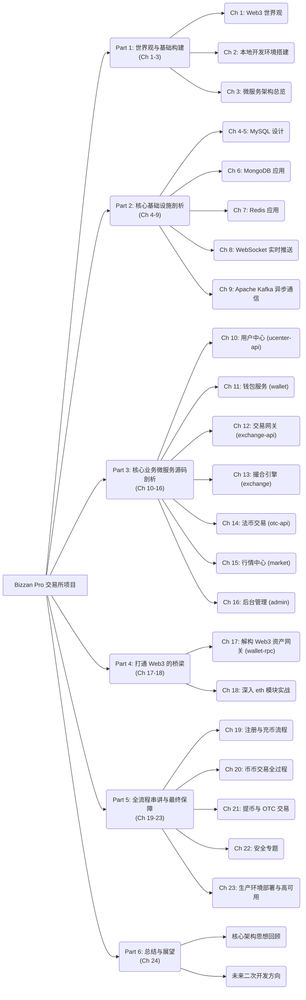
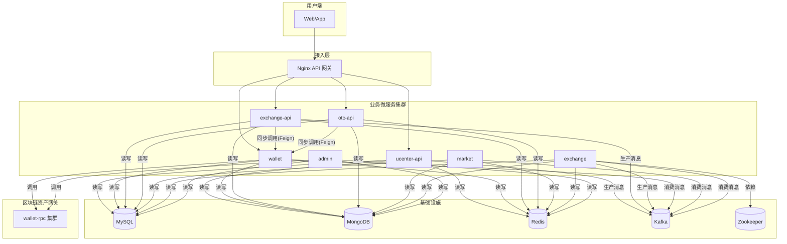

# Bizzan Pro：企业级、微服务架构的数字资产交易所

## 1. 项目概述

Bizzan Pro 是一个基于 **Spring Cloud** 微服务架构构建的、功能完备、安全可靠的企业级数字资产交易平台。它不仅涵盖了**币币交易**、**法币 C2C 交易 (OTC)**、**钱包充提**等交易所核心业务，更在架构层面实现了**高可用**、**高并发**与**高安全**的设计目标。

本项目旨在提供一个真实世界中复杂金融系统的全景式源码实现，让开发者能够深入理解从前端用户交互到后端服务协同、再到区块链资产交互的全链路技术细节。

### 1.1. 核心功能一览

*   **用户中心 (`ucenter-api`)**: 负责用户注册、登录、KYC 认证、安全设置（2FA）及 API Key 管理。
*   **钱包服务 (`wallet`)**: 管理用户的链下数字资产账本，支持多币种钱包的创建、余额查询、资产冻结/解冻与内部划转。
*   **币币交易 (`exchange-api` & `exchange`)**:
    *   **交易网关 (`exchange-api`)**: 提供下单、撤单、订单查询等 RESTful API，并负责前置的资产冻结。
    *   **撮合引擎 (`exchange`)**: 高性能的内存撮合引擎，支持限价单和市价单，采用“交易对级单线程模型”确保撮合的公平与高效。
*   **法币交易 (`otc-api`)**: 支持用户间的 C2C 交易，平台作为担保方，提供广告发布、下单、支付确认、放行和申诉仲裁的全套流程。
*   **行情中心 (`market`)**: 聚合实时成交数据，生成 K 线、深度图、最新 Ticker 等行情信息，并通过 WebSocket 向客户端实时推送。
*   **区块链资产网关 (`wallet-rpc`)**: 独立的、可扩展的 RPC 服务集群，负责与各公链节点（如 Bitcoin, Ethereum）直接交互，处理充值监控和提现广播。
*   **后台管理 (`admin`)**: 一个集权式的后台管理系统，拥有最高操作权限，负责运营、风控、仲裁、上币、资金归集等核心管理职能。

### 1.2. 技术栈核心

| 分类         | 技术                                                               | 描述                                                                 |
| :----------- | :----------------------------------------------------------------- | :------------------------------------------------------------------- |
| **后端框架** | `Spring Boot`, `Spring Cloud`                                      | 构建微服务应用的基础。                                               |
| **服务治理** | `Spring Cloud Alibaba Nacos`                                       | 服务注册、发现与配置中心。                                           |
| **服务调用** | `OpenFeign`                                                        | 声明式的、类型安全的 HTTP 客户端，用于服务间的同步 RPC 调用。        |
| **网关**     | `Nginx`                                                            | 作为反向代理和 API 网关，处理路由、负载均衡和 SSL 卸载。             |
| **数据库**   | `MySQL`, `JPA`                                                     | 核心业务数据的持久化存储。                                           |
| **时序数据库** | `MongoDB`                                                          | 存储 K 线等时序数据。                                                |
| **缓存/会话**  | `Redis`, `Spring Session Redis`                                    | 高性能缓存（行情、热点数据）与分布式会话管理。                       |
| **消息队列** | `Apache Kafka`                                                     | 整个系统的异步通信核心，用于服务解耦、削峰填谷和事件驱动。           |
| **权限控制** | `Apache Shiro`                                                     | `admin` 后台的认证与授权框架，结合 EhCache 实现高性能授权缓存。      |
| **实时推送** | `Netty` (自定义 `AQMD` 框架)                                       | `market` 服务用于向客户端推送实时行情数据的底层网络通信框架。        |
| **容器化**   | `Docker`, `Docker Compose`                                         | 应用的封装、交付与本地一键部署。                                     |
| **区块链交互** | `Web3j` (Ethereum), `bitcoin-rpc` (Bitcoin)                        | 与区块链节点进行 RPC 通信的客户端库。                                |

## 2. 项目全文大纲

## 3. 核心架构思想深度解析

### 3.1. “分而治之”：微服务架构的实践

系统被拆分为多个职责单一、边界清晰的微服务，每个服务都可以独立开发、部署和扩展，这极大地提升了复杂系统的可维护性和团队协作效率。

### 3.2. “运筹帷幄”：以 Kafka 为核心的异步解耦

`Apache Kafka` 是系统高性能和高可用的基石。通过精心设计的 Topic，实现了核心业务的异步化和模块间的深度解耦。

*   **`member-register`**: `ucenter-api` 在用户注册成功后发布，`wallet` 服务订阅此消息，异步为新用户初始化所有币种的钱包。
*   **`exchange-order`**: `exchange-api` 在完成资产同步冻结后，将订单送入此 Topic，由 `exchange` 撮合引擎消费。
*   **`exchange-trade`**: `exchange` 撮合引擎将成交记录发布到此 Topic，`wallet` 服务消费它进行资金结算，`market` 服务消费它来更新行情，两者并行处理，互不影响。
*   **`deposit` / `withdraw`**: `wallet-rpc` 网关和 `ucenter-api` 分别将充值和提现事件送入消息队列，由 `wallet` 服务统一调度处理。

这种**事件驱动**的模式，使得核心交易链路（撮合）可以不受下游服务（结算、行情）性能波动的影响，实现了完美的“削峰填谷”和故障隔离。

### 3.3. “动静分离”：同步与异步的协奏曲

系统对不同业务场景的实时性要求做了精妙的权衡，将同步调用和异步消息完美融合：

*   **同步操作 (立即响应)**:
    *   **用户注册/登录**: 必须立即返回结果。
    *   **下单前资产冻结**: `exchange-api` 通过 Feign 同步调用 `wallet`，确保资金有效性，是防止“空头支票”的关键。
    *   **OTC 下单锁币**: `otc-api` 同步调用 `wallet` 冻结商家资产，是 C2C 交易的信任基础。
*   **异步操作 (最终一致)**:
    *   **订单撮合与结算**: 订单进入 Kafka 后，后续的撮合、结算、行情更新均为异步处理，追求的是系统整体的吞吐量。
    *   **充值入账与提现处理**: 整个流程由 Kafka 事件驱动，保证了流程的可靠性和可追溯性。

### 3.4. “坚不可摧”：纵深防御的安全体系

安全是金融系统的生命线。本项目构建了一个从外到内、层层设防的纵深防御体系。

1.  **API 接口安全**:
    *   **请求签名机制**: 采用 `API-KEY` + `SECRET-KEY` + `HMAC-SHA256` 签名算法，在 `ApiSecretFilter` 中实现，有效防止请求被篡改和重放。
2.  **业务逻辑安全**:
    *   **人机验证**: 在注册、发短信等关键入口集成阿里云滑动验证，拦截自动化脚本攻击。
    *   **频率限制 (Rate Limiting)**: 基于 Redis 的原子 `INCR` 操作，可对 IP、用户 ID 等维度进行精细化的访问频率控制。
3.  **资金安全**:
    *   **冷热钱包分离**: 提现 RPC 服务部署在隔离网络，私钥物理隔离，大额资金存储在冷钱包。
    *   **大额提现人工审核**: `wallet` 服务内置工作流，可配置特定币种或金额阈值触发人工审批流程。
    *   **数据库悲观锁**: **这是资金安全的终极保障**。在 `MemberWalletService` 中，所有涉及资金变更的操作，都通过 `SELECT ... FOR UPDATE` 语句获取数据库行级锁，确保了在高并发场景下，对同一用户钱包操作的绝对串行化，从根本上杜绝了余额计算错误等致命问题。

### 3.5. “永不离线”：高可用架构设计

1.  **无状态服务 (Stateless)**:
    *   对于 `ucenter-api`, `wallet`, `exchange-api` 等无状态服务，借助 `Spring Session + Redis` 将会话外部化存储。这使得服务实例可以像“克隆军团”一样无限水平扩展，任何单点故障都能被负载均衡器自动摘除，对用户完全透明。
2.  **有状态服务 (Stateful)**:
    *   `exchange` 撮合引擎是典型的有状态服务，其内存中维护了完整的订单簿。为实现其高可用，采用**主备（Master-Slave）模式**，并借助 **Zookeeper** 的**临时节点**和**事件监听**机制实现**自动化的 Leader 选举和故障切换**。当 Master 宕机时，其中一个 Slave 能在秒级内自动提升为新的 Master，接管撮合业务。

## 4. 核心业务流程串讲

### 4.1. 用户注册与首次充币

1.  **注册**: 用户请求 `ucenter-api`，完成身份验证后，**同步**在数据库中创建 `Member` 记录并立即返回成功。随后，`ucenter-api` **异步**向 Kafka 发送 `member-register` 消息。
2.  **钱包初始化**: `wallet` 服务监听到消息后，为新用户在后台初始化所有币种的钱包。
3.  **获取地址**: 用户请求充币地址，`wallet` 服务检查若地址不存在，则通过 HTTP 调用 `wallet-rpc` 服务生成新地址并保存。
4.  **充值监控**: `wallet-rpc` 服务中的 `Watcher` 定时任务**轮询**区块链节点，发现属于平台用户的充值交易。
5.  **上账**: 交易达到足够的区块确认数后，`wallet-rpc` 向 Kafka 发送 `deposit` 消息，`wallet` 服务消费消息，在**数据库事务**和**幂等性检查**的保护下，为用户增加链下账本余额。

### 4.2. 币币交易全生命周期

1.  **下单与冻结 (exchange-api)**: 用户下单，`exchange-api` 首先通过 Feign **同步调用** `wallet` 服务，使用**数据库悲观锁**冻结用户相应资产。
2.  **入队 (exchange-api)**: 资产冻结成功后，订单被序列化并**异步发送**到 Kafka 的 `exchange-order` 主题。
3.  **撮合 (exchange)**: `exchange` 服务的 `CoinTrader` 消费订单，在基于 `TreeMap` 实现的内存订单簿中进行高效匹配，生成成交记录 (`ExchangeTrade`)。
4.  **广播结果 (exchange)**: 撮合完成后，将成交记录发送到 `exchange-trade` 主题，将完结的订单发送到 `exchange-order-completed` 主题。
5.  **并行处理 (wallet & market)**:
    *   `wallet` 服务消费 `exchange-trade`，在**数据库事务**中为买卖双方进行精确的资金结算（扣减冻结、增加可用）。
    *   `market` 服务消费 `exchange-trade`，更新 K 线、Ticker 等行情数据，并通过 WebSocket 推送给客户端。

### 4.3. 用户提币与 OTC 交易

*   **提币**: 一个由事件驱动的异步流程。`ucenter-api` 负责接收申请和前置风控 -> `wallet` 服务负责调度（包括可选的人工审核） -> `wallet-rpc` 负责执行链上广播 -> `wallet` 服务最终确认状态。
*   **OTC 交易**: 一个以平台为中心的担保交易模型。`otc-api` 负责流程编排，核心是下单时**同步冻结**商家资产，以及放行时**同步划转**资产给买家，`admin` 模块则作为纠纷的最终仲裁者。

## 5. 未来展望与二次开发指南

本项目是一个坚实的起点，您可以基于此进行丰富的二次开发和技术升级：

*   **拥抱云原生**: 为项目编写一套完整的 `Helm Chart`，实现一键部署到 `Kubernetes` 集群。
*   **追求极致性能**: 使用 `LMAX Disruptor` 等无锁并发框架重构 `exchange` 撮合引擎，挑战百万级 TPS。
*   **升级 Web3 监听**: 改造 `wallet-rpc`，使用 `WebSocket` 订阅节点事件，取代低效的 RPC 轮询，实现毫秒级链上事件响应。
*   **探索 CeDeFi**: 构建 `defi-gateway` 微服务，集成 `1inch` 等聚合交易协议，为用户提供最优的闪兑路径。

---

**你的征途是星辰大海！**
