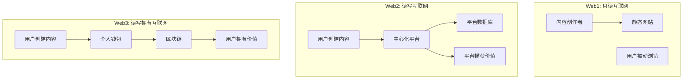
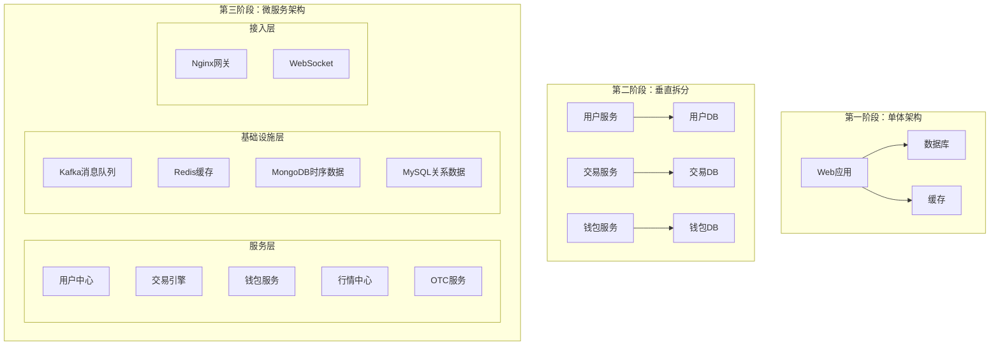

# 从零构建数字货币交易所：一次 Web3 金融科技系统的深度实践

## 引言：当面试官问你"能否从零搭建一个交易所"

"如果让你从零开始设计一个数字货币交易所，你会怎么做？"

这个面试问题让无数后端开发者心头一紧。交易所，这个听起来高大上的金融科技系统，似乎离我们的日常工作很遥远，却又在 Web3 浪潮中扮演着越来越重要的角色。当你每天处理着用户管理、订单处理、支付集成这些"普通"业务时，是否想过：这些技术如何支撑起一个每秒处理数万笔交易、涉及真金白银的金融系统？

更重要的是，当区块链、Web3 这些概念铺天盖地而来时，作为后端开发者，我们如何利用自己最熟悉的 Java、Spring Boot 技术栈，在这个新兴领域找到自己的位置？

这篇文章将带你踏上一段完整的旅程。我们不会停留在理论探讨，而是会亲手构建一个功能完备的数字货币交易所——Bizzan。在这个过程中，你将从一个单纯的应用开发者，蜕变为能够驾驭复杂金融系统的架构师。

## 第一章：Web3 的前世今生与未来展望

### 从 Web1 到 Web3 的演进历程

互联网的发展经历了三个重要阶段，每个阶段都重新定义了信息的创建、分发和价值捕获方式。

**Web1（1990-2004）**：这是"只读"的互联网时代。少数内容创作者向广大被动受众提供信息，网站主要是静态的 HTML 页面。用户只能浏览信息，无法参与内容创建。这个时代的代表是新浪、搜狐等门户网站，它们垄断了信息的发布权。

**Web2（2004-现在）**：这是"读写"的互联网时代，也被称为"社交网络时代"。用户不再只是被动接收信息，而是能够创建和分享内容。Facebook、Twitter、YouTube 等平台崛起，用户生成内容（UGC）成为主流。然而，这些中心化平台掌握了数据的控制权，用户创造的价值大部分被平台捕获。

**Web3（2020-未来）**：这是"读写拥有"的互联网时代。用户不仅能够创建内容，还能够拥有自己的数据和数字资产。通过区块链技术和密码学，Web3 实现了数据的去中心化存储和价值的确权。这是从"信息互联网"向"价值互联网"的根本转变。

### Web3 的核心特征与技术基石

Web3 不是一个单一的技术，而是一个由多种技术构成的复杂生态系统。它的核心特征建立在四个技术支柱之上：

**去中心化网络**：Web3 应用运行在去中心化的网络上，没有单点故障，也不容易被审查。这种架构保证了服务的持续可用性和抗审查性。

**数字身份主权**：用户通过钱包和私钥控制自己的数字身份。这个身份可以在不同应用间无缝迁移，不受任何中心化平台控制。

**数据所有权**：用户的个人数据和数字资产存储在区块链上，只有拥有私钥的用户才能访问和控制。这从根本上改变了 Web2 时代的数据所有权关系。

**价值互联网**：区块链的原生代币和智能合约使得价值可以在互联网上直接传递，无需通过传统的金融中介。

### Web3 与区块链的关系辨析

很多人经常混淆 Web3 和区块链的概念，实际上它们有着明确的区分和联系。

**区块链是技术基础**：区块链是支撑 Web3 愿景的核心技术基础设施。它提供了去中心化的数据存储、共识机制和密码学安全保障。没有区块链，Web3 关于用户主权和去中心化的承诺就无从实现。

**Web3 是应用愿景**：Web3 是建立在这个技术基础之上的应用生态和愿景。它包含了一系列的去中心化应用（DApp）、协议和标准，旨在重新定义互联网的运作方式。

**关系类比**：如果说区块链是互联网的 TCP/IP 协议，那么 Web3 就是建立在这个协议之上的万维网、电子邮件和各种应用。区块链提供了底层的信任机制和数据结构，而 Web3 则在这个基础上构建了丰富的应用层。

## 第二章：Web3 在中国的发展现状与机遇挑战

### 中国 Web3 发展的政策环境

中国对 Web3 和区块链技术采取了"技术鼓励、应用谨慎"的政策导向。在技术研发层面，国家大力支持区块链技术创新，将其列为新基建的重要组成部分。2020 年，国家发改委正式将区块链纳入新型基础设施范围，各地方政府纷纷出台支持政策。

然而，在应用层面，特别是涉及加密货币和金融活动方面，监管政策相对严格。2017 年禁止 ICO 融资，2021 年进一步禁止加密货币交易和挖矿活动。这并不意味着中国反对 Web3 技术，而是希望在金融稳定的前提下，有序推进区块链技术的应用。

### 中国 Web3 产业的技术特色

在这样的大环境下，中国 Web3 产业呈现出独特的发展特点：

**联盟链优先**：相比于公有链，中国企业更倾向于发展联盟链。蚂蚁链、腾讯云区块链、百度超级链等都是典型的联盟链平台，主要服务于企业级应用场景。

**产业区块链**：中国 Web3 应用更多聚焦于实体产业的数字化转型，包括供应链金融、产品溯源、政务服务等。这符合"技术服务实体经济"的发展导向。

**数字人民币**：作为央行数字货币，数字人民币的推广为 Web3 在中国的发展提供了新的基础设施和应用场景。

**NFT 数字藏品**：中国的 NFT 市场以"数字藏品"的形式存在，避免了加密货币的交易，专注于文化产权和艺术品的数字化。

### 中国 Web3 人才需求与技术机会

尽管面临政策限制，中国对 Web3 技术人才的需求依然旺盛。主要机会集中在以下几个领域：

**传统企业的区块链转型**：银行、保险、供应链等传统行业需要大量懂区块链的技术人才来推动数字化转型。

**联盟链技术开发**：各大科技公司都在投入联盟链平台的开发，需要既懂区块链又懂业务场景的复合型人才。

**Web2.5 应用开发**：在合规框架下，将 Web3 技术与传统互联网应用结合，创造新的商业模式。

**跨境 Web3 业务**：中国企业在海外开展 Web3 业务，需要大量了解国际 Web3 生态的技术人才。

## 第三章：Web3 交易所的核心概念与业务模式

### 数字货币交易所的定义与分类

数字货币交易所是连接传统金融世界与 Web3 加密世界的重要桥梁，是整个区块链生态系统的核心基础设施。从不同的技术架构和运营模式来看，交易所可以分为以下几种类型：

**中心化交易所（CEX）**：由公司运营的传统交易所模式。用户将资产充值到交易所控制的地址，交易在平台内部数据库完成，具有高性能、低成本、易用性强的特点。典型代表包括币安、火币、OKX 等。

**去中心化交易所（DEX）**：基于智能合约的点对点交易平台。用户始终控制自己的资产，交易在链上完成，具有安全性高、抗审查的特点。典型代表包括 Uniswap、PancakeSwap 等。

**混合交易所**：结合 CEX 和 DEX 优点的创新模式，通常采用链下撮合、链上结算的架构。

**托管交易所**：专注于为机构用户提供数字资产托管和交易服务的专业平台。

### Web3 交易所的核心业务功能

一个完整的 Web3 交易所通常包含以下核心业务模块：

**用户中心**：负责用户注册、KYC 认证、安全管理等基础服务。在合规要求下，交易所需要对用户进行实名认证，并建立完善的安全防护机制。

**钱包服务**：管理用户的数字资产，包括充值、提现、余额查询等功能。钱包服务是交易所最核心的模块之一，直接关系到用户资产安全。

**交易引擎**：处理用户的买卖订单，进行价格撮合和交易执行。这是交易所的技术核心，需要具备高并发、低延迟的特性。

**行情中心**：收集、处理和分发市场行情数据，包括实时价格、K 线图、深度图等。行情数据是交易决策的重要依据。

**法币交易（OTC）**：提供法币与数字货币之间的兑换服务，是连接传统金融与加密世界的重要通道。

**资产管理**：为用户提供理财、借贷等增值服务，帮助用户实现资产的保值增值。

### 交易所的技术架构演进

现代交易所的技术架构经历了从单体应用到微服务架构的演进过程：

## 第四章：Bizzan 交易所的技术选型与架构设计

### 微服务架构的详细设计

Bizzan 交易所采用基于 Spring Cloud 的微服务架构，将复杂的交易系统拆分为多个独立的服务模块：

**用户中心服务（ucenter-api）**：负责用户注册、登录、KYC 认证、权限管理等核心用户功能。采用 Spring Security + JWT 实现安全认证，支持多种登录方式。

**钱包服务（wallet）**：管理用户的数字资产，包括多币种支持、充值提现、余额查询、交易记录等。采用热冷钱包分离策略，确保资产安全。

**交易网关服务（exchange-api）**：提供统一的交易接口，处理订单提交、查询、撤单等操作。作为用户与撮合引擎之间的桥梁。

**撮合引擎服务（exchange）**：核心的交易撮合引擎，实现订单簿管理、价格撮合、成交确认等功能。采用内存计算技术，实现毫秒级撮合性能。

**行情中心服务（market）**：负责 K 线生成、行情推送、深度计算等市场数据服务。通过 WebSocket 实现实时行情推送。

**法币交易服务（otc-api）**：处理法币与数字货币的交易，包括商户管理、订单匹配、资金清算等功能。

**后台管理服务（admin）**：提供系统管理、运营数据统计、风险控制等后台功能。

**主流区块链节点服务（btc-rpc）**：集成与比特币、以太坊等主流区块链节点的 RPC 通信，实现链上数据同步、交易、钱包管理等功能。

## 总结：构建 Web3 交易所的技术收获

通过构建 Bizzan 交易所这个项目，我们不仅能学习具体的技术实现，更重要的是建立了一套完整的金融科技系统开发思维。

**技术能力的全面提升**：从单纯的 CRUD 开发者成长为能够设计和实现复杂分布式系统的架构师。掌握微服务架构、高并发处理、分布式缓存、消息队列等核心技术。

**金融业务的深度理解**：深入理解数字货币交易所的业务逻辑，包括撮合机制、资金安全、合规要求等金融科技的核心要素。

**Web3 技术的实践经验**：掌握与比特币、以太坊等主流区块链网络集成的方法，理解 Web2 与 Web3 系统融合的技术路径。

**系统安全的系统性思维**：建立从应用到基础设施的全方位安全防护意识，掌握金融级系统的安全设计原则。

Web3 的浪潮正在重塑互联网的格局，作为后端开发者，掌握这些核心技术不仅能让我们在这个新兴时代找到自己的位置，更能为我们打开一扇通往未来的技术之门。

现在，让我们开始这段激动人心的技术旅程，从下一章开始，我们将正式进入实战阶段，搭建我们的开发环境，一步步构建这个完整的 Web3 金融科技系统。
