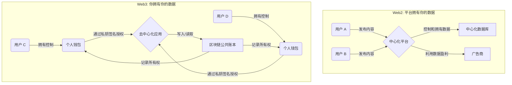
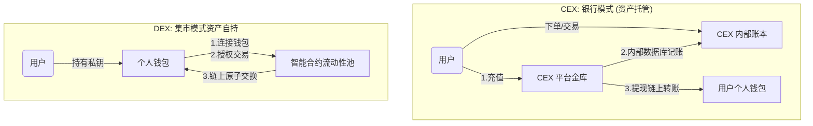

# 第一章：从代码到信仰，开启你的Web3架构师远征

你是否曾想象过，亲手构建一个每秒处理数百万美元交易、永不休眠的金融帝国？一个在数字世界中，财富瞬息万变的前沿阵地？这，就是加密货币交易所的世界。而这，也正是我们即将踏上的征程。

在接下来的22堂课中，我们不仅仅是在编写代码，我们是在铸造一个真实、复杂、可运营的金融科技系统。这趟旅程，将带你深入分布式系统、金融科技与区块链技术交汇的核心地带。

在敲下第一行代码之前，本章将是我们的“**战略地图**”。我们将暂时放下“**How**”（如何实现），而聚焦于“**Why**”（为何而来，去往何处）。我们将共同探索，为何构建交易所是通往Web3世界的最佳路径？这趟远征将如何淬炼你的技术，让你实现从“应用开发者”到“系统架构师”的跃迁？以及，Web3、区块链、CEX、DEX……这些令人眼花缭乱的术语背后，究竟隐藏着怎样的技术变革与价值信仰？

理解宏大的叙事，才能洞悉微观的技术决策。现在，让我们正式启程，从上帝视角，一窥Web3世界的全貌。

---

### 你的技术跃迁之路：从执行者到架构师

这门课程，是为那些渴望突破技术瓶颈、实现职业生涯跃迁的后端开发者量身打造的。

或许你已熟练掌握Java与Spring Boot，但日常工作却被“增删改查”的循环所束缚，渴望能驾驭更波澜壮阔的业务海洋。或许你对高并发、分布式系统有着扎实的理论功底，却始终缺少一个能让你尽情施展、将理论化为实战经验的宏大战场。又或许，你对Web3与区块链的浪潮心驰神往，却不知如何将自己的一身武艺，应用于这片充满机遇的新大陆。

如果这正是你的写照，那么恭喜你，来对地方了。我们不要求你具备任何金融或区块链的预备知识，这趟旅程将从原点开始，为你扫清所有概念的迷雾。

这绝不是一个简单的CRUD教学项目。它是一个集**高并发金融系统设计、分布式微服务架构、区块链技术对接、海量数据处理**于一体的综合性实战平台。当旅程结束时，你收获的将不再是零散的知识点，而是一套可以直接应用于任何复杂企业级项目的完整知识体系与架构思想。你将能独立设计并实现复杂的微服务架构，从容应对瞬时流量洪峰；你将深入理解**订单簿（Order Book）**与**撮合引擎（Matching Engine）**等金融业务核心，能与产品经理在同一频道上高效对话；你将亲手打通Web2与Web3的技术壁垒，掌握与比特币、以太坊等主流公链安全交互的全过程。

**一言以蔽之：我们的目标，是让你完成从一个被动执行需求的“应用开发者”，到一名能够主动主导复杂系统设计的“架构师”的终极蜕变。**

---

### 互联网的范式转移：从“平台的数据”到“你的数据”

要理解我们为何要构建一个Web3应用，就必须先洞悉它与我们所熟悉的Web2互联网之间，那条看似无形却又深刻无比的鸿沟。

**Web2的世界，是一个由中心化平台构建的“数据围墙花园”。** 想象一下，你在社交媒体上发布了一张凝聚心血的摄影作品。这张照片为你赢得了无数点赞，但它的数据本身，却被永久地囚禁在平台的服务器里。平台拥有这些数据，可以分析你的喜好向你精准推送广告，甚至可以在特定规则下审查、删除你的内容。在这个世界里，**你创造了价值，但平台却捕获了绝大部分价值。我们每个人，在某种意义上，都成为了平台的产品。**

**而Web3，则致力于打破这堵围墙，开启一个“数据主权归于用户”的全新时代。** 它的核心是去中心化与用户所有权。让我们再次回到那个场景：现在，你将这张照片发布在一个Web3的社交应用（DApp）上。这张照片，作为一种独一无二的数字资产（NFT），它的所有权被清晰地记录在**区块链**这个全球共享的公共账本之上。它被存储在哪里、谁能访问它，完全由你通过**钱包（Wallet）**中的**私钥（Private Key）**来掌控。没有你的授权，任何人都无法转移或删除它。在这个新世界里，**你创造了价值，你也真正地拥有价值。**

从Web2到Web3的范式转移，其本质是**数据所有权的回归**，从平台之手，交还到用户个人手中。而实现这一伟大变革的技术基石，正是区块链。

---

### 区块链与数字货币：当代码成为信任

区块链，这个听起来高深莫测的词汇，其核心理念却异常质朴。

你可以把它想象成一个**全世界都能查看、但任何人都无法篡改的共享数字账本**。当有人想在这个账本上记录一笔交易时，他需要向全球网络广播这个请求。网络中成千上万的“会计师”（即矿工或验证者）会同时开始工作，验证这笔交易是否符合规则。一旦大多数“会计师”达成共识，这笔交易就会被盖上一个独一无二的时间戳，被永久地封装进一个“区块”，然后像链条一样，紧紧地扣在之前一个区块之后。正是这种环环相扣的结构，使得篡改任何一个历史区块都变得几乎不可能，因为这意味着要重塑其后所有的链条，这会被整个网络瞬间察觉并拒绝。

**区块链的核心价值，就是通过密码学和共识机制，用冰冷、精确的代码和数学，构建起了一种无需任何第三方权威机构背书的、机器级别的信任。**

**比特币（Bitcoin）**，正是这套信任机器的第一个惊世之作。它巧妙地利用区块链这个“账本”，专心只做一件事：记录谁拥有多少比特币，以及它们是如何流转的。它成功地创造了一个全球化的、点对点的电子现金系统。

而**以太坊（Ethereum）**则展现了更宏大的野心，它将区块链从一个“全球账本”升级为了一台“**世界计算机**”。以太坊的革命性创举在于引入了**智能合约（Smart Contract）**。我们可以把智能合约想象成一个部署在区块链上的**“自动售货机”**。它的所有运行规则（例如“投入1元，掉出一瓶可乐”）都被预先写在代码里，公开透明，一旦部署，它就会像物理定律一样自动、精确地执行，任何人——包括它的创建者——都无法干预或篡改。

智能合约的出现，极大地释放了区块链的潜力，让开发者能够在其上构建去中心化金融（DeFi）、游戏（GameFi）、社交等无穷无尽的应用。我们课程中将会频繁接触到的ERC20代币，正是基于以太坊智能合约发行的一种标准化数字资产。

---

### Web3世界的十字路口：CEX vs DEX

为了让数字资产能够方便地流通和交易，交易所应运而生。在Web3的世界里，它主要演化出了两种截然不同的形态：中心化交易所（CEX）与去中心化交易所（DEX）。

**中心化交易所（CEX），更像是一家传统的“数字货币银行”**，例如我们熟知的币安（Binance）和Coinbase。当你使用CEX时，首先需要将你的数字货币（如BTC）从个人钱包“充值”到CEX为你分配的地址。在这一刻，**资产的实际控制权暂时转移给了平台**。你在网站上进行的买卖、下单等所有操作，实质上都只是CEX在其内部中心化数据库里修改数字，这个过程不发生在区块链上，因此**速度极快、成本极低**，为用户提供了丝滑的交易体验。只有当你需要“提现”，将资产转回自己的个人钱包时，CEX才会发起一笔真正的链上转账。

**而去中心化交易所（DEX），则像一个开放、透明的“数字集市”**，其中的代表是Uniswap。在这里，没有中间商，所有的交易都由部署在区块链上的**智能合约**（我们前面提到的“自动售货机”）直接完成。你只需连接自己的个人钱包，它始终在你自己的掌控之中。当你看到一个“苹果-香蕉”的交易合约时，你直接通过钱包授权，与合约进行点对点的资产交换。**资产从未离开你的控制**，交易完成后，钱货两清，公开透明。

总的来说，CEX以其**高性能和友好的用户体验**，成为了绝大多数用户进入Web3世界的第一站，但用户需要信任平台。而DEX则以其**非托管和去中心化**的特性，完美契合了Web3的“用户主权”精神，但其性能和使用门槛目前仍有待提高。

---

### 我们的战略选择：为何从构建一个CEX开始？

既然DEX在理念上如此契合Web3精神，为何我们的课程却选择构建一个技术上看似更“传统”的CEX呢？这是一个深思熟虑的战略选择，其背后蕴含着巨大的学习价值。

首先，**一个高性能的CEX是现代后端技术的集大成者**。它要求我们必须综合运用微服务、高并发处理、低延迟通信、撮合算法、复杂的账户系统以及严苛的资金安全策略。这套技术栈的**普适性极强**，一旦掌握，你完全可以将其无缝平移到秒杀系统、实时竞价广告等任何要求严苛的高并发互联网场景中，其学习价值远远超出了区块链本身。

其次，**CEX是连接现实世界（法币）与Web3世界（加密货币）最重要的桥梁和入口**。目前，绝大多数用户都是通过CEX完成第一笔加密货币的购买。学习构建CEX，能让我们站在“两个世界”的交汇点，深刻理解资金是如何在现实与数字之间安全、高效流转的。这其中，就包含了与区块链节点进行RPC交互、监控链上充值、广播提现交易等一系列核心的Web3对接技术。

最后，**CEX拥有更完整、更复杂的业务闭环**。它涵盖了用户身份认证（KYC）、法币通道（OTC）、币币交易、资产管理等一整套金融产品逻辑，能让我们从一个更全面的视角，学习金融系统的设计与实现。

因此，本项目的最终定位是：
> **以构建一个企业级的、基于微服务架构的中心化交易所（CEX）为载体，深入学习和实践分布式、高并发金融系统的设计与开发，同时掌握与主流区块链网络进行交互的核心Web3对接技术。**

---

### 我们的远征地图：五段式进阶之旅

为了让你在这趟技术远征中始终保持清晰的方向感，我们将整个课程严格地划分为五个循序渐进的核心阶段。

**第一阶段：基础与准备。** 这是我们远征的起点。我们将首先建立宏观的Web3世界观，然后亲手搭建起支撑我们整个项目的本地开发环境，并对项目的整体微服务架构进行一次全面的“阅兵”，让你对全局了然于胸。

**第二阶段：核心基础设施剖析。** 在这个阶段，我们将深入交易所赖以生存的“水电煤”系统。我们将逐一拆解并精通MySQL、MongoDB、Redis、Kafka等核心中间件，以及一个高性能的自定义WebSocket框架，为你打下坚实的基础。

**第三阶段：核心业务微服务源码剖析。** 这是课程的主体和核心。我们将像解剖精密仪器一样，逐一深入`ucenter-api`（用户中心）、`wallet`（钱包）、`exchange-api`（交易网关）、`exchange`（撮合引擎）、`market`（行情）等所有核心微服务的源码，洞悉其设计思想与实现细节。

**第四阶段：打通Web3的桥梁。** 在这里，我们将真正踏入Web3的世界。我们将深入`bizzan_wallet_rpc`项目，学习如何与比特币/USDT和以太坊/ERC20网络进行真实的RPC交互，实现资产的充值监控与提现广播。

**第五阶段：全流程串讲与总结。** 最后的冲刺阶段，我们将通过用户注册与充币、币币交易、提币与OTC这三个最核心的业务流程，将前面所有学到的知识点串联成线，形成一张完整的知识网络，最后进行课程的总结与展望。

---

## 总结与起航

在本章中，我们并未触及一行代码，却完成了一次至关重要的思想武装。我们从Web3的宏大叙事出发，用生动的类比理解了区块链、智能合约等核心概念，并清晰地辨析了CEX与DEX的核心差异。最终，我们明确了本次课程的战略目标、核心收益和一份精确的进阶路线图。

现在，我们已经站在了地图的起点，对前方的道路、挑战与机遇都有了清晰的认识。从下一章开始，我们将正式进入实战，挽起袖子，从零开始搭建我们的开发环境。

准备好，迎接这场激动人心的挑战吧！