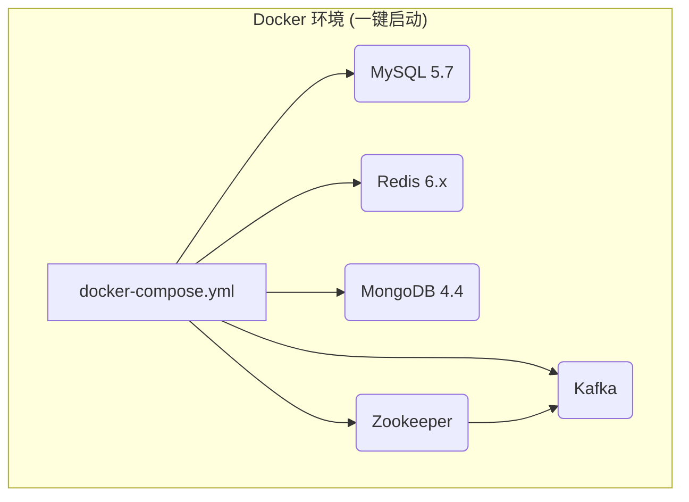

# 第二章：铸造工厂——为你的交易所帝国奠基

## 开篇：工欲善其事，必先利其器

在上一章的宏观探索之后，我们需从云端回到地面，开始工程师最坚实的一步——搭建一个稳定、高效的本地开发环境。这如同为一座摩天大楼打下坚实的地基，是后续一切宏伟蓝图得以实现的前提。

本章将作为一份精确的施工图纸，引导你一步步安装所有必要的软件，配置好各个中间件，并最终点亮项目的“心脏”——服务注册中心。请保持耐心和细致，因为当我们完成这一章时，你的本地机器将不再仅仅是一台电脑，而是一个能够孕育出整个交易所系统的“**数字工厂**”。

---

### 第一节：备齐核心工具箱：从 JDK 到 IDEA

我们的工厂建设始于基础工具的准备。首先是 **JDK 1.8**，作为 Java 开发的基石，它是我们编写和运行所有后端代码的动力源泉。接下来是 **Maven**，我们强大的项目“物料管理员”，它能自动下载和管理项目所需的所有第三方库。最后，我们需要一个高效的集成开发环境 **IntelliJ IDEA** 和版本控制工具 **Git**。IDEA 是我们进行编码、调试的“主控台”，而 Git 则是我们从代码仓库获取蓝图（源码）并管理每一次修改的“版本记录仪”。

---

### 第二节：启动基础设施：Docker 一键部署“五脏六腑”

我们的交易所系统依赖于一个强大的后端服务集群，包括用于核心数据存储的 **MySQL**，作为高性能缓存的 **Redis**，存储时序数据的 **MongoDB**，以及作为系统异步通信总线的 **Kafka**。

传统的手动安装方式不仅繁琐且易出错，因此我们采用现代企业开发的主流方式——**Docker Compose 一键部署**。在项目源码的**根目录**下，我们已经提供了一个 `docker-compose.yml` 文件，它像一张预设的蓝图，定义了所有依赖服务。

你只需在该文件所在的目录下打开命令行，运行 `docker-compose up -d` 命令。Docker 便会自动拉取镜像，并以后台模式启动所有服务。稍等片刻，通过 `docker ps` 命令，你就能看到所有服务容器都已成功运行，标志着我们交易所的“五脏六腑”已全部就位并开始健康运转。

---

### 第三节：导入项目蓝图：源码配置与数据库初始化

基础设施就绪后，我们需要将项目的“设计蓝图”——也就是源码——导入我们的开发主控台 IDEA 中。使用 Git 克隆项目源码到本地后，在 IDEA 中将 `01_bizzan_framework/pom.xml` 和 `02_bizzan_wallet_rpc/pom.xml` 作为 Maven 项目导入。

源码导入后，我们需要为交易所准备好“数据仓库”。使用任何数据库客户端连接到 Docker 中运行的 MySQL 服务，创建一个名为 `bitrade` 的新数据库，并**务必选择 `utf8mb4` 作为字符集**（这对于支持全球用户，包括存储 Emoji 表情等至关重要）。最后，执行 `01_bizzan_framework/sql/bitrade.sql` 文件中的所有 SQL 语句，完成表结构的创建和初始数据的填充。

---

### 第四节：点亮指挥中心：运行 Eureka 注册中心

在启动庞大的微服务舰队之前，我们必须先启动整个架构的“交通指挥中心”——**Eureka 服务注册中心**。在 IDEA 的项目结构中，找到 `cloud` 模块下的 `CloudApplication.java` 文件并运行它。当控制台输出启动成功的日志后，立即在浏览器中访问 `http://localhost:7000`。如果你能看到 Eureka 的管理界面，那么恭喜你，我们“数字工厂”的中央控制系统已经成功点亮！

至此，我们的工厂已经通电，并为后续所有生产线的启动做好了准备。在下一章，我们将逐一“点亮”交易所的所有微服务，让整个系统在你的本地机器上完整地运转起来，并一窥其震撼的微服务架构全貌！