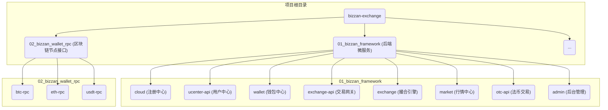
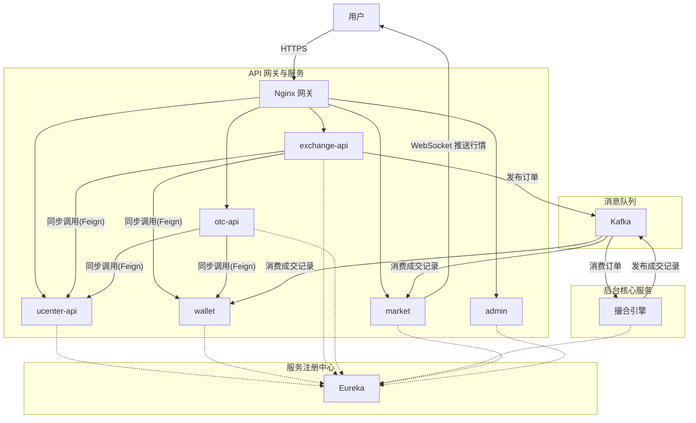

# 第三章：项目启动与微服务架构总览

## 引言

在上一章中，我们完成了本地开发环境的搭建。当前，项目代码还处于静态状态。本章的核心任务，是将这些代码模块转变为一个动态运行、协同工作的分布式系统。我们将剖析本项目的微服务架构，理解其设计，并遵循正确的顺序，在本地启动整个交易所系统。

这个过程将帮助我们深入理解一个复杂系统是如何被拆解、组织和协作的。你将清晰地看到系统是如何由多个内聚的服务单元构成，以及它们之间如何通过同步调用和异步消息进行通信。

---

### 第一节：项目代码结构

启动服务之前，我们先审视项目的代码目录结构。

- **`01_bizzan_framework`**: 项目核心，包含了基于 Spring Cloud 实现的所有后端微服务。
- **`02_bizzan_wallet_rpc`**: 区块链适配层。它封装了与不同公链节点的交互细节，为核心业务系统（特别是 `wallet` 服务）提供统一、简单的 RPC 接口，实现了业务逻辑与底层链操作的解耦。

---

### 第二节：核心微服务职责

`01_bizzan_framework` 项目内包含了多个独立的微服务模块，各自承担不同的职责。

| 微服务模块 | 核心职责 |
| :--- | :--- |
| **`cloud`** | 基于 Eureka 实现的服务注册与发现中心。所有微服务启动后都在此注册，并从这里获取其他服务的地址。 |
| **`ucenter-api`** | 用户中心，负责用户的注册、登录、身份验证 (KYC)、安全设置等功能。 |
| **`wallet`** | 钱包与资产中心，管理用户资金账户、处理充值、提现请求，并记录资产变动。 |
| **`exchange-api`** | 币币交易网关，面向用户提供币币交易的接口，负责接收下单、撤单请求，并进行参数校验和资产冻结。 |
| **`otc-api`** | 法币交易网关，提供法币与数字货币之间的 C2C 交易功能，包括广告发布、下单、申诉等。 |
| **`market`** | 行情中心，聚合来自撮合引擎的成交数据，生成 K 线、买卖盘深度，并通过 WebSocket 进行实时行情推送。 |
| **`exchange`** | 撮合引擎，交易系统的核心。它从 Kafka 中消费订单，在内存中进行高速的买卖盘匹配，并将成交结果写回 Kafka。 |
| **`admin`** | 后台管理，为运营人员提供管理后台的 API 接口，用于币种管理、用户审核、财务对账等。 |

---

### 第三节：核心技术栈

本项目采用业界主流且成熟的技术栈构建，确保系统的高性能、高可用和可扩展性。

| 技术分类 | 主要技术 | 用途说明 |
| :--- | :--- | :--- |
| **后端框架** | Spring Boot | 提供快速、便捷的 Java 应用开发框架，简化了配置和部署。 |
| **微服务治理** | Spring Cloud | 提供了一整套微服务解决方案，本项目主要使用了： - **Eureka**: 服务注册与发现。 - **Feign**: 服务间的声明式 REST 调用。 - **Gateway/Nginx**: 作为 API 网关，处理路由、鉴权等。 |
| **消息队列** | Apache Kafka | 高吞吐量的分布式发布订阅消息系统，用于核心业务（如交易撮合）的异步解耦和数据缓冲。 |
| **关系型数据库** | MySQL | 存储核心的业务数据，如用户信息、账户资产、订单等需要强事务一致性的数据。 |
| **NoSQL 数据库** | MongoDB | 文档型数据库，主要用于存储web3用户账户，K 线等时序数据和非结构化数据。 |
| **内存数据库** | Redis | 高性能的键值存储，用于实现缓存（如行情数据、用户会话），提升系统响应速度。 |
| **实时通信** | WebSocket | 在 `market` 服务中使用，向客户端实时推送行情、深度等数据。 |

---

### 第四节：系统架构

各服务之间通过同步调用（Feign）和异步消息（Kafka）进行通信，形成一个完整的分布式系统。

从架构图可见，`exchange-api` 等面向用户的服务，会直接同步调用 `ucenter-api` 和 `wallet` 这两大基础服务。而核心的 `exchange` (撮合引擎) 与 `exchange-api` (交易网关) 之间没有直接的同步调用关系，它们通过 Kafka 实现了异步解耦，这是保障系统高性能的关键设计。

---

### 第五节：服务启动顺序

服务间的依赖关系决定了它们必须按照特定的顺序启动。错误的启动顺序会导致服务注册失败或调用异常。

**基本原则**：
- **基础设施先行**：服务注册中心必须是第一个启动的。
- **基础服务次之**：提供核心数据和功能的底层服务（如用户、钱包）需要先于业务服务启动。
- **上层应用最后**：依赖基础服务的业务应用在最后启动。

**推荐启动顺序**：

1.  **`cloud` (Eureka Server)**
    - **原因**：作为服务注册中心，所有其他服务都需要向它注册并发现彼此。它必须是第一个启动的，为整个微服务网络提供服务发现能力。

2.  **`ucenter-api` (用户中心)**
    - **原因**：提供用户身份验证和基础信息，是许多其他业务的前置依赖。

3.  **`wallet` (钱包中心)**
    - **原因**：管理用户资产，交易、法币等模块都强依赖于它提供的资产查询和操作接口。

4.  **`exchange-api`, `otc-api`, `market`**
    - **原因**：这些是面向用户的核心业务网关和服务。它们依赖 `ucenter-api` 和 `wallet` 来完成自身功能，因此需要在后两者启动成功之后再启动。`market` 依赖 `exchange` 产生的成交数据，但它可以先启动并等待数据。

5.  **`exchange` (撮合引擎)**
    - **原因**：作为后台核心处理服务，它通过 Kafka 与 `exchange-api` 解耦。它可以与其他业务服务并行启动，或者稍后启动。它会持续监听 Kafka 中的订单消息进行处理。

6.  **`admin` (后台管理)**
    - **原因**：后台管理系统，依赖于各个核心服务。通常可以最后启动。

**总结启动列表**:
1. `cloud`
2. `ucenter-api`
3. `wallet`
4. `exchange-api`
5. `otc-api`
6. `market`
7. `exchange`
8. `admin`

---

## 总结与展望

在本章中，我们通过分析项目结构、服务职责和系统架构，对整个交易所系统有了宏观的认识，并明确了正确的服务启动顺序。现在，我们对系统的“骨架”和“神经网络”有了清晰的认识。从下一章开始，我们将深入系统的“血肉”，从**数据库设计**入手，详细剖析支撑整个业务体系的用户与资产数据模型。