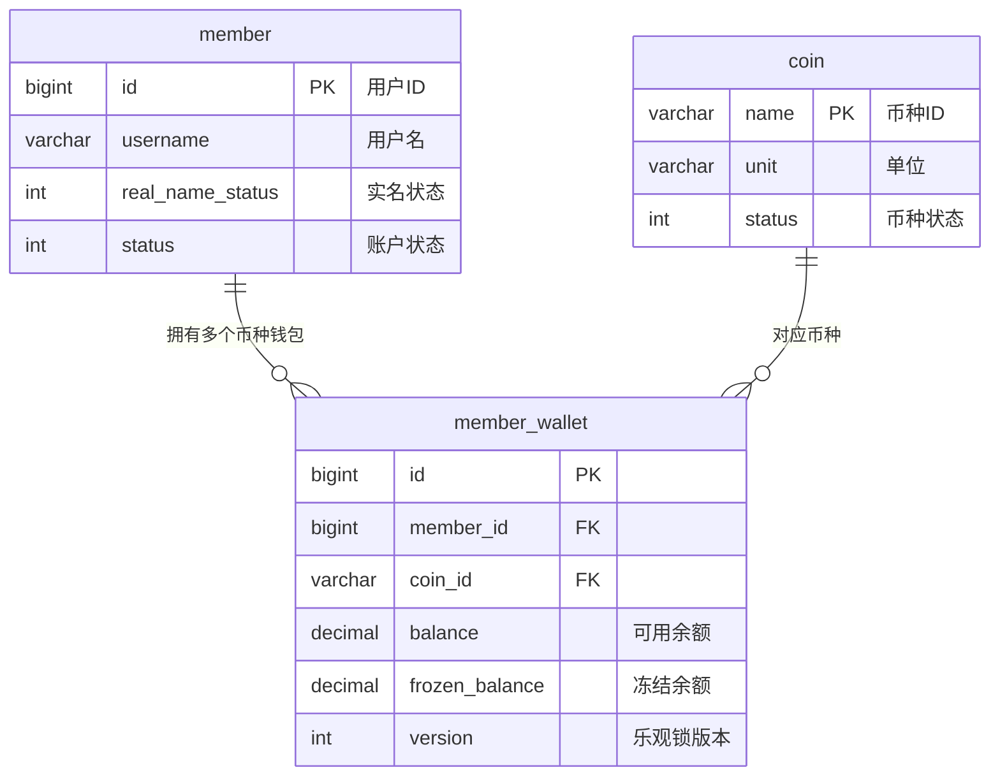
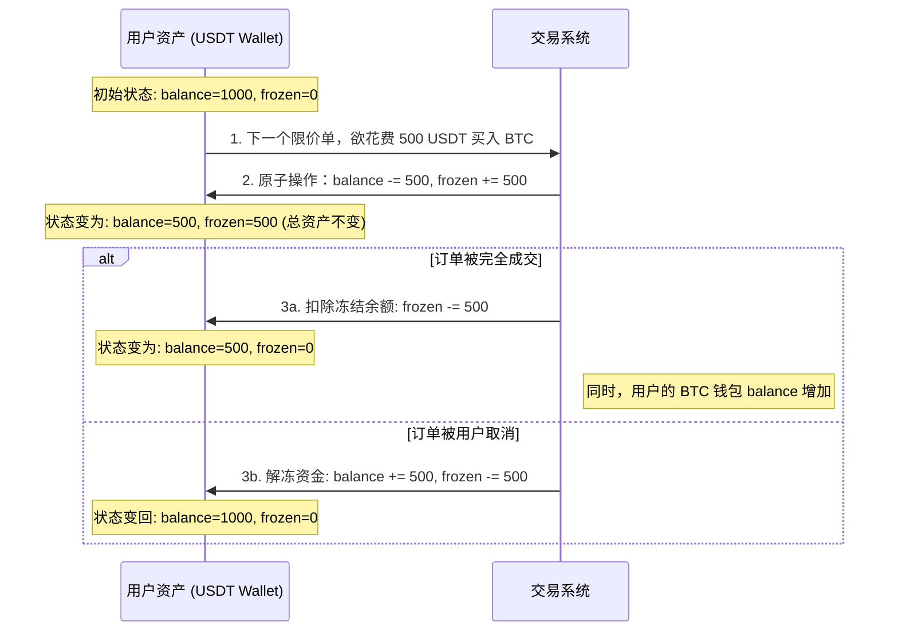
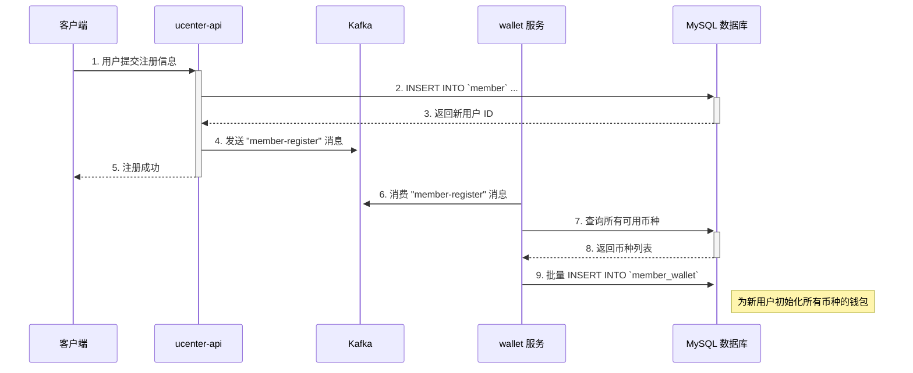

# 第四章：数字身份与财富基石——用户与资产模型设计

## 开篇：构建金融系统的核心数据模型

在宏观地审视了系统的微服务架构之后，我们必须深入其最核心的基石——数据库设计。对于一个金融系统而言，数据模型的严谨性、一致性和安全性是其赖以生存的生命线。本章，我们将化身“数据架构师”，专注于构建交易所两大基础领域：**用户 (User)** 和**资产 (Asset)** 的数据模型。

我们将详细剖析 `member`、`member_wallet`、`coin` 等核心数据表，不仅会逐个字段解读其业务含义，更会将其与项目 `01_bizzan_framework` 中的 JPA 实体类紧密关联，并深入探讨索引优化、并发控制等关键的工程实践。

---

### 第一节：设计哲学——账户模型的三大支柱

在设计任何账户系统时，我们都需要清晰地回答三个基本问题：**谁 (Who)** 拥有资产？**拥有什么 (What)** 资产？资产**如何变化 (How)**？

基于此，我们的数据库设计严格遵循**职责分离**的原则，构成了账户模型的三大支柱：
*   **`member` 表**：它只负责回答“**谁**”的问题，即用户的身份、状态和安全设置。
*   **`member_wallet` 表**：它负责回答“**拥有什么**”的问题，作为用户资产的**实时快照**，精确记录了每种资产的可用与冻结数量。
*   **`member_transaction` 表**：它负责回答“**如何变化**”的问题，是用户资产所有变动的**历史流水**，我们将在下一章深入探讨。

这种清晰的分离设计，使得系统结构一目了然，极大地增强了代码的可维护性和未来的扩展性。

---

### 第二节：核心关系图谱——用户与资产的 ERD

在深入字段细节之前，我们先通过 ERD（实体关系图）宏观地审视用户与资产模块的核心数据表及其关联关系。



从图中可以清晰地看到，一个 `member` (用户) 可以拥有**多个** `member_wallet` (钱包)，每个钱包都对应一种 `coin` (币种)。`member_wallet` 表通过 `member_id` 和 `coin_id` 的**复合唯一索引**，在数据库层面就强制保证了一个用户同一种币只有一个钱包记录，这是数据一致性的第一道防线。

---

### 第三节：数字身份档案——`member` 表工程精解

`member` 表是用户系统的心脏，记录了用户的数字身份档案。它在代码中的体现是 `com.bizzan.bitrade.entity.Member` 这个 JPA 实体类。

#### `Member.java` 与 `member` 表的核心字段映射

| 字段名 (`member` 表) | JPA 实体类 (`Member.java`) | 数据类型 | 索引 | 业务含义与设计考量 |
| :--- | :--- | :--- | :--- | :--- |
| `id` | `private Long id;` | `bigint` | **PK** | **主键，用户唯一标识 (UID)**，系统内部关联的唯一凭证。 |
| `username` | `private String username;` | `varchar` | **UNI** | 用户名，作为登录凭证之一，唯一索引确保了其不可重复性。 |
| `password` | `private String password;` | `varchar` | | 登录密码，**必须经过加盐哈希加密存储**。 |
| `salt` | `private String salt;` | `varchar` | | **密码盐**，与密码一同进行哈希计算，极大增强了密码的安全性。 |
| `jy_password` | `private String jyPassword;` | `varchar` | | **交易密码**，用于提现、下单等核心操作的二次验证，与登录密码分离是资金安全的重要设计。 |
| `real_name_status` | `private RealNameStatus realNameStatus;` | `int` | | **实名认证状态 (KYC)**，通过枚举映射 (0:未认证, 1:审核中, 2:已认证, 3:认证失败)。这不仅是功能字段，更是交易所**合规与风控**的核心。KYC (了解你的客户) 是防止洗钱、恐怖主义融资等金融犯罪的法律要求。 |
| `status` | `private CommonStatus status;` | `int` | | **账户状态** (0:正常, 1:非法, 2:禁用)，用于账户的风控管理。 |

#### `Member.java` 实体类核心代码

```java
@Entity
@Data
public class Member {

    @Id
    @GeneratedValue(strategy = GenerationType.IDENTITY)
    private Long id;

    @Column(unique = true)
    private String username;

    private String password;
    
    private String salt;

    @Column(name = "jy_password")
    private String jyPassword;

    @Enumerated(EnumType.ORDINAL)
    private RealNameStatus realNameStatus;

    @Enumerated(EnumType.ORDINAL)
    private CommonStatus status;
    
    // ... 其他字段
}
```
通过 `@Entity`、`@Id`、`@Column(unique = true)` 和 `@Enumerated` 等注解，JPA 框架为我们优雅地完成了从代码对象到数据库记录的映射。

---

### 第四节：中央财富账本——`member_wallet` 表工程精解

这张表是整个交易所的“**中央账本**”，其数据的准确性是系统的最高优先级。它的每一行都代表一个用户的“**单一币种钱包**”，在代码中对应 `com.bizzan.bitrade.entity.MemberWallet` 实体类。

#### `MemberWallet.java` 与 `member_wallet` 表的核心字段映射

| 字段名 (`member_wallet` 表) | JPA 实体类 (`MemberWallet.java`) | 数据类型 | 索引 | 业务含义与设计考量 |
| :--- | :--- | :--- | :--- | :--- |
| `id` | `private Long id;` | `bigint` | **PK** | **主键**，钱包记录的唯一标识。 |
| `member_id` | `private Member member;` | `bigint` | **UNI** | **外键**，关联 `member` 表的 `id`。 |
| `coin_id` | `private Coin coin;` | `varchar` | **UNI** | **外键**，关联 `coin` 表的 `name`。 |
| `balance` | `private BigDecimal balance;` | `decimal(18,8)` | | **可用余额**：用户当前可以自由支配的金额。**设计考量**：必须使用 `decimal` (对应 Java 的 `BigDecimal`) 高精度类型，严禁使用 `float` 或 `double`，以避免浮点数计算带来的精度损失，这是金融系统的铁律。 |
| `frozen_balance` | `private BigDecimal frozenBalance;` | `decimal(18,8)` | | **冻结余额**：因挂单或提现等操作被临时锁定的金额。同样，必须使用高精度类型。 |
| `version` | `private int version;` | `int` | | **乐观锁版本号**，处理高并发下资金更新的核心机制。 |

#### 灵魂设计：`balance` 与 `frozen_balance` 的分离

用户的**总资产 = `balance` + `frozen_balance`**。任何需要锁定资金的操作（如下单、申请提现），都遵循“**可用转冻结**”的原则，确保总资产在操作过程中保持不变。让我们通过一个完整的下单到结束的流程，来理解这个核心机制：


这个“**可用 <=> 冻结**”模型是金融交易系统记账的基石。它将一笔交易的生命周期（从意向到最终结算）中的资金状态清晰地分离开来，确保了在任何时刻，账目都是正确且可追溯的。我们后续在分析 `exchange` 撮合引擎的源码时，会看到这个模型在代码中的具体实现。

#### 并发控制之王：乐观锁 (`version`)

在高并发的交易场景下，多个线程可能同时修改同一个钱包余额，若不加控制，将导致灾难性的“**脏写**”问题。本项目采用**乐观锁**机制来确保数据一致性。

其工作原理是：在更新钱包时，`UPDATE` 语句的 `WHERE` 条件中会包含 `AND version = [上次读取到的version]`。如果更新成功，`version` 会加 1；如果失败（说明数据已被其他线程修改），本次操作将抛出异常，上层业务逻辑需要捕获并进行重试或提示用户。

#### `MemberWallet.java` 实体类核心代码

```java
@Entity
@Table(uniqueConstraints = {@UniqueConstraint(columnNames = {"member_id", "coin_id"})})
@Data
public class MemberWallet {
    @Id
    @GeneratedValue(strategy = GenerationType.IDENTITY)
    private Long id;

    @ManyToOne
    @JoinColumn(name = "member_id")
    private Member member;

    @ManyToOne
    @JoinColumn(name = "coin_id")
    private Coin coin;

    private BigDecimal balance;

    private BigDecimal frozenBalance;

    @Version // JPA 乐观锁的核心注解
    private int version;
    
    // ... 其他字段
}
```
代码中的 `@Version` 注解是实现乐观锁的关键。JPA 在更新实体时，会自动处理 `version` 字段的检查与递增，极大地简化了并发控制的编码复杂性。

---

### 第五节：生命周期之始：新用户注册与钱包初始化

让我们通过一个时序图，来串联起新用户诞生时，`member` 和 `member_wallet` 表是如何被创建和关联的。



这个流程的架构亮点在于，通过 **Kafka 异步消息**，`ucenter-api` 的注册流程与 `wallet` 服务的钱包初始化流程实现了解耦。这不仅提升了注册接口的响应速度，也增强了系统的健壮性：即使 `wallet` 服务暂时不可用，也不会影响新用户的注册。

---

## 总结与展望

在本章中，我们深入剖析了用户与资产两大核心领域的表结构设计，并紧密结合了项目中的 JPA 实体类、索引策略和并发控制机制。理解 `member` 和 `member_wallet` 的设计，特别是乐观锁的应用，是掌握金融系统数据一致性保障的关键。现在我们已经掌握了系统的“静态”数据模型，从下一章开始，我们将继续探索数据库设计的另一半——**交易模型**。