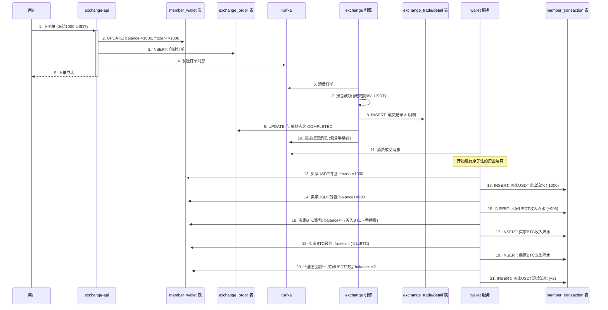

# 第五章：市场脉动的记录者——交易核心模型设计

## 开篇：捕捉并固化市场的每一次脉动

在构建了系统的“静态”数据基石——用户与资产模型之后，本章将深入系统的“动态”核心——**交易模型**。交易是交易所的灵魂，用户的每一次下单、每一次成交都驱动着平台的运转。如何精确、高效、无误地记录这些动态数据，是数据库设计的核心挑战。

本章将聚焦于**币币交易**的核心业务，深入 `exchange_order` 和 `exchange_trade` 等关键表，并将其与项目中的 JPA 实体类和业务逻辑紧密结合，理解它们如何捕捉并固化市场的每一次脉动。

---

### 第一节：交易规则的基石——`exchange_coin` 表

在深入订单之前，我们首先要定义“什么可以被交易”。`exchange_coin` 表就是所有币币交易市场的“**规则配置中心**”，它定义了每一个交易对（如 "BTC/USDT"）的准入规则，由后台管理系统 (`admin` 模块) 进行维护。

这张表的核心字段包括交易对符号 `symbol`（主键）、交易币种 `base_coin_id`、计价币种 `coin_id`，以及关键的交易参数，如**手续费率 `fee`**、**最小下单量 `min_amount`** 和 **最小成交额 `min_turnover`**。在工程实践中，这些数据在系统启动时就会被加载到 Redis 缓存中，以便在下单前进行高频的规则校验，从而避免对数据库的频繁查询。

---

### 第二节：订单的生命周期——`exchange_order` 表工程精解

这张表记录了用户提交的每一笔买卖委托，并跟踪其从“待撮合”到“完全成交”或“已撤销”的完整生命周期。这是系统中**最高频访问**的表之一，其设计直接关系到系统的性能与稳定性。它在代码中对应 `com.bizzan.bitrade.entity.ExchangeOrder` 实体。

#### 订单的核心属性

一个 `ExchangeOrder` 实体，其核心属性构成了一次完整的交易委托。**订单号 `order_id`** 是它的业务主键，通常采用类似 Snowflake 的分布式ID生成算法，以确保在 `exchange-api` 服务集群中的全局唯一性。**用户ID `member_id`** 记录了订单的归属。

订单的核心交易参数包括**委托数量 `amount`** 和**委托价格 `price`**。而 **`traded_amount`** 字段则用于实时跟踪已成交的数量，是判断订单是否“部分成交”或“完全成交”的关键依据。此外，订单的**交易对 `symbol`**、**方向 `direction`**（买/卖）和**类型 `type`**（限价/市价）共同定义了用户的交易意图。

`type` 字段是理解订单行为的关键：

*   **限价单 (Limit Order)**：`type=LIMIT_PRICE`。订单必须指定一个 `price`。系统只会以**等于或优于**这个指定价格进行撮合。这给了用户精确的价格控制，但不保证立即成交。
*   **市价单 (Market Order)**：`type=MARKET_PRICE`。下单时不需关心 `price` 字段（或设为0）。系统会以当前市场**最优的对手价**立即成交，保证了成交速度，但无法控制成交价格。

#### 索引策略：为最高频查询场景而生

对于 `exchange_order` 表，最高频的查询场景无疑是“**查询我的当前委托**”。为此，我们设计了一个至关重要的复合索引：`KEY (member_id, symbol, status)`。当用户查询时，`member_id` 是固定的，`status` 通常是 `TRADING`，`symbol` 则是用户选择的交易对。这个索引能够精准命中，极大地加速查询，避免了在海量订单数据中进行全表扫描。

#### `ExchangeOrder.java` 实体类核心代码

```java
@Entity
@Data
@Table(indexes = {
    @Index(name = "index_member_id_symbol_status", columnList = "member_id,symbol,status")
})
public class ExchangeOrder {
    @Id
    private String orderId;

    private Long memberId;
    private String symbol;

    @Column(columnDefinition = "decimal(18,8) default 0")
    private BigDecimal amount;

    @Column(columnDefinition = "decimal(18,8) default 0")
    private BigDecimal tradedAmount;

    @Enumerated(EnumType.STRING)
    private ExchangeOrderStatus status;

    // ... 其他字段
}
```
通过 `@Table(indexes = ...)` 注解，我们将数据库的索引策略直接在实体类中进行了声明，这是 JPA 的一个强大功能，确保了代码与数据库结构定义的同步。

---

### 第三节：握手的瞬间——`exchange_trade` 表工程精解

当一笔买单和一笔卖单在撮合引擎中成功匹配时，就会产生一笔或多笔成交记录。`exchange_trade` 表就是用来持久化这些“**握手瞬间**”的，它在代码中对应 `com.bizzan.bitrade.entity.ExchangeTrade`。**但请注意，这张表只记录了“市场”层面的成交快照，并未记录对具体某个订单的资金影响。**

这张表记录了每一次成交的**交易对 `symbol`**、**成交价格 `price`** 和**成交数量 `amount`**。最核心的是，它通过 `buy_order_id` 和 `sell_order_id` 两个字段，清晰地关联了促成这笔交易的买方和卖方订单。

#### 反范式设计：为性能而冗余

值得注意的是，`exchange_trade` 表中冗余了 `buy_member_id` 和 `sell_member_id` 两个字段。这是一种典型的“**反范式**”设计，其唯一目的是为了**提升查询性能**。在查询“我的历史成交”这类高频操作时，我们可以直接通过 `WHERE buy_member_id = ? OR sell_member_id = ?` 来高效查询此表，而无需耗费性能去 `JOIN` `exchange_order` 表。在数据量巨大的交易场景下，这种优化是至关重要的。

---

---

### 第四节：资金结算的铁证——`exchange_order_detail` 与 `member_transaction`

`exchange_trade` 记录了市场的成交，但要完成最终的资金结算，我们还需要两张更底层的财务表。

*   **`exchange_order_detail` (成交明细表)**：这张表是从**单个订单的视角**，记录其被撮合的每一次明细。如果一个大单被三个小单吃掉，那么 `exchange_trade` 会有三条记录，同时这个大单也会在 `exchange_order_detail` 中产生三条对应的明细。最关键的是，**手续费 `fee`** 是在这张表中记录的。

*   **`member_transaction` (资金流水表)**：这是整个系统的**总账本**，用户的 `member_wallet` 余额每一次发生变动，都**必须**在此表留下一条对应的流水记录，用于对账和审计。根据 `doc/QA.md` 中对订单处理的描述，一笔成交会为买卖双方各产生两条流水：一条是**支出**（付出的币），另一条是**收入**（收到的币）。

**手续费计算逻辑**：
根据 `doc/QA.md` 的描述，手续费的计算与收取币种和订单方向有关：
- **买单**：手续费以**交易币**计算。例如买入 BTC/USDT，手续费就是 BTC。
- **卖单**：手续费以**计价币**计算。例如卖出 BTC/USDT，手续费就是 USDT。

---

### 第五节：业务流程串讲：从下单到资金清算的完整旅程

现在，让我们通过一个更完整的时序图，来观察一笔交易是如何从下单、撮合，最终完成资金清算的。



这个架构的核心在于**异步解耦**：
*   `exchange-api` 负责接收用户请求，将订单持久化后，立即作为一条**命令消息**发送到 Kafka。
*   `exchange` 服务作为后台唯一的消费者，获取订单进行撮合。撮合成功后，它会持久化成交记录、更新订单状态，并发回一条**事件消息**到 Kafka，通知其他服务（如行情、用户通知等）此次成交。

这种**命令与事件分离**的模式，是构建高性能、高可扩展性交易系统的关键所在。

---

## 总结与展望

在本章中，我们深入探讨了交易所的动态核心——交易模型。我们不仅学习了核心表的结构设计，还结合项目代码，分析了订单号生成策略、索引优化、数据冗余等关键工程实践。

至此，我们已经完成了对交易所 MySQL 数据库两大核心（用户资产、交易模型）的全面学习。然而，一个现代化的交易所，仅有关系型数据库是远远不够的。在下一章，我们将进入 NoSQL 的世界，专门探讨 **MongoDB** 是如何被巧妙地应用于存储和查询海量的 K 线行情数据的。
