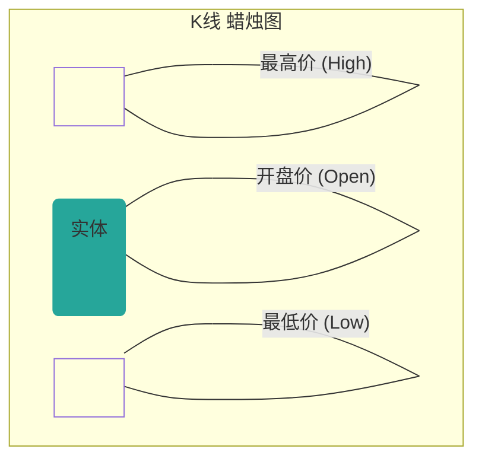
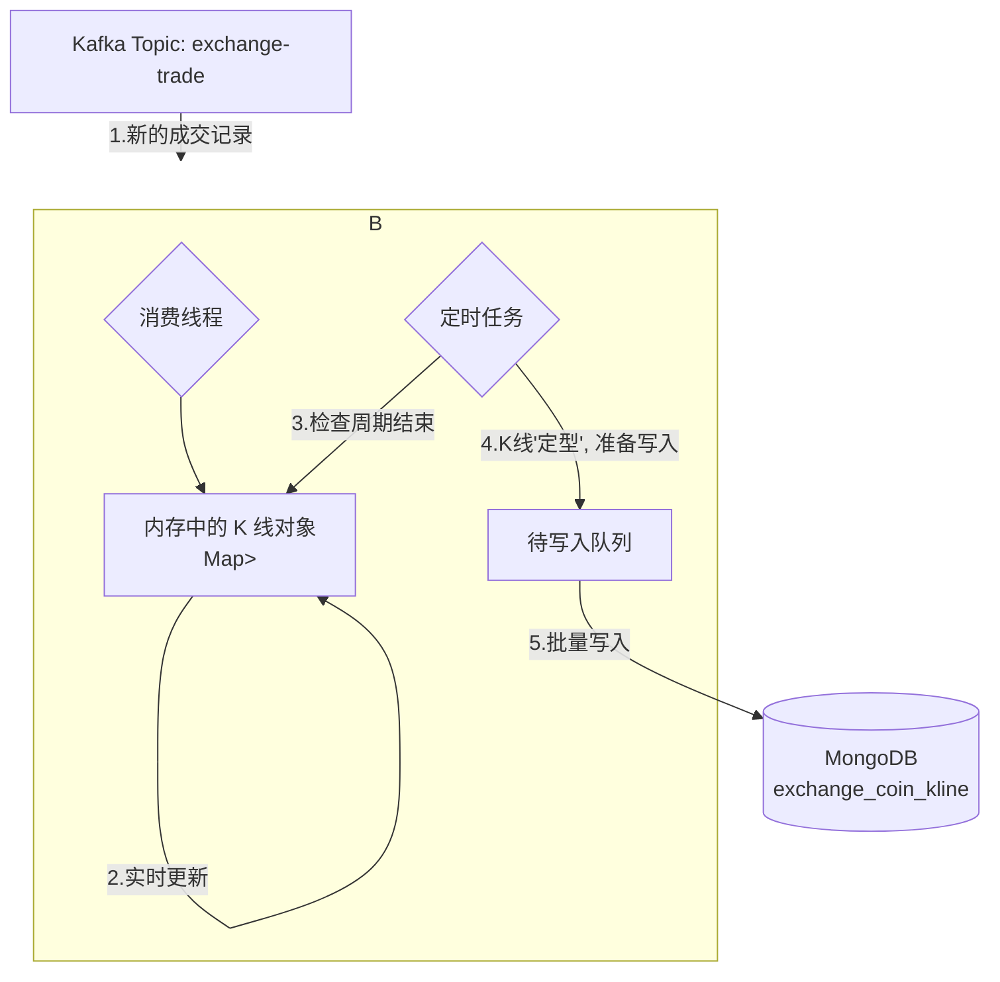

# 第六章：超越关系型——用 MongoDB 驯服海量时序数据

## 开篇：为正确的工作选择正确的工具

在前面两章，我们使用 MySQL 精心设计了交易所的核心事务性数据模型。MySQL 强大的 ACID 特性为用户、资产、订单等核心数据的强一致性提供了坚实的保障。然而，一个现代化的交易所还需要处理另一种截然不同的数据——**行情数据**，其中最具代表性的就是 **K 线**。

K 线数据具有典型的**时序 (Time-Series)** 特征：数据量巨大、写入频繁、查询模式相对固定。对于一个拥有数百个交易对的平台，仅 1 分钟周期的 K 线，一年就会产生数亿条记录。在这种场景下，让为事务而生的 MySQL 去应对，无异于让一位短跑冠军去参加马拉松比赛，最终会遭遇严重的性能瓶颈。

因此，我们引入了“**多语言持久化 (Polyglot Persistence)**”的架构思想：为不同的数据场景选择最合适的存储引擎。本章，我们将探讨项目为何选择文档数据库 MongoDB 作为 K 线等时序数据的存储引擎，并深入其设计与实践。

---

### 第一节：K线入门——读懂市场价格的语言

在深入技术实现之前，我们必须先理解什么是 K 线。K 线，又称“蜡烛图”，是金融市场中用于展示资产价格在特定时间周期内变化的标准化图表。

每一根“蜡烛”都包含了四个核心信息：
*   **开盘价 (Open)**：该时间周期内的第一笔成交价格。
*   **收盘价 (Close)**：该时间周期内的最后一笔成交价格。
*   **最高价 (High)**：该时间周期内的最高成交价格。
*   **最低价 (Low)**：该时间周期内的最低成交价格。


当收盘价高于开盘价时，实体通常为绿色（或白色），代表价格上涨；反之则为红色（或黑色），代表价格下跌。正是这无数根 K 线连接在一起，构成了我们所看到的、反映市场情绪和趋势的价格走势图。

---

### 第二节：技术选型：为何是 MongoDB 而非 MySQL？

既然 K 线源于 MySQL 中的成交记录，为何我们不直接用 MySQL 来存储 K 线呢？答案在于“为正确的工作选择正确的工具”。

| 对比维度 | MySQL (关系型数据库) | MongoDB (文档数据库) | K 线场景下的优势 |
| :--- | :--- | :--- | :--- |
| **数据模型** | **刚性 Schema**：需预先定义表结构，修改复杂。 | **柔性 Schema**：以 JSON/BSON 文档存储，可轻松增删字段。 | **胜出**。未来若想为 K 线增加新的技术指标（如 MA, MACD），MongoDB 无需修改表结构，直接在代码中增加字段即可。 |
| **写入性能** | **事务型写入**：为保证强一致性，写入链路较长，不适合海量、高频的简单写入。 | **文档级原子操作**：写入性能非常高，非常适合日志、传感器数据、行情数据这类“只增不减”的时序数据。 | **胜出**。交易所每秒产生大量 K 线数据，MongoDB 的高写入吞吐量能轻松应对。 |
| **查询场景** | **复杂查询 (JOIN)**：擅长多表关联查询。 | **聚合管道**：擅长对文档集合进行复杂的聚合、分组计算。 | **胜出**。K 线的查询模式非常固定（按交易对、周期、时间范围查询），无需复杂的 JOIN，MongoDB 的查询模型完全胜任。 |
| **可扩展性** | **垂直扩展**为主，水平扩展（分库分表）复杂且需应用层改造。 | **原生水平扩展**：通过“分片 (Sharding)” 技术，可轻松将数据分散到多台服务器，实现近乎无限的横向扩展。 | **胜出**。随着时间推移，K 线数据会无限增长，MongoDB 的原生分片能力是应对这种数据规模的最佳方案。 |

---

### 第三节：K 线的诞生之旅

K 线并非原始数据，而是由**无数笔成交记录 (`exchange_trade`) 在内存中实时聚合而成的**。`market` (行情中心) 服务是这一切的“加工厂”。



这个流程的核心在于，`market` 服务在内存中为每个交易对、每个周期（1min, 5min, 1h...）都维护着一个**当前 K 线对象**。每当从 Kafka 消费一笔新的成交记录，它就实时更新这些 K 线对象的开、高、低、收等值。当一个时间周期结束时（例如，`09:01:00` 到来），`09:00` 这一分钟的 K 线便宣告“完成”，并被“固化”到 MongoDB 中。

---

### 第四节：K 线文档的解剖学——`exchange_coin_kline` 集合

在 MongoDB 中，我们使用 `exchange_coin_kline` 集合来存储 K 线数据。每一条 K 线都以一个 BSON 文档的形式存在，对应着 `market` 模块中的 `com.bizzan.bitrade.entity.ExchangeCoinKline` 实体类。

一个 K 线文档的核心由以下几部分构成：首先是它的身份标识，由**交易对 `symbol`** (如 "BTC/USDT") 和**周期 `period`** (如 "1min") 共同定义。其次是它的时间戳，我们只记录**K 线开盘时间的时间戳 `time`**，这是聚合和查询的核心。最后是它的核心指标：**开盘价 `openPrice`**、**收盘价 `closePrice`**、**最高价 `highPrice`**、**最低价 `lowPrice`**，以及**成交量 `volume`** 和**成交额 `turnover`**。

#### 金融计算的精度红线

在金融计算中，**严禁使用 `float` 或 `double` 类型来表示货币**，因为浮点数无法精确表示所有十进制小数，会产生累积的精度误差。在我们的项目中，所有价格、数量、金额字段在 Java 实体类中均使用 `java.math.BigDecimal` 类型。当通过 Spring Data MongoDB 存入数据库时，它们会被自动转换为高精度的 `Decimal128` BSON 类型，从而确保了从计算到存储的全链路数据精度。

```java
@Data
@Document(collection = "exchange_coin_kline")
public class ExchangeCoinKline {

    @Id
    private String id; // 自定义主键，如 "BTC/USDT_1min_1667232000000"

    private long time;
    private String symbol;
    private String period;

    private BigDecimal openPrice;
    private BigDecimal closePrice;
    private BigDecimal highPrice;
    private BigDecimal lowPrice;
    private BigDecimal volume;
    private BigDecimal turnover;
}
```

---

### 第五节：毫秒级查询的秘密——复合索引优化

交易所最高频的行情查询场景是：“**获取某个交易对、某个周期的、最近 N 根 K 线**”。为了让这个查询达到毫秒级响应，我们必须设计一个完美的索引。

```javascript
// 在 mongo shell 中创建索引
db.exchange_coin_kline.createIndex({
    "symbol": 1,    // 第一级筛选：交易对
    "period": 1,    // 第二级筛选：周期
    "time": -1      // 第三级排序：时间倒序
})
```

这个**复合索引 (Compound Index)** 的设计蕴含着深刻的性能考量，我们可以将其理解为一个三层的“文件柜”：
1.  **第一层（最高效过滤）**：首先按 `symbol` 归档，能瞬间将查询范围从数亿条数据中缩小到目标交易对的文件夹。
2.  **第二层（进一步过滤）**：在交易对文件夹内，再按 `period` 归档，进一步缩小范围到目标周期的文件夹。
3.  **第三层（避免内存排序）**：在周期文件夹内，所有 K 线记录已经按照 `time` 倒序 (`-1`) 排列。当查询需要最新的 K 线时，MongoDB 可以直接按索引的物理顺序返回数据，**完全避免了昂贵的内存排序 (filesort)** 操作，这是性能提升的**关键**！

---

### 第六节：从数据库到应用——Spring Data MongoDB 实践

在代码层面，Spring Data MongoDB 极大地简化了我们的数据访问。我们只需定义一个符合其规范的 Repository 接口：

```java
// market 模块 -> KlineRepository.java
public interface KlineRepository extends MongoRepository<ExchangeCoinKline, String> {
    
    List<ExchangeCoinKline> findAllBySymbolAndPeriodAndOpenTimeBetween(
        String symbol,
        String period,
        long from,
        long to,
        Sort sort
    );
}
```

在服务层调用时，我们只需传入查询参数和排序规则，Spring Data 就会自动为我们生成高效的 MongoDB 查询语句，并利用我们之前创建的复合索引。

```java
// 在 Service 或 Controller 中调用
public List<ExchangeCoinKline> findKlines(String symbol, String period, long from, long to) {
    return klineRepository.findAllBySymbolAndPeriodAndOpenTimeBetween(
        symbol,
        period,
        from,
        to,
        Sort.by(Sort.Direction.DESC, "time") // 指定按时间倒序
    );
}
```

---

## 总结与展望

在本章中，我们深入探讨了 MongoDB 在交易所项目中的核心应用——K 线存储。我们不仅理解了它为何是处理时序数据的理想选择，还深入学习了其集合设计、文档结构以及至关重要的索引优化策略。

通过合理地运用 MySQL 和 MongoDB，我们的项目实现了“**多语言持久化**”的现代数据存储架构：用 MySQL 的“刚”来保证核心交易的事务一致性，用 MongoDB 的“柔”来承载海量行情数据的高性能读写。

至此，我们已完成对项目核心数据存储层的全面学习。从下一章开始，我们将进入中间件领域，首先聚焦于内存数据库的王者 **Redis**。