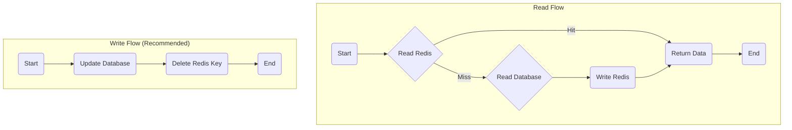
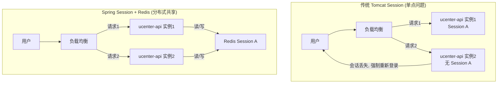

# 第七章：Redis 应用：高性能缓存与分布式会话

## 开篇：为系统构建高速数据访问层

在完成了 MySQL 和 MongoDB 的持久化设计后，我们构建了系统数据可靠性的基石。然而，在金融交易这类对实时性要求极高的场景中，仅靠基于磁盘的数据库，无法满足高并发下的低延迟读写需求。每一次行情刷新、每一次盘口查询，都要求数据能被瞬时访问。

为了解决这一性能瓶颈，我们引入了数据存储层的第三驾马车——**内存数据库 Redis**。本章将深入探讨 Redis 在本项目中的核心应用，阐明它如何作为系统的高速数据访问层，为交易所的流畅体验提供动力。我们将聚焦于其三大核心职责：**高性能缓存、分布式会话管理和业务功能实现**。

---

### 第一节：Redis 的定位：系统的高速公路与共享记忆

在深入具体应用之前，我们先用一个比喻来理解 Redis 在系统中的定位。如果我们将整个数据存储体系看作计算机的存储结构：
*   **MySQL / MongoDB (基于磁盘)**：就像是计算机的 **硬盘**。容量大，数据持久可靠，但读写速度相对较慢。
*   **JVM 内存 (应用实例内部)**：就像是 CPU 的 **L1/L2 缓存**。速度极快，但容量小，且数据无法在不同进程间共享。
*   **Redis (基于内存)**：则完美地扮演了 **内存条 (RAM)** 的角色。它的速度远快于硬盘，容量远大于 CPU 缓存，最关键的是，它是一个**独立于应用进程的、可被所有服务实例共享的**高速数据空间。

因此，Redis 成为了连接慢速持久化存储（数据库）和快速应用逻辑（JVM）之间的“**高速公路**”，以及微服务集群的“**共享记忆中心**”。

---

### 第二节：Spring Boot 集成 Redis：配置与序列化

在探讨业务应用之前，我们首先需要理解在 Spring Boot 项目中，应用程序是如何与 Redis 服务建立连接并进行数据交换的。核心在于 `RedisTemplate` 的配置。

- **配置文件**: `com.bizzan.bitrade.config.RedisConfig.java`

```java
@Configuration
public class RedisConfig {

    @Bean
    public RedisTemplate<String, Object> redisTemplate(RedisConnectionFactory factory) {
        RedisTemplate<String, Object> template = new RedisTemplate<>();
        template.setConnectionFactory(factory);

        // 定义 Key 的序列化方式为 String
        StringRedisSerializer stringSerializer = new StringRedisSerializer();
        template.setKeySerializer(stringSerializer);
        template.setHashKeySerializer(stringSerializer);

        // 定义 Value 的序列化方式为 JSON
        Jackson2JsonRedisSerializer<Object> jacksonSerializer = new Jackson2JsonRedisSerializer<>(Object.class);
        ObjectMapper om = new ObjectMapper();
        om.setVisibility(PropertyAccessor.ALL, JsonAutoDetect.Visibility.ANY);
        // 存储完整的类信息，以便反序列化时能准确地转换回原始类型
        om.activateDefaultTyping(LaissezFaireSubTypeValidator.instance, ObjectMapper.DefaultTyping.NON_FINAL);
        jacksonSerializer.setObjectMapper(om);

        template.setValueSerializer(jacksonSerializer);
        template.setHashValueSerializer(jacksonSerializer);

        template.afterPropertiesSet();
        return template;
    }
}
```

- **核心配置解读**：
  1.  **`RedisTemplate<String, Object>`**: 这是 Spring 提供的与 Redis 交互的核心工具类。我们将其泛型定义为 `<String, Object>`，意味着我们约定所有的 Key 都是字符串类型，而 Value 可以是任意 Java 对象。
  2.  **Key 序列化 (`StringRedisSerializer`)**: 将 Key 序列化为普通字符串。这保证了 Key 在 Redis 中具有良好的可读性，方便调试和管理。
  3.  **Value 序列化 (`Jackson2JsonRedisSerializer`)**: 这是配置的**关键**。它使得我们可以直接将一个 Java 对象（如一个 `Coin` 实体或一个 `List<TradePlate>`）作为 Value 存入 Redis。该序列化器会自动将 Java 对象转换为 JSON 字符串进行存储，并在读取时自动将 JSON 字符串转换回对应的 Java 对象。这极大地简化了业务代码。

---

### 第三节：核心场景一：行情与交易数据的缓存

这是 Redis 在交易所中**最核心、最典型**的应用。行情 Ticker、盘口深度、历史 K 线等数据，访问频率极高，是缓存应用的完美场景。

#### 2.1 缓存策略：旁路缓存 (Cache-Aside)

本项目遵循经典的“旁路缓存”模式进行数据读写。

- **读取操作**: 应用先读 Redis。若命中，则直接返回；若未命中，则回源查询数据库（MySQL/MongoDB），将查询结果写入 Redis，然后返回。
- **写入/更新操作**: **先更新数据库，再删除缓存**。这是一个关键的最佳实践，我们将在后续章节深入探讨其原因。



#### 2.2 项目中的数据流转

- **数据生产者 (`market` 服务)**:

  1.  `market` 服务消费 Kafka 中的成交数据，在内存中聚合计算出最新的 Ticker 和盘口深度。
  2.  **更新缓存**: `market` 服务将计算出的最新数据，直接写入（`SET`）到 Redis 中。由于 `market` 是行情的唯一生产者，数据不存在并发写问题，因此这里可以采用“更新缓存”的简化策略。
  3.  **持久化**: 同时，`market` 将聚合后的 K 线数据写入 MongoDB。
  4.  **实时推送**: `market` 通过 WebSocket 将最新数据主动推送给客户端。

- **数据消费者 (`exchange-api`, `market` 等)**:
  1.  当用户首次加载页面或刷新时，会通过 HTTP 请求获取全量的行情/K 线数据。
  2.  `exchange-api` 或 `market` 服务接收到请求，首先访问 Redis。
  3.  若 Redis 命中，则直接返回。若未命中，则从 MongoDB 查询历史 K 线，或从 `market` 获取最新行情，然后**回写 Redis** 并返回。

#### 2.3 Key 设计与数据结构

我们遵循 `业务名:唯一标识:字段` 的设计模式，并主要使用 `String` 数据类型存储 JSON 序列化后的对象。

| 业务场景        | Key 设计                         | Value 类型      | 负责模块 | 示例                          |
| :-------------- | :------------------------------- | :-------------- | :------- | :---------------------------- |
| **行情 Ticker** | `market:ticker:{symbol}`         | `String` (JSON) | `market` | `market:ticker:BTC/USDT`      |
| **盘口数据**    | `market:trade-plate:{symbol}`    | `String` (JSON) | `market` | `market:trade-plate:BTC/USDT` |
| **历史 K 线**   | `market:kline:{symbol}:{period}` | `String` (JSON) | `market` | `market:kline:BTC/USDT:1min`  |

---

### 第四节：核心场景二：分布式会话管理

在微服务架构下，`ucenter-api` 等服务会部署多个实例。如果使用传统的 Tomcat Session，用户的登录状态会绑定在单个实例的内存中，导致请求在不同实例间转发时，出现会话丢失、被强制登出的问题。

**解决方案**: **Spring Session + Redis**
通过引入 `spring-session-data-redis` 依赖，并配置 `spring.session.store-type=redis`，Spring Session 框架会自动接管会话管理，将所有会话数据集中存储到 Redis 中。



- **工作原理**:
  1.  用户登录时，任意一个 `ucenter-api` 实例不再将 Session 存储在自身内存，而是将其序列化后存入 Redis。
  2.  当用户的后续请求被负载均衡到**任何一个** `ucenter-api` 实例时，Spring Session 框架会根据 Cookie 中的 `SESSION` ID，自动从 Redis 中加载会话数据。
  3.  这使得所有 `ucenter-api` 实例共享同一个会话存储，让服务本身变成了**无状态 (Stateless)** 的。这对于微服务架构的**水平扩展 (Horizontal Scaling)** 至关重要，我们可以随时增加或减少服务实例，而无需担心用户会话丢失。

---

### 第五节：核心场景三：业务功能助推器

Redis 高性能的原子操作和过期策略，使其成为实现各类业务功能的利器。

#### 4.1 验证码存储 (`ucenter-api`)

- **场景**: 用户注册或登录时，需要临时存储短信/邮箱验证码，并设置有效期。
- **实现**: 使用 Redis 的 `SET` 命令并附加 `EX` (过期时间) 参数。
- **Key**: `sms:code:login:{phone_number}`
- **代码示例**:

  ```java
  // 在 ucenter-api 的服务类中
  @Autowired
  private RedisTemplate<String, Object> redisTemplate;
  
  public void saveSmsCode(String phone, String code) {
      String key = "sms:code:login:" + phone;
      // 存入 Redis，并设置5分钟 (300秒) 的过期时间
      redisTemplate.opsForValue().set(key, code, 300, TimeUnit.SECONDS);
  }
  ```

#### 4.2 API 接口防刷 (`ucenter-api`, `exchange-api`)

- **场景**: 防止恶意用户高频调用重要接口（如发送短信、下单）。
- **实现**: 使用 Redis 的 `INCR` (原子自增) 命令和 `EXPIRE` 命令，实现一个滑动时间窗口计数器。
- **Key**: `rate:limit:send_sms:{ip_address}`
- **代码示例**:

  ```java
  // 伪代码：限制每个IP每分钟最多发送5次短信
  public boolean isAllowed(String ip) {
      String key = "rate:limit:send_sms:" + ip;
      Long count = redisTemplate.opsForValue().increment(key);
  
      if (count == 1) {
          // 如果是窗口内的第一次请求，设置1分钟的过期时间
          redisTemplate.expire(key, 60, TimeUnit.SECONDS);
      }
  
      return count <= 5;
  }
  ```

---

### 第六节：高级主题：缓存一致性与经典问题

#### 5.1 缓存与数据库一致性

在“旁路缓存”模式下，当数据发生变更时，**“先更新数据库，再删除缓存”** 是保证最终一致性的更优策略。

- **原因**:
  - **避免脏数据**: 如果是“更新缓存”，在高并发下，请求 A 和 B 先后更新数据库，但如果 B 的缓存更新先于 A 完成，会导致缓存中是 A 的旧数据，而数据库是 B 的新数据。
  - **操作原子性**: 删除操作是幂等的，而更新操作不是。删除失败可以通过重试机制保证，逻辑更简单。
  - **懒加载**: 删除缓存后，下一次读请求会触发一次“懒加载”，从数据库加载最新数据到缓存中，确保了数据的时效性。

#### 5.2 缓存三大经典问题

- **缓存穿透**:

  - **问题**: 查询一个数据库和缓存中都**不存在**的数据，导致请求每次都直接打到数据库。
  - **解决方案**: **缓存空对象**。当数据库查询为空时，在 Redis 中缓存一个特殊的空值（如一个空字符串或特定对象），并设置一个较短的过期时间（如 60 秒），以防止恶意攻击。

- **缓存击穿**:

  - **问题**: 一个**热点 Key** 在失效的瞬间，大量并发请求同时涌入数据库。
  - **解决方案**: **分布式锁**。当缓存未命中时，只允许第一个获取到分布式锁的线程去查询数据库并重建缓存，其他线程则等待或直接返回旧数据。

- **缓存雪崩**:
  - **问题**: 大量的 Key 在**同一时间集体失效**，导致所有请求都穿透到数据库。
  - **解决方案**: **随机化过期时间**。在基础过期时间上，增加一个随机值（如 `3600 + random.nextInt(300)`），打乱过期时间，避免集体失效。

---

## 总结与展望

在本章中，我们深入探讨了 Redis 如何作为交易所系统的高性能数据访问层。我们不仅学习了它在高性能缓存、分布式会话管理和业务功能三大场景下的核心应用，还结合项目代码，掌握了 `RedisTemplate` 的配置、Key 的设计模式以及缓存一致性、穿透、击穿、雪崩等高级问题的解决方案。

至此，我们已经完成了对本项目三大核心存储技术——MySQL、MongoDB、Redis 的全面学习。有了坚实的数据层基础，从下一章开始，我们将进入异步通信领域，深入剖析 **Apache Kafka** 是如何作为系统的消息总线，实现核心业务的解耦和削峰填谷的。
