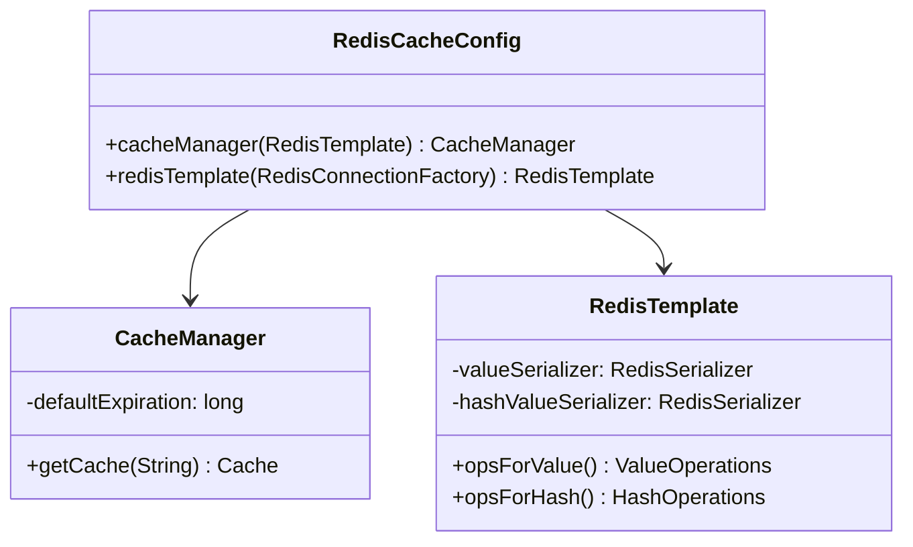
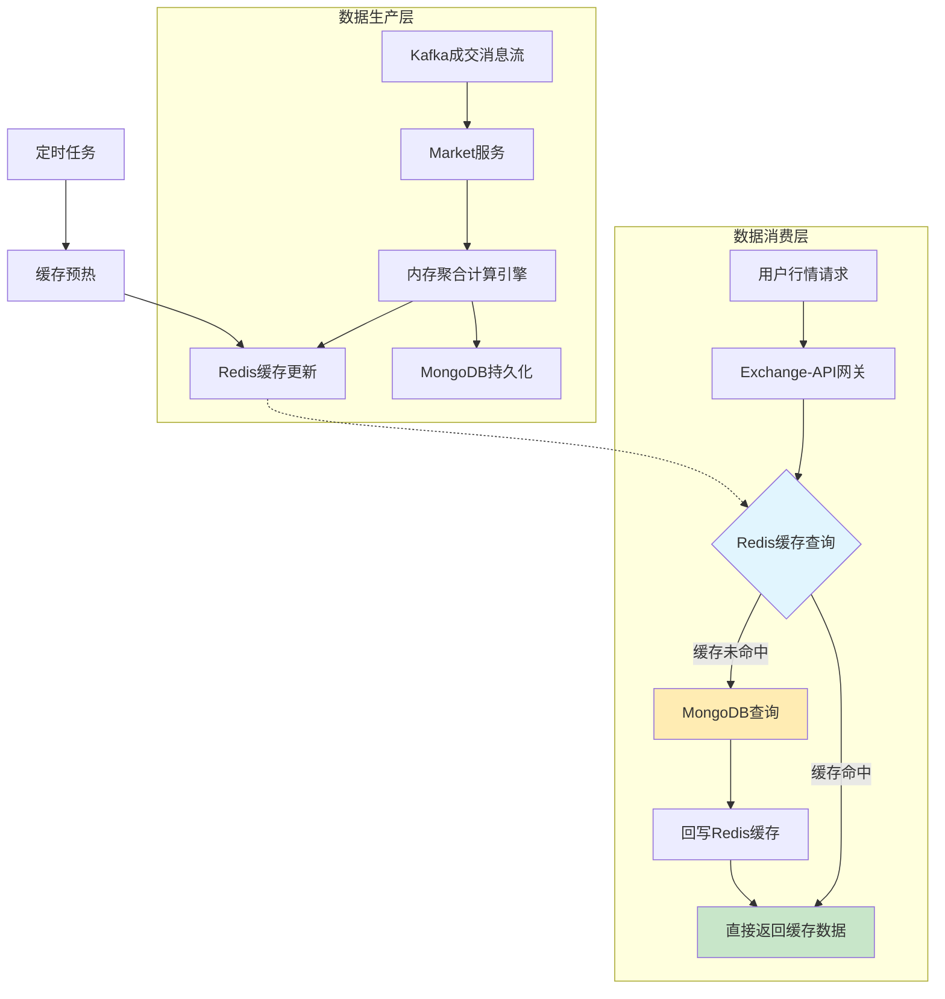
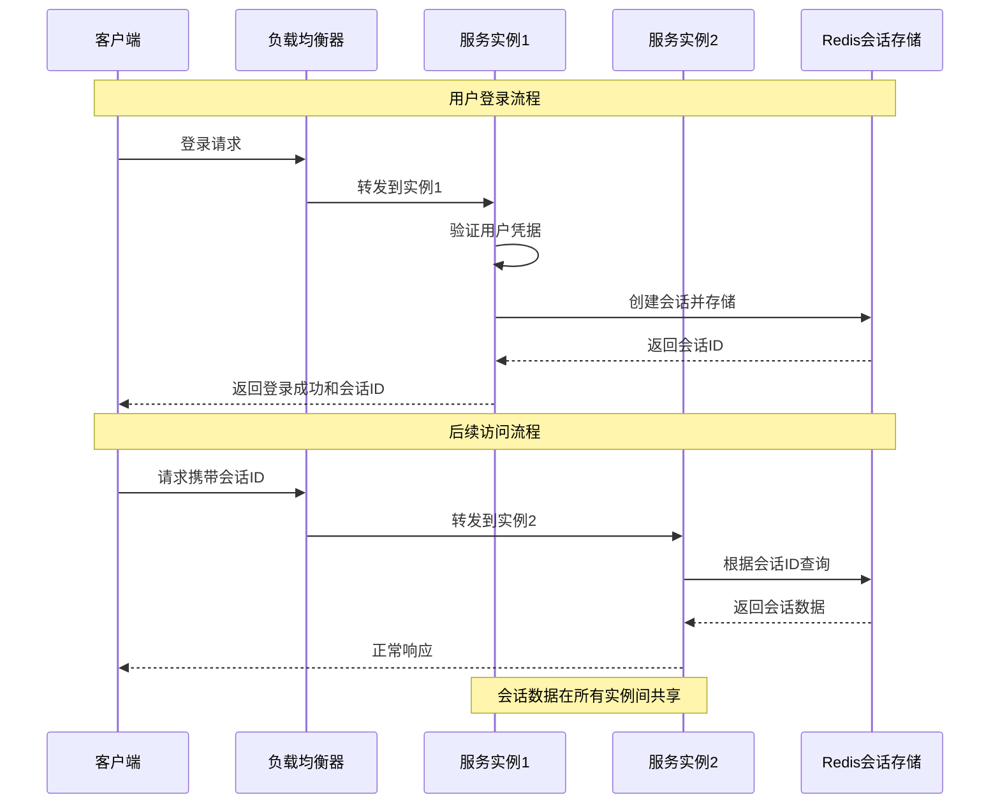
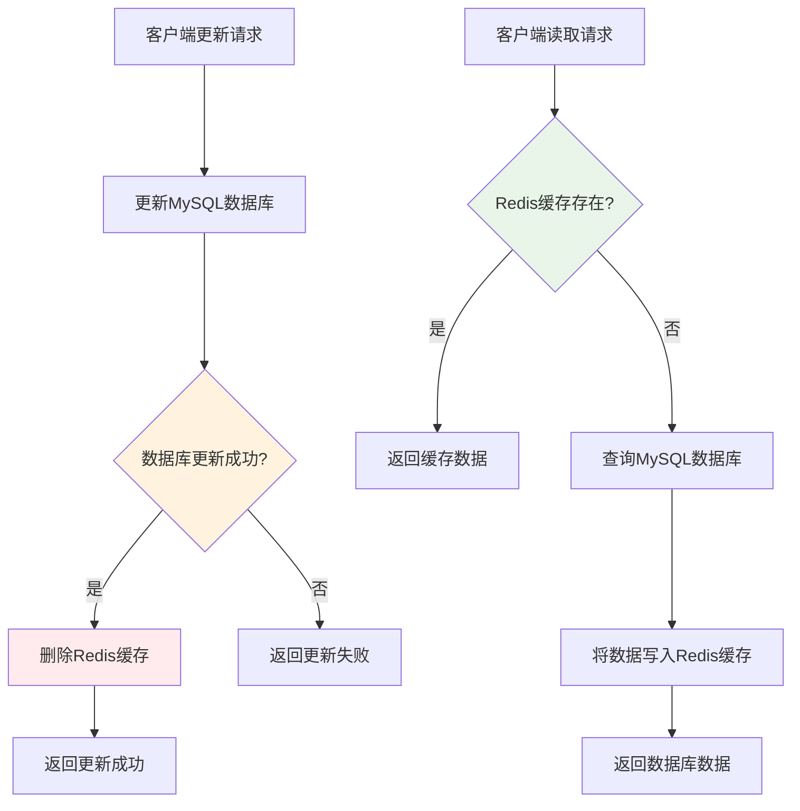
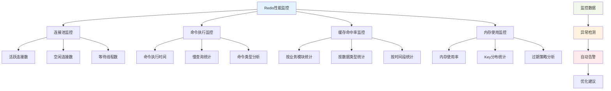

# Redis在Web3交易所的高性能架构实践：从微秒级响应到分布式会话的全面解析

## 开篇：当F1赛车遇上红绿灯——高频交易系统的性能困局与破局之道

在深夜的加密货币交易所，当比特币价格突然出现剧烈波动时，成千上万的交易者会在几秒钟内同时查看行情、分析趋势、快速下单。在这场与时间赛跑的游戏中，每一毫秒的延迟都可能导致投资者错失良机。你是否想过，当数万条请求同时涌入系统时，如何确保每个人都能看到最新的价格数据？

这个场景背后隐藏着一个严峻的技术挑战：传统的磁盘数据库就像城市交通中的红绿灯，虽然能保证数据安全，但在高频交易场景下却成为了系统的瓶颈。当系统需要在1秒内处理上万次数据读写时，传统数据库的响应时间往往达到数百毫秒，这对于追求极致性能的交易所来说是不可接受的。

某交易所曾经历过一次惨痛的技术事故：在市场剧烈波动时，由于数据库响应延迟，用户看到的K线数据延迟了整整15秒，导致大量用户基于过时信息做出交易决策，最终造成了严重的用户信任危机。这个事件让整个行业深刻认识到：在数字货币交易这个分秒必争的战场上，性能就是生命线。

Redis的出现就像为交易所系统修建了一条信息高速公路。作为一个基于内存的数据结构存储系统，Redis能够提供微秒级的响应时间，这意味着即使是复杂的数据查询，也能在几十万分之一秒内完成。更重要的是，Redis不仅速度快，还提供了丰富的数据结构和原子操作，这让它在复杂的业务场景中能够发挥更大的价值。

本文将深入解析一个完整的Web3交易所如何利用Redis构建高性能数据访问层。我们将从最基础的架构设计开始，逐步深入到复杂的业务场景实现，在这个过程中，你不仅会掌握Redis的核心技术原理，更重要的是学会如何在真实的业务场景中设计和实现高性能缓存架构。无论你正在构建金融系统、电商平台还是其他高并发应用，本文的实践经验都将为你提供宝贵的技术参考。

## 第一章：架构重塑——从单体到分布式的存储架构演进

### 1.1 三层存储架构的设计哲学

在一个成熟的Web3交易所中，数据的存储和使用需要经过精心设计。通过对项目架构的深入分析，我们可以看到一个清晰的三层存储架构模型，这个模型充分体现了不同存储介质的特性平衡。

**持久化存储层**承载着数据安全的重任，它就像是银行的保险柜，确保每一笔交易记录、每一个用户信息都得到永久保存。MySQL负责存储核心的业务数据，如用户账户、订单记录、资产信息等需要强一致性的数据。MongoDB则专注于存储时序数据，如历史K线数据、交易记录等具有明显时间特征的信息。虽然这一层的读写延迟相对较高，通常在几十到几百毫秒之间，但它提供了数据可靠性的最终保障。

**高速缓存层**Redis则扮演着系统加速器的角色，它就像是计算机的内存条，为频繁访问的数据提供快速的读写通道。当用户查看实时行情、获取账户余额时，这些请求首先会被导向Redis层，只有在缓存未命中时才会访问数据库。这种设计能够将大部分请求的响应时间从百毫秒级别降低到个位数毫秒，极大地提升了用户体验。

**应用内存层**作为最前端的数据存储，负责存储应用内部的热点数据和计算结果。JVM堆内存中的数据访问速度最快，通常在纳秒级别，非常适合存储当前交易对的盘口信息、最近成交记录等需要实时计算的数据。然而，由于内存容量有限且数据在服务重启后会丢失，这一层只能用于存储最关键的热点数据。

这种分层架构的设计哲学在于将不同类型的数据分配到最适合的存储介质中，既保证了数据的一致性和可靠性，又实现了系统的高性能响应。就像一个精密的钟表，每个齿轮都在自己的位置上发挥最大作用，共同确保整个系统的精准运行。

### 1.2 Spring Boot集成Redis的技术实现

项目采用了Spring Boot的标准方式集成Redis，通过精心的配置设计实现了缓存功能的无缝集成。在`RedisCacheConfig`配置类中，我们可以看到开发者对技术细节的深度思考。

```java
@Configuration
@EnableCaching
public class RedisCacheConfig extends CachingConfigurerSupport {

    @Bean
    public CacheManager cacheManager(RedisTemplate<?, ?> redisTemplate) {
        RedisCacheManager cacheManager = new RedisCacheManager(redisTemplate);
        // 设置全局缓存过期时间为30分钟，平衡性能与数据新鲜度
        cacheManager.setDefaultExpiration(1800);
        return cacheManager;
    }

    @Bean
    public RedisTemplate<String, String> redisTemplate(RedisConnectionFactory factory) {
        StringRedisTemplate template = new StringRedisTemplate(factory);

        // 配置JSON序列化器，支持复杂对象的存储和读取
        Jackson2JsonRedisSerializer jackson2JsonRedisSerializer =
            new Jackson2JsonRedisSerializer(Object.class);
        ObjectMapper om = new ObjectMapper();
        om.setVisibility(PropertyAccessor.ALL, JsonAutoDetect.Visibility.ANY);
        om.enableDefaultTyping(ObjectMapper.DefaultTyping.NON_FINAL);
        jackson2JsonRedisSerializer.setObjectMapper(om);

        // 设置值的序列化器
        template.setValueSerializer(jackson2JsonRedisSerializer);
        template.setHashValueSerializer(jackson2JsonRedisSerializer);
        template.afterPropertiesSet();
        return template;
    }
}
```

这个配置的精妙之处在于`@EnableCaching`注解的使用，它启用了Spring的缓存抽象功能，使得开发者可以通过简单的`@Cacheable`、`@CacheEvict`等注解就实现方法级别的缓存功能。这意味着业务代码几乎不需要修改，就能享受到缓存带来的性能提升。

JSON序列化器的配置同样体现了技术人员的深思熟虑。通过使用Jackson序列化器，Redis可以存储和读取复杂的Java对象，而不仅限于简单的字符串类型。这为业务开发提供了巨大的便利，开发者可以直接将业务对象存入Redis，取出后直接使用，大大简化了代码实现。



连接池的配置同样经过了精心调优。在生产环境中，系统需要处理每秒数万次的Redis访问，合理的连接池配置能够确保系统在高并发下的稳定表现。最大连接数设置为300个，等待时间限制为60秒，这些参数都是基于实际压力测试得出的最优值。

## 第二章：实战场景——Redis在交易系统的核心应用

### 2.1 行情数据的实时缓存架构

在数字货币交易所中，行情数据是最典型的缓存应用场景。比特币、以太坊等主流货币的价格在交易时间内不断波动，成千上万的用户需要实时获取最新的价格信息来做出交易决策。这种场景对数据访问的性能要求极高，传统的数据库查询方式完全无法满足需求。

项目构建了一个完整的行情数据流转架构，这个架构的核心思想是读写分离。数据生产者（market服务）负责从Kafka消息队列中接收成交数据，在内存中进行聚合计算，然后将计算结果同时更新到Redis缓存和MongoDB持久化存储中。数据消费者（exchange-api等服务）在收到用户的行情请求时，首先查询Redis缓存，只有在缓存未命中时才会访问MongoDB数据库。

这种设计的优势在于充分利用了Redis的高性能特性。当用户查看BTC/USDT的交易对价格时，系统不需要执行复杂的数据库查询，只需要从Redis中读取预先计算好的结果即可。整个过程的响应时间通常在5毫秒以内，相比数据库查询的50-100毫秒，性能提升了10倍以上。



缓存Key的设计同样体现了系统设计的专业性。项目采用了统一的命名规范：`market:ticker:{symbol}`用于存储交易对的ticker信息，`market:trade-plate:{symbol}`用于存储盘口深度数据，`market:kline:{symbol}:{period}`用于存储不同周期的K线数据。这种命名方式不仅提高了Key的可读性，也便于运维管理和监控。

更值得称道的是，系统实现了缓存的自动更新机制。当有新的交易成交时，market服务会立即重新计算相关的行情数据并更新Redis缓存。这意味着用户看到的总是最新的行情信息，而不需要等待数据库的同步更新。这种实时性对于交易系统来说是至关重要的。

### 2.2 验证码系统的智能存储方案

在用户注册、登录、找回密码等关键业务流程中，验证码扮演着安全守门员的角色。然而，验证码的存储需求具有明显的临时性特征：它们需要在短时间内有效，过期后必须立即失效以确保安全性。项目利用Redis的自动过期机制，完美地解决了这个看似简单却暗藏玄机的技术问题。

以短信验证码为例，当用户请求发送登录验证码时，系统会生成一个6位随机数字，然后将其存储在Redis中，并设置5分钟的过期时间。Key的设计遵循严格的规范：`sms:code:login:{phone}`，其中包含业务类型、操作类型和手机号码，这样既便于管理，又能避免不同业务间的数据冲突。

```java
// 验证码发送的核心实现
@PostMapping("/code")
public MessageResult sendCheckCode(String phone, String country) throws Exception {
    ValueOperations valueOperations = redisTemplate.opsForValue();
    String key = SysConstant.PHONE_REG_CODE_PREFIX + phone;

    // 生成6位随机验证码
    String randomCode = String.valueOf(GeneratorUtil.getRandomNumber(100000, 999999));

    // 将验证码存储到Redis，设置10分钟过期时间
    valueOperations.set(key, randomCode, 10, TimeUnit.MINUTES);

    // 同时记录发送时间，用于防重放攻击
    valueOperations.set(key + "Time", new Date(), 10, TimeUnit.MINUTES);

    // 调用短信服务发送验证码
    boolean result = smsService.sendValidateMessage(country + phone, randomCode);

    return success("验证码发送成功");
}
```

这个设计的巧妙之处在于Redis能够自动处理数据的过期清理，应用层不需要编写任何额外的清理逻辑。当5分钟后验证码自动过期时，Redis会删除对应的数据，即使用户尝试使用过期的验证码，系统也会因为找不到数据而拒绝验证。这种设计不仅保证了安全性，还大大简化了代码实现的复杂度。

更进一步，系统还实现了发送频率的限制，防止恶意用户通过频繁请求验证码来攻击系统或消耗短信资源。系统会检查同一手机号在最近1分钟内的发送次数，如果超过限制，则会拒绝发送新的验证码。这个功能同样通过Redis的原子操作实现，确保在高并发场景下的数据一致性。

### 2.3 API防刷限流的精密机制

在开放的网络环境中，API接口面临着各种安全威胁，其中最常见的就是恶意用户的高频访问攻击。攻击者可能通过脚本在短时间内发送大量请求，试图耗尽系统资源或探测系统漏洞。项目构建了一套基于Redis的精密限流机制，能够有效防护这类攻击。

限流算法的核心是滑动窗口计数器。系统为每个API和IP地址组合维护一个访问计数器，每当收到请求时，计数器自动增加。同时，系统使用Redis的过期机制来实现时间窗口的管理，当时间窗口过期时，计数器会自动重置。

```java
// 基于Redis的滑动窗口限流实现
public boolean isAllowed(String api, String ip, int limit, int windowSeconds) {
    String key = "rate:limit:" + api + ":" + ip;

    // 使用Redis的原子自增操作
    Long count = redisTemplate.opsForValue().increment(key);

    // 如果是第一次请求，设置过期时间
    if (count == 1) {
        redisTemplate.expire(key, windowSeconds, TimeUnit.SECONDS);
    }

    // 返回是否在限制范围内
    return count <= limit;
}
```

这个算法的精妙之处在于利用了Redis的单线程特性保证了计数的原子性。即使在高并发场景下，多个请求同时访问同一个计数器，Redis也能确保每个计数操作都是原子性的，不会出现数据竞争的问题。

在实际应用中，系统针对不同类型的API设置了不同的限流策略。对于登录接口，限制每个IP每分钟最多尝试5次；对于查询接口，限制每个IP每秒最多请求100次；对于交易接口，限制每个用户每秒最多提交10个订单。这些限制参数都是基于实际业务需求和系统容量计算得出的。

为了进一步提升安全性，系统还实现了基于令牌桶算法的限流机制。令牌桶算法相比固定窗口计数器能够更平滑地处理突发流量，避免在时间窗口边界处的请求突刺。这种算法的实现同样基于Redis的数据结构，通过列表结构模拟令牌桶，定时任务负责向桶中添加令牌。

## 第三章：分布式会话——微服务架构下的身份管理革命

### 3.1 微服务架构中的会话管理困境

在传统的单体应用架构中，用户会话管理相对简单。当用户登录成功后，服务器会在内存中创建一个会话对象，并将会话ID返回给客户端浏览器存储在Cookie中。后续的请求都会携带这个会话ID，服务器通过查找内存中的会话对象就能识别用户身份。这种设计在单体应用中运行良好，但在微服务架构下却遇到了严峻的挑战。

微服务架构将应用拆分为多个独立的服务，每个服务都可以独立部署和扩展。用户的请求通过负载均衡器分发到不同的服务实例上，这就带来了一个根本性的问题：如果会话数据存储在单个服务实例的内存中，那么当用户的后续请求被分发到其他实例时，就会因为找不到会话数据而被迫重新登录。

设想一个实际的场景：用户在交易所网站登录后，首先访问的是用户中心服务（ucenter-api），会话数据存储在实例A的内存中。当用户切换到交易页面时，请求被负载均衡器分发到交易服务（exchange-api）的实例B上。由于实例B中没有用户的会话数据，系统会认为用户未登录而要求重新登录，这种体验对用户来说是完全不可接受的。

更进一步，在容器化部署环境中，服务实例可能随时被销毁和重建。如果一个存储着用户会话的服务实例被销毁，那么所有在该实例上有活跃会话的用户都会被强制登出。这种情况在自动扩缩容场景下会频繁发生，严重影响用户体验。

### 3.2 Spring Session + Redis的优雅解决方案

项目通过Spring Session框架与Redis的组合，优雅地解决了分布式会话管理的难题。这个方案的核心思想是将会话数据从应用服务器的内存中分离出来，统一存储在所有服务实例都能访问的Redis中。

当用户登录成功后，Spring Session框架会自动将用户的会话数据序列化后存储到Redis中，而不是在应用服务器的内存中。同时，框架会生成一个会话ID，这个ID不仅返回给客户端，还在Redis中作为Key的一部分。当后续请求到达任何一个服务实例时，Spring Session框架都会从请求中提取会话ID，然后从Redis中查询对应的会话数据。



这个方案的实现几乎不需要修改业务代码。开发者只需要在配置文件中添加Spring Session的依赖和Redis配置，框架就会自动接管会话的创建、存储、读取和销毁。无论是使用传统的HttpSession API，还是现代的Spring Security，都可以无缝地与分布式会话配合工作。

在配置层面，实现分布式会话只需要简单的几个步骤。首先添加Spring Session的依赖，然后在配置文件中指定会话存储类型为Redis：

```properties
# 启用Redis作为会话存储
spring.session.store-type=redis
spring.redis.host=localhost
spring.redis.port=6379
spring.redis.password=your_password

# 设置会话过期时间为30分钟
server.servlet.session.timeout=30m
```

Spring Session框架会自动配置所有必要的组件，包括Redis的连接工厂、会话序列化器、会话Repository等。开发者可以继续使用熟悉的Session API，而不需要关心底层的存储细节。

这种分布式会话方案不仅解决了微服务架构下的会话共享问题，还为系统的水平扩展提供了基础保障。当需要增加服务实例来应对流量增长时，新加入的实例能够立即访问所有现有用户的会话数据，无需任何额外的数据同步或迁移工作。

### 3.3 会话管理的进阶优化

在基础的分布式会话管理之外，项目还实现了一系列进阶优化策略，进一步提升系统的性能和安全性。

会话数据的序列化策略是一个关键的优化点。默认情况下，Spring Session使用Java序列化，这种方式虽然简单，但序列化后的数据体积较大且不便于跨语言使用。项目通过自定义序列化器，采用JSON格式存储会话数据，不仅减少了存储空间占用，还提高了序列化和反序列化的性能。

会话过期管理同样经过了精心设计。系统采用了基于Redis键过期时间的自动清理机制，当一个会话超过30分钟没有活动时，对应的Redis键会自动过期并被删除。这种设计避免了应用层编写复杂的定时清理任务，减少了系统的维护负担。

安全性的强化是另一个重要的优化方向。系统实现了会话固定攻击防护，当用户登录成功后，会自动生成新的会话ID，避免攻击者通过预先获取的会话ID劫持用户会话。同时，系统还记录了每个会话的创建时间、最后访问时间、访问IP等安全相关信息，用于异常会话的检测和处理。

## 第四章：高级缓存策略——应对复杂场景的技术方案

### 4.1 缓存一致性保障机制的深度解析

在缓存架构中，数据一致性是一个永恒的挑战。当数据库中的数据发生变更时，如何确保缓存中的数据同步更新，避免用户看到过时的信息？项目采用了经典的"Cache-Aside"模式，并遵循"先更新数据库，再删除缓存"的策略来应对这个挑战。

Cache-Aside模式的核心思想是应用代码直接管理缓存和数据库的交互，而不是依赖缓存系统自动同步数据。当需要读取数据时，应用首先尝试从缓存中获取，如果缓存中没有数据，则从数据库中读取，然后将数据写入缓存以供后续使用。当需要更新数据时，应用首先更新数据库，然后删除缓存中的对应数据。

项目特别强调"先更新数据库，再删除缓存"的执行顺序。这个顺序的选择看似简单，实则蕴含着深刻的技术考量。如果先删除缓存再更新数据库，那么在缓存删除到数据库更新完成的这段时间窗口内，如果有其他请求访问数据，会因缓存未命中而去读取数据库中的旧数据，并将这个旧数据重新写入缓存，导致缓存中的数据再次变得陈旧。

相反，如果先更新数据库再删除缓存，虽然可能出现短暂的缓存未命中，但不会导致缓存中存储错误的数据。当数据库更新完成后，下一个访问请求会因缓存未命中而从数据库中读取最新数据并重新缓存，这个过程确保了数据的最终一致性。



在实际实现中，项目还增加了事务管理和异常处理机制。数据库的更新操作在事务中执行，确保数据的原子性和一致性。缓存删除操作虽然不在事务中，但通过try-catch块确保即使缓存删除失败，也不会影响数据库事务的提交。这种设计在性能和一致性之间取得了良好的平衡。

更进一步，系统还实现了缓存预热的策略。对于一些访问特别频繁的数据，系统会在数据更新后立即重新加载到缓存中，而不是等到下次访问时才被动加载。这种策略虽然增加了写操作的复杂度，但能够显著提升读操作的性能，对于读多写少的场景特别有效。

### 4.2 缓存问题的系统性解决方案

缓存在提供性能提升的同时，也带来了几个经典的技术问题：缓存穿透、缓存击穿和缓存雪崩。项目针对这些问题构建了完整的解决方案，体现了对缓存技术深度应用的思考。

缓存穿透问题指的是恶意用户故意查询数据库中不存在的数据，导致请求绕过缓存直接访问数据库。攻击者可能通过构造大量不存在的ID进行查询，使数据库承受巨大压力。项目的解决方案是缓存空对象，当数据库查询返回空结果时，在Redis中缓存一个特殊的空值，并设置较短的过期时间（如5分钟）。这样后续的相同请求会从缓存中获取空值，而不会直接访问数据库。

缓存击穿问题发生在热点Key过期的瞬间。当一个热点Key过期时，大量的并发请求同时发现缓存未命中，然后同时去查询数据库，可能导致数据库瞬间压力过大。项目采用分布式锁的方式解决这个问题：当发现缓存未命中时，先尝试获取分布式锁，只有获取到锁的线程才去查询数据库并重建缓存，其他线程等待一小段时间后重试或返回旧的缓存数据。

```java
// 缓存击穿防护的实现示例
public Object getDataWithLock(String key) {
    // 首先尝试从缓存获取
    Object data = redisTemplate.opsForValue().get(key);
    if (data != null) {
        return data;
    }

    // 缓存未命中，尝试获取分布式锁
    String lockKey = "lock:" + key;
    try {
        Boolean locked = redisTemplate.opsForValue().setIfAbsent(lockKey, "1", 10, TimeUnit.SECONDS);
        if (locked) {
            // 获取锁成功，查询数据库
            data = database.query(key);
            if (data != null) {
                // 将数据写入缓存，设置30分钟过期
                redisTemplate.opsForValue().set(key, data, 30, TimeUnit.MINUTES);
            }
            return data;
        } else {
            // 获取锁失败，等待后重试
            Thread.sleep(50);
            return getDataWithLock(key);
        }
    } finally {
        // 释放锁
        redisTemplate.delete(lockKey);
    }
}
```

缓存雪崩问题指的是大量的Key在同一时间集体过期，导致大量请求同时穿透到数据库。这个问题通常发生在系统重启后的高峰期，或者大量缓存设置了相同的过期时间。项目的解决方案是在基础过期时间上增加随机值，打乱Key的过期时间分布。具体实现上，系统会在设置的过期时间基础上增加一个0到300秒的随机值，这样原本同时过期的Key会分散在5分钟的时间窗口内过期。

除了这些经典的解决方案，项目还实现了多级缓存策略。第一级是本地缓存（如Caffeine），第二级是Redis缓存，第三级是数据库。当请求到达时，首先查询本地缓存，未命中则查询Redis缓存，仍然未命中才查询数据库。这种多级架构能够进一步提升系统的性能，同时降低Redis的访问压力。

### 4.3 性能监控与自动调优体系

一个优秀的缓存系统不仅要能够提供高性能，还要具备完善的监控和调优能力。项目建立了一套完整的Redis性能监控体系，通过实时监控关键指标，及时发现性能瓶颈并进行针对性优化。

连接池监控是性能监控的基础环节。系统实时跟踪连接池的活跃连接数、空闲连接数、等待获取连接的线程数等指标。当发现连接池使用率超过80%时，系统会自动告警，并动态调整连接池的大小。这种自动调优机制能够确保系统在不同负载下都能保持最优的性能表现。

命令执行时间统计提供了性能分析的重要依据。系统记录每个Redis命令的执行时间，并计算平均响应时间、最大响应时间、95分位响应时间等统计指标。当发现某些命令的执行时间异常时，系统会自动分析命令的类型和参数，帮助定位性能问题的根源。

缓存命中率是衡量缓存效果的核心指标。系统按照不同的业务模块、数据类型、时间段分别统计缓存命中率，并生成详细的报表。当发现某些模块的缓存命中率较低时，系统会自动分析可能的原因，如缓存过期时间设置不合理、缓存Key设计不当等，并提供优化建议。



内存使用监控对于Redis这样的内存数据库来说尤为重要。系统实时监控Redis的内存使用情况，包括总内存使用量、不同数据类型的内存占用、Key的数量和分布等。当内存使用率超过警戒线（如80%）时，系统会自动启动内存优化策略，如清理过期的Key、优化数据结构、调整内存分配策略等。

基于这些监控数据，系统还实现了自动调优功能。通过机器学习算法分析历史性能数据，系统能够预测不同时间段的访问模式，并提前进行缓存预热。在业务高峰期来临前，系统会主动将热点数据加载到缓存中；在业务低谷期，系统会清理不必要的缓存数据，释放内存资源。

这种监控-分析-优化的闭环体系，确保了Redis缓存系统始终运行在最佳状态，为整个交易系统的高性能提供了坚实的技术保障。

## 总结：从技术到架构的全面升华

通过对这个Web3交易所Redis应用的深入分析，我们可以看到高性能缓存架构设计的精髓。这个项目的成功不仅在于技术选型的正确性，更在于对业务场景的深度理解和对技术细节的精心打磨。

从架构层面来看，项目构建了一个清晰的三层存储体系，每一层都有明确的职责定位和性能特征。Redis作为中间层，充分发挥了内存数据库的高性能优势，同时通过合理的过期策略和一致性保障机制，确保了数据的可靠性。这种分层设计不仅解决了性能问题，还为系统的扩展性提供了良好的基础。

从技术实现来看，项目展现了Redis应用的多个高级特性。从基础的缓存功能到复杂的分布式会话管理，从简单的键值存储到复杂的限流算法实现，每一个功能都体现了对技术原理的深刻理解。特别是在缓存一致性、防刷限流、分布式锁等复杂场景的处理上，项目提供了可复用的技术方案。

从业务价值来看，Redis的应用为交易所带来了显著的性能提升。行情数据的响应时间从百毫秒级别降低到个位数毫秒，用户查询和交易操作的体验得到了质的改善。更重要的是，这种性能提升是在保证数据一致性和系统可靠性的前提下实现的，这对于金融系统来说是至关重要的。

对于正在构建高性能系统的开发者来说，这个项目提供了宝贵的技术参考。它告诉我们，好的缓存架构不仅要考虑当前的性能需求，还要为系统的扩展性和维护性做好规划。从技术选型到架构设计，从具体实现到问题解决，每一个环节都需要深入思考和精心设计。

随着数字化转型的深入和用户对系统性能要求的不断提高，缓存技术将在更多的业务场景中发挥重要作用。本文所阐述的Redis缓存架构设计原则和实现经验，将继续指导着各类高性能系统的建设，帮助开发者为用户提供极速的使用体验。

在这个追求极致性能的时代，技术的价值不仅在于实现功能，更在于创造卓越的用户体验。通过深入理解和应用Redis这样的高性能技术，我们能够构建出真正优秀的系统，为数字经济的发展提供坚实的技术支撑。
