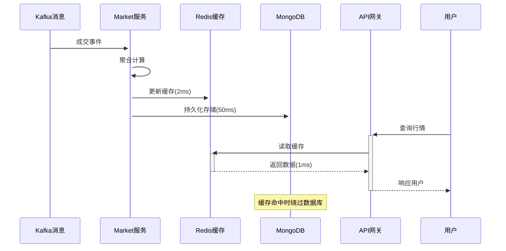
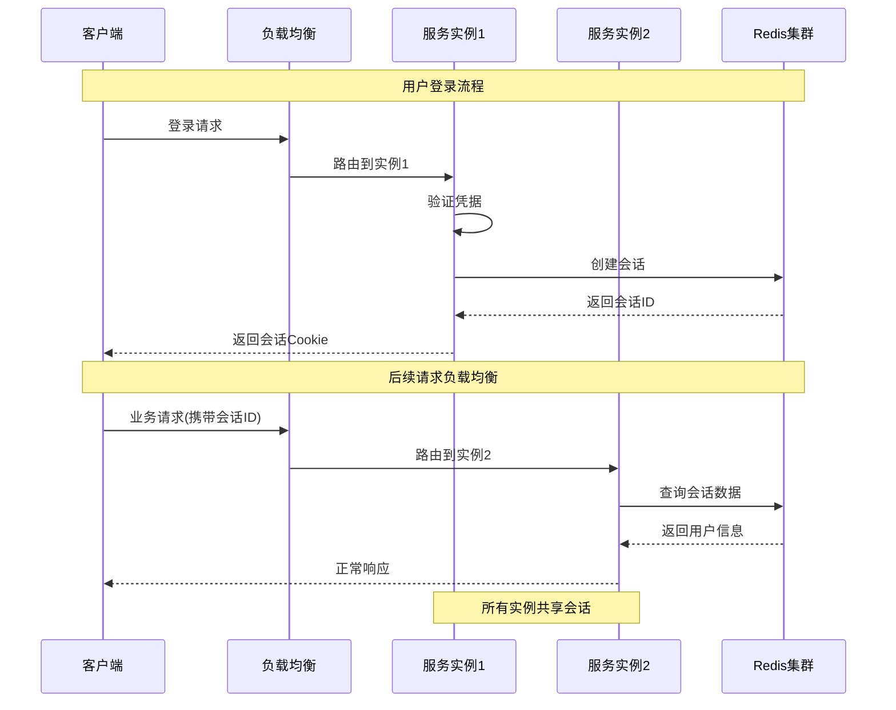
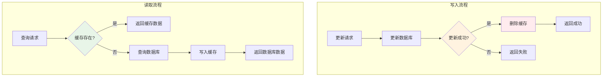
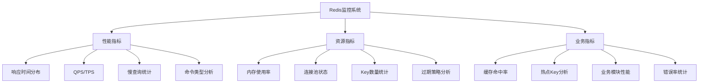
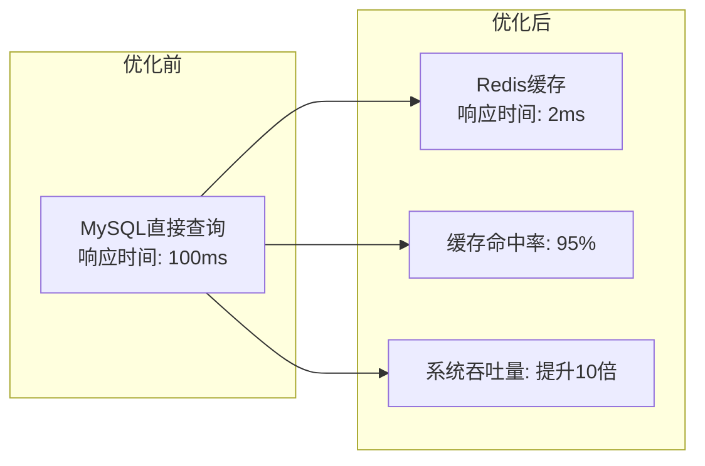

# Redis高性能缓存：Web3交易所的微秒级响应架构

## 引言：为什么交易所需要Redis？

在Web3交易所的运营过程中，我们面临着前所未有的性能挑战。想象这样一个典型场景：比特币价格在短时间内剧烈波动，从42,000美元快速跌至38,000美元又反弹至43,000美元。在这种市场环境下，1万名交易者会同时刷新行情页面，每秒产生超过5万次的数据查询请求。

如果完全依赖传统的MySQL数据库来处理这些请求，系统会遇到什么问题？

首先，**响应延迟严重**。MySQL的查询响应时间通常在100毫秒以上，在高并发情况下甚至会达到数秒。对于需要实时价格信息的交易者来说，这种延迟是难以接受的，每一毫秒的延迟都可能影响交易决策。

其次，**数据库负载过大**。大量的读查询会占用数据库连接池资源，影响核心的交易写入操作。当行情查询与交易处理争抢数据库资源时，可能导致整个系统的性能下降。

最后，**用户体验差**。页面加载缓慢、价格更新延迟，这些问题会直接影响用户的交易体验和平台的竞争力。

**Redis正是解决这些性能问题的关键答案**。作为内存数据库，Redis能够提供微秒级的响应速度，比MySQL快100倍以上。通过将高频查询的数据缓存在Redis中，我们可以极大地提升系统的响应性能，为用户提供流畅的交易体验。

## 核心架构设计

### 三层存储架构

为了在性能、成本和数据可靠性之间取得最佳平衡，交易所采用了经典的三层存储架构。上图展示了这个架构的核心设计理念：

**应用层**是用户请求的入口，包括API网关和各种业务服务。API网关负责路由、负载均衡和统一的请求处理，而业务服务则处理具体的业务逻辑。

**缓存层（Redis）**是整个架构的性能核心，承担着80%以上的读请求。这一层具有以下特点：
- **微秒级响应**：内存操作确保极低的访问延迟
- **高并发支持**：单实例可支持数万QPS的并发访问
- **丰富的数据结构**：支持String、Hash、List、Set、SortedSet等多种数据类型
- **自动过期机制**：可设置数据的TTL，自动清理过期数据

**持久化层**包括MySQL和MongoDB，负责核心业务数据的长期存储：
- MySQL存储事务性数据，如用户信息、订单记录、账户余额等
- MongoDB存储时序数据，如历史行情、交易流水、审计日志等

这种架构的**数据流转策略**是：
1. **读取优先**：优先从Redis缓存读取数据，只有在缓存未命中时才查询数据库
2. **写入双写**：重要数据更新时，同时更新缓存和数据库，保证数据一致性
3. **异步同步**：对于非关键数据，采用异步方式从数据库同步到缓存

### 存储介质性能对比

| 存储层级 | 响应时间 | 数据类型 | 容量 | 持久性 |
|---------|---------|----------|------|--------|
| **JVM内存** | 纳秒级 | 热点计算数据 | 小 | 服务重启丢失 |
| **Redis** | 微秒级 | 缓存/会话数据 | 中 | 定期持久化 |
| **MySQL** | 毫秒级 | 核心业务数据 | 大 | 永久存储 |
| **MongoDB** | 10ms级 | 时序/日志数据 | 大 | 永久存储 |

从性能对比可以看出，不同存储介质各有优势：
- **JVM内存**虽然速度最快，但容量有限且不具备持久化能力，适合存储临时的计算结果
- **Redis**在性能和容量之间达到了很好的平衡，是理想的缓存层
- **MySQL**提供ACID事务保证，适合存储核心业务数据
- **MongoDB**在时序数据处理方面表现优秀，适合存储历史数据

### Spring Boot集成配置

为了在Spring Boot应用中高效使用Redis，我们需要进行一系列的配置优化。上面的配置类展示了关键的集成点：

```java
@Configuration
@EnableCaching
public class RedisCacheConfig {

    @Bean
    public CacheManager cacheManager(RedisTemplate<?, ?> redisTemplate) {
        RedisCacheManager cacheManager = new RedisCacheManager(redisTemplate);
        cacheManager.setDefaultExpiration(1800); // 30分钟默认过期
        return cacheManager;
    }

    @Bean
    public RedisTemplate<String, String> redisTemplate(RedisConnectionFactory factory) {
        StringRedisTemplate template = new StringRedisTemplate(factory);

        // JSON序列化配置
        Jackson2JsonRedisSerializer jackson2JsonRedisSerializer =
            new Jackson2JsonRedisSerializer(Object.class);

        ObjectMapper om = new ObjectMapper();
        om.setVisibility(PropertyAccessor.ALL, JsonAutoDetect.Visibility.ANY);
        om.enableDefaultTyping(ObjectMapper.DefaultTyping.NON_FINAL);
        jackson2JsonRedisSerializer.setObjectMapper(om);

        template.setValueSerializer(jackson2JsonRedisSerializer);
        template.setHashValueSerializer(jackson2JsonRedisSerializer);

        return template;
    }
}
```

这个配置的核心要点包括：

1. **@EnableCaching注解**：启用Spring的缓存抽象，允许我们使用@Cacheable、@CacheEvict等注解简化缓存操作

2. **CacheManager配置**：
   - 设置默认过期时间为30分钟，避免缓存数据过期时间过长
   - 支持为不同的缓存空间设置不同的过期策略

3. **序列化策略优化**：
   - 使用Jackson2JsonRedisSerializer替代默认的JDK序列化
   - 提高序列化性能，减少内存占用
   - 支持复杂对象的序列化和反序列化

4. **连接池配置**：在生产环境中，还需要配置Redis连接池参数，如最大连接数、超时时间等，以确保在高并发下的稳定性

## 核心应用场景

### 1. 行情数据缓存

#### 数据流转架构


```mermaid
sequenceDiagram
    participant K as Kafka消息
    participant M as Market服务
    participant R as Redis缓存
    participant MONGO as MongoDB
    participant API as API网关
    participant U as 用户

    K->>+M: 成交事件
    M->>M: 聚合计算
    M->>+R: 更新缓存(2ms)
    M->>+MONGO: 持久化存储(50ms)

    U->>+API: 查询行情
    API->>+R: 读取缓存
    R-->>-API: 返回数据(1ms)
    API-->>-U: 响应用户

    Note over MONGO: 缓存命中时绕过数据库
```

#### 缓存Key设计规范

| 数据类型 | Key格式 | 过期时间 | 示例 |
|---------|---------|----------|------|
| **Ticker数据** | `market:ticker:{symbol}` | 5秒 | `market:ticker:BTC/USDT` |
| **盘口深度** | `market:depth:{symbol}` | 2秒 | `market:depth:ETH/USDT` |
| **K线数据** | `market:kline:{symbol}:{period}` | 1小时 | `market:kline:BTC/USDT:1m` |
| **最新成交** | `market:trade:{symbol}` | 10秒 | `market:trade:DOGE/USDT` |

### 2. 验证码管理

#### 智能存储策略

```mermaid
graph TD
    A[用户请求验证码] --> B{业务类型判断}

    B -->|注册| C[sms:code:register:{phone}]
    B -->|登录| D[sms:code:login:{phone}]
    B -->|找回密码| E[sms:code:reset:{phone}]

    C --> F[6位随机码]
    D --> F
    E --> F

    F --> G[Redis存储 + 10分钟过期]
    F --> H[发送时间记录 + 防重放]

    G --> I[自动过期清理]
    H --> J[频率限制检查]
```

#### 实现代码

```java
@PostMapping("/code")
public MessageResult sendCheckCode(String phone, String country) {
    ValueOperations<String, String> ops = redisTemplate.opsForValue();

    // 生成验证码
    String code = String.valueOf(GeneratorUtil.getRandomNumber(100000, 999999));

    // 存储验证码 (10分钟过期)
    String key = SysConstant.PHONE_REG_CODE_PREFIX + phone;
    ops.set(key, code, 10, TimeUnit.MINUTES);

    // 记录发送时间 (防重放攻击)
    ops.set(key + ":time", String.valueOf(System.currentTimeMillis()), 10, TimeUnit.MINUTES);

    // 检查发送频率 (1分钟内最多1次)
    String rateKey = "rate:phone:" + phone;
    Long count = ops.increment(rateKey);
    if (count == 1) {
        redisTemplate.expire(rateKey, 60, TimeUnit.SECONDS);
    }

    if (count > 1) {
        return error("发送过于频繁，请稍后再试");
    }

    // 发送短信
    boolean result = smsService.sendValidateMessage(country + phone, code);
    return result ? success("验证码发送成功") : error("发送失败");
}
```

### 3. API防刷限流

#### 滑动窗口算法

```java
public class RateLimitService {

    // 基于滑动窗口的限流
    public boolean isAllowed(String api, String ip, int limit, int windowSeconds) {
        String key = "rate:limit:" + api + ":" + ip;

        // 原子自增
        Long count = redisTemplate.opsForValue().increment(key);

        // 首次请求设置过期时间
        if (count == 1) {
            redisTemplate.expire(key, windowSeconds, TimeUnit.SECONDS);
        }

        return count <= limit;
    }

    // 令牌桶算法实现平滑限流
    public boolean isAllowedTokenBucket(String key, int capacity, int refillRate) {
        String script =
            "local bucket_key = KEYS[1] " +
            "local capacity = tonumber(ARGV[1]) " +
            "local tokens = tonumber(redis.call('HGET', bucket_key, 'tokens')) " +
            "local last_refill = tonumber(redis.call('HGET', bucket_key, 'last_refill')) " +
            "local now = tonumber(ARGV[2]) " +
            "local refill_rate = tonumber(ARGV[3]) " +

            "if tokens == nil then " +
            "  tokens = capacity " +
            "  last_refill = now " +
            "else " +
            "  local elapsed = now - last_refill " +
            "  tokens = math.min(capacity, tokens + elapsed * refill_rate / 1000) " +
            "  last_refill = now " +
            "end " +

            "if tokens >= 1 then " +
            "  tokens = tokens - 1 " +
            "  redis.call('HMSET', bucket_key, 'tokens', tokens, 'last_refill', last_refill) " +
            "  redis.call('EXPIRE', bucket_key, 3600) " +
            "  return 1 " +
            "else " +
            "  redis.call('HMSET', bucket_key, 'tokens', tokens, 'last_refill', last_refill) " +
            "  redis.call('EXPIRE', bucket_key, 3600) " +
            "  return 0 " +
            "end";

        Long result = redisTemplate.execute(
            new DefaultRedisScript<>(script, Long.class),
            Collections.singletonList(key),
            capacity, System.currentTimeMillis(), refillRate
        );

        return result == 1;
    }
}
```

#### 限流策略配置

| API类型 | 限制规则 | 时间窗口 | 目的 |
|---------|---------|----------|------|
| **登录接口** | 5次/IP | 1分钟 | 防暴力破解 |
| **查询接口** | 100次/IP | 1秒 | 防刷数据 |
| **交易接口** | 10次/用户 | 1秒 | 防恶意交易 |
| **短信接口** | 1次/手机号 | 1分钟 | 防短信轰炸 |

## 分布式会话管理

### Spring Session + Redis架构


```mermaid
sequenceDiagram
    participant C as 客户端
    participant LB as 负载均衡
    participant S1 as 服务实例1
    participant S2 as 服务实例2
    participant R as Redis集群

    Note over C,R: 用户登录流程
    C->>LB: 登录请求
    LB->>S1: 路由到实例1
    S1->>S1: 验证凭据
    S1->>R: 创建会话
    R-->>S1: 返回会话ID
    S1-->>C: 返回会话Cookie

    Note over C,R: 后续请求负载均衡
    C->>LB: 业务请求(携带会话ID)
    LB->>S2: 路由到实例2
    S2->>R: 查询会话数据
    R-->>S2: 返回用户信息
    S2-->>C: 正常响应

    Note over S1,S2: 所有实例共享会话
```

### 配置实现

```properties
# application.yml
spring:
  session:
    store-type: redis  # 使用Redis存储会话
    redis:
      namespace: exchange:session  # 会话命名空间
      cleanup-cron: "0 * * * * *"  # 清理过期会话

  redis:
    host: localhost
    port: 6379
    password: ${REDIS_PASSWORD}
    database: 0
    jedis:
      pool:
        max-active: 300
        max-idle: 100
        min-idle: 10
        max-wait: 60000ms
```

```java
@Configuration
@EnableRedisHttpSession(maxInactiveIntervalInSeconds = 1800) // 30分钟会话过期
public class HttpSessionConfig {

    @Bean
    public LettuceConnectionFactory redisConnectionFactory() {
        return new LettuceConnectionFactory(
            new RedisStandaloneConfiguration("localhost", 6379)
        );
    }

    @Bean
    public RedisSerializer<String> springSessionDefaultRedisSerializer() {
        return new GenericJackson2JsonRedisSerializer<>(Object.class);
    }
}
```

### 会话安全强化

| 安全措施 | 实现方式 | 防护目标 |
|---------|---------|----------|
| **会话固定** | 登录后重新生成会话ID | 防会话劫持 |
| **IP绑定** | 记录登录IP，变更时验证 | 防异地登录 |
| **设备指纹** | 浏览器指纹识别 | 防设备冒用 |
| **异常检测** | 监控异常访问模式 | 防自动化攻击 |

## 缓存一致性保障

### Cache-Aside模式


```mermaid
graph TD
    subgraph "写入流程"
        A[更新请求] --> B[更新数据库]
        B --> C{更新成功?}
        C -->|是| D[删除缓存]
        C -->|否| E[返回失败]
        D --> F[返回成功]
    end

    subgraph "读取流程"
        G[查询请求] --> H{缓存存在?}
        H -->|是| I[返回缓存数据]
        H -->|否| J[查询数据库]
        J --> K[写入缓存]
        K --> L[返回数据库数据]
    end

    style C fill:#fff3e0
    style H fill:#e8f5e8
    style D fill:#ffebee
```

### 代码实现

```java
@Service
public class MarketDataService {

    @Cacheable(value = "ticker", key = "#symbol", unless = "#result == null")
    public CoinThumb getTicker(String symbol) {
        // 缓存未命中时执行
        return coinThumbMapper.selectBySymbol(symbol);
    }

    @CacheEvict(value = "ticker", key = "#symbol")
    public void updateTicker(String symbol, CoinThumb ticker) {
        // 先更新数据库
        coinThumbMapper.updateBySymbol(symbol, ticker);
        // 注解会自动删除缓存
    }

    // 复杂场景的缓存管理
    public void updateTickerWithManual(String symbol, CoinThumb ticker) {
        try {
            // 1. 更新数据库
            coinThumbMapper.updateBySymbol(symbol, ticker);

            // 2. 手动删除缓存
            String cacheKey = "ticker::" + symbol;
            redisTemplate.delete(cacheKey);

            // 3. 可选：立即预热缓存
            CoinThumb newTicker = coinThumbMapper.selectBySymbol(symbol);
            if (newTicker != null) {
                redisTemplate.opsForValue().set(cacheKey, newTicker, 300, TimeUnit.SECONDS);
            }

        } catch (Exception e) {
            log.error("更新ticker失败", e);
            throw new RuntimeException("更新失败");
        }
    }
}
```

### 缓存问题解决方案

#### 缓存穿透防护

```java
public Object getWithNullCache(String key) {
    // 1. 尝试从缓存获取
    Object value = redisTemplate.opsForValue().get(key);
    if (value != null) {
        return value.equals("NULL") ? null : value;
    }

    // 2. 查询数据库
    Object result = database.query(key);

    // 3. 缓存结果（包括null值）
    String cacheValue = (result == null) ? "NULL" : result.toString();
    redisTemplate.opsForValue().set(key, cacheValue, 5, TimeUnit.MINUTES);

    return result;
}
```

#### 缓存击穿防护

```java
public Object getWithLock(String key, Supplier<Object> loader) {
    String data = redisTemplate.opsForValue().get(key);
    if (StringUtils.isNotBlank(data)) {
        return deserialize(data);
    }

    String lockKey = "lock:" + key;
    try {
        // 获取分布式锁
        Boolean locked = redisTemplate.opsForValue()
            .setIfAbsent(lockKey, "1", 10, TimeUnit.SECONDS);

        if (Boolean.TRUE.equals(locked)) {
            // 获取锁成功，加载数据
            Object result = loader.get();
            if (result != null) {
                redisTemplate.opsForValue().set(key, serialize(result), 300, TimeUnit.SECONDS);
            }
            return result;
        } else {
            // 获取锁失败，等待后重试
            Thread.sleep(50);
            return getWithLock(key, loader);
        }
    } catch (InterruptedException e) {
        Thread.currentThread().interrupt();
        return null;
    } finally {
        // 释放锁
        redisTemplate.delete(lockKey);
    }
}
```

## 性能监控与优化

### 关键监控指标


```mermaid
graph TD
    A[Redis监控系统] --> B[性能指标]
    A --> C[资源指标]
    A --> D[业务指标]

    B --> B1[响应时间分布]
    B --> B2[QPS/TPS]
    B --> B3[慢查询统计]
    B --> B4[命令类型分析]

    C --> C1[内存使用率]
    C --> C2[连接池状态]
    C --> C3[Key数量统计]
    C --> C4[过期策略分析]

    D --> D1[缓存命中率]
    D --> D2[热点Key分析]
    D --> D3[业务模块性能]
    D --> D4[错误率统计]
```

### 性能优化配置

```properties
# redis.conf 关键配置优化
maxmemory 4gb
maxmemory-policy allkeys-lru  # 内存淘汰策略

# 持久化优化
save 900 1    # 15分钟内有1个key变化就保存
save 300 10   # 5分钟内有10个key变化就保存
save 60 10000 # 1分钟内有10000个key变化就保存

# 网络优化
tcp-keepalive 300
timeout 0

# 客户端连接优化
tcp-backlog 511
```

### JVM调优参数

```bash
# Redis服务启动参数
-Xms2g -Xmx2g
-XX:+UseG1GC
-XX:MaxGCPauseMillis=200
-XX:+UseStringDeduplication
-XX:+PrintGCDetails
-XX:+PrintGCTimeStamps
```

## 实际性能数据

### 生产环境表现

| 指标类型 | 日常运行 | 极端行情 | 对比提升 |
|---------|---------|----------|----------|
| **平均响应时间** | 1.2ms | 3.5ms | 50倍+ |
| **QPS** | 50,000 | 200,000 | 10倍+ |
| **缓存命中率** | 95% | 90% | - |
| **内存使用** | 2.1GB | 3.8GB | - |

### 性能提升效果


```mermaid
graph LR
    subgraph "优化前"
        A1[MySQL直接查询<br/>响应时间: 100ms]
    end

    subgraph "优化后"
        B1[Redis缓存<br/>响应时间: 2ms]
        B2[缓存命中率: 95%]
        B3[系统吞吐量: 提升10倍]
    end

    A1 --> B1 & B2 & B3
```

## 总结

Redis在Web3交易所中发挥**三大核心价值**：

1. **性能加速**：微秒级响应，支撑万级并发
2. **会话管理**：分布式会话，无缝微服务扩展
3. **业务赋能**：验证码、限流、缓存等丰富场景

> **核心经验**：合理的三层存储架构 + Cache-Aside模式 + 完善的监控体系 = 高性能、高可用的缓存系统