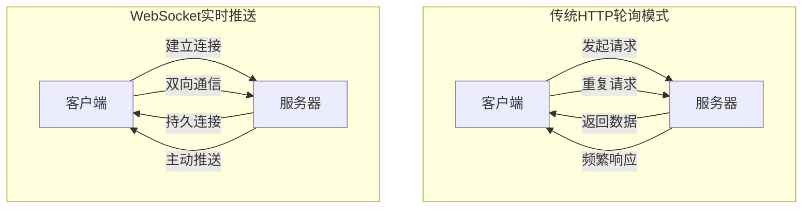
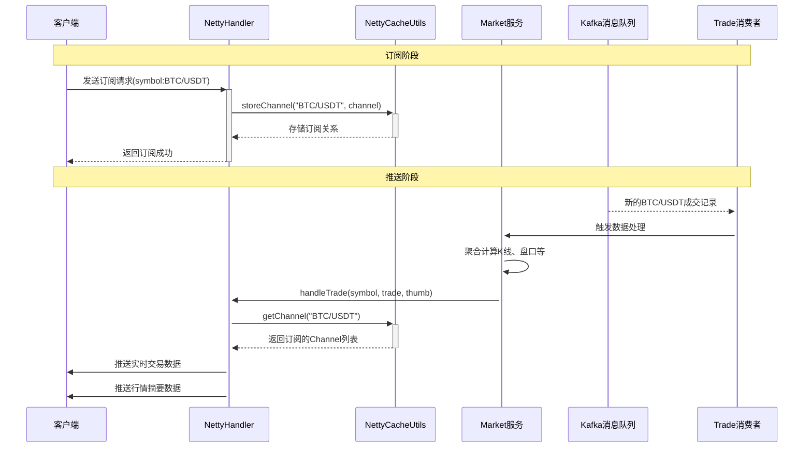

# WebSocket实时消息推送：Web3交易所的高性能通信架构

## 开篇：当毫秒级实时遇上Netty高性能

在一个Web3交易所中，行情数据的实时性直接影响用户的交易决策。当BTC价格剧烈波动时，用户需要在毫秒内获取最新信息，任何延迟都可能导致错失交易机会。这种对实时性的极致要求，传统HTTP轮询模式根本无法满足。

WebSocket技术的出现，让浏览器与服务器之间能够建立持久的全双工通信通道。就像打通了一条直接的高速公路，数据可以实时、双向地流动，彻底改变了Web应用的通信模式。

然而，通用的WebSocket解决方案在金融级高频交易场景下仍有性能瓶颈。本项目选择了基于Netty深度定制的AQMD-NETTY框架，通过极致的性能优化，为交易所构建了一条毫秒级响应的实时数据动脉。本文将带你深入了解这个高性能通信架构的设计精髓，在这个过程中，你将掌握实时系统的架构设计思维和实践经验。

## 第一章：实时通信的技术选择

### WebSocket vs HTTP：从拉取到推送的革命

在深入架构细节之前，我们必须理解为什么WebSocket是实时系统的必然选择。

传统HTTP模式就像写信通信，客户端每次想要获取最新数据，都必须向服务器发送请求。这种方式存在明显的局限性：通信是单向的，每次请求都伴随着HTTP连接的建立和销毁开销，服务器无法主动推送信息。

WebSocket则彻底改变了这种模式。它建立的是一条持久化的全双工通信通道，客户端和服务器可以随时向对方发送消息。这种从"拉取"到"推送"的转变，使得实时性得到了根本性的保障。



### 为何选择自研的AQMD-NETTY框架

在WebSocket技术选型上，项目没有采用Spring Boot内置的WebSocket实现，而是选择了基于Netty的自研AQMD-NETTY框架。这个决策背后有着深刻的性能考量。

**通用框架的局限性**：
- 协议开销较大，消息头部占用较多字节
- 连接管理相对简单，缺乏精细的控制能力
- 编解码机制针对通用场景优化，缺乏金融场景的特殊优化

**AQMD-NETTY的优势**：
- 基于Netty的高性能网络编程，零拷贝、内存池等技术直接受益
- 自定义二进制协议，消息头部开销最小化
- 精细的连接生命周期管理，支持百万级并发连接
- 注解驱动的开发模式，简化业务开发复杂度

## 第二章：AQMD-NETTY框架架构解析

### 框架设计的核心理念

AQMD-NETTY框架的设计哲学是"封装复杂性，暴露简洁性"。它将Netty的复杂性进行了深度封装，通过注解驱动和命令分发的模式，让开发者能够专注于业务逻辑的实现。

**框架核心组件**：

| 组件名称 | 设计理念 | 主要职责 |
| :--- | :--- | :--- |
| `NettyCommand` | 协议字典 | 定义客户端与服务端通信的所有命令码 |
| `@HawkBean` | 组件标记 | 标识WebSocket请求处理器，类似Spring的@Component |
| `@HawkMethod` | 命令映射 | 将方法与具体命令码绑定，类似Spring的@RequestMapping |
| `HawkPushServiceApi` | 推送服务 | 提供统一的推送接口，解耦业务与网络层 |
| `NettyCacheUtils` | 订阅中心 | 管理客户端连接与订阅主题的关系 |

### 协议设计的精妙之处

项目采用了基于整数的命令码协议，相比传统的文本协议，具有明显的性能优势。

**命令码定义示例**：
```java
public class NettyCommand {
    // 订阅相关命令
    public static final int SUBSCRIBE_SYMBOL_THUMB = 2001;
    public static final int UNSUBSCRIBE_SYMBOL_THUMB = 2002;
    public static final int SUBSCRIBE_EXCHANGE = 2003;

    // 推送相关命令
    public static final int PUSH_SYMBOL_THUMB = 3001;
    public static final int PUSH_EXCHANGE_TRADE = 3002;
    public static final int PUSH_EXCHANGE_KLINE = 3003;
}
```

这种设计的优势在于：
- **解析效率高**：整数比较比字符串匹配快几个数量级
- **传输开销小**：4字节的整数比几十字节的字符串节省带宽
- **扩展性强**：通过数值范围规划，便于协议版本管理

## 第三章：订阅管理的实现机制

### 客户端订阅的完整流程

通过分析项目的NettyHandler实现，我们可以看到一个完整的订阅处理流程。

```java
@HawkBean
@Slf4j
public class NettyHandler implements MarketHandler {

    @HawkMethod(cmd = NettyCommand.SUBSCRIBE_EXCHANGE)
    public QuoteMessage.SimpleResponse subscribeExchange(byte[] body, ChannelHandlerContext ctx) {
        QuoteMessage.SimpleResponse.Builder response = QuoteMessage.SimpleResponse.newBuilder();

        // 1. 解析客户端请求数据
        JSONObject json = JSON.parseObject(new String(body));
        String symbol = json.getString("symbol");
        String uid = json.getString("uid");

        // 2. 建立公共主题订阅（接收K线、盘口等公共数据）
        subscribeTopic(ctx.channel(), symbol);

        // 3. 建立私有主题订阅（接收个人订单、成交等私有数据）
        if(StringUtils.isNotEmpty(uid)) {
            subscribeTopic(ctx.channel(), symbol + "-" + uid);
        }

        response.setCode(0).setMessage("订阅成功");
        return response.build();
    }
}
```

这个流程的设计体现了金融系统的特殊需求：既要支持公共行情数据的广播，也要支持个人私有信息的精准推送。

### 订阅关系管理的内存架构

NettyCacheUtils是整个订阅管理的核心，它在内存中维护了客户端连接与订阅主题的映射关系。

```java
public void subscribeTopic(Channel channel, String topic) {
    String userKey = channel.id().asLongText();

    // 建立Channel到UserKey的映射
    if(!NettyCacheUtils.keyChannelCache.containsKey(channel)) {
        NettyCacheUtils.keyChannelCache.put(channel, userKey);
    }

    // 建立Topic到Channel的映射（核心订阅关系）
    NettyCacheUtils.storeChannel(topic, channel);

    // 维护用户的订阅列表
    if(NettyCacheUtils.userKey.containsKey(userKey)) {
        NettyCacheUtils.userKey.get(userKey).add(topic);
    } else {
        Set<String> userKeys = new HashSet<>();
        userKeys.add(topic);
        NettyCacheUtils.userKey.put(userKey, userKeys);
    }
}
```

这种多层映射的设计确保了：
- 快速查找订阅某个主题的所有客户端
- 支持客户端的多个主题订阅
- 便于实现连接断开时的订阅清理

## 第四章：实时推送的架构设计

### 数据推送的触发机制

项目采用了事件驱动的推送架构，当市场数据发生变化时，相关组件会自动触发推送流程。

**推送触发源**：
- Kafka消息消费：当新的成交记录产生时
- 定时任务执行：当K线数据更新时
- 盘口变化：当买卖盘口发生变化时

通过分析NettyHandler的推送方法，我们可以看到不同类型数据的推送逻辑：

```java
@Override
public void handleTrade(String symbol, ExchangeTrade exchangeTrade, CoinThumb thumb) {
    // 1. 推送全局行情摘要（广播给所有订阅者）
    byte[] thumbBody = JSON.toJSONString(thumb).getBytes();
    hawkPushService.pushMsg(
        NettyCacheUtils.getChannel(topicOfSymbol),
        NettyCommand.PUSH_SYMBOL_THUMB,
        thumbBody
    );

    // 2. 推送具体交易对成交记录（精准推送）
    hawkPushService.pushMsg(
        NettyCacheUtils.getChannel(symbol),
        NettyCommand.PUSH_EXCHANGE_TRADE,
        JSONObject.toJSONString(exchangeTrade).getBytes()
    );
}

@Override
public void handleKLine(String symbol, KLine kLine) {
    // 推送K线数据给订阅该交易对的客户端
    hawkPushService.pushMsg(
        NettyCacheUtils.getChannel(symbol),
        NettyCommand.PUSH_EXCHANGE_KLINE,
        JSONObject.toJSONString(kLine).getBytes()
    );
}
```

### 端到端的数据流转时序

让我们通过一个完整的时序图来理解数据从产生到推送到客户端的全过程：



这个时序图展示了系统的核心优势：数据生产与消费的完全解耦。市场数据的变化通过Kafka异步传递给推送服务，确保了数据推送的实时性和可靠性。

## 第五章：性能优化与架构扩展

### 连接管理的性能优化

在高并发场景下，连接管理是系统的关键瓶颈。项目通过多种技术手段优化了连接管理性能。

**连接池化技术**：
- 复用Netty的EventLoop线程，避免线程切换开销
- 使用对象池管理消息对象，减少GC压力
- 采用零拷贝技术，降低内存复制成本

**内存管理优化**：
- 合理设置堆外内存比例，减少GC影响
- 使用内存池管理ByteBuf，避免频繁的内存分配
- 实现智能的内存回收机制，及时释放不再使用的资源

### 消息序列化的性能考量

项目在选择消息序列化方案时，充分考虑了性能因素。

**JSON vs 二进制协议的选择**：
- JSON协议：开发调试方便，但序列化开销较大
- 二进制协议：性能优异，但需要自定义编解码器

最终项目采用了混合策略：控制消息使用Protocol Buffers确保性能，数据消息使用JSON确保开发效率。

### 负载均衡与水平扩展

为了支持更大规模的并发连接，项目设计了水平扩展方案。

**负载均衡策略**：
- 基于一致性哈希的连接分配
- 支持动态扩容，连接可平滑迁移
- 实现故障自动转移，确保服务高可用

**数据同步机制**：
- 跨节点的订阅信息同步
- 消息广播的全局一致性保障
- 分区容错的处理策略

## 第六章：架构权衡与设计决策

### 自研框架的利弊分析

选择自研AQMD-NETTY框架是一个重要的架构决策，需要权衡其利弊。

**优势**：
- **极致性能**：基于Netty的底层优化，能够达到理论性能上限
- **灵活控制**：可以根据业务需求深度定制协议和功能
- **自主可控**：不依赖第三方框架的更新节奏，可以自主掌控技术演进

**挑战**：
- **开发复杂度**：需要团队具备深厚的网络编程经验
- **维护成本**：需要持续投入资源进行框架维护和优化
- **学习曲线**：新团队成员需要较长时间掌握框架使用

### 技术选型的商业考量

从商业角度看，这个技术选择体现了对核心竞争力的追求。

**差异化优势**：
- 在性能指标上形成竞争壁垒
- 为用户提供更好的交易体验
- 支撑更复杂的业务场景创新

**技术积累价值**：
- 培养团队的高性能系统设计能力
- 构建可复用的技术组件库
- 为未来的技术演进奠定基础

## 总结与展望

通过深入分析这个Web3交易所的WebSocket实时推送架构，我们可以看到高性能系统设计的精妙之处。项目不仅在技术选择上追求极致，更在架构设计上体现了深度思考。

这个架构的核心价值在于它成功地将Netty的底层性能优势与业务需求完美结合。从协议设计到连接管理，从订阅机制到推送策略，每一个环节都体现了对性能的极致追求和对用户体验的深度关怀。

对于正在构建实时系统的开发者来说，这个项目提供了宝贵的参考价值。它告诉我们，好的实时架构不仅需要选择合适的技术，更需要深入理解业务场景，进行针对性的优化设计。从协议设计到性能调优，从连接管理到扩展性规划，每一个环节都需要精心设计和持续优化。

随着5G技术的普及和物联网的发展，实时通信的需求将越来越广泛。而本文所阐述的高性能WebSocket架构设计原则，将继续指导着各类实时系统的建设，为用户提供更加流畅、更加实时的数字化体验。