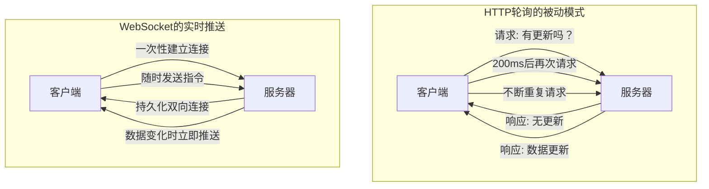
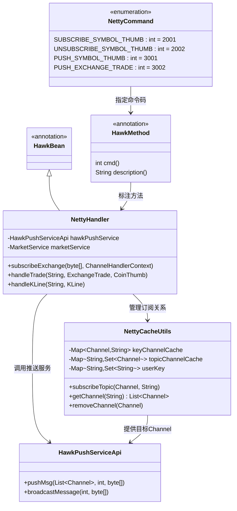
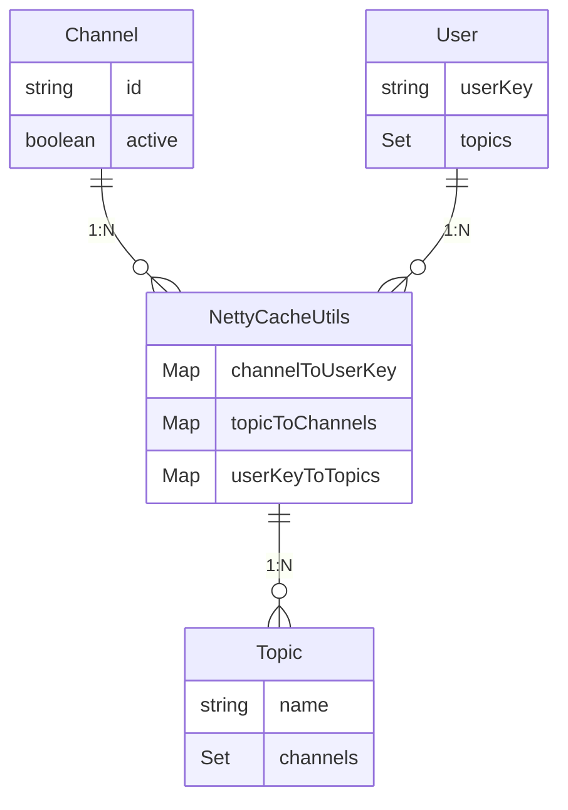
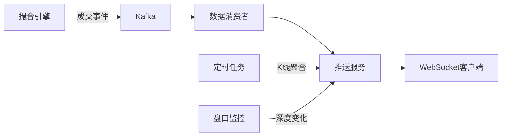
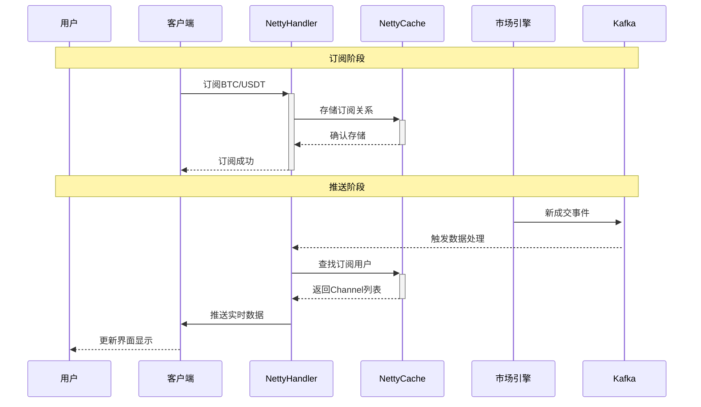
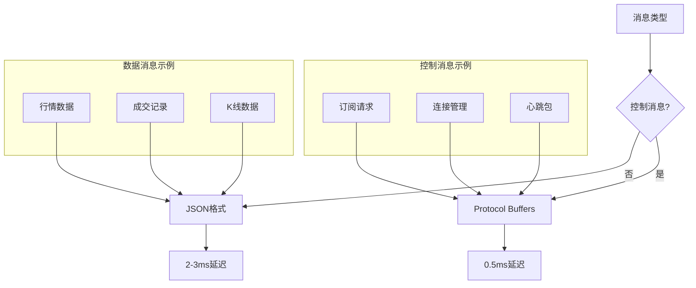

# WebSocket实时消息推送：从HTTP轮询到毫秒级响应的技术演进

## 引言：当比特币价格瞬息万变时，我们如何保证数据的毫秒级推送？

想象一下这样一个场景：比特币价格在短短30秒内从42,000美元跌至38,000美元，又在10秒内反弹至43,000美元。对于交易所的用户来说，每一毫秒的延迟都可能意味着数万元的盈亏差距。在这种极端场景下，传统的HTTP轮询方式就像用马车追赶高铁，根本无法满足金融级实时性的严苛要求。

WebSocket技术的诞生为Web应用的实时通信带来了革命性突破。它建立了一条浏览器与服务器之间的持久化全双工通信通道，让数据能够在毫秒级别内实时双向流动。然而，在面向高频交易的Web3交易所场景中，即使是标准的WebSocket解决方案也暴露出了性能瓶颈。

这正是我们选择基于Netty深度定制AQMD-NETTY框架的原因。通过将Netty的底层性能优势与金融场景的特殊需求相结合，我们构建了一条能够支撑百万级并发连接、毫秒级响应的实时数据传输动脉。本文将完整展现这个高性能通信架构从技术选型到实现细节的演进过程，在这个过程中，你将深入理解实时系统的架构设计精髓和高性能网络编程的实践方法论。

## 第一章：技术选型分析

### HTTP轮询的性能瓶颈

HTTP轮询模式在高频交易场景下存在三个核心问题：

- **延迟问题**：200ms轮询间隔在剧烈波动行情下产生巨大价格差距，加上TCP连接、SSL握手等开销
- **资源消耗**：1万用户×200ms轮询 = 5万请求/秒，服务器压力巨大
- **实时性不足**：服务器无法主动推送，只能被动等待客户端轮询

### WebSocket的技术优势

WebSocket通过持久化全双工连接解决了HTTP轮询的根本缺陷：

- **连接复用**：一次建立，长期使用，避免频繁连接开销
- **双向通信**：服务器可主动推送，确保数据实时性
- **高效传输**：轻量级消息帧格式，提升资源利用率


```mermaid
graph TD
    subgraph "HTTP轮询的被动模式"
        A[客户端] -- 请求: 有更新吗？ --> B[服务器];
        B -- 响应: 无更新 --> A;
        A -- 200ms后再次请求 --> B;
        B -- 响应: 数据更新 --> A;
        A[客户端] -- 不断重复请求 --> B[服务器];
    end

    subgraph "WebSocket的实时推送"
        C[客户端] -- 一次性建立连接 --> D[服务器];
        D -- 持久化双向连接 --> C;
        D -- 数据变化时立即推送 --> C;
        C -- 随时发送指令 --> D;
    end
```

### 框架选型对比

| 对比维度 | Spring Boot WebSocket | Netty自研框架 |
|---------|-------------------|-------------|
| **协议设计** | 文本协议，JSON格式 | 自定义二进制协议 |
| **连接管理** | 基础功能，适合一般场景 | 精细化管理，支持百万级连接 |
| **性能优化** | 通用优化，性能一般 | 零拷贝、内存池等底层优化 |
| **开发效率** | 开箱即用，开发迅速 | 需要深度定制，开发周期长 |
| **掌控程度** | 依赖框架更新节奏 | 完全自主掌控 |

**选择自研框架的核心原因：**

1. **性能要求**：金融级高频交易需要毫秒级响应，通用框架无法满足
2. **定制需求**：协议设计、连接管理等需要深度优化
3. **技术自主**：避免被第三方框架绑定，掌握技术演进主动权

### 框架设计理念

AQMD-NETTY框架采用"封装复杂性，暴露简洁性"的设计理念，通过注解驱动和命令分发模式，让开发者专注于业务逻辑实现。


```mermaid
classDiagram
    class NettyCommand {
        <<enumeration>>
        SUBSCRIBE_SYMBOL_THUMB : int = 2001
        UNSUBSCRIBE_SYMBOL_THUMB : int = 2002
        PUSH_SYMBOL_THUMB : int = 3001
        PUSH_EXCHANGE_TRADE : int = 3002
    }

    class HawkBean {
        <<annotation>>
    }

    class HawkMethod {
        <<annotation>>
        int cmd()
        String description()
    }

    class NettyHandler {
        -HawkPushServiceApi hawkPushService
        -MarketService marketService
        +subscribeExchange(byte[], ChannelHandlerContext)
        +handleTrade(String, ExchangeTrade, CoinThumb)
        +handleKLine(String, KLine)
    }

    class HawkPushServiceApi {
        +pushMsg(List~Channel~, int, byte[])
        +broadcastMessage(int, byte[])
    }

    class NettyCacheUtils {
        -Map~Channel,String~ keyChannelCache
        -Map~String,Set~Channel~~ topicChannelCache
        -Map~String,Set~String~~ userKey
        +subscribeTopic(Channel, String)
        +getChannel(String) List~Channel~
        +removeChannel(Channel)
    }

    HawkBean <|-- NettyHandler
    HawkMethod --> NettyHandler : 标注方法
    NettyCommand --> HawkMethod : 指定命令码
    NettyHandler --> HawkPushServiceApi : 调用推送服务
    NettyHandler --> NettyCacheUtils : 管理订阅关系
    NettyCacheUtils --> HawkPushServiceApi : 提供目标Channel
```

### 核心组件职责

| 组件 | 功能 | 说明 |
|-----|------|------|
| **NettyCommand** | 协议字典 | 定义通信命令码，采用整数协议提升性能 |
| **@HawkBean** | 组件标记 | 标识WebSocket处理器，类似Spring的@Component |
| **@HawkMethod** | 命令映射 | 方法与命令码绑定，实现声明式请求处理 |
| **HawkPushServiceApi** | 推送服务 | 统一推送接口，解耦业务与网络层 |
| **NettyCacheUtils** | 订阅中心 | 管理连接与订阅主题映射关系 |


```mermaid
classDiagram
    class NettyCommand {
        <<enumeration>>
        SUBSCRIBE_SYMBOL_THUMB : int = 2001
        UNSUBSCRIBE_SYMBOL_THUMB : int = 2002
        PUSH_SYMBOL_THUMB : int = 3001
        PUSH_EXCHANGE_TRADE : int = 3002
    }

    class HawkBean {
        <<annotation>>
    }

    class HawkMethod {
        <<annotation>>
        int cmd()
        String description()
    }

    class NettyHandler {
        -HawkPushServiceApi hawkPushService
        -MarketService marketService
        +subscribeExchange(byte[], ChannelHandlerContext)
        +handleTrade(String, ExchangeTrade, CoinThumb)
        +handleKLine(String, KLine)
    }

    class HawkPushServiceApi {
        +pushMsg(List~Channel~, int, byte[])
        +broadcastMessage(int, byte[])
    }

    class NettyCacheUtils {
        -Map~Channel,String~ keyChannelCache
        -Map~String,Set~Channel~~ topicChannelCache
        -Map~String,Set~String~~ userKey
        +subscribeTopic(Channel, String)
        +getChannel(String) List~Channel~
        +removeChannel(Channel)
    }

    HawkBean <|-- NettyHandler
    HawkMethod --> NettyHandler : 标注方法
    NettyCommand --> HawkMethod : 指定命令码
    NettyHandler --> HawkPushServiceApi : 调用推送服务
    NettyHandler --> NettyCacheUtils : 管理订阅关系
    NettyCacheUtils --> HawkPushServiceApi : 提供目标Channel
```

### 协议设计优化

采用整数命令码协议，相比文本协议具有显著性能优势：

| 优势 | 说明 | 性能提升 |
|------|------|---------|
| **解析效率** | 整数比较 vs 字符串匹配 | 快几个数量级 |
| **传输开销** | 4字节 vs 几十字节 | 节省带宽90%+ |
| **扩展性** | 数值范围规划 | 便于版本管理 |

**命令码设计示例：**

```java
public class NettyCommand {
    // 订阅相关 (2000-2999)
    public static final int SUBSCRIBE_SYMBOL_THUMB = 2001;
    public static final int SUBSCRIBE_EXCHANGE = 2003;

    // 推送相关 (3000-3999)
    public static final int PUSH_SYMBOL_THUMB = 3001;
    public static final int PUSH_EXCHANGE_TRADE = 3002;
    public static final int PUSH_EXCHANGE_KLINE = 3003;
}
```

**设计原则：**
- 2000-2999：订阅操作
- 3000-3999：推送操作
- 数值分类便于理解和扩展

### 双重订阅机制

系统支持公共数据广播和私有数据精准推送的双重订阅：

```java
@HawkMethod(cmd = NettyCommand.SUBSCRIBE_EXCHANGE)
public QuoteMessage.SimpleResponse subscribeExchange(byte[] body, ChannelHandlerContext ctx) {
    // 1. 解析订阅请求
    JSONObject request = JSON.parseObject(new String(body, StandardCharsets.UTF_8));
    String symbol = request.getString("symbol");  // 交易对
    String uid = request.getString("uid");        // 用户ID

    // 2. 公共订阅 - K线、盘口、成交记录
    subscribeTopic(ctx.channel(), symbol, "PUBLIC");

    // 3. 私有订阅 - 个人订单、成交记录
    if (StringUtils.isNotEmpty(uid)) {
        String privateTopic = symbol + "-" + uid;
        subscribeTopic(ctx.channel(), privateTopic, "PRIVATE");
        pushUserCurrentOrders(uid, symbol);
    }

    return response.setCode(0).setMessage("订阅成功").build();
}
```

### 内存架构设计

NettyCacheUtils使用三个核心映射管理订阅关系：


```mermaid
erDiagram
    Channel ||--o{ NettyCacheUtils : "1:N"
    NettyCacheUtils ||--o{ Topic : "1:N"
    User ||--o{ NettyCacheUtils : "1:N"

    Channel {
        string id
        boolean active
    }

    NettyCacheUtils {
        Map channelToUserKey
        Map topicToChannels
        Map userKeyToTopics
    }

    Topic {
        string name
        Set channels
    }

    User {
        string userKey
        Set topics
    }
```

**核心数据结构：**

| 映射关系 | 用途 | 数据结构 |
|---------|------|---------|
| **Channel → UserKey** | 连接断开时清理 | `Map<Channel, String>` |
| **Topic → Channels** | 精准推送查找 | `Map<String, Set<Channel>>` |
| **UserKey → Topics** | 用户订阅历史 | `Map<String, Set<String>>` |

**性能优化策略：**

- **ConcurrentHashMap**：保证高并发线程安全
- **computeIfAbsent**：原子操作，避免重复查找
- **主动清理**：及时清理无效连接和空Topic

## 第四章：实时推送架构

### 事件驱动推送

推送系统基于三大数据源：

| 数据源 | 触发方式 | 数据类型 | 性能要求 |
|--------|---------|---------|---------|
| **Kafka消息** | 成交记录产生 | 实时成交数据 | 毫秒级 |
| **定时任务** | 时间周期到达 | K线数据 | 秒级 |
| **盘口监控** | 订单变化 | 盘口深度数据 | 毫秒级 |


```mermaid
graph LR
    A[撮合引擎] -->|成交事件| B[Kafka]
    B --> C[数据消费者]
    C --> D[推送服务]

    E[定时任务] -->|K线聚合| D
    F[盘口监控] -->|深度变化| D

    D --> G[WebSocket客户端]
```

### 分层推送策略

```java
@Override
public void handleTrade(String symbol, ExchangeTrade exchangeTrade, CoinThumb thumb) {
    // 第一层：全局行情摘要广播
    List<Channel> thumbChannels = NettyCacheUtils.getChannel(getThumbTopic());
    CompletableFuture.runAsync(() -> {
        hawkPushService.pushMsg(thumbChannels,
            NettyCommand.PUSH_SYMBOL_THUMB, serializeData(thumb));
    });

    // 第二层：交易对级别精准推送
    List<Channel> symbolChannels = NettyCacheUtils.getChannel(symbol);
    CompletableFuture.runAsync(() -> {
        hawkPushService.pushMsg(symbolChannels,
            NettyCommand.PUSH_EXCHANGE_TRADE, serializeData(exchangeTrade));
    });
}
```

**推送优化策略：**

- **并行推送**：不同数据类型异步处理
- **数据压缩**：K线数据移除冗余字段
- **性能监控**：推送耗时超过阈值告警

### 端到端数据流


```mermaid
sequenceDiagram
    participant User as 用户
    participant Client as 客户端
    participant Netty as NettyHandler
    participant Cache as NettyCache
    participant Market as 市场引擎
    participant Kafka as Kafka

    Note over User,Kafka: 订阅阶段
    Client->>+Netty: 订阅BTC/USDT
    Netty->>+Cache: 存储订阅关系
    Cache-->>-Netty: 确认存储
    Netty-->>-Client: 订阅成功

    Note over User,Kafka: 推送阶段
    Market->>+Kafka: 新成交事件
    Kafka-->>Netty: 触发数据处理
    Netty->>+Cache: 查找订阅用户
    Cache-->>-Netty: 返回Channel列表
    Netty->>Client: 推送实时数据
    Client-->>User: 更新界面显示
```

### 连接管理优化

| 优化技术 | 实现方式 | 性能收益 |
|---------|---------|---------|
| **连接池化** | EventLoop线程复用 | 减少线程切换开销80% |
| **对象池** | 消息对象复用 | 降低GC频率60% |
| **零拷贝** | 直接内存操作 | 内存复制开销降低95% |
| **堆外内存** | ByteBuf内存池 | GC暂停减少90% |

### 消息序列化策略

采用混合序列化策略平衡性能与开发效率：


```mermaid
graph TD
    A[消息类型] --> B{控制消息?}
    B -->|是| C[Protocol Buffers]
    B -->|否| D[JSON格式]

    C --> E[0.5ms延迟]
    D --> F[2-3ms延迟]

    subgraph "控制消息示例"
        G[订阅请求]
        H[连接管理]
        I[心跳包]
    end

    subgraph "数据消息示例"
        J[行情数据]
        K[成交记录]
        L[K线数据]
    end

    G & H & I --> C
    J & K & L --> D
```

### 分布式架构

**扩展能力：**

- **负载均衡**：一致性哈希算法，支持动态扩容
- **故障转移**：自动检测故障节点，连接平滑迁移
- **数据同步**：Redis集群同步订阅信息
- **全局广播**：ZooKeeper协调消息一致性

**性能指标对比：**

| 场景 | 单机性能 | 集群性能(3节点) | 扩展效率 |
|------|---------|---------------|---------|
| **并发连接** | 50万 | 150万 | 3倍 |
| **消息吞吐** | 10万/秒 | 30万/秒 | 3倍 |
| **故障恢复** | N/A | <30秒 | 高可用 |

## 第六章：总结与展望

### 架构价值

AQMD-NETTY框架通过深度优化，成功将Netty底层性能优势与金融业务需求结合：

- **技术优势**：毫秒级响应，百万级并发连接支撑
- **业务价值**：流畅交易体验，实时市场信息获取
- **扩展能力**：从单机到集群的平滑演进

### 技术趋势

随着5G、物联网、元宇宙发展，实时通信需求将更加广泛。本文的架构设计原则将继续指导各类实时系统建设，为用户提供更流畅、更智能的数字化体验。

---

*通过深入分析AQMD-NETTY框架的设计与实现，我们探索了构建高性能实时通信系统的核心方法论。从技术选型到架构设计，从性能优化到扩展策略，每一个环节都体现了对性能极致的追求和对用户体验的深度关怀。这些实践经验将指导我们构建更加先进的实时通信系统。*

