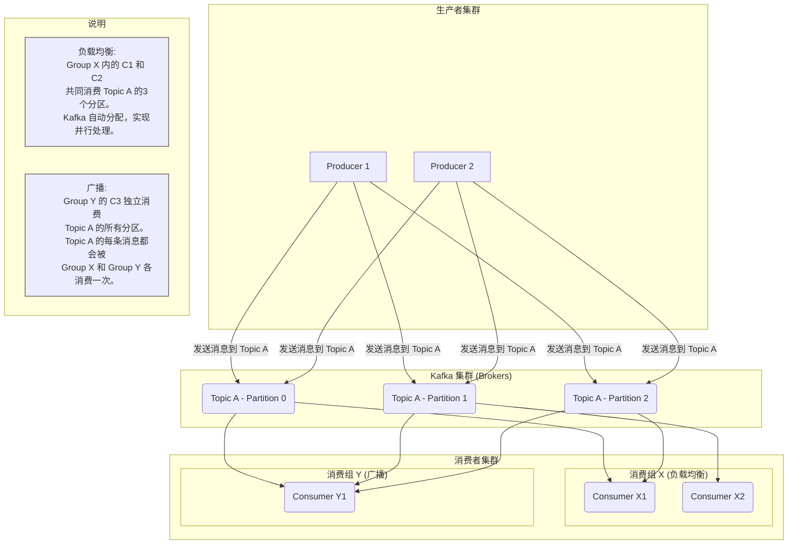
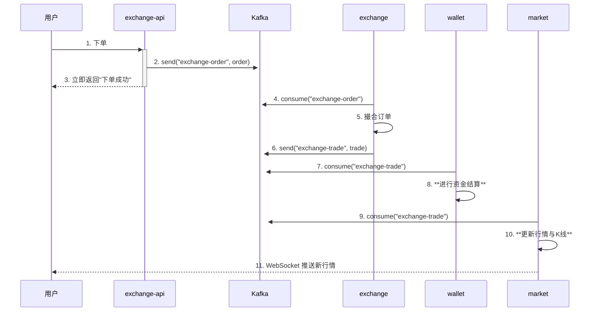
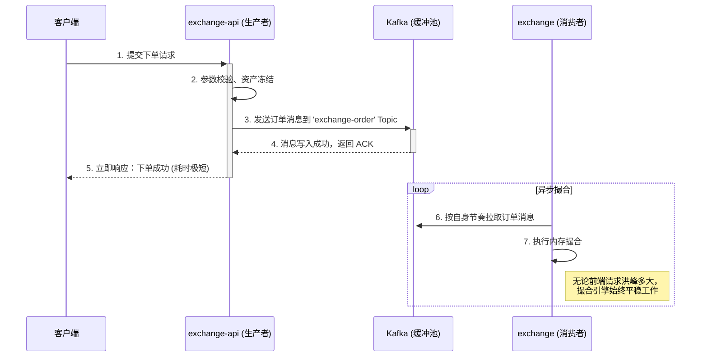
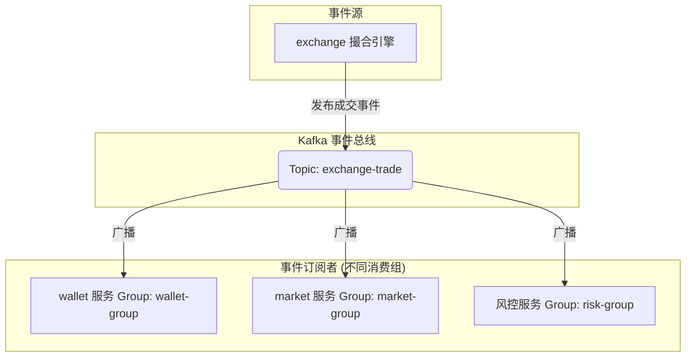

# 第九章：异步通信核心：Apache Kafka

## 开篇：为交易系统注入“弹性”与“韧性”

在设计高性能交易系统时，我们面临一个核心挑战：如何在市场行情剧烈波动、用户下单请求如洪水般涌来时，保证系统既能提供毫秒级的响应，又不会被瞬间的流量洪峰冲垮？

传统的服务间同步调用（如 Feign）就像**打电话**：你必须拨通对方的电话，等待对方接听并处理你的请求，然后才能挂断。这个过程是**阻塞**的。如果对方很忙（服务器高负载）或者电话占线（网络拥堵），你就只能一直等待，甚至失败。

而异步消息驱动架构，则像是**发邮件**：你把需要处理的事情写成邮件（消息），发送到对方的邮箱（Kafka Topic）后，你的任务就完成了，可以立刻去做别的事情。对方（消费者服务）则可以在自己方便的时候，从邮箱里取出邮件进行处理。

为了构建一个真正健壮的系统，我们必须引入**异步消息驱动架构**。Apache Kafka 正是实现这一架构的基石。它在系统中扮演着“中央调度与缓冲中心”的角色，将原本紧密耦合的服务调用，转变为松耦合的事件发布与订阅，从而为整个系统注入了无与伦- 比的**弹性**与**韧性**。

本章，我们将深入 Kafka 的核心机制，并结合本项目的两大关键场景——**交易流程解耦**与**成交事件广播**，剖析它是如何支撑起一个高可靠、高吞吐的金融级微服务架构的。

---

### 一、 Kafka 核心机制：从“快递中心”模型说起

要理解 Kafka 的强大之处，我们可以将其想象成一个高效的“中央快递分拣中心”。

*   **生产者 (Producer)** 如同“寄件人”，它将业务事件（如下单请求）打包成“包裹”（消息），投递到 Kafka。投递成功后，生产者的任务便已完成，可以立即返回，处理下一个请求。
*   **消费者 (Consumer)** 如同“收件人”，它根据自己的处理能力，从 Kafka 中拉取属于自己的“包裹”进行处理。
*   **主题 (Topic)** 是消息的逻辑分类，如同快递包裹上的“目的地城市”。生产者将消息发往特定 Topic，消费者则订阅自己感兴趣的 Topic。
*   **分区 (Partition)** 是 Kafka 实现高吞吐量的关键，如同通往某个城市的“多条并行高速公路”。一个 Topic 可以分为多个分区，分布在不同的服务器（Broker）上，允许被并行读写。
*   **消费组 (Consumer Group)** 则像“同一个收件地址的家庭成员”，组内的多个消费者可以并行处理同一个 Topic 不同分区的消息，极大地提升了消费能力。一个分区在同一时间只能被组内的一个消费者处理，这保证了消息处理的有序性和唯一性。

这种模型带来了两大核心优势：**负载均衡**（一个消费组内的成员分摊处理压力）和**广播**（不同消费组订阅同一主题，实现事件的扇出）。



---

### 第二节：项目核心 Topic 总览：系统的数据血脉

在深入具体场景前，我们先通过一张全局地图，来了解流淌在系统“血脉”中的核心数据。

| Topic 名称 | 消息生产者 | 核心消费者 | 消息内容 (Payload) | 核心业务流程 |
| :--- | :--- | :--- | :--- | :--- |
| **`exchange-order`** | `exchange-api` | `exchange` | `ExchangeOrder` 对象 | **订单撮合**：用户下单后，订单信息被发送到此 Topic，等待撮合引擎处理。 |
| **`exchange-trade`** | `exchange` | `wallet`, `market` | `ExchangeTrade` 列表 | **成交广播**：撮合成功后，成交记录被广播，用于资产结算和行情更新。 |
| **`deposit`** | `wallet-rpc` 服务 | `wallet` | `Deposit` 对象 | **充值入账**：RPC 服务监听到链上充值后，通知 `wallet` 服务为用户入账。 |
| **`withdraw`** | `ucenter-api` | `wallet` | `WithdrawRecord` 对象 | **提现请求**：用户提交提现申请后，通知 `wallet` 服务进行处理。 |
| **`user_registered`** | `ucenter-api` | `wallet` | `Member` 对象 | **新用户注册**：新用户注册成功后，通知 `wallet` 服务为其初始化所有币种的钱包。 |

---

### 第三节：核心流程剖析：一次完整的交易生命周期

现在，让我们聚焦于最核心的交易流程，看看 Kafka 是如何像一位交响乐指挥家一样，调度各个服务协同完成工作的。



这个流程完美地展示了 Kafka 的两大核心价值：

*   **削峰填谷与用户体验优化**：在第 1-3 步，无论市场多火爆，`exchange-api` 都能通过 Kafka 这个巨大的缓冲池，瞬间处理完用户的下单请求，提供丝滑的体验。
*   **事件驱动与系统解耦**：在第 6-11 步，`exchange` 引擎只负责发布“成交”这一核心事件。`wallet` 和 `market` 作为订阅者，各自独立地完成自己的工作，未来还可以轻松地加入更多的订阅者（如风控、返佣服务），而无需修改任何现有代码。

---

### 第四节：代码实现：确保金融级的可靠性

在用户下单的场景中，Kafka 的价值体现得淋漓尽致。它在作为网关的 `exchange-api` 和作为撮合引擎的 `exchange` 服务之间，构建了一个强大的缓冲层。



*   **系统解耦，优化用户体验**：`exchange-api` 的职责被简化为：接收请求、校验数据、并将订单消息可靠地发送到 Kafka。一旦 Kafka 确认接收，`exchange-api` 就可以立即向用户返回“下单成功”，响应时间被压缩到极致。它不再需要关心撮合引擎当前是否繁忙，是否处理成功。
*   **削峰填谷，提升系统韧性**：当市场剧烈波动时，瞬时涌入的下单请求会被 Kafka 这个巨大的“蓄水池”全部吸收。撮合引擎 `exchange` 服务则可以按照自己稳定的、最大的处理能力，从 Kafka 中匀速拉取订单进行处理，从而避免了被瞬时流量冲垮的风险。

---

### 三、 核心场景（二）：成交事件广播与系统扩展

当 `exchange` 撮合引擎产生一笔成交记录后，这个“事件”需要被多个下游服务感知并处理。例如，`wallet` 服务需要进行资产结算，`market` 服务需要更新行情。

利用 Kafka 的消费组机制，我们可以实现一个优雅的事件广播（Fan-out）模式。



*   **关注点分离**：`exchange` 服务只负责产生核心的成交事件，它不关心谁需要这个事件，也不关心下游服务如何处理。
*   **消费隔离**：`wallet`、`market`、`risk` 服务各自属于独立的消费组。它们独立地消费 `exchange-trade` 主题中的同一份数据，互不影响。任何一个服务的消费延迟或故障，都不会影响其他服务。
*   **高扩展性**：未来若要增加一个新的“交易返佣”服务，只需让新服务以一个新的消费组 ID 去订阅 `exchange-trade` 主题即可，现有所有服务的代码都无需任何改动。

---

### 四、 代码实现：确保金融级的可靠性

在金融场景下，消息的可靠性至关重要。这意味着我们必须确保消息**不丢失**，并且业务被**正确处理**。

#### 4.1 生产者 (`exchange-api`)：确保消息不丢失

```java
// 关键配置 application.properties
// acks=all: Leader Broker 必须等待所有 Follower Broker 都同步完成才向生产者确认。
// 这是最高等级的可靠性保证。
spring.kafka.producer.acks=all
// retries=3: 在网络抖动等情况下，自动重试3次，增加发送成功的概率。
spring.kafka.producer.retries=3
// 使用 JsonSerializer 自动将对象序列化为 JSON 字符串
spring.kafka.producer.value-serializer=org.springframework.kafka.support.serializer.JsonSerializer

// 发送逻辑 OrderService.java
@Autowired
private KafkaTemplate<String, Object> kafkaTemplate;

public void sendOrderToKafka(ExchangeOrder order) {
    // 参数1: Topic
    // 参数2: Message Key - 保证同一交易对的订单进入同一分区，从而被顺序消费
    // 参数3: Message Body
    kafkaTemplate.send("exchange-order", order.getSymbol(), order);
}
```
**核心知识点**：通过设置消息的 **Key** (`order.getSymbol()`)，Kafka 会确保具有相同 Key 的消息被路由到同一个分区。这对于交易系统至关重要，因为它保证了**同一交易对的订单消息能被撮合引擎顺序消费**，避免了因乱序导致的价格优先、时间优先原则失效。

#### 4.2 消费者 (`exchange`)：确保业务被正确处理

```java
// 关键配置 application.properties
// 关闭自动提交 offset，转为手动控制
spring.kafka.listener.ack-mode=MANUAL_IMMEDIATE
// 当没有历史 offset 或 offset 失效时，从最早的消息开始消费
spring.kafka.consumer.auto-offset-reset=earliest
// 反序列化时信任所有包，简化配置
spring.kafka.consumer.properties.spring.json.trusted.packages=*

// 消费逻辑 ExchangeOrderConsumer.java
@KafkaListener(topics = "exchange-order")
public void handleOrder(ConsumerRecord<String, String> record, Acknowledgment ack) {
    try {
        // 1. 解析消息
        ExchangeOrder order = JSON.parseObject(record.value(), ExchangeOrder.class);
        
        // 2. 执行核心业务逻辑（撮合）
        exchangeProcessor.process(order);

        // 3. 业务成功后，手动提交 Offset
        // 通知 Kafka：这条消息已被成功处理
        ack.acknowledge();
    } catch (Exception e) {
        // 如果业务处理失败，不调用 ack.acknowledge()
        // Kafka 将在下次轮询时重新投递这条消息，从而保证业务的“至少一次”成功处理
        log.error("撮合处理失败，等待重试: {}", record.value(), e);
    }
}
```
**核心知识点**：我们采用了**手动提交 Offset** 的策略，这是保证**至少一次消费 (At-least-once Semantics)** 的关键。只有当核心业务逻辑（撮合）被成功执行后，才调用 `ack.acknowledge()`。如果在处理过程中发生任何异常，Offset 不会被提交，Kafka 会在稍后重新投递这条消息，确保订单不会因撮合引擎的临时故障而丢失。

---

### 第五节：总结与展望

本章我们深入了 Apache Kafka，理解了它如何通过异步消息机制为微服务架构带来解耦、削峰、广播的核心能力。通过对下单和成交两大场景的剖析，我们看到了一个健壮的分布式系统是如何构建的。更重要的是，通过对生产者可靠性配置和消费者手动 Ack 机制的源码分析，我们掌握了实现金融级消息系统所必需的关键技术。

至此，我们已经完成了对项目所有核心基础设施的深度学习。从下一章开始，我们将正式进入各个业务微服务的源码世界，从最基础的**用户中心 (`ucenter-api`)** 开始，逐一揭开它们的神秘面纱。