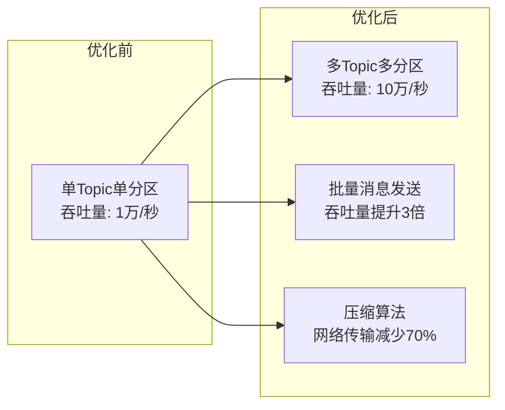
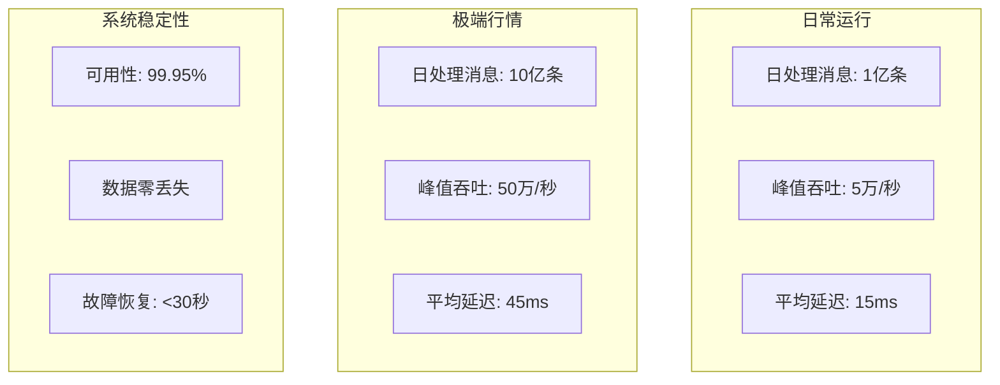

# Apache Kafka：交易所异步通信核心架构

## 引言：为什么交易所需要Kafka？

在高频交易环境中，系统面临着巨大的并发压力和实时性要求。想象一下这样的场景：比特币价格剧烈波动，1万用户同时下单，每秒产生5万笔交易请求。如果采用传统的同步调用架构，系统会面临什么困境？

首先，**响应延迟问题**会严重影响用户体验。同步调用中，每个请求都需要等待完整的业务流程完成，包括参数验证、资金冻结、订单撮合、资产结算等环节。在流量洪峰时，这个链条中的任何一个环节出现延迟，都会导致用户等待时间过长，甚至出现超时失败。

其次，**系统耦合度**过高会导致维护困难。如果撮合引擎、钱包服务、行情服务等模块紧密耦合，任何一个模块的故障都可能引发连锁反应，造成整个系统的瘫痪。

最后，**流量洪峰**会直接冲击核心业务系统。没有缓冲机制的情况下，突发的交易请求会瞬间压垮数据库和撮合引擎，造成服务不可用。

**Kafka异步消息队列正是解决这些问题的关键答案**。它如同城市的高效地铁系统，能够承载海量乘客（消息）有序通行，为交易所提供了强大的异步处理能力。通过Kafka，我们可以在用户请求和核心业务处理之间建立一个缓冲层，实现流量的削峰填谷，保证系统的稳定性和响应速度。

## 核心架构设计

### Kafka集群拓扑

交易所的Kafka架构采用了典型的分层设计，包括生产者层、Kafka集群和消费者层。上图展示了完整的数据流转架构：

**生产者层**负责产生业务消息：
- `exchange-api`作为交易入口，将用户的买卖订单转换为订单消息发送到`exchange-order`主题
- `wallet-rpc`处理区块链相关的充值事件，将链上交易信息发送到`deposit`主题
- `ucenter-api`处理用户相关的操作，包括提现请求和用户注册事件

**Kafka集群**是消息传输的核心枢纽：
- 采用3个Broker节点组成高可用集群，确保数据冗余和故障恢复能力
- 通过分区的Topic机制实现消息的分类管理和并行处理
- 每个Topic都配置了合适的副本因子，保证数据的可靠性

**消费者层**按照业务职责分组处理消息：
- 撮合组专门负责订单匹配，消费`exchange-order`主题进行内存撮合
- 结算组处理资产相关的操作，包括成交结算和充值入账
- 行情组负责市场数据的生成和推送

这种分层架构的优势在于**职责清晰、扩展灵活、故障隔离**。每个层次都可以独立扩容，某个消费者的故障不会影响其他业务模块的正常运行。

### 核心Topic设计

| Topic | 生产者 | 消费者 | 消息内容 | 业务作用 |
|-------|--------|--------|----------|---------|
| **exchange-order** | exchange-api | exchange | ExchangeOrder | 订单撮合 |
| **exchange-trade** | exchange | wallet, market | ExchangeTrade | 成交广播 |
| **deposit** | wallet-rpc | wallet | Deposit | 充值入账 |
| **withdraw** | ucenter-api | wallet | WithdrawRecord | 提现处理 |
| **user_registered** | ucenter-api | wallet | Member | 钱包初始化 |

每个Topic都承载着特定的业务职责：

- **exchange-order**是交易系统的核心Topic，承载所有用户的买卖订单消息。exchange-api在完成资金冻结后，立即将订单信息发送到此Topic，由撮合引擎异步处理。这种设计确保了下单请求的快速响应，用户无需等待撮合完成即可获得成功反馈。

- **exchange-trade**实现了事件驱动的广播机制。当撮合引擎产生成交记录后，会向此Topic发送成交事件。多个服务（钱包、行情、风控）可以并行消费同一笔成交事件，实现了一对多的广播效果，大大提高了系统的解耦度和扩展性。

- **deposit**和**withdraw**处理法币和加密货币的充值提现。wallet-rpc监听区块链事件，确认交易后将充值信息发送到deposit Topic；用户的提现请求则通过withdraw Topic异步处理。

- **user_registered**体现了微服务间的协作机制。当用户在ucenter-api注册成功后，通过此Topic通知wallet服务为新用户初始化钱包账户，避免了服务间的直接调用。

## 交易流程解耦

### 异步下单流程

异步下单是Kafka在交易所中最典型的应用场景，它将原本同步的交易流程拆分为两个独立的阶段，极大地提升了系统的并发能力和用户体验。

如上面的时序图所示，整个流程可以分为**同步响应阶段**和**异步处理阶段**：

**同步响应阶段**（步骤1-5）：
1. 用户提交下单请求到exchange-api，携带交易对、价格、数量等参数
2. exchange-api进行严格的参数验证，包括用户状态检查、交易对配置验证、价格精度校验等
3. 验证通过后，exchange-api调用wallet服务同步冻结相应的资金
4. 资金冻结成功后，exchange-api将订单信息序列化为JSON格式，发送到Kafka的exchange-order主题
5. Kafka确认消息写入成功后，exchange-api立即向用户返回订单ID，整个过程通常在5毫秒内完成

**异步处理阶段**（步骤6-13）：
6. 撮合引擎作为消费者，从Kafka消费订单消息
7. 在内存中进行高速撮合处理，根据价格优先、时间优先的原则匹配买卖订单
8. 撮合成功后，生成成交记录并发送到exchange-trade主题
9. 钱包服务消费成交事件，进行资产结算和余额更新
10. 行情服务消费成交事件，更新最新的市场行情数据
11. 通过WebSocket将最新的价格和成交信息推送给用户

这种异步架构的**核心优势**体现在三个方面：

- **用户体验提升**：用户无需等待撮合完成，下单请求在5毫秒内即可获得响应，即使在市场剧烈波动时也能保持流畅的交易体验。

- **系统解耦**：撮合引擎作为独立的服务运行，exchange-api不需要了解撮合的具体实现。即使撮合引擎暂时不可用，用户的下单请求仍然可以被Kafka缓存，待服务恢复后继续处理。

- **流量削峰**：Kafka作为缓冲层，可以将突发的交易请求平滑化。在交易高峰期，即使撮合引擎的处理能力跟不上订单生成速度，Kafka也能确保消息不丢失，避免系统过载。

### 消息分区策略

在交易所场景中，消息的顺序性至关重要。同一交易对的订单必须按照时间顺序被处理，否则会导致撮合逻辑混乱。Kafka的分区机制为我们提供了完美的解决方案。

上面的代码展示了生产者的核心配置，其中最关键的是**分区策略**的定制。我们通过实现`SymbolPartitioner`类，确保同一交易对的订单消息总是被发送到同一个分区：

```java
// KafkaProducerConfiguration.java
@Configuration
public class KafkaProducerConfiguration {

    @Bean
    public ProducerFactory<String, Object> producerFactory() {
        Map<String, Object> configProps = new HashMap<>();

        // 可靠性配置：等待所有follower同步
        configProps.put(ProducerConfig.ACKS_CONFIG, "all");

        // 重试机制：网络异常时自动重试
        configProps.put(ProducerConfig.RETRIES_CONFIG, 3);

        // 分区策略：按交易对分区，保证顺序性
        configProps.put(ProducerConfig.PARTITIONER_CLASS_CONFIG,
                        SymbolPartitioner.class.getName());

        return new DefaultKafkaProducerFactory<>(configProps);
    }
}
```

**分区设计原理**如上面的图表所示：

在消息Key策略中，我们使用交易对符号（如BTC/USDT、ETH/USDT）作为分区键。Kafka的默认分区器会对Key进行哈希计算，确保相同的Key总是映射到同一个分区。这意味着：

- 所有BTC/USDT的订单都会发送到Partition-0
- 所有ETH/USDT的订单都会发送到Partition-1
- 所有DOGE/USDT的订单都会发送到Partition-2

在消费端，Kafka保证了分区内消息的顺序性。同一个分区内的消息会被同一个消费者线程按照发送顺序依次处理，这就确保了同一交易对的订单能够严格按照时间顺序进行撮合。

这种设计的**业务价值**在于：
1. **保证撮合公平性**：严格按照时间优先原则处理订单
2. **提高并行处理能力**：不同交易对的订单可以在不同分区并行处理
3. **简化业务逻辑**：消费端无需额外的排序机制
4. **支持水平扩展**：可以通过增加分区数来提升处理能力

## 成交事件广播

### Fan-out模式实现

在交易所架构中，一笔交易成交后，需要触发多个下游服务的响应：钱包服务需要更新用户余额，行情服务需要更新最新价格，风控服务需要监控异常交易，返佣服务需要计算手续费分成。这种一对多的消息分发模式，正是Kafka Fan-out模式的核心价值。

**事件生产者**撮合引擎在生成成交记录后，通过ExchangeTradeProducer将事件发布到exchange-trade主题：

```java
// ExchangeTradeProducer.java
@Component
public class ExchangeTradeProducer {

    @Autowired
    private KafkaTemplate<String, Object> kafkaTemplate;

    public void broadcastTrade(ExchangeTrade trade) {
        // 发送成交事件到exchange-trade topic
        kafkaTemplate.send("exchange-trade", trade.getSymbol(), trade);
    }
}
```

这个方法的精妙之处在于：
1. **使用交易对作为消息Key**：确保同一交易对的成交事件在同一个分区，保持时序性
2. **自动序列化**：KafkaTemplate会自动将ExchangeTrade对象序列化为JSON格式
3. **异步发送**：send操作是非阻塞的，不会影响撮合引擎的性能

**多消费者并行处理**是Fan-out模式的另一个关键特性。通过使用不同的消费组（groupId），每个服务都能独立消费相同的消息：

```java
// 多服务消费同一事件
@KafkaListener(topics = "exchange-trade", groupId = "wallet-group")
public void handleTradeForWallet(ExchangeTrade trade) {
    // 资产结算逻辑
    walletService.settlement(trade);
}

@KafkaListener(topics = "exchange-trade", groupId = "market-group")
public void handleTradeForMarket(ExchangeTrade trade) {
    // 行情更新逻辑
    marketService.updateMarket(trade);
}

@KafkaListener(topics = "exchange-trade", groupId = "risk-group")
public void handleTradeForRisk(ExchangeTrade trade) {
    // 风控监控逻辑
    riskService.monitorTrade(trade);
}
```

每个消费组维护自己的Offset，确保消息处理的可靠性。如果wallet服务处理失败，不会影响market和risk服务的正常处理。

**广播架构图**直观地展示了这种解耦的设计模式：

撮合引擎作为唯一的**事件生产者**，将成交事件发送到exchange-trade这个消息总线。各个下游服务作为**独立的消费者**，可以同时订阅同一个Topic，实现一对多的消息分发。这种架构的优势在于：

- **松耦合**：新增服务只需要订阅Topic即可，无需修改撮合引擎
- **高可用**：某个消费者的故障不会影响其他消费者
- **可扩展**：可以根据业务需要灵活增减消费者数量
- **实时性**：所有消费者几乎同时收到相同的消息

## 可靠性保障机制

在金融级交易系统中，消息的可靠性是生死攸关的问题。任何消息的丢失、重复或乱序都可能导致严重的资金损失。Kafka提供了多种机制来确保消息的可靠传递，我们需要根据业务场景选择合适的保障策略。

### 生产者可靠性配置

生产者端的可靠性配置决定了消息从发送到Kafka集群这个过程的保障程度：

| 配置项 | 推荐值 | 说明 |
|--------|--------|------|
| **acks** | all | 等待所有follower同步确认 |
| **retries** | 3 | 网络异常时自动重试 |
| **enable.idempotence** | true | 启用幂等性防止重复 |
| **max.in.flight** | 1 | 保证消息顺序性 |

这些配置的工作原理是：
- **acks=all**：确保消息不仅在Leader副本写入成功，还要在所有Follower副本同步完成后才返回确认。这提供了最高级别的数据持久性保证，即使在Broker故障时也不会丢失消息。

- **retries=3**：当网络出现瞬时故障时，生产者会自动重试发送消息，避免因网络抖动导致的消息丢失。

- **enable.idempotence=true**：启用幂等性生产者，即使消息重复发送，Kafka也能保证只写入一次，防止重复处理。

- **max.in.flight=1**：限制未确认消息的数量为1，确保消息的严格顺序性。

### 消费者可靠性设计

消费者端的可靠性控制同样重要，需要精细处理消息确认和异常情况：

```java
// ExchangeOrderConsumer.java
@KafkaListener(
    topics = "exchange-order",
    groupId = "exchange-group",
    ackMode = "MANUAL_IMMEDIATE"  // 手动提交offset
)
public void processOrder(
    ConsumerRecord<String, String> record,
    Acknowledgment acknowledgment) {

    try {
        ExchangeOrder order = JSON.parseObject(record.value(), ExchangeOrder.class);

        // 业务处理：撮合订单
        exchangeEngine.matchOrder(order);

        // 处理成功，手动提交offset
        acknowledgment.acknowledge();

    } catch (BusinessException e) {
        // 业务异常：记录日志，不提交offset，触发重试
        log.error("撮合业务异常: {}", record.key(), e);
    } catch (Exception e) {
        // 系统异常：记录告警，人工介入
        alertService.sendAlert("撮合系统异常", e);
    }
}
```

这个消费者实现体现了**At-least-once**语义的最佳实践：

1. **手动提交Offset**：使用`MANUAL_IMMEDIATE`模式，只有在业务处理成功后才手动提交Offset，确保消息处理的原子性。

2. **异常分类处理**：
   - **业务异常**（如余额不足、参数错误）：记录日志但不提交Offset，让消息重新消费，触发重试机制
   - **系统异常**（如数据库连接失败、内存溢出）：立即发送告警，可能需要人工介入

3. **幂等性设计**：撮合引擎需要具备处理重复消息的能力，避免因重试导致的重复撮合。

### 消息投递语义

Kafka支持三种不同的消息投递语义，每种语义都有其适用场景：

| 语义类型 | 实现方式 | 适用场景 |
|----------|----------|----------|
| **At-most-once** | 自动提交offset | 允许丢失，追求性能 |
| **At-least-once** | 手动提交offset | 金融级可靠性要求 |
| **Exactly-once** | 幂等性+事务 | 严格一致性场景 |

在交易所场景中，我们选择**At-least-once**语义作为主要方案。这意味着消息可能会被重复处理，但绝不会丢失。通过在业务层实现幂等性操作（如使用订单ID去重），我们可以安全地处理重复消息。

对于某些需要严格一致性的场景（如账户余额更新），可以考虑使用**Exactly-once**语义，但这需要在业务层和数据库层面实现事务支持，复杂度较高。

## 性能优化策略

### 吞吐量优化


```mermaid
graph LR
    subgraph "优化前"
        A1[单Topic单分区<br/>吞吐量: 1万/秒]
    end

    subgraph "优化后"
        B1[多Topic多分区<br/>吞吐量: 10万/秒]
        B2[批量消息发送<br/>吞吐量提升3倍]
        B3[压缩算法<br/>网络传输减少70%]
    end

    A1 --> B1 & B2 & B3
```

### JVM调优参数

```bash
# Kafka Broker JVM参数
-Xms4G -Xmx4G
-XX:+UseG1GC
-XX:MaxGCPauseMillis=20
-XX:+UnlockExperimentalVMOptions
-XX:+UseCGroupMemoryLimitForHeap

# Kafka Producer JVM参数
-Xms1G -Xmx2G
-XX:+UseG1GC
-XX:+UseStringDeduplication
```

### 监控指标体系

| 指标类型 | 关键指标 | 告警阈值 |
|----------|----------|----------|
| **生产性能** | record-send-rate | < 5000/秒 |
| **消费性能** | records-consumed-rate | < 处理能力80% |
| **延迟指标** | record-lag-max | > 1000条 |
| **错误率** | error-rate | > 1% |

## 实际生产数据

### 系统性能表现


```mermaid
graph TD
    subgraph "日常运行"
        D1[日处理消息: 1亿条]
        D2[峰值吞吐: 5万/秒]
        D3[平均延迟: 15ms]
    end

    subgraph "极端行情"
        E1[日处理消息: 10亿条]
        E2[峰值吞吐: 50万/秒]
        E3[平均延迟: 45ms]
    end

    subgraph "系统稳定性"
        S1[可用性: 99.95%]
        S2[数据零丢失]
        S3[故障恢复: <30秒]
    end
```

### 资源配置建议

| 规模 | Broker数量 | CPU | 内存 | 磁盘 | 带宽 |
|------|------------|-----|------|------|------|
| **小型** | 3 | 4核 | 8GB | 500GB SSD | 100Mbps |
| **中型** | 5 | 8核 | 16GB | 1TB SSD | 1Gbps |
| **大型** | 9+ | 16核 | 32GB | 2TB SSD | 10Gbps |

## 总结

Kafka在交易所架构中承担着**异步解耦**、**削峰填谷**、**事件广播**三大核心职责。通过合理的分区策略、可靠性配置和性能优化，构建了支撑万级并发、百万级日交易量的稳定消息基础设施。

> **关键经验**：金融级系统必须选择At-least-once语义 + 手动offset管理，确保消息不丢失和业务正确性。