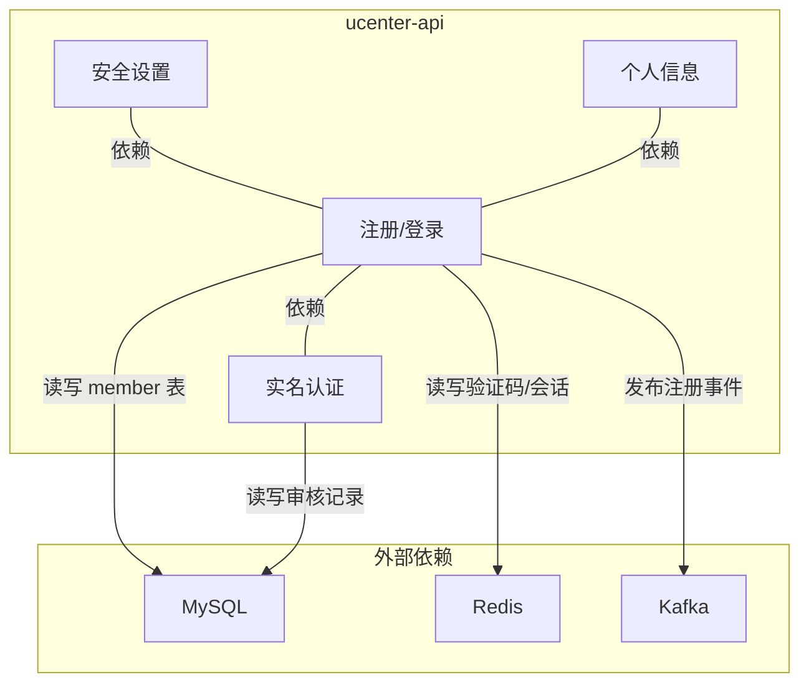
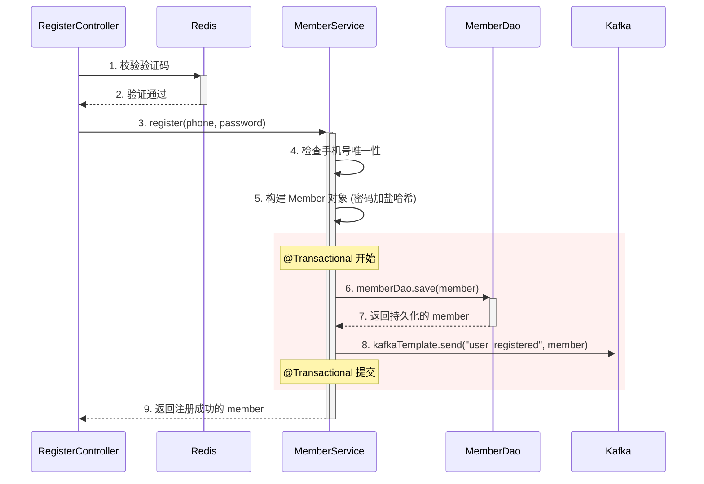

# 第十章：用户中心 `ucenter-api`：构建交易员的数字身份

## 开篇：一切业务的“准入凭证”

在剖析了系统的基础设施之后，我们正式开始深入业务模块，解构第一个核心业务微服务——**用户中心 (`ucenter-api`)**。如果说交易所是一个庞大的数字金融帝国，那么 `ucenter-api` 就是这个帝国的“**护照签发与身份认证中心**”。

任何一笔交易、一次充提，都始于一个明确的身份。`ucenter-api` 的核心职责，就是为每一位交易员创建、管理并验证其独一无二的数字身份。它负责处理用户生命周期中最关键的环节：**注册、登录、安全策略（如谷歌验证器）、以及合规性审查（KYC）**。这个服务的健壮性与安全性，是整个平台信任体系的基石。

本章，我们将以“请求的旅程”为主线，追踪一次完整的用户注册流程，亲眼见证前端请求是如何穿过 Controller、Service、DAO 三层架构，并与我们熟知的 Redis、MySQL、Kafka 等基础设施协同工作的。

---

### 一、 模块职责与架构定位

`ucenter-api` 是一个标准的 Spring Boot 应用，它为所有客户端（Web/App）提供用户身份相关的 RESTful API，是整个微服务集群中**用户身份信息的唯一权威源（Single Source of Truth）**。


该架构图明确了 `ucenter-api` 的核心地位，它承接来自网关的请求，并与我们已学习过的所有核心基础设施进行交互，以完成其业务使命。

---

### 二、 核心流程（一）：用户注册源码剖析

让我们以最关键的“手机号注册”为例，完整追踪一次请求的后端之旅。

#### 2.1 注册流程时序图


#### 2.2 代码实现三层解析

*   **Controller 层 (`RegisterController.java`)**: 作为请求入口，负责参数校验和流程编排。
    ```java
    // ucenter-api/src/main/java/com/bizzan/bitrade/controller/RegisterController.java
    @RestController
    @RequestMapping("/register")
    public class RegisterController {
        @Autowired private MemberService memberService;
        @Autowired private RedisUtil redisUtil; // 对应第七章内容
    
        @PostMapping("/phone")
        public MessageResult registerByPhone(...) {
            // 1. 从 Redis 读取并校验验证码
            String redisCode = (String) redisUtil.get(SysConstant.PHONE_REG_CODE_PREFIX + phone);
            // ... 校验逻辑 ...
    
            // 2. 调用 Service 检查手机号唯一性
            if (memberService.phoneIsExist(phone)) { /* ... */ }
    
            // 3. 构建 Member 实体，对密码进行加盐哈希
            Member member = new Member();
            member.setMobilePhone(phone);
            member.setPassword(Md5.md5Digest(password + member.getSalt()));
            
            // 4. 调用 Service 核心方法完成注册
            Member savedMember = memberService.register(member);
    
            // 5. 清除已使用的验证码
            redisUtil.delete(SysConstant.PHONE_REG_CODE_PREFIX + phone);
            return MessageResult.success("注册成功", savedMember);
        }
    }
    ```

*   **Service 层 (`MemberService.java`)**: 封装核心业务逻辑，并确保操作的原子性。
    ```java
    // ucenter-api/src/main/java/com/bizzan/bitrade/service/MemberService.java
    @Service
    public class MemberService {
        @Autowired private MemberDao memberDao;
        @Autowired private KafkaTemplate<String, String> kafkaTemplate; // 对应第九章内容
    
        @Transactional // 关键：保证数据一致性
        public Member register(Member member) {
            // 1. 持久化用户数据到 MySQL
            Member savedMember = memberDao.save(member);
    
            // 2. 发布“用户注册”事件到 Kafka
            // 目的：通知下游服务（如 wallet）进行后续操作（如创建钱包）
            kafkaTemplate.send("member-register", JSON.toJSONString(savedMember));
    
            return savedMember;
        }
        // ...
    }
    ```
    **`@Transactional`** 注解是此处的生命线。它确保“在数据库中创建用户”和“发送 Kafka 通知消息”这两个步骤要么**全部成功**，要么在任何一步失败时**全部回滚**，从而杜绝了“用户创建了却没有钱包”这类严重的数据不一致问题。

*   **DAO 层 (`MemberDao.java`)**: 利用 Spring Data JPA 简化数据库交互。
    
    ```java
    // core/src/main/java/com/bizzan/bitrade/dao/MemberDao.java
    public interface MemberDao extends JpaRepository<Member, Long> {
        // Spring Data JPA 根据方法名自动生成查询语句:
        // SELECT * FROM member WHERE mobile_phone = ?
        Member findMemberByMobilePhone(String mobilePhone);
    }
    ```

---

### 三、 核心流程（二）：登录与分布式会话

用户登录的核心是**身份验证**与**会话管理**。在微服务架构下，会话管理必须是分布式的，以支持服务的无状态和水平扩展。

```java
// ucenter-api/src/main/java/com/bizzan/bitrade/controller/LoginController.java
@RestController
public class LoginController {
    @Autowired private MemberService memberService;
    
    @PostMapping("/login")
    public MessageResult login(HttpServletRequest request, String username, String password) {
        // 1. 验证用户名和密码
        Member member = memberService.findByUsername(username);
        if (member == null || !Md5.md5Digest(password + member.getSalt()).equals(member.getPassword())) {
            return MessageResult.error("用户名或密码错误");
        }
        
        // 2. 关键：创建分布式会话
        // 由于集成了 Spring Session Redis，这里的 getSession() 被代理
        HttpSession session = request.getSession();
        
        // 3. 将用户信息存入 Session
        session.setAttribute(SysConstant.SESSION_MEMBER, member);
        // Spring Session Redis 自动将 Session 对象序列化，
        // 并以 "spring:session:sessions:<sessionId>" 为 Key 存入 Redis。
        
        return MessageResult.success("登录成功", member);
    }
}
```
**分布式会话解读**：我们无需手动操作 Redis。`Spring Session Redis` 库自动拦截了对 `HttpSession` 的所有操作。当调用 `session.setAttribute()` 时，会话数据被无缝地持久化到 Redis。这样，后续任何一个微服务实例都可以通过 Session ID 从 Redis 中获取用户的登录状态，完美实现了会话共享。

#### 3.1 现代替代方案：JWT (JSON Web Token) 无状态认证

虽然本项目使用了 Session，但在现代微服务架构中，**JWT** 是更主流的认证方案。它能实现真正的**无状态认证**，连共享 Session 的 Redis 都不再需要。

*   **JWT 结构**: 一个 JWT 由 `.` 分隔的三部分组成：`Header.Payload.Signature`。
    *   `Header`: 包含了令牌类型和签名算法。
    *   `Payload`: 包含了用户 ID、角色等业务数据（**切勿存放敏感信息**）。
    *   `Signature`: 对前两部分进行签名的结果，用于防止数据被篡改。

*   **JWT 认证流程**:
    ```mermaid
    sequenceDiagram
        participant Client as 客户端
        participant AuthSvc as 认证服务 (ucenter-api)
        participant ApiSvc as 业务服务 (exchange-api)
    
        Client->>+AuthSvc: 1. 使用用户名/密码登录
        AuthSvc->>AuthSvc: 2. 验证通过, 生成 JWT
        Note right of AuthSvc: Signature = HMAC(Header+Payload, SecretKey)
        AuthSvc-->>-Client: 3. 返回 JWT
    
        Client->>ApiSvc: 4. 在请求头携带 JWT (Authorization: Bearer <jwt>)
        activate ApiSvc
        ApiSvc->>ApiSvc: 5. 使用相同的 SecretKey 验证签名
        alt 签名有效
            ApiSvc->>ApiSvc: 6. 从 Payload 中解析出用户 ID
            ApiSvc-->>Client: 7. 授权访问, 返回业务数据
        else 签名无效
            ApiSvc-->>Client: 7. 拒绝访问 (401 Unauthorized)
        end
        deactivate ApiSvc
    ```
    由于用户信息被编码在 Token 中，业务服务（如 `exchange-api`）无需查询数据库或 Redis 就能验证用户身份，极大地提升了性能和可扩展性。

---

### 四、 核心流程（三）：KYC 认证状态流转

KYC (了解你的客户) 是合规交易所的强制要求，其业务本质是一个状态机流转的过程。

*   **KYC 状态机**:
    ```mermaid
    stateDiagram-v2
        [*] --> 未认证
        未认证 --> 审核中: 用户提交资料
        审核中 --> 审核通过: 后台管理员审核通过
        审核中 --> 审核失败: 后台管理员审核驳回
        审核失败 --> 审核中: 用户重新提交资料
        审核通过 --> [*]
    ```

*   **代码实现 (`ApproveController.java`)**:
    ```java
    @PostMapping("/real/name")
    @Transactional
    public MessageResult realApprove(@SessionAttribute(SESSION_MEMBER) AuthMember user, ... /* KYC资料 */) {
        // 1. 获取当前登录用户
        Member member = memberService.findOne(user.getId());
        
        // 2. 业务校验：防止重复提交
        isTrue(member.getRealNameStatus() == RealNameStatus.NOT_CERTIFIED, "您已提交认证，请勿重复申请");
        
        // 3. 创建一条 MemberApplication 审核记录，状态为“审核中”
        MemberApplication application = new MemberApplication();
        application.setAuditStatus(AuditStatus.AUDIT_ING);
        // ... 设置用户提交的各项资料 ...
        memberApplicationService.save(application);
        
        // 4. 更新用户主表的状态为“审核中”
        member.setRealNameStatus(RealNameStatus.AUDITING);
        
        return MessageResult.success("实名认证申请成功，请等待审核");
    }
    ```
    用户提交 KYC 资料的接口，主要职责是创建审核工单，并将用户状态更新为“审核中”。真正的审核操作由后台管理系统 (`admin` 模块) 的运营人员完成。

---

### 五、 安全专题：密码体系的演进

金融系统的安全，密码是第一道防线。

*   **登录密码 vs 交易密码**：本项目设计了两套密码体系，将**身份认证**（登录）和**资产授权**（交易/提现）的权限分离，即使登录密码泄露，用户的资产依然受到交易密码的保护，这是一种关键的纵深防御策略。

*   **密码加密的演进**：本项目采用了 `MD5(password + salt)` 的加密方式。**加盐 (Salt)** 能有效抵御彩虹表攻击。但在算力飞速发展的今天，MD5 这类快速哈希算法已不再安全。

    **现代应用的最佳实践是使用“慢哈希”算法**，如 **BCrypt**。
    ```java
    // 推荐的加密方式 (使用 Spring Security)
    import org.springframework.security.crypto.bcrypt.BCryptPasswordEncoder;
    
    BCryptPasswordEncoder encoder = new BCryptPasswordEncoder(); // strength 默认为 10
    
    // 加密
    String rawPassword = "user-password-123";
    String encodedPassword = encoder.encode(rawPassword);
    // encodedPassword 类似于 "$2a$10$N9qo8uLOickgx2ZMRZoMyeIjZAgcfl7p92ldGxad68LJZdL17lhWy"
    
    // 校验
    boolean isMatch = encoder.matches(rawPassword, encodedPassword); // true
    ```
    BCrypt 通过内置的“计算成本”参数，人为地延长了哈希计算时间，使得即使在拥有强大算力的情况下，暴力破解也变得不切实际。

---

### 总结与展望

通过对 `ucenter-api` 的解剖，我们首次将前端请求、后端三层架构与底层基础设施（MySQL, Redis, Kafka）完整地串联起来，在真实业务场景中巩固了之前的理论知识。

我们不仅掌握了用户注册、登录、KYC 等核心功能的实现细节，更理解了分布式会话、事件驱动、密码安全等关键设计思想在代码层面的落地。

当用户的“数字身份”被成功创建后，下一步自然是为其分配一个存放资产的“数字金库”。下一章，我们将深入**钱包服务 (`wallet`)**，探索平台是如何管理用户的链下资产，以及它是如何通过监听 `member-register` Kafka 事件，为新用户自动创建钱包的。