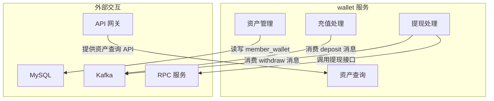
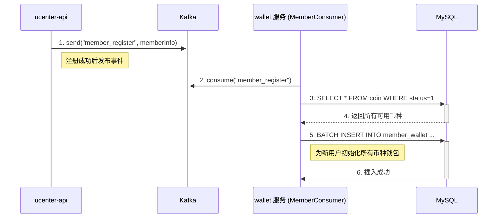
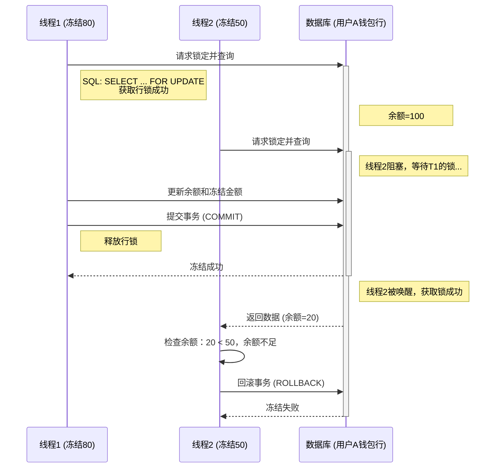
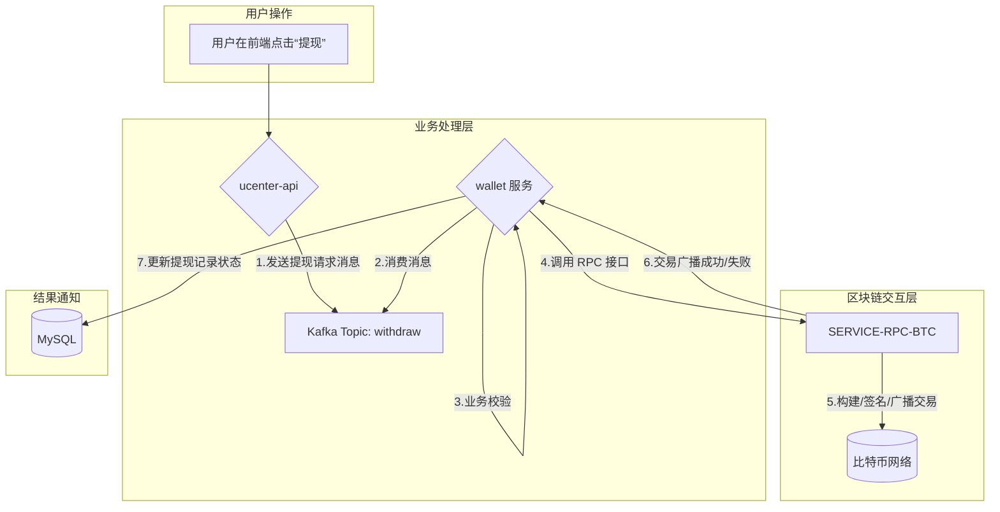

# 第十一章：深入“中央银行”：钱包服务（`wallet`）源码剖析

## 引言：守护交易所的资金命脉

在之前的章节中，我们已经探索了用户中心（`ucenter-api`），解决了“用户是谁”的问题。现在，我们将深入一个更为敏感、对安全性和一致性要求达到极致的领域——**钱包服务（`wallet`）**。

如果说`ucenter-api`是交易所的“户籍系统”，那么`wallet`服务便是整个平台的“**中央银行**”。它不直接触碰区块链上的加密资产，而是负责维护一个**高性能、高一致性的中心化链下账本**。用户的每一次充值、提现、下单、成交、手续费扣除，最终都会被精确地记录为这个账本中数字的增减。

`wallet`服务的**数据一致性**与**并发安全**，是决定平台生死存亡的基石。任何一笔账目错误，都可能直接导致用户资产的损失或平台的亏空。在行情剧烈波动、交易洪流涌入的时刻，如何确保成千上万的线程同时修改用户余额时，账本依然准确无误？这正是本章将要攻克的“技术高地”。

准备好了吗？让我们深入`wallet`服务的源码，揭开它如何通过**事件驱动**的设计与**数据库锁**机制，安全、高效地实现资金的初始化、冻结、结算与流水记录。

---

## 架构定位：一个被动服务与主动消费者的双重角色

`wallet`服务的职责极其聚焦：**为平台所有业务提供统一、安全的链下资产账本管理能力**。在微服务架构中，它扮演着一个独特的双重角色。



一方面，它是一个**被动的 RPC 服务提供者**。当用户在`exchange-api`下单时，交易网关会同步调用`wallet`服务的接口来冻结相应的资产。这个过程要求`wallet`服务能够提供低延迟、高可靠的响应。

另一方面，它又是一个**主动的事件消费者**。它静静地监听着 Kafka 消息总线，消费着来自系统各处的事件，例如`ucenter-api`发出的“新用户注册”事件，或是撮合引擎`exchange`发出的“交易成交”事件，并基于这些事件异步地更新账本。这种事件驱动的模式，极大地增强了系统的弹性和可扩展性。

---

## 事件驱动的诞生：一个新用户钱包的“奇幻漂流”

新用户在`ucenter-api`注册，但他的钱包却需要在`wallet`服务中创建。如何优雅地跨越微服务之间的鸿沟，实现这一功能？项目为我们展示了一个经典的事件驱动协作范例。

这个过程，就像一个承载着新用户信息的“漂流瓶”，开启了一段奇幻旅程。



旅程的起点是`ucenter-api`。当注册成功后，它并不直接调用`wallet`服务，而是精心准备了一个包含新用户 ID 的“漂流瓶”（一条 JSON 消息），并将它放入名为`member-register`的 Kafka“河流”中。

在河流的下游，`wallet`服务的`MemberConsumer`作为忠实的“捞瓶人”，时刻等待着新消息的到来。

**源码路径: `wallet/src/main/java/com/bizzan/bitrade/consumer/MemberConsumer.java`**

```java
@Component
public class MemberConsumer {
    @Autowired
    private MemberWalletService memberWalletService;
    @Autowired
    private CoinService coinService;

    @KafkaListener(topics = {"member-register"})
    public void handle(String content) {
        // ... 省略日志和判空 ...
        JSONObject json = JSON.parseObject(content);

        // 1. 获取所有支持的币种
        List<Coin> coins =  coinService.findAll();

        // 2. 遍历币种，为用户创建钱包
        for(Coin coin:coins) {
            MemberWallet wallet = new MemberWallet();
            wallet.setCoin(coin);
            wallet.setMemberId(json.getLong("uid"));
            wallet.setBalance(new BigDecimal(0));
            wallet.setFrozenBalance(new BigDecimal(0));
            wallet.setAddress("");
            // 3. 保存到数据库
            memberWalletService.save(wallet);
        }
        // ... 省略注册活动奖励逻辑 ...
    }
}
```

`@KafkaListener`注解声明了`handle`方法订阅了`member-register`主题。一旦消息抵达，`MemberConsumer`便会解析出用户 ID，查询出系统中所有已启用的币种，然后像一位尽职的管家，为这位新用户在`member_wallet`表中，逐一创建好每一种数字货币的钱包账户，初始余额均为零。

至此，“漂流瓶”的使命圆满完成。整个过程完全异步，`ucenter-api`无需等待钱包创建成功，实现了服务间的完美解耦。

---

## 并发控制的十字路口：乐观锁与悲观锁的终极抉择

欢迎来到`wallet`服务的心脏地带，也是并发问题的“修罗场”。当成百上千的用户同时下单、撤单，他们的请求会转化为并发的数据库操作，试图修改同一个钱包的余额。如果没有妥善的保护，账本将瞬间错乱。

想象一下这个经典的“余额扣减”场景：

- 用户 A 的 USDT 余额为 100。
- **线程 1**（处理订单 A）读取到余额为 100，准备冻结 80。
- 与此同时，**线程 2**（处理订单 B）也读取到余额为 100，准备冻结 50。
- **线程 1**执行计算 `balance = 100 - 80`，并将结果写入数据库。此时余额 20。
- **线程 2**执行计算 `balance = 100 - 50`，并将结果写入数据库。此时余额 50。

最终，线程 2 的操作**覆盖**了线程 1 的操作，导致用户余额凭空从 20 变为 50，平台损失了 30 USDT。这就是臭名昭著的“**丢失更新**”（Lost Update）问题。

为了解决这个问题，数据库为我们提供了两种强大的武器：**悲观锁**与**乐观锁**。

| 锁机制     | 核心思想                                                                                                                                                                               | 实现方式                                                                                          | 优缺点                                                                                       |
| :--------- | :------------------------------------------------------------------------------------------------------------------------------------------------------------------------------------- | :------------------------------------------------------------------------------------------------ | :------------------------------------------------------------------------------------------- |
| **悲观锁** | “世界充满危险，必须先锁上门再办事”。它假定并发冲突总是会发生，所以在数据被读取用于修改时，就直接将其锁定，阻止其他任何事务进行修改，直到当前事务完成。                                 | SQL 层面使用 `SELECT ... FOR UPDATE`。JPA 中通过`@Lock(LockModeType.PESSIMISTIC_WRITE)`注解实现。 | **优点**：数据一致性极高，实现简单。**缺点**：性能开销大，会阻塞其他事务，降低并发度。       |
| **乐观锁** | “世界是美好的，冲突只是偶然”。它假定并发冲突很少发生，因此在读取数据时不加锁。而是在更新数据时，检查一下在此期间数据是否被其他人修改过。如果被修改过，就放弃本次更新，通常会进行重试。 | 在表中增加一个`version`（版本号）字段。更新时执行 `UPDATE ... WHERE id=? AND version=?`。         | **优点**：并发性能好，因为不阻塞。**缺点**：实现稍复杂，需要应用层处理更新失败后的重试逻辑。 |

#### 源码探秘：项目选择了哪条路？

通过分析`core`模块的源码，我们发现了项目真正的选择。

**源码路径: `core/src/main/java/com/bizzan/bitrade/entity/MemberWallet.java`**

```java
@Entity
@Data
public class MemberWallet {
    // ... 其他字段 ...

    @JsonIgnore
    @Version
    private int version; // 关键点：版本号字段

    // ... 其他字段 ...
}
```

`MemberWallet`实体中赫然出现了`@Version`注解，这是 JPA 实现**乐观锁**的明确信号！

再看 DAO 层的实现：

**源码路径: `core/src/main/java/com/bizzan/bitrade/dao/MemberWalletDao.java`**

```java
public interface MemberWalletDao extends BaseDao<MemberWallet> {
    @Modifying
    @Query("update MemberWallet wallet set wallet.balance = wallet.balance - :amount, wallet.frozenBalance=wallet.frozenBalance + :amount where wallet.id = :walletId and wallet.balance >= :amount")
    int freezeBalance(@Param("walletId") long walletId, @Param("amount") BigDecimal amount);
}
```

`freezeBalance`方法是一条原子的`UPDATE`语句，并且通过`WHERE ... and wallet.balance >= :amount`在数据库层面杜绝了余额被扣成负数的可能。这是一个非常好的实践，它为资金安全提供了最后一道坚固的防线。

#### 当前实现的“美中不足”

然而，仔细审视`MemberWalletService`的代码，我们会发现一个隐藏的问题。

```java
// MemberWalletService.java (简化后)
@Transactional
public MessageResult freezeBalance(MemberWallet memberWallet, BigDecimal amount) {
    // 这是一个“读-改-写”模式，但没有处理乐观锁冲突
    int ret = memberWalletDao.freezeBalance(memberWallet.getId(), amount);
    if (ret > 0) {
        return MessageResult.success();
    } else {
        // 仅仅返回错误，没有重试
        return MessageResult.error("Information Expired");
    }
}
```

虽然底层有乐观锁机制，但服务层在调用`freezeBalance`后，如果因为版本冲突导致更新失败（`ret`为 0），代码只是简单地返回了一个错误。在高并发场景下，这意味着部分用户的操作会失败，体验不佳。

#### 架构的抉择：两种工业级优化方案

对于金融核心业务，操作的成功率至关重要。我们可以通过以下两种方式来加固这块逻辑。

**方案 A：完善乐观锁——引入重试机制**

我们可以包装一个重试逻辑，当捕获到乐观锁异常时，重新获取最新数据并再次尝试。

```java
// 伪代码
public void freezeBalanceWithRetry(Long memberId, String coinUnit, BigDecimal amount) {
    int maxRetries = 3;
    for (int i = 0; i < maxRetries; i++) {
        try {
            MemberWallet wallet = findByCoinUnitAndMemberId(coinUnit, memberId);
            if (wallet.getBalance().compareTo(amount) < 0) {
                throw new InsufficientBalanceException("余额不足");
            }
            // 假设JPA更新时会因version不匹配抛出OptimisticLockingFailureException
            memberWalletDao.save(wallet); // 模拟更新操作
            return; // 成功则退出
        } catch (ObjectOptimisticLockingFailureException e) {
            // 捕获到乐观锁冲突，循环会继续进行重试
            log.warn("乐观锁冲突，正在重试... (第 {} 次)", i + 1);
        }
    }
    throw new RuntimeException("资金操作失败，请稍后再试");
}
```

**方案 B：转向悲观锁——追求极致的一致性（推荐）**

对于钱包这类“写多读少”、竞争激烈的场景，悲观锁往往是更简单、更可靠的选择。它以牺牲部分并发性能为代价，换取了逻辑的清晰和数据绝对的一致性。

我们可以这样改造`MemberWalletService`：

```java
// 源码路径: core/src/main/java/com/bizzan/bitrade/service/MemberWalletService.java (建议修改)
import javax.persistence.LockModeType;
import org.springframework.data.jpa.repository.Lock;

// ...

// 在DAO接口的方法上添加注解
public interface MemberWalletDao extends BaseDao<MemberWallet> {
    @Lock(LockModeType.PESSIMISTIC_WRITE)
    MemberWallet findByCoinAndMemberId(Coin coin, Long memberId);
    // ...
}

// 或者在Service方法上添加注解
@Service
public class MemberWalletService extends BaseService {
    @Transactional
    @Lock(LockModeType.PESSIMISTIC_WRITE) // 在事务开始时锁定查询出的行
    public MessageResult freezeBalanceWithPessimisticLock(Long memberId, String coinUnit, BigDecimal amount) {
        MemberWallet wallet = findByCoinUnitAndMemberId(coinUnit, memberId);
        if (wallet.getBalance().compareTo(amount) < 0) {
            return MessageResult.error("可用余额不足");
        }
        int result = memberWalletDao.freezeBalance(wallet.getId(), amount);
        if (result <= 0) {
            throw new UnexpectedException("资金冻结失败");
        }
        // ... 记录资产流水 ...
        return MessageResult.success("冻结成功");
    }
}
```

`@Lock(LockModeType.PESSIMISTIC_WRITE)`注解会告诉 JPA，在执行`findByCoinUnitAndMemberId`查询时，生成一条`SELECT ... FOR UPDATE`的 SQL 语句。这会**锁定**数据库中对应的钱包记录行，任何其他试图修改该行的事务都必须排队等待，直到当前事务提交并释放锁。



通过这种方式，我们彻底杜绝了并发问题，保证了资金操作的**串行化**执行。对于一个金融系统而言，这种可预期的、安全的行为，是比极致的并发性能更重要的核心诉求。

---

---

## 钱包与区块链的边界：`wallet` 与 `RPC` 服务的协作

一个常见的误区是认为 `wallet` 服务会直接与区块链进行交互。根据 `doc/QA.md` 的分析，这是**错误**的。`wallet` 服务只负责**内部账本**，所有与真实区块链交互的“脏活累活”，都委托给了一个专门的微服务集群——`02_bizzan_wallet_rpc`。



这种**分层解耦**的架构是工业级交易所设计的核心思想：

- **职责单一**：`wallet` 服务专注于核心的账本业务，逻辑清晰。
- **安全隔离**：管理私钥、与节点交互等高风险操作被隔离在专门的 `RPC` 服务中，即使 `wallet` 服务被攻击，也不会直接威胁到链上资产。
- **易于扩展**：未来需要支持一条新的公链时，只需开发一个新的 `RPC` 服务，而 `wallet` 层的核心代码无需改动。

---

## 不可变的总账本：`member_transaction`的设计哲学

`wallet`服务的每一次资金变动，无论是冻结、解冻还是余额增减，都**必须**在`member_transaction`表中留下一笔永恒的印记。这张表，就是整个平台的**链下总账本**，是系统资金可审计性的基石。

**源码路径: `core/src/main/java/com/bizzan/bitrade/entity/MemberTransaction.java`**

```java
@Entity
@Data
public class MemberTransaction {
    @Id
    @GeneratedValue(strategy = GenerationType.IDENTITY)
    private Long id;
    private Long memberId;

    @Column(columnDefinition = "decimal(26,16) comment '充币金额'")
    private BigDecimal amount;

    @CreationTimestamp
    private Date createTime;

    @Enumerated(EnumType.ORDINAL)
    private TransactionType type;

    private String symbol;
    private String address;

    @Column(precision = 26,scale = 16)
    private BigDecimal fee = BigDecimal.ZERO;
}
```

它的设计遵循了会计学中的基本原则：

- **不可变性**：流水记录一旦生成，就绝不允许被修改或删除。任何错误的账目，都必须通过一笔新的“冲正”流水（方向相反，金额相同）来修正，确保每一笔操作都有迹可循。
- **高可追溯性**：每条流水都包含了用户 ID、币种、金额、变动类型（充值、提现、交易手续费等）、关联业务信息（如地址）等，提供了完整的溯源路径。
- **可核对性**：在任何时刻，`member_wallet`表中的用户余额，都应该精确地等于该用户该币种所有`member_transaction`流水的代数和。定期的对账程序，是保障系统资金安全的最后一道屏障。


---

## 总结与展望

在本章中，我们对交易所的“中央银行”——`wallet`服务进行了一次深入的源码解剖。我们不仅学习了它的设计，更对其实现进行了批判性的思考与改进：

1.  **事件驱动架构**：我们理解了`wallet`服务如何通过监听 Kafka 消息，与上游服务（如`ucenter-api`）实现优雅的异步解耦。
2.  **并发控制思辨**：我们通过`@Version`注解，揭示了项目采用**乐观锁**的真相，并深入分析了其当前实现的不足。更重要的是，我们探讨了**悲观锁**在金融场景下的适用性和优越性，并给出了具体的代码改造建议。
3.  **功能闭环**：我们指出了当前项目在**交易结算功能上的缺失**，并通过模拟实现，展示了如何构建一个安全、可靠的资金闭环。
4.  **不可变账本**：我们阐述了`member_transaction`作为**链下总账本**的设计哲学，强调了其在平台资金安全与可审计性中的基石作用。

至此，我们已深刻理解平台内部的账本是如何安全运作的。有了这个坚实的基础，我们终于可以去探索整个交易所最激动人心的部分——**交易撮合**。

在下一章，我们将首先剖析**交易网关（`exchange-api`）**。它作为用户下单的入口，是如何进行参数校验，并与我们本章学习的`wallet`服务进行 RPC 交互，来安全地冻结用户资金的？让我们拭目以待。
