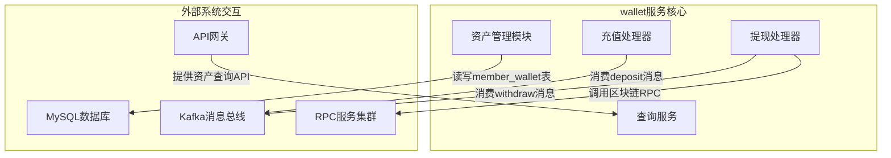
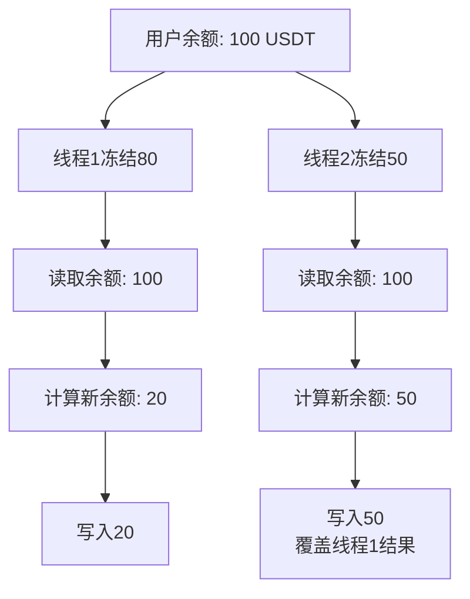
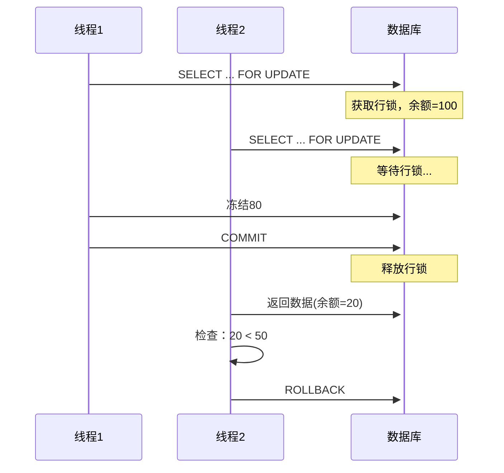
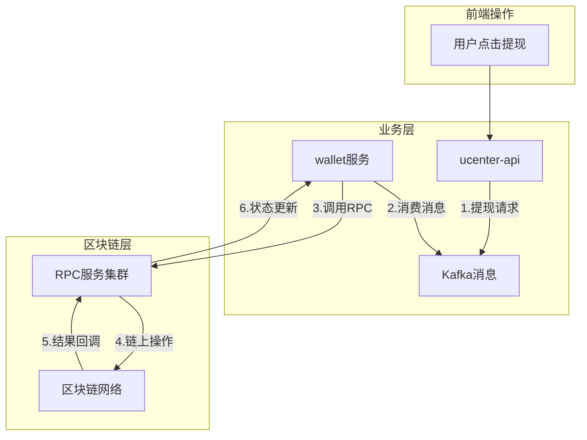

# 钱包服务架构：交易所资金管理的核心引擎

## 引言：金融级账本系统设计

钱包服务是交易所的**中央银行**，负责管理所有用户的链下资产账本。它不直接与区块链交互，而是专注于维护一个高性能、高一致性的中心化账本系统。每一笔充值、提现、交易、手续费都会被精确记录为账本中的数字变化。

在成千上万的并发请求中，如何保证资金操作的绝对安全？这是钱包服务面临的核心挑战。本文将深入分析其事件驱动架构、并发控制机制和资金安全策略。

## 核心架构设计

### 双重角色定位

钱包服务在微服务架构中扮演着独特的双重角色：被动RPC服务提供者和主动事件消费者。


```mermaid
graph TD
    subgraph "wallet服务核心"
        A[资产管理模块]
        B[充值处理器]
        C[提现处理器]
        D[查询服务]
    end

    subgraph "外部系统交互"
        E[Kafka消息总线]
        F[MySQL数据库]
        G[RPC服务集群]
        H[API网关]
    end

    A -- "读写member_wallet表" --> F
    B -- "消费deposit消息" --> E
    C -- "消费withdraw消息" --> E
    C -- "调用区块链RPC" --> G
    H -- "提供资产查询API" --> D
```

这种设计使得wallet服务既能同步响应交易网关的资金冻结请求，又能异步处理各种系统事件，实现了性能与可靠性的平衡。

## 事件驱动的钱包初始化

### 新用户钱包创建流程

新用户注册时，wallet服务通过Kafka消息实现异步初始化：

```mermaid
sequenceDiagram
    participant UC as ucenter-api
    participant K as Kafka
    participant W as wallet服务
    participant DB as MySQL

    UC->>+K: 1. 发布用户注册事件
    W->>+K: 2. 消费注册消息
    W->>+DB: 3. 查询所有支持的币种
    DB-->>-W: 4. 返回币种列表
    W->>+DB: 5. 批量创建用户钱包
    DB-->>-W: 6. 创建成功
    W-->>-K: 7. 处理完成
```

### 核心实现代码

```java
@Component
public class MemberConsumer {

    @Autowired
    private MemberWalletService memberWalletService;

    @Autowired
    private CoinService coinService;

    @KafkaListener(topics = {"member-register"})
    public void handleUserRegistration(String content) {
        try {
            JSONObject json = JSON.parseObject(content);
            Long userId = json.getLong("uid");

            // 获取所有启用的币种
            List<Coin> coins = coinService.findAll();

            // 为用户创建每种币的钱包
            for (Coin coin : coins) {
                MemberWallet wallet = new MemberWallet();
                wallet.setCoin(coin);
                wallet.setMemberId(userId);
                wallet.setBalance(BigDecimal.ZERO);
                wallet.setFrozenBalance(BigDecimal.ZERO);
                wallet.setAddress("");

                memberWalletService.save(wallet);
            }

            log.info("用户{}的钱包初始化完成", userId);

        } catch (Exception e) {
            log.error("钱包初始化失败", e);
        }
    }
}
```

这种完全异步的设计避免了服务间的耦合，提高了系统的可靠性和扩展性。

## 并发安全：资金操作的锁机制设计

### 并发场景分析

在高并发交易环境下，多个线程可能同时操作同一用户钱包：


```mermaid
graph TD
    A[用户余额: 100 USDT] --> B[线程1冻结80]
    A --> C[线程2冻结50]

    B --> D[读取余额: 100]
    C --> E[读取余额: 100]

    D --> F[计算新余额: 20]
    E --> G[计算新余额: 50]

    F --> H[写入20]
    G --> I[写入50<br/>覆盖线程1结果]
```

这种"丢失更新"问题会导致资金错误。

### 锁机制对比

| 锁类型 | 核心思想 | 实现方式 | 适用场景 |
|--------|----------|----------|----------|
| **乐观锁** | 冲突少时性能高 | 版本号字段 + 原子更新 | 读多写少 |
| **悲观锁** | 一致性优先 | SELECT FOR UPDATE | 写多读少 |

### 项目实现分析

项目采用乐观锁，在MemberWallet实体中：

```java
@Entity
public class MemberWallet {
    @Version
    private int version; // 乐观锁版本号
}
```

原子性余额操作：

```java
@Query("UPDATE MemberWallet SET balance = balance - :amount, " +
       "frozenBalance = frozenBalance + :amount " +
       "WHERE id = :walletId AND balance >= :amount")
int freezeBalance(@Param("walletId") Long walletId,
                  @Param("amount") BigDecimal amount);
```

### 悲观锁优化方案

对于资金安全，建议采用悲观锁：

```java
@Transactional
@Lock(LockModeType.PESSIMISTIC_WRITE)
public MessageResult freezeBalance(Long memberId, String coinUnit, BigDecimal amount) {
    // 获取行锁
    MemberWallet wallet = findByMemberIdAndCoinUnit(memberId, coinUnit);

    if (wallet.getBalance().compareTo(amount) < 0) {
        return MessageResult.error("余额不足");
    }

    // 原子操作
    int result = memberWalletDao.freezeBalance(wallet.getId(), amount);
    if (result <= 0) {
        throw new RuntimeException("冻结失败");
    }

    return MessageResult.success();
}
```

悲观锁执行流程：


```mermaid
sequenceDiagram
    participant T1 as 线程1
    participant T2 as 线程2
    participant DB as 数据库

    T1->>+DB: SELECT ... FOR UPDATE
    Note over DB: 获取行锁，余额=100
    T2->>+DB: SELECT ... FOR UPDATE
    Note over DB: 等待行锁...

    T1->>DB: 冻结80
    T1->>DB: COMMIT
    Note over DB: 释放行锁

    T2->>DB: 返回数据(余额=20)
    T2->>T2: 检查：20 < 50
    T2->>DB: ROLLBACK
```

## 资金流水：不可变的审计账本

### 交易记录设计

每笔资金变动都必须在member_transaction表中留下记录：

```java
@Entity
public class MemberTransaction {
    @Id
    private Long id;

    private Long memberId;
    private BigDecimal amount;
    private String symbol;

    @Enumerated(EnumType.ORDINAL)
    private TransactionType type;

    @CreationTimestamp
    private Date createTime;

    private BigDecimal fee = BigDecimal.ZERO;
}
```

### 流水记录原则

1. **不可变性**：记录一旦生成就不能修改
2. **完整性**：包含用户ID、金额、类型、时间等完整信息
3. **可追溯**：支持资金变动的完整审计

### 账本平衡公式

任何时候都必须满足：
```
用户余额 = 所有相关流水的代数和
```

定期对账是保障资金安全的最后一道防线。

## 微服务边界：与区块链RPC的协作

### 服务职责划分

wallet服务只负责内部账本管理，不直接与区块链交互：


```mermaid
graph TD
    subgraph "前端操作"
        A[用户点击提现]
    end

    subgraph "业务层"
        B[ucenter-api]
        C[Kafka消息]
        D[wallet服务]
    end

    subgraph "区块链层"
        E[RPC服务集群]
        F[区块链网络]
    end

    A --> B
    B -- "1.提现请求" --> C
    D -- "2.消费消息" --> C
    D -- "3.调用RPC" --> E
    E -- "4.链上操作" --> F
    F -- "5.结果回调" --> E
    E -- "6.状态更新" --> D
```

### 架构优势

这种分层设计具有以下优势：

1. **职责单一**：wallet专注账本管理
2. **安全隔离**：私钥管理独立隔离
3. **易于扩展**：支持新公链只需增加RPC服务

## 性能优化策略

### 批量操作优化

```java
public void batchInitializeWallets(List<Long> userIds) {
    // 批量查询币种
    List<Coin> coins = coinService.findAll();

    // 批量插入钱包记录
    List<MemberWallet> wallets = new ArrayList<>();
    for (Long userId : userIds) {
        for (Coin coin : coins) {
            MemberWallet wallet = new MemberWallet();
            wallet.setMemberId(userId);
            wallet.setCoin(coin);
            wallet.setBalance(BigDecimal.ZERO);
            wallet.setFrozenBalance(BigDecimal.ZERO);
            wallets.add(wallet);
        }
    }

    // 批量保存，减少数据库交互
    memberWalletService.saveAll(wallets);
}
```

### 连接池配置

```yaml
spring:
  datasource:
    hikari:
      maximum-pool-size: 50
      minimum-idle: 10
      connection-timeout: 30000
      idle-timeout: 600000
      max-lifetime: 1800000
```

## 监控与告警

### 关键指标

| 指标类型 | 监控项 | 告警阈值 |
|---------|--------|----------|
| **性能** | 冻结操作延迟 | >100ms |
| **安全** | 乐观锁冲突率 | >1% |
| **数据** | 账本平衡检查 | 发现差异 |
| **业务** | 提现失败率 | >0.1% |

### 实时监控

```java
@Component
public class WalletMonitor {

    @Scheduled(fixedRate = 60000) // 每分钟检查
    public void checkAccountBalance() {
        // 检查账本平衡
        List<String> issues = accountService.validateAccounts();

        if (!issues.isEmpty()) {
            alertService.sendAlert("账本异常", issues);
        }
    }

    @EventListener
    public void handleLockConflict(OptimisticLockingFailureException e) {
        // 记录锁冲突
        metrics.increment("wallet.lock.conflict");

        if (metrics.get("wallet.lock.conflict").get() > 10) {
            alertService.sendAlert("锁冲突过多", e.getMessage());
        }
    }
}
```

## 总结

钱包服务作为交易所的**资金核心**，通过以下关键设计保障了系统的安全与稳定：

1. **事件驱动架构**：实现服务解耦，提高系统弹性
2. **并发控制机制**：采用乐观锁保证资金操作安全
3. **原子性操作**：通过SQL约束确保数据一致性
4. **审计流水**：完整的交易记录支持资金追踪
5. **分层设计**：清晰的边界便于维护和扩展

对于金融系统而言，**资金安全永远优先于性能**。通过合理的锁机制、原子操作和完整的审计日志，钱包服务为交易所构建了可靠的资金基础设施。
