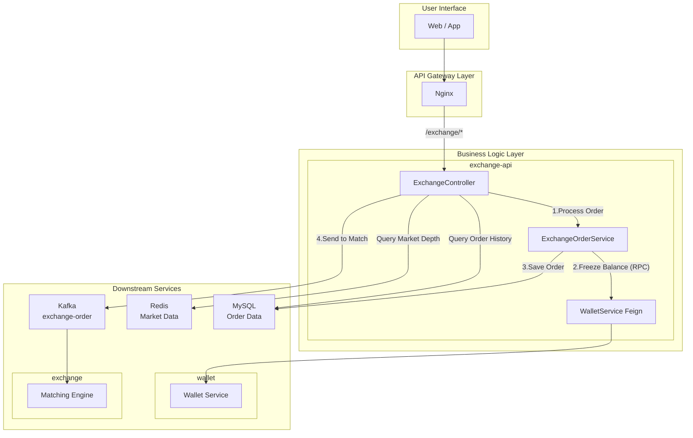
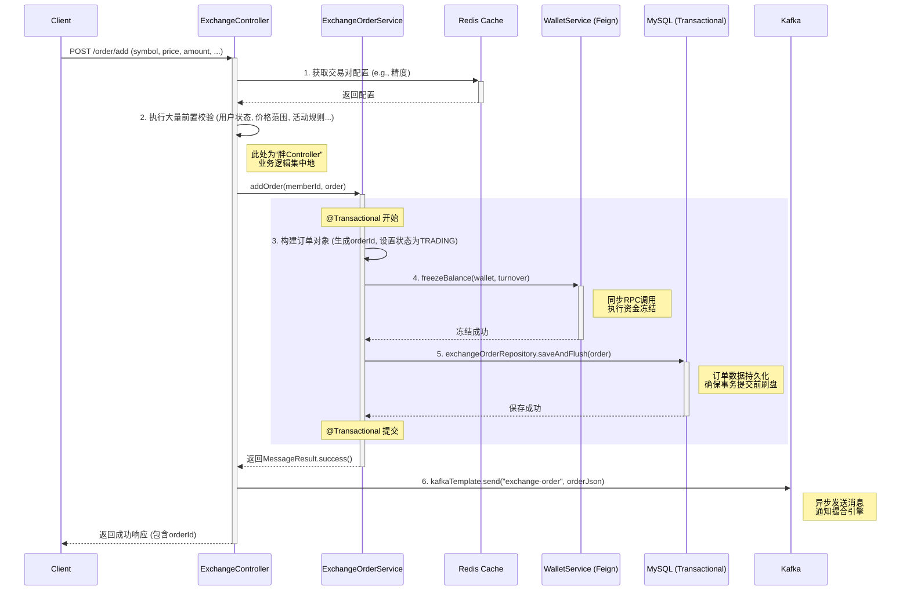

# 第十二章：交易指令第一站：网关(`exchange-api`)源码剖析

## 引言：一次下单请求的奇妙旅程

在过去的章节中，我们已经为交易所构建了坚实的用户（`ucenter-api`）和资产（`wallet`）系统。现在，我们终于站在了整个系统的心脏入口——**币币交易**。当用户在屏幕前，怀着期待或紧张的心情，点击“买入”或“卖出”按钮时，这个小小的动作是如何在庞大的后端系统中掀起波澜的？

**`exchange-api` 服务，就是这段奇妙旅程的第一站。**

它扮演着**交易流程的首席协调官**的角色。它不关心买单和卖单如何相遇（那是`exchange`撮合引擎的职责），而是专注于处理所有来自用户的交易指令。它就像一个严格、高效的“交易受理处”，其核心使命可以概括为：

- **承上**：作为前端用户的 API 统一入口，对交易请求进行严格的参数校验和复杂的业务规则审查。
- **启下**：精心编排对下游服务的调用，包括**同步调用`wallet`服务**来冻结资金，以及**异步发送消息给`exchange`撮合引擎**，完成指令的传递。
- **兼顾查询**：同时，它也负责提供**订单历史**和**市场深度**等查询类接口，为前端提供数据支持。

本章，我们将以一次下单请求为例，深入`exchange-api`的源码，完整地追踪一个交易指令的生命周期。这将是一个绝佳的范例，因为它完美地串联起了我们之前学过的 API 接口设计、服务间 RPC 调用、数据库事务处理以及 Kafka 异步消息通信等所有核心知识点。

---

## 架构定位：CQRS 思想的完美体现

`exchange-api`的核心定位是：**币币交易的统一 API 入口和业务流程协调者**。它与核心撮合引擎`exchange`的分离，是高性能交易系统架构设计的精髓所在。



这种架构设计，是**CQRS（Command Query Responsibility Segregation，命令查询职责分离）**思想的经典体现。它将改变系统状态的“**命令**”和不改变状态的“**查询**”在逻辑上（甚至物理上）完全分开：

1.  **命令 (Command) 侧**：

    - **职责**：处理下单 (`/order/add`)、撤单 (`/order/cancel`) 等写操作。
    - **特点**：流程复杂，涉及多服务协作、数据库事务和消息发送。
    - **核心关注点**：**数据一致性**（资金冻结与订单创建必须是原子操作）和**可靠性**（订单指令必须成功送达撮合引擎）。

2.  **查询 (Query) 侧**：
    - **职责**：处理获取个人订单历史 (`/order/history`)、获取市场深度 (`/market/depth`) 等读操作。
    - **特点**：流程简单，通常直接访问数据库或缓存。
    - **核心关注点**：**查询性能**和**响应速度**。例如，市场深度数据会直接从 Redis 高速缓存中读取，绕开所有复杂逻辑。

这种分离带来了巨大的架构优势：

- **高可用性**：通过 Kafka 的异步解耦，即使后端的撮合引擎`exchange`暂时宕机或处理缓慢，`exchange-api`依然可以接收用户的下单请求并将其安全地存入 Kafka 消息队列。这保证了用户的交易指令永远不会丢失，系统的“入口”始终畅通。
- **极致的响应速度**：`exchange-api`在将订单写入 Kafka 后，就可以立即向用户返回“下单成功”的响应，无需同步等待漫长的撮合结果。这极大地降低了 API 接口的响应时间，为用户带来了丝滑的交易体验。
- **独立扩展**：命令侧和查询侧的负载特性不同。我们可以根据需要，独立地对`exchange-api`的实例数量进行扩展，以应对不同的流量压力。

---

## 命令侧深度追踪：/order/add 接口的完整生命周期

`/order/add`是`exchange-api`中最核心、最复杂的“命令”接口。让我们追踪一个下单请求在这里经历的完整旅程。



#### 1. “胖 Controller”的校验之门

旅程的第一站是`OrderController`。通过分析源码，我们发现这是一个典型的“**胖 Controller**”——它承担了极其繁重的校验职责，几乎所有的业务规则判断都集中在这里。

**源码路径: `exchange-api/src/main/java/com/bizzan/bitrade/controller/OrderController.java`**

```java
@RequestMapping("add")
public MessageResult addOrder(@SessionAttribute(SESSION_MEMBER) AuthMember authMember,
                                ExchangeOrderDirection direction, String symbol, BigDecimal price,
                                BigDecimal amount, ExchangeOrderType type) {

    // 阶段一：基础校验
    Member member = memberService.findOne(authMember.getId());
    if(member.getTransactionStatus().equals(BooleanEnum.IS_FALSE)){
        return MessageResult.error(500, msService.getMessage("CANNOT_TRADE"));
    }

    // 阶段二：交易对配置校验 (应优先从Redis获取)
    ExchangeCoin exchangeCoin = exchangeCoinService.findBySymbol(symbol);
    if (exchangeCoin == null || exchangeCoin.getEnable() != 1) {
        return MessageResult.error(500, msService.getMessage("COIN_FORBIDDEN"));
    }

    // 阶段三：价格与数量精度和范围校验 (大量 a.compareTo(b) 判断)
    // ...

    // 阶段四：钱包状态校验
    MemberWallet baseCoinWallet = walletService.findByCoinUnitAndMemberId(baseCoin, member.getId());
    if (baseCoinWallet.getIsLock() == BooleanEnum.IS_TRUE) {
        return MessageResult.error(500, msService.getMessage("WALLET_LOCKED"));
    }

    // 阶段五：特殊业务规则校验 (如抢购、分摊等活动限制)
    // ...

    // 阶段六：构建订单对象
    ExchangeOrder order = new ExchangeOrder();
    // ... 设置属性 ...

    // 阶段七：调用Service完成核心业务
    MessageResult mr = orderService.addOrder(member.getId(), order);
    if (mr.getCode() != 0) {
        return MessageResult.error(500, "提交订单失败:" + mr.getMessage());
    }

    // 阶段八：异步发送消息
    kafkaTemplate.send("exchange-order", JSON.toJSONString(order));

    MessageResult result = MessageResult.success("success");
    result.setData(order.getOrderId());
    return result;
}
```

> **💡 架构师之眼：重构建议**
>
> 虽然这种模式将所有逻辑集中在一起，便于理解单个功能的流程，但它严重违反了“**关注点分离**”的设计原则，导致 Controller 臃肿、难以维护和单元测试。一个更优雅的重构方案是将所有校验逻辑下沉到一个专门的`ValidationService`或使用**策略模式**来处理不同类型的校验，让 Controller 回归其轻薄的本质——**参数绑定、调用服务、视图/JSON 渲染**。

#### 2. `ExchangeOrderService`的核心使命：冻结资金与持久化订单

通过了 Controller 的层层关卡后，请求的核心使命由`ExchangeOrderService.addOrder`方法来完成。

**源码路径: `exchange-core/src/main/java/com/bizzan/bitrade/service/ExchangeOrderService.java`**

```java
@Transactional
public MessageResult addOrder(Long memberId, ExchangeOrder order) {
    // 1. 初始化订单基础信息
    order.setTime(Calendar.getInstance().getTimeInMillis());
    order.setStatus(ExchangeOrderStatus.TRADING);
    order.setTradedAmount(BigDecimal.ZERO);
    order.setOrderId(GeneratorUtil.getOrderId("E"));

    // 2. 根据交易方向，计算并冻结资金
    if (order.getDirection() == ExchangeOrderDirection.BUY) {
        MemberWallet wallet = memberWalletService.findByCoinUnitAndMemberId(order.getBaseSymbol(), memberId);
        if(wallet.getIsLock().equals(BooleanEnum.IS_TRUE)){
            return MessageResult.error("钱包已锁定");
        }

        // 计算需要冻结的金额 (turnover)
        BigDecimal turnover;
        if (order.getType() == ExchangeOrderType.MARKET_PRICE) {
            turnover = order.getAmount(); // 市价买，amount代表成交额
        } else {
            turnover = order.getAmount().multiply(order.getPrice()); // 限价买，成交额 = 数量 * 价格
        }

        // 余额校验
        if (wallet.getBalance().compareTo(turnover) < 0) {
            return MessageResult.error(500, "余额不足: " + order.getBaseSymbol());
        } else {
            // 同步调用wallet服务冻结资金
            MessageResult result = memberWalletService.freezeBalance(wallet, turnover);
            if (result.getCode() != 0) {
                // 向上抛出异常，触发事务回滚
                throw new RuntimeException("冻结 " + order.getBaseSymbol() + " 失败");
            }
        }
    } else if (order.getDirection() == ExchangeOrderDirection.SELL) {
        MemberWallet wallet = memberWalletService.findByCoinUnitAndMemberId(order.getCoinSymbol(), memberId);
        if(wallet.getIsLock().equals(BooleanEnum.IS_TRUE)){
            return MessageResult.error("钱包已锁定");
        }

        // 余额校验
        if (wallet.getBalance().compareTo(order.getAmount()) < 0) {
            return MessageResult.error(500, "余额不足: " + order.getCoinSymbol());
        } else {
            // 同步调用wallet服务冻结资金
            MessageResult result = memberWalletService.freezeBalance(wallet, order.getAmount());
            if (result.getCode() != 0) {
                // 向上抛出异常，触发事务回滚
                throw new RuntimeException("冻结 " + order.getCoinSymbol() + " 失败");
            }
        }
    }

    // 3. 持久化订单到数据库
    order = exchangeOrderRepository.saveAndFlush(order);

    if (order != null) {
        return MessageResult.success("success");
    } else {
        return MessageResult.error(500, "error");
    }
}
```

这个方法完美地诠释了“**同步资金操作**”的核心：

- **`@Transactional`**：整个方法被一个数据库事务包裹。这意味着，如果在执行过程中（特别是资金冻结失败时）抛出异常，所有已完成的数据库操作都会被**回滚**，保证了数据的一致性。
- **精确计算**：代码根据订单是“买”还是“卖”，是“限价”还是“市价”，精确地计算出需要冻结的资金量。
- **同步调用**：通过 Feign 客户端，同步调用`wallet`服务的`freezeBalance`接口。如果冻结失败，则立即中断流程，返回错误。
- **`saveAndFlush()`**：这一步至关重要。它不仅仅是保存，而是**立即将订单数据刷入数据库**，而不是等待事务提交时才写入。这确保了在方法返回、事务尚未完全提交的瞬间，订单数据在数据库中已经是可见的，为后续发送 Kafka 消息提供了坚实的数据基础。

只有当资金冻结和订单入库这两个步骤都成功完成后，事务才会提交，整个同步操作才算圆满。

#### 3. 最后的冲刺：奔向 Kafka 的异步消息

当`addOrder`方法成功返回后，控制权回到`OrderController`。此时，它会执行最后一步，也是画龙点睛的一步：将订单信息序列化为 JSON 字符串，作为一个消息，发送到名为`exchange-order`的 Kafka 主题中。

这个动作标志着`exchange-api`使命的结束。它将撮合的“接力棒”交给了下游的`exchange`服务，自己则可以立刻向用户返回成功的响应，准备迎接下一个请求。

---

## 查询侧职责剖析：订单历史与市场深度

除了处理命令，`exchange-api`还承担着为前端提供数据查询的重任。

#### 1. 订单历史查询 (`/order/history`)

这是一个典型的**数据库查询**场景。当用户需要查看自己的历史委托或当前挂单时，`exchange-api`会：

1.  接收前端的请求，包含分页参数、交易对、订单状态等筛选条件。
2.  调用`ExchangeOrderService`中的查询方法。
3.  Service 层使用`JPA`或`MyBatis`，根据条件从`exchange_order`表中查询出对应的订单数据。
4.  将查询结果返回给前端。

这个流程相对简单，是标准的 CRUD 操作，考验的是数据库索引优化和分页查询的性能。

#### 2. 市场深度查询 (`/market/depth`)

市场深度，即**订单簿 (Order Book)**，是交易界面上实时跳动的买卖盘。如果每次查询都去`exchange`撮合引擎的内存中获取，会给撮合引擎带来巨大的压力。因此，系统采用了一种更高效的**缓存机制**：

1.  **数据生产者 (`market`服务)**：`market`服务会订阅`exchange-trade`和`exchange-order`等 Kafka 主题，实时地在内存中构建和维护每个交易对的完整订单簿。
2.  **写入缓存**：`market`服务会定期（或在数据变化时）将订单簿的快照数据（如买一到买五十，卖一到卖五十）序列化后，**写入 Redis 缓存**中。
3.  **数据消费者 (`exchange-api`)**：当用户客户端需要获取市场深度时，`exchange-api`的`/market/depth`接口**不会**去请求任何其他服务，而是**直接从 Redis 中读取**这个预先计算好的订单簿快照。

这种设计，将计算压力完全留给了`market`服务，而`exchange-api`只做一个轻量的缓存读取操作，从而能够以极高的性能，支撑海量客户端对市场深度数据的并发请求。

---

## 接口安全加固：防刷、防重与服务容错

对于交易这类核心接口，除了业务功能的实现，构建一个坚固的安全堡垒同样至重要。

#### 防刷：限流 (Rate Limiting)

恶意的、超高频率的 API 请求会瞬间耗尽系统资源。

- **当前实现**：源码中仅有一个`maxCancelTimes`配置，限制了用户每日的**撤单**次数，这是一个非常初级的防刷策略。
- **优化建议**：引入基于**令牌桶（Token Bucket）**算法的限流机制。可以利用`Google Guava`的`RateLimiter`在单体应用中实现，或在分布式环境下，通过`Redis + Lua`脚本构建一个全局的限流器。限流策略应在 API 网关层（如 Nginx）和业务代码层（通过 AOP）同时实施，对下单、撤单等所有核心操作进行精细化的频率控制。

#### 防重：幂等性 (Idempotency)

网络延迟或客户端重试，可能导致同一个下单请求被发送多次，造成重复下单。

- **当前实现**：源码中**没有**处理幂等性。
- **优化建议**：实现幂等性的关键，是要求客户端在每次请求时，都生成并携带一个唯一的请求 ID（`client_order_id`）。服务端的处理逻辑相应地改造为：
  1.  接收请求，获取`client_order_id`。
  2.  使用 Redis 的`SETNX`（SET if Not eXists）指令，尝试将这个 ID 写入 Redis。
  3.  如果写入成功，说明是第一次请求，则执行业务逻辑。执行完毕后，可以为这个 Redis 键设置一个合理的过期时间。
  4.  如果写入失败，说明是重复请求，则直接查询该 ID 对应的原始订单处理结果，并返回。

#### 服务容错：熔断与降级 (Hystrix)

`exchange-api`同步依赖`wallet`服务，如果`wallet`服务故障或响应缓慢，将导致`exchange-api`的线程被全部阻塞，引发“雪崩效应”。

- **当前实现**：在`WalletServiceFeign`接口上声明了`fallback = WalletServiceFeignHystrix.class`。
- **源码解读**：这正是**Hystrix**熔断机制的威力所在。
  - **熔断 (Circuit Breaker)**：当对`wallet`服务的调用失败率或超时率超过设定的阈值时，Hystrix 会“拉下电闸”，后续所有对`wallet`服务的请求将不再真正发出，而是直接进入`fallback`方法。
  - **降级 (Fallback)**：`WalletServiceFeignHystrix`类中的实现，就是一种服务降级。它会立即返回一个预设的、友好的错误响应（如“钱包服务繁忙，请稍后再试”），而不是让`exchange-api`无限期地等待或直接崩溃。这极大地提升了系统的健壮性和用户体验。

---

## 总结与展望

在本章中，我们深入了币币交易的“前线指挥官”——`exchange-api`服务。通过对下单流程的源码级追踪，我们掌握了以下核心要点：

- **CQRS 架构思想**：我们理解了将“命令”与“查询”分离带来的高可用、高性能和易扩展的优势。
- **“胖 Controller”的反思**：我们识别了这种常见的代码坏味道，并探讨了向“瘦 Controller，胖 Service”模式重构的必要性。
- **同步与异步的协奏**：我们再次见证了“同步资金操作，异步撮合指令”这一设计模式的强大，它兼顾了数据一致性与系统响应速度。
- **生产级安全设计**：我们深入探讨了接口安全的三大基石——**防刷（限流）、防重（幂等性）、服务容错（熔断降级）**，这些是构建任何高可用系统的必备知识。

至此，我们已经成功地将一笔经过严格审查的交易指令，送到了撮合引擎的“大门口”。在下一章，我们将推开这扇门，去探索整个项目技术含量最高、最神秘的部分——**撮合引擎 (`exchange`)**。我们将深入其基于内存的撮合算法，亲眼见证买卖盘是如何匹配，一笔笔成交是如何诞生的。
