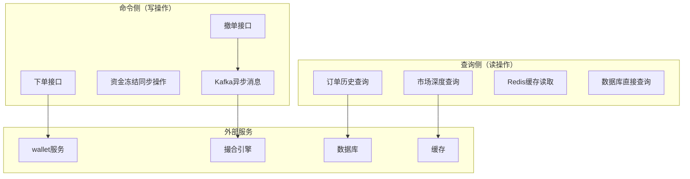
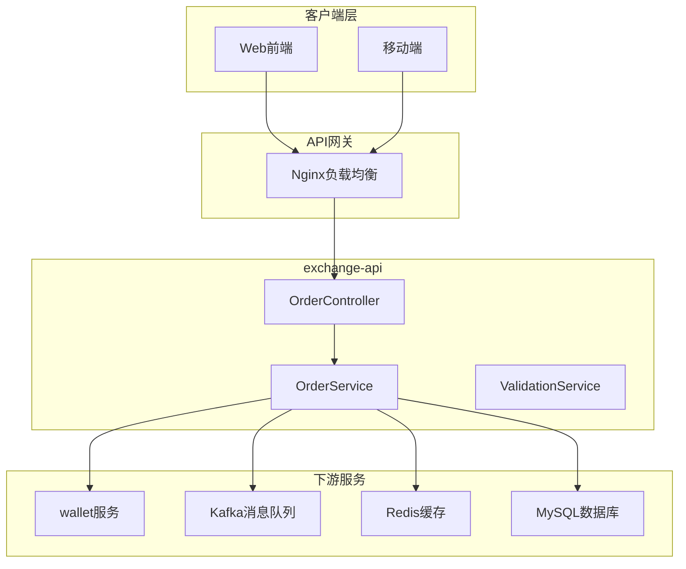
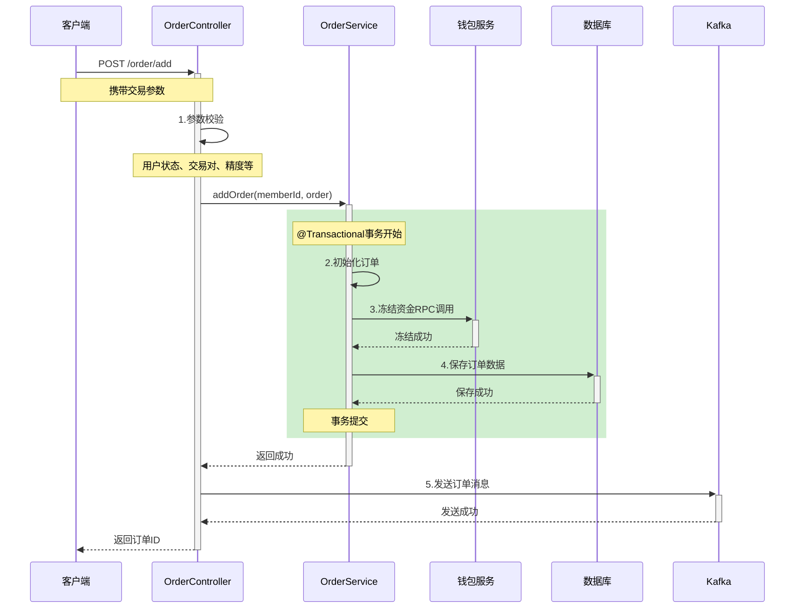

# 交易网关设计：交易所API架构的核心枢纽

## 引言：CQRS架构的应用

在现代高并发交易系统中，传统的单体架构面临着严峻的性能挑战。exchange-api作为交易所的核心交易网关，承担着用户下单、资金冻结、订单传递等关键职责。它采用了先进的CQRS（命令查询职责分离）架构模式，将写操作的复杂性和读操作的高性能需求进行有效分离。

**为什么需要CQRS？**

在高频交易环境下，系统的读写特性存在显著差异：
- **写操作**（下单、撤单、资金变动）流程复杂，涉及多个服务协调，需要强一致性保证
- **读操作**（查询订单历史、获取市场深度）相对简单，但需要高性能支持，满足大量并发查询

通过CQRS架构，我们可以：
1. **独立优化**：读写操作可以根据各自的特性进行独立的性能优化
2. **降低耦合**：命令和查询逻辑分离，提高系统的可维护性
3. **提升扩展性**：读操作可以水平扩展，写操作可以通过事件溯源进行优化

本文将深入分析exchange-api如何基于CQRS思想构建高性能、高可用的交易网关服务。

## 核心架构设计

### CQRS架构模式

exchange-api完美体现了CQRS设计思想，将系统清晰地分为命令侧和查询侧。这种分离不是简单的功能划分，而是基于对交易系统读写特性的深刻理解。在高频交易场景中，写操作涉及复杂的业务逻辑和强一致性保证，而读操作则需要高性能和低延迟。通过CQRS模式，我们能够为这两种截然不同的需求提供最优的解决方案。

下面的架构图清晰地展示了这种分离设计：


```mermaid
graph TD
    subgraph "命令侧（写操作）"
        A1[下单接口]
        A2[撤单接口]
        A3[资金冻结同步操作]
        A4[Kafka异步消息]
    end

    subgraph "查询侧（读操作）"
        B1[订单历史查询]
        B2[市场深度查询]
        B3[Redis缓存读取]
        B4[数据库直接查询]
    end

    subgraph "外部服务"
        C1[wallet服务]
        C2[撮合引擎]
        C3[数据库]
        C4[缓存]
    end

    A1 --> C1
    A2 --> A4
    A4 --> C2

    B1 --> C3
    B2 --> C4
```

**命令侧的设计特点**体现在四个关键组件上：

1. **下单接口**和**撤单接口**作为写操作的入口，需要严格的参数验证、权限检查和业务规则校验。这些操作的共同特点是涉及用户资产的变动，因此必须保证强一致性和可靠性。

2. **资金冻结同步操作**是写操作的核心环节，通过与wallet服务的RPC调用实现资金的原子性操作。这里的同步调用是为了确保用户资金的安全，避免因异步处理导致的资金状态不一致。

3. **Kafka异步消息**则巧妙地将用户请求的快速响应与后台的复杂处理分离。用户的下单请求在完成资金冻结后立即返回成功，而真正的撮合处理通过异步消息交给撮合引擎，这种设计极大地提升了用户体验。

**查询侧的优化策略**则展现了不同的设计思路：

1. **订单历史查询**直接访问数据库，因为历史数据查询频率相对较低，但对数据的准确性要求极高。通过使用JPA的Specification动态查询，支持复杂的多条件组合查询。

2. **市场深度查询**则完全基于Redis缓存，因为深度数据变更频繁且查询量巨大。通过缓存预计算的市场深度数据，可以实现微秒级的查询响应，满足高频交易的需求。

3. **缓存读取**和**数据库直接查询**的组合使用，体现了不同数据访问模式的最优策略选择。高频数据优先从缓存获取，低频但精度要求高的数据直接查询数据库。

### 系统交互架构

为了更好地理解exchange-api在整个交易系统中的位置和作用，下面的系统交互架构图展示了从用户请求到最终响应的完整数据流转过程。这个多层架构设计确保了系统的高可用性、可扩展性和高性能。


```mermaid
graph TD
    subgraph "客户端层"
        Web[Web前端]
        Mobile[移动端]
    end

    subgraph "API网关"
        Nginx[Nginx负载均衡]
    end

    subgraph "exchange-api"
        Controller[OrderController]
        Service[OrderService]
        Validation[ValidationService]
    end

    subgraph "下游服务"
        Wallet[wallet服务]
        Kafka[Kafka消息队列]
        Redis[Redis缓存]
        MySQL[MySQL数据库]
    end

    Web --> Nginx
    Mobile --> Nginx
    Nginx --> Controller
    Controller --> Service
    Service --> Wallet
    Service --> Kafka
    Service --> MySQL
    Service --> Redis
```

**客户端层**是用户请求的起点，包括Web前端和移动端。这些客户端通过HTTP/HTTPS协议与后端进行通信，发送下单、撤单、查询等交易请求。

**API网关层**采用了Nginx作为负载均衡器，这一层的设计具有多重作用：

1. **负载分发**：将用户请求均匀分发到多个exchange-api实例，避免单点压力过大
2. **SSL终端**：统一处理HTTPS加密解密，减轻后端服务的计算负担
3. **请求路由**：根据URL路径和请求类型，将请求路由到合适的服务实例
4. **限流控制**：在网关层实施初步的访问频率控制，保护后端服务

**exchange-api核心层**是业务逻辑处理的中枢，包含三个关键组件：

1. **OrderController**作为RESTful API的入口点，负责请求参数的初步验证、用户身份认证和响应格式的统一处理。Controller层的设计遵循单一职责原则，专注于HTTP协议相关的处理。

2. **OrderService**是业务逻辑的核心，封装了所有订单相关的复杂业务规则。包括订单验证、资金协调、消息发送等关键操作。Service层的设计注重事务一致性和业务逻辑的完整性。

3. **ValidationService**提供专门的验证服务，包括交易参数合法性检查、用户状态验证、交易对配置校验等。将验证逻辑独立成服务，提高了代码的可维护性和复用性。

**下游服务层**展示了exchange-api与外部系统的协作关系：

1. **wallet服务**通过RPC调用实现资金冻结、解冻、余额查询等操作。这些调用采用同步方式，确保资金操作的实时性和一致性。

2. **Kafka消息队列**用于异步消息传递，将订单信息发送给撮合引擎、行情服务等下游系统。这种异步解耦的设计大大提升了系统的吞吐量和响应速度。

3. **Redis缓存**存储热点数据，如交易对配置、用户状态、市场深度等。通过缓存加速，显著降低了数据库的访问压力。

4. **MySQL数据库**持久化存储订单记录、用户信息等核心业务数据。数据库的设计注重数据一致性和查询性能的平衡。

整个架构的数据流向体现了现代微服务系统的设计理念：**分层解耦、职责清晰、异步优化**。每一层都有明确的职责边界，通过标准化的接口进行通信，既保证了系统的整体性能，又便于单独扩展和维护。

## 下单流程深度分析

### 完整下单时序

下单流程是交易系统中最核心、最复杂的业务流程。下面这个时序图详细展示了一个完整下单请求的各个阶段，包括参数验证、资金冻结、订单保存和异步处理等关键环节。理解这个流程对于掌握交易系统的工作原理至关重要。


```mermaid
sequenceDiagram
    participant Client as 客户端
    participant Controller as OrderController
    participant Service as OrderService
    participant Wallet as 钱包服务
    participant DB as 数据库
    participant Kafka as Kafka

    Client->>+Controller: POST /order/add
    Note over Client,Controller: 携带交易参数

    Controller->>Controller: 1.参数校验
    Note over Controller: 用户状态、交易对、精度等

    Controller->>+Service: addOrder(memberId, order)

    rect rgba(100, 200, 100, 0.3)
        note over Service: @Transactional事务开始
        Service->>Service: 2.初始化订单
        Service->>+Wallet: 3.冻结资金RPC调用
        Wallet-->>-Service: 冻结成功
        Service->>+DB: 4.保存订单数据
        DB-->>-Service: 保存成功
        note over Service: 事务提交
    end

    Service-->>-Controller: 返回成功
    Controller->>+Kafka: 5.发送订单消息
    Kafka-->>-Controller: 发送成功
    Controller-->>-Client: 返回订单ID
```

**第一阶段：请求接收与初步验证**

用户下单请求首先到达OrderController，这是系统与外部世界交互的第一道防线。在这一阶段，系统执行多层验证确保请求的合法性：

1. **用户身份认证**：通过Session或Token验证用户身份，确保请求来自合法用户
2. **用户状态检查**：验证用户的交易权限是否正常，检查账户是否被冻结或限制交易
3. **请求参数验证**：包括交易对是否存在、价格和数量是否在合理范围内、精度是否符合要求等
4. **访问频率控制**：防止用户过于频繁的交易请求，保护系统稳定性

**第二阶段：核心业务处理（事务边界内）**

绿色矩形框内展示的是整个流程的核心部分，所有操作都在一个数据库事务中执行，确保操作的原子性。这一阶段的任何失败都会导致整个事务回滚，保证数据的一致性。

1. **订单初始化**：系统为订单生成唯一ID、设置时间戳、确定订单状态等基础信息。这些信息的准确设置对后续的订单追踪和管理至关重要。

2. **资金冻结操作**：这是整个流程中最关键的环节之一。系统通过RPC调用wallet服务，根据订单类型（买单或卖单）冻结相应金额的资金。这个操作必须同步执行，确保资金状态的准确性和一致性。

3. **订单数据持久化**：将完整的订单信息保存到MySQL数据库中。这一操作确保即使系统发生故障，订单信息也不会丢失，为后续的审计和对账提供数据基础。

**第三阶段：异步处理与响应返回**

事务提交成功后，系统进入异步处理阶段，这个阶段的设计极大地提升了用户体验和系统吞吐量：

1. **Kafka消息发送**：将订单信息序列化为JSON格式发送到Kafka消息队列。这个操作是异步的，不会阻塞用户请求的响应。

2. **撮合引擎处理**：exchange服务作为Kafka的消费者，接收到订单消息后在内存中进行撮合处理。由于撮合是内存操作，处理速度极快，可以达到微秒级响应。

3. **用户响应返回**：在最理想的情况下，用户下单请求在完成资金冻结后立即获得响应，响应时间通常在5-10毫秒以内。用户不需要等待撮合完成，这大大提升了交易体验。

**异常处理机制**：

整个流程设计了完善的异常处理机制：
- 如果资金冻结失败，整个事务回滚，用户收到明确的错误信息
- 如果数据库保存失败，同样触发事务回滚，确保不会出现资金冻结但订单未保存的情况
- 如果Kafka消息发送失败，系统会记录日志并尝试重发，确保订单最终能够被撮合引擎处理

这种设计的核心优势在于**一致性保证**和**高性能响应**的完美平衡。通过合理的事务边界设计和异步处理，系统既保证了资金操作的绝对安全，又提供了优秀的用户体验。

### 核心代码实现

#### 1. 订单接收与校验

下面的代码展示了OrderController的实现细节，这个类作为交易系统的入口点，体现了RESTful API设计的最佳实践和金融系统特有的严谨性。每一行代码都经过了精心设计，确保系统的安全性、可靠性和高性能。

```java
@RestController
@RequestMapping("/order")
public class OrderController {

    @PostMapping("/add")
    public MessageResult addOrder(@SessionAttribute(SESSION_MEMBER) AuthMember authMember,
                                 @RequestParam String symbol,
                                 @RequestParam BigDecimal price,
                                 @RequestParam BigDecimal amount,
                                 @RequestParam ExchangeOrderDirection direction) {

        // 用户状态校验
        Member member = memberService.findOne(authMember.getId());
        if (!member.getTransactionStatus().isEnabled()) {
            return MessageResult.error("交易功能已禁用");
        }

        // 交易对校验
        ExchangeCoin coin = exchangeCoinService.findBySymbol(symbol);
        if (coin == null || !coin.isEnabled()) {
            return MessageResult.error("交易对不存在或已禁用");
        }

        // 价格和数量精度校验
        if (!validatePriceAndAmount(price, amount, coin)) {
            return MessageResult.error("价格或数量精度不符合要求");
        }

        // 构建订单对象
        ExchangeOrder order = buildOrder(member, coin, price, amount, direction);

        // 调用服务层处理
        MessageResult result = orderService.addOrder(member.getId(), order);
        if (result.isSuccess()) {
            // 异步发送到撮合引擎
            kafkaTemplate.send("exchange-order", JSON.toJSONString(order));
        }

        return result;
    }
}
```

**用户身份验证与权限检查**

代码开头的`@SessionAttribute(SESSION_MEMBER) AuthMember authMember`参数设计体现了安全性的考量。通过从Session中获取已认证的用户信息，避免了用户身份伪造的风险。这是一种基于Session的认证机制，适用于传统的Web应用场景。

紧接着的用户状态查询`memberService.findOne(authMember.getId())`实现了双重验证的目的：首先确认用户确实存在于系统中，其次检查用户的交易状态。`getTransactionStatus().isEnabled()`这个检查看似简单，实则是风险控制的重要环节，可以阻止被限制账户的交易行为。

**交易对验证机制**

交易对验证分为两个层面：存在性检查和状态检查。`coin == null`检查确保交易对确实存在，而`!coin.isEnabled()`则检查该交易对是否被管理员临时禁用。这种设计在系统维护或异常情况下非常重要，例如某个币种出现技术问题时，管理员可以快速禁用相关交易对。

**精度验证的重要性**

`validatePriceAndAmount`方法的调用体现了交易系统对数据精度的严格要求。在加密货币交易中，不同的币种有不同的精度要求，比特币通常支持8位小数，而某些稳定币可能只支持2位小数。如果前端传入的数据精度不符合要求，可能会导致后续计算错误或资金损失。

这个验证方法内部通常会检查：
- 价格精度是否符合交易对配置的最小价格单位
- 数量精度是否超过最小交易单位
- 价格和数量是否在合理的范围内，防止异常数据

**异步消息发送的设计**

最后的`kafkaTemplate.send`调用是整个流程的关键点。这个操作被有意地放在服务层调用成功之后，确保只有真正成功的订单才会被发送到撮合引擎。使用`JSON.toJSONString(order)`将订单对象序列化为JSON字符串，便于不同系统间的数据交换。

这种异步设计的优势在于：
- 用户无需等待撮合完成即可获得响应
- 即使Kafka暂时不可用，订单信息已经保存在数据库中
- 撮合引擎可以独立扩展，不影响下单接口的性能

**错误处理的统一性**

整个方法使用了统一的`MessageResult`返回格式，这种设计便于前端统一处理不同类型的响应。成功时包含订单ID等有用信息，失败时提供明确的错误信息，帮助用户理解问题所在。

#### 2. 资金冻结与订单创建

下面的代码展示了ExchangeOrderService的实现，这是整个交易系统中最关键的核心业务逻辑。这个类被`@Transactional`注解标记，确保所有操作在同一个事务中执行，体现了金融系统对数据一致性的严格要求。

```java
@Service
@Transactional
public class ExchangeOrderService {

    public MessageResult addOrder(Long memberId, ExchangeOrder order) {
        // 初始化订单信息
        order.setOrderId(GeneratorUtil.getOrderId("E"));
        order.setStatus(ExchangeOrderStatus.TRADING);
        order.setCreateTime(System.currentTimeMillis());

        // 根据买卖方向冻结资金
        if (order.getDirection() == ExchangeOrderDirection.BUY) {
            return handleBuyOrder(memberId, order);
        } else {
            return handleSellOrder(memberId, order);
        }
    }

    private MessageResult handleBuyOrder(Long memberId, ExchangeOrder order) {
        // 买入订单冻结基础货币
        BigDecimal turnover = calculateTurnover(order);

        MemberWallet wallet = walletService.findByCoinAndMemberId(
            order.getBaseSymbol(), memberId);

        if (wallet.getBalance().compareTo(turnover) < 0) {
            return MessageResult.error("余额不足");
        }

        // 同步调用钱包服务冻结资金
        MessageResult freezeResult = walletService.freezeBalance(wallet, turnover);
        if (!freezeResult.isSuccess()) {
            throw new RuntimeException("资金冻结失败");
        }

        // 保存订单
        exchangeOrderRepository.saveAndFlush(order);
        return MessageResult.success();
    }
}
```

**事务边界设计的重要性**

`@Transactional`注解的运用是这段代码最精妙的设计之一。通过Spring的声明式事务管理，整个`addOrder`方法被包裹在一个事务中。这意味着：

1. **原子性保证**：订单创建和资金冻结要么全部成功，要么全部失败。不会出现资金已冻结但订单未创建的情况，也不会出现订单已创建但资金未冻结的情况。

2. **一致性维护**：事务确保数据库状态始终保持一致。即使在异常情况下，事务回滚也会将系统恢复到操作前的状态。

3. **隔离性保障**：多个并发订单之间通过数据库的隔离级别机制避免相互干扰，防止脏读、不可重复读等问题。

**订单初始化的精妙设计**

订单初始化的三行代码看似简单，实则包含了重要的业务考量：

- `GeneratorUtil.getOrderId("E")`：生成唯一的订单ID，前缀"E"标识这是交易订单。这个ID的生成需要考虑分布式环境下的唯一性和时间排序性。

- `order.setStatus(ExchangeOrderStatus.TRADING)`：将订单状态设置为"交易中"，这个状态标识告诉其他系统该订单正在等待撮合。

- `order.setCreateTime(System.currentTimeMillis())`：使用时间戳而非Date对象，便于排序和计算，同时避免了时区问题。

**买卖方向的业务逻辑分离**

根据买卖方向分别调用不同的处理方法，这种设计体现了业务逻辑的清晰分离。买入和卖出虽然都是交易操作，但在资金处理上有本质区别：

- **买入订单**：需要冻结预计花费的资产（如USDT），冻结金额 = 价格 × 数量
- **卖出订单**：需要冻结要出售的资产（如BTC），冻结金额 = 订单数量

这种分离设计使得业务逻辑更加清晰，也便于后续的维护和扩展。

**余额检查的双重保护**

在`handleBuyOrder`方法中，余额检查被设计为第一道防线：

```java
if (wallet.getBalance().compareTo(turnover) < 0) {
    return MessageResult.error("余额不足");
}
```

这个检查虽然看起来简单，但蕴含着重要的安全考量：

1. **用户体验优化**：在执行资金冻结操作前就检查余额，避免不必要的RPC调用，提升响应速度。

2. **资源保护**：防止对余额不足的账户发起无效的资金操作，减少系统资源的浪费。

3. **数据一致性**：通过`BigDecimal.compareTo`方法进行精确的数值比较，避免浮点数精度问题导致的错误判断。

**同步资金冻结的安全性**

`walletService.freezeBalance`的同步调用设计体现了资金安全优先的原则。虽然同步调用会暂时阻塞用户请求，但在金融场景下，这种设计是必要的：

1. **实时确认**：确保资金冻结操作确实成功执行，用户看到的状态是真实的。

2. **快速失败**：如果资金冻结失败，可以立即通知用户，避免用户误以为订单已经成功提交。

3. **审计追踪**：同步操作便于追踪和审计，每一步操作都有明确的时间点和结果。

**数据持久化的时机选择**

使用`saveAndFlush`而非`save`是一个深思熟虑的选择：

- `save`：将实体加入持久化上下文，但不立即写入数据库
- `saveAndFlush`：立即将数据写入数据库并同步到磁盘

在交易系统中选择`saveAndFlush`确保了：
- 数据立即持久化，即使应用崩溃也不会丢失订单信息
- 避免Hibernate的延迟写入可能导致的并发问题
- 为后续的异步处理提供可靠的数据基础

这种设计理念体现了金融系统对**可靠性**和**一致性**的极致追求，即使牺牲部分性能也在所不惜。

## 查询接口设计

### 订单历史查询

```java
@GetMapping("/history")
public MessageResult getOrderHistory(@SessionAttribute(SESSION_MEMBER) AuthMember authMember,
                                    @RequestParam String symbol,
                                    @RequestParam(defaultValue = "0") int page,
                                    @RequestParam(defaultValue = "20") int size) {

    // 构建查询条件
    Specification<ExchangeOrder> spec = (root, query, cb) -> {
        List<Predicate> predicates = new ArrayList<>();

        predicates.add(cb.equal(root.get("memberId"), authMember.getId()));

        if (StringUtils.isNotEmpty(symbol)) {
            predicates.add(cb.equal(root.get("symbol"), symbol));
        }

        return cb.and(predicates.toArray(new Predicate[0]));
    };

    // 分页查询
    Pageable pageable = PageRequest.of(page, size, Sort.by(Sort.Direction.DESC, "createTime"));
    Page<ExchangeOrder> orders = exchangeOrderRepository.findAll(spec, pageable);

    return MessageResult.success(orders);
}
```

### 市场深度查询

```java
@GetMapping("/market/depth")
public MessageResult getMarketDepth(@RequestParam String symbol) {
    // 直接从Redis缓存获取
    String depthKey = "market:depth:" + symbol;
    String depthJson = redisTemplate.opsForValue().get(depthKey);

    if (StringUtils.isEmpty(depthJson)) {
        return MessageResult.error("暂无深度数据");
    }

    return MessageResult.success(JSON.parseObject(depthJson));
}
```

## 安全机制设计

### 1. 限流防护

```java
@Component
@Aspect
public class RateLimitAspect {

    @Autowired
    private RedisTemplate<String, String> redisTemplate;

    @Around("@annotation(rateLimit)")
    public Object limit(ProceedingJoinPoint joinPoint, RateLimit rateLimit) throws Throwable {
        String key = "rate:limit:" + rateLimit.value() + ":" + getCurrentUserId();

        // 令牌桶算法实现
        String script = "local bucket_key = KEYS[1] " +
                      "local capacity = tonumber(ARGV[1]) " +
                      "local tokens = tonumber(redis.call('HGET', bucket_key, 'tokens')) " +
                      "local last_refill = tonumber(redis.call('HGET', bucket_key, 'last_refill')) " +
                      "local now = tonumber(ARGV[2]) " +
                      "local refill_rate = tonumber(ARGV[3]) " +
                      "if tokens == nil then " +
                      "  tokens = capacity " +
                      "  last_refill = now " +
                      "else " +
                      "  local elapsed = now - last_refill " +
                      "  tokens = math.min(capacity, tokens + elapsed * refill_rate / 1000) " +
                      "  last_refill = now " +
                      "end " +
                      "if tokens >= 1 then " +
                      "  tokens = tokens - 1 " +
                      "  redis.call('HMSET', bucket_key, 'tokens', tokens, 'last_refill', last_refill) " +
                      "  redis.call('EXPIRE', bucket_key, 3600) " +
                      "  return 1 " +
                      "else " +
                      "  redis.call('HMSET', bucket_key, 'tokens', tokens, 'last_refill', last_refill) " +
                      "  redis.call('EXPIRE', bucket_key, 3600) " +
                      "  return 0 " +
                      "end";

        Long result = redisTemplate.execute(
            new DefaultRedisScript<>(script, Long.class),
            Collections.singletonList(key),
            rateLimit.capacity(), System.currentTimeMillis(), rateLimit.refillRate()
        );

        if (result == 0) {
            throw new RateLimitException("请求过于频繁");
        }

        return joinPoint.proceed();
    }
}
```

### 2. 幂等性保障

```java
public class IdempotencyService {

    @Autowired
    private RedisTemplate<String, String> redisTemplate;

    public boolean checkAndSetRequest(String requestId, long expireSeconds) {
        String key = "idempotency:" + requestId;

        // SETNX实现幂等性
        Boolean success = redisTemplate.opsForValue()
            .setIfAbsent(key, "1", expireSeconds, TimeUnit.SECONDS);

        return Boolean.TRUE.equals(success);
    }

    public String getRequestResult(String requestId) {
        String key = "idempotency:result:" + requestId;
        return redisTemplate.opsForValue().get(key);
    }

    public void setRequestResult(String requestId, Object result) {
        String key = "idempotency:result:" + requestId;
        redisTemplate.opsForValue().set(key, JSON.toJSONString(result), 3600, TimeUnit.SECONDS);
    }
}
```

### 3. 熔断降级

```java
@Component
public class WalletServiceFallback implements WalletServiceFeign {

    @Override
    public MessageResult freezeBalance(MemberWallet wallet, BigDecimal amount) {
        log.error("钱包服务降级，冻结余额请求失败");
        return MessageResult.error("系统繁忙，请稍后再试");
    }

    @Override
    public MemberWallet findByCoinAndMemberId(String coinUnit, Long memberId) {
        log.error("钱包服务降级，查询钱包失败");
        throw new RuntimeException("钱包服务暂时不可用");
    }
}
```

## 性能优化策略

### 1. 异步化处理

```java
@Service
public class AsyncOrderService {

    @Async("orderExecutor")
    public CompletableFuture<Void> processOrderAsync(ExchangeOrder order) {
        try {
            // 异步处理订单相关操作
            orderValidator.validate(order);
            orderLogger.log(order);

            return CompletableFuture.completedFuture(null);
        } catch (Exception e) {
            return CompletableFuture.failedFuture(e);
        }
    }
}
```

### 2. 缓存策略

```java
@Service
public class ExchangeCoinCache {

    @Autowired
    private RedisTemplate<String, ExchangeCoin> redisTemplate;

    private static final String COIN_CACHE_KEY = "exchange:coin:";

    public ExchangeCoin findBySymbol(String symbol) {
        // 先查缓存
        ExchangeCoin coin = redisTemplate.opsForValue().get(COIN_CACHE_KEY + symbol);

        if (coin == null) {
            // 缓存未命中，查询数据库
            coin = exchangeCoinRepository.findBySymbol(symbol);
            if (coin != null) {
                // 写入缓存，过期时间5分钟
                redisTemplate.opsForValue().set(COIN_CACHE_KEY + symbol, coin, 300, TimeUnit.SECONDS);
            }
        }

        return coin;
    }
}
```

## 监控与告警

### 关键指标监控

```java
@Component
public class OrderMetrics {

    private final Counter orderCounter;
    private final Timer orderTimer;
    private final Gauge orderQueueSize;

    public OrderMetrics(MeterRegistry meterRegistry) {
        this.orderCounter = Counter.builder("order.request.total")
            .description("订单请求总数")
            .register(meterRegistry);

        this.orderTimer = Timer.builder("order.process.duration")
            .description("订单处理耗时")
            .register(meterRegistry);
    }

    public void recordOrder() {
        orderCounter.increment();
    }

    public Timer.Sample startTimer() {
        return Timer.start();
    }
}
```

## 总结

exchange-api作为交易所的**核心枢纽**，通过以下关键设计实现了高可用、高性能的交易系统：

1. **CQRS架构**：读写分离，优化性能和可扩展性
2. **同步异步结合**：资金冻结同步，撮合指令异步
3. **完善的安全机制**：限流、幂等性、熔断降级
4. **事务一致性**：确保资金操作和订单创建的原子性
5. **缓存优化**：减少数据库压力，提升响应速度

这种架构设计为现代交易所提供了稳定可靠的技术基础。