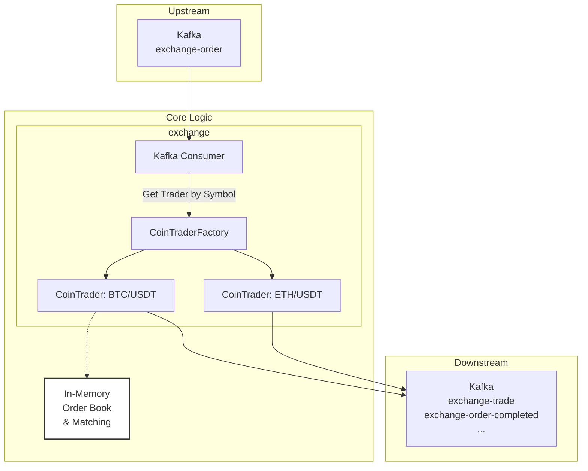
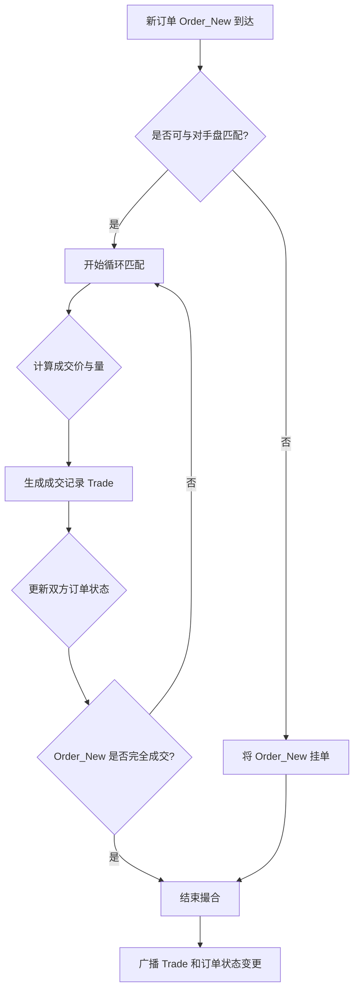

# 第十三章：深入交易所心脏：撮合引擎(`exchange`)源码剖析

## 引言：不知疲倦的“自动化拍卖师”

如果说`exchange-api`是交易所的“前线指挥官”，那么`exchange`服务，就是整个平台真正的心脏。我们可以把它想象成一个为每个交易对（如 BTC/USDT）都配备了一位的、7x24 小时工作的“**自动化拍卖师**”。

这位“拍卖师”不与任何外部用户直接对话，它的世界纯粹而高效：

- **唯一的输入**：是通过 Kafka 传送带，源源不断送来的订单指令。
- **唯一的计算**：是在它的大脑（内存）中，遵循“价高者得/价低者卖”和“先来后到”的铁律，以毫秒甚至微秒级的速度，让买卖双方的订单相遇、成交。
- **唯一的输出**：是成交的“**收据**”（成交记录），它将这些收据同样扔回 Kafka 传送带，通知下游的“会计”（`wallet`服务）和“市场分析师”（`market`服务）去完成后续工作。

本章，我们将化身“心脏外科医生”，打开这个核心“黑盒”，深入其源码，去探寻那些决定交易成败的毫秒级瞬间。



---

## 核心法则与数据结构：构建内存中的“订单簿”

所有撮合引擎，无论实现多么复杂，都必须严格遵循一条黄金法则：**价格优先、时间优先（Price-Time Priority）**。

- **价格优先**：买单，出价越高，越优先成交；卖单，出价越低，越优先成交。
- **时间优先**：在价格相同的情况下，谁的订单先到，谁就优先成交。

为了在代码中将这一法则以最高效的方式实现，本项目构建了一个完全基于内存的**订单簿（Order Book）**。

| 买盘 (Buy Book) - 价格降序 | 卖盘 (Sell Book) - 价格升序 |
| :------------------------- | :-------------------------- | ---------------- | ----------------- |
| **价格 (Price)**           | **数量 (Amount)**           | **价格 (Price)** | **数量 (Amount)** |
| 29999.5                    | 0.5                         | 30000.1          | 1.2               |
| 29998.2                    | 1.1                         | 30000.8          | 0.3               |
| 29998.2                    | 0.4                         | 30001.5          | 2.0               |

**源码实现: `exchange/src/main/java/com/bizzan/bitrade/Trader/CoinTrader.java`**

```java
public class CoinTrader {
    // 买入限价订单队列，价格从高到低排列
    private TreeMap<BigDecimal, MergeOrder> buyLimitPriceQueue;

    // 卖出限价订单队列，价格从低到高排列
    private TreeMap<BigDecimal, MergeOrder> sellLimitPriceQueue;

    public void initialize(){
        // 买单队列价格降序排列
        buyLimitPriceQueue = new TreeMap<>(Comparator.reverseOrder());
        // 卖单队列价格升序排列
        this.sellLimitPriceQueue = new TreeMap<>(Comparator.naturalOrder());
    }
}
```

这个订单簿的设计精髓，在于`TreeMap`与`LinkedList`（封装在`MergeOrder`中）的巧妙结合。

- **`TreeMap` 实现“价格优先”**：`TreeMap`是一个基于红黑树的、自带排序功能的 Map。

  - **买盘**：使用`Comparator.reverseOrder()`，使得价格**从高到低**排列。`buyLimitPriceQueue.firstKey()` 永远是当前市场上的最高买价。
  - **卖盘**：使用`Comparator.naturalOrder()`，使得价格**从低到高**排列。`sellLimitPriceQueue.firstKey()` 永远是当前市场上的最低卖价。

- **`MergeOrder` (内含`LinkedList`) 实现“时间优先”**：当多个订单的价格相同时，它们会被添加到一个`MergeOrder`对象内部的`LinkedList`中。由于新订单总是被添加到链表的尾部（`addLast`），而在撮合时总是从头部开始遍历（`iterator()`），这便天然地保证了在同一价格下，先来的订单会被先处理。

---

## 核心流程推演：一笔市价单的撮合之旅

纸上谈兵终觉浅，让我们通过一个具体的例子，来完整地推演一次撮合过程。

#### 1. 初始订单簿状态

假设当前 BTC/USDT 的卖盘（对手盘）如下：

| 订单 ID | 价格 (USDT) | 数量 (BTC) | 累计数量 |
| :------ | :---------- | :--------- | :------- |
| S1      | 30000       | 0.5        | 0.5      |
| S2      | 30001       | 0.3        | 0.8      |
| S3      | 30001       | 0.4        | 1.2      |
| S4      | 30002       | 1.0        | 2.2      |

> 注意：价格为 30001 的有两个订单，S2 下单时间早于 S3。

#### 2. 新订单入场

现在，一个交易员（我们称之为 Taker）下了一笔**市价买单 B1**，想要**买入 1.0 个 BTC**。

#### 3. 撮合开始

`CoinTrader` 接收到订单 B1，开始与卖盘进行撮合。

**第一轮撮合：**

- **匹配对象**：B1 vs S1 (卖一价，价格最优)。
- **成交价格**：**30000** (永远取挂单方 Maker 的价格)。
- **成交数量**：`min(B1剩余数量1.0, S1数量0.5) = 0.5`。
- **结果**：
  - 生成**成交记录 Trade1**: `买方B1, 卖方S1, 价格30000, 数量0.5`。
  - 订单 S1 **完全成交**，从订单簿中移除。
  - 订单 B1 剩余待成交数量：`1.0 - 0.5 = 0.5`。

**第二轮撮合：**

- **匹配对象**：B1 vs S2 (新的卖一价，价格时间最优)。
- **成交价格**：**30001**。
- **成交数量**：`min(B1剩余数量0.5, S2数量0.3) = 0.3`。
- **结果**：
  - 生成**成交记录 Trade2**: `买方B1, 卖方S2, 价格30001, 数量0.3`。
  - 订单 S2 **完全成交**，从订单簿中移除。
  - 订单 B1 剩余待成交数量：`0.5 - 0.3 = 0.2`。

**第三轮撮合：**

- **匹配对象**：B1 vs S3 (新的卖一价)。
- **成交价格**：**30001**。
- **成交数量**：`min(B1剩余数量0.2, S3数量0.4) = 0.2`。
- **结果**：
  - 生成**成交记录 Trade3**: `买方B1, 卖方S3, 价格30001, 数量0.2`。
  - 订单 S3 **部分成交**，其剩余数量更新为 `0.4 - 0.2 = 0.2`。
  - 订单 B1 **完全成交**，撮合结束。

#### 4. 最终状态

**生成的成交记录 (发送到 `exchange-trade` 主题):**

- Trade1: { Price: 30000, Amount: 0.5, Taker: B1, Maker: S1 }
- Trade2: { Price: 30001, Amount: 0.3, Taker: B1, Maker: S2 }
- Trade3: { Price: 30001, Amount: 0.2, Taker: B1, Maker: S3 }

**更新后的订单簿:**
| 订单 ID | 价格 (USDT) | 数量 (BTC) | 累计数量 |
| :--- | :--- | :--- | :--- |
| S3 | 30001 | **0.2** | 0.2 |
| S4 | 30002 | 1.0 | 1.2 |

这个从接收订单，到循环匹配，再到更新订单簿并生成结果的过程，就是撮合引擎每一毫秒都在重复的核心工作。



---

## 并发控制：“宏观并行，微观串行”的艺术

撮合的正确性是交易所的生命线。本项目采用了一种业界广泛验证的成熟模型：**交易对级单线程（Single-Thread per Trading Pair）**。

**源码路径: `exchange/src/main/java/com/bizzan/bitrade/Trader/CoinTraderFactory.java`**

```java
public class CoinTraderFactory {
    private ConcurrentHashMap<String, CoinTrader> traderMap;
    // ...
    public CoinTrader getTrader(String symbol) {
        return traderMap.get(symbol);
    }
}
```

系统在启动时，会为每一个启用的交易对（如"BTC/USDT"）创建一个专属的、唯一的`CoinTrader`实例。这意味着，**所有关于"BTC/USDT"的订单，都将由同一个`CoinTrader`对象来处理。**

**源码路径: `exchange/src/main/java/com/bizzan/bitrade/Trader/CoinTrader.java`**

```java
// 在所有核心的撮合方法中，都使用了 synchronized 关键字
public void matchLimitPriceWithLPList(...) {
    synchronized (lpList) { // lpList 是对手方的订单簿
        // ... 核心撮合逻辑 ...
    }
}
```

这种设计的深刻含义在于：

- **交易对内部，撮合是绝对串行的**：当一个"BTC/USDT"的买单正在与卖盘进行撮合时，整个卖盘被锁定。这从根本上杜绝了在同一个交易对内发生数据争用，保证了撮合的**原子性和确定性**。
- **交易对之间，撮合是完全并行的**：对"BTC/USDT"的撮合操作，与对"ETH/USDT"的撮合操作，发生在不同的`CoinTrader`实例和不同的线程中，互不干扰，可以完全并行执行。

**总结来说，这个并发模型通过“宏观并行、微观串行”的策略，既保证了单个交易对撮合的绝对数据安全，又实现了整个系统处理能力的横向扩展。**

---

## 源码剖析：从消费到广播的全流程

现在，让我们跟随一笔订单，在源码中完整地走完它在撮合引擎中的旅程。

#### 1. 入口：`ExchangeOrderConsumer`

旅程的起点，是 Kafka 消费者。它接收`exchange-order`主题的消息，获取该交易对专属的`CoinTrader`，然后调用其`trade`方法。

**源码路径: `exchange/src/main/java/com/bizzan/bitrade/consumer/ExchangeOrderConsumer.java`**

```java
@KafkaListener(topics = "exchange-order", ...)
public void onOrderSubmitted(List<ConsumerRecord<String,String>> records){
    for (ConsumerRecord<String,String> record : records) {
        ExchangeOrder order = JSON.parseObject(record.value(), ExchangeOrder.class);
        // 1. 从工厂获取该交易对专属的撮合处理器
        CoinTrader trader = traderFactory.getTrader(order.getSymbol());
        // ...
        // 2. 调用核心撮合方法
        trader.trade(order);
        // ...
    }
}
```

#### 2. 调度：`CoinTrader.trade()`

`trade()`方法是撮合的总调度室，它根据订单的类型（市价/限价）和方向（买/卖），决定接下来应该执行哪种撮合策略，这体现了**Taker**和**Maker**两种角色的不同处理方式。

- **市价单（Taker）**：追求立即成交，它会作为“吃单方”，去消耗对手盘的流动性。
- **限价单（Taker -> Maker）**：它首先会尝试作为“Taker”去吃掉盘口上所有价格更优的订单。如果还有剩余，它就会转变为“Maker”，成为“挂单方”，为市场提供流动性。

#### 3. 执行：`matchLimitPriceWithLPList()`

我们以最经典的“限价单与限价单撮合”为例，其核心逻辑与我们之前推演的流程完全一致：

1.  **锁定对手盘**：`synchronized (lpList)`
2.  **遍历价格**：`Iterator<Map.Entry<BigDecimal,MergeOrder>>`
3.  **检查价格**：`mergeOrder.getPrice().compareTo(focusedOrder.getPrice())`
4.  **遍历订单**：`mergeOrder.iterator()`
5.  **处理匹配**：`processMatch(focusedOrder, matchOrder)`
6.  **更新状态**：移除已完成订单，更新部分成交订单。
7.  **挂起剩余**：如果`focusedOrder`未完成，则`addLimitPriceOrder(focusedOrder)`。
8.  **广播结果**：`handleExchangeTrade(exchangeTrades)`

`processMatch()`方法则负责具体的数学计算，它会确定本次撮合的**成交价**（永远以被动方，即挂单方的价格为准）和**成交量**（取双方剩余可成交量的较小值）。

#### 4. 输出：结果广播

撮合完成后，`CoinTrader`会将产生的结果，通过不同的 Kafka 主题，精准地广播给所有需要它的下游服务。

| Kafka 主题                 | 核心内容        | 主要消费者         | 消费目的                            |
| :------------------------- | :-------------- | :----------------- | :---------------------------------- |
| **`exchange-trade`**       | **成交记录**    | `wallet`, `market` | **资金结算**、生成 K 线、最新成交价 |
| `exchange-order-completed` | 完成/取消的订单 | `exchange-api`     | 更新 DB 状态、推送用户通知          |
| `exchange-trade-plate`     | 最新盘口深度    | `market`           | 实时刷新客户端买卖盘                |

---

## 总结与展望

在本章中，我们以前所未有的深度，剖析了`exchange`撮合引擎的源码。它通过清晰的职责划分、优雅的数据结构和严谨的并发控制，构建了一个健壮、高效、可扩展的交易核心。

我们不仅通过一个详尽的示例，理解了“**价格优先、时间优先**”的原则是如何在订单簿上运作的，更洞悉了“**交易对级单线程**”这一并发模型在保证数据绝对正确性与系统横向扩展性之间的完美平衡。

理解了撮合引擎，就理解了整个交易所的心跳。在接下来的章节中，我们将把目光投向下游，去探索`market`（行情）和`wallet`（钱包）模块是如何消费这些核心数据，最终为用户呈现出丰富多彩的行情图表，并完成每一笔资金的精准结算，构成一个完整的交易闭环。
