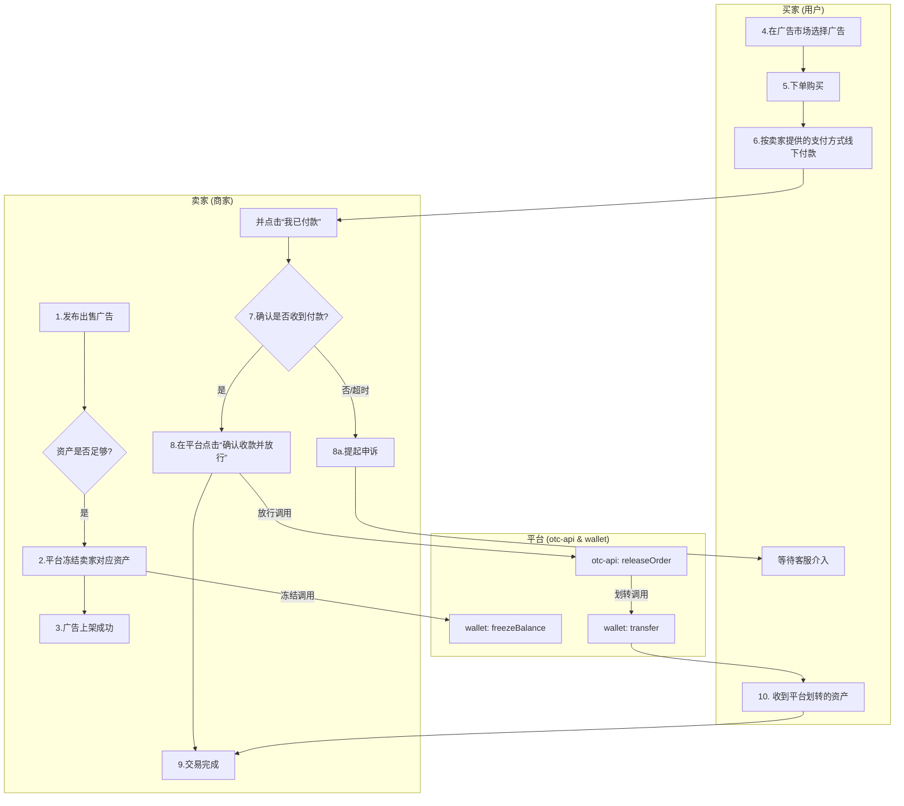
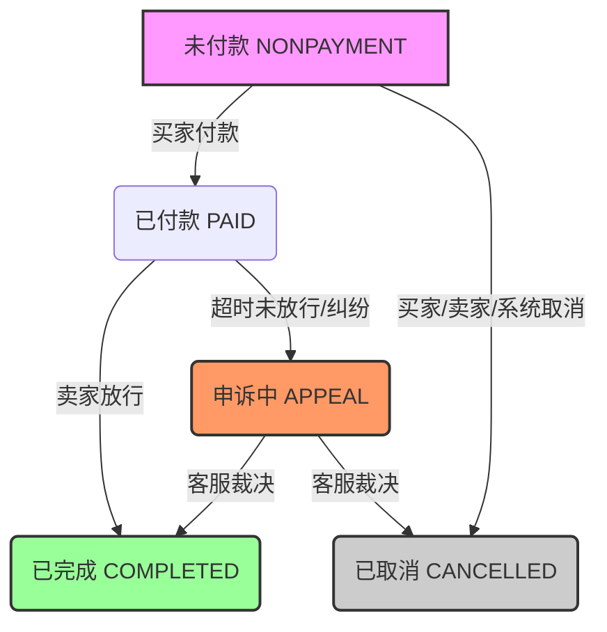
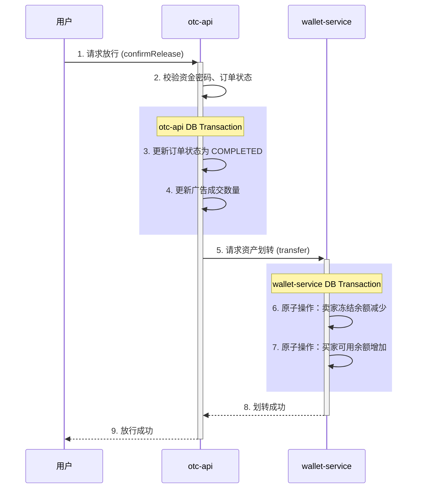

# 第十四章：构建加密世界的信任桥梁：法币交易(otc-api)源码剖析

## 引言：从法币到加密货币的“第一公里”

如果说币币交易是加密世界内部的高速公路，那么 OTC（Over-the-Counter，场外交易）服务，就是连接现实世界与加密世界的“第一公里”。它解决了最根本的问题：一个新手用户，如何将手中的法定货币（如人民币、美元），安全、可信地兑换成他的第一个比特币或 USDT？

`otc-api`服务的核心，并非人与机器（撮合引擎）之间冷冰冰的算法交互，而是**人与人（C2C）之间基于信任的价值交换**。

| 对比维度     | 币币交易 (Exchange)            | 法币交易 (OTC)                       |
| :----------- | :----------------------------- | :----------------------------------- |
| **交易模型** | **C2B (Customer-to-Business)** | **C2C (Customer-to-Customer)**       |
| **交易对手** | 用户 vs **撮合引擎**           | 用户 vs **另一位用户**               |
| **价格形成** | 市场供需，连续竞价             | 广告主**自主定价**                   |
| **交易速度** | 极快（毫秒级）                 | 较慢（分钟到小时级，取决于线下付款） |
| **平台角色** | 交易撮合者、记账中心           | **信息中介、资金担保方、纠纷仲裁者** |

它更像是一个“加密货币的支付宝担保交易平台”，平台通过**冻结卖家资产**来提供信用背书，确保买家付款后，卖家必须放行资产，否则平台将介入仲裁。

本章，我们将深入`otc-api`的源码，解构这一精巧的担保交易模型，看平台是如何通过严谨的业务流程和资金操作，为 C2C 交易这片“黑暗森林”建立起一座坚实的信任桥梁。

---

## 核心业务全景图

在深入代码之前，我们先通过一个流程图，鸟瞰一次完整的 OTC 购买流程。



---

## 业务基石：三大核心实体的设计哲学

要理解复杂的 OTC 业务流程，必须先从其数据结构的定义开始。`Advertise`（广告）、`Order`（订单）和`Appeal`（申诉）这三个核心实体，共同构成了整个业务的基石。

#### `Advertise.java`：交易意图的“发布板”

广告是所有交易的起点，它清晰地定义了“谁，想以什么条件，交易什么”。

**源码路径: `core/src/main/java/com/bizzan/bitrade/entity/Advertise.java`**

```java
// Advertise.java
@Entity
public class Advertise {
    private AdvertiseType advertiseType; // 广告类型：BUY / SELL
    @ManyToOne
    private Member member; // 广告主
    private PriceType priceType; // 定价类型：REGULAR(固定) / MUTATIVE(浮动)
    private BigDecimal price; // 价格
    private BigDecimal remainAmount; // 广告剩余数量
    private String payMode; // 支持的支付方式: alipay, wechat, bank
    private AdvertiseControlStatus status; // 广告状态：上架/下架
    @Version
    private Long version; // 乐观锁版本号
}
```

`Advertise`实体最值得关注的是`@Version`注解。它意味着该实体采用了**乐观锁**机制。当多个用户在同一时刻“抢购”同一个广告时，数据库的版本号机制能确保只有第一个用户能成功修改广告的`remainAmount`（剩余数量），后续的并发请求会因版本号不匹配而失败。这是保障“抢单”场景数据一致性的关键设计。

#### `Order.java`：不可篡改的“交易快照”

一旦用户下单，系统便会创建一个`Order`实体。它不仅是交易过程的忠实记录，更是整个状态流转的核心载体。

**源码路径: `core/src/main/java/com/bizzan/bitrade/entity/Order.java`**

```java
// Order.java
@Entity
@Table(name = "otc_order")
public class Order {
    @Column(unique = true, nullable = false)
    private String orderSn; // 唯一订单号
    private Long advertiseId; // 关联的广告ID
    private Long memberId; // 广告主ID
    private Long customerId; // 下单用户ID
    @Enumerated(EnumType.ORDINAL)
    private OrderStatus status; // 订单状态 (核心)
    private BigDecimal price; // 成交价格
    private BigDecimal number; // 交易数量
    // ... 时间戳字段 ...
    @Embedded // 内嵌支付信息
    private Alipay alipay;
    @Embedded
    private BankInfo bankInfo;
}
```

`Order`实体的设计体现了“**快照**”思想。它冗余存储了成交那一刻的几乎所有关键信息（如价格、双方用户名、支付方式详情等）。这样做的好处是，即便后续广告主修改了广告价格，或者用户更改了自己的收款信息，已经生成的订单历史记录也**不会受到任何影响**，保证了交易的不可篡改性和可追溯性。

#### 订单状态机：驱动业务流转的核心引擎

`Order`实体中的`status`字段是整个 OTC 业务的灵魂，它的变化驱动着所有业务逻辑的流转。



---

## 核心流程（一）：信任的起点——“上架即冻结”

一个普遍的误解是，平台在买家下单时才冻结卖家的币。然而，源码揭示了一个更高效、更严谨的模型：“**上架即冻结**”。

**源码路径: `otc-api/src/main/java/com/bizzan/bitrade/controller/AdvertiseController.java`**

```java
// AdvertiseController.java
@RequestMapping(value = "/on/shelves")
@Transactional(rollbackFor = Exception.class)
public MessageResult putOnShelves(long id, @SessionAttribute(SESSION_MEMBER) AuthMember authMember) {
    // ... 前置校验 ...

    // 如果是出售广告
    if (advertise.getAdvertiseType().equals(AdvertiseType.SELL)) {
        MemberWallet memberWallet = memberWalletService.findByOtcCoinAndMemberId(otcCoin, authMember.getId());
        // 检查可用余额是否足够发布广告
        Assert.isTrue(compare(memberWallet.getBalance(), advertise.getNumber()), "余额不足");

        // **核心步骤：调用wallet服务，从可用余额划转到冻结余额**
        MessageResult result = memberWalletService.freezeBalance(memberWallet, advertise.getNumber());
        if (result.getCode() != 0) {
            throw new InformationExpiredException("Information Expired");
        }
    }

    // 更新广告状态为“上架”
    advertise.setStatus(AdvertiseControlStatus.PUT_ON_SHELVES);
    return MessageResult.success("上架成功");
}
```

这意味着，当卖家发布一个出售 1000 USDT 的广告并点击“上架”时，平台会**立刻**从其钱包的**可用余额**中，将 1000 USDT 划转到**冻结余额**。这种“**提前担保**”的设计，极大地提升了后续买家下单接口的性能和流程简洁性。

---

## 核心流程（二）：信任的交付——放行与资产划转

当卖家确认收到买家的线下付款后，他将在平台执行“放行”操作。这是信任交付的最后一环，也是资产的最终交割。



#### 放行源码剖析

**源码路径: `otc-api/src/main/java/com/bizzan/bitrade/controller/OrderController.java`**

```java
// OrderController.java
@RequestMapping(value = "release")
@Transactional(rollbackFor = Exception.class)
public MessageResult confirmRelease(String orderSn, String jyPassword, @SessionAttribute(SESSION_MEMBER) AuthMember user) {
    // 1. 校验资金密码、订单状态（必须是PAID）等
    // ...

    // 2. 更新广告的成交数量
    advertiseService.updateAdvertiseAmountForRelease(order.getAdvertiseId(), order.getNumber());

    // 3. 更新订单状态为“已完成”
    orderService.releaseOrder(order.getOrderSn());

    // 4. **核心：调用 wallet 服务进行资产划转**
    memberWalletService.transfer(order, ret); // ret 用于判断谁是卖家

    // 5. 触发订单完成事件，用于统计等后续操作
    orderEvent.onOrderCompleted(order);

    return MessageResult.success("放行成功");
}
```

#### 资金划转源码剖析

**源码路径: `core/src/main/java/com/bizzan/bitrade/service/MemberWalletService.java`**

```java
// MemberWalletService.java
public void transfer(Order order, int ret) throws InformationExpiredException {
    // 1. 根据广告类型和订单角色，准确判断出 sellerId 和 buyerId
    // ...

    // 2. 计算卖家和买家实际需要处理的金额 (考虑手续费)
    // ...

    // 3. **核心原子操作：直接从卖家的冻结余额中扣除**
    int is = memberWalletDao.decreaseFrozen(sellerWallet.getId(), sellerAmount);
    if (is > 0) {
        // 4. **核心原子操作：为买家增加可用余额**
        int a = memberWalletDao.increaseBalance(buyerWallet.getId(), buyerAmount);
        if (a <= 0) {
            // 此处应有补偿机制，如记录日志、人工介入
            throw new InformationExpiredException("Information Expired");
        }
    } else {
        throw new InformationExpiredException("Information Expired");
    }
}
```

源码清晰地揭示了资金划转的本质：它是一个**原子性**的操作，直接将卖家的**冻结余额**转移为买家的**可用余额**。`decreaseFrozen`和`increaseBalance`这两个 DAO 层的方法，在数据库层面通过带有`where`条件的`UPDATE`语句实现，保证了操作的原子性和线程安全。

---

## 风险兜底：不可或缺的申诉机制

C2C 交易的核心风险在于**信息不对称**和**操作失误**（如买家标记已付款但未付，或卖家收到款但忘记/拒绝放行）。**申诉（Appeal）机制**就是为了应对这些“意外”而设计的最终防线。

当订单处于“已付款”状态，但长时间未被卖家放行，或任何一方认为存在欺诈行为时，都可以发起申诉。此时，订单状态会变为`APPEAL`，并被**锁定**，等待平台客服介入。客服会根据双方提供的凭证（如付款截图、聊天记录）进行**人工仲裁**，最终手动将订单状态改为“已完成”或“已取消”，从而保障交易的公平性。

没有申诉机制的 OTC 平台，是不完整的、也是极不安全的。

---

## 总结与思考

通过对`otc-api`源码的深度剖析，我们洞悉了一个 C2C 担保交易平台的核心设计哲学：

- **以状态机驱动业务**：清晰的订单状态流转，是复杂业务逻辑的纲领。
- **以“上架即冻结”模型奠定信任基础**：通过提前锁定卖家资产，为平台信用背书，简化了交易流程。
- **以“交易快照”保证历史不可篡改**：冗余的订单数据设计，确保了每一笔交易的永久可追溯性。
- **以原子化数据库操作保障资金安全**：在资金划转中，确保了计算的绝对准确。
- **以申诉机制作为风险最后一道防线**：为复杂的 C2C 交互提供最终的公平保障。

`otc-api`不仅是连接现实世界资金的桥梁，更是软件工程领域中，如何用代码构建“信任”的一个经典范例。
