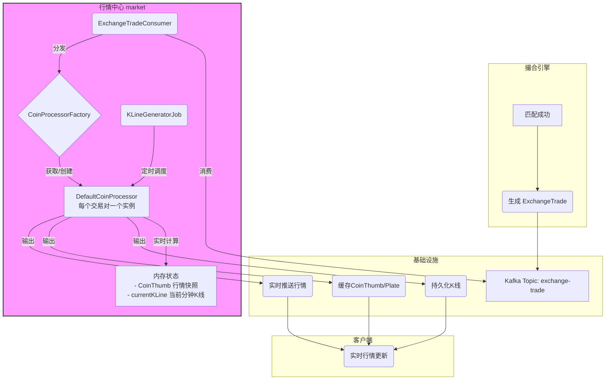
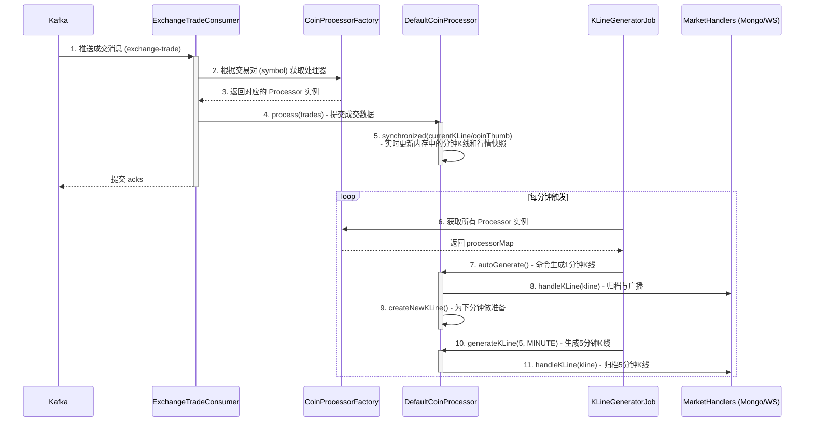

# 第十五章：行情炼金术——揭秘 market 服务的数据聚合与生成

## 1. 开篇：从数据璞玉到行情瑰宝

在撮合引擎 `exchange` 的高速世界里，时间以微秒度量，数据是离散的、一笔笔独立的成交记录 (`ExchangeTrade`)。这些记录是构成市场的原子，是未经雕琢的“数据璞玉”。然而，对于需要洞察市场趋势、做出交易决策的用户而言，这些原始、离散的原子信息价值有限。他们需要的是能够直观反映市场情绪与价格走势的“行情瑰宝”——例如实时跳动的行情 Ticker 和蕴含周期规律的 K 线图。

如何点石成金，将这些原始数据转化为洞察市场的关键指标？这便是我们本章的主角——**行情中心 (`market`)** 的核心使命。

`market` 服务在整个交易所架构中，扮演着“**数据中枢与炼金工厂**”的关键角色。它像一位技艺精湛的炼金术士，订阅来自上游 `exchange` 服务的原始成交数据流，经过一系列精密的实时计算、状态维护与异步聚合，最终锻造出结构化的行情数据，通过 WebSocket 推送至千千万万个客户端，为所有前端交易界面提供着源源不断的动力。

与我们之前剖析的业务模块不同，`market` 的设计哲学充满了对**高性能、高并发与数据一致性**的精妙权衡。它是一个典型的、完全由事件驱动的**流式数据处理系统**。在本章的探索中，我们将深入其源码，解构其优雅的架构，并重点领悟以下核心思想：

*   **混合驱动架构**：为何 `market` 服务巧妙地融合了**实时消息消费**与**周期性定时任务**两种驱动模式，将实时性与计算效率完美结合？
*   **“分而治之”的并发模型**：系统是如何通过“**交易对隔离**”机制，将全局性的高并发压力，巧妙地分解为N个独立的、易于管理的单线程处理单元的？
*   **优雅的状态恢复**：作为一个有状态的服务，`market` 在重启后，如何通过“冷启动”机制，从持久化数据中重建内存中的行情快照，确保 24 小时统计数据的精准无误？

现在，让我们一同走进 `market` 服务的内部，开启这场探索数据炼金术的旅程。

## 2. 架构总览：一曲数据流转的三重奏

`market` 模块的架构并非一条单向的流水线，而是由三个核心组件协同演奏的一曲“三重奏”，每个组件都扮演着不可或缺的角色，共同完成了从原始数据到最终行情的华丽转变。

### 2.1 数据流合奏架构图

在深入代码之前，我们先通过一张架构图，从宏观上理解 `market` 服务在整个数据流中的核心定位：



从图中可以清晰地看到 `market` 服务的核心职责：
*   **输入**：唯一的数据源是来自 Kafka 的 `exchange-trade` 消息。
*   **处理**：内部通过 `Consumer`、`Processor` 和 `Job` 三大组件，对数据流进行实时和周期的处理。
*   **输出**：处理结果兵分三路，分别流向 MongoDB（用于历史追溯）、Redis（用于高性能读取）和 WebSocket（用于实时通知），最终服务于客户端。

### 2.2 三大核心组件

首先登场的是**数据生产者 (`ExchangeTradeConsumer`)**，它构成了整个流程的**数据入口**。作为一名专注的 Kafka 消费者，它的职责单一而明确：以最快的速度从上游的 `exchange-trade` 等多个主题中拉取原始的成交、订单完成等消息，然后迅速地将这些数据“喂”给下游对应的处理器。它自身不参与任何复杂的业务计算，从而保证了数据源头极高的吞吐能力。

紧接着是乐曲的核心旋律，由**实时处理器 (`DefaultCoinProcessor`)** 奏响。这部分是整个 `market` 服务的“**实时计算引擎**”。系统为每一个交易对（如 "BTC/USDT"）都创建了一个独立的处理器实例，实现了“交易对隔离”。每个处理器都在其专属的内存空间中，精心维护着两个核心状态对象：一个是**行情快照 (`CoinThumb`)**，它像一个仪表盘，实时更新着最新价、24小时最高/最低价、成交量等关键指标；另一个是**当前分钟K线 (`currentKLine`)**，它负责实时聚合当前这一分钟内发生的所有成交记录。

最后，乐曲的节奏由**异步调度器 (`KLineGeneratorJob`)** 精准掌控。它并非实时数据的处理者，而更像一位“指挥家”，通过多个精准的 `@Scheduled` 定时任务，周期性地向所有处理器发出指令。例如，每分钟整点触发的任务会命令所有处理器：将刚刚过去那一分钟已聚合完毕的 `currentKLine` 进行归档（存入 MongoDB）和广播（通过 WebSocket 推送），并为下一分钟的计算做好准备。同时，它还会触发更大周期的K线生成任务，确保日K、周K等数据的准确生成。

这种“**实时消费 + 内存计算 + 异步调度**”的混合架构，将对响应速度要求最高的 Ticker 更新与允许分钟级延迟但计算量更重的 K 线生成任务解耦开来，是构建高性能、高吞吐数据处理系统的典范之作。

### 2.3 交互时序图

下面的 `sequenceDiagram` 更清晰地展示了这三个组件之间紧密而有序的协作关系：



## 3. 源码剖析：深入数据炼金的每个环节

理解了宏观架构后，我们将深入代码的细枝末节，探寻数据在 `market` 服务中流转、演变的完整生命周期。

### 3.1 入口：`ExchangeTradeConsumer` - 高吞吐的数据分发枢纽

消费者是数据流的起点，其设计的核心目标是“**快**”。它通过一个固定大小的线程池，将收到的每一批 Kafka 消息并发地分发出去，最大化数据处理的并行度。

```java
// 源码路径: market/src/main/java/com/bizzan/bitrade/consumer/ExchangeTradeConsumer.java
@Component
public class ExchangeTradeConsumer {
    @Autowired
    private CoinProcessorFactory coinProcessorFactory;
    
    // 核心线程30，最大100，使用有界队列防止内存溢出
    private ExecutorService executor = new ThreadPoolExecutor(30, 100, 0L, TimeUnit.MILLISECONDS,
 			new LinkedBlockingQueue<Runnable>(1024), new ThreadPoolExecutor.AbortPolicy());

    // 监听核心的成交记录主题
    @KafkaListener(topics = "exchange-trade", containerFactory = "kafkaListenerContainerFactory")
    public void handleTrade(List<ConsumerRecord<String, String>> records) {
        for (ConsumerRecord<String, String> record : records) {
            // 为每条消息提交一个独立的线程任务，实现并发处理
            executor.submit(new HandleTradeThread(record));
        }
    }

    // 内部线程类，封装了单条消息的处理逻辑
    public class HandleTradeThread implements Runnable {
        private ConsumerRecord<String, String> record;
        // ...
        @Override
        public void run() {
            List<ExchangeTrade> trades = JSON.parseArray(record.value(), ExchangeTrade.class);
            String symbol = trades.get(0).getSymbol();
            
            // 步骤一：通过工厂获取该交易对的专属处理器
            CoinProcessor coinProcessor = coinProcessorFactory.getProcessor(symbol);
            
            // 步骤二：将成交记录交给处理器进行核心的K线和行情计算
            if (coinProcessor != null) {
                coinProcessor.process(trades);
            }
            
            // 步骤三：处理其他实时推送逻辑，如更新用户订单状态
            // ...
        }
    }
}
```

这段代码的精髓在于**职责的清晰分离**。`ExchangeTradeConsumer` 本身只做“分发”，而将真正的处理逻辑封装在 `HandleTradeThread` 中，并通过 `CoinProcessorFactory` 实现与下游处理器的解耦。这个工厂是实现“**交易对隔离**”并发模型的关键，其内部维护了一个 `ConcurrentHashMap<String, CoinProcessor>`，确保了每个 `symbol` 在系统中都有且仅有一个 `CoinProcessor` 实例，从而将复杂的并发问题简化为了对单个 `Map` 的原子操作。

### 3.2 实时处理：`DefaultCoinProcessor` - 内存中的计算引擎

这里是 `market` 模块的“引擎室”，所有核心的实时数据聚合都在此发生。它的设计完美诠释了如何在多线程环境下，安全、高效地维护和更新共享状态。

```java
// 源码路径: market/src/main/java/com/bizzan/bitrade/processor/DefaultCoinProcessor.java
public class DefaultCoinProcessor implements CoinProcessor {
    private String symbol;
    private KLine currentKLine; // 内存中的当前分钟K线 (状态对象1)
    private CoinThumb coinThumb; // 内存中的行情快照 (状态对象2)
    private List<MarketHandler> handlers; // 处理器列表 (Mongo, WebSocket等)

    // 由 Consumer 的多线程调用
    @Override
    public void process(List<ExchangeTrade> trades) {
        // ...
        // 关键设计：使用细粒度锁，而不是锁整个方法
        synchronized (currentKLine) { 
            for (ExchangeTrade trade : trades) {
                // 1. 聚合更新当前分钟K线
                processTrade(currentKLine, trade);
                
                // 2. 更新行情快照 (Ticker)
                handleThumb(trade);
                
                // 3. 将原始成交记录交给 Handler 处理 (如存入MongoDB)
                handleTradeStorage(trade);
            }
        }
    }

    // 聚合逻辑：更新K线的开高低收和量
    public void processTrade(KLine kLine, ExchangeTrade trade) {
        if (kLine.getOpenPrice().compareTo(BigDecimal.ZERO) == 0) {
            kLine.setOpenPrice(trade.getPrice()); // 本周期第一笔成交，设置开盘价
        }
        kLine.setHighestPrice(trade.getPrice().max(kLine.getHighestPrice()));
        kLine.setLowestPrice(trade.getPrice().min(kLine.getLowestPrice()));
        kLine.setClosePrice(trade.getPrice()); // 最新成交价就是收盘价
        kLine.setVolume(kLine.getVolume().add(trade.getAmount()));
        // ...
    }
    
    // 更新 Ticker 逻辑
    public void handleThumb(ExchangeTrade trade) {
        // 同样使用细粒度锁，保护 coinThumb 对象
        synchronized (coinThumb) { 
            coinThumb.setClose(trade.getPrice()); // 更新最新价
            coinThumb.setHigh(trade.getPrice().max(coinThumb.getHigh()));
            // ... 更新24H成交量、涨跌幅等
        }
    }
}
```

此处的并发控制堪称典范。代码并没有粗暴地在 `process` 方法上加锁，而是分别对 `currentKLine` 和 `coinThumb` 这两个**状态对象**进行锁定。这意味着，如果未来有其他线程需要访问 `DefaultCoinProcessor` 的其他非共享资源，将不会被阻塞。这种**细粒度锁**的设计，在确保线程安全的前提下，最大限度地保留了系统的并发能力。

#### 3.2.1 K线聚合的具象化示例

为了更直观地理解 `processTrade` 方法的聚合逻辑，我们假设在 `10:00:00` 到 `10:00:59` 这一分钟内，BTC/USDT 交易对发生了以下4笔成交：

| 时间戳 | 成交价 (Price) | 成交量 (Amount) |
| :--- | :--- | :--- |
| 10:00:05 | 50000.0 | 0.1 |
| 10:00:18 | 50020.0 | 0.2 |
| 10:00:35 | 49980.0 | 0.05 |
| 10:00:52 | 50010.0 | 0.15 |

`DefaultCoinProcessor` 在内存中维护的 `currentKLine` 对象（周期为1分钟）的变化过程如下：

1.  **初始状态 (10:00:00)**：`currentKLine` 被创建，所有值为0。
    *   `OpenPrice`: 0, `HighestPrice`: 0, `LowestPrice`: 999999 (一个极大值), `ClosePrice`: 0, `Volume`: 0

2.  **第一笔成交 (10:00:05)**：
    *   `OpenPrice` 为 0，设置为当前价 `50000.0`。
    *   `HighestPrice` 更新为 `max(0, 50000.0) = 50000.0`。
    *   `LowestPrice` 更新为 `min(999999, 50000.0) = 50000.0`。
    *   `ClosePrice` 更新为当前价 `50000.0`。
    *   `Volume` 累加为 `0 + 0.1 = 0.1`。

3.  **第二笔成交 (10:00:18)**：
    *   `OpenPrice` 不变。
    *   `HighestPrice` 更新为 `max(50000.0, 50020.0) = 50020.0`。
    *   `LowestPrice` 不变。
    *   `ClosePrice` 更新为当前价 `50020.0`。
    *   `Volume` 累加为 `0.1 + 0.2 = 0.3`。

4.  **第三笔成交 (10:00:35)**：
    *   `OpenPrice` 不变。
    *   `HighestPrice` 不变。
    *   `LowestPrice` 更新为 `min(50000.0, 49980.0) = 49980.0`。
    *   `ClosePrice` 更新为当前价 `49980.0`。
    *   `Volume` 累加为 `0.3 + 0.05 = 0.35`。

5.  **第四笔成交 (10:00:52)**：
    *   `OpenPrice` 不变。
    *   `HighestPrice` 不变。
    *   `LowestPrice` 不变。
    *   `ClosePrice` 更新为当前价 `50010.0`。
    *   `Volume` 累加为 `0.35 + 0.15 = 0.5`。

6.  **最终生成 (10:01:00)**：当 `KLineGeneratorJob` 触发时，这一分钟的 `currentKLine` 聚合完成，最终生成的K线对象为：
    *   **开 (Open)**: `50000.0`
    *   **高 (High)**: `50020.0`
    *   **低 (Low)**: `49980.0`
    *   **收 (Close)**: `50010.0`
    *   **量 (Volume)**: `0.5`

这个过程清晰地展示了如何将离散的成交点，实时聚合成蕴含了价格波动的结构化K线数据。

### 3.3 异步调度：`KLineGeneratorJob` - K线生成的“发令枪”

调度器是 K 线生成流程的“发令枪”，它通过 Spring 的 `@Scheduled` 注解，以精准的节奏，驱动着整个K线体系的生成和滚动。

```java
// 源码路径: market/src/main/java/com/bizzan/bitrade/job/KLineGeneratorJob.java
@Component
public class KLineGeneratorJob {
    @Autowired
    private CoinProcessorFactory processorFactory;

    // Cron表达式 "0 * * * * *" 表示每分钟的第0秒执行
    @Scheduled(cron = "0 * * * * *")
    public void handleMinuteKLine(){
        long time = System.currentTimeMillis();
        
        // 遍历所有交易对的处理器
        processorFactory.getProcessorMap().forEach((symbol, processor) -> {
            // 1. **核心指令一：命令处理器生成并归档上一分钟的K线**
            processor.autoGenerate(); 
            
            // 2. **核心指令二：基于当前时间，生成更大周期的K线**
            Calendar calendar = Calendar.getInstance();
            int minute = calendar.get(Calendar.MINUTE);
            if (minute % 5 == 0) {
                // 此处传入的 time 是当前分钟的时间戳
                processor.generateKLine(5, Calendar.MINUTE, time);
            }
            // ... 此处省略生成 15min, 30min 等逻辑
        });
    }
}
```

我们再深入 `DefaultCoinProcessor` 的 `autoGenerate()` 和 `generateKLine()` 方法，看看它们是如何响应指令的。

```java
// 源码路径: market/src/main/java/com/bizzan/bitrade/processor/DefaultCoinProcessor.java
@Override
public void autoGenerate() {
    synchronized (currentKLine) {
        // 细节：如果一分钟内无成交，则用上一分钟的收盘价填充
        if (currentKLine.getOpenPrice().compareTo(BigDecimal.ZERO) == 0) {
            currentKLine.setOpenPrice(coinThumb.getClose());
            // ...
        }
        // 1. 将内存中聚合了一分钟的 currentKLine 交给 Handler 处理
        handleKLineStorage(currentKLine);
        
        // 2. 创建一个全新的、空的 KLine 对象，为下一分钟做准备
        createNewKLine();
    }
}

@Override
public void generateKLine(int range, int field, long time) {
    // ... 计算起始时间 startTick 和结束时间 endTick ...
    
    // 关键实现：并非从分钟线聚合，而是重新拉取原始成交记录
    List<ExchangeTrade> exchangeTrades = service.findTradeByTimeRange(this.symbol, startTick, endTick);

    KLine kLine = new KLine();
    // ...
    // 遍历 trades，重新聚合生成 KLine
    for (ExchangeTrade exchangeTrade : exchangeTrades) {
        processTrade(kLine, exchangeTrade);
    }
    
    // 将新生成的K线交由 service 保存
    service.saveKLine(symbol, kLine);
}
```
这里的源码揭示了一个与直觉可能不同的重要实现：**多周期K线并非由1分钟K线聚合而成**。系统选择了从数据库中重新拉取原始成交记录进行计算。这种方法的优点是逻辑简单，且能保证每个周期的K线数据绝对独立、准确，不受1分钟K线可能存在的误差影响。缺点则是对数据库的查询压力稍大。这是一个在**数据一致性**与**计算性能**之间做出的典型工程权衡。

### 3.4 输出：`MarketHandler` - 策略模式的优雅实践

`Handler` 是数据流的终点，负责将计算好的行情数据进行持久化、缓存和广播。项目通过一个 `MarketHandler` 接口和多个实现类，优雅地实现了这一功能，是**策略模式**的绝佳应用。

`DefaultCoinProcessor` 内部持有一个 `List<MarketHandler>`。当需要输出数据时，它只需遍历这个列表，调用统一的接口即可，无需关心具体的实现。这种设计使得系统的扩展性变得极强。

#### 3.4.1 `MongoMarketHandler` - K线数据的持久化

这是最直接的策略，负责将生成的K线数据**持久化**到 MongoDB 中。

```java
// 源码路径: market/src/main/java/com/bizzan/bitrade/handler/MongoMarketHandler.java
@Component
public class MongoMarketHandler implements MarketHandler {
    @Autowired
    private MongoTemplate mongoTemplate;

    @Override
    public void handleKLine(String symbol, KLine kLine) {
        // 策略一：将K线对象插入到对应的MongoDB Collection中
        // Collection 命名规则：exchange_kline_交易对_周期
        mongoTemplate.insert(kLine, "exchange_kline_" + symbol + "_" + kLine.getPeriod());
    }
}
```
这确保了历史K线数据的可靠存储，为前端查询长期历史行情提供了数据基础。

#### 3.4.2 `WebsocketMarketHandler` - 行情的实时广播

这个 Handler 负责将最新的数据**实时推送**给所有在线的客户端。

```java
// 源码路径: market/src/main/java/com/bizzan/bitrade/handler/WebsocketMarketHandler.java
@Component
public class WebsocketMarketHandler implements MarketHandler {
    @Autowired
    private SimpMessagingTemplate messagingTemplate; // Spring WebSocket 模板
    @Autowired
    private HawkPushServiceApi hawkPushService; // AQMD Netty 推送服务

    @Override
    public void handleKLine(String symbol, KLine kLine) {
        // 策略二：通过WebSocket将K线推送到指定的主题
        messagingTemplate.convertAndSend("/topic/market/kline/" + symbol, kLine);
    }
    
    @Override
    public void handleThumb(String symbol, CoinThumb thumb) {
        // 广播行情快照 (Ticker)
        hawkPushService.pushMsg(NettyCommand.PUSH_EXCHANGE_THUMB, thumb);
    }
    
    @Override
    public void handlePlate(String symbol, TradePlate plate) {
        // 广播盘口
        hawkPushService.pushMsg(NettyCommand.PUSH_EXCHANGE_PLATE, plate);
    }
}
```
这里同时使用了 Spring WebSocket 和项目自定义的 `AQMD` 推送服务，覆盖了不同类型的实时数据推送需求。这正是 `doc/QA.md` 中提到的 **`aqmd` 框架**在 `market` 服务中的核心应用：作为一个高性能的**发布者**，将行情数据主动、高效地广播给所有订阅的客户端。

#### 3.4.3 `RedisMarketHandler` - 高性能缓存的写入

为了实现前端页面的“秒开”体验，并减轻 `market` 服务自身的查询压力，一个关键的策略就是将最热、最新的数据**缓存**到 Redis 中。

```java
// 源码路径: market/src/main/java/com/bizzan/bitrade/handler/RedisMarketHandler.java
@Component
public class RedisMarketHandler implements MarketHandler {
    @Autowired
    private RedisUtil redisUtil;

    @Override
    public void handleThumb(String symbol, CoinThumb thumb) {
        // 策略三：将最新的行情快照缓存到 Redis
        redisUtil.set("thumb:" + symbol, thumb);
    }
    
    @Override
    public void handlePlate(String symbol, TradePlate plate) {
        // 策略四：将最新的盘口数据缓存到 Redis
        redisUtil.set("plate:" + symbol, plate);
    }
}
```
当用户打开交易页面时，前端可以直接从 Redis 中快速加载行情 Ticker 和盘口数据，而无需每次都向 `market` 服务发起请求，这对于提升用户体验和系统的整体吞吐量至关重要。

## 4. 核心机制：优雅的状态恢复

`market` 是一个典型的**有状态**服务，其 `CoinThumb` 对象（行情快照）在内存中维护了过去 24 小时的交易聚合数据。如果服务发生重启，内存中的 `CoinThumb` 将会丢失，这将导致前端用户看到的24小时成交量、涨跌幅等关键指标出现严重偏差。

为了解决这个问题，项目设计了一套优雅的“冷启动”状态恢复机制，其核心在于 `DefaultCoinProcessor` 的 `initializeThumb()` 方法。

```java
// 源码路径: market/src/main/java/com/bizzan/bitrade/processor/DefaultCoinProcessor.java
@Override
public void initializeThumb() {
    // 步骤一：计算今天 00:00:00 到现在的精确时间范围
    Calendar calendar = Calendar.getInstance();
    long nowTime = calendar.getTimeInMillis();
    calendar.set(Calendar.HOUR_OF_DAY, 0);
    calendar.set(Calendar.MINUTE, 0);
    calendar.set(Calendar.SECOND, 0);
    long firstTimeOfToday = calendar.getTimeInMillis();
    
    // 步骤二：从持久化存储(MongoDB)中，加载这段时间内的所有1分钟K线
    List<KLine> lines = service.findAllKLine(this.symbol, firstTimeOfToday, nowTime, "1min");
    
    coinThumb = new CoinThumb();
    // 步骤三：在内存中遍历加载的K线，重新聚合计算出当前的 CoinThumb 状态
    synchronized (coinThumb) {
        coinThumb.setSymbol(symbol);
        for (KLine kline : lines) {
            if (coinThumb.getOpen().compareTo(BigDecimal.ZERO) == 0) {
                coinThumb.setOpen(kline.getOpenPrice());
            }
            // ... 累加成交量，更新最高/最低价等
        }
        // ... 计算最终的涨跌幅
    }
}
```
这个方法会在 `market` 服务启动时，由 `CoinProcessorFactory` 为每个 `CoinProcessor` 实例调用一次。它通过从 MongoDB 加载历史数据，在内存中“重放”了从今日零点到当前时刻的市场行情，从而精准地重建了 `CoinThumb` 的状态。这个过程确保了即便是服务重启，用户感知的行情数据也是连续且准确的，是保障有状态服务健壮性的关键设计。

## 5. 总结与启示

在本章中，我们完成了一次对复杂流式数据处理系统的深度探索。我们不仅理解了 K 线和 Ticker 的生成原理，更重要的是，我们学习了一套优雅处理高并发、有状态服务的架构思想：

*   **职责分离与混合驱动**：将数据消费、实时计算和异步聚合的职责彻底分开，由不同的组件（消费者、处理器、调度器）承担，并通过消息和定时任务混合驱动，实现了性能与效率的平衡。
*   **分而治之的并发策略**：通过为每个交易对创建独立的处理器，将全局的并发问题分解为N个独立的、易于管理的单线程问题，并通过细粒度锁确保了内存状态的线程安全，极大地简化了并发控制的复杂度。
*   **状态恢复的生命周期**：通过在服务启动时加载历史数据来重建内存状态，保证了有状态服务的健壮性和数据一致性，这是所有类似系统设计的基石。

`market` 模块的设计思想，无论是其分层架构、并发模型，还是状态管理机制，对于任何需要处理实时数据流、进行聚合分析的场景（如实时监控、用户行为分析、物联网数据处理等），都具有极高的借鉴价值。