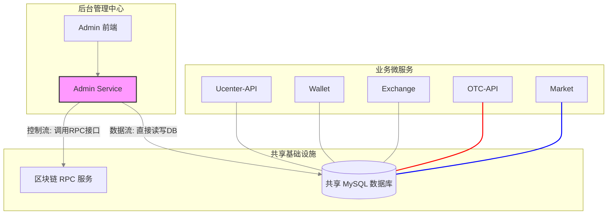
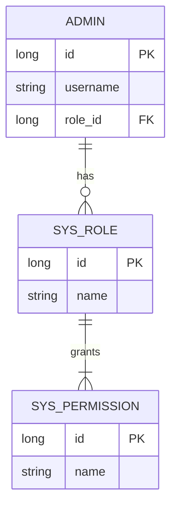
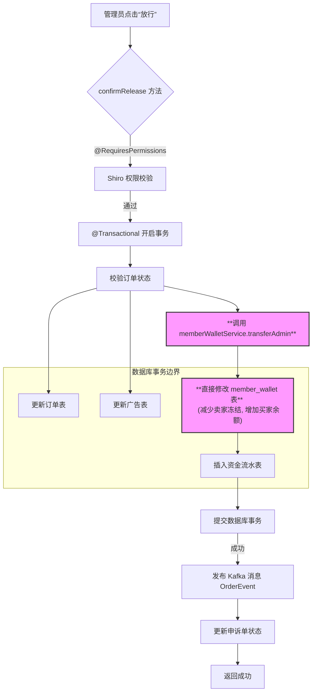

# 第 16 章：微服务架构中的“上帝模块”——admin 服务的集权设计与安全命脉

## 1. 引言：一个“逆行”于微服务体系的特殊存在

在之前的章节中，我们已经习惯了由多个边界清晰、各司其职的微服务（如用户中心、钱包、撮合引擎）通过 API 和消息队列协同工作的优雅模式。然而，本章的主角——`admin` 模块，却是一个特立独行的存在，一个在微服务体系中“逆行”的设计。

如果仅仅将其理解为一个简单的“后台管理系统”，我们将错失其背后深刻的架构权衡。通过深入其 `pom.xml` 依赖和核心源码，`admin` 模块的真实身份浮出水面：**一个直连共享数据库、拥有最高权限、近乎“单体式”的后台服务。**

它并非像 `exchange-api` 那样，通过 Feign 客户端去“请求”`wallet` 或 `ucenter-api` 提供服务；恰恰相反，它直接连接到与这些服务共享的同一个 MySQL 数据库，对用户、资产、订单等所有核心数据进行直接的、无限制的读写操作。我们称这种架构模式为**“共享数据库”**，它是一把锋利的双刃剑。

一方面，它带来了**极高的开发效率和强大的事务一致性**。想象一个紧急的 OTC 交易仲裁场景，管理员需要同时修改订单状态、划转买卖双方的冻结资金、并记录操作日志。如果通过标准的微服务调用，这将演变为一个复杂的分布式事务问题。而 `admin` 模块则可以简单地通过一个本地数据库事务，原子性地完成所有跨表操作，干净利落。

但另一方面，它也带来了**致命的风险**：**高耦合度**与**服务边界的破坏**。`admin` 模块与所有核心服务的数据库表结构紧密耦合，任何服务的表结构变更，都可能直接导致 `admin` 模块崩溃，这违背了微服务“独立演进”的核心思想。更危险的是，`wallet` 服务精心设计的余额校验、防超发等业务逻辑，可以被 `admin` 模块完全绕过。它拥有“上帝视角”，可以直接修改任何数据，这对系统的稳定性和安全性构成了巨大挑战。

那么，系统是如何驾驭这个拥有“上帝权限”的模块的呢？本章，我们将从两大核心视角对其进行深度剖析：

1.  **安全命脉**：如此高的权限，系统是如何通过 **Apache Shiro** 框架，并结合**授权缓存**，构建一个既灵活又高效的 RBAC（基于角色的访问控制）模型的？
2.  **权力行使**：以 **OTC 订单仲裁**这个典型的高风险场景为例，深入分析 `admin` 模块是如何在**本地事务**的保护下，直接与数据库交互，完成复杂业务操作，并通过**异步事件**与下游系统解耦的。

## 2. 架构透视：一张图看懂 admin 的“特殊地位”

`admin` 模块的架构秘密，首先就隐藏在它的 `pom.xml` 依赖中。通过分析，我们确认了它直连数据库、共享核心模块，并且**没有 `spring-cloud-starter-openfeign` 依赖**，这从根本上否定了它作为“聚合服务”通过 API 调用其他服务的可能性。

下图清晰地展示了 `admin` 模块作为“总指挥官”，与其他微服务的交互模式：



如图所示，`admin` 服务处于一个非常特殊的位置：

- **数据层面（蓝色实线）**：它像一只“巨手”，跨越了所有微服务的边界，直接与共享数据库进行交互，拥有对所有核心数据的最高读写权限。
- **控制层面（红色实线）**：当需要与区块链进行交互时（如资金归集），它又会像一个标准的 API 消费者一样，去调用 `RPC` 服务的接口来完成链上操作。

这种“数据层集权、控制层部分微服务化”的设计虽然“不纯粹”，但在许多真实世界的复杂项目中，却是为了应对复杂后台管理需求而做出的一种务实选择。

## 3. 权限控制核心：Apache Shiro 与授权缓存

对于一个拥有直接数据库操作权限的后台系统，权限控制是其绝对的生命线。本项目选择了成熟、稳定且功能强大的 **Apache Shiro** 框架来构建其安全体系。

### 3.1 RBAC 模型：用户、角色与权限的三权分立

在深入 Shiro 的代码实现之前，我们必须先理解其背后的权限设计思想——**RBAC（基于角色的访问控制）**。RBAC 的核心在于，**不直接给用户分配权限，而是在用户和权限之间引入一个“角色”层**。

| 实体                     | 描述                                                 | 数据库关系                                   |
| :----------------------- | :--------------------------------------------------- | :------------------------------------------- |
| **用户 (Admin)**         | 后台系统的操作员，如“张三”、“李四”。                 | 一个用户**有且仅有**一个角色 (Many-to-One)。 |
| **角色 (SysRole)**       | 职责的集合，如“客服专员”、“财务经理”。               | 一个角色可以拥有**多个**权限 (One-to-Many)。 |
| **权限 (SysPermission)** | 对某个资源的具体操作，如 `otc:appeal:release-coin`。 | 权限是原子化的操作单元。                     |

这种设计的巨大优势在于**解耦**。当需要调整权限时，我们只需修改角色的权限配置，所有属于该角色的用户的权限就会自动更新，而无需逐个修改用户。



这个清晰的三层模型，是 `AdminRealm` 中授权逻辑的实现基础。

### 3.2 Shiro 整合配置与授权缓存 (`ShiroConfig.java`)

`ShiroConfig.java` 是 Shiro 与 Spring Boot 整合的入口，它不仅定义了 Shiro 的核心组件，更通过一个关键配置，极大地优化了权限系统的性能。

```java
// com.bizzan.bitrade.config.ShiroConfig
@Configuration
public class ShiroConfig {

    @Bean(name="shiroFilter")
    public ShiroFilterFactoryBean shirFilter(SecurityManager securityManager) {
        ShiroFilterFactoryBean shiroFilterFactoryBean = new ShiroFilterFactoryBean();
        shiroFilterFactoryBean.setSecurityManager(securityManager);

        // 核心：定义URL拦截规则
        Map<String, String> filterChainDefinitionMap = new LinkedHashMap<>();
        filterChainDefinitionMap.put("/captcha", "anon"); // 验证码接口，匿名访问
        filterChainDefinitionMap.put("/admin/code/**", "anon");
        filterChainDefinitionMap.put("admin/**/page-query", "user"); // 分页查询，记住我或已登录即可
        filterChainDefinitionMap.put("/admin/employee/logout", "logout"); // 登出
        filterChainDefinitionMap.put("admin/**/detail", "authc"); // 详情接口，必须登录

        shiroFilterFactoryBean.setUnauthorizedUrl("/403");
        shiroFilterFactoryBean.setFilterChainDefinitionMap(filterChainDefinitionMap);

        return shiroFilterFactoryBean;
    }

    /**
     * shiro缓存管理器，核心亮点！
     * @return
     */
    @Bean(name="ehCacheManager")
    @DependsOn("lifecycleBeanPostProcessor")
    public EhCacheManager ehCacheManager() {
        EhCacheManager cacheManager = new EhCacheManager();
        // 指定EhCache的配置文件路径
        cacheManager.setCacheManagerConfigFile("classpath:ehcache-shiro.xml");
        return cacheManager;
    }

    @Bean(name="adminRealm")
    @DependsOn("lifecycleBeanPostProcessor")
    public AdminRealm adminRealm(EhCacheManager ehCacheManager) {
        AdminRealm adminRealm = new AdminRealm();
        // 将缓存管理器注入到Realm中
        adminRealm.setCacheManager(ehCacheManager);
        return adminRealm;
    }

    @Bean(name = "securityManager")
    public DefaultWebSecurityManager getDefaultWebSecurityManager(AdminRealm realm, EhCacheManager ehCacheManager) {
        DefaultWebSecurityManager securityManager = new DefaultWebSecurityManager();
        securityManager.setRealm(realm);
        // 将缓存管理器注入到SecurityManager中
        securityManager.setCacheManager(ehCacheManager);
        return securityManager;
    }
}
```

**核心解读**：
这段配置的精髓在于 `ehCacheManager` 的引入。当 Shiro 的 `AdminRealm` 在执行授权操作（即 `doGetAuthorizationInfo` 方法）时，它会从数据库中查询用户的角色和权限。如果没有缓存，每次用户访问受保護的接口，都会触发一次数据库查询，在高并发下这将成为性能瓶颈。

通过注入 `EhCacheManager`，Shiro 会自动将 `doGetAuthorizationInfo` 方法返回的 `AuthorizationInfo` 对象缓存起来。在缓存有效期内，后续的所有权限检查都会直接命中缓存，**无需再次访问数据库**，性能得到指数级提升。这是一个在权限管理设计中至关重要的最佳实践。

### 3.2 认证与授权的枢纽 (`AdminRealm.java`)

`Realm` 是 Shiro 连接应用数据与安全框架的“数据桥”。当需要验证用户身份（认证）或检查用户权限（授权）时，Shiro 都会委托给 `AdminRealm` 来执行。

#### 认证流程 (`doGetAuthenticationInfo`)

用户登录时，此方法被调用。它的逻辑非常清晰：接收 `UsernamePasswordToken`，委托 `AdminService` 去数据库验证用户名和密码，如果验证成功，则将查询到的 `Admin` 对象存入 Shiro 的 Session 中，以便后续使用。

#### 授权流程 (`doGetAuthorizationInfo`)

当用户访问一个被 `@RequiresPermissions` 注解保护的方法时，此方法被调用。

```java
// com.bizzan.bitrade.core.AdminRealm
@Override
protected AuthorizationInfo doGetAuthorizationInfo(PrincipalCollection principals) {
    List<String> permissionList = new ArrayList<>();
    // 1. 从Session中获取当前登录的Admin对象
    Admin admin = (Admin) getSession(SysConstant.SESSION_ADMIN);
    if (null == admin) {
        throw new AuthorizationException();
    }
    try {
        List<SysPermission> list;
        // 2. 特殊处理：root用户拥有所有权限
        if ("root".equalsIgnoreCase(admin.getUsername())) {
            list = sysPermissionService.findAll();
        } else {
            // 3. 普通管理员：根据roleId查询角色，再懒加载获取角色拥有的权限列表
            SysRole sysRole = sysRoleService.findOne(admin.getRoleId());
            list = sysRole.getPermissions();
        }

        // 4. 提取权限标识符 (e.g., "otc:appeal:cancel-order")
        list.forEach(x -> {
            if (!StringUtils.isEmpty(x.getName())) {
                permissionList.add(x.getName());
            }
        });
    } catch (Exception e) {
        throw new AuthorizationException();
    }

    // 5. 构建授权信息并返回给Shiro
    SimpleAuthorizationInfo simpleAuthorInfo = new SimpleAuthorizationInfo();
    simpleAuthorInfo.addStringPermissions(permissionList);

    // 返回的这个对象，将会被EhCache缓存起来！
    return simpleAuthorInfo;
}
```

正是这个方法的返回值，成为了 Shiro 授权缓存的核心。一旦缓存生效，即使用户频繁操作，这段涉及多次数据库查询的授权逻辑也只会在第一次或缓存过期后执行一次。

## 4. 核心业务场景：三大典型“上帝”操作

如果说 Shiro 是 `admin` 模块的“安全缰绳”，那么它所执行的业务操作，就是其“上帝权限”最淋漓尽致的体现。我们选取三个最具代表性的场景，来深入理解 `admin` 模块是如何作为**业务流程的编排者**和**系统风险的最终防线**来工作的。

### 4.1 场景一：OTC 订单仲裁 - 风险处置的最终防线

这是一个高风险、高权限、业务逻辑极其复杂的操作。我们以风险最高的**强制放行** (`release-coin`) 为例，深入分析其源码，看 `admin` 模块是如何在多重保护下，行使其权力的。

```java
// com.bizzan.bitrade.controller.otc.AdminAppealController

@RequiresPermissions("otc:appeal:release-coin") // 第一重保护：Shiro权限注解
@RequestMapping(value = "release-coin")
@Transactional(rollbackFor = Exception.class) // 第二重保护：数据库本地事务
public MessageResult confirmRelease(long appealId, String orderSn, @RequestParam(value = "banned", defaultValue = "false") boolean banned) throws Exception {
    // 1. 查找申诉单、订单等核心数据实体
    Appeal appeal = appealService.findOne(appealId);
    Assert.notNull(appeal, "申诉单不存在");
    Order order = orderService.findOneByOrderSn(orderSn);
    notNull(order, msService.getMessage("ORDER_NOT_EXISTS"));

    // 2. 严格的状态检查，防止非法操作
    isTrue(order.getStatus().equals(OrderStatus.PAID) || order.getStatus().equals(OrderStatus.APPEAL), msService.getMessage("ORDER_STATUS_EXPIRED"));

    // 3. 判断买卖双方角色
    int ret = getRet(order, appeal.getInitiatorId(), appeal.getAssociateId());

    // 4. 核心操作一：更新订单状态为 COMPLETED
    if (!(orderService.releaseOrder(order.getOrderSn()) > 0)) {
        throw new InformationExpiredException("Information Expired");
    }

    // 5. 核心操作二：“上帝之手”，直接操作买卖双方的钱包，进行资产划转！
    memberWalletService.transferAdmin(order, ret);

    // 6. 核心操作三：为双方生成资金交易记录 (MemberTransaction)
    if (ret == 1) {
        generateMemberTransaction(order, TransactionType.OTC_SELL, appeal.getAssociateId(), BigDecimal.ZERO);
        generateMemberTransaction(order, TransactionType.OTC_BUY, appeal.getInitiatorId(), order.getCommission());
    } else if (ret == 2) {
        generateMemberTransaction(order, TransactionType.OTC_SELL, appeal.getAssociateId(), order.getCommission());
        generateMemberTransaction(order, TransactionType.OTC_BUY, appeal.getInitiatorId(), BigDecimal.ZERO);
    } else if (ret == 3) {
        generateMemberTransaction(order, TransactionType.OTC_BUY, appeal.getAssociateId(), BigDecimal.ZERO);
        generateMemberTransaction(order, TransactionType.OTC_SELL, appeal.getInitiatorId(), order.getCommission());
    } else {
        generateMemberTransaction(order, TransactionType.OTC_BUY, appeal.getAssociateId(), order.getCommission());
        generateMemberTransaction(order, TransactionType.OTC_SELL, appeal.getInitiatorId(), BigDecimal.ZERO);
    }

    // 7. 核心数据库事务成功提交后，发布异步事件
    orderEvent.onOrderCompleted(order);

    // 8. 更新申诉单状态为“已处理”
    appeal.setDealWithTime(DateUtil.getCurrentDate());
    appeal.setIsSuccess(BooleanEnum.IS_TRUE);
    appeal.setStatus(AppealStatus.PROCESSED);
    appealService.save(appeal);

    return MessageResult.success(msService.getMessage("SUCCESS"));
}
```

**流程拆解与深度解读**：



这个流程完美地展示了 `admin` 模块的设计哲学：

- **安全为先**：操作的入口由 Shiro 的 `@RequiresPermissions` 注解牢牢把关，确保只有具备相应权限的管理员才能触发。
- **事务即生命**：所有对数据库核心数据的修改，都被 `@Transactional` 注解包裹在一个原子操作中。对订单、广告、钱包、流水的修改，要么全部成功，要么在任何一步失败时全部回滚，这是防止出现“坏账”的生命线。
- **事件补偿**：在核心的数据库事务成功提交后，`admin` 模块通过 `orderEvent.onOrderCompleted(order)` 发送一个 Kafka 事件。这是一种**“事务后补偿”**模式，它优雅地通知了其他可能关心“订单完成”事件的下游微服务（如发送通知、更新统计数据等），在保证核心数据强一致性的前提下，实现了与外部系统的最终一致性。

### 4.2 场景二：新币种上架 - 业务流程的编排者

新币种上架是一个典型的**多服务协作**流程，`admin` 模块在此扮演了“总指挥”的角色。

```java
// com.bizzan.bitrade.controller.coin.CoinController

@RequiresPermissions("coin:create")
@RequestMapping("create")
public MessageResult create(Coin coin) {
    // 1. 在 coin 表中插入新币种的基础信息 (名称, 单位, 费率等)
    Coin find = coinService.findOne(coin.getName());
    Assert.isNull(find, "币种已存在");
    coinService.save(coin);

    // 2. 发布一个 Kafka 消息，通知 wallet 模块
    kafkaTemplate.send("create-member-wallet", coin.getName(), JSON.toJSONString(coin));

    return MessageResult.success();
}
```

**流程解读**：

1.  **数据持久化**：管理员在前端填写币种信息，`admin` 服务首先将其保存到 `coin` 表中。
2.  **异步通知**：`admin` 服务并不直接调用 `wallet` 服务，而是发送一条 `create-member-wallet` 消息到 Kafka。
3.  **下游处理**：`wallet` 模块中的 `CoinConsumer` 监听到此消息后，会执行一个**重量级操作**：遍历 `member` 表中的所有用户，为每一个用户在 `member_wallet` 表中创建这个新币种的钱包记录。

这个流程清晰地展示了 `admin` 作为**流程编排者**的智慧：它只负责发起和记录，而将耗时且重要的下游任务，通过消息队列异步地交给了权责明确的 `wallet` 服务去处理，实现了完美的解耦。

### 4.3 场景三：资金归集 - 核心安全生命线

资金归集，即将热钱包中的大额资金转移到更安全的冷钱包，是交易所的**核心安全操作**。这个操作最终需要与真实的区块链网络交互。

```java
// com.bizzan.bitrade.controller.coin.CoinController

@RequiresPermissions("coin:transfer")
@RequestMapping("transfer")
public MessageResult transfer(String unit, String address, BigDecimal amount, BigDecimal fee) {
    // ... 省略参数校验 ...

    // 1. 构建调用 RPC 服务的 URL
    String serviceName = "SERVICE-RPC-" + unit;
    String url = "http://" + serviceName + "/rpc/transfer?address={1}&amount={2}&fee={3}";

    // 2. 通过 RestTemplate 发起远程调用
    MessageResult result = restTemplate.getForObject(url, MessageResult.class, address, amount, fee);

    // 3. 在 hot_transfer_record 表中记录本次归集操作，用于审计
    HotTransferRecord record = new HotTransferRecord();
    // ... 设置 record 属性 ...
    hotTransferRecordService.save(record);

    return result;
}
```

**流程解读**：

1.  **权限把关**：操作由 `@RequiresPermissions("coin:transfer")` 严密守护。
2.  **远程过程调用 (RPC)**：`admin` 模块通过 `RestTemplate`，向专门负责与区块链交互的 `02_bizzan_wallet_rpc` 项目中的某个具体币种的 RPC 服务（如 `SERVICE-RPC-BTC`）发起 HTTP 请求。
3.  **链上交易**：RPC 服务接收到请求后，会构建、签名并广播一笔真实的链上交易，将资金从热钱包地址转出。
4.  **操作审计**：无论链上操作成功与否，`admin` 模块都会在本地数据库记录下这次操作，便于后续的财务审计和追踪。

这个场景完美地诠释了 `admin` 模块是如何与微服务体系中的**“远端执行单元”（RPC 服务）**进行协作，共同完成最核心、最敏感的资金安全操作的。

## 5. 本章总结

通过对 `admin` 模块的源码级剖析，我们得到了一个与表面认知截然不同的结论：

1.  **架构定位**：`admin` 模块并非微服务架构中的“标准范例”，它是一个典型的、采用“共享数据库”模式的**集权式单体后台**。这种设计在特定场景下（如复杂的后台仲裁）极大地提高了开发效率和数据一致性保障，但也以牺牲服务的独立性和封装性为代价，带来了高耦合的长期维护风险。

2.  **权限体系**：系统采用 **Apache Shiro** 构建了一套成熟、灵活的 **RBAC 权限模型**。更进一步，通过巧妙地配置 **EhCache 授权缓存**，在保证安全的同时，极大地提升了权限系统的性能，这是一个非常值得学习的工程实践。

3.  **业务实现**：`admin` 模块是**业务流程的编排者**和**风险控制的最后防线**。它通过**数据库本地事务**来保障复杂业务操作的原子性（如 OTC 仲裁），通过**异步消息**来与下游服务解耦（如新币上架），并通过**RPC 调用**来执行核心的链上操作（如资金归集）。

在真实的商业项目中，这种“不完美”但实用的架构并不少见。理解 `admin` 模块的设计哲学、实现细节及其背后的利弊权衡，对于我们全面、客观地掌握整个交易所系统的运作模式，具有至关重要的意义。
