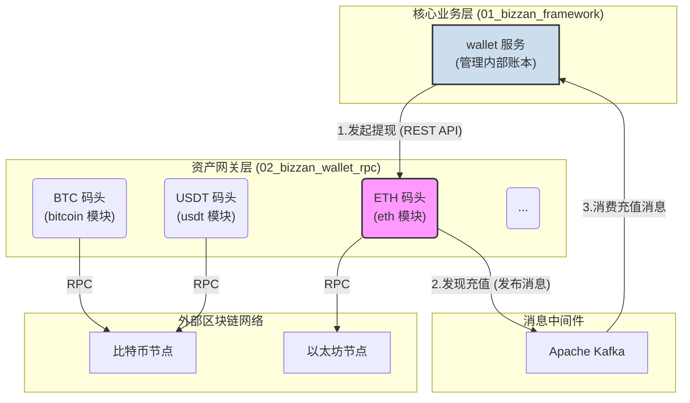
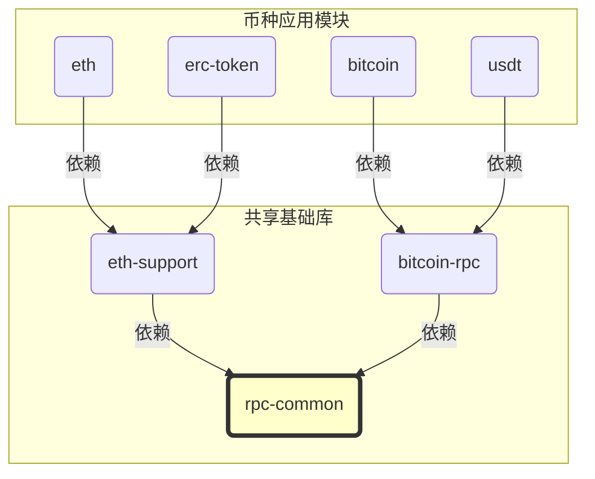
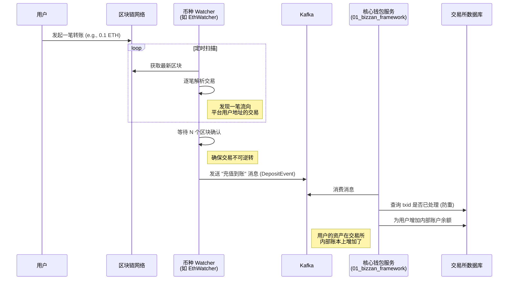

# 架构篇：解构 Web3 资产网关 `02_bizzan_wallet_rpc`

## 引言：为“交易孤岛”建立标准化的“世界港口”

在我们已经构建的 `01_bizzan_framework` 这座功能强大的“中心化交易孤岛”上，用户的资产可以在内部高效流转。然而，它与广袤的 Web3 世界大陆之间，仍然缺少一座至关重要的桥梁——一个能够处理不同区块链资产（BTC, ETH, USDT 等）流入流出的“世界港口”。

直接在核心业务服务（如 `wallet` 模块）中对接形态各异的区块链，将会是一场灾难。每条公链都有其独特的 RPC 接口、交易结构和监听方式，这会使核心业务代码变得臃肿、混乱且难以维护。

为此，一个优雅的解决方案应运而生：将所有与区块链的直接交互剥离出来，构建一个独立的、专职的、可无限扩展的资产网关——`02_bizzan_wallet_rpc` 项目。这个项目扮演的角色，就是我们交易所的“**港口管理总局**”，它下辖多个“**专用码头**”（针对不同币种的微服务），为所有进出交易所的 Web3 资产提供标准化的“报关”和“清关”服务。

本章，我们将深入 `02_bizzan_wallet_rpc` 的项目源码，从宏观的架构视角，彻底理解其设计哲学、模块划分以及核心工作流程，为后续深入特定币种的开发打下坚实的基础。

---

## 核心架构：隔离与协作的艺术

`02_bizzan_wallet_rpc` 的核心设计思想是**关注点分离**。它将易变的、与外部区块链相关的逻辑，同稳定、纯粹的内部核心业务逻辑（`01_bizzan_framework`）彻底隔离开。

这种隔离通过清晰的微服务边界和标准化的通信协议（REST API & Kafka）来实现。

从上图可见，`wallet` 服务不再关心如何与以太坊节点对话，它只需通过 REST API 向 `eth` 模块下达“提现”指令，并通过消费 Kafka 消息来接收“充值已到账”的通知。所有与区块链交互的复杂性都被优雅地封装在了 `02_bizzan_wallet_rpc` 内部。

---

## 模块化设计：“一币一服务”与共享基础库

深入 `02_bizzan_wallet_rpc` 内部，我们会发现其设计的另一大亮点：高度模块化。

### “一币一服务”的哲学

项目为每一种需要对接的加密货币或协议都创建了一个独立的 Spring Boot 微服务模块。例如：

*   `bitcoin` 模块：负责处理 BTC。
*   `ltc` 模块：负责处理 LTC。
*   `eth` 模块：负责处理 ETH。
*   `usdt` 模块：负责处理基于 Omni 协议的 USDT。
*   `erc-token` 模块：负责处理基于以太坊的 ERC20 代币。

这种设计的优势是显而易见的：
*   **高度隔离**：任何一个币种的节点升级、API 变更或服务故障，都不会影响到其他币种的正常运行。
*   **独立扩展**：如果某个币种（如 ETH）的交易量巨大，可以单独对 `eth` 模块进行水平扩展，增加更多实例来提升处理能力。
*   **易于维护**：每个模块的代码库都相对较小，职责单一，便于开发者快速定位问题和进行功能迭代。

### 共享基础库：提炼“标准作业流程”

为了避免在每个币种模块中重复编写相同的代码，项目巧妙地将通用逻辑下沉到了几个共享的基础库中。

*   **`rpc-common` (通用组件库)**：这是所有模块的基石，提供了最核心的抽象。
    *   **`Watcher` 抽象类**：定义了所有币种充值监控器的标准工作模式。它内置了“断点续扫”的核心逻辑，通过定时从数据库读取上次扫描的区块高度，扫描一批新区块，处理完后再将最新高度写回数据库。这确保了服务的健壮性，即使服务宕机重启，也能从上次中断的地方继续工作，不重不漏。
    *   **`DepositEvent` 事件**：定义了标准的充值事件模型，当 `Watcher` 发现一笔有效充值后，会通过这个事件发送 Kafka 消息，实现了与上游业务的解耦。
    *   **通用实体类**：如 `Account`, `Coin`, `Deposit` 等，统一了数据模型。

*   **`eth-support` (以太坊支持库)**：专为以太坊及其代币（ERC20）提供的工具包。它封装了 `web3j` 库，提供了创建钱包、查询余额、发送交易、解析合约等可重用的 `EthService`。`eth` 和 `erc-token` 模块都依赖它来完成实际工作。

*   **`bitcoin-rpc` (比特币 RPC 库)**：这是一个更底层的库，封装了与比特币兼容节点（包括 Omni Core）进行 JSON-RPC 通信的客户端。所有基于 UTXO 模型的币种模块（如 `bitcoin`, `usdt`, `ltc`）都依赖它来与节点交互。

---

## 核心工作流：一笔“充值”的诞生之旅

让我们通过一个典型的充值流程，来串联起整个架构的协作脉络。

这个流程清晰地展示了资产从链上到链下的完整路径。提现流程则是一个逆向的过程：`Wallet` 服务接收到用户提现请求，通过 REST API 调用相应的 RPC 模块，RPC 模块签名并广播交易，完成链上资产的转移。

---

## 总结

通过对 `02_bizzan_wallet_rpc` 项目的架构解构，我们发现它并非一个单一的程序，而是一个设计精良、职责清晰、可独立部署和扩展的**分布式资产网关集群**。

*   **“一币一服务”** 的设计哲学保证了系统的**高内聚、低耦合**。
*   **共享基础库** (`rpc-common`, `eth-support`) 沉淀了通用能力，实现了**代码的高度复用**。
*   **`Watcher` 断点续扫模式**确保了充值监控的**健壮性和可靠性**。
*   通过 **REST API 和 Kafka** 与核心业务层交互，实现了**完美的隔离与解耦**。

理解了这套宏观架构，我们就有了一张清晰的地图。在下一章，我们将拿起放大镜，聚焦于地图上最重要的一隅——`eth` 模块，深入其内部，并亲手在测试网上进行一次完整的实战演练。