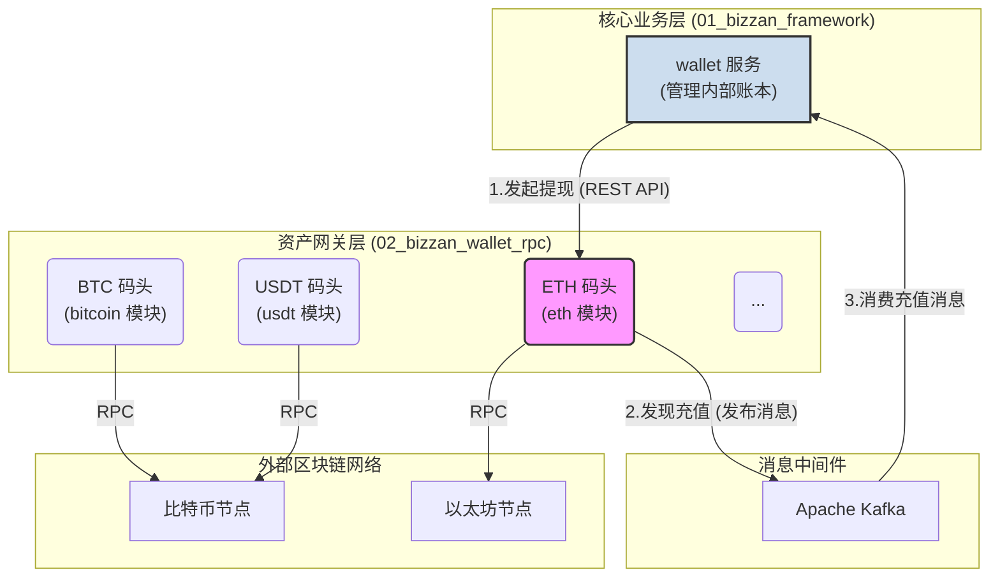
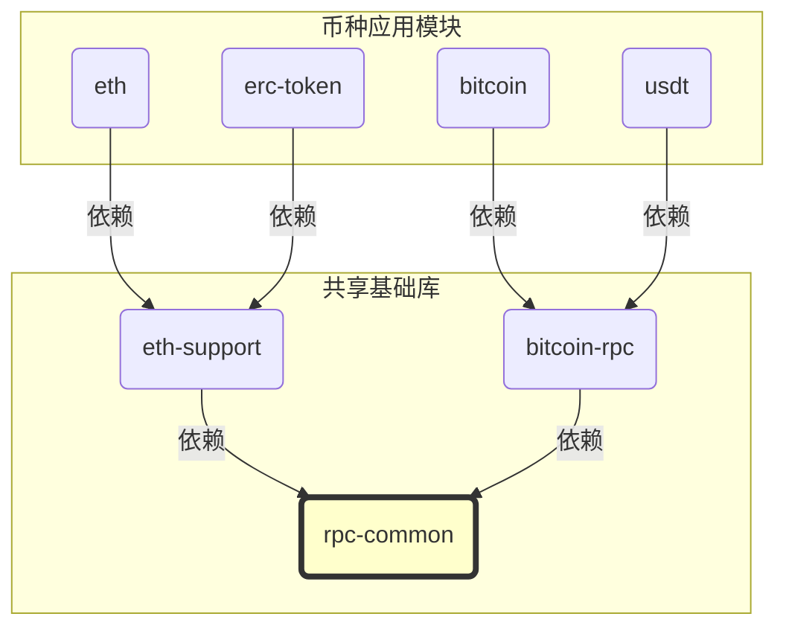
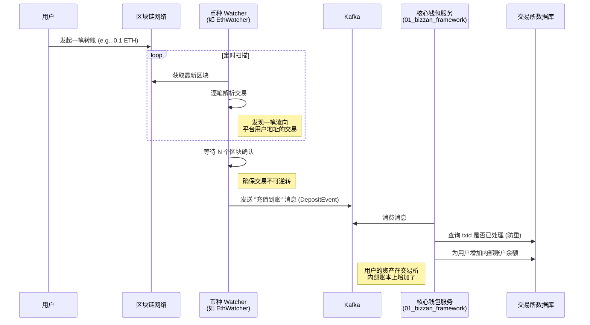

# Web3资产网关架构：连接中心化交易与去中心化世界的标准化桥梁

## 引言：构建Web3世界的标准化港口

在数字资产交易所的完整生态系统中，我们已经构建了一个功能强大的中心化交易平台，用户资产可以在内部高效流转。然而，这个"交易孤岛"与广袤的去中心化Web3世界之间，亟需一座标准化的桥梁——一个能够处理多种区块链资产流入流出的"世界港口"。

**架构挑战的复杂性**

直接在核心业务服务中对接形态各异的区块链网络将面临巨大的技术挑战：

1. **接口差异巨大**：每条公链都有独特的RPC接口、交易结构和数据格式
2. **技术栈混杂**：比特币使用JSON-RPC，以太坊使用Web3.js，USDT涉及OMNI和ERC20等不同协议
3. **维护成本高昂**：区块链网络升级、协议变更都会直接影响核心业务代码
4. **安全风险集中**：区块链交互的安全风险会污染核心业务系统

**资产网关的设计理念**

`02_bizzan_wallet_rpc`项目正是为了解决这些挑战而设计的专业化解决方案。它承担着交易所"**港口管理总局**"的职责，通过标准化的架构设计，为所有进出交易所的Web3资产提供统一的"报关"和"清关"服务。

**港口模式的业务价值**

这种架构设计体现了现代软件工程的核心原则：

1. **关注点分离**：将易变的区块链交互逻辑与稳定的内部业务逻辑完全隔离
2. **专业化分工**：每个币种服务专注于特定区块链的技术细节
3. **标准化接口**：为内部业务系统提供统一的资产操作API
4. **可扩展性**：新增区块链支持时无需修改核心业务代码

**技术架构的深层考量**

资产网关的架构设计源于对区块链技术特性的深刻理解：

1. **异步性要求**：区块链交易确认需要时间，必须采用异步处理模式
2. **状态一致性**：链上状态与内部账本状态需要保持同步
3. **容错性设计**：网络分区、节点故障等异常情况需要优雅处理
4. **监控与审计**：所有资产流动都需要完整的追踪和记录

**微服务化的技术优势**

通过微服务架构，资产网关实现了：

- **独立部署**：每个币种服务可以独立升级和维护
- **水平扩展**：根据不同币种的交易量进行弹性扩容
- **故障隔离**：某个币种服务故障不会影响其他币种的正常运作
- **技术栈灵活**：可以为不同区块链选择最适合的技术方案

**本章探索的深度价值**

通过深入分析`02_bizzan_wallet_rpc`的架构设计，我们将：

1. **理解分层架构**：学习如何构建高效的区块链接入层
2. **掌握微服务设计**：分析专业化服务的模块划分原则
3. **探索异步协调**：研究跨服务的事件驱动协作机制
4. **学习标准化实践**：了解如何为复杂的外部系统提供统一接口

这些架构设计原则不仅适用于数字资产交易，还可以推广到其他需要与多种外部系统集成的企业级应用中。通过对资产网关的深入剖析，我们将掌握构建可扩展、可维护的企业级系统集成架构的核心技术。

---

## 核心架构：隔离与协作的艺术

`02_bizzan_wallet_rpc`的核心设计思想体现了现代软件架构的精髓——**关注点分离**。它通过精妙的架构设计，将易变的、与外部区块链相关的复杂性，同稳定、纯粹的内部核心业务逻辑彻底隔离，同时保持两者之间高效的协作机制。

**分层架构的设计原则**

这种分离不是简单的功能拆分，而是基于深刻的架构理解：

1. **边界清晰化**：每个服务都有明确的职责边界，避免职责交叉和混乱
2. **接口标准化**：通过统一的API规范，降低服务间的耦合度
3. **通信异步化**：采用事件驱动模式，提升系统的响应能力和可靠性
4. **故障隔离化**：单个服务的故障不会影响整个系统的稳定性

**微服务协作的技术实现**

资产网关通过多种技术手段实现了与核心业务系统的高效协作：

```mermaid
graph TD
    subgraph "核心业务层 (01_bizzan_framework)"
        WalletService["wallet 服务<br/>(管理内部账本)"]
    end

    subgraph "资产网关层 (02_bizzan_wallet_rpc)"
        direction LR
        BTC_RPC("BTC 码头<br/>(bitcoin 模块)")
        ETH_RPC("ETH 码头<br/>(eth 模块)")
        USDT_RPC("USDT 码头<br/>(usdt 模块)")
        More_RPC("...")
    end

    subgraph "消息中间件"
        KAFKA[Apache Kafka]
    end
    
    subgraph "外部区块链网络"
        direction LR
        BTC_Node[比特币节点]
        ETH_Node[以太坊节点]
    end

    WalletService -- "1.发起提现 (REST API)" --> ETH_RPC
    ETH_RPC -- "2.发现充值 (发布消息)" --> KAFKA
    KAFKA -- "3.消费充值消息" --> WalletService
    
    BTC_RPC -- "RPC" --> BTC_Node
    ETH_RPC -- "RPC" --> ETH_Node
    USDT_RPC -- "RPC" --> BTC_Node

    style WalletService fill:#cde,stroke:#333,stroke-width:2px
    style ETH_RPC fill:#f9f,stroke:#333,stroke-width:2px
```

从上图可见，`wallet` 服务不再关心如何与以太坊节点对话，它只需通过 REST API 向 `eth` 模块下达“提现”指令，并通过消费 Kafka 消息来接收“充值已到账”的通知。所有与区块链交互的复杂性都被优雅地封装在了 `02_bizzan_wallet_rpc` 内部。

---

## 模块化设计：“一币一服务”与共享基础库

深入 `02_bizzan_wallet_rpc` 内部，我们会发现其设计的另一大亮点：高度模块化。

### “一币一服务”的哲学

项目为每一种需要对接的加密货币或协议都创建了一个独立的 Spring Boot 微服务模块。例如：

*   `bitcoin` 模块：负责处理 BTC。
*   `ltc` 模块：负责处理 LTC。
*   `eth` 模块：负责处理 ETH。
*   `usdt` 模块：负责处理基于 Omni 协议的 USDT。
*   `erc-token` 模块：负责处理基于以太坊的 ERC20 代币。

这种设计的优势是显而易见的：
*   **高度隔离**：任何一个币种的节点升级、API 变更或服务故障，都不会影响到其他币种的正常运行。
*   **独立扩展**：如果某个币种（如 ETH）的交易量巨大，可以单独对 `eth` 模块进行水平扩展，增加更多实例来提升处理能力。
*   **易于维护**：每个模块的代码库都相对较小，职责单一，便于开发者快速定位问题和进行功能迭代。

### 共享基础库：提炼“标准作业流程”

为了避免在每个币种模块中重复编写相同的代码，项目巧妙地将通用逻辑下沉到了几个共享的基础库中。

```mermaid
graph TD
    subgraph "币种应用模块"
        direction LR
        M_ETH(eth)
        M_BTC(bitcoin)
        M_USDT(usdt)
        M_ERC20(erc-token)
    end

    subgraph "共享基础库"
        L_COMMON(rpc-common)
        L_ETHSUP(eth-support)
        L_BTCRPC(bitcoin-rpc)
    end

    M_ETH -- "依赖" --> L_ETHSUP
    M_ERC20 -- "依赖" --> L_ETHSUP
    L_ETHSUP -- "依赖" --> L_COMMON

    M_BTC -- "依赖" --> L_BTCRPC
    M_USDT -- "依赖" --> L_BTCRPC
    L_BTCRPC -- "依赖" --> L_COMMON
    
    style L_COMMON fill:#ffc,stroke:#333,stroke-width:4px
```

*   **`rpc-common` (通用组件库)**：这是所有模块的基石，提供了最核心的抽象。
    *   **`Watcher` 抽象类**：定义了所有币种充值监控器的标准工作模式。它内置了“断点续扫”的核心逻辑，通过定时从数据库读取上次扫描的区块高度，扫描一批新区块，处理完后再将最新高度写回数据库。这确保了服务的健壮性，即使服务宕机重启，也能从上次中断的地方继续工作，不重不漏。
    *   **`DepositEvent` 事件**：定义了标准的充值事件模型，当 `Watcher` 发现一笔有效充值后，会通过这个事件发送 Kafka 消息，实现了与上游业务的解耦。
    *   **通用实体类**：如 `Account`, `Coin`, `Deposit` 等，统一了数据模型。

*   **`eth-support` (以太坊支持库)**：专为以太坊及其代币（ERC20）提供的工具包。它封装了 `web3j` 库，提供了创建钱包、查询余额、发送交易、解析合约等可重用的 `EthService`。`eth` 和 `erc-token` 模块都依赖它来完成实际工作。

*   **`bitcoin-rpc` (比特币 RPC 库)**：这是一个更底层的库，封装了与比特币兼容节点（包括 Omni Core）进行 JSON-RPC 通信的客户端。所有基于 UTXO 模型的币种模块（如 `bitcoin`, `usdt`, `ltc`）都依赖它来与节点交互。

---

## 核心工作流：一笔“充值”的诞生之旅

让我们通过一个典型的充值流程，来串联起整个架构的协作脉络。

```mermaid
sequenceDiagram
    participant User as 用户
    participant Chain as 区块链网络
    participant Watcher as 币种 Watcher<br/>(如 EthWatcher)
    participant Kafka as Kafka
    participant Wallet as 核心钱包服务<br/>(01_bizzan_framework)
    participant DB as 交易所数据库

    User->>Chain: 发起一笔转账 (e.g., 0.1 ETH)
    
    loop 定时扫描
        Watcher->>Chain: 获取最新区块
        Watcher->>Watcher: 逐笔解析交易
        Note right of Watcher: 发现一笔流向<br/>平台用户地址的交易
    end

    Watcher->>Watcher: 等待 N 个区块确认
    Note right of Watcher: 确保交易不可逆转
    
    Watcher->>Kafka: 发送 "充值到账" 消息 (DepositEvent)
    
    Wallet->>Kafka: 消费消息
    Wallet->>DB: 查询 txid 是否已处理 (防重)
    Wallet->>DB: 为用户增加内部账户余额
    Note left of Wallet: 用户的资产在交易所<br/>内部账本上增加了
```

这个流程清晰地展示了资产从链上到链下的完整路径。提现流程则是一个逆向的过程：`Wallet` 服务接收到用户提现请求，通过 REST API 调用相应的 RPC 模块，RPC 模块签名并广播交易，完成链上资产的转移。

---

## 总结

通过对 `02_bizzan_wallet_rpc` 项目的架构解构，我们发现它并非一个单一的程序，而是一个设计精良、职责清晰、可独立部署和扩展的**分布式资产网关集群**。

*   **“一币一服务”** 的设计哲学保证了系统的**高内聚、低耦合**。
*   **共享基础库** (`rpc-common`, `eth-support`) 沉淀了通用能力，实现了**代码的高度复用**。
*   **`Watcher` 断点续扫模式**确保了充值监控的**健壮性和可靠性**。
*   通过 **REST API 和 Kafka** 与核心业务层交互，实现了**完美的隔离与解耦**。

理解了这套宏观架构，我们就有了一张清晰的地图。在下一章，我们将拿起放大镜，聚焦于地图上最重要的一隅——`eth` 模块，深入其内部，并亲手在测试网上进行一次完整的实战演练。