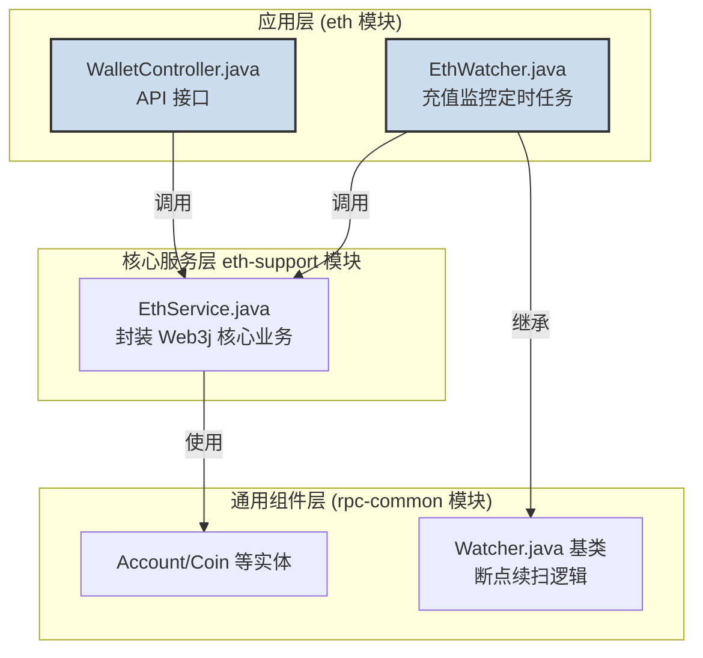

# 实战篇：深入 `eth` 模块与以太坊测试网开发指南

## 引言：从架构蓝图到可运行的服务

在上一章，我们从宏观视角解构了 `02_bizzan_wallet_rpc` 资产网关的整体架构。现在，我们将从蓝图走向实践，聚焦于其中最核心、最具代表性的“码头”之一——`eth` 模块。这个模块专职负责与“世界计算机”以太坊进行交互，处理其原生资产 ETH 的所有链上业务。

本章将作为一份详尽的**开发者实战指南**。我们将深入 `eth` 模块的源码，全面解析其功能定位、对外暴露的 API 接口、以及它与 `eth-support` 等底层库的协作关系。

更重要的是，我们将为您提供一份**端到端的以太坊测试网操作教程**。我们将整合 `doc/QA.md` 中的精华内容，手把手地指导您：

*   如何在测试网上创建自己的以太坊钱包并获取私钥。
*   如何从公共“水龙头”获取免费的测试 ETH。
*   如何配置并成功启动 `eth` 模块，使其连接到公共测试网络。
*   如何通过编写 Java 代码，调用 `eth` 模块提供的 API，完成余额查询和发起一笔真实的链上转账。

完成本章的学习后，您将不仅理解 `eth` 模块的工作原理，更能亲手操作，让这个服务在您的本地环境中真正“活”起来，为您后续的二次开发和学习打下坚实的基础。

---

## `eth` 模块功能与定位解析

在 `02_bizzan_wallet_rpc` 的微服务集群中，`eth` 模块的定位是**以太坊原生资产（ETH）的专属钱包服务**。它是一个可以独立部署和运行的 Spring Boot 应用，其核心职责是将复杂的以太坊链上交互封装成标准、易用的 RESTful API，供上层业务系统（如 `01_bizzan_framework` 中的 `wallet` 服务）调用。

### 模块依赖关系：典型的三层分层设计

`eth` 模块的优雅之处在于其清晰的分层设计，它完美地体现了“关注点分离”的原则：

*   **应用层 (`eth` 模块)**：负责业务流程的编排和对外暴露接口。`WalletController` 将业务功能包装成 HTTP API，而 `EthWatcher` 则通过定时任务驱动充值监控流程。它不关心如何与以太坊节点通信，只负责调用下层服务。
*   **核心服务层 (`eth-support` 模块)**：这是真正的“发动机”，封装了所有与以太坊交互的原子操作，如创建钱包、查询余额、发送交易等。它利用 `web3j` 库处理底层的 RPC 通信。
*   **通用组件层 (`rpc-common` 模块)**：提供了所有 RPC 服务模块共享的基类和实体。例如，`EthWatcher` 继承自 `Watcher` 基类，从而复用了健壮的“断点续扫”和状态持久化逻辑。

### 核心接口解析 (`WalletController.java`)

`eth` 模块通过 `WalletController` 对外提供了一套完整的 RESTful API，用于管理 ETH 钱包。

| HTTP 方法 | 路径 | 功能描述 |
| :--- | :--- | :--- |
| `GET` | `/rpc/address/{account}` | **创建新地址**：为指定的用户账户（`account`）生成一个新的 ETH 地址和对应的 Keystore 文件。 |
| `GET` | `/rpc/balance` | **查询总余额**：获取由该服务管理的所有地址的 ETH 总余额。 |
| `GET` | `/rpc/balance/{address}` | **查询指定地址余额**：获取单个 ETH 地址的余额。 |
| `GET` | `/rpc/height` | **查询区块高度**：获取当前服务已同步到的最新区块高度。 |
| `POST` | `/rpc/withdraw` | **发起提现**：从配置的热钱包地址向指定地址转账一笔 ETH。请求体需包含 `address`, `amount`, `fee`。 |
| `GET` | `/rpc/transfer` | **资金归集**：将所有用户地址中的 ETH 余额转移到配置的冷钱包地址。 |

---

## 以太坊测试网完整操作指南

参考 [eth.md](./eth.md) 和 [申请Sepolia测试网的RPC节点.md](./申请Sepolia测试网的RPC节点.md)

---

## 总结

通过本章的实战演练，我们成功地将一个独立的 `eth` RPC 服务连接到了公共的以太坊测试网络，并掌握了通过 API 与其交互的全过程。这不仅验证了 `02_bizzan_wallet_rpc` 架构的实用性和健壮性，也为您进行更深度的二次开发、功能扩展或问题排查铺平了道路。

现在，这座通往“世界计算机”的港口已经为您全面开放。