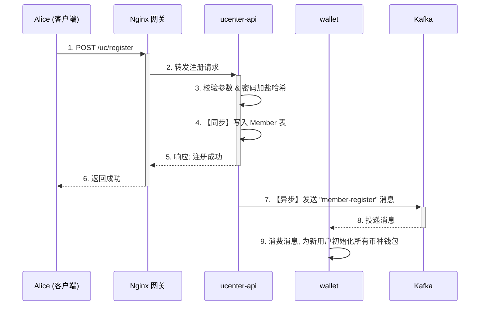
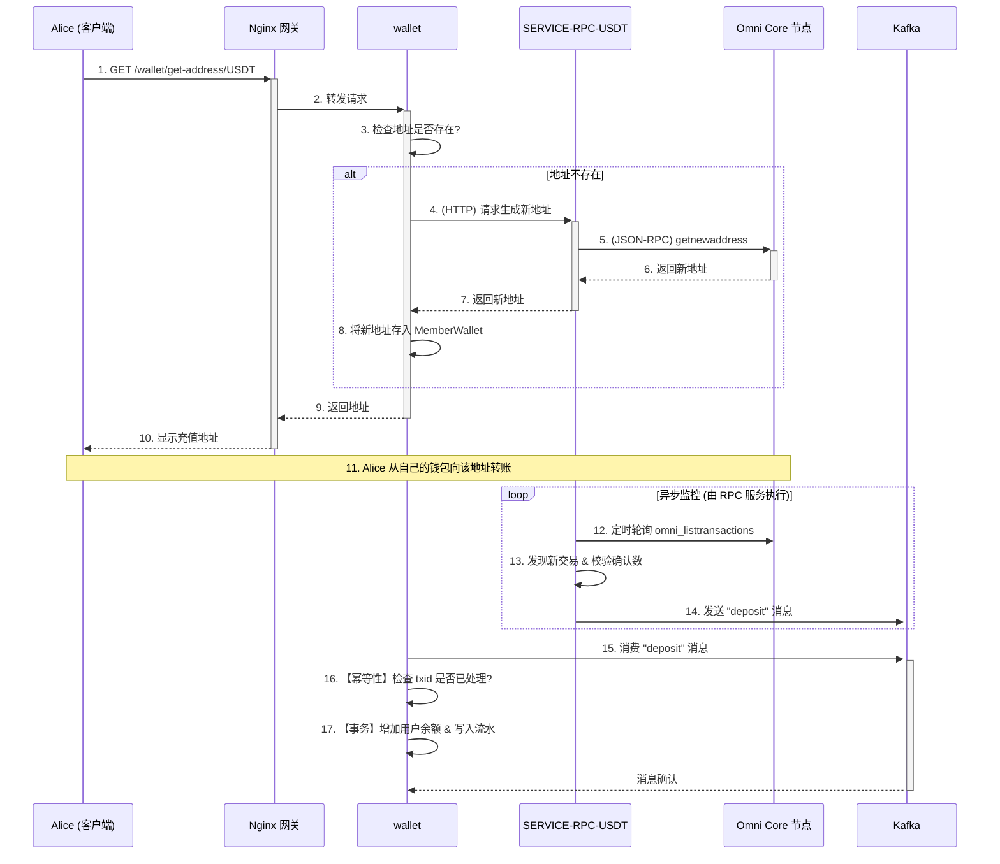

# 第十九章：核心流程串讲 (一) - 用户注册与充币

## 1. 引言：一次请求的旅程

在我们已经探索过的微服务世界里，每一个服务都是一座功能独特的岛屿：`ucenter-api` 是签发身份的“主权岛”，`wallet` 是掌管财富的“金库岛”，而 `exchange` 则是进行交易的“贸易中心”。那么，当一个新用户，我们称她为 Alice，第一次访问我们的交易所时，她的一个简单“注册”请求，是如何变成一艘小船，在这些岛屿间穿梭，最终为她建立一个完整的数字身份和财富账户的呢？

本章，我们将化身领航员，开启一段奇妙的追踪之旅。我们将跟随 Alice 的两次关键操作——“注册账户”和“第一笔充值”，把之前所有独立的微服务知识点像珍珠一样串联起来，从一个真实用户的视角，完整地观察一个请求如何在我们的微服务群岛中流动、处理、响应，并最终完成它的使命。

这趟旅程将揭示：

*   **同步与异步的协奏**: 为何创建身份必须是“同步”的，而初始化钱包却是“异步”的？
*   **事件驱动的解耦**: `ucenter-api` 如何在不“认识”`wallet` 服务的情况下，优雅地通知它为新用户开户？
*   **职责的边界**: 在充币流程中，`RPC` 服务和 `wallet` 服务是如何完美分工，各司其职的？

现在，让我们登上 Alice 的请求之船，从她点击“注册”按钮的那一刻，正式起航。

---

## 2. 第一站：身份的诞生 (用户注册)

Alice 的旅程始于注册页面。这个过程的核心目标，是在我们的系统中为她创建一个独一无二的、安全的数字身份。

### 2.1 注册流程时序图



### 2.2 关键步骤解析

#### 步骤 1-6：同步的身份创建

当 Alice 填好信息点击注册，请求首先经过 **Nginx 网关**，被路由到 `ucenter-api` 的 `RegisterController`。

`ucenter-api` 会执行一系列严格的同步操作：
1.  **参数校验**：确保手机号、验证码等信息的合法性。
2.  **密码加盐哈希**：为了安全，密码绝不会被明文存储。
    ```java
    // 源码路径: ucenter-api/src/main/java/com/bizzan/bitrade/controller/RegisterController.java
    String credentialsSalt = ByteSource.Util.bytes(loginNo).toHex();
    String password = Md5.md5Digest(loginByPhone.getPassword() + credentialsSalt).toLowerCase();
    ```
3.  **用户信息持久化**：将包含加密密码和盐的 `Member` 对象保存到数据库中。
    ```java
    // 源码路径: ucenter-api/src/main/java/com/bizzan/bitrade/service/MemberService.java
    Member member1 = memberService.save(member);
    ```
这个过程必须是**同步**的，因为它需要立刻完成，才能向 Alice 返回“注册成功”的结果，保证了良好的用户体验。

#### 步骤 7-9：异步的钱包初始化

Alice 虽然有了身份，但她在交易所里还没有地方存放资产。`ucenter-api` 作为“身份管理”服务，它的核心职责已经完成。它无需知道下游的 `wallet` 服务将如何工作。

项目通过 Kafka 实现了一次优雅的**异步解耦**。
`ucenter-api` 在用户数据成功入库后，会发布一个 `member-register` 事件到 Kafka：
```java
// 源码路径: ucenter-api/src/main/java/com/bizzan/bitrade/controller/RegisterController.java
memberEvent.onRegisterSuccess(member1, loginByPhone.getPromotion().trim());
```

而在 `wallet` 服务中，`MemberConsumer` 作为一个忠实的监听者，会消费这条消息，并在后台为新用户初始化所有币种的钱包记录。
```java
// 源码路径: wallet/src/main/java/com/bizzan/bitrade/consumer/MemberConsumer.java
@KafkaListener(topics = {"member-register"})
public void handle(String content) {
    // ...
    for(Coin coin:coins) {
        MemberWallet wallet = new MemberWallet();
        // ... 设置钱包属性 ...
        // 地址在用户主动请求时才生成
        wallet.setAddress("");
        memberWalletService.save(wallet);
    }
}
```
通过这套“同步+异步”组合拳，核心业务被快速完成，而耗时较长的非核心业务则被优雅地抛给了消息队列，在后台默默完成。

---

## 3. 第二站：财富的注入 (USDT 充币)

身份创建完毕，Alice 准备注入她的第一笔财富。我们以最主流的 USDT 为例。这个流程的目标，是将 Alice 在 Omni 公链上的资产，安全、准确地映射到她在交易所的中心化账户余额上。

### 3.1 充币流程时序图



### 3.2 关键步骤解析

#### 步骤 1-10：同步获取充值地址

为了充值，Alice 首先需要一个专属于她的 USDT 充值地址。这个获取过程是**同步**的。
1.  **请求发起**: Alice 在前端点击“充值”，请求通过 Nginx 网关直接路由到 `wallet` 服务的 `WalletController`。
2.  **地址生成逻辑**: `wallet` 服务是地址管理的核心。它会先查询数据库，看是否已经为 Alice 生成过 USDT 地址。
    *   **如果地址已存在**，则直接返回。
    *   **如果地址不存在**，它会通过 HTTP 调用 `SERVICE-RPC-USDT` 服务。RPC 服务再调用 Omni Core 节点的 `getnewaddress` 命令，生成一个全新的地址。这个新地址被 `wallet` 服务保存到数据库后，再逐层返回给 Alice。

这种“**按需生成**”的设计，避免了在注册时就为数百万用户预先生成所有币种的地址，极大地节省了 RPC 调用开销和地址资源。

#### 步骤 11-17：异步的充值确认与入账

当 Alice 的 USDT 交易在链上被打包确认后，远方的 `SERVICE-RPC-USDT` 哨兵服务会发现这笔交易，并向 Kafka 的 `deposit` 主题发送一条消息。

`wallet` 服务的 `FinanceConsumer` 负责接收并处理这最后的关键一步：
```java
// 源码路径: wallet/src/main/java/com/bizzan/bitrade/consumer/FinanceConsumer.java
@KafkaListener(topics = {"deposit"})
public void handleDeposit(ConsumerRecord<String, String> record) {
    // ...
    JSONObject json = JSON.parseObject(record.value());
    String txid = json.getString("txid");
    
    // 1. 【幂等性校验】检查这笔交易是否已经被处理过
    if (walletService.findDeposit(address, txid) == null) {
        // 2. 【核心入账】调用 Service 层执行数据库操作
        // 注意：区块确认数的校验，已经在上游的 RPC 服务中完成
        MessageResult mr = walletService.recharge(coin, address, amount, txid);
    }
}
```
这段代码体现了工业级消息消费的两个核心原则：
1.  **幂等性 (Idempotence)**: `walletService.findDeposit(address, txid) == null` 是保证幂等性的关键。通过在处理前检查 `txid` 是否已存在，可以确保即时收到重复的消息，用户的余额也只会被增加一次。
2.  **事务性**: `walletService.recharge` 方法内部，必定会使用数据库事务来包裹“增加用户余额”和“写入交易流水”这两个操作，维持了账本的绝对一致性。

当 `recharge` 方法成功执行后，Alice 的请求之旅就画上了一个圆满的句号。她的资产，已经从去中心化的 Omni 大陆，安全地漂流到了她在我们交易所的个人金库中。

---

## 4. 总结：同步与异步的协奏曲

通过追踪 Alice 的脚步，我们真切地感受到一个设计良好的微服务系统，是如何像一首精妙的协奏曲一样，将同步调用和异步消息完美地融合在一起的：

*   **同步调用**，用于那些需要立即返回结果、与用户直接交互的场景，如登录、获取地址、下单。它保证了用户体验的即时性。
*   **异步消息**，用于那些可以延迟处理、耗时较长或需要服务间解耦的场景，如注册后初始化钱包、充值到账处理、下单后的撮合。它保证了系统的健壮性、可扩展性和高性能。

理解何时使用同步、何时使用异步，是从“会用框架”到“精通架构”的关键一步。