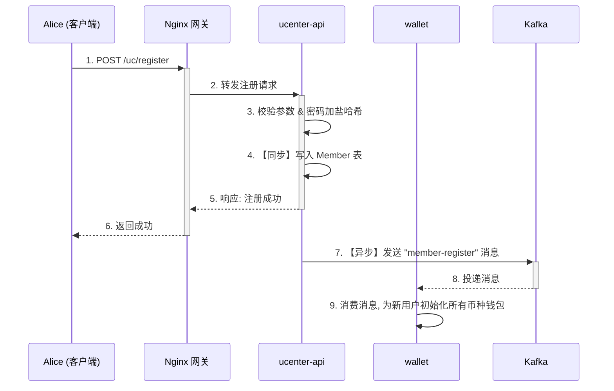
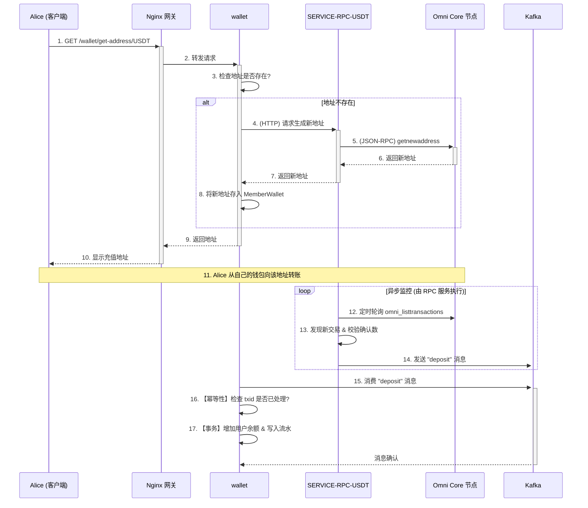

# 核心流程串讲：用户注册与充币的端到端旅程

## 引言：从微服务岛屿到完整业务流程的串联之旅

在之前的技术探索中，我们深入分析了交易所的各个微服务模块，每个模块都像一座功能独特的岛屿：`ucenter-api`是签发身份的"主权岛"，`wallet`是掌管财富的"金库岛"，`exchange`是进行交易的"贸易中心"。然而，这些独立的技术分析如何转化为用户可以体验到的完整业务流程？

现在，让我们跟随一个名叫Alice的新用户，从她第一次访问交易所开始，完整地体验"注册账户"和"第一笔充值"这两个关键操作。通过这种端到端的流程追踪，我们将把之前分散的微服务知识串联起来，从一个真实用户的视角，观察一个业务请求如何在微服务群岛中流动、处理、响应。

**流程分析的技术价值**

这种端到端的流程分析具有多重技术价值：

1. **架构验证**：检验微服务设计在实际业务场景中的有效性
2. **性能识别**：发现跨服务调用中的性能瓶颈和优化机会
3. **错误诊断**：理解异常情况在分布式系统中的传播路径
4. **用户体验**：从技术角度分析如何提升用户操作的流畅性

**同步与异步的设计哲学**

在Alice的注册旅程中，我们将深入理解一个核心设计问题：为什么某些操作必须是同步的，而另一些操作却应该是异步的？这个设计决策背后蕴含着深刻的架构考量：

- **同步操作的必要性**：用户身份创建需要立即反馈，确保用户获得即时确认
- **异步操作的优势**：钱包初始化可以后台进行，避免阻塞用户体验

**事件驱动的解耦艺术**

我们将观察到`ucenter-api`如何通过事件驱动机制，在"不认识"`wallet`服务的情况下，优雅地通知它为新用户开户。这种解耦设计体现了微服务架构的核心价值。

**职责边界的精妙划分**

在充币流程中，我们将看到`RPC`服务与`wallet`服务如何通过明确的职责分工，实现高效的协作。这种分工不仅提高了系统的可维护性，还增强了整个架构的扩展能力。

现在，让我们跟随Alice的数字旅程，从她点击"注册"按钮的那一刻开始，深入了解现代数字资产交易所的核心业务流程。

---

## 第一站：身份的诞生 - 用户注册流程深度解析

Alice的数字旅程始于注册页面，这是她与我们的交易所建立的第一次正式联系。这个过程的核心目标是在系统中为她创建一个独一无二、安全可靠的数字身份，为她后续的所有交易活动奠定基础。

**注册流程的核心价值**

用户注册不仅仅是数据的简单录入，它涉及多个关键的系统操作：

1. **身份认证**：创建唯一用户标识，防止重复注册
2. **安全保护**：密码加密存储，保护用户隐私
3. **权限分配**：设置初始权限级别和访问控制
4. **账户激活**：建立用户与平台的法律关系

### 注册流程时序分析

下面的时序图完整展示了用户注册的详细过程，包括同步的身份创建和异步的钱包初始化两个阶段：


```mermaid
sequenceDiagram
    participant Client as Alice (客户端)
    participant Nginx as Nginx 网关
    participant UCenter as ucenter-api
    participant Wallet as wallet
    participant Kafka

    Client->>+Nginx: 1. POST /uc/register
    Nginx->>+UCenter: 2. 转发注册请求
    UCenter->>UCenter: 3. 校验参数 & 密码加盐哈希
    UCenter->>UCenter: 4. 【同步】写入 Member 表
    UCenter-->>-Nginx: 5. 响应: 注册成功
    Nginx-->>-Client: 6. 返回成功

    UCenter->>+Kafka: 7. 【异步】发送 "member-register" 消息
    Kafka-->>-Wallet: 8. 投递消息

    Wallet->>Wallet: 9. 消费消息, 为新用户初始化所有币种钱包
```

### 关键步骤深度解析

#### 同步身份创建阶段（步骤1-6）

**第一阶段：请求接收与路由**

当Alice填写完注册信息并点击注册按钮时，请求首先经过Nginx网关。网关作为系统的流量入口，承担着重要的职责：

1. **负载均衡**：将注册请求均匀分发到多个ucenter-api实例
2. **SSL终止**：处理HTTPS加密解密，减轻后端服务负担
3. **访问控制**：实施基础的频率限制和安全检查
4. **请求路由**：根据URL路径准确路由到对应的微服务

**第二阶段：业务逻辑处理**

请求到达ucenter-api后，系统执行一系列关键的业务操作：

1. **参数校验**：验证用户输入的合法性，包括邮箱格式、密码强度等
2. **重复性检查**：确保邮箱、用户名等唯一性约束
3. **密码安全处理**：使用BCrypt等算法进行加盐哈希，保护用户密码安全
4. **用户实体创建**：在数据库中创建Member记录，分配唯一用户ID

**第三阶段：同步响应**

身份创建完成后，系统立即向Alice返回成功响应。这种同步响应的设计体现了用户体验优先的原则：

- **即时反馈**：用户无需等待即可知道注册结果
- **状态明确**：清晰的响应信息帮助用户了解下一步操作
- **用户体验**：快速响应提升用户对平台的第一印象

#### 异步钱包初始化阶段（步骤7-9）

**事件驱动的设计模式**

在用户获得注册成功反馈后，系统通过Kafka消息队列启动异步的钱包初始化流程。这种设计体现了微服务架构的核心优势：

1. **服务解耦**：ucenter-api不需要直接调用wallet服务
2. **异步处理**：钱包初始化不会阻塞用户的其他操作
3. **可靠性保证**：Kafka确保消息不丢失，支持重试机制
4. **水平扩展**：可以通过增加消费者实例提升处理能力

**钱包初始化的业务逻辑**

wallet服务消费"member-register"消息后，执行详细的初始化操作：

1. **查询支持币种**：获取系统中所有启用的数字货币
2. **创建钱包记录**：为每个币种创建对应的MemberWallet记录
3. **设置初始状态**：余额为0，冻结余额为0，地址为空
4. **生成钱包地址**：某些币种可能需要生成充值地址

**异步处理的技术优势**

这种异步处理模式带来了多重技术优势：

- **性能提升**：用户注册响应时间大幅缩短
- **系统解耦**：核心业务逻辑与辅助功能分离
- **容错能力**：钱包初始化失败不会影响用户注册
- **资源优化**：避免了同步调用时的资源等待

通过这种精心设计的同步异步结合模式，系统既保证了用户体验的流畅性，又实现了后台业务逻辑的可靠执行。

`ucenter-api` 会执行一系列严格的同步操作：
1.  **参数校验**：确保手机号、验证码等信息的合法性。
2.  **密码加盐哈希**：为了安全，密码绝不会被明文存储。
    ```java
    // 源码路径: ucenter-api/src/main/java/com/bizzan/bitrade/controller/RegisterController.java
    String credentialsSalt = ByteSource.Util.bytes(loginNo).toHex();
    String password = Md5.md5Digest(loginByPhone.getPassword() + credentialsSalt).toLowerCase();
    ```
3.  **用户信息持久化**：将包含加密密码和盐的 `Member` 对象保存到数据库中。
    ```java
    // 源码路径: ucenter-api/src/main/java/com/bizzan/bitrade/service/MemberService.java
    Member member1 = memberService.save(member);
    ```
这个过程必须是**同步**的，因为它需要立刻完成，才能向 Alice 返回“注册成功”的结果，保证了良好的用户体验。

#### 步骤 7-9：异步的钱包初始化

Alice 虽然有了身份，但她在交易所里还没有地方存放资产。`ucenter-api` 作为“身份管理”服务，它的核心职责已经完成。它无需知道下游的 `wallet` 服务将如何工作。

项目通过 Kafka 实现了一次优雅的**异步解耦**。
`ucenter-api` 在用户数据成功入库后，会发布一个 `member-register` 事件到 Kafka：
```java
// 源码路径: ucenter-api/src/main/java/com/bizzan/bitrade/controller/RegisterController.java
memberEvent.onRegisterSuccess(member1, loginByPhone.getPromotion().trim());
```

而在 `wallet` 服务中，`MemberConsumer` 作为一个忠实的监听者，会消费这条消息，并在后台为新用户初始化所有币种的钱包记录。
```java
// 源码路径: wallet/src/main/java/com/bizzan/bitrade/consumer/MemberConsumer.java
@KafkaListener(topics = {"member-register"})
public void handle(String content) {
    // ...
    for(Coin coin:coins) {
        MemberWallet wallet = new MemberWallet();
        // ... 设置钱包属性 ...
        // 地址在用户主动请求时才生成
        wallet.setAddress("");
        memberWalletService.save(wallet);
    }
}
```
通过这套“同步+异步”组合拳，核心业务被快速完成，而耗时较长的非核心业务则被优雅地抛给了消息队列，在后台默默完成。

---

## 3. 第二站：财富的注入 (USDT 充币)

身份创建完毕，Alice 准备注入她的第一笔财富。我们以最主流的 USDT 为例。这个流程的目标，是将 Alice 在 Omni 公链上的资产，安全、准确地映射到她在交易所的中心化账户余额上。

### 3.1 充币流程时序图


```mermaid
sequenceDiagram
    participant Client as Alice (客户端)
    participant Nginx as Nginx 网关
    participant Wallet as wallet
    participant RpcUSDT as SERVICE-RPC-USDT
    participant OmniNode as Omni Core 节点
    participant Kafka
    
    Client->>+Nginx: 1. GET /wallet/get-address/USDT
    Nginx->>+Wallet: 2. 转发请求
    Wallet->>Wallet: 3. 检查地址是否存在?
    alt 地址不存在
        Wallet->>+RpcUSDT: 4. (HTTP) 请求生成新地址
        RpcUSDT->>+OmniNode: 5. (JSON-RPC) getnewaddress
        OmniNode-->>-RpcUSDT: 6. 返回新地址
        RpcUSDT-->>-Wallet: 7. 返回新地址
        Wallet->>Wallet: 8. 将新地址存入 MemberWallet
    end
    Wallet-->>-Nginx: 9. 返回地址
    Nginx-->>-Client: 10. 显示充值地址
    
    Note over Client, OmniNode: 11. Alice 从自己的钱包向该地址转账
    
    loop 异步监控 (由 RPC 服务执行)
        RpcUSDT->>OmniNode: 12. 定时轮询 omni_listtransactions
        RpcUSDT->>RpcUSDT: 13. 发现新交易 & 校验确认数
        RpcUSDT->>+Kafka: 14. 发送 "deposit" 消息
    end
    
    Wallet->>+Kafka: 15. 消费 "deposit" 消息
    Wallet->>Wallet: 16. 【幂等性】检查 txid 是否已处理?
    Wallet->>Wallet: 17. 【事务】增加用户余额 & 写入流水
    Kafka-->>-Wallet: 消息确认
```

### 3.2 关键步骤解析

#### 步骤 1-10：同步获取充值地址

为了充值，Alice 首先需要一个专属于她的 USDT 充值地址。这个获取过程是**同步**的。
1.  **请求发起**: Alice 在前端点击“充值”，请求通过 Nginx 网关直接路由到 `wallet` 服务的 `WalletController`。
2.  **地址生成逻辑**: `wallet` 服务是地址管理的核心。它会先查询数据库，看是否已经为 Alice 生成过 USDT 地址。
    *   **如果地址已存在**，则直接返回。
    *   **如果地址不存在**，它会通过 HTTP 调用 `SERVICE-RPC-USDT` 服务。RPC 服务再调用 Omni Core 节点的 `getnewaddress` 命令，生成一个全新的地址。这个新地址被 `wallet` 服务保存到数据库后，再逐层返回给 Alice。

这种“**按需生成**”的设计，避免了在注册时就为数百万用户预先生成所有币种的地址，极大地节省了 RPC 调用开销和地址资源。

#### 步骤 11-17：异步的充值确认与入账

当 Alice 的 USDT 交易在链上被打包确认后，远方的 `SERVICE-RPC-USDT` 哨兵服务会发现这笔交易，并向 Kafka 的 `deposit` 主题发送一条消息。

`wallet` 服务的 `FinanceConsumer` 负责接收并处理这最后的关键一步：
```java
// 源码路径: wallet/src/main/java/com/bizzan/bitrade/consumer/FinanceConsumer.java
@KafkaListener(topics = {"deposit"})
public void handleDeposit(ConsumerRecord<String, String> record) {
    // ...
    JSONObject json = JSON.parseObject(record.value());
    String txid = json.getString("txid");
    
    // 1. 【幂等性校验】检查这笔交易是否已经被处理过
    if (walletService.findDeposit(address, txid) == null) {
        // 2. 【核心入账】调用 Service 层执行数据库操作
        // 注意：区块确认数的校验，已经在上游的 RPC 服务中完成
        MessageResult mr = walletService.recharge(coin, address, amount, txid);
    }
}
```
这段代码体现了工业级消息消费的两个核心原则：
1.  **幂等性 (Idempotence)**: `walletService.findDeposit(address, txid) == null` 是保证幂等性的关键。通过在处理前检查 `txid` 是否已存在，可以确保即时收到重复的消息，用户的余额也只会被增加一次。
2.  **事务性**: `walletService.recharge` 方法内部，必定会使用数据库事务来包裹“增加用户余额”和“写入交易流水”这两个操作，维持了账本的绝对一致性。

当 `recharge` 方法成功执行后，Alice 的请求之旅就画上了一个圆满的句号。她的资产，已经从去中心化的 Omni 大陆，安全地漂流到了她在我们交易所的个人金库中。

---

## 4. 总结：同步与异步的协奏曲

通过追踪 Alice 的脚步，我们真切地感受到一个设计良好的微服务系统，是如何像一首精妙的协奏曲一样，将同步调用和异步消息完美地融合在一起的：

*   **同步调用**，用于那些需要立即返回结果、与用户直接交互的场景，如登录、获取地址、下单。它保证了用户体验的即时性。
*   **异步消息**，用于那些可以延迟处理、耗时较长或需要服务间解耦的场景，如注册后初始化钱包、充值到账处理、下单后的撮合。它保证了系统的健壮性、可扩展性和高性能。

理解何时使用同步、何时使用异步，是从“会用框架”到“精通架构”的关键一步。