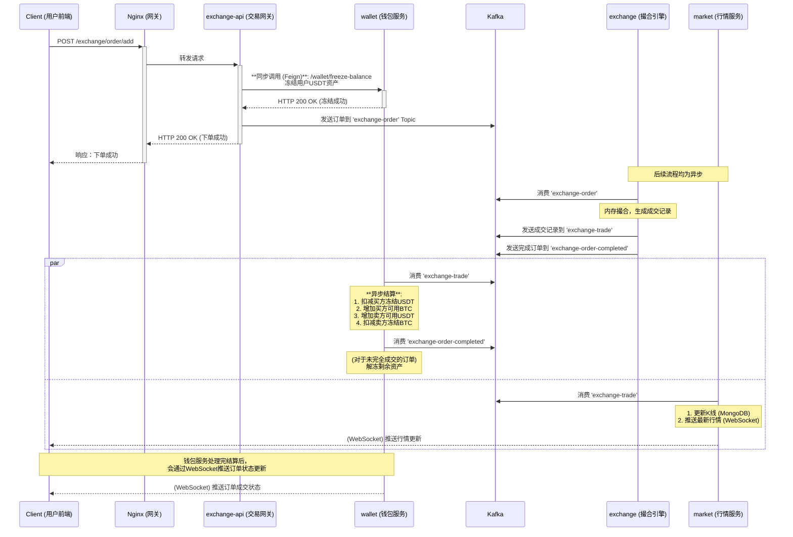

# 一个订单的史诗：深入交易所核心，追踪币币交易全链路生命周期

## 引言：交易所的“心跳”

欢迎来到我们核心流程串讲的第二部分。在上一章，我们见证了新用户 Alice 的诞生和她的第一笔充值。现在，Alice 资金已经到账，准备进行她在 Web3 世界的第一笔交易。她将在 BTC/USDT 交易对，用她充值的 USDT，购买 0.01 个 BTC。

这个看似简单的操作，却会触发交易所系统内部一场精密、高速、跨越多个微服务的“风暴”。币币交易是整个交易所的“心脏”，而撮合引擎则是这颗心脏的核心。它必须在毫秒之间处理成千上万笔订单，确保每一笔交易的公平、准确和资产的绝对安全。

本章，我们将化身数据侦探，跟随 Alice 的这笔买单，开启一段史诗般的旅程。我们将追踪它从前端点击“购买”按钮的那一刻起，在 `exchange-api`、`wallet`、`exchange` 和 `market` 等多个微服务之间流转的完整生命周期。我们将深入一线源码，用代码揭示这颗“心脏”每一次搏动的全部细节，彻底理解“**同步冻结、异步撮合**”这一核心设计思想的精妙之处。

准备好了吗？让我们启程，追踪一个订单的完整史诗。

---

### 幕后架构：订单流转的“星际航图”

在深入代码之前，我们需要一张清晰的地图。下图描绘了订单在各大微服务之间流转的核心路径，以及它们之间通过 Kafka 消息队列进行通信的机制。这张图经过了优化，比上一版更精确地反映了系统的真实运作方式。



这张图揭示了两个核心设计：
1.  **同步入口，异步核心 (动静分离)**：用户下单的入口是**同步**的，`exchange-api` 必须立刻调用 `wallet` 服务冻结资产。这是一个涉及数据库事务的“慢”操作，但它能**确保资金有效性**，并立即给用户反馈。只有冻结成功，订单才会被**异步**发送到 Kafka，进入后续纯内存、无阻塞的高速撮合流程。
2.  **事件驱动与最终一致性**：服务之间通过 Kafka 的不同 Topic 进行解耦。`exchange` 撮合引擎作为核心生产者，消费 `exchange-order`，并生产 `exchange-trade`。`wallet` 和 `market` 作为下游消费者，各自独立地消费 `exchange-trade` 来完成自己的职责（结算、行情），互不干扰。这保证了即使某个下游服务暂时故障，也不会影响核心的交易撮合，实现了系统的高可用和最终一致性。

---

### 第一幕：许下承诺 (`exchange-api`) - 订单的诞生与资产冻结

一切始于 [`exchange-api` 中的 `OrderController`](01_bizzan_framework/exchange-api/src/main/java/com/bizzan/bitrade/controller/OrderController.java)。当 Alice 点击“购买”时，前端会调用其 `/order/add` 接口。

这个方法是订单生命周期的起点，也是第一道，也是最重要的一道关卡。它的核心职责可以概括为：**校验、冻结、入队**。

在经过一系列详尽的参数校验（如价格、数量、交易对状态等）后，流程进入最关键的两个步骤：

**1. 同步冻结资产**

在 [`OrderController.java`](01_bizzan_framework/exchange-api/src/main/java/com/bizzan/bitrade/controller/OrderController.java) 的第 281 行，我们看到了决定性的代码：

```java
// 源码位置: 01_bizzan_framework/exchange-api/src/main/java/com/bizzan/bitrade/controller/OrderController.java:281
MessageResult mr = orderService.addOrder(member.getId(), order);
if (mr.getCode() != 0) {
    return MessageResult.error(500, "提交订单失败:" + mr.getMessage());
}
```
这里的 `orderService.addOrder` 方法，会通过 **Feign** **同步**调用 `wallet` 服务的接口，对用户的资产进行冻结。对于 Alice 的买单，`wallet` 服务会执行一个数据库事务：减少她 USDT 钱包的 `balance`（可用余额），并等量增加 `frozenBalance`（冻结余额）。

这是一个**至关重要**的设计。如果 Alice 的 USDT 余额不足，`addOrder` 将直接返回失败，订单被拒绝。这确保了任何进入到后续撮合流程的订单，其所需资产都已被“锁定”，从而杜绝了“空头支票”的风险。

**2. 异步发送订单**

只有当资产冻结成功后，订单才获得了进入撮合引擎的“门票”。在 [`OrderController.java`](01_bizzan_framework/exchange-api/src/main/java/com/bizzan/bitrade/controller/OrderController.java) 的第 287 行，订单被序列化为 JSON，并发送到 Kafka：

```java
// 源码位置: 01_bizzan_framework/exchange-api/src/main/java/com/bizzan/bitrade/controller/OrderController.java:287
// 发送消息至Exchange系统
kafkaTemplate.send("exchange-order", JSON.toJSONString(order));
```
至此，`exchange-api` 的使命完成。它向用户返回了“下单成功”的响应，而订单本身，则像一艘启航的船，驶入了名为 `exchange-order` 的 Kafka 航道，奔赴撮合引擎。

---

### 第二幕：命运的裁决 (`exchange`) - 内存中的闪电之舞

订单消息在 Kafka 中短暂地停留后，被 `exchange` 服务消费。这是整个系统的性能核心，所有交易的匹配都在这里完成。

#### 2.1 订单的接收与路由

[`ExchangeOrderConsumer.java`](01_bizzan_framework/exchange/src/main/java/com/bizzan/bitrade/consumer/ExchangeOrderConsumer.java) 是订单进入撮合引擎的大门。它的 `onOrderSubmitted` 方法监听着 `exchange-order` 主题。

```java
// 源码位置: 01_bizzan_framework/exchange/src/main/java/com/bizzan/bitrade/consumer/ExchangeOrderConsumer.java:28
@KafkaListener(topics = "exchange-order",containerFactory = "kafkaListenerContainerFactory")
public void onOrderSubmitted(List<ConsumerRecord<String,String>> records){
    // ...
    ExchangeOrder order = JSON.parseObject(record.value(), ExchangeOrder.class);
    // ...
    CoinTrader trader = traderFactory.getTrader(order.getSymbol());
    // ...
    trader.trade(order);
    // ...
}
```
此处的逻辑非常纯粹：解析订单，然后通过 `CoinTraderFactory` 找到处理该交易对（如 "BTC/USDT"）的 `CoinTrader` 实例，并将订单交给它。每个交易对都有一个独立的 `CoinTrader`，它们之间互不影响，确保了系统可以水平扩展以支持更多的交易对。

#### 2.2 撮合的心脏：`CoinTrader`

[`CoinTrader.java`](01_bizzan_framework/exchange/src/main/java/com/bizzan/bitrade/Trader/CoinTrader.java) 是撮合算法的最终实现。其内部维护着两个核心数据结构，共同构成了内存订单簿（Order Book）：

```java
// 源码位置: 01_bizzan_framework/exchange/src/main/java/com/bizzan/bitrade/Trader/CoinTrader.java:25
//买入限价订单链表，价格从高到低排列
private TreeMap<BigDecimal,MergeOrder> buyLimitPriceQueue;
//卖出限价订单链表，价格从低到高排列
private TreeMap<BigDecimal,MergeOrder> sellLimitPriceQueue;
```
`TreeMap` 的选择是这里的点睛之笔。它是一个基于红黑树的排序映射，可以根据价格（Key）自动对订单进行排序。买单队列按价格**降序**排列（出价最高的在最前面），卖单队列按价格**升序**排列（出价最低的在最前面）。这使得寻找最佳匹配对手单的时间复杂度仅为 O(log n)，效率极高。

当 Alice 的买单进入 `trade` 方法后，它会立即与 `sellLimitPriceQueue`（卖单队列）进行匹配。核心的撮合逻辑在 `processMatch` 方法中：

```java
// 源码位置: 01_bizzan_framework/exchange/src/main/java/com/bizzan/bitrade/Trader/CoinTrader.java:445
private ExchangeTrade processMatch(ExchangeOrder focusedOrder, ExchangeOrder matchOrder){
    // ...
    // 1. 确定成交价 (dealPrice)
    if(matchOrder.getType() == ExchangeOrderType.LIMIT_PRICE){
        dealPrice = matchOrder.getPrice();
    } else {
        dealPrice = focusedOrder.getPrice();
    }
    // ...
    // 2. 计算可成交数量 (needAmount, availAmount)
    needAmount = calculateTradedAmount(focusedOrder,dealPrice);
    availAmount = calculateTradedAmount(matchOrder,dealPrice);

    // 3. 确定本次成交量 (tradedAmount)
    BigDecimal tradedAmount = (availAmount.compareTo(needAmount) >= 0 ? needAmount : availAmount);
    
    // 4. 计算成交额 (turnover)
    BigDecimal turnover = tradedAmount.multiply(dealPrice);

    // 5. 更新双方订单的已成交数量和金额
    matchOrder.setTradedAmount(matchOrder.getTradedAmount().add(tradedAmount));
    focusedOrder.setTradedAmount(focusedOrder.getTradedAmount().add(tradedAmount));
    // ...
    // 6. 创建成交记录 (ExchangeTrade)
    ExchangeTrade exchangeTrade = new ExchangeTrade();
    // ...
    return exchangeTrade;
}
```
这个过程会循环进行，直到 Alice 的订单被完全成交，或者在卖单队列中再也找不到价格合适的对手单。

#### 2.3 广播成交结果

撮合完成后，`CoinTrader` 会将结果通过 Kafka 广播出去，通知整个系统。

```java
// 源码位置: 01_bizzan_framework/exchange/src/main/java/com/bizzan/bitrade/Trader/CoinTrader.java:593
// 发送成交记录
kafkaTemplate.send("exchange-trade",JSON.toJSONString(trades));

// 源码位置: 01_bizzan_framework/exchange/src/main/java/com/bizzan/bitrade/Trader/CoinTrader.java:615
// 发送已完成的订单
kafkaTemplate.send("exchange-order-completed", JSON.toJSONString(orders));
```
*   `exchange-trade` 主题：包含了新生成的**成交记录**，这是下游服务进行资产结算和行情更新的依据。
*   `exchange-order-completed` 主题：包含了那些**生命周期已结束**的订单（无论是完全成交还是被取消），`wallet` 服务会消费它来解冻剩余资金。

---

### 第三幕：尘埃落定 (`wallet` & `market`) - 并行的结算与行情更新

当成交记录进入 `exchange-trade` 主题后，订单的旅程进入了尾声。`wallet` 和 `market` 服务作为消费者，将**同时、并行**地收到这条消息，并各自完成最后的使命。

#### 3.1 `wallet`：资金的尘埃落定

这**是整个交易流程中对资金安全最重要的一步**。[`ExchangeTradeConsumer.java`](01_bizzan_framework/wallet/src/main/java/com/bizzan/bitrade/consumer/ExchangeTradeConsumer.java) 负责处理最终的资产交割。

```java
// 源码位置: 01_bizzan_framework/wallet/src/main/java/com/bizzan/bitrade/consumer/ExchangeTradeConsumer.java:40
@KafkaListener(topics = "exchange-trade", containerFactory = "kafkaListenerContainerFactory")
public void handleTrade(List<ConsumerRecord<String, String>> records, Acknowledgment ack) {
    // ...
    for (int i = 0; i < records.size(); i++) {
        // ...
        List<ExchangeTrade> trades = JSON.parseArray(record.value(), ExchangeTrade.class);
        // ...
        for (ExchangeTrade trade : trades) {
            // 调用核心结算服务
            exchangeOrderService.processExchangeTrade(trade, secondReferrerAward);
        }
    }
    // ...
}
```
这里的 `exchangeOrderService.processExchangeTrade` 方法，是资金结算的核心。它会在一个**数据库事务**中，为买卖双方执行精确的资金划转：
1.  **为买方 (Alice) 结算**：
    *   **扣减冻结的 USDT**：减少 Alice USDT 钱包的 `frozenBalance`。
    *   **增加可用的 BTC**：增加 Alice BTC 钱包的 `balance`。
2.  **为卖方结算**：
    *   **扣减冻结的 BTC**：减少卖方 BTC 钱包的 `frozenBalance`。
    *   **增加可用的 USDT**：增加卖方 USDT 钱包的 `balance`。
3.  **记录资金流水**：为双方的资产变更分别创建 `MemberTransaction` 记录，用于对账。
4.  **处理手续费和返佣**。

这个过程完成了资产的最终交割，标志着 Alice 的这笔交易在资金层面彻底完成。

#### 3.2 `market`：行情的诞生

与此同时，[`market` 服务中的 `ExchangeTradeConsumer`](01_bizzan_framework/market/src/main/java/com/bizzan/bitrade/consumer/ExchangeTradeConsumer.java) 也收到了相同的成交记录。它的职责非常纯粹：**只关心行情，不触碰资产**。

```java
// 源码位置: 01_bizzan_framework/market/src/main/java/com/bizzan/bitrade/consumer/ExchangeTradeConsumer.java:56
@KafkaListener(topics = "exchange-trade", containerFactory = "kafkaListenerContainerFactory")
public void handleTrade(List<ConsumerRecord<String, String>> records) {
    // ...
    List<ExchangeTrade> trades = JSON.parseArray(record.value(), ExchangeTrade.class);
    String symbol = trades.get(0).getSymbol();
    // 获取该交易对的行情处理器
    CoinProcessor coinProcessor = coinProcessorFactory.getProcessor(symbol);
    
    // 核心步骤：处理K线行情
    if (coinProcessor != null) {
        coinProcessor.process(trades);
    }
    // ...
}
```
`coinProcessor.process` 方法会将成交数据喂给 `CoinProcessor`，后者负责：
1.  **更新实时行情**：计算并缓存最新的价格、成交量、涨跌幅等。
2.  **生成 K 线数据**：将成交价聚合到不同时间周期（1分钟、5分钟、1小时等）的 K 线中，并存入 `MongoDB`。
3.  **通过 WebSocket 推送**：将最新的行情和盘口数据，通过 `aqmd-netty` 框架主动推送给所有订阅了该交易对的客户端。

---

## 总结：一场精心编排的舞蹈

我们跟随 Alice 的订单，完整地经历了一场跨越多个微服务、由 Kafka 精心编排的“数据之舞”。

从 `exchange-api` 的**同步资产冻结**，到 `exchange` 撮合引擎中基于 `TreeMap` 的**高性能内存撮合**，再到 `wallet` 和 `market` 服务**并行的异步结算与行情更新**，每一步都体现了构建一个高并发、高可靠金融系统的核心设计原则。

现在，我们不仅理解了币币交易的业务流程，更通过深入源码，掌握了其背后微服务架构、消息队列、核心数据结构与算法的精妙实现。这正是从“知道”到“掌握”的关键一步。