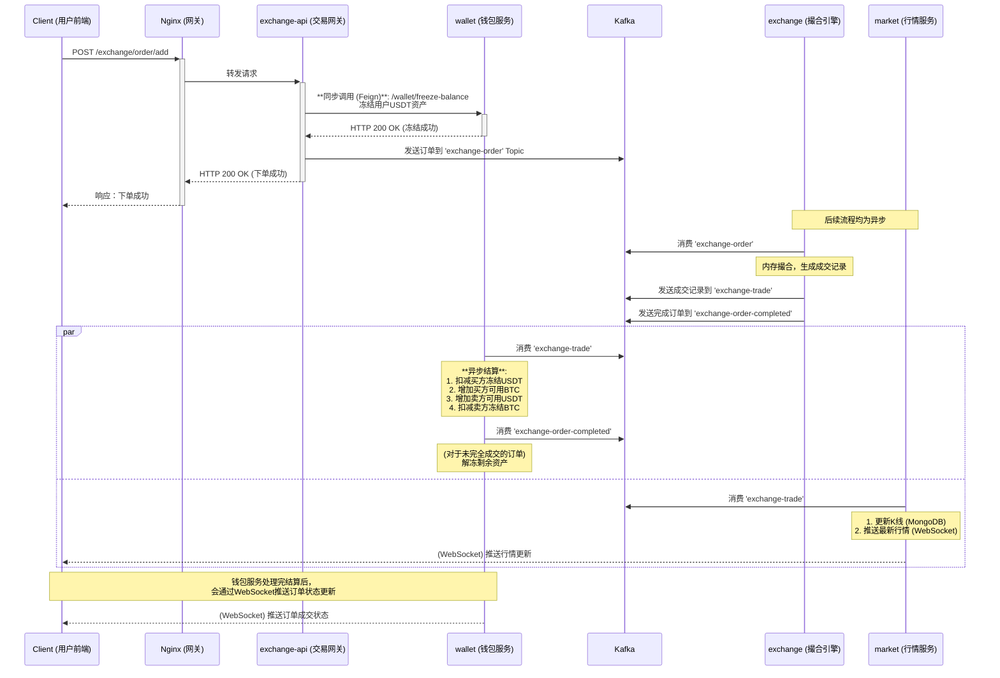
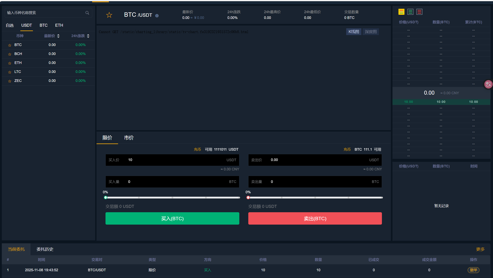
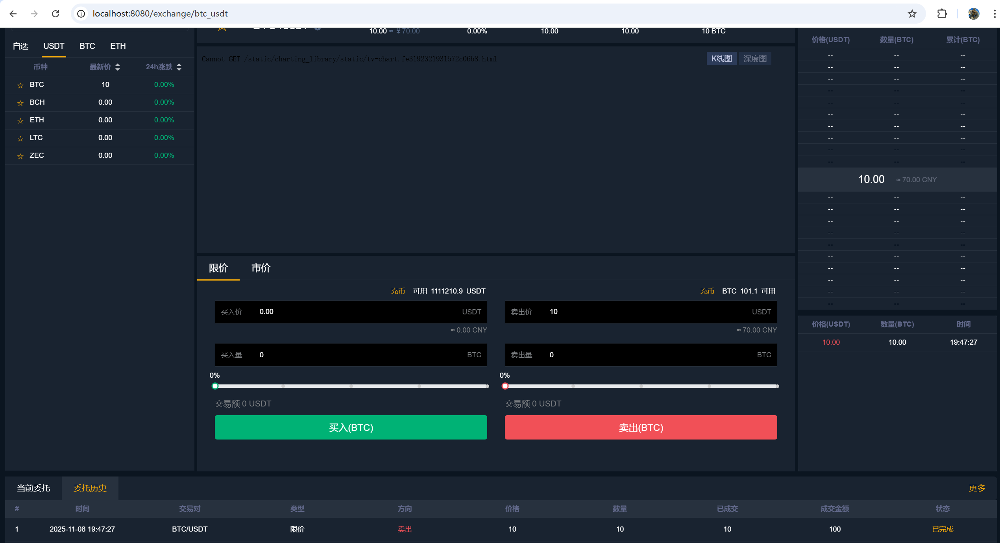

# 币币交易全链路：从下单到成交的精密工程

## 引言：交易所的心脏搏动

欢迎来到我们核心流程串讲的第二部分。在上一章中，我们见证了用户Alice从注册到充币的完整流程。现在，Alice的账户已经有了USDT余额，她准备进行在Web3世界中的第一笔交易——在BTC/USDT交易对中用USDT购买0.01个BTC。

这个看似简单的买卖操作，实际上会触发交易所系统内部一场精密、高速、跨越多个微服务的复杂"风暴"。币币交易是整个交易所的"心脏"，而撮合引擎则是这颗心脏的核心动力源。它必须在毫秒级别内处理成千上万笔订单，确保每一笔交易的公平性、准确性和资产安全。

**交易系统的技术挑战**

现代数字资产交易系统面临着前所未有的技术挑战：

1. **极端性能要求**：在市场剧烈波动时，系统需要处理每秒数万笔交易请求
2. **资金安全保障**：任何资金操作的错误都可能导致严重的经济损失
3. **实时性保证**：用户期望看到近乎实时的市场价格和成交反馈
4. **高并发处理**：成千上万用户同时交易，系统需要保持稳定响应
5. **数据一致性**：分布式环境下的资产状态必须保持绝对准确

**核心设计思想**

在这种高压环境下，系统采用了"**同步冻结、异步撮合**"的核心设计思想：

- **同步冻结**：用户下单时立即冻结相应资金，确保交易安全
- **异步撮合**：撮合过程在后台异步进行，不影响用户体验
- **事件驱动**：通过Kafka消息队列实现服务间的解耦和通信

**深度技术剖析的价值**

本章我们将化身系统架构师，跟随Alice的这笔买单，深入追踪它从点击"购买"按钮到最终成交的完整生命周期。我们将：

1. **跨服务追踪**：深入了解`exchange-api`、`wallet`、`exchange`、`market`等微服务的协作机制
2. **源码级分析**：通过真实代码揭示系统的技术实现细节
3. **性能优化洞察**：理解如何在高并发环境下保持系统稳定性
4. **架构设计学习**：掌握现代交易系统的核心设计原则

**学习目标**

通过这次深度技术之旅，我们将全面掌握：

- 微服务架构在高频交易中的应用
- 分布式系统的数据一致性保障机制
- 事件驱动架构的设计与实现
- 金融级系统的安全防护策略
- 高并发系统的性能优化技巧

现在，让我们跟随Alice的交易订单，开启这段技术深度探索之旅，彻底理解现代数字资产交易系统的精妙之处。

---

### 幕后架构：订单流转的精密航图

在深入代码细节之前，我们需要一张清晰的系统地图。下面的时序图精确描绘了订单在各大微服务之间的完整流转路径，以及它们通过Kafka消息队列进行异步通信的精密机制。

**架构设计的精妙之处**

这个架构图揭示了现代交易系统的几个核心设计原则：

1. **分层解耦**：通过API网关、业务服务、消息队列的分层设计，实现系统的模块化
2. **同步异步结合**：关键资金操作采用同步调用保证安全性，撮合处理采用异步模式提升性能
3. **事件驱动通信**：通过Kafka实现服务间的松耦合通信，支持水平扩展
4. **并行处理**：多个服务可以同时消费同一事件，提高系统整体吞吐量

**服务角色的精确定位**

每个微服务都在整个交易流程中扮演着不可替代的角色：

- **exchange-api（交易网关）**：用户请求的入口，负责参数验证、资金冻结、订单创建
- **wallet（钱包服务）**：资产管理的核心，处理资金冻结、解冻、转账等操作
- **exchange（撮合引擎）**：交易处理的心脏，执行高效的订单匹配算法
- **market（行情服务）**：市场数据的处理中心，生成行情推送和统计数据

**数据流转的关键特性**

时序图展示的数据流转体现了几个重要的技术特性：

1. **单向数据流**：请求按照明确的方向流转，避免了循环依赖
2. **异步解耦**：通过Kafka消息队列实现服务间的松耦合通信
3. **并行消费**：多个服务可以同时处理相同的业务事件
4. **故障隔离**：某个服务的故障不会影响整个交易流程的完整性

**性能保障的核心机制**

为了支撑高频交易场景，系统设计了多重性能保障机制：

1. **连接池优化**：RPC调用使用连接池，减少连接建立开销
2. **批量处理**：某些操作支持批量处理，提升数据库操作效率
3. **缓存策略**：热点数据缓存减少数据库访问压力
4. **负载均衡**：多实例部署并通过负载均衡分散请求压力

通过这个精密的架构设计，系统能够在高并发环境下保持稳定的性能表现，为用户提供流畅的交易体验。


```mermaid
sequenceDiagram
    participant C as Client (用户前端)
    participant N as Nginx (网关)
    participant API as exchange-api (交易网关)
    participant W as wallet (钱包服务)
    participant K as Kafka
    participant E as exchange (撮合引擎)
    participant M as market (行情服务)

    C->>+N: POST /exchange/order/add
    N->>+API: 转发请求
    API->>+W: **同步调用 (Feign)**: /wallet/freeze-balance <br> 冻结用户USDT资产
    W-->>-API: HTTP 200 OK (冻结成功)
    API->>K: 发送订单到 'exchange-order' Topic
    API-->>-N: HTTP 200 OK (下单成功)
    N-->>-C: 响应：下单成功

    Note over E,M: 后续流程均为异步

    E->>K: 消费 'exchange-order'
    Note over E: 内存撮合，生成成交记录
    E->>K: 发送成交记录到 'exchange-trade'
    E->>K: 发送完成订单到 'exchange-order-completed'

    par
        W->>K: 消费 'exchange-trade'
        Note over W: **异步结算**: <br> 1. 扣减买方冻结USDT <br> 2. 增加买方可用BTC <br> 3. 增加卖方可用USDT <br> 4. 扣减卖方冻结BTC
        W->>K: 消费 'exchange-order-completed'
        Note over W: (对于未完全成交的订单) <br> 解冻剩余资产
    and
        M->>K: 消费 'exchange-trade'
        Note over M: 1. 更新K线 (MongoDB) <br> 2. 推送最新行情 (WebSocket)
        M-->>C: (WebSocket) 推送行情更新
    end

    Note over W, C: 钱包服务处理完结算后，<br>会通过WebSocket推送订单状态更新
    W-->>C: (WebSocket) 推送订单成交状态
```

这张图揭示了两个核心设计：

1.  **同步入口，异步核心 (动静分离)**：用户下单的入口是**同步**的，`exchange-api` 必须立刻调用 `wallet` 服务冻结资产。这是一个涉及数据库事务的“慢”操作，但它能**确保资金有效性**，并立即给用户反馈。只有冻结成功，订单才会被**异步**发送到 Kafka，进入后续纯内存、无阻塞的高速撮合流程。
2.  **事件驱动与最终一致性**：服务之间通过 Kafka 的不同 Topic 进行解耦。`exchange` 撮合引擎作为核心生产者，消费 `exchange-order`，并生产 `exchange-trade`。`wallet` 和 `market` 作为下游消费者，各自独立地消费 `exchange-trade` 来完成自己的职责（结算、行情），互不干扰。这保证了即使某个下游服务暂时故障，也不会影响核心的交易撮合，实现了系统的高可用和最终一致性。

---

好的，我们来对整个币币交易的操作流程进行一次完整的总结。

这个流程完美地体现了技术文档中提到的“**同步冻结，异步撮合**”核心思想，并通过一个设计精良的前端界面，为用户提供了流畅的交易体验。

---

### **币币交易完整操作流程**

整个流程可以分为五个核心阶段，涉及两个角色：**卖家**（提供流动性）和**买家**（消耗流动性）。





#### **第一阶段：准备工作 (双方用户)**

在交易开始前，买卖双方都需要完成基础准备：

1.  **注册与登录**：双方都已拥有交易所账户并成功登录。
2.  **资产就位**：
    - **卖家**：资金账户中拥有足额的待售数字货币（例如：`BTC`）。
    - **买家**：资金账户中拥有足额的计价数字货币（例如：`USDT`）。

#### **第二阶段：卖家挂出卖单 (提供流动性)**

1.  **进入交易区**：用户在网站顶部导航栏点击 **[币币交易]**，进入交易主界面。
2.  **选择交易对**：在界面左侧的列表中，选择或搜索想要交易的币种对，例如 **[BTC/USDT]**。
3.  **填写卖单**：在界面中部的操作区，使用右侧红色的 **[卖出]** 表单：
    - 选择委托类型，通常是 **[限价]**。
    - 输入期望的 **[卖出价]** 和 **[卖出量]**。
4.  **提交委托**：点击红色的 **[卖出(BTC)]** 按钮。

- **后台操作**：此时，系统会**立即同步冻结**卖家账户中对应数量的 `BTC`，以确保订单的有效性。冻结成功后，订单被异步发送至撮合引擎。
- **前端反馈**：卖家的这笔订单会出现在页面下方的 **[当前委托]** 列表中，并进入右侧的公开**订单簿（卖盘）**，等待买家匹配。

#### **第三阶段：买家下单成交 (消耗流动性)**

1.  **进入交易区**：买家进入相同的 **[BTC/USDT]** 交易界面。
2.  **查看订单簿**：买家在右侧的订单簿中，可以看到卖家挂出的卖单价格和数量。
3.  **填写买单**：在操作区，使用左侧绿色的 **[买入]** 表单：
    - 选择 **[限价]** 委托。
    - 输入一个**等于或高于**卖家挂单价的 **[买入价]**，以及希望购买的 **[买入量]**。
4.  **提交委托**：点击绿色的 **[买入(BTC)]** 按钮。

#### **第四阶段：后台撮合与结算**

1.  **资产冻结**：系统**立即同步冻结**买家账户中完成该笔交易所需的 `USDT`。
2.  **订单撮合**：订单被异步发送至**撮合引擎**。引擎发现买卖双方的订单可以匹配，立即执行撮合。成交价将遵循“价格优先”原则，即以订单簿上已存在的订单价格（卖方价格）为准。
3.  **异步结算**：撮合成功后，**钱包服务**会收到成交记录，并执行**异步的资产结算**：
    - 从卖家冻结的 `BTC` 中扣除成交数量，并增加相应数量的 `USDT` 到其可用余额。
    - 从买家冻结的 `USDT` 中扣除成交金额，并增加相应数量的 `BTC` 到其可用余额。

#### **第五阶段：交易完成与前端更新**

交易完成后，后台服务会通过 **WebSocket** 将最新的数据实时推送给前端，用户会在界面上看到：

1.  **状态通知**：双方都会收到订单“已成交”或“部分成交”的提示。
2.  **订单列表更新**：成交的订单会从 **[当前委托]** 列表消失，并出现在 **[委托历史]** 列表中。部分成交的订单则会更新其成交进度。
3.  **资产更新**：双方的 `BTC` 和 `USDT` 资产余额会实时刷新。
4.  **市场更新**：在界面最右侧的 **[最新成交]** 列表中，会立即出现这笔交易的记录，供所有用户查看。

至此，一笔完整的币币交易流程就结束了。整个过程对用户来说清晰直观，而后台则通过一套高可用的微服务架构，确保了交易的快速、准确和安全。

### `exchange-api` - 订单与资产冻结

一切始于 [`exchange-api` 中的 `OrderController`](01_bizzan_framework/exchange-api/src/main/java/com/bizzan/bitrade/controller/OrderController.java)。当 Alice 点击“购买”时，前端会调用其 `/order/add` 接口。

这个方法是订单生命周期的起点，也是第一道，也是最重要的一道关卡。它的核心职责可以概括为：**校验、冻结、入队**。

在经过一系列详尽的参数校验（如价格、数量、交易对状态等）后，流程进入最关键的两个步骤：

**1. 同步冻结资产**

在 [`OrderController.java`](01_bizzan_framework/exchange-api/src/main/java/com/bizzan/bitrade/controller/OrderController.java) 的第 281 行，我们看到了决定性的代码：

```java
// 源码位置: 01_bizzan_framework/exchange-api/src/main/java/com/bizzan/bitrade/controller/OrderController.java:281
MessageResult mr = orderService.addOrder(member.getId(), order);
if (mr.getCode() != 0) {
    return MessageResult.error(500, "提交订单失败:" + mr.getMessage());
}
```

这里的 `orderService.addOrder` 方法，会通过 **Feign** **同步**调用 `wallet` 服务的接口，对用户的资产进行冻结。对于 Alice 的买单，`wallet` 服务会执行一个数据库事务：减少她 USDT 钱包的 `balance`（可用余额），并等量增加 `frozenBalance`（冻结余额）。

这是一个**至关重要**的设计。如果 Alice 的 USDT 余额不足，`addOrder` 将直接返回失败，订单被拒绝。这确保了任何进入到后续撮合流程的订单，其所需资产都已被“锁定”，从而杜绝了“空头支票”的风险。

**2. 异步发送订单**

只有当资产冻结成功后，订单才获得了进入撮合引擎的“门票”。在 [`OrderController.java`](01_bizzan_framework/exchange-api/src/main/java/com/bizzan/bitrade/controller/OrderController.java) 的第 287 行，订单被序列化为 JSON，并发送到 Kafka：

```java
// 源码位置: 01_bizzan_framework/exchange-api/src/main/java/com/bizzan/bitrade/controller/OrderController.java:287
// 发送消息至Exchange系统
kafkaTemplate.send("exchange-order", JSON.toJSONString(order));
```

至此，`exchange-api` 的使命完成。它向用户返回了“下单成功”的响应，而订单本身，则像一艘启航的船，驶入了名为 `exchange-order` 的 Kafka 航道，奔赴撮合引擎。

---

### `exchange`) - 内存中的极速撮合

订单消息在 Kafka 中短暂地停留后，被 `exchange` 服务消费。这是整个系统的性能核心，所有交易的匹配都在这里完成。

#### 2.1 订单的接收与路由

[`ExchangeOrderConsumer.java`](01_bizzan_framework/exchange/src/main/java/com/bizzan/bitrade/consumer/ExchangeOrderConsumer.java) 是订单进入撮合引擎的大门。它的 `onOrderSubmitted` 方法监听着 `exchange-order` 主题。

```java
// 源码位置: 01_bizzan_framework/exchange/src/main/java/com/bizzan/bitrade/consumer/ExchangeOrderConsumer.java:28
@KafkaListener(topics = "exchange-order",containerFactory = "kafkaListenerContainerFactory")
public void onOrderSubmitted(List<ConsumerRecord<String,String>> records){
    // ...
    ExchangeOrder order = JSON.parseObject(record.value(), ExchangeOrder.class);
    // ...
    CoinTrader trader = traderFactory.getTrader(order.getSymbol());
    // ...
    trader.trade(order);
    // ...
}
```

此处的逻辑非常纯粹：解析订单，然后通过 `CoinTraderFactory` 找到处理该交易对（如 "BTC/USDT"）的 `CoinTrader` 实例，并将订单交给它。每个交易对都有一个独立的 `CoinTrader`，它们之间互不影响，确保了系统可以水平扩展以支持更多的交易对。

#### 2.2 撮合的心脏：`CoinTrader`

[`CoinTrader.java`](01_bizzan_framework/exchange/src/main/java/com/bizzan/bitrade/Trader/CoinTrader.java) 是撮合算法的最终实现。其内部维护着两个核心数据结构，共同构成了内存订单簿（Order Book）：

```java
// 源码位置: 01_bizzan_framework/exchange/src/main/java/com/bizzan/bitrade/Trader/CoinTrader.java:25
//买入限价订单链表，价格从高到低排列
private TreeMap<BigDecimal,MergeOrder> buyLimitPriceQueue;
//卖出限价订单链表，价格从低到高排列
private TreeMap<BigDecimal,MergeOrder> sellLimitPriceQueue;
```

`TreeMap` 的选择是这里的点睛之笔。它是一个基于红黑树的排序映射，可以根据价格（Key）自动对订单进行排序。买单队列按价格**降序**排列（出价最高的在最前面），卖单队列按价格**升序**排列（出价最低的在最前面）。这使得寻找最佳匹配对手单的时间复杂度仅为 O(log n)，效率极高。

当 Alice 的买单进入 `trade` 方法后，它会立即与 `sellLimitPriceQueue`（卖单队列）进行匹配。核心的撮合逻辑在 `processMatch` 方法中：

```java
// 源码位置: 01_bizzan_framework/exchange/src/main/java/com/bizzan/bitrade/Trader/CoinTrader.java:445
private ExchangeTrade processMatch(ExchangeOrder focusedOrder, ExchangeOrder matchOrder){
    // ...
    // 1. 确定成交价 (dealPrice)
    if(matchOrder.getType() == ExchangeOrderType.LIMIT_PRICE){
        dealPrice = matchOrder.getPrice();
    } else {
        dealPrice = focusedOrder.getPrice();
    }
    // ...
    // 2. 计算可成交数量 (needAmount, availAmount)
    needAmount = calculateTradedAmount(focusedOrder,dealPrice);
    availAmount = calculateTradedAmount(matchOrder,dealPrice);

    // 3. 确定本次成交量 (tradedAmount)
    BigDecimal tradedAmount = (availAmount.compareTo(needAmount) >= 0 ? needAmount : availAmount);

    // 4. 计算成交额 (turnover)
    BigDecimal turnover = tradedAmount.multiply(dealPrice);

    // 5. 更新双方订单的已成交数量和金额
    matchOrder.setTradedAmount(matchOrder.getTradedAmount().add(tradedAmount));
    focusedOrder.setTradedAmount(focusedOrder.getTradedAmount().add(tradedAmount));
    // ...
    // 6. 创建成交记录 (ExchangeTrade)
    ExchangeTrade exchangeTrade = new ExchangeTrade();
    // ...
    return exchangeTrade;
}
```

这个过程会循环进行，直到 Alice 的订单被完全成交，或者在卖单队列中再也找不到价格合适的对手单。

#### 2.3 广播成交结果

撮合完成后，`CoinTrader` 会将结果通过 Kafka 广播出去，通知整个系统。

```java
// 源码位置: 01_bizzan_framework/exchange/src/main/java/com/bizzan/bitrade/Trader/CoinTrader.java:593
// 发送成交记录
kafkaTemplate.send("exchange-trade",JSON.toJSONString(trades));

// 源码位置: 01_bizzan_framework/exchange/src/main/java/com/bizzan/bitrade/Trader/CoinTrader.java:615
// 发送已完成的订单
kafkaTemplate.send("exchange-order-completed", JSON.toJSONString(orders));
```

- `exchange-trade` 主题：包含了新生成的**成交记录**，这是下游服务进行资产结算和行情更新的依据。
- `exchange-order-completed` 主题：包含了那些**生命周期已结束**的订单（无论是完全成交还是被取消），`wallet` 服务会消费它来解冻剩余资金。

---

### `wallet` & `market` - 并行的结算与行情更新

当成交记录进入 `exchange-trade` 主题后，订单的旅程进入了尾声。`wallet` 和 `market` 服务作为消费者，将**同时、并行**地收到这条消息，并各自完成最后的使命。

#### 3.1 `wallet`：资金的尘埃落定

这**是整个交易流程中对资金安全最重要的一步**。[`ExchangeTradeConsumer.java`](01_bizzan_framework/wallet/src/main/java/com/bizzan/bitrade/consumer/ExchangeTradeConsumer.java) 负责处理最终的资产交割。

```java
// 源码位置: 01_bizzan_framework/wallet/src/main/java/com/bizzan/bitrade/consumer/ExchangeTradeConsumer.java:40
@KafkaListener(topics = "exchange-trade", containerFactory = "kafkaListenerContainerFactory")
public void handleTrade(List<ConsumerRecord<String, String>> records, Acknowledgment ack) {
    // ...
    for (int i = 0; i < records.size(); i++) {
        // ...
        List<ExchangeTrade> trades = JSON.parseArray(record.value(), ExchangeTrade.class);
        // ...
        for (ExchangeTrade trade : trades) {
            // 调用核心结算服务
            exchangeOrderService.processExchangeTrade(trade, secondReferrerAward);
        }
    }
    // ...
}
```

这里的 `exchangeOrderService.processExchangeTrade` 方法，是资金结算的核心。它会在一个**数据库事务**中，为买卖双方执行精确的资金划转：

1.  **为买方 (Alice) 结算**：
    - **扣减冻结的 USDT**：减少 Alice USDT 钱包的 `frozenBalance`。
    - **增加可用的 BTC**：增加 Alice BTC 钱包的 `balance`。
2.  **为卖方结算**：
    - **扣减冻结的 BTC**：减少卖方 BTC 钱包的 `frozenBalance`。
    - **增加可用的 USDT**：增加卖方 USDT 钱包的 `balance`。
3.  **记录资金流水**：为双方的资产变更分别创建 `MemberTransaction` 记录，用于对账。
4.  **处理手续费和返佣**。

这个过程完成了资产的最终交割，标志着 Alice 的这笔交易在资金层面彻底完成。

#### 3.2 `market`：行情的诞生

与此同时，[`market` 服务中的 `ExchangeTradeConsumer`](01_bizzan_framework/market/src/main/java/com/bizzan/bitrade/consumer/ExchangeTradeConsumer.java) 也收到了相同的成交记录。它的职责非常纯粹：**只关心行情，不触碰资产**。

```java
// 源码位置: 01_bizzan_framework/market/src/main/java/com/bizzan/bitrade/consumer/ExchangeTradeConsumer.java:56
@KafkaListener(topics = "exchange-trade", containerFactory = "kafkaListenerContainerFactory")
public void handleTrade(List<ConsumerRecord<String, String>> records) {
    // ...
    List<ExchangeTrade> trades = JSON.parseArray(record.value(), ExchangeTrade.class);
    String symbol = trades.get(0).getSymbol();
    // 获取该交易对的行情处理器
    CoinProcessor coinProcessor = coinProcessorFactory.getProcessor(symbol);

    // 核心步骤：处理K线行情
    if (coinProcessor != null) {
        coinProcessor.process(trades);
    }
    // ...
}
```

`coinProcessor.process` 方法会将成交数据喂给 `CoinProcessor`，后者负责：

1.  **更新实时行情**：计算并缓存最新的价格、成交量、涨跌幅等。
2.  **生成 K 线数据**：将成交价聚合到不同时间周期（1 分钟、5 分钟、1 小时等）的 K 线中，并存入 `MongoDB`。
3.  **通过 WebSocket 推送**：将最新的行情和盘口数据，通过 `aqmd-netty` 框架主动推送给所有订阅了该交易对的客户端。

---

## 总结：一场精心编排的数据匹配

我们跟随 Alice 的订单，完整地经历了一场跨越多个微服务、由 Kafka 精心编排的“数据匹配”。

从 `exchange-api` 的**同步资产冻结**，到 `exchange` 撮合引擎中基于 `TreeMap` 的**高性能内存撮合**，再到 `wallet` 和 `market` 服务**并行的异步结算与行情更新**，每一步都体现了构建一个高并发、高可靠金融系统的核心设计原则。

现在，我们不仅理解了币币交易的业务流程，更通过深入源码，掌握了其背后微服务架构、消息队列、核心数据结构与算法的精妙实现。这正是从“知道”到“掌握”的关键一步。
