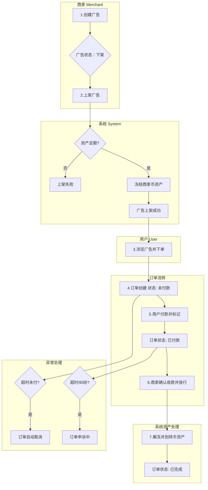
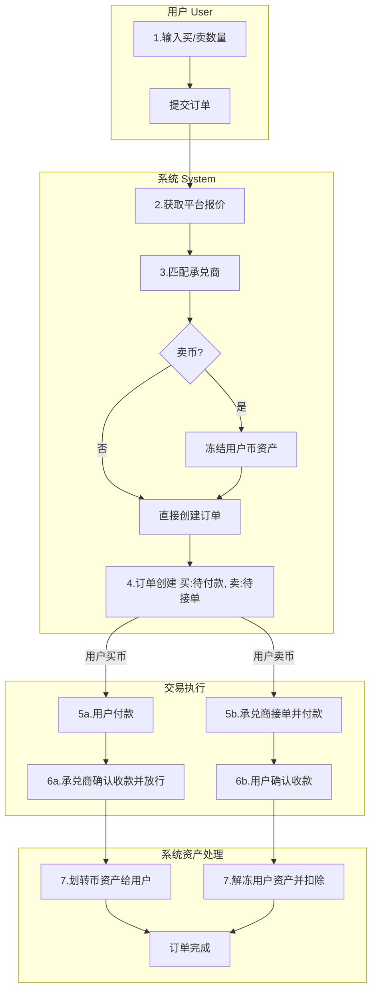
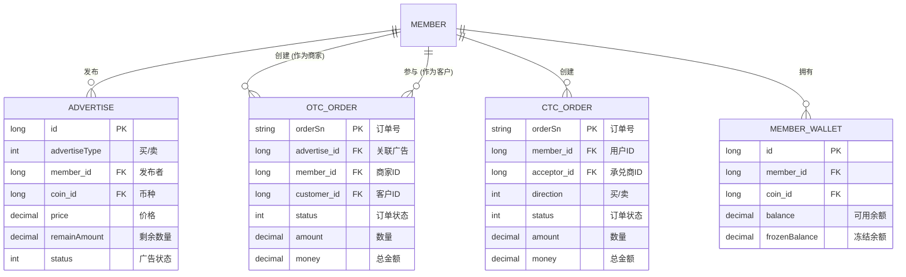

# 核心流程串讲 (三) - OTC 与 CTC 法币交易深度解析

## 1. 导言：法币交易的双轨模式

在数字资产交易生态中，法币通道是连接现实世界与加密世界的关键桥梁。本系统精心设计了两种并行的法币交易模式——OTC（Over-the-Counter）与 CTC（Customer-to-Customer），以满足不同用户的交易需求。本章将深入剖析这两种模式的设计哲学、业务流程、数据模型与技术实现，为您呈现一幅完整的法币交易全景图。

### 1.1. OTC (场外交易) - 自由的 C2C 市场

OTC 交易，即场外交易，构建了一个高度自由化的 **C2C（Customer-to-Customer）** 交易市场。它好比一个数字货币领域的“淘宝”，允许用户作为独立的“商家”或“顾客”，围绕“广告”这一核心概念进行点对点的交易。这种模式赋予了用户极大的灵活性，尤其适合经验丰富的交易者或有大额交易需求的用户。

- **核心特征**：由用户发布的“广告”驱动，价格由用户自主设定，交易对手方可在市场中自由选择。平台的核心职责在于信息撮合、资产托管（Escrow）及处理潜在的交易纠纷。
- **技术实现**：该模式的所有业务逻辑均由独立的 **`otc-api`** 微服务承载，体现了其作为一个独立、完整市场的架构定位。

### 1.2. CTC (快捷交易) - 便捷的“一键买卖”通道

CTC 交易，在本系统中，其实是一种更贴近 **B2C（Business-to-Customer）** 的简化交易模式。它旨在为新手用户或追求效率的用户提供一个“一键买卖”的便捷通道。用户无需关心复杂的市场广告和交易对手的选择，而是直接与平台指定的、信誉卓著的“承兑商”进行交易。

- **核心特征**：价格由平台参考外部市场价统一提供，交易对手是平台指定的承兑商。整个流程被简化为输入数量、确认支付即可，极大地降低了用户的操作门槛。
- **技术实现**：其业务逻辑被整合进了 **`ucenter-api`**（用户中心）微服务。这一设计决策表明，CTC 被视为用户账户的一项基础功能，而非一个独立的交易市场，强调的是其作为用户资产快速出入金工具的属性。

### 1.3. 模式对比

| 特性         | OTC (场外交易)                     | CTC (快捷交易)                     |
| :----------- | :--------------------------------- | :--------------------------------- |
| **业务模型** | 完全 C2C，用户间自由交易           | B2C 或 平台指定商家的 C2C          |
| **交易对手** | 普通用户、认证商家                 | 平台指定的承兑商                   |
| **价格机制** | 用户自主定价（固定或浮动）         | 平台参考市场价统一定价             |
| **用户体验** | 复杂，需筛选广告和商家             | 简单，一键买卖                     |
| **后端服务** | `otc-api` (独立市场服务)           | `ucenter-api` (用户核心功能)       |
| **适用场景** | 大额交易、专业用户、价格敏感型用户 | 小额交易、新手用户、追求效率的用户 |

---

## 2. 可视化业务流程

为了更直观地理解两种模式的运作方式，以下使用流程图展示其核心路径。

### 2.1. OTC 交易流程图

### 2.2. CTC 交易流程图

---

## 3. 核心数据模型

系统的核心业务实体围绕用户、广告和订单构建。

---

## 4. 操作指南与实现细节

### 4.1. OTC 交易操作指南

#### 4.1.1. 商家操作：从发布到收款

作为一名认证商家，您的核心操作是管理广告和处理订单。

1.  **发布广告 (`/advertise/create`)**:

    - **操作**: 在广告发布页面，您需要设定交易类型（买/卖）、币种、国家、价格（固定或浮动）、交易限额、支付方式和自动回复等。
    - **实现细节**: `AdvertiseController.java` 的 `create` 方法会进行严格的校验，包括您的商家身份、资金密码和支付方式是否已绑定。如果是卖币广告，系统会检查您的钱包余额。广告创建后，初始为“下架”状态。

2.  **上架广告 (`/advertise/on/shelves`)**:

    - **操作**: 在广告管理页，点击“上架”使您的广告对市场可见。
    - **实现细节**: `AdvertiseController.java` 的 `putOnShelves` 方法是关键。对于卖币广告，它会调用 `memberWalletService.freezeBalance()`，将广告涉及的币从您的“可用余额”转移到“冻结余额”，确保交易的可靠性。

3.  **处理订单**:
    - **操作**: 当有用户下单后，您会收到通知。如果是买币广告，您需等待对方付款；如果是卖币广告，您需在收到对方付款后，输入资金密码并点击“放行”。
    - **实现细节**: “放行”操作对应 `OrderController.java` 的 `confirmRelease` 方法。该方法在验证资金密码后，会调用 `memberWalletService.transfer()`，将冻结的币最终划转给买家，并更新订单状态为“已完成”。

#### 4.1.2. 用户操作：从下单到收币

作为普通用户，您的核心操作是寻找合适的广告并完成交易。

1.  **寻找并下单 (`/order/buy` 或 `/order/sell`)**:

    - **操作**: 在法币交易大厅，您可以根据币种、金额、支付方式等筛选广告。选择合适的广告后，输入您想交易的金额或数量，即可创建订单。
    - **实现细节**: `OrderController.java` 的 `buy` 或 `sell` 方法会处理您的请求。系统会锁定广告价格（防止市价波动影响）、检查交易是否在限额内，并从广告的剩余数量中扣除您下单的部分。如果是您卖币，您的币会被暂时冻结。

2.  **支付与查收**:
    - **操作**: 如果您是买家，创建订单后，您需要在规定时间内（如 15 分钟）向卖家提供的账户付款，并点击“我已付款”。之后等待卖家放行即可。如果您是卖家，等待买家付款后，您会收到通知，确认收款后即可放行。
    - **实现细节**: “我已付款”对应 `payOrder` 方法，它将订单状态推进到“已付款”。整个流程的状态机由 `OrderStatus` 枚举类严格管理，确保订单状态的正确流转。

### 4.2. CTC 交易操作指南

CTC 流程对用户极为友好。

1.  **一键下单 (`/ctc/new-ctc-order`)**:

    - **操作**: 在 CTC 交易页面，选择买入或卖出，输入数量，选择您的收款/付款方式，输入资金密码和短信验证码，即可提交。
    - **实现细节**: `CtcController.java` 的 `add` 方法是此流程的核心。
      1.  **获取价格**: 它会实时从 `market` 微服务获取一个公允的 USDT/CNY 汇率。
      2.  **匹配对手**: 自动选择一个在线的承兑商作为您的交易对手。
      3.  **创建订单**: 立即生成订单，并将承兑商的支付信息或您的收款信息预置在订单中。

2.  **完成交易**:
    - **操作**: 如果您是买家，向订单中显示的承兑商账户付款，并标记“我已付款”。承兑商后台确认后会立刻放行数字货币到您的钱包。如果您是卖家，只需等待承兑商向您付款，承兑商付款后，系统会自动完成后续的放币操作。
    - **实现细节**: 用户点击“我已付款”后，会触发 `payOrder` 方法，并向平台管理员和承兑商发送通知（邮件或短信），提醒他们尽快处理。承兑商的放行操作通常在 `admin` 后台完成，调用相应的服务完成资产划转。
