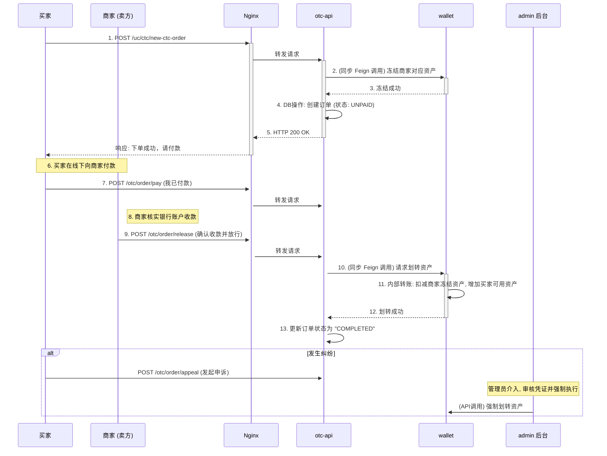
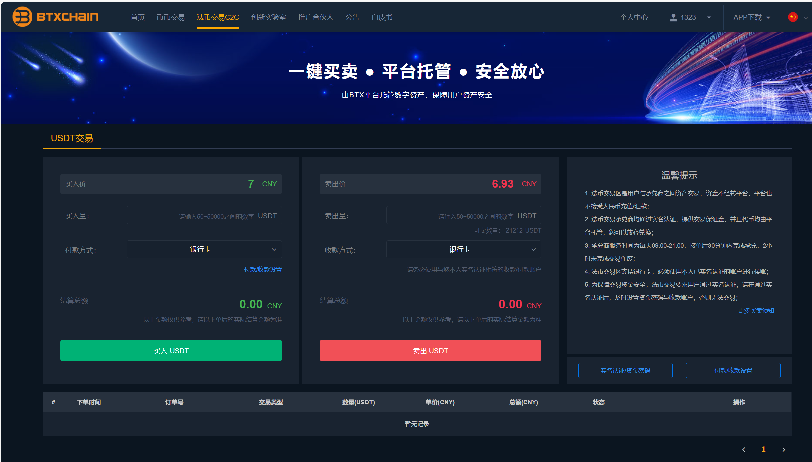

# 第二十一章：OTC 交易全解析

## 

在本章中，我们将完成核心业务流程的最后一块拼图，聚焦于OTC交易， 流程不仅涉及多个微服务的复杂协同，更对系统的安全性、可靠性和业务的严谨性提出了极高的要求。通过这个复杂流程，我们将把 `ucenter-api`, `wallet`, `otc-api`, `admin`, RPC 服务等几乎所有核心模块全部串联起来，形成对整个系统业务逻辑的宏观理解。

---

### 点对点的价值交换——OTC 交易流程

OTC 交易允许用户之间使用法币（如人民币、美元）买卖加密货币，平台在其中扮演**担保和仲裁**的关键角色，其核心是建立用户间的信任。

#### OTC 交易时序图

#### 交易详解

1.  **下单与资产锁定**
    当买家对商家的广告下单时，[`otc-api` 中的 `OrderController`](01_bizzan_framework/otc-api/src/main/java/com/bizzan/bitrade/controller/OrderController.java) 做的第一件、也是最重要的一件事，就是立即通过 **Feign** 同步调用 `wallet` 服务，**锁定（冻结）商家**账户中对应数量的资产。这是 OTC 交易的信任基石，确保了商家无法在交易过程中转移或卖出这部分资产。

2.  **链下支付与状态流转**
    资产锁定后，订单创建成功，状态变为 `UNPAID`（待付款）。买家此时可以安全地进行**链下支付**，即通过自己的网银或支付宝向商家转账。平台本身不触碰任何法币。买家完成付款并点击“我已付款”后，订单状态流转为 `PAID`（已付款），等待商家确认。

3.  **确认收款与资产释放**
    商家核实收款无误后，点击“确认收款并放行”。这个指令会再次通过 `otc-api` 调用 `wallet` 服务，执行一个**内部转账事务**：解冻并扣除商家的已锁定资产，同时增加到买家的可用账户中，订单状态最终变为 `COMPLETED`（已完成）。

4.  **申诉与仲裁**
    如果在商家确认收款环节发生纠纷，例如商家声称未收到款项，买家可以发起**申诉**。此时，订单将流转至 `admin` 后台的仲裁列表。平台客服会要求双方提供证据（如付款凭证截图），并依据证据做出裁决，甚至可以通过后台功能**强制将锁定的资产划转给买家**。这个仲裁机制是平台信用的最终体现，也是保障 C2C 交易安全的关键。

---

### **OTC (C2C) 交易：完整用户操作指南**

OTC（Over-the-Counter）或 C2C（Customer-to-Customer）交易，允许用户之间使用法币（如 CNY）直接买卖数字货币（如 USDT）。平台在此过程中扮演**资金托管和交易仲裁**的关键角色，确保双方的资产安全。

结合截图分析，此平台的 C2C 交易是**一键买卖模式**，即用户直接与平台认证的承兑商进行交易，而非在广告市场中自由选择交易对手。这简化了用户操作，增强了交易的可靠性。

#### **第一部分：交易前的数据准备工作**

在进行任何 C2C 交易之前，用户必须完成以下**四个关键步骤**的设置，以确保交易能够顺利进行。

1.  **完成实名认证 (KYC)**
    *   **操作路径**：通常在 `[个人中心]` -> `[身份认证]` 中。
    *   **为何必要**：这是平台风控和反洗钱的基础要求。必须使用本人实名认证的账户进行转账**，否则无法交易。

2.  **设置资金密码**
    *   **操作路径**：通常在 `[个人中心]` -> `[安全设置]` 中。
    *   **为何必要**：资金密码是独立于登录密码的第二层安全验证，用于所有涉及资产变动的操作（如交易、提币），是保护您账户资金安全的重要屏障。

3.  **绑定付款/收款方式**
    *   **操作路径**：点击 `[付款收款设置]` 按钮，或在 `[个人中心]` -> `[账户设置]` 中。
    *   **为何必要**：
        *   **作为买家**：您需要知道向谁付款。
        *   **作为卖家**：您需要指定一个收款账户（如银行卡、支付宝），以便买家向您转账。
    *   **关键注意**：绑定的收款账户开户名**必须与您的实名认证姓名完全一致**。

4.  **确保资产充足**
    *   **如果您是买家**：请确保您的银行卡或支付宝中有足够的法币（例如 CNY）来完成支付。
    *   **如果您是卖家**：请确保您的平台**资金账户**中有足够的数字货币（例如 USDT）可供出售。

#### **第二部分：用户操作指南 (以“买入USDT”为例)**

下面，我们将以一个完整的场景为例，说明普通用户 **(买家)** 如何从承兑商 **(卖家)** 手中购买 USDT。

**场景定义:**

*   **买家 (User A)**: 希望使用 CNY 购买 100 USDT。
*   **卖家 (平台承兑商)**: 在平台上有充足的 USDT 储备，并设置了收款方式。

---

**▶ 步骤一：买家进入 C2C 交易区并发起购买**

1.  **导航至 C2C 页面**: 在网站顶部导航栏，点击 **[法币交易 C2C]**，进入截图所示的交易界面。
2.  **填写购买表单**: 在页面左侧的 **[买入]** 区域进行操作：
    *   **买入价**: 价格由平台/承兑商预设（截图为 `7 CNY`），用户通常无需修改。
    *   **买入量**: 输入您希望购买的 USDT 数量，例如 `100`。系统会自动计算出需要支付的 `结算总额` (700 CNY)。
    *   **付款方式**: 选择您希望用来支付的银行卡。
3.  **下单**: 点击绿色的 **[买入 USDT]** 按钮。

*   **后台发生了什么？** (对应文档第1、2点)
    *   `otc-api` 服务立即通过 `Feign` **同步调用** `wallet` 服务。
    *   `wallet` 服务会**冻结**承兑商（卖家）账户中 `100 USDT` 的资产。这一步是交易的信任基石，确保卖家无法挪用这笔钱。
    *   资产冻结成功后，系统会创建一个状态为 **`UNPAID` (待付款)** 的订单。

---

**▶ 步骤二：买家进行线下付款并确认**

1.  **获取卖家收款信息**: 下单成功后，页面会跳转至订单详情页，显示承兑商的收款信息（如姓名、银行卡号、开户行）。
2.  **进行线下转账**:
    *   买家**必须**登录自己的手机银行或支付宝等工具，通过转账功能，将 `700 CNY` 转入卖家指定的账户。
    *   **极其重要**: **请勿在转账备注中填写任何与数字货币相关的信息（如 USDT, BTC 等）**，以免触发银行风控。
3.  **在平台确认付款**: 完成线下转账后，**必须**回到交易所的订单页面，点击 **[我已付款]** 按钮。

*   **后台发生了什么？**
    *   订单状态从 `UNPAID` (待付款) 流转为 **`PAID` (已付款)**。
    *   系统开始计时，等待卖家确认收款。

---

**▶ 步骤三：卖家确认收款并放行资产**

1.  **卖家核实收款**: 承兑商会收到订单状态变更的通知。他会登录自己的银行账户，**实际查看到账情况**。
2.  **确认并放行**: 在确认 `700 CNY` 已到账后，承兑商会在平台的订单页面点击 **[确认收款并放行]** 按钮。

*   **后台发生了什么？** (对应文档第3点)
    *   `otc-api` 再次调用 `wallet` 服务。
    *   `wallet` 服务执行一个**内部转账事务**：
        *   从承兑商的**冻结余额**中扣除 `100 USDT`。
        *   将 `100 USDT` 增加到买家 (User A) 的**可用余额**中。
    *   订单状态最终变为 **`COMPLETED` (已完成)**。

---

**▶ 步骤四：交易完成**

*   买家 (User A) 的资金账户中会收到 `100 USDT`。
*   整个 C2C 交易流程结束。

#### **关于“卖出 USDT”**

卖出流程与买入相反：
1.  用户在右侧 **[卖出]** 表单填写数量，下单。
2.  系统**冻结**该用户的 USDT。
3.  等待承兑商（买家）向您绑定的收款账户打款。
4.  您**确认收到法币**后，在平台点击 **[确认收款并放行]**。

#### **关于“申诉与仲裁” (安全保障)**

如果在“卖家确认收款”环节发生纠纷（例如，买家声称已付款，但卖家表示未收到），任何一方都可以发起**申诉**。此时平台客服将介入，要求双方提供付款凭证等证据进行**仲裁**，并有权根据证据强制执行资产划转，从而保障交易的公平和安全。

### 如何成为承兑商

好的，这个问题非常深入，直指 OTC 业务的核心——**商家管理**。要回答这个问题，我们需要深入代码，探寻承兑商（商家）在系统中的数据模型和准入流程。

我将分两部分为您解答：
1.  **承兑商涉及的核心数据表**：通过分析 `otc-api` 的实体类（Entity），我们可以精确地找出与商家相关的数据库表。
2.  **如何成为承兑商**：通过分析前端 `IdentBusiness.vue` 页面及其调用的后端接口，我们可以梳理出完整的申请和认证流程。

---

### **第一部分：承兑商涉及的核心数据表**

通过对 `otc-api` 微服务的代码进行分析，与承兑商（商家）功能紧密相关的核心数据表主要有以下几张。这些表定义在 `01_bizzan_framework/otc-api/src/main/java/com/bizzan/bitrade/entity/` 路径下。

1.  **`business_auth_apply` (商家认证申请表)**
    *   **对应实体类**: [`BusinessAuthApply.java`](01_bizzan_framework/otc-api/src/main/java/com/bizzan/bitrade/entity/BusinessAuthApply.java)
    *   **作用**: 存储普通用户提交的“成为认证商家”的申请记录。包含了申请人信息、联系方式、申请状态（待审核、通过、驳回）以及审核意见等。这是商家认证流程的起点。

2.  **`business_auth_deposit` (商家认证保证金表)**
    *   **对应实体类**: [`BusinessAuthDeposit.java`](01_bizzan_framework/otc-api/src/main/java/com/bizzan/bitrade/entity/BusinessAuthDeposit.java)
    *   **作用**: 记录认证商家缴纳的保证金信息。平台通常会要求商家质押一定数量的平台币或稳定币作为信用保证金，这张表就用来管理这些保证金的记录。

3.  **`advertise` (广告表)**
    *   **对应实体类**: [`Advertise.java`](01_bizzan_framework/otc-api/src/main/java/com/bizzan/bitrade/entity/Advertise.java)
    *   **作用**: 存储商家发布的 OTC 交易广告。虽然我们之前看到的 C2C 页面是“一键买卖”，但其底层逻辑仍然是平台或指定承兑商预先发布了“购买”和“出售”的广告，用户是与这些广告进行交易。这张表包含了广告类型（买/卖）、价格、数量、支付方式等核心信息。

4.  **`otc_coin` (OTC 币种表)**
    *   **对应实体类**: [`OtcCoin.java`](01_bizzan_framework/otc-api/src/main/java/com/bizzan/bitrade/entity/OtcCoin.java)
    *   **作用**: 配置哪些数字货币可以在 OTC 区进行交易。它定义了币种单位、交易门槛（最小/最大交易量）、手续费等规则。商家只能发布这里已配置的币种的广告。

**关联关系总结**：
一个用户首先在 `business_auth_apply` 中提交申请，申请通过后，需要在 `business_auth_deposit` 中缴纳保证金，才能正式成为商家。成为商家后，他们可以在 `otc_coin` 表允许的范围内，在 `advertise` 表中创建自己的买卖广告，从而参与到 OTC 交易中。用户的会员信息则存储在 `member` 表（位于 `ucenter-api`）中，通过 `member_id` 与这些表进行关联。

---

### **第二部分：如何成为承兑商 (申请流程)**

成为承兑商并非自动完成，而是一个需要用户主动申请并由平台后台管理员审核的严谨流程。

**前端入口**: [`05_Web_Front_too/05_Web_Front_too/src/pages/uc/IdentBusiness.vue`](05_Web_Front_too/05_Web_Front_too/src/pages/uc/IdentBusiness.vue)

这个 Vue 组件就是用户申请成为认证商家的界面。

**完整申请流程如下：**

1.  **前提条件检查**:
    *   用户必须已登录。
    *   用户必须已完成**实名认证 (KYC)**。
    *   用户的账户状态必须正常。

2.  **用户提交申请**:
    *   用户在 `IdentBusiness.vue` 页面会看到一个申请表单。
    *   表单中需要填写或上传**个人/公司资料**，例如电话、QQ、微信以及手持身份证照片等（具体字段取决于 `BusinessAuthApply` 实体的定义）。
    *   用户填写完毕后，点击“提交”按钮。前端会调用后端接口，将申请信息写入 `business_auth_apply` 表，状态为“待审核”。

3.  **后台管理员审核**:
    *   平台管理员会在**后台管理系统**（`04_bizzan_web_admin` 项目）中看到这条新的商家认证申请。
    *   管理员会根据用户提交的资料进行审核，判断其是否符合平台对承兑商的要求（如资金实力、信用记录等）。
    *   管理员做出裁决：**“审核通过”** 或 **“审核驳回”**，并更新 `business_auth_apply` 表中的记录状态。

4.  **缴纳保证金**:
    *   如果申请被**审核通过**，用户会收到通知。
    *   此时，用户需要按照平台的要求，向指定地址转入约定数量的数字货币作为**保证金**。
    *   这笔保证金的记录会由系统或管理员添加到 `business_auth_deposit` 表中。

5.  **获得商家资格**:
    *   一旦平台确认收到保证金，该用户的**商家状态**就会被激活（通常是在 `member` 表中有一个字段，如 `member_level` 或 `is_business` 被更新）。
    *   至此，该用户就正式成为平台的认证承兑商。他们可以开始在 OTC 区发布广告，处理来自普通用户的买卖订单。

这个流程确保了只有经过平台严格审核和具备一定经济实力的用户才能成为承兑商，从而最大限度地保障了 OTC 交易的安全性。

