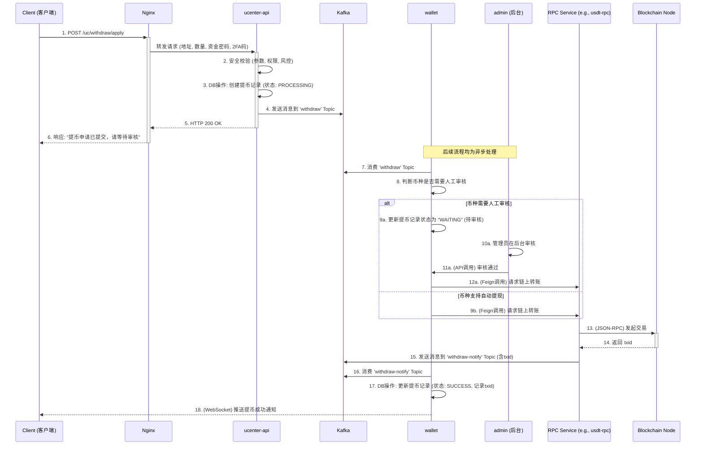
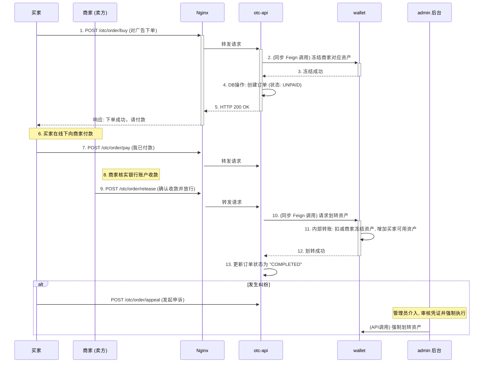

# 第二十一章：资金的旅程——提币与 OTC 交易全解析

## 开篇：贯通资金流转的最后一公里

在本章中，我们将完成核心业务流程的最后一块拼图，聚焦于资金的“出口”——**提币**，以及平台内 C2C 交易的核心——**OTC 交易**。这两个流程不仅涉及多个微服务的复杂协同，更对系统的安全性、可靠性和业务的严谨性提出了极高的要求。通过这两个复杂流程，我们将把 `ucenter-api`, `wallet`, `otc-api`, `admin`, RPC 服务等几乎所有核心模块全部串联起来，形成对整个系统业务逻辑的宏观理解。

---

### 第一节：资产的离港之旅——用户提币流程

提币，是将用户在交易所的中心化账本资产，真实地转移到区块链网络上的过程。这趟旅程采用**异步化**和**事件驱动**的架构，在保证资金安全的前提下，实现了服务解耦和高可靠性。

#### 提币之旅的异步时序图

#### 旅程详解

1.  **提交申请 (`ucenter-api`)**
    一切始于用户在客户端的提币请求。[`WithdrawController`](01_bizzan_framework/ucenter-api/src/main/java/com/bizzan/bitrade/controller/WithdrawController.java) 作为入口，会进行严格的安全校验，包括资金密码、2FA验证码、提币地址合法性、账户状态和基础风控规则。
    校验通过后，`ucenter-api` 会在数据库中创建一条状态为 `PROCESSING` 的提币记录，然后立即向 Kafka 的 `withdraw` 主题发送一条消息，并将“申请成功”的响应返回给用户。**整个同步过程到此结束，应用层与核心业务完全解耦。**

2.  **异步处理 (`wallet`)**
    [`wallet` 服务中的 `FinanceConsumer`](01_bizzan_framework/wallet/src/main/java/com/bizzan/bitrade/consumer/FinanceConsumer.java) 是提币流程的核心调度者。它监听 `withdraw` 主题，收到消息后，会根据该币种的配置判断是否支持**自动提现**。
    *   **需要人工审核**：如果币种配置为需要审核（通常用于大额或高风险提币），`FinanceConsumer` 会将提币记录状态更新为 `WAITING`，静待 `admin` 后台的审批。管理员审核通过后，会通过 API 调用 `wallet` 服务，触发后续的链上转账。
    *   **支持自动提现**：如果币种支持自动提现，`FinanceConsumer` 会直接进入下一步。

3.  **链上广播 (`RPC Service`)**
    无论是自动提现还是审核通过，最终都会由 `wallet` 服务通过 **Feign** 调用相应币种的 **RPC 服务**（如 `usdt-rpc`）的 `/rpc/withdraw` 接口。RPC 服务负责构建、签名并将交易广播到区块链网络，然后从节点获取到交易ID (`txid`)。

4.  **结果通知与状态更新 (`wallet`)**
    RPC 服务完成广播后，会向 Kafka 的 `withdraw-notify` 主题发送一条包含 `txid` 和最终状态的消息。`FinanceConsumer` 再次监听到这条消息，根据结果将提币记录的最终状态更新为 `SUCCESS` 或 `FAIL`，并记录下 `txid`。最后，通过 WebSocket 向用户推送最终的提币结果。

---

### 第二节：点对点的价值交换——OTC 交易流程

OTC 交易允许用户之间使用法币（如人民币、美元）买卖加密货币，平台在其中扮演**担保和仲裁**的关键角色，其核心是建立用户间的信任。

#### OTC 交易时序图

#### 交易详解

1.  **下单与资产锁定**
    当买家对商家的广告下单时，[`otc-api` 中的 `OrderController`](01_bizzan_framework/otc-api/src/main/java/com/bizzan/bitrade/controller/OrderController.java) 做的第一件、也是最重要的一件事，就是立即通过 **Feign** 同步调用 `wallet` 服务，**锁定（冻结）商家**账户中对应数量的资产。这是 OTC 交易的信任基石，确保了商家无法在交易过程中转移或卖出这部分资产。

2.  **链下支付与状态流转**
    资产锁定后，订单创建成功，状态变为 `UNPAID`（待付款）。买家此时可以安全地进行**链下支付**，即通过自己的网银或支付宝向商家转账。平台本身不触碰任何法币。买家完成付款并点击“我已付款”后，订单状态流转为 `PAID`（已付款），等待商家确认。

3.  **确认收款与资产释放**
    商家核实收款无误后，点击“确认收款并放行”。这个指令会再次通过 `otc-api` 调用 `wallet` 服务，执行一个**内部转账事务**：解冻并扣除商家的已锁定资产，同时增加到买家的可用账户中，订单状态最终变为 `COMPLETED`（已完成）。

4.  **申诉与仲裁**
    如果在商家确认收款环节发生纠纷，例如商家声称未收到款项，买家可以发起**申诉**。此时，订单将流转至 `admin` 后台的仲裁列表。平台客服会要求双方提供证据（如付款凭证截图），并依据证据做出裁决，甚至可以通过后台功能**强制将锁定的资产划转给买家**。这个仲裁机制是平台信用的最终体现，也是保障 C2C 交易安全的关键。