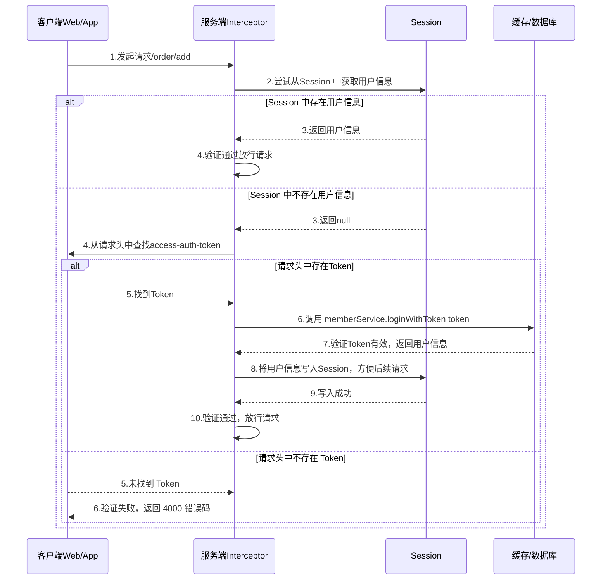
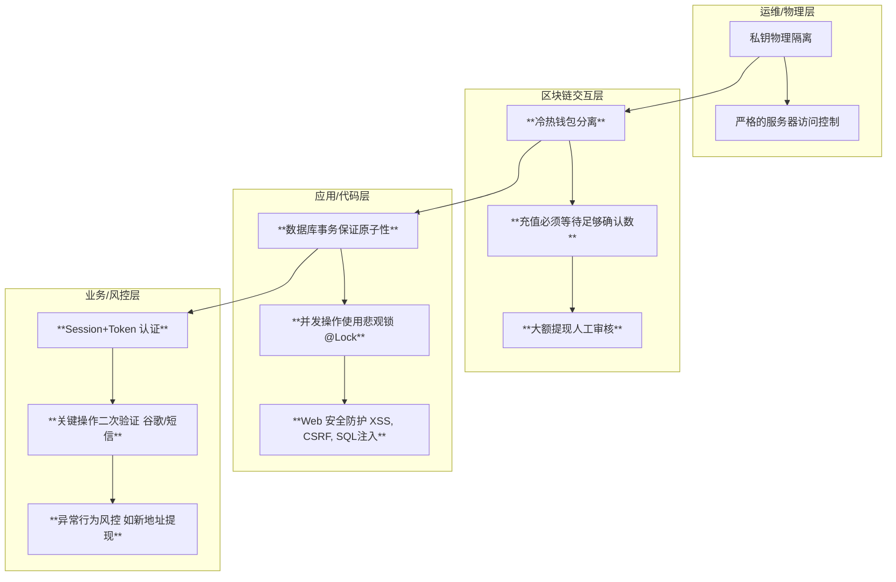

# 第二十二章：安全专题：Session、防刷与资金安全（精讲版）

## 开篇：金融系统的生命线

对于一个处理真金白银的金融系统而言，**安全**永远是排在第一位的，它是一切功能的基石。任何一个微小的安全疏忽，都可能导致灾难性的后果。

本章，我们将作为一个安全工程师，重新审视我们的系统，全面梳理和总结在保障系统安全方面所做的关键设计和实践。我们将重点聚焦于三个核心领域：

1.  **API 接口安全**：如何确保与我们对话的是合法的用户？
2.  **业务逻辑安全**：如何防止系统被滥用和攻击？
3.  **资金安全**：如何构建一个纵深防御体系来保障用户的每一分钱？

---

### 22.1 API 接口安全：Session 与 Token 认证

对于所有需要登录后才能访问的接口（如交易、查询资产），我们必须有一套可靠的机制来识别用户身份。本项目采用的是业界主流的 **`Session` + `Token`** 双重认证机制。

**认证流程图**：



**源码剖析 - 认证拦截器 (`MemberInterceptor.java`)**

在 `exchange-api` 等多个需要登录的模块中，认证逻辑都是通过 `core` 模块提供的 `MemberInterceptor` 拦截器实现的。

```java
// 源码路径: core/src/main/java/com/bizzan/bitrade/interceptor/MemberInterceptor.java

@Slf4j
public class MemberInterceptor implements HandlerInterceptor {

    @Override
    public boolean preHandle(HttpServletRequest request, HttpServletResponse response, Object handler)
            throws Exception {
        // 1. 优先从 Session 获取用户信息
        HttpSession session = request.getSession();
        AuthMember user = (AuthMember) session.getAttribute(SysConstant.SESSION_MEMBER);

        if (user != null) {
            // Session 中存在，直接放行
            return true;
        } else {
            // 2. Session 中不存在，尝试从请求头获取 Token
            String token = request.getHeader("access-auth-token");
            log.info("token:{}", token);

            // 3. 通过 Token 登录
            //    (此处动态获取 Service，因为 Interceptor 是 new 出来的，无法直接 @Autowired)
            BeanFactory factory = WebApplicationContextUtils.getRequiredWebApplicationContext(request.getServletContext());
            MemberService memberService = (MemberService) factory.getBean("memberService");
            Member member = memberService.loginWithToken(token, request.getRemoteAddr(), "");

            if (member != null) {
                // 4. Token 验证成功，将用户信息重新写入 Session
                memberEvent.onLoginSuccess(member, request.getRemoteAddr());
                session.setAttribute(SysConstant.SESSION_MEMBER, AuthMember.toAuthMember(member));
                return true;
            } else {
                // 5. Token 验证失败，拒绝访问
                ajaxReturn(response, 4000, "当前登录状态过期，请您重新登录！");
                return false;
            }
        }
    }
    // ... (省略 postHandle, afterCompletion, ajaxReturn 等方法) ...
}
```

---

### 22.2 业务逻辑安全：防刷与反攻击

对于发送短信/邮件验证码这类消耗资源且易被攻击的接口，必须进行频率限制。

**核心思想**：通过 **AOP (面向切面编程)** 和 **Redis**，对指定的方法进行拦截，实现基于 **Session ID** 的频率控制。

**源码剖析 - `AntiAttackAspect.java`**

```java
// 源码路径: ucenter-api/src/main/java/com/bizzan/bitrade/aspect/AntiAttackAspect.java

@Aspect
@Component
public class AntiAttackAspect {
    @Autowired
    private RedisTemplate redisTemplate;

    // 1. 定义切点：硬编码拦截了多个 Controller 中的方法
    @Pointcut("execution(public * com.bizzan.bitrade.controller.RegisterController.sendBindEmail(..))" +
            "||execution(public * com.bizzan.bitrade.controller.SmsController.sendResetTransactionCode(..))" +
            "|| ... (省略其他方法) ...")
    public void antiAttack() {}

    @Before("antiAttack()")
    public void doBefore(JoinPoint joinPoint) throws Throwable {
        // 2. 获取 Session ID 作为防刷的 key
        ServletRequestAttributes attributes = (ServletRequestAttributes) RequestContextHolder.getRequestAttributes();
        HttpServletRequest request = attributes.getRequest();
        String key = SysConstant.ANTI_ATTACK_ + request.getSession().getId();

        // 3. 检查 Redis 中是否存在该 key
        Object code = redisTemplate.opsForValue().get(key);
        if (code != null) {
            // 如果存在，说明一分钟内已请求过，抛出异常
            throw new IllegalArgumentException("请求过于频繁");
        }
    }

    @AfterReturning(pointcut = "antiAttack()")
    public void doAfterReturning() throws Throwable {
        // 4. 在方法成功返回后，将 Session ID 写入 Redis，并设置 1 分钟过期
        ServletRequestAttributes attributes = (ServletRequestAttributes) RequestContextHolder.getRequestAttributes();
        HttpServletRequest request = attributes.getRequest();
        String key = SysConstant.ANTI_ATTACK_ + request.getSession().getId();
        redisTemplate.opsForValue().set(key, "send sms all too often", 1, TimeUnit.MINUTES);
    }
}
```

**总结**：此防刷机制并非一个通用的注解式组件，而是针对“发送验证码”这一特定场景、基于 Session 的硬编码实现，主要用于防止**已登录用户**的恶意或重复操作。

---

### 22.3 资金安全：纵深防御体系

资金安全必须建立一个“层层设防、环环相扣”的纵深防御体系。



**核心防御措施回顾**：

- **冷热钱包分离 (架构核心)**：绝大部分资产离线存储，从根本上杜绝了网络黑客大规模盗币的可能。
- **充值确认数 (防双花)**：`Watcher` 在确认充值前，必须等待足够的区块确认，防止因区块重组导致交易所的损失。
- **提现人工审核 (最后一道防线)**：对于触发风控规则（如大额、新地址）的提现，引入人工审核，这是阻止异常提现的最后一道、也是最有效的一道防线。
- **数据库悲观锁 (防并发)**：在 `wallet` 服务中，所有修改余额的操作都使用了 `@Lock(LockModeType.PESSIMISTIC_WRITE)`，通过数据库行锁，确保了在高并发下资金计算的绝对准确。

---

## 总结

在本章中，我们系统性地学习了交易所的安全体系：

- 通过 **Session + Token 机制**，并由 `MemberInterceptor` 统一拦截，保证了接口访问的身份认证。
- 通过 **AOP 切面**实现了针对特定业务的**防刷**组件，有效防止了验证码接口被滥用。
- 构建了以**冷热钱包分离**为核心，辅以**提现审核**、**数据库锁**和**充值确认数**的**资金安全纵深防御体系**。

掌握了这些安全设计的思想和实践，我们构建的系统才不仅仅是一个功能强大的空中楼阁，而是一个坚实可靠的金融堡垒。
