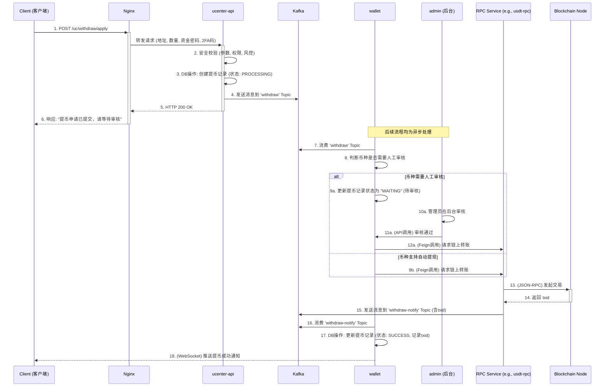
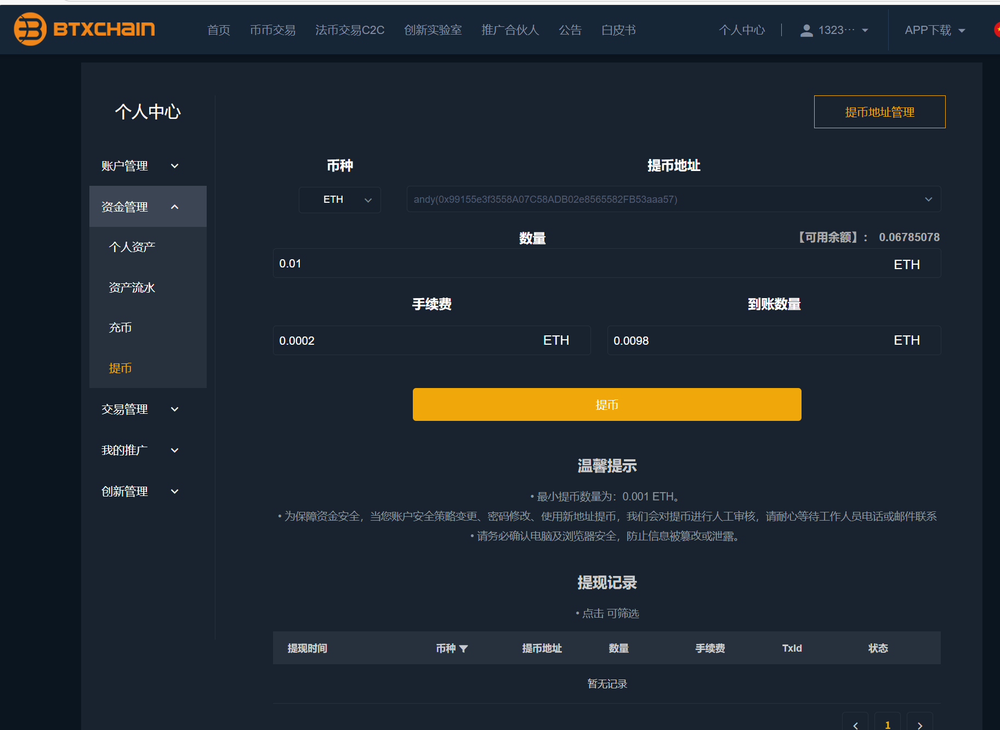
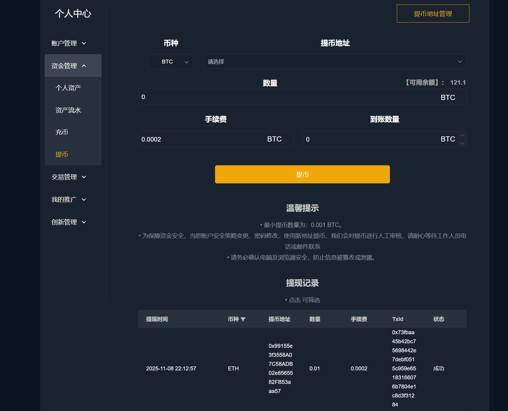

# 第二十二章：提币

## 开篇：贯通资金流转的最后一公里

在本章中，我们将完成核心业务流程的最后一块拼图，聚焦于资金的“出口”——**提币**， 流程不仅涉及多个微服务的复杂协同，更对系统的安全性、可靠性和业务的严谨性提出了极高的要求。通过这个复杂流程，我们将把 `ucenter-api`, `wallet`, `otc-api`, `admin`, RPC 服务等几乎所有核心模块全部串联起来，形成对整个系统业务逻辑的宏观理解。

---

### 用户提币流程

提币，是将用户在交易所的中心化账本资产，真实地转移到区块链网络上的过程。这趟旅程采用**异步化**和**事件驱动**的架构，在保证资金安全的前提下，实现了服务解耦和高可靠性。

#### 提币之旅的异步时序图

#### 详解

1.  **提交申请 (`ucenter-api`)**
    一切始于用户在客户端的提币请求。[`WithdrawController`](01_bizzan_framework/ucenter-api/src/main/java/com/bizzan/bitrade/controller/WithdrawController.java) 作为入口，会进行严格的安全校验，包括资金密码、2FA验证码、提币地址合法性、账户状态和基础风控规则。
    校验通过后，`ucenter-api` 会在数据库中创建一条状态为 `PROCESSING` 的提币记录，然后立即向 Kafka 的 `withdraw` 主题发送一条消息，并将“申请成功”的响应返回给用户。**整个同步过程到此结束，应用层与核心业务完全解耦。**

2.  **异步处理 (`wallet`)**
    [`wallet` 服务中的 `FinanceConsumer`](01_bizzan_framework/wallet/src/main/java/com/bizzan/bitrade/consumer/FinanceConsumer.java) 是提币流程的核心调度者。它监听 `withdraw` 主题，收到消息后，会根据该币种的配置判断是否支持**自动提现**。
    *   **需要人工审核**：如果币种配置为需要审核（通常用于大额或高风险提币），`FinanceConsumer` 会将提币记录状态更新为 `WAITING`，静待 `admin` 后台的审批。管理员审核通过后，会通过 API 调用 `wallet` 服务，触发后续的链上转账。
    *   **支持自动提现**：如果币种支持自动提现，`FinanceConsumer` 会直接进入下一步。

3.  **链上广播 (`RPC Service`)**
    无论是自动提现还是审核通过，最终都会由 `wallet` 服务通过 **Feign** 调用相应币种的 **RPC 服务**（如 `usdt-rpc`）的 `/rpc/withdraw` 接口。RPC 服务负责构建、签名并将交易广播到区块链网络，然后从节点获取到交易ID (`txid`)。

4.  **结果通知与状态更新 (`wallet`)**
    RPC 服务完成广播后，会向 Kafka 的 `withdraw-notify` 主题发送一条包含 `txid` 和最终状态的消息。`FinanceConsumer` 再次监听到这条消息，根据结果将提币记录的最终状态更新为 `SUCCESS` 或 `FAIL`，并记录下 `txid`。最后，通过 WebSocket 向用户推送最终的提币结果。

---

