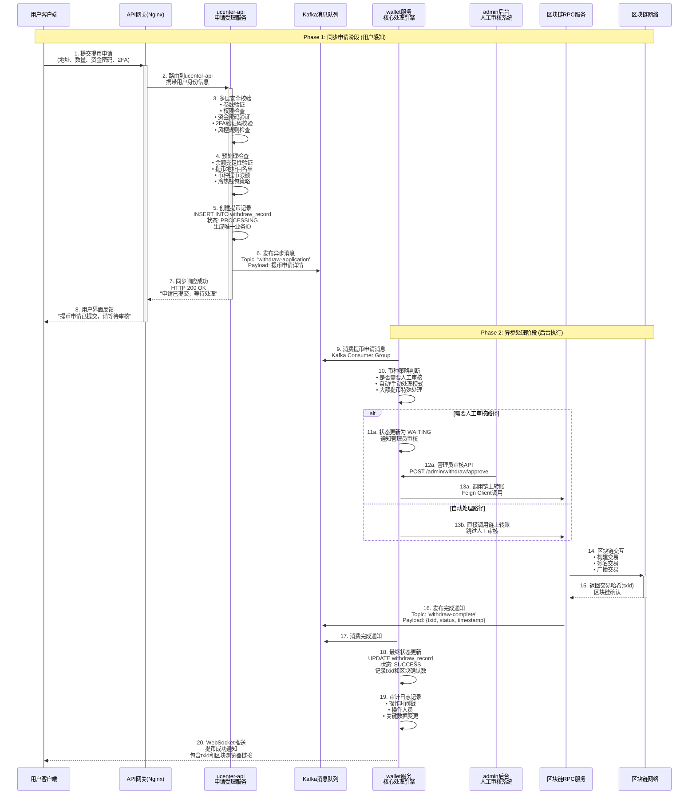
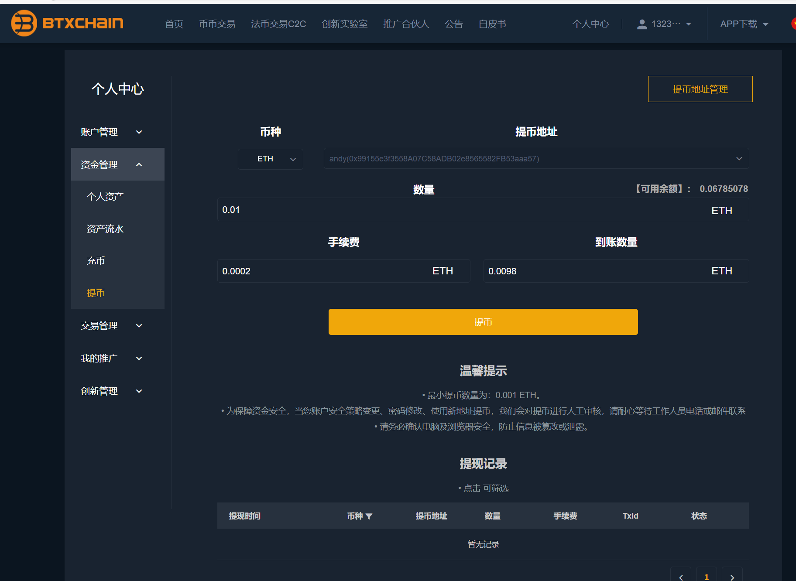
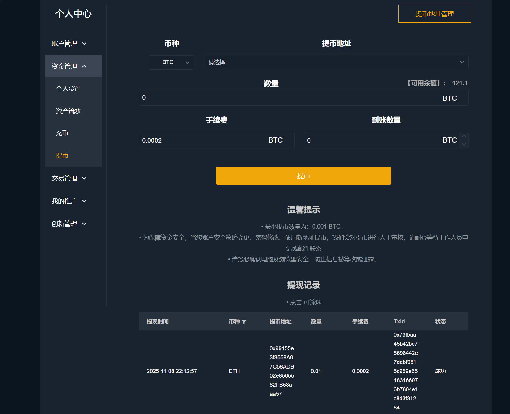

# 提币流程：资金出口的安全架构与技术实现

## 引言：数字资产提币的技术挑战与系统设计

提币是数字资产交易系统的**资金出口**，也是整个业务流程中技术复杂度最高、安全要求最严格的环节。这个看似简单的"用户提现"操作，实际上涉及**多层安全验证、跨链交互、异步处理、状态同步**等复杂技术挑战，是检验一个交易所技术实力的重要标准。

**提币系统的核心技术挑战**

1. **资产安全优先**：提币是不可逆的操作，任何错误都可能导致直接的资金损失
2. **多链复杂性**：需要支持比特币、以太坊、USDT(OMNI/ERC20)等多种区块链协议
3. **异步协调困难**：多个微服务之间的状态同步和错误处理极其复杂
4. **高性能要求**：在保证安全的前提下，需要提供快速的用户体验
5. **监管合规压力**：需要满足AML监管要求，支持可疑交易监控
6. **系统可靠性**：7x24小时稳定运行，容错和恢复能力至关重要

**架构设计的核心原则**

面对这些挑战，系统采用了**"安全优先、异步解耦、分层验证"**的架构设计原则：

- **安全优先**：多重验证机制，包括资金密码、2FA、地址白名单、风控规则等
- **异步解耦**：通过Kafka消息队列实现服务间解耦，提升系统可用性和扩展性
- **分层验证**：从前端到区块链，设置多重验证关卡，确保每一步操作的安全
- **状态可追溯**：完整的状态机管理和审计日志，支持问题排查和合规审计

**提币流程的技术价值**

深入分析提币流程具有重要的技术学习价值：

1. **分布式系统设计**：学习如何在多个微服务间协调复杂业务流程
2. **异步架构模式**：理解如何通过事件驱动实现系统解耦和性能优化
3. **区块链集成技术**：掌握如何安全可靠地与多种区块链网络交互
4. **安全最佳实践**：了解金融级系统的安全防护和风控机制
5. **状态机设计模式**：学习如何管理复杂业务状态的生命周期

通过对提币流程的深入分析，我们将完整理解现代数字资产交易系统的**资金流转全貌**，掌握构建安全可靠金融服务系统的核心技术。

---

## 异步架构的提币流程：从申请到链上确认

### 系统架构的技术实现

提币流程采用了**事件驱动的异步架构**，这种设计确保了系统的高可用性和可扩展性。整个流程可以分为两个主要阶段：**同步申请阶段**和**异步处理阶段**。


```mermaid
sequenceDiagram
    participant U as 用户客户端
    participant G as API网关(Nginx)
    participant UC as ucenter-api<br/>申请受理服务
    participant K as Kafka消息队列
    participant W as wallet服务<br/>核心处理引擎
    participant A as admin后台<br/>人工审核系统
    participant RPC as 区块链RPC服务
    participant BC as 区块链网络

    Note over U,BC: Phase 1: 同步申请阶段 (用户感知)

    U->>+G: 1. 提交提币申请<br/>(地址、数量、资金密码、2FA)
    G->>+UC: 2. 路由到ucenter-api<br/>携带用户身份信息

    UC->>UC: 3. 多层安全校验<br/>• 参数验证<br/>• 权限检查<br/>• 资金密码验证<br/>• 2FA验证码校验<br/>• 风控规则检查

    UC->>UC: 4. 预处理检查<br/>• 余额充足性验证<br/>• 提币地址白名单<br/>• 币种提币限额<br/>• 冷热钱包策略

    UC->>UC: 5. 创建提币记录<br/>INSERT INTO withdraw_record<br/>状态: PROCESSING<br/>生成唯一业务ID

    UC->>K: 6. 发布异步消息<br/>Topic: 'withdraw-application'<br/>Payload: 提币申请详情

    UC-->>-G: 7. 同步响应成功<br/>HTTP 200 OK<br/>"申请已提交，等待处理"
    G-->>-U: 8. 用户界面反馈<br/>"提币申请已提交，请等待审核"

    Note over W,BC: Phase 2: 异步处理阶段 (后台执行)

    W->>+K: 9. 消费提币申请消息<br/>Kafka Consumer Group

    W->>W: 10. 币种策略判断<br/>• 是否需要人工审核<br/>• 自动/手动处理模式<br/>• 大额提币特殊处理

    alt 需要人工审核路径
        W->>W: 11a. 状态更新为 WAITING<br/>通知管理员审核

        A->>+W: 12a. 管理员审核API<br/>POST /admin/withdraw/approve

        W->>+RPC: 13a. 调用链上转账<br/>Feign Client调用
    else 自动处理路径
        W->>+RPC: 13b. 直接调用链上转账<br/>跳过人工审核
    end

    RPC->>+BC: 14. 区块链交互<br/>• 构建交易<br/>• 签名交易<br/>• 广播交易

    BC-->>-RPC: 15. 返回交易哈希(txid)<br/>区块链确认

    RPC->>+K: 16. 发布完成通知<br/>Topic: 'withdraw-complete'<br/>Payload: {txid, status, timestamp}

    W->>+K: 17. 消费完成通知

    W->>W: 18. 最终状态更新<br/>UPDATE withdraw_record<br/>状态: SUCCESS<br/>记录txid和区块确认数

    W->>W: 19. 审计日志记录<br/>• 操作时间戳<br/>• 操作人员<br/>• 关键数据变更

    W-->>U: 20. WebSocket推送<br/>提币成功通知<br/>包含txid和区块浏览器链接
```

### 核心技术实现详解

**第一阶段：同步申请的安全保障**

同步阶段的核心是**安全性和用户体验的平衡**。系统在用户等待时间内完成所有必要的安全检查：

```java
@RestController
@RequestMapping("/uc/withdraw")
public class WithdrawController {

    @PostMapping("/apply")
    @RateLimit(requests = 5, window = 60) // 限流保护
    public MessageResult applyWithdraw(
            @RequestBody @Valid WithdrawRequest request,
            @RequestHeader("Authorization") String token) {

        // 1. 身份验证和权限检查
        Member member = memberService.getMemberByToken(token);
        validateMemberStatus(member);

        // 2. 多因子安全验证
        validateFundPassword(member, request.getFundPassword());
        validate2FACode(member, request.getTwoFactorCode());

        // 3. 风控规则检查
        RiskControlResult riskResult = riskControlService.check(member, request);
        if (!riskResult.isPassed()) {
            throw new BusinessException("触发风控规则: " + riskResult.getReason());
        }

        // 4. 地址安全检查
        validateWithdrawAddress(member, request.getAddress());

        // 5. 余额和限额检查
        validateBalanceAndLimit(member, request);

        // 6. 创建提币记录
        WithdrawRecord record = createWithdrawRecord(member, request);
        withdrawRecordService.save(record);

        // 7. 发布异步处理消息
        publishWithdrawApplication(record);

        return success("提币申请已提交，请等待审核");
    }
}
```

**第二阶段：异步处理的可靠性设计**

异步阶段通过Kafka消息队列实现服务解耦，确保即使某个服务临时不可用，提币申请也不会丢失：

```java
@Component
public class WithdrawProcessor {

    @KafkaListener(topics = "withdraw-application",
                   containerFactory = "withdrawKafkaListenerContainerFactory")
    public void processWithdrawApplication(WithdrawApplicationMessage message) {

        try {
            // 1. 消息幂等性检查
            if (isMessageProcessed(message.getId())) {
                log.info("重复消息，已跳过处理: {}", message.getId());
                return;
            }

            // 2. 币种策略判断
            Coin coin = coinService.findByUnit(message.getCoinUnit());
            ProcessStrategy strategy = getProcessStrategy(coin);

            // 3. 执行相应的处理策略
            switch (strategy) {
                case AUTO:
                    processAutoWithdraw(message);
                    break;
                case MANUAL:
                    processManualWithdraw(message);
                    break;
                case HIGH_VALUE:
                    processHighValueWithdraw(message);
                    break;
            }

            // 4. 标记消息已处理
            markMessageProcessed(message.getId());

        } catch (Exception e) {
            log.error("提币处理失败: {}", message.getId(), e);
            // 触发告警和重试机制
            alertService.sendAlert("提币处理异常", message, e);
            throw new WithdrawProcessException("提币处理失败", e);
        }
    }
}
```

### 关键技术组件深度解析

#### 1. 申请受理服务 (ucenter-api)：安全第一道防线

**安全验证的多重防护机制**

```java
@Service
public class WithdrawSecurityService {

    /**
     * 多维度安全验证
     */
    public SecurityValidationResult validateWithdraw(Member member, WithdrawRequest request) {

        // 第一层：基础身份验证
        if (!validateMemberIdentity(member)) {
            return SecurityValidationResult.fail("用户身份验证失败");
        }

        // 第二层：多因子认证
        if (!validateMultiFactorAuth(member, request)) {
            return SecurityValidationResult.fail("多因子认证失败");
        }

        // 第三层：地址安全检查
        AddressValidationResult addressResult = validateWithdrawAddress(request.getAddress());
        if (!addressResult.isValid()) {
            return SecurityValidationResult.fail("提币地址验证失败: " + addressResult.getReason());
        }

        // 第四层：风控规则检查
        RiskControlResult riskResult = riskControlEngine.evaluate(member, request);
        if (riskResult.isBlocked()) {
            return SecurityValidationResult.fail("触发风控规则: " + riskResult.getBlockReason());
        }

        // 第五层：业务规则验证
        BusinessRuleResult businessResult = validateBusinessRules(member, request);
        if (!businessResult.isValid()) {
            return SecurityValidationResult.fail("业务规则验证失败: " + businessResult.getReason());
        }

        return SecurityValidationResult.success();
    }

    /**
     * 地址安全检查 - 支持多种区块链
     */
    private AddressValidationResult validateWithdrawAddress(String address) {
        // 1. 地址格式验证
        if (!isValidAddressFormat(address)) {
            return AddressValidationResult.fail("地址格式无效");
        }

        // 2. 黑名单检查
        if (isBlacklistedAddress(address)) {
            return AddressValidationResult.fail("地址在黑名单中");
        }

        // 3. 币种特定验证
        Coin coin = coinService.findByUnit(getCoinFromAddress(address));
        if (!isValidAddressForCoin(address, coin)) {
            return AddressValidationResult.fail("地址与币种不匹配");
        }

        // 4. 智能合约地址检查（ERC20代币）
        if (coin.getTokenProtocol() == TokenProtocol.ERC20) {
            if (isContractAddress(address) && !isWhitelistedContract(address)) {
                return AddressValidationResult.fail("不允许向智能合约地址转账");
            }
        }

        return AddressValidationResult.success();
    }
}
```

#### 2. 异步处理引擎 (wallet)：可靠性的核心保障

**状态机驱动的提币处理**

```java
@Component
public class WithdrawStateMachine {

    /**
     * 提币状态机处理器
     */
    @Transactional
    public void processWithdraw(WithdrawApplicationMessage message) {
        WithdrawRecord record = withdrawRecordService.findByBusinessId(message.getBusinessId());

        try {
            switch (record.getStatus()) {
                case PROCESSING:
                    handleProcessingState(record, message);
                    break;
                case WAITING:
                    handleWaitingState(record);
                    break;
                case APPROVED:
                    handleApprovedState(record);
                    break;
                case BROADCASTING:
                    handleBroadcastingState(record);
                    break;
                case SUCCESS:
                case FAILED:
                    // 终态，无需处理
                    break;
                default:
                    throw new IllegalStateException("未知的提币状态: " + record.getStatus());
            }
        } catch (Exception e) {
            handleStateException(record, e);
        }
    }

    /**
     * 处理初始状态
     */
    private void handleProcessingState(WithdrawRecord record, WithdrawApplicationMessage message) {
        // 1. 冻结用户资产
        memberWalletService.freezeBalance(
            record.getMemberId(),
            record.getCoinId(),
            record.getAmount()
        );

        // 2. 根据币种配置决定处理策略
        Coin coin = coinService.findById(record.getCoinId());
        ProcessStrategy strategy = determineProcessStrategy(coin, record);

        if (strategy == ProcessStrategy.AUTO) {
            // 自动处理：直接进入审批状态
            record.setStatus(WithdrawStatus.APPROVED);
            record.setAutoApproved(true);
            record.setApprovalTime(new Date());
            record.setApprovalType(ApprovalType.AUTO);
        } else {
            // 手动处理：等待人工审核
            record.setStatus(WithdrawStatus.WAITING);
            record.setApprovalType(ApprovalType.MANUAL);

            // 通知管理员
            notifyAdminForApproval(record);
        }

        withdrawRecordService.update(record);
    }

    /**
     * 处理审批状态
     */
    private void handleApprovedState(WithdrawRecord record) {
        try {
            // 1. 更新状态为广播中
            record.setStatus(WithdrawStatus.BROADCASTING);
            record.setBroadcastTime(new Date());
            withdrawRecordService.update(record);

            // 2. 调用RPC服务执行链上转账
            Coin coin = coinService.findById(record.getCoinId());
            BlockchainTransactionResult result = blockchainService.sendTransaction(
                coin,
                record.getAddress(),
                record.getAmount(),
                record.getBusinessId()
            );

            // 3. 记录交易哈希
            record.setTxid(result.getTxid());
            record.setTransactionHash(result.getTxid());

            if (result.isSuccess()) {
                record.setStatus(WithdrawStatus.SUCCESS);
                record.setCompleteTime(new Date());
            } else {
                record.setStatus(WithdrawStatus.FAILED);
                record.setFailureReason(result.getErrorMessage());
                // 解冻用户资产
                memberWalletService.unfreezeBalance(
                    record.getMemberId(),
                    record.getCoinId(),
                    record.getAmount()
                );
            }

            withdrawRecordService.update(record);

            // 4. 推送通知给用户
            pushNotificationToUser(record);

        } catch (Exception e) {
            // 处理失败，更新状态并解冻资产
            record.setStatus(WithdrawStatus.FAILED);
            record.setFailureReason(e.getMessage());
            record.setCompleteTime(new Date());

            // 解冻资产
            memberWalletService.unfreezeBalance(
                record.getMemberId(),
                record.getCoinId(),
                record.getAmount()
            );

            withdrawRecordService.update(record);
            throw new WithdrawProcessException("链上转账失败", e);
        }
    }
}
```

#### 3. 区块链RPC服务：跨链技术实现

**多协议支持的RPC服务架构**

```java
@Service
public class BlockchainWithdrawService {

    /**
     * 统一的区块链转账接口
     */
    public BlockchainTransactionResult sendWithdraw(
            Coin coin,
            String toAddress,
            BigDecimal amount,
            String businessId) {

        switch (coin.getProtocol()) {
            case BITCOIN:
                return sendBitcoinTransaction(coin, toAddress, amount, businessId);
            case ETHEREUM:
                return sendEthereumTransaction(coin, toAddress, amount, businessId);
            case OMNI:
                return sendOmniTransaction(coin, toAddress, amount, businessId);
            case ERC20:
                return sendERC20Transaction(coin, toAddress, amount, businessId);
            case TRON:
                return sendTronTransaction(coin, toAddress, amount, businessId);
            default:
                throw new UnsupportedOperationException("不支持的区块链协议: " + coin.getProtocol());
        }
    }

    /**
     * 比特币系列转账实现
     */
    private BlockchainTransactionResult sendBitcoinTransaction(
            Coin coin, String toAddress, BigDecimal amount, String businessId) {

        try {
            // 1. 获取UTXO并构建交易
            List<UTXO> utxos = bitcoinRpcService.listUnspent(0, 9999);

            // 2. 计算手续费
            BigDecimal fee = calculateBitcoinFee(utxos, toAddress, amount);
            BigDecimal totalAmount = amount.add(fee);

            // 3. 构建原始交易
            String rawTransaction = bitcoinRpcService.createRawTransaction(
                utxos,
                Map.of(toAddress, amount),
                null
            );

            // 4. 签名交易
            String signedTransaction = bitcoinRpcService.signRawTransaction(rawTransaction);

            // 5. 广播交易
            String txid = bitcoinRpcService.sendRawTransaction(signedTransaction);

            return BlockchainTransactionResult.success(txid);

        } catch (Exception e) {
            log.error("比特币转账失败: businessId={}, error={}", businessId, e.getMessage());
            return BlockchainTransactionResult.failure("比特币转账失败: " + e.getMessage());
        }
    }

    /**
     * ERC20代币转账实现
     */
    private BlockchainTransactionResult sendERC20Transaction(
            Coin coin, String toAddress, BigDecimal amount, String businessId) {

        try {
            // 1. 获取代币合约信息
            ERC20Token token = tokenService.getERC20Token(coin.getUnit());

            // 2. 计算转账金额（考虑精度）
            BigInteger transferAmount = amount.multiply(
                BigDecimal.TEN.pow(token.getDecimals())
            ).toBigInteger();

            // 3. 获取当前gas价格
            BigInteger gasPrice = ethereumRpcService.getGasPrice();

            // 4. 估算gas限制
            BigInteger gasLimit = ethereumRpcService.estimateGas(
                token.getContractAddress(),
                "transfer",
                toAddress,
                transferAmount
            );

            // 5. 构建交易数据
            String transactionData = EthereumTransactionBuilder.buildERC20Transfer(
                token.getContractAddress(),
                toAddress,
                transferAmount
            );

            // 6. 发送交易
            String txid = ethereumRpcService.sendTransaction(
                transactionData,
                gasPrice,
                gasLimit
            );

            return BlockchainTransactionResult.success(txid);

        } catch (Exception e) {
            log.error("ERC20转账失败: businessId={}, error={}", businessId, e.getMessage());
            return BlockchainTransactionResult.failure("ERC20转账失败: " + e.getMessage());
        }
    }
}
```

#### 4. 风控系统：智能化的安全保障

**多层次的风控策略引擎**

```java
@Service
public class WithdrawRiskControlEngine {

    /**
     * 风控评估引擎
     */
    public RiskControlResult evaluate(Member member, WithdrawRequest request) {
        RiskScore totalScore = RiskScore.ZERO;
        List<RiskFactor> riskFactors = new ArrayList<>();

        // 1. 用户行为风险评估
        UserBehaviorRisk userRisk = evaluateUserBehavior(member);
        totalScore = totalScore.add(userRisk.getScore());
        riskFactors.addAll(userRisk.getFactors());

        // 2. 交易风险评估
        TransactionRisk txRisk = evaluateTransactionRisk(member, request);
        totalScore = totalScore.add(txRisk.getScore());
        riskFactors.addAll(txRisk.getFactors());

        // 3. 地址风险评估
        AddressRisk addrRisk = evaluateAddressRisk(request.getAddress());
        totalScore = totalScore.add(addrRisk.getScore());
        riskFactors.addAll(addrRisk.getFactors());

        // 4. 时间模式风险评估
        TimePatternRisk timeRisk = evaluateTimePattern(member);
        totalScore = totalScore.add(timeRisk.getScore());
        riskFactors.addAll(timeRisk.getFactors());

        // 5. 综合风险评估
        RiskLevel riskLevel = calculateRiskLevel(totalScore);
        ProcessDecision decision = makeProcessDecision(riskLevel, request);

        // 6. 记录风控日志
        logRiskControlEvent(member, request, totalScore, riskFactors, decision);

        return RiskControlResult.builder()
            .riskLevel(riskLevel)
            .decision(decision)
            .score(totalScore)
            .factors(riskFactors)
            .passed(decision.isApproved())
            .build();
    }

    /**
     * 用户行为风险评估
     */
    private UserBehaviorRisk evaluateUserBehavior(Member member) {
        List<RiskFactor> factors = new ArrayList<>();
        RiskScore score = RiskScore.ZERO;

        // 注册时间风险评估
        long accountAge = System.currentTimeMillis() - member.getCreateTime().getTime();
        if (accountAge < Duration.ofDays(7).toMillis()) {
            factors.add(new RiskFactor("NEW_ACCOUNT", 30, "新注册账户"));
            score = score.add(RiskScore.of(30));
        }

        // 历史提币记录评估
        List<WithdrawRecord> history = withdrawRecordService.findByMemberId(member.getId());
        if (history.isEmpty()) {
            factors.add(new RiskFactor("FIRST_WITHDRAW", 20, "首次提币"));
            score = score.add(RiskScore.of(20));
        } else {
            // 检查最近提币频率
            long recentWithdraws = history.stream()
                .filter(w -> Duration.between(w.getCreateTime(), Instant.now()).toDays() <= 7)
                .count();

            if (recentWithdraws > 10) {
                factors.add(new RiskFactor("HIGH_FREQUENCY", 25, "短期高频提币"));
                score = score.add(RiskScore.of(25));
            }
        }

        // 认证状态评估
        if (member.getKycStatus() != KycStatus.VERIFIED) {
            factors.add(new RiskFactor("KYC_UNVERIFIED", 40, "KYC未认证"));
            score = score.add(RiskScore.of(40));
        }

        return new UserBehaviorRisk(score, factors);
    }
}
```


---




