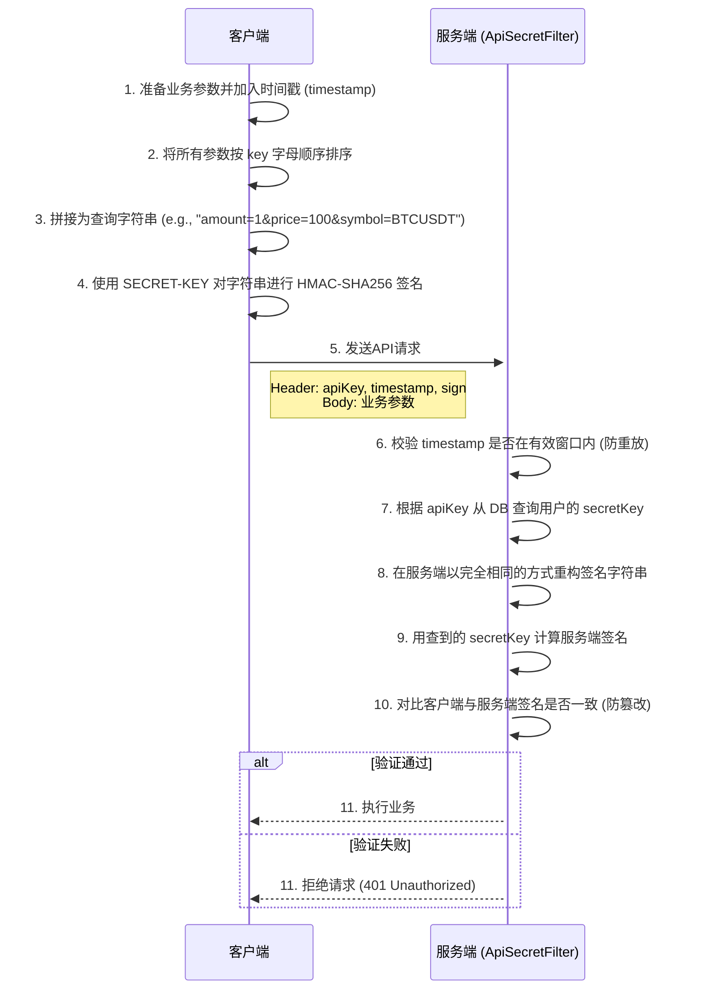
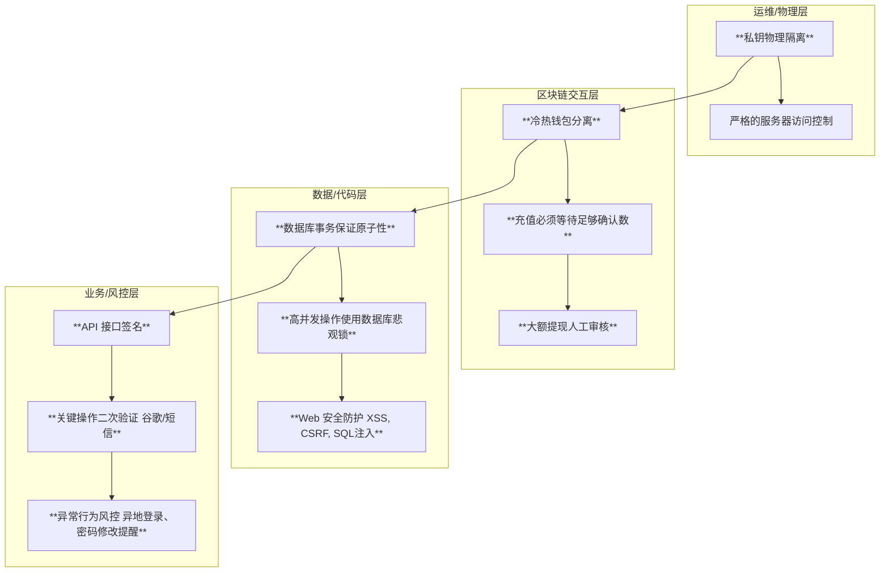

# 第二十二章：铸造金融堡垒——API 签名、防刷与资金安全

## 开篇：金融系统的生命线

对于一个处理真金白银的金融系统而言，**安全**永远是排在第一位的，它是一切功能的基石。任何一个微小的安全疏忽，都可能导致灾难性的后果。本章，我们将化身安全工程师，审视系统的三道核心防线：**API 接口安全**（如何确保与我们对话的是合法用户？）、**业务逻辑安全**（如何防止系统被滥用和攻击？）以及**资金安全**（如何构建纵深防御体系来保障用户的每一分钱？）。

---

### 第一道防线：API 接口的“身份令牌”——请求签名机制

API 接口是系统与外界沟通的门户，我们必须确保每一条进入的指令都来自于可信的身份，且内容未经篡改。为此，我们采用业界标准的 `API-KEY` + `SECRET-KEY` + `HMAC` 签名机制。

#### 签名流程与源码解析



这个流程的核心在于，`SECRET-KEY` 仅为客户端和服务器所知，客户端用它生成签名，服务器用它验证签名。任何第三方即使截获了请求，也无法伪造合法的签名。同时，时间戳机制确保了请求在短时间内有效，防止了**重放攻击**。

在 `ucenter-api` 中，这一验签逻辑的核心位于 [`ApiSecretFilter.java`](01_bizzan_framework/ucenter-api/src/main/java/com/bizzan/bitrade/interceptor/ApiSecretFilter.java) 中。它作为一个 Servlet Filter，在请求到达 Controller 之前进行拦截和校验。

其核心的 `doSign` 方法完美复现了上述流程：

```java
// 源码位置: 01_bizzan_framework/ucenter-api/src/main/java/com/bizzan/bitrade/interceptor/ApiSecretFilter.java
private boolean doSign(HttpServletRequest request, HttpServletResponse response) {
    // ...
    // 1. 从 Header 中获取 apiKey, timestamp, sign
    String apiKey = request.getHeader("apiKey");
    String timestamp = request.getHeader("timestamp");
    String sign = request.getHeader("sign");
    
    // 2. 校验时间戳
    // ...

    // 3. 根据 apiKey 查询 secretKey
    Member member = memberService.findByApiKey(apiKey);
    String secret = member.getApiSecret().getSecretKey();

    // 4. 获取所有请求参数并排序
    SortedMap<String, String> params = getAllParams(request);
    
    // 5. 拼接签名字符串
    String signContent = getSignContent(params);

    // 6. 计算服务端签名并对比
    String calculatedSign = Encrypt.HmacSHA256(signContent, secret);
    if (!calculatedSign.equals(sign)) {
        // 签名不匹配，拒绝请求
        return false;
    }
    // ...
    return true;
}
```

---

### 第二道防线：业务逻辑的“护城河”——人机验证与频率限制

除了验证身份，我们还必须防止接口被程序恶意、高频地调用（即“刷接口”），例如批量注册账号、轰炸短信网关等。

#### 2.1 人机验证

对于注册、登录、发送验证码等关键入口，引入**人机验证**是第一道有效屏障。本项目在 [`CaptchaController`](01_bizzan_framework/ucenter-api/src/main/java/com/bizzan/bitrade/controller/CaptchaController.java) 中集成了**阿里云滑动验证**。

其原理是：前端请求验证码时，后端会调用阿里云服务生成一个验证会话；用户在前端完成滑动拼图等操作后，会将结果提交给后端；后端再将此结果发送给阿里云进行二次校验，只有校验通过，才允许进行下一步的业务操作（如发送短信）。这就有效拦截了绝大部分自动化脚本的攻击。

#### 2.2 频率限制 (Rate Limiting)

对于另一些无法使用人机验证的场景（如用户频繁撤单），则需要进行**频率限制**。虽然本项目源码中没有提供一个通用的注解式防刷组件，但其实现原理非常清晰，通常基于 **Redis** 的原子操作来实现：

```java
// 这是一个通用频率限制器的实现思路
public boolean isAllowed(String key, int limit, int expireInSeconds) {
    // 利用 Redis 的 INCR 命令，原子性地增加 key 的计数值
    Long count = redisTemplate.opsForValue().increment(key);

    // 如果是第一次访问，设置过期时间
    if (count == 1) {
        redisTemplate.expire(key, expireInSeconds, TimeUnit.SECONDS);
    }

    // 判断是否超过限制
    return count <= limit;
}

// 在 Controller 中可以这样使用
@PostMapping("/send-sms")
public MessageResult sendSms(String phone, String ip) {
    String redisKey = "sms-limit:" + ip;
    // 限制每个 IP 60秒内只能请求1次
    if (!isAllowed(redisKey, 1, 60)) {
        return MessageResult.error("操作过于频繁，请稍后再试");
    }
    // ... 发送短信的业务逻辑 ...
}
```
这种方式将防刷逻辑与业务代码结合，可以针对不同用户、不同IP、不同接口实现精细化的访问控制。

---

### 第三道防线：资金安全的“纵深防御”体系

资金安全是堡垒的核心——金库。我们必须建立一个“层层设防、环环相扣”的纵深防御体系。



这个体系的核心思想是**分层防御，不信任任何单一环节**。其中，最能体现金融系统严谨性的，是在数据/代码层对并发资金操作的处理。

#### 终极保障：数据库悲观锁

在 `wallet` 服务中，所有涉及用户资金变更的操作，如冻结、解冻、划转，都必须是**原子且线程安全**的。如果两个线程同时操作同一个用户的钱包，极有可能出现余额计算错误等灾难性后果。

本项目的解决方案是使用**数据库级别的悲观锁**。在 [`MemberWalletService`](01_bizzan_framework/wallet/src/main/java/com/bizzan/bitrade/service/MemberWalletService.java) 中，我们能看到这样的核心代码：

```java
// 源码位置: 01_bizzan_framework/wallet/src/main/java/com/bizzan/bitrade/service/MemberWalletService.java
@Transactional(rollbackFor = Exception.class)
public MessageResult freezeBalance(MemberWallet wallet, BigDecimal amount) {
    // 使用 "FOR UPDATE" 查询，获取该行记录的排他锁
    MemberWallet walletForUpdate = walletRepository.findByCoinUnitAndMemberIdForUpdate(wallet.getCoin().getUnit(), wallet.getMemberId());
    
    // 检查余额是否足够
    if (walletForUpdate.getBalance().compareTo(amount) < 0) {
        return MessageResult.error("可用余额不足");
    }
    
    // 执行冻结操作
    int result = walletRepository.freezeBalance(walletForUpdate.getId(), amount);
    
    // ...
    return MessageResult.success();
}
```
这里的 `findByCoinUnitAndMemberIdForUpdate` 方法，其底层执行的 SQL 是 `SELECT * FROM member_wallet WHERE ... FOR UPDATE`。`FOR UPDATE` 会告诉数据库：**在当前事务提交之前，锁定查询到的这行数据，任何其他尝试修改或锁定该行的事务都必须排队等待**。

通过这种方式，我们确保了任何时刻都只有一个线程能操作特定用户的钱包记录，从根本上杜绝了并发问题，这是保障资金计算绝对准确的**终极手段**。

---

## 总结

在本章中，我们系统性地学习了交易所的安全体系。通过 **API 签名机制**，我们守卫了系统的入口；通过**人机验证**和**频率限制**，我们加固了业务的城墙；最终，通过以**冷热钱包分离**和**数据库悲观锁**为核心的**纵深防御体系**，我们保护了最核心的资金安全。掌握了这些安全设计的思想和实践，我们构建的系统才不仅仅是一个功能强大的空中楼阁，而是一个坚实可靠的金融堡le垒。