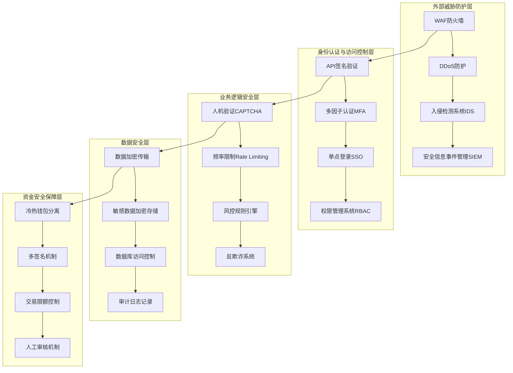
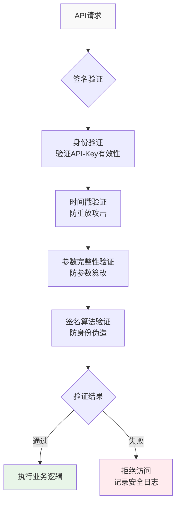
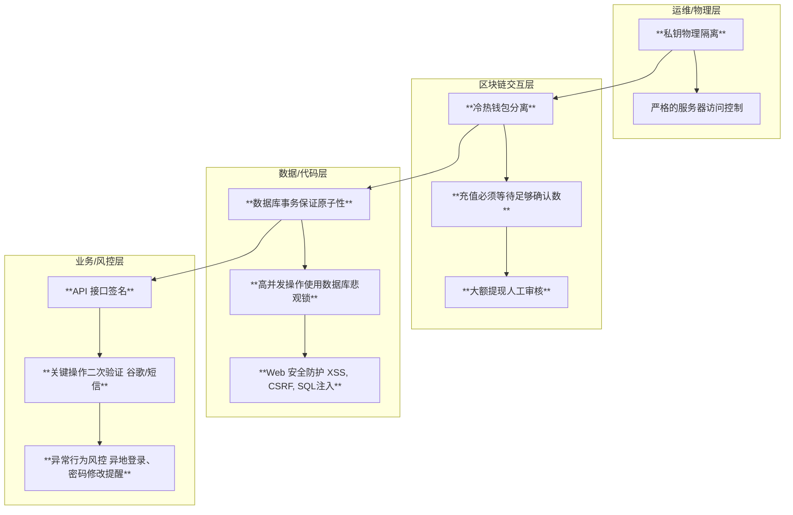

# 金融安全体系：API签名、防刷机制与资金安全保障

## 引言：数字资产交易所的安全架构设计

在数字资产交易系统中，**安全是不可妥协的底线**，也是系统架构设计的首要考量因素。与传统的互联网应用不同，金融系统直接涉及用户资产，任何安全漏洞都可能导致无法挽回的经济损失。因此，必须建立**多层次、全方位、纵深防御**的安全体系。

**金融系统面临的独特安全挑战**

数字资产交易所面临着比传统金融系统更加复杂的安全威胁：

1. **7x24小时全天候攻击**：加密货币的全球性使得攻击者可以来自任何时区，系统必须全天候保持警戒
2. **不可逆的资金操作**：区块链交易的不可逆性意味着一旦出现安全事件，资金损失将无法追回
3. **匿名性的风险**：加密货币的半匿名特性为洗钱、恐怖融资等非法活动提供了便利
4. **技术复杂性**：需要同时保护Web应用、移动应用、区块链节点等多个攻击面
5. **监管合规压力**：必须满足反洗钱(AML)、了解你的客户(KYC)等严格的监管要求
6. **内部威胁风险**：高价值资产使得内部人员作恶的动机和可能性都大大增加

**纵深防御的安全架构思想**

面对这些挑战，本系统采用了**"纵深防御"(Defense in Depth)**的安全架构理念。这种设计思想的核心是：

- **多层防护**：任何单一安全措施都可能被绕过，必须建立多层独立的防护机制
- **权限最小化**：每个组件和用户只能访问其必需的最小权限集合
- **零信任原则**：不信任任何内部或外部的访问请求，都必须经过验证
- **持续监控**：建立实时的安全监控和响应机制，及时发现和处置威胁
- **快速恢复**：即使发生安全事件，也要能够快速检测、隔离和恢复

**安全防护的技术体系架构**


```mermaid
graph TD
    subgraph "外部威胁防护层"
        A1[WAF防火墙] --> A2[DDoS防护]
        A2 --> A3[入侵检测系统IDS]
        A3 --> A4[安全信息事件管理SIEM]
    end

    subgraph "身份认证与访问控制层"
        B1[API签名验证] --> B2[多因子认证MFA]
        B2 --> B3[单点登录SSO]
        B3 --> B4[权限管理系统RBAC]
    end

    subgraph "业务逻辑安全层"
        C1[人机验证CAPTCHA] --> C2[频率限制Rate Limiting]
        C2 --> C3[风控规则引擎]
        C3 --> C4[反欺诈系统]
    end

    subgraph "数据安全层"
        D1[数据加密传输] --> D2[敏感数据加密存储]
        D2 --> D3[数据库访问控制]
        D3 --> D4[审计日志记录]
    end

    subgraph "资金安全保障层"
        E1[冷热钱包分离] --> E2[多签名机制]
        E2 --> E3[交易限额控制]
        E3 --> E4[人工审核机制]
    end

    A1 --> B1
    B1 --> C1
    C1 --> D1
    D1 --> E1
```

**本章学习的技术价值**

通过深入学习这个安全体系，我们将掌握：

1. **现代金融系统的安全设计原则**和最佳实践
2. **API安全认证机制**的设计与实现，包括签名算法和时间戳验证
3. **防刷和反欺诈技术**，包括人机验证、频率限制和行为分析
4. **资金安全保障体系**，从冷热钱包分离到数据库并发控制
5. **安全监控和应急响应**机制的构建方法
6. **合规性技术实现**，满足金融监管要求的技术方案

这些安全知识不仅适用于数字资产交易所，对于任何涉及资金处理、敏感数据保护的高价值系统都具有重要的参考价值。安全是一个持续的过程，需要我们不断学习、实践和改进。

---

## 第一道防线：API安全认证体系

### 签名机制：不可伪造的身份验证

API接口是数字资产交易所的**数字门面**，也是攻击者的首要攻击目标。必须确保每一个API请求都来自于**可信的身份**，且**传输内容未被篡改**。本系统采用了**API-KEY + SECRET-KEY + HMAC-SHA256**的标准签名机制，构建了坚固的身份验证防线。

**签名机制的安全原理**

这种签名机制基于**对称加密**和**消息认证码**的原理：

1. **密钥分离**：API-KEY是公开的身份标识，SECRET-KEY是私密的签名密钥
2. **消息完整性**：任何对请求参数的篡改都会导致签名验证失败
3. **时间有效性**：通过时间戳防止重放攻击，确保请求的时效性
4. **不可抵赖性**：签名无法伪造，发送方无法否认已发送的请求

**安全威胁防护机制**


```mermaid
graph TD
    A[API请求] --> B{签名验证}

    B --> C[身份验证<br/>验证API-Key有效性]
    C --> D[时间戳验证<br/>防重放攻击]
    D --> E[参数完整性验证<br/>防参数篡改]
    E --> F[签名算法验证<br/>防身份伪造]

    F --> G{验证结果}
    G -- 通过 --> H[执行业务逻辑]
    G -- 失败 --> I[拒绝访问<br/>记录安全日志]

    style A fill:#f9f9f9
    style H fill:#e8f5e8
    style I fill:#ffebee
```

### 完整的签名验证流程

#### 客户端签名生成过程

```mermaid
sequenceDiagram
    participant Client as 客户端应用
    participant Secure as 安全模块
    participant Server as 服务端API

    Note over Client,Server: Phase 1: 请求准备阶段
    Client->>Client: 1. 准备业务参数<br/>(symbol, amount, price等)
    Client->>Client: 2. 生成当前时间戳<br/>(防重放攻击)
    Client->>Client: 3. 添加时间戳到参数集合

    Note over Client,Server: Phase 2: 签名生成阶段
    Client->>Secure: 4. 参数按字母顺序排序
    Secure->>Secure: 5. 拼接为查询字符串格式<br/>key1=value1&key2=value2&timestamp=xxx
    Secure->>Secure: 6. 使用SECRET-KEY进行<br/>HMAC-SHA256签名计算
    Secure->>Client: 7. 返回签名结果

    Note over Client,Server: Phase 3: 请求发送阶段
    Client->>+Server: 8. 发送HTTP请求
    Note right of Client: 请求头包含:<br/>- apiKey: 用户标识<br/>- timestamp: 时间戳<br/>- sign: 签名结果<br/>请求体包含业务参数

    Note over Client,Server: Phase 4: 服务端验证阶段
    Server->>Server: 9. 提取请求头信息
    Server->>Server: 10. 验证apiKey有效性
    Server->>Server: 11. 检查时间戳有效性<br/>(通常5分钟内)
    Server->>Server: 12. 查询用户SECRET-KEY
    Server->>Server: 13. 重构签名字符串
    Server->>Server: 14. 计算服务端签名
    Server->>Server: 15. 对比签名是否一致

    alt 签名验证通过
        Server-->>-Client: 16. 执行业务逻辑<br/>返回API响应
    else 验证失败
        Server-->>-Client: 16. 返回401 Unauthorized<br/>记录安全事件
    end
```

#### 服务端验证实现详解

**核心验证组件的实现**

```java
@Component
public class ApiSignatureValidator {

    private static final long TIMESTAMP_TOLERANCE = 300000; // 5分钟时间窗口
    private static final String HMAC_SHA256_ALGORITHM = "HmacSHA256";

    /**
     * API签名验证核心方法
     */
    public ValidationResult validateSignature(HttpServletRequest request) {
        try {
            // 1. 提取和验证基础参数
            SignatureParams params = extractSignatureParams(request);
            if (params == null) {
                return ValidationResult.fail("缺少必要的签名参数");
            }

            // 2. 时间戳验证 (防重放攻击)
            TimestampValidationResult timestampResult = validateTimestamp(params.getTimestamp());
            if (!timestampResult.isValid()) {
                return ValidationResult.fail("时间戳验证失败: " + timestampResult.getReason());
            }

            // 3. API Key验证
            ApiKeyInfo apiKeyInfo = validateApiKey(params.getApiKey());
            if (!apiKeyInfo.isValid()) {
                return ValidationResult.fail("API Key无效: " + apiKeyInfo.getReason());
            }

            // 4. 重建签名字符串
            String signContent = buildSignContent(request, params.getTimestamp());

            // 5. 计算期望签名
            String expectedSignature = calculateSignature(signContent, apiKeyInfo.getSecretKey());

            // 6. 签名比对 (防篡改)
            if (!expectedSignature.equals(params.getSignature())) {
                logSecurityEvent("SIGNATURE_MISMATCH", params.getApiKey(), request.getRemoteAddr());
                return ValidationResult.fail("签名验证失败");
            }

            // 7. 更新API Key使用统计
            updateApiKeyUsage(apiKeyInfo);

            return ValidationResult.success(apiKeyInfo.getMember());

        } catch (Exception e) {
            log.error("签名验证异常", e);
            return ValidationResult.fail("签名验证过程异常");
        }
    }

    /**
     * 时间戳验证 - 防止重放攻击
     */
    private TimestampValidationResult validateTimestamp(String timestampStr) {
        try {
            long timestamp = Long.parseLong(timestampStr);
            long currentTime = System.currentTimeMillis();
            long timeDifference = Math.abs(currentTime - timestamp);

            if (timeDifference > TIMESTAMP_TOLERANCE) {
                return TimestampValidationResult.fail("时间戳超出允许范围");
            }

            // 检查时间戳是否被使用过 (防重放)
            if (isTimestampUsed(timestamp)) {
                return TimestampValidationResult.fail("时间戳已被使用");
            }

            // 标记时间戳已使用 (短期缓存)
            markTimestampUsed(timestamp);

            return TimestampValidationResult.success();

        } catch (NumberFormatException e) {
            return TimestampValidationResult.fail("时间戳格式无效");
        }
    }

    /**
     * API Key验证
     */
    private ApiKeyInfo validateApiKey(String apiKey) {
        if (StringUtils.isEmpty(apiKey)) {
            return ApiKeyInfo.fail("API Key为空");
        }

        Member member = memberService.findByApiKey(apiKey);
        if (member == null) {
            return ApiKeyInfo.fail("API Key不存在");
        }

        if (member.getApiSecret() == null) {
            return ApiKeyInfo.fail("用户未启用API接口");
        }

        ApiSecret apiSecret = member.getApiSecret();
        if (apiSecret.getStatus() != ApiSecretStatus.ACTIVE) {
            return ApiKeyInfo.fail("API Key已禁用");
        }

        // 检查IP白名单 (如果配置了)
        if (hasIpWhitelist(apiSecret)) {
            String clientIp = getClientIpAddress();
            if (!isIpInWhitelist(clientIp, apiSecret.getIpWhitelist())) {
                logSecurityEvent("IP_NOT_WHITELISTED", apiKey, clientIp);
                return ApiKeyInfo.fail("IP地址不在白名单中");
            }
        }

        return ApiKeyInfo.success(member, apiSecret.getSecretKey());
    }

    /**
     * 构建签名字符串
     */
    private String buildSignContent(HttpServletRequest request, String timestamp) {
        // 1. 获取所有请求参数
        Map<String, String> params = new HashMap<>();
        Enumeration<String> parameterNames = request.getParameterNames();

        while (parameterNames.hasMoreElements()) {
            String paramName = parameterNames.nextElement();
            String paramValue = request.getParameter(paramName);

            if (StringUtils.isNotEmpty(paramValue)) {
                params.put(paramName, paramValue);
            }
        }

        // 2. 添加时间戳
        params.put("timestamp", timestamp);

        // 3. 按字母顺序排序
        SortedMap<String, String> sortedParams = new TreeMap<>(params);

        // 4. 构建查询字符串
        StringBuilder signContent = new StringBuilder();
        for (Map.Entry<String, String> entry : sortedParams.entrySet()) {
            if (signContent.length() > 0) {
                signContent.append("&");
            }
            signContent.append(entry.getKey()).append("=").append(entry.getValue());
        }

        return signContent.toString();
    }

    /**
     * 计算HMAC-SHA256签名
     */
    private String calculateSignature(String content, String secretKey) {
        try {
            Mac mac = Mac.getInstance(HMAC_SHA256_ALGORITHM);
            SecretKeySpec secretKeySpec = new SecretKeySpec(secretKey.getBytes(StandardCharsets.UTF_8),
                                                        HMAC_SHA256_ALGORITHM);
            mac.init(secretKeySpec);

            byte[] signatureBytes = mac.doFinal(content.getBytes(StandardCharsets.UTF_8));
            return Hex.encodeHexString(signatureBytes);

        } catch (NoSuchAlgorithmException | InvalidKeyException e) {
            throw new RuntimeException("签名计算失败", e);
        }
    }
}
```

**安全增强措施**

为了进一步提升API安全性，系统还实现了以下增强措施：

1. **请求去重机制**：使用Redis缓存短期内的请求签名，防止重复请求
2. **IP白名单控制**：支持为API Key配置IP访问白名单
3. **权限分级管理**：不同API Key可以配置不同的访问权限
4. **使用量监控**：实时监控API调用频率和异常模式
5. **自动禁用机制**：检测到异常行为时自动禁用API Key

```java
@Service
public class ApiSecurityMonitor {

    /**
     * API使用量监控和限制
     */
    public boolean checkRateLimit(String apiKey, String endpoint) {
        String rateLimitKey = "api-rate-limit:" + apiKey + ":" + endpoint;

        // 使用滑动窗口算法限制调用频率
        return rateLimitService.isAllowed(rateLimitKey, 100, Duration.ofMinutes(1));
    }

    /**
     * 异常行为检测
     */
    public void detectAnomalousActivity(String apiKey, String ip, String endpoint) {
        // 1. 检查调用频率异常
        if (isCallFrequencyAnomalous(apiKey)) {
            alertService.sendAlert("API调用频率异常", apiKey, ip);
        }

        // 2. 检查IP地理位置异常
        if (isGeographicallyAnomalous(apiKey, ip)) {
            alertService.sendAlert("API访问地理位置异常", apiKey, ip);
        }

        // 3. 检查访问模式异常
        if (isAccessPatternAnomalous(apiKey, endpoint)) {
            alertService.sendAlert("API访问模式异常", apiKey, endpoint);
        }
    }
}
```

通过这套完整的API安全认证体系，系统能够有效防止**身份伪造、请求篡改、重放攻击**等多种安全威胁，为整个交易平台提供可靠的身份认证保障。

```java
// 源码位置: 01_bizzan_framework/ucenter-api/src/main/java/com/bizzan/bitrade/interceptor/ApiSecretFilter.java
private boolean doSign(HttpServletRequest request, HttpServletResponse response) {
    // ...
    // 1. 从 Header 中获取 apiKey, timestamp, sign
    String apiKey = request.getHeader("apiKey");
    String timestamp = request.getHeader("timestamp");
    String sign = request.getHeader("sign");
    
    // 2. 校验时间戳
    // ...

    // 3. 根据 apiKey 查询 secretKey
    Member member = memberService.findByApiKey(apiKey);
    String secret = member.getApiSecret().getSecretKey();

    // 4. 获取所有请求参数并排序
    SortedMap<String, String> params = getAllParams(request);
    
    // 5. 拼接签名字符串
    String signContent = getSignContent(params);

    // 6. 计算服务端签名并对比
    String calculatedSign = Encrypt.HmacSHA256(signContent, secret);
    if (!calculatedSign.equals(sign)) {
        // 签名不匹配，拒绝请求
        return false;
    }
    // ...
    return true;
}
```

---

### 第二道防线：业务逻辑的“护城河”——人机验证与频率限制

除了验证身份，我们还必须防止接口被程序恶意、高频地调用（即“刷接口”），例如批量注册账号、轰炸短信网关等。

#### 2.1 人机验证

对于注册、登录、发送验证码等关键入口，引入**人机验证**是第一道有效屏障。本项目在 [`CaptchaController`](01_bizzan_framework/ucenter-api/src/main/java/com/bizzan/bitrade/controller/CaptchaController.java) 中集成了**阿里云滑动验证**。

其原理是：前端请求验证码时，后端会调用阿里云服务生成一个验证会话；用户在前端完成滑动拼图等操作后，会将结果提交给后端；后端再将此结果发送给阿里云进行二次校验，只有校验通过，才允许进行下一步的业务操作（如发送短信）。这就有效拦截了绝大部分自动化脚本的攻击。

#### 2.2 频率限制 (Rate Limiting)

对于另一些无法使用人机验证的场景（如用户频繁撤单），则需要进行**频率限制**。虽然本项目源码中没有提供一个通用的注解式防刷组件，但其实现原理非常清晰，通常基于 **Redis** 的原子操作来实现：

```java
// 这是一个通用频率限制器的实现思路
public boolean isAllowed(String key, int limit, int expireInSeconds) {
    // 利用 Redis 的 INCR 命令，原子性地增加 key 的计数值
    Long count = redisTemplate.opsForValue().increment(key);

    // 如果是第一次访问，设置过期时间
    if (count == 1) {
        redisTemplate.expire(key, expireInSeconds, TimeUnit.SECONDS);
    }

    // 判断是否超过限制
    return count <= limit;
}

// 在 Controller 中可以这样使用
@PostMapping("/send-sms")
public MessageResult sendSms(String phone, String ip) {
    String redisKey = "sms-limit:" + ip;
    // 限制每个 IP 60秒内只能请求1次
    if (!isAllowed(redisKey, 1, 60)) {
        return MessageResult.error("操作过于频繁，请稍后再试");
    }
    // ... 发送短信的业务逻辑 ...
}
```
这种方式将防刷逻辑与业务代码结合，可以针对不同用户、不同IP、不同接口实现精细化的访问控制。

---

### 第三道防线：资金安全的“纵深防御”体系

资金安全是堡垒的核心——金库。我们必须建立一个“层层设防、环环相扣”的纵深防御体系。


```mermaid
graph TD
    subgraph "运维/物理层"
        A[**私钥物理隔离**] --> B[严格的服务器访问控制];
    end

    subgraph "区块链交互层"
        C[**冷热钱包分离**] --> D[**充值必须等待足够确认数**];
        D --> E[**大额提现人工审核**];
    end

    subgraph "数据/代码层"
        F[**数据库事务保证原子性**] --> G[**高并发操作使用数据库悲观锁**];
        G --> H[**Web 安全防护 XSS, CSRF, SQL注入**];
    end

    subgraph "业务/风控层"
        I[**API 接口签名**] --> J[**关键操作二次验证 谷歌/短信**];
        J --> K[**异常行为风控 异地登录、密码修改提醒**];
    end

    A --> C --> F --> I;
```

这个体系的核心思想是**分层防御，不信任任何单一环节**。其中，最能体现金融系统严谨性的，是在数据/代码层对并发资金操作的处理。

#### 终极保障：数据库悲观锁

在 `wallet` 服务中，所有涉及用户资金变更的操作，如冻结、解冻、划转，都必须是**原子且线程安全**的。如果两个线程同时操作同一个用户的钱包，极有可能出现余额计算错误等灾难性后果。

本项目的解决方案是使用**数据库级别的悲观锁**。在 [`MemberWalletService`](01_bizzan_framework/wallet/src/main/java/com/bizzan/bitrade/service/MemberWalletService.java) 中，我们能看到这样的核心代码：

```java
// 源码位置: 01_bizzan_framework/wallet/src/main/java/com/bizzan/bitrade/service/MemberWalletService.java
@Transactional(rollbackFor = Exception.class)
public MessageResult freezeBalance(MemberWallet wallet, BigDecimal amount) {
    // 使用 "FOR UPDATE" 查询，获取该行记录的排他锁
    MemberWallet walletForUpdate = walletRepository.findByCoinUnitAndMemberIdForUpdate(wallet.getCoin().getUnit(), wallet.getMemberId());
    
    // 检查余额是否足够
    if (walletForUpdate.getBalance().compareTo(amount) < 0) {
        return MessageResult.error("可用余额不足");
    }
    
    // 执行冻结操作
    int result = walletRepository.freezeBalance(walletForUpdate.getId(), amount);
    
    // ...
    return MessageResult.success();
}
```
这里的 `findByCoinUnitAndMemberIdForUpdate` 方法，其底层执行的 SQL 是 `SELECT * FROM member_wallet WHERE ... FOR UPDATE`。`FOR UPDATE` 会告诉数据库：**在当前事务提交之前，锁定查询到的这行数据，任何其他尝试修改或锁定该行的事务都必须排队等待**。

通过这种方式，我们确保了任何时刻都只有一个线程能操作特定用户的钱包记录，从根本上杜绝了并发问题，这是保障资金计算绝对准确的**终极手段**。

---

## 总结

在本章中，我们系统性地学习了交易所的安全体系。通过 **API 签名机制**，我们守卫了系统的入口；通过**人机验证**和**频率限制**，我们加固了业务的城墙；最终，通过以**冷热钱包分离**和**数据库悲观锁**为核心的**纵深防御体系**，我们保护了最核心的资金安全。掌握了这些安全设计的思想和实践，我们构建的系统才不仅仅是一个功能强大的空中楼阁，而是一个坚实可靠的金融堡le垒。