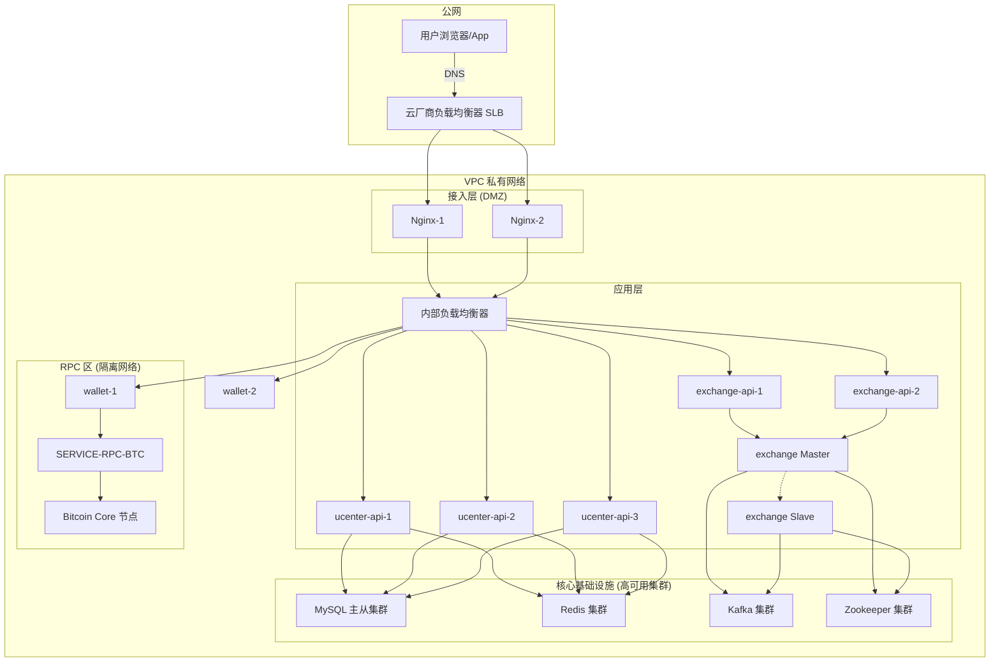

# 第二十三章：最后一公里——从代码到 7x24 小时的全球化服务

## 开篇：从本地代码到全球服务

经过前面章节的努力，我们已经拥有了一套功能完备、源码健壮的交易所系统。然而，代码躺在我们的开发机里，并不能创造价值。本章，我们将扮演 DevOps 工程师的角色，完成这“最后一公里”——将我们的系统部署到生产环境，让它从一堆代码，蜕变为一个能为全球用户提供 7x24 小时不间断服务的金融平台。

生产环境的部署，核心目标有两个：**可靠性 (Reliability)**，即服务能够不间断地稳定运行；以及**可扩展性 (Scalability)**，即当用户量增长时，系统能够平滑地应对压力。

---

### 第一节：绘制生产蓝图——高可用部署架构

一个典型的生产环境，就像一个规划严谨的数字城市，根据服务的不同角色和安全等级，将其部署在不同的网络区域中。


在这个蓝图中，所有外部用户的请求首先到达云厂商的**负载均衡器 SLB**，再由 **Nginx 集群**作为 API 网关，将请求反向代理到**应用层**的内部负载均衡器，最终分发给各个微服务集群。所有核心服务都部署在**VPC 私有网络**中，并通过严格的防火墙规则进行隔离，确保了架构的安全性和高可用性。

---

### 第二节：铸造不朽之躯——高可用 (HA) 核心策略

高可用的核心思想是**冗余 (Redundancy)**，通过部署多个实例来消除**单点故障 (SPOF)**。

#### 2.1 无状态服务的“克隆军团”

对于 `ucenter-api`, `exchange-api`, `wallet` 这类**无状态服务**，实现高可用非常简单。得益于 **Spring Session + Redis** 的设计，用户的登录状态被统一存储在外部的 Redis 集群中。这意味着每个服务实例自身都不存储任何会话数据，它们就像一支“克隆军团”，任何一个实例宕机，负载均衡器都会自动将流量切换到其他健康的实例上，用户完全无感。我们可以通过简单地增加或减少实例数量，来实现**水平扩展**。

#### 2.2 有状态撮合引擎的“主备切换”

`exchange` (撮合引擎) 是一个**有状态服务**，它在内存中维护了完整的订单簿。它本身是一个单点，一旦宕机，交易便会中断。为此，我们必须采用更复杂的**主备（Master-Slave）方案**，并借助 **Zookeeper** 实现自动故障切换。

**工作原理：**
1.  **Leader 选举**：启动时，所有 `exchange` 实例都会尝试去 Zookeeper 的一个特定路径（如 `/exchange/leader`）下创建一个**临时节点 (Ephemeral Node)**。Zookeeper 的特性保证了只有一个实例能创建成功，这个实例就成为了 **Master**。其他实例则成为 **Slave**，并监听这个临时节点。
2.  **状态同步**：Master 和 Slave 同时消费 Kafka 中的订单消息。Master 正常处理并向外广播成交结果；Slave 同样在内存中构建订单簿，但**不向外广播**，只作为热备份。
3.  **故障检测与切换**：Master 会与 Zookeeper 保持一个心跳会话。如果 Master 宕机或网络中断，它与 Zookeeper 的会话会超时，Zookeeper 会**自动删除**它创建的那个临时节点。
4.  **自动接管**：所有 Slave 监听到临时节点被删除后，会立刻重新发起 Leader 选举。其中一个 Slave 会成功创建新的临时节点，晋升为新的 Master，并开始对外广播成交结果。

这个基于 Zookeeper 的主备方案，可以将撮合引擎的故障恢复时间缩短到**秒级**，极大地提升了核心交易功能的可用性。

---

### 第三节：启动现代化流水线——基于 Docker Compose 的一键部署

在现代云计算环境中，我们采用**容器化**技术来封装和部署我们的微服务。对于本地开发和测试环境，**Docker Compose** 是一个强大的工具，它允许我们用一个 `YAML` 文件来定义和运行一个多容器的应用。

下面是一个简化的 `docker-compose.yml` 范例，它能在单机上一键启动整个交易所的核心服务：

```yaml
version: '3.8'
services:
  mysql:
    image: mysql:5.7
    # ... 数据卷和密码配置 ...
  redis:
    image: redis:latest
    # ...
  zookeeper:
    image: wurstmeister/zookeeper
    # ...
  kafka:
    image: wurstmeister/kafka
    depends_on: [zookeeper]
    # ... 依赖和环境变量配置 ...

  ucenter-api:
    build: ./01_bizzan_framework/ucenter-api
    ports:
      - "6001:6001"
    depends_on: [mysql, redis]
    environment:
      - SPRING_PROFILES_ACTIVE=dev
      # ... 数据库、Redis 连接信息 ...

  wallet:
    build: ./01_bizzan_framework/wallet
    # ...
  
  # ... 其他微服务 ...

networks:
  default:
    driver: bridge
```
通过 `docker-compose up -d` 命令，我们就能在几分钟内，拥有一个包含所有中间件和微服务的、网络互通的、可供完整测试的“微缩版”生产环境，极大地提升了开发和测试效率。

---

### 第四节：洞察系统脉搏——生产环境的可观测性

一个已经部署的系统是一个“黑盒子”，**可观测性 (Observability)** 就是我们打开这个黑盒子的眼睛。它主要由三部分组成：

1.  **Logging (日志聚合)**
    微服务架构中，日志散落在各个节点。我们需要用 **ELK/EFK Stack (Elasticsearch, Logstash/Fluentd, Kibana)** 这样的工具，将所有容器产生的日志实时收集、存储到 Elasticsearch 中，并通过 Kibana 提供一个统一的、可搜索的日志查询界面。

2.  **Metrics (指标监控)**
    我们需要监控系统的健康状况。通过引入 **Prometheus** 和 **Grafana**，我们可以采集每个微服务暴露的核心指标（如 QPS、延迟、JVM内存、CPU使用率），并将它们在 Grafana 中绘制成直观的监控大盘，再配上告警规则，就能在问题发生时第一时间收到通知。

3.  **Tracing (分布式链路追踪)**
    为了追踪一个请求在复杂的微服务调用链中的完整路径和耗时，我们需要引入 **SkyWalking** 或 **Zipkin** 这样的工具。它能像雷达一样，描绘出完整的服务拓扑图和请求调用链，是排查性能瓶颈和分布式错误的终极利器。

---

## 总结

在本章中，我们从 DevOps 的视角，走完了从代码到服务的“最后一公里”。我们设计了分层隔离的生产部署架构，为无状态和有状态服务分别定制了高可用方案，并引入了以 Docker Compose 和可观测性为核心的现代化运维理念。至此，我们已经拥有了将一个复杂微服务系统投入生产并保障其稳定运行的全套知识体系。