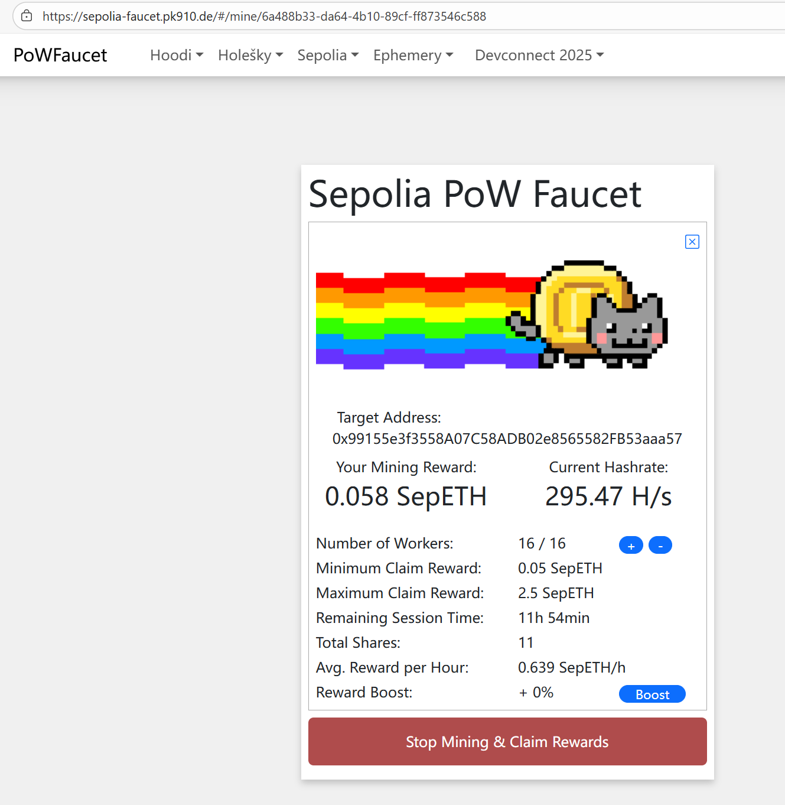
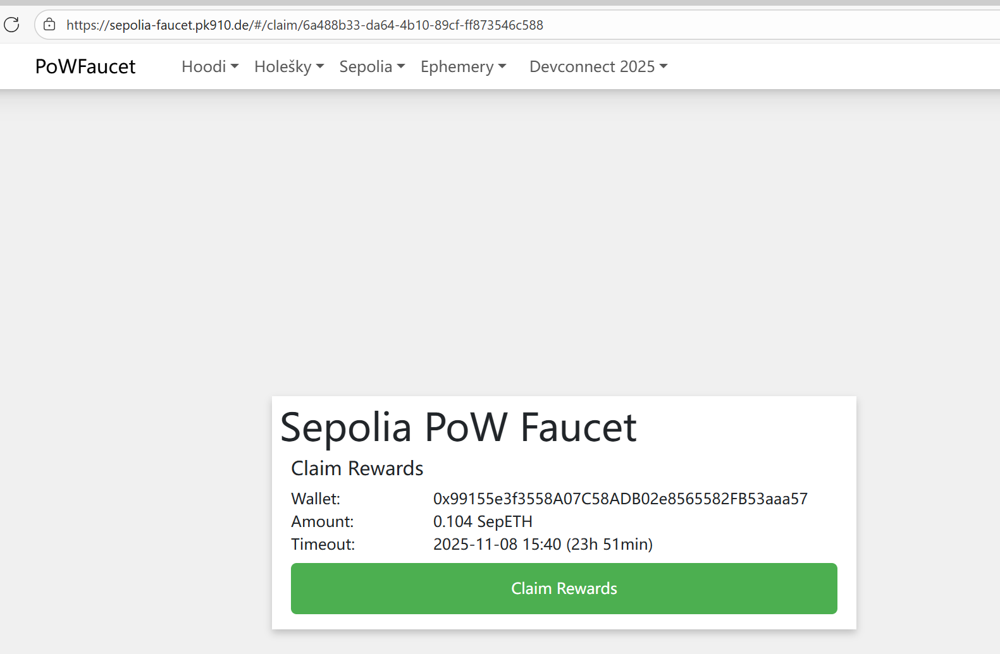
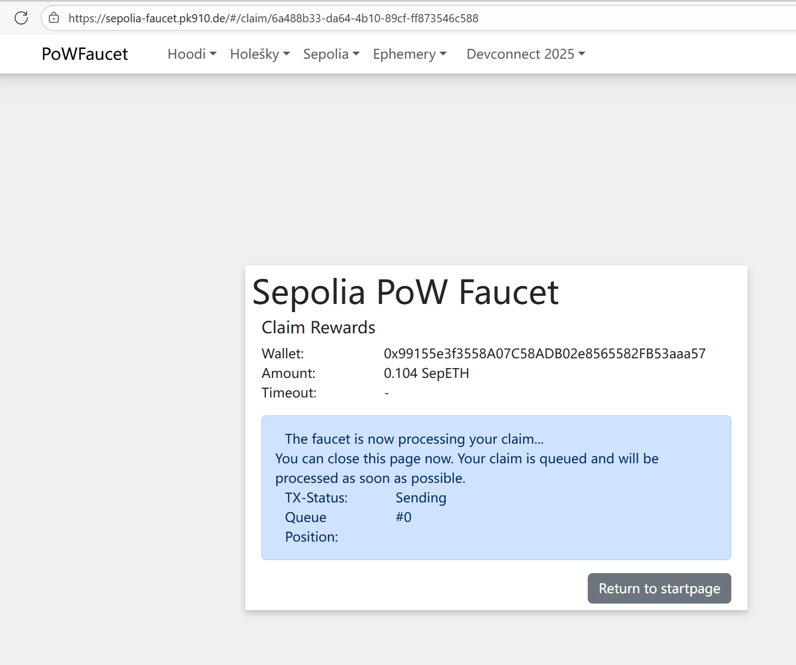
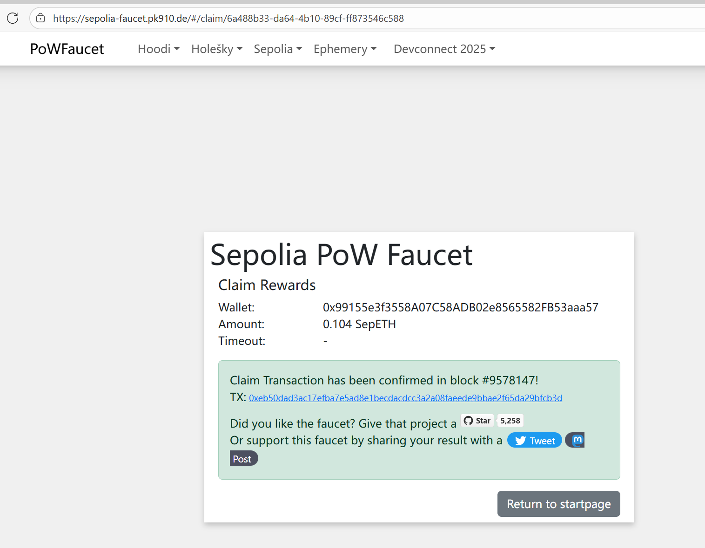
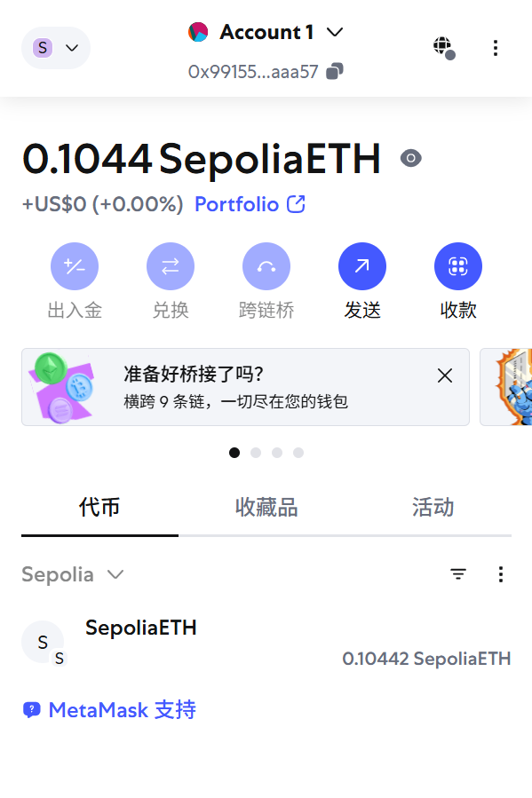

## 如何申请 Sepolia 测试网的 RPC 节点

申请 Sepolia 测试网的 RPC 节点，通常需要通过第三方 RPC 服务提供商。这些服务商提供了稳定且高性能的节点访问服务，并且通常有免费套餐，足够个人开发者使用。

以下是几个主流的选择：

### 1. Infura

- **简介**: Infura 是最老牌、最广泛使用的 RPC 服务商之一，非常稳定。
- **网址**: `https://www.infura.io/`
- **申请步骤**:
  1. 访问官网并注册账户。
  2. 登录后，在 Dashboard 创建一个新的 API Key (Create a new key)。
  3. 在项目设置中，找到 Sepolia 网络的 RPC 端点地址，格式通常是 `https://sepolia.infura.io/v3/YOUR_API_KEY`。

### 2. Alchemy

- **简介**: Alchemy 是另一个顶级的 RPC 提供商，以其强大的免费套餐、丰富的功能（如增强 API 和调试工具）而闻名。
- **网址**: `https://www.alchemy.com/`
- **申请步骤**:
  1. 访问官网并注册账户。
  2. 登录后，创建一个新的 App (Create App)。
  3. 在创建 App 时，选择 Chain 为 Ethereum，Network 为 Sepolia。
  4. 创建成功后，在 App 详情页点击 "View Key"，即可看到 RPC URL。

### 3. 公共 RPC 节点 (Chainlist)

- **简介**: 如果您只是想快速测试，不想注册，也可以使用公共的 RPC 节点。Chainlist.org 是一个汇集了各种链的公共 RPC 节点的网站，非常方便。
- **网址**: `https://chainlist.org/`
- **使用步骤**:
  1. 访问网站，在搜索框中输入 "Sepolia"。
  2. 网站会列出多个可用的公共 RPC 地址。
  3. **注意**：公共节点的稳定性和性能无法保证，可能会有严格的速率限制，不建议在生产环境或重要的开发中使用。

### 4. https://zan.top/faucet

**简介**: ZanTop 提供了免费的 Sepolia RPC 节点和水龙头服务，适合快速获取测试币和节点访问。
  选择 Sepolia 网络后，可以看到对应的 RPC 节点地址：

https://api.zan.top/node/v1/eth/sepolia/f5758c66b73a45cfbfbe65620472af6e

## 领取 Sepolia ETH

大部分水龙头（Faucet）都设置了各种限制，主要是为了防止机器人滥用。

不过，别担心，这里有几种目前仍然有效且相对快速的方法，我将它们按照推荐度和门槛高低进行了排序：

### 方案一：Sepolia PoW Faucet (最推荐，无门槛)

这是目前最可靠、最公平的方式，它不要求你持有主网 ETH 或绑定社交媒体账户。你只需要用你的电脑进行一次小型的“挖矿”计算即可。

- **网址**: `https://sepolia-faucet.pk910.de/`
- **优点**:
  - 完全免费，无需任何前提条件。
  - 防止机器人，真人用户基本都能领到。
  - 出账稳定。
- **步骤**:
  
  1.  访问网站。
  2.  输入你的钱包地址。
  3.  勾选 "I'm not a robot"。
  4.  点击 "Start Mining"。你的浏览器会开始进行计算，通常需要几分钟到十几分钟不等，取决于你的电脑性能。
  5.  当计算完成后，"Claim Rewards" 按钮会变亮，点击它即可领取测试 ETH。
  
  

### 方案二：Alchemy Sepolia Faucet (最快，但有门槛)

如果你在以太坊主网上持有少量 ETH (通常是 `0.001 ETH` 以上)，这是获取测试币最快、最大方的方式。

- **网址**: `https://sepoliafaucet.com/`
- **优点**:
  - 速度快，单次给的 ETH 数量最多 (通常是 0.5 ETH/天)。
  - 非常稳定，由 Alchemy 官方提供。
- **步骤**:
  1.  访问网站，需要注册并登录一个 Alchemy 账户。
  2.  输入你的钱包地址。
  3.  点击 "Send Me ETH"。
  4.  系统会检查你的主网钱包余额，如果满足条件，测试币会很快到账。

### 方案三：Infura 和 QuickNode Faucet (备选方案)

这两个也是主流 RPC 服务商提供的水龙头，规则和 Alchemy 类似，通常也需要主网持有少量 ETH 作为验证。

- **Infura Faucet**: `https://www.infura.io/faucet/sepolia`
- **QuickNode Faucet**: `https://faucet.quicknode.com/ethereum/sepolia`

### 总结与建议

| 水龙头                 | 优点                   | 缺点/门槛                | 适用场景                 |
| :--------------------- | :--------------------- | :----------------------- | :----------------------- |
| **Sepolia PoW Faucet** | **无门槛，最公平**     | 需要花费几分钟的计算时间 | **所有人，特别是新用户** |
| **Alchemy Faucet**     | **速度最快，数量最多** | 需要主网有少量 ETH       | 已经有主网活动的老用户   |
| **Infura / QuickNode** | 稳定可靠               | 需要主网有少量 ETH       | 作为 Alchemy 的备用选择  |

**快速领取策略**：

- **如果你是新用户或主网没币**：直接使用 **Sepolia PoW Faucet**。
- **如果你主网有币**：优先使用 **Alchemy Faucet**，因为最快最多。

由于每个水龙头都有 24 小时的冷却时间，你可以轮流使用这些网站，以便在短时间内积累更多的测试币。
