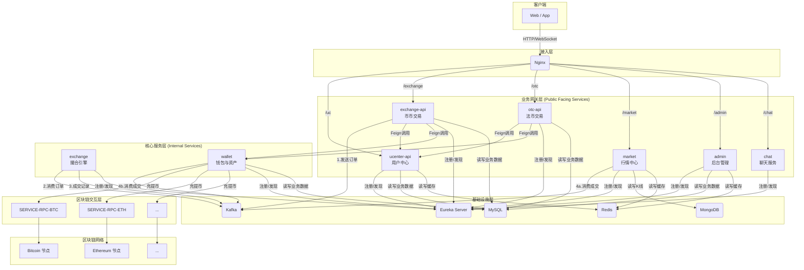
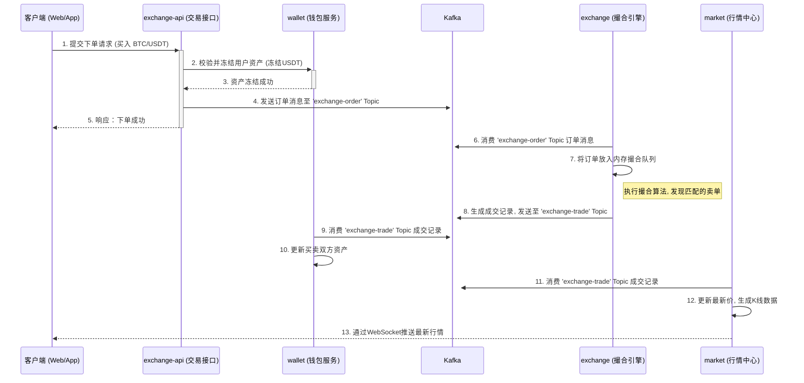
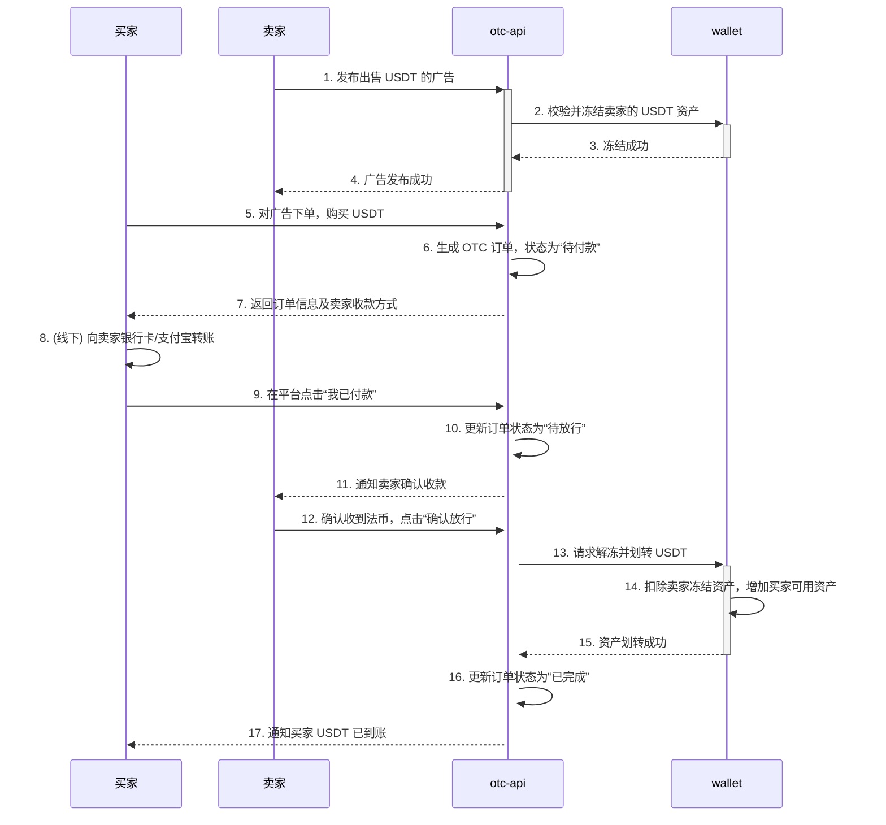
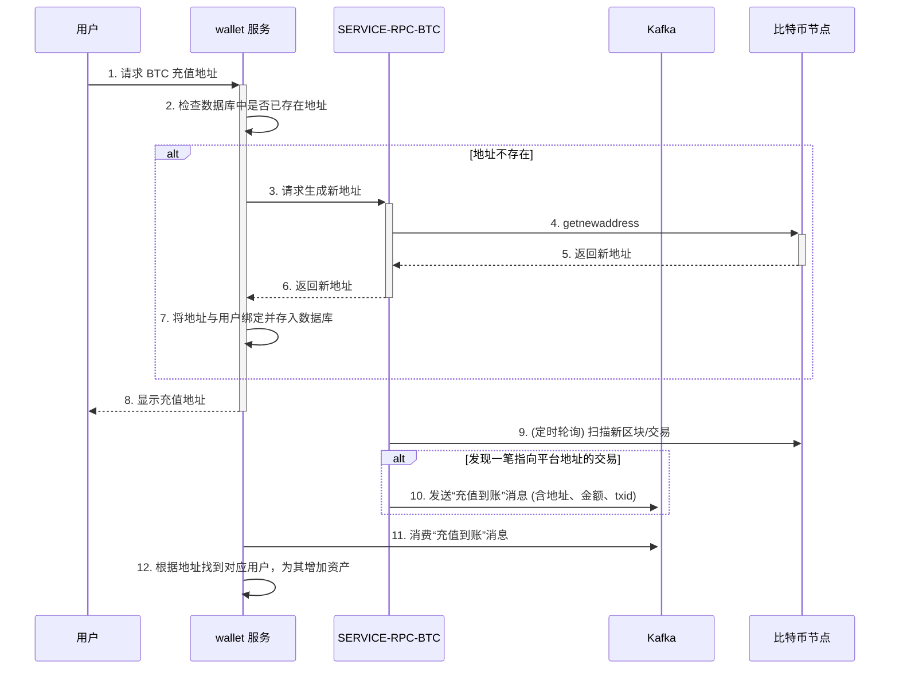

# 项目描述及架构设计文档 (V2.0)

## 1. 项目概述

本项目是一个功能完善的数字货币交易平台，采用基于 Spring Cloud 的微服务架构构建。系统被拆分为多个独立的服务，如用户中心、行情中心、交易引擎、后台管理等，每个服务都可以独立部署和扩展。这种架构设计提高了系统的可维护性、可扩展性和容错能力。

系统核心功能包括用户管理、币币交易、法币交易（OTC）、钱包管理、实时行情展示和后台管理等。服务间通过 REST API 和 Feign 进行同步通信，并通过 Kafka 消息队列进行异步解耦，确保了核心业务流程的高性能和高可用性。

## 2. 技术栈

| 技术领域 | 主要技术 | 说明 |
| :--- | :--- | :--- |
| **核心框架** | Spring Boot, Spring Cloud | 用于快速构建和管理微服务。 |
| **服务治理** | Eureka | 用于服务的注册、发现和治理。 |
| **数据库** | MySQL, MongoDB, Druid | MySQL 存储核心业务数据，MongoDB 存储行情数据，Druid 作为连接池。 |
| **缓存** | Redis | 用于热点数据缓存，提升系统性能。 |
| **消息队列** | Apache Kafka | 用于服务间的异步通信、事件驱动和日志收集。 |
| **安全控制** | Spring Security, Shiro | 提供全面的认证、授权和会话管理。 |
| **数据访问** | Spring Data JPA, Spring Data MongoDB | 简化数据访问层的开发。 |
| **实时通信** | WebSocket | 用于向客户端实时推送行情、深度等市场数据。 |
| **项目管理** | Maven | 用于项目构建和依赖管理。 |

---

## 3. 系统架构设计

### 3.1 分层架构

系统整体采用经典的分层架构设计，确保各层职责清晰，易于维护和扩展。

*   **客户端 (Client Layer)**: 用户直接交互的界面，包括 Web 浏览器和移动 App。
*   **接入层 (Gateway Layer)**: 所有外部流量的统一入口，由 Nginx 担任，负责反向代理、负载均衡、SSL 卸载等。
*   **业务网关层 (Business Gateway Layer)**: 直接面向客户端请求的微服务，它们是业务逻辑的入口，负责参数校验、权限认证，并将处理任务分发给核心服务层。
*   **核心服务层 (Core Service Layer)**: 不直接对外暴露，负责处理核心的、复杂的业务逻辑，如撮合交易、资产结算等。
*   **区块链交互层 (Blockchain Interaction Layer)**: 负责与不同公链节点进行 RPC 通信的适配层，将区块链的复杂性与核心业务逻辑解耦。
*   **基础设施层 (Infrastructure Layer)**: 提供数据库、缓存、消息队列、服务注册中心等基础技术支持。

### 3.2 整体架构图

### 3.3 核心概念解析

*   **撮合引擎 (Matching Engine)**: 交易所的核心，负责接收买卖订单，并按照“价格优先、时间优先”的原则进行匹配成交。本项目的 `exchange` 模块即是撮合引擎的实现。
*   **订单簿 (Order Book)**: 在内存中维护的、某个交易对的所有未成交的买卖订单列表。撮合引擎基于订单簿进行交易匹配。
*   **KYC (Know Your Customer)**: 实名认证流程。为了符合反洗钱（AML）法规，交易所通常要求用户提供身份证明以完成认证。
*   **冷/热钱包 (Cold/Hot Wallet)**: 一种钱包安全策略。**热钱包**在线，用于处理日常频繁的充提操作；**冷钱包**离线，存储平台大部分资金，以隔离网络风险，提升安全性。
*   **RPC (Remote Procedure Call)**: 远程过程调用。`wallet` 服务通过调用各币种的 `SERVICE-RPC` 服务，来间接与区块链节点交互，实现如查询余额、广播交易等操作。

---

## 4. 模块详解

| 模块名 | 定位 | 核心职责 |
| :--- | :--- | :--- |
| **cloud** | 基础设施 | Eureka 服务注册中心，提供服务注册与发现功能。 |
| **core** | 基础层 | 核心工具模块，包含项目所有公用的实体类、常量、工具类、DAO基类等。 |
| **ucenter-api** | 业务网关 | 用户中心，负责用户注册、登录、KYC、安全设置等，是所有用户相关操作的入口。 |
| **wallet** | 核心服务 | **钱包与资产中心**，管理所有用户的账户资产、处理充值、提现、内部资金划转等。**不直接对外暴露**。 |
| **exchange-api** | 业务网关 | **币币交易的入口**，负责接收用户的下单、撤单请求，校验后将订单信息发送至 Kafka。 |
| **exchange** | 核心服务 | **撮合引擎**，独立于 `exchange-api`。它从 Kafka 消费订单，在内存中进行撮合匹配，生成成交记录并再次发送到 Kafka。 |
| **otc-api** | 业务网关 | **法币交易 (OTC) 的入口**，负责广告的发布、C2C 交易下单、支付确认、申诉等流程。 |
| **market** | 业务网关 | **行情中心**，从 Kafka 消费成交数据，聚合成 K 线、Ticker 等行情信息，并通过 WebSocket 推送给客户端。 |
| **admin** | 业务网关 | 后台管理系统，提供对整个平台的运营管理功能，如用户管理、币种管理、订单管理、财务审计等。 |
| **chat** | 业务网关 | 聊天服务，为 OTC 交易等场景提供实时聊天功能。 |
| **SERVICE-RPC-*** | 区块链交互 | **区块链适配层**，每个币种对应一个独立的 RPC 服务，封装了与特定区块链节点交互的细节，为 `wallet` 服务提供统一接口。 |

---

## 5. 核心业务流程

### 5.1 币币交易下单流程

### 5.2 法币 (OTC) 交易流程

OTC 交易是用户间的点对点交易，平台作为担保方。

### 5.3 用户充值流程

---

## 6. 重点模块深度剖析

### 6.1 `exchange-api` 与 `exchange` (撮合引擎)

这种分离设计是一种典型的**CQRS (命令查询职责分离)** 和**异步处理**模式，带来了几个核心优势：
1.  **高吞吐量**：`exchange-api` 可以快速处理大量用户请求，只需将消息写入 Kafka 即可立即响应用户，无需等待撮合结果。
2.  **高可用性**：即使撮合引擎 `exchange` 暂时宕机，用户的交易请求也不会丢失，它们会暂存在 Kafka 中，待服务恢复后继续处理。
3.  **解耦与扩展性**：API 接口的迭代与撮合引擎的复杂算法优化可以独立进行，互不影响。

### 6.2 `otc-api` (法币交易)

`otc-api` 模块是 C2C 交易的核心。与币币交易不同，OTC 交易涉及用户间的线下支付和平台的确权仲裁，业务流程更长，状态更复杂。

*   **核心功能**:
    *   **广告管理**: 用户可以发布购买或出售数字货币的广告，并设置价格、数量、支付方式等。
    *   **订单撮合**: 用户根据广告下单，生成 OTC 订单。
    *   **状态机管理**: 订单状态包括：未付款、已付款、已完成、已取消、申诉中。服务需严格管理状态的流转。
    *   **资产担保**: 下单时，平台会冻结卖家的数字货币，确保交易安全。
    *   **聊天与申诉**: 集成 `chat` 服务，并提供申诉入口，由客服介入处理交易纠纷。

### 6.3 `market` (行情中心)

`market` 服务是一个承上启下的关键模块。它**解耦**了核心的交易撮合业务与前端的行情展示业务。`exchange` 模块只专注于高效地处理订单和生成交易，而 `market` 模块则负责所有与行情计算和分发相关的复杂工作。

### 6.4 `wallet` 与 `SERVICE-RPC` (钱包与区块链交互)

`wallet` 服务是整个平台所有用户资产的“总账本”，而 `SERVICE-RPC-*` 则是它与各个区块链网络沟通的“翻译官”和“外交官”。

*   **`wallet` 服务职责**:
    *   **内部账本管理**: 精确记录每个用户、每种币的可用余额和冻结余额。所有不涉及上链的业务（如币币交易、资金划转）都在此模块内完成。
    *   **充提业务发起**: 当用户发起充值或提现请求时，`wallet` 服务会调用相应的 `SERVICE-RPC` 服务来执行链上操作。
    *   **资产安全**: 执行提现风控、对账等核心安全策略。

*   **`SERVICE-RPC-*` 职责**:
    *   **API 抽象**: 封装不同区块链（如比特币的 `bitcoind`，以太坊的 `Geth`）的 RPC 接口，为 `wallet` 服务提供统一、简单的调用方式（如 `generateAddress()`, `sendTransaction()`）。
    *   **链上监控**: 持续扫描区块链，监控与平台相关的地址，发现充值交易后，通过 Kafka 通知 `wallet` 服务入账。
    *   **交易广播**: 接收 `wallet` 服务的提现指令，安全地构建、签名并广播交易到区块链网络。
