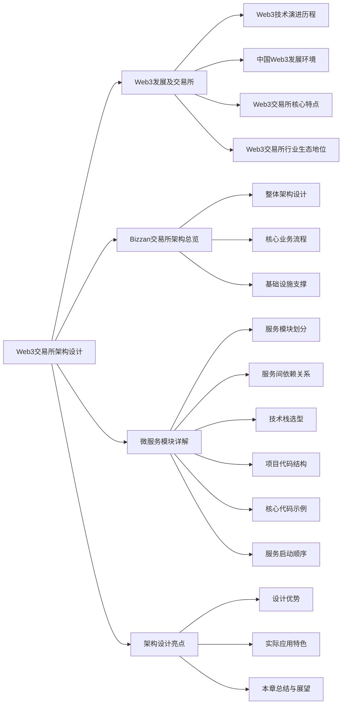
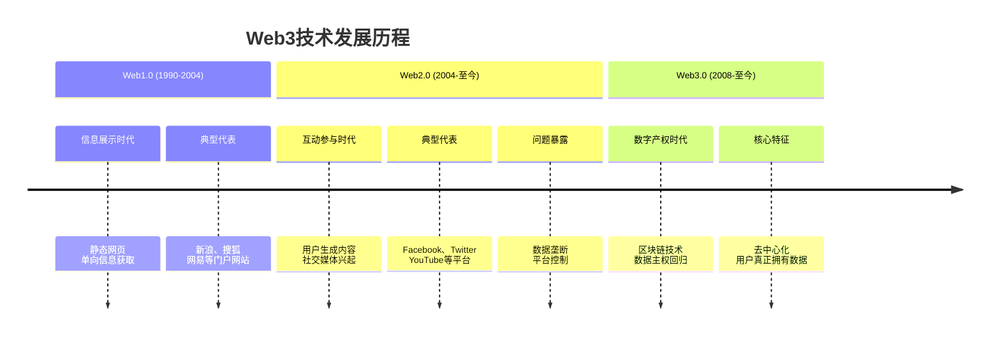
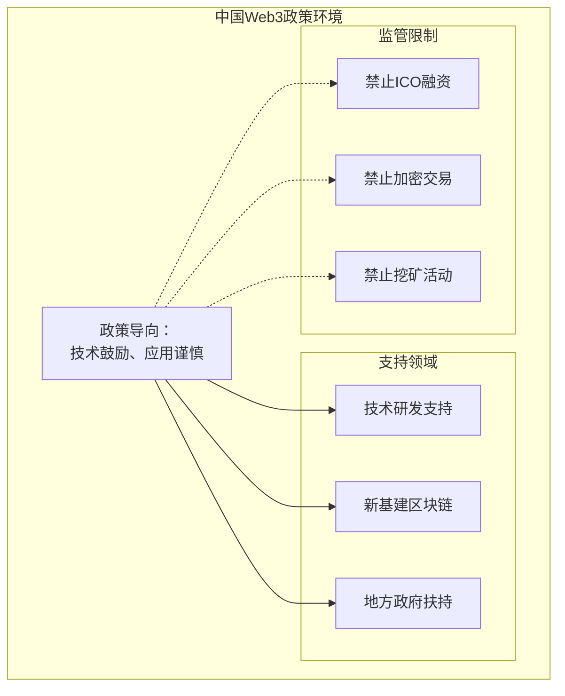
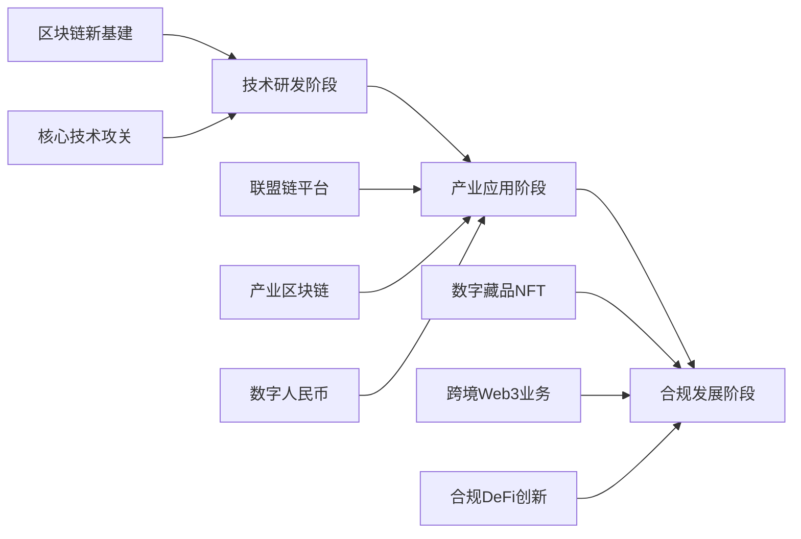
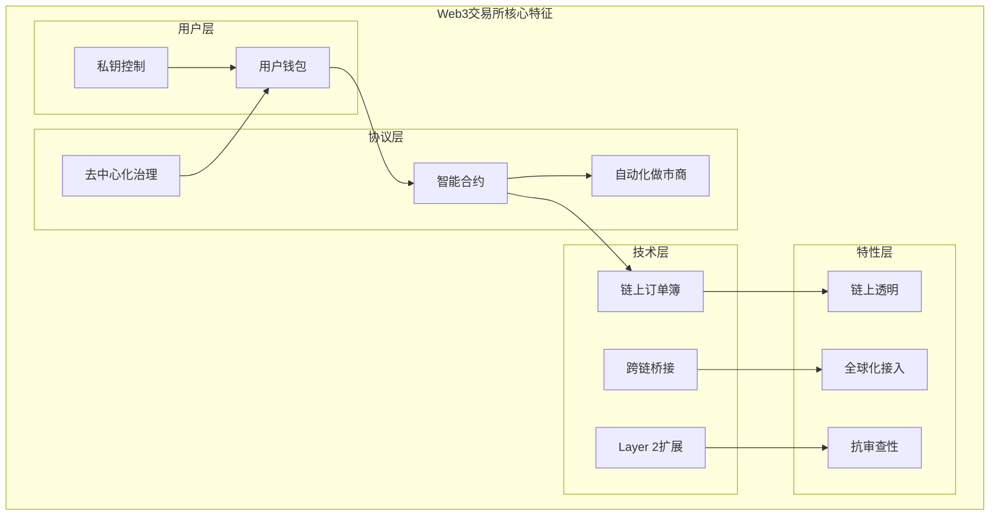
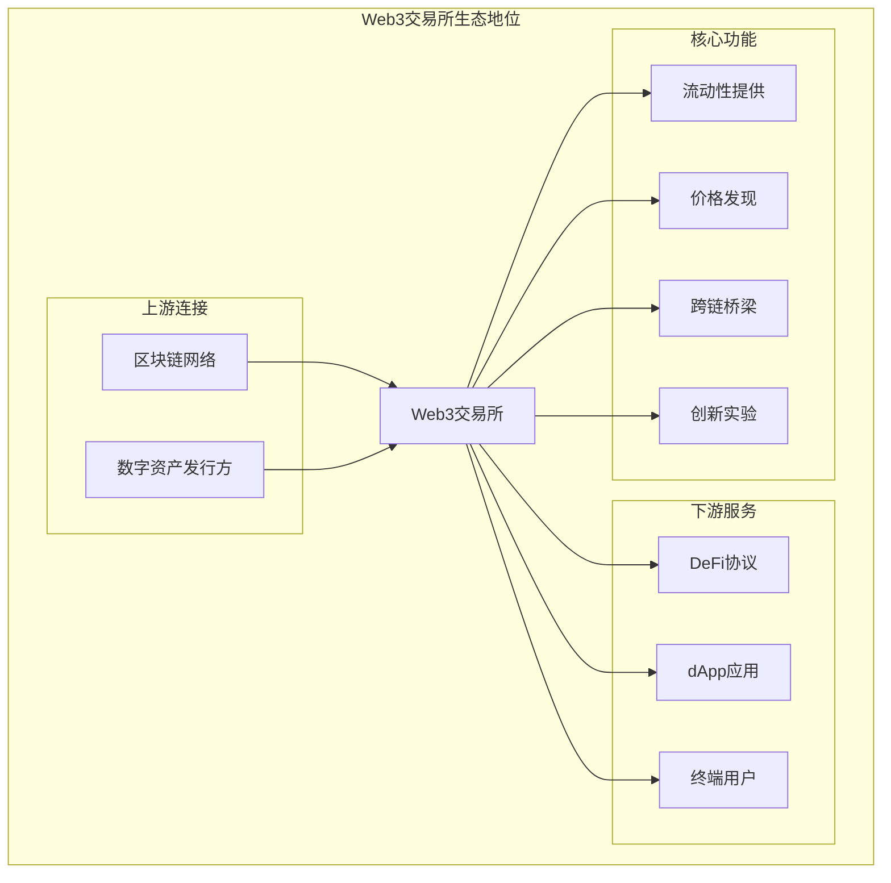
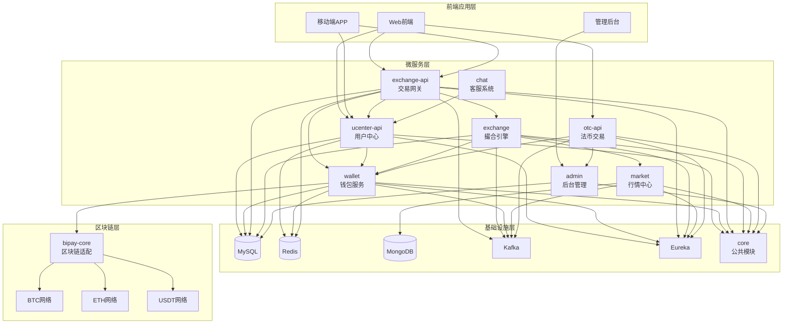
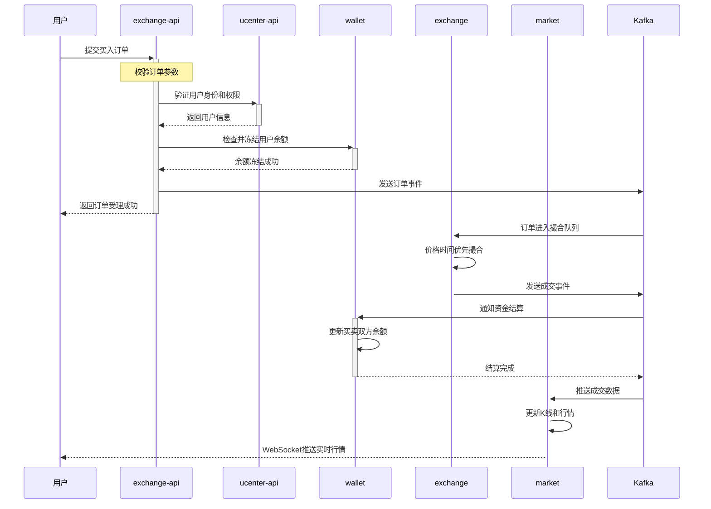
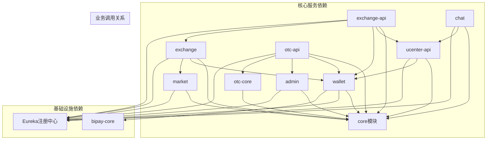
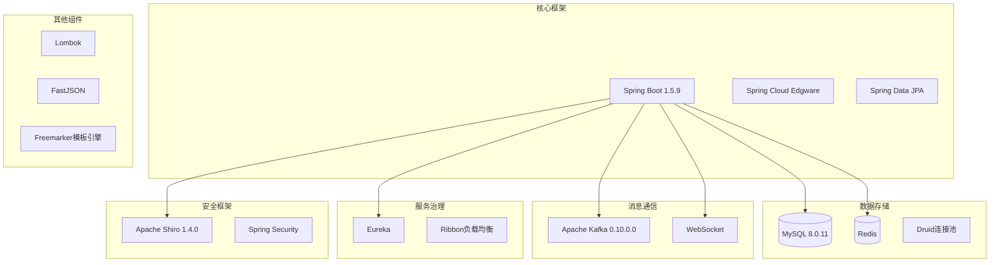

# 第 1 章：Web3交易所技术架构与微服务设计

## 引言

在我们开始深入学习数字货币交易所的技术实现之前，不妨先思考一个问题：为什么传统的互联网架构无法满足交易所的需求？

想象一下这样一个场景：当市场剧烈波动时，成千上万的用户同时进行买卖操作，系统需要在毫秒级响应时间内处理海量请求，确保每一笔交易的准确性和安全性。更重要的是，这里的每一行数据都代表着真实的资金，任何差错都可能造成巨大的经济损失。这正是Web3交易所面临的独特挑战。

Bizzan交易所作为连接传统金融与数字资产的重要桥梁，在这场技术变革中探索出了一条可行的路径。它采用基于Spring Cloud的微服务架构，将复杂的交易系统拆分为多个独立的服务模块，每个模块专注于特定的业务领域。

现在，让我们深入技术层面，看看Bizzan交易所是如何通过精巧的架构设计来解决这些挑战的。本章将详细分析：

- Bizzan交易所的整体技术架构是如何设计的？
- 各个微服务模块的职责和相互关系是怎样的？
- 技术栈选型和基础设施是如何支撑整个系统的？
- 项目代码结构和实现细节有哪些特色？

通过本章的学习，你将对Bizzan交易所的技术架构有全面的认识，为后续理解各个业务模块的实现打下坚实基础。



---

## Web3 发展及交易所

### Web3 技术演进历程

Web3技术发展经历了三个重要阶段，每个阶段都重新定义了用户与互联网的关系：



**Web3核心应用场景：**

| 应用领域 | 核心价值 | 典型应用 |
|---------|---------|---------|
| **DeFi** | 无需传统银行的金融服务 | 去中心化借贷、交易、理财 |
| **NFT** | 解决数字世界唯一性问题 | 数字艺术品、游戏道具、收藏品 |
| **DID** | 用户自主控制的数字身份 | 去中心化身份认证、数据授权 |
| **元宇宙** | 沉浸式虚拟世界体验 | 虚拟房产、数字分身、虚拟经济 |
| **DAO** | 基于智能合约的社区治理 | 去中心化决策、资金管理 |
| **Web3社交** | 用户真正拥有数据所有权 | 去中心化内容平台、社交网络 |

### 中国 Web3 发展环境

#### 政策导向与监管框架



**中国Web3发展路径：**



#### 技术发展特色

| 发展方向 | 技术特点 | 典型应用 | 优势 |
|---------|---------|---------|------|
| **联盟链优先** | 许可制、高性能 | 蚂蚁链、腾讯云区块链、百度超级链 | 监管可控、企业级应用 |
| **产业区块链** | 服务实体经济 | 供应链金融、产品溯源、政务服务 | 解决实际业务痛点 |
| **数字人民币** | 央行数字货币 | e-CNY钱包、数字支付 | 官方稳定币基础设施 |
| **数字藏品** | 规避金融属性 | 文化艺术品数字化 | 保护文化创新 |

#### 人才需求机会

**技术人才需求领域：**
- **传统企业区块链转型**：银行、保险、供应链等行业的数字化改造
- **联盟链技术开发**：企业级区块链平台建设与维护
- **Web2.5应用开发**：合规框架下的Web3技术创新应用
- **跨境Web3业务**：海外Web3生态的技术开发与运营

### Web3 交易所核心特点

Web3交易所是连接传统金融与数字资产的重要桥梁，其核心特征通过以下架构图清晰展示：



#### Web3 vs 传统交易所对比

| 对比维度 | 传统交易所 | Web3交易所 | 优势分析 |
|---------|-----------|-----------|---------|
| **资金托管** | 中心化托管 | 用户自持私钥 | Web3: 用户完全控制资金<br>传统: 专业托管，用户体验好 |
| **交易撮合** | 服务器撮合 | 智能合约撮合 | Web3: 透明可信<br>传统: 处理速度快 |
| **数据透明** | 内部管理 | 链上公开 | Web3: 完全透明可验证<br>传统: 隐私保护更好 |
| **准入门槛** | KYC认证 | 钱包地址即可 | Web3: 无门槛全球访问<br>传统: 合规性强 |
| **风险管理** | 平台保障 | 用户自担风险 | Web3: 避免单点故障<br>传统: 用户保障完善 |
| **交易成本** | 平台手续费 | Gas费用 | Web3: 成本透明<br>传统: 费率相对稳定 |
| **流动性** | 集中深度 | 分散激励 | Web3: 通过激励聚合<br>传统: 自然流动性 |

### Web3 交易所行业生态地位

#### 在数字资产生态中的定位



#### Web3交易所的核心价值

| 核心价值 | 具体体现 | 对生态系统的贡献 |
|---------|---------|-----------------|
| **价值转换枢纽** | 连接不同区块链网络，实现资产跨链转移 | 打破区块链孤岛，促进资产流动 |
| **价格发现中心** | 通过市场交易形成资产公允价格 | 为整个生态提供价格信号 |
| **流动性提供平台** | 为DeFi协议和dApp提供交易流动性 | 支撑整个DeFi生态的运行 |
| **创新实验场** | 新币种、新交易模式的首发平台 | 推动金融创新和技术进步 |
| **合规桥梁** | 连接传统金融与数字金融 | 促进传统资金进入Web3领域 |

**Web3交易所的生态意义：**

Web3交易所作为核心基础设施，为整个Web3生态系统提供了流动性支撑、价格发现和价值转换功能，是推动Web3技术普及和商业化的关键力量。随着技术成熟和监管完善，将在维护金融安全、提升交易效率、促进技术创新方面发挥更大作用。

---

## 1. Bizzan交易所架构总览

理解了Web3的基本概念和发展趋势后，让我们深入实践，看看Bizzan交易所是如何将这些理念转化为具体的技术架构的。

每个优秀的架构设计背后都有一套核心的设计思想。在深入了解技术细节之前，让我们先把握几个关键概念：

微服务架构就像建设一个专业化的大型商场，与其建造一个超级大卖场，不如分成多个专业店铺，每个店铺专注于自己的业务领域。这种分工让每个服务都能独立发展，同时又能够协同工作。

事件驱动架构则像是现代城市的邮政系统。各个部门不需要直接打电话沟通，而是通过发送消息来交流，这样既提高了效率，又避免了相互等待。

混合存储策略体现了"物尽其用"的智慧。不同类型的数据有不同的特点，就像生活中我们既需要保险柜存放贵重物品，也需要便利贴记录临时信息，还需要档案室保存历史资料。

### 1.1 整体架构设计

Bizzan交易所的架构设计体现了现代分布式系统的最佳实践。通过分析`01_bizzan_framework`项目，我们可以看到一个清晰的四层架构设计：

这种分层设计就像建造一座现代化大楼，每一层都有明确的职责，从地基到屋顶层层递进，共同支撑起整个建筑的稳定运行。



### 1.2 核心业务流程

理解了静态的架构设计，我们来看看系统是如何动态运行的。一个完整的交易流程就像是一场精密的交响乐，每个微服务都是乐团中的不同乐器，按照既定的乐谱协同演奏。

让我们以用户下单交易为例，看看数据是如何在各个服务之间流动的。这个过程展现了微服务架构的真正价值：通过专业分工和异步协作，实现高效的业务处理。



从这个交易流程中，我们可以看到微服务架构的核心价值：专业分工让每个服务都能专注于自己的核心能力。

**exchange-api** 扮演着"总服务台"的角色，它负责接待用户请求，进行基础的安检和引导。这种设计让前端只需要和一个接口打交道，大大简化了客户端的复杂度。

**ucenter-api** 则像是"身份验证中心"，专门管理用户身份和权限。这种集中的身份管理让安全策略更容易实施和维护。

**wallet** 服务作为"资金管家"，专门处理资产的冻结、转移和结算。将资金操作独立出来，让安全控制更加严格和集中。

**exchange** 服务是真正的"交易撮合机"，它只专注于订单匹配算法，不涉及用户资金细节，这种单一职责保证了撮合的公平和高效。

**market** 服务就像是"行情广播站"，实时计算和推送市场数据，让所有参与者都能获得公平的信息。

这种设计带来的好处是显而易见的：每个服务都可以独立部署和扩展，就像专业化的车间，可以单独调整产能而不会影响整条生产线。更重要的是，当某个环节出现问题时，可以快速定位和修复，不会造成整个系统的瘫痪。

### 1.3 基础设施支撑

如果说微服务是大楼的各个功能房间，那么基础设施就是支撑整栋大楼运行的地下管网系统。Bizzan交易所依赖几个关键的基础组件来确保系统的稳定运行。

**服务注册与发现 - Eureka**

想象一下，在一个大型写字楼里，有几十家公司，每个公司都有自己的办公室号码。Eureka就是这栋写字楼的"前台登记处"。当每个微服务启动时，它都会向Eureka登记自己的地址和端口，就像公司入驻时在前台登记联系方式。

当其他服务需要调用时，不需要记住复杂的IP地址和端口号，只需要向Eureka询问"XXX服务在哪里？"，Eureka就会返回准确的联系方式。这种设计让服务的部署和迁移变得非常灵活。

**消息队列 - Kafka**

Kafka在系统中扮演着"内部邮政系统"的角色。在传统的单体应用中，各个模块通过函数调用直接通信，就像在一个房间里直接对话。但在微服务架构中，各个服务分布在不同的服务器上，直接调用会导致系统紧耦合。

Kafka通过异步消息解耦了服务之间的依赖。当exchange-api需要通知exchange服务有新订单时，它不需要直接调用exchange，而是向Kafka发送一个消息。exchange服务订阅了这个主题，收到消息后就会处理订单。这种设计让系统更加健壮，即使某个服务暂时不可用，消息也不会丢失。

**数据存储 - 混合存储策略**

Bizzan采用了因地制宜的存储策略，不同类型的数据使用最适合的存储方案：

**MySQL** 扮演着"银行保险柜"的角色，存储最重要的核心业务数据。用户信息、钱包余额、订单记录等数据要求绝对可靠和一致，任何丢失都可能导致严重后果。MySQL的事务特性和ACID保证为这些数据提供了坚实的安全保障。

**Redis** 就像是"便利的白板"，用于记录临时性的热点数据。会话信息、验证码、限流计数器这些数据特点是读写频繁，但即使丢失也不会造成致命影响。Redis的内存存储特性为这些数据提供了毫秒级的访问速度。

**MongoDB** 则像是"历史档案室"，专门存储海量的历史数据。K线数据、成交记录、统计信息这些数据量巨大但主要用来查询分析。MongoDB的文档模型和水平扩展能力让这些数据能够高效存储和检索。

---

## 2. 微服务模块详解

现在让我们深入探索Bizzan交易所的微服务家族，了解每个成员的独特职责和协作方式。

在深入了解每个服务之前，有几个基础概念需要理解。微服务架构就像是组建一个专业团队，每个成员都有自己的专长，但同时需要遵循团队的工作规则：

**服务注册发现**：想象一下，在一个大型企业中，新员工入职时需要在人事部门登记，其他同事需要联系时就可以通过人事部门查找。Eureka就是微服务世界的"人事部门"，管理着所有服务的联系方式。

**服务间通信**：团队成员之间需要沟通协作。有的沟通需要立即回复（同步调用），有的可以通过留言交流（异步消息）。Spring Cloud为这些不同的沟通方式提供了相应的工具。

**配置管理**：每个部门都有自己的工作规范和流程。配置管理就像是公司的制度手册，确保每个部门都按照统一的标准运作。

Bizzan交易所将这些理念转化为具体的微服务划分，让我们一起来看看这个专业团队是如何组建的。

### 2.1 服务模块划分

通过分析项目结构，我们可以看到Bizzan交易所将复杂的交易系统拆分成了11个独立模块，其中8个承担核心业务功能。这种模块化设计就像组建一个专业团队，每个成员都有明确的职责分工：

| 服务模块 | 主要职责 | 核心功能 | 启动类 |
|---------|---------|---------|--------|
| **cloud** | 服务注册中心 | Eureka服务注册与发现、配置管理 | - |
| **core** | 公共模块 | 实体类、工具类、常量定义、数据传输对象 | - |
| **ucenter-api** | 用户中心 | 用户注册/登录、KYC认证、权限控制、推广邀请 | UcenterApplication.java |
| **wallet** | 钱包服务 | 多币种余额管理、充值提现、资金流水、资产冻结 | WalletApplication.java |
| **exchange-api** | 交易网关 | 订单接收、参数校验、风控检查、行情查询接口 | ExchangeApiApplication.java |
| **exchange** | 撮合引擎 | 限价单处理、市价单处理、成交匹配、价格发现 | ExchangeApplication.java |
| **market** | 行情中心 | K线生成、深度数据、实时行情、交易统计推送 | MarketApplication.java |
| **otc-api** | 法币交易 | C2C交易、商家认证、订单撮合、资金托管 | OtcApiApplication.java |
| **otc-core** | OTC核心 | OTC业务核心逻辑、订单管理、认证处理 | - |
| **admin** | 后台管理 | 系统配置、用户管理、财务审核、数据统计 | AdminApplication.java |
| **chat** | 客服系统 | 实时客服、消息推送、工单管理 | ChatApplication.java |
| **bipay-core** | 区块链适配 | BTC/ETH/USDT等区块链网络适配、钱包管理 | - |
| **exchange-core** | 交易核心 | 交易核心业务逻辑、订单模型、交易规则 | - |

这种清晰的职责划分带来了显著的优势。就像一个配合默契的专业团队，每个成员都专注于自己最擅长的工作，整体效率自然就高了。更重要的是，当某个业务需要升级时，只需要调整对应的模块，不会影响其他功能的正常运行。

### 2.2 服务间依赖关系

虽然每个服务都独立运行，但它们之间并不是孤立的存在，而是通过精心设计的依赖关系形成一个有机的整体。理解这些依赖关系就像是了解企业内部的组织架构和汇报关系，对于系统维护和问题排查至关重要。



这张依赖图展示了三个层面的关系：

**核心服务依赖**：所有业务服务都依赖core模块，这就像所有员工都要遵守公司的基本规章制度。

**业务调用关系**：服务之间根据业务需要进行调用，比如exchange-api需要调用ucenter-api验证用户身份，调用wallet服务处理资金。这就像不同部门之间的工作协作。

**基础设施依赖**：所有服务都依赖Eureka进行服务注册，wallet服务还需要依赖bipay-core处理区块链相关操作。这就像所有部门都需要使用公司的基础办公设施。

### 2.3 技术栈选型

构建微服务架构就像选择建筑材料，每一项技术选择都会影响系统的性能、稳定性和可维护性。Bizzan交易所在技术选型上体现了务实和稳健的理念。

在选择技术栈时，开发团队需要权衡多个因素：

- **成熟度与稳定性**：选择经过市场验证的技术，避免成为新技术的试验品
- **社区活跃度**：活跃的社区意味着持续的技术支持和问题解决方案
- **性能表现**：满足交易系统对高并发、低延迟的苛刻要求
- **团队能力**：确保团队具备相应的技术积累和运维能力
- **生态兼容性**：各个技术组件之间能够良好配合，形成完整的技术生态

通过分析项目的POM配置，我们可以看到Bizzan交易所选择了一套经过实践检验的技术栈：



**核心技术组件解析：**

每个技术选择背后都有其深入的考量：

**Spring Boot 1.5.9** 选择这个版本体现了对稳定性的重视。2017年底的这个版本已经过大量生产环境检验，对于金融系统来说，可靠性永远比追赶最新技术更重要。

**Spring Cloud Edgware** 与Spring Boot 1.5.9是官方推荐的黄金搭档，提供了完整的微服务治理工具链，包括服务注册、负载均衡、配置管理等核心能力。

**Spring Data JPA** 让数据库操作变得优雅。通过注解就能将Java对象映射到数据库表，开发者可以专注于业务逻辑而不是SQL编写，这种设计大大提升了开发效率。

**Apache Shiro** 在安全框架的选择上很用心。相比更复杂的Spring Security，Shiro更加轻量级，API设计也更直观，这对于金融系统的安全要求来说是最佳平衡。

**MySQL 8.0.11** 作为主数据库，这个版本带来了显著的性能提升。对于交易所这种数据一致性要求极高的场景，MySQL的ACID特性是不可或缺的保障。

**Druid 1.1.9** 连接池的选择体现了对性能监控的重视。阿里巴巴开源的这个连接池不仅性能出色，还内置了强大的监控功能。

**Redis** 的使用展现了对响应速度的追求。将热点数据存储在内存中，访问速度比磁盘数据库快几个数量级，这对用户体验至关重要。

**Apache Kafka 0.10.0.0** 作为消息中间件，为系统提供了可靠的异步通信能力。高吞吐量和持久化特性确保了业务事件的可靠传递。

**WebSocket** 为交易者提供了实时的市场感知能力。在快速变化的数字货币市场，及时获取价格信息对交易决策具有重要意义。

### 2.4 项目代码结构

了解了技术栈，我们再来看看具体的代码组织结构。良好的代码结构就像整齐的书架，让开发者能够快速找到需要的代码。

基于实际项目结构，Bizzan交易所的代码组织如下：

```
01_bizzan_framework/01_bizzan_framework/
├── cloud/                    # Eureka服务注册中心
├── core/                     # 公共实体类和工具
├── ucenter-api/              # 用户中心服务
├── wallet/                   # 钱包服务
├── exchange-api/             # 交易网关服务
├── exchange/                 # 撮合引擎服务
├── market/                   # 行情服务
├── otc-api/                  # 法币交易服务
├── otc-core/                 # OTC核心业务
├── admin/                    # 后台管理服务
├── chat/                     # 客服系统
├── bipay-core/               # 区块链适配
├── exchange-core/            # 交易核心逻辑
└── sql/                      # 数据库初始化脚本
```

从这个目录结构可以看出，项目按照业务功能进行模块划分，每个模块都相对独立。这种组织方式的好处是：不同团队可以并行开发不同的模块，互不干扰。

每个服务模块都遵循标准的Maven项目结构，这就像每个部门都有标准化的办公布局：

```text
module-name/
├── src/
│   ├── main/
│   │   ├── java/com/bizzan/bitrade/     # Java源代码
│   │   │   ├── Application.java           # 启动类
│   │   │   ├── controller/                # 控制器层
│   │   │   ├── service/                   # 业务逻辑层
│   │   │   ├── entity/                    # 实体类
│   │   │   ├── config/                    # 配置类
│   │   │   └── consumer/                  # 消费者（如有）
│   │   └── resources/                      # 配置文件
│   │       ├── dev/                        # 开发环境配置
│   │       ├── test/                       # 测试环境配置
│   │       └── prod/                       # 生产环境配置
│   └── test/java/                           # 测试代码
├── pom.xml                                   # Maven配置文件
└── target/                                   # 编译输出目录
```

### 2.5 核心代码示例

理论说了这么多，让我们来看一些实际的代码示例，这样能更好地理解项目的实现方式。

让我们看看实际项目中的服务启动类，了解各个微服务的具体配置：

**服务启动类示例**：

当用户中心服务启动时，它需要处理用户相关的各种业务逻辑，但并不直接需要MongoDB支持。因此开发者在UcenterApplication中做了一个明智的配置选择：

```java
// 用户中心服务启动类 (UcenterApplication.java)
@SpringBootApplication
@EnableScheduling
@EnableDiscoveryClient
public class UcenterApplication {
    public static void main(String[] args) {
        SpringApplication.run(UcenterApplication.class, args);
    }
}
```

而撮合引擎作为系统的核心组件，需要确保与注册中心的稳定连接：

```java
// 撮合引擎服务启动类 (ExchangeApplication.java)
@SpringBootApplication
@EnableDiscoveryClient
@EnableEurekaClient
public class ExchangeApplication {
    public static void main(String[] args){
        SpringApplication.run(ExchangeApplication.class,args);
    }
}
```

这些启动类中的注解配置体现了微服务架构的设计考虑：

- `@SpringBootApplication`：Spring Boot的核心注解，提供自动配置和组件扫描功能
- `@EnableDiscoveryClient`：启用通用的服务发现功能，让服务能够注册到Eureka
- `@EnableEurekaClient`：专门针对Eureka的客户端注解，确保与Eureka注册中心的兼容性
- `@EnableScheduling`：启用定时任务功能，用于处理用户认证过期、数据清理等周期性任务

在实际运行中，UcenterApplication还特别排除了MongoDB的自动配置，避免了不必要的连接尝试，这种精细化的配置体现了生产环境的实践经验。

**核心依赖配置**：
```xml
<!-- 父级POM文件中的核心依赖管理 -->
<parent>
    <groupId>org.springframework.boot</groupId>
    <artifactId>spring-boot-starter-parent</artifactId>
    <version>1.5.9.RELEASE</version>
</parent>

<properties>
    <spring-cloud.version>Edgware.RELEASE</spring-cloud.version>
    <kafka_version>0.10.0.0</kafka_version>
    <mysql.version>8.0.11</mysql.version>
    <druid_version>1.1.9</druid_version>
</properties>
```

这个POM配置展示了版本管理的重要性。通过在父POM中统一管理版本号，可以确保所有模块使用相同的依赖版本，避免版本冲突。

### 2.6 服务启动顺序

根据`启动顺序.txt`文件，正确的服务启动顺序为：

1. **cloud** - 服务注册中心（必须最先启动）
2. **market** - 行情中心
3. **exchange** - 撮合引擎
4. **ucenter-api** - 用户中心
5. **wallet** - 钱包服务
6. **exchange-api** - 交易网关
7. **otc-api** - 法币交易服务
8. **admin** - 后台管理服务
9. **chat** - 客服系统

为什么要有这样的启动顺序呢？这就像盖房子要先打地基一样：

- **cloud必须最先启动**：因为它是服务注册中心，其他服务都需要向它注册
- **market和exchange优先启动**：因为它们是基础服务，其他服务可能依赖它们
- **wallet在ucenter-api之后启动**：因为钱包服务需要验证用户身份
- **exchange-api最后启动**：因为它是最上层的业务服务，依赖多个其他服务

这个启动顺序确保了依赖关系正确，避免了服务启动失败的问题。

---

## 3. 架构设计亮点

通过对Bizzan交易所的深入分析，我们可以总结出其架构设计的几个突出亮点。这些亮点就像是一个优秀建筑的设计精髓，每个细节都有其存在的理由。

### 3.1 设计优势

**完善的微服务生态**
- **11个独立模块**：涵盖从基础设施到业务功能的完整服务生态。就像一个功能齐全的城市，有政府部门、商业区、住宅区等，各司其职。
- **清晰的职责边界**：每个服务专注于特定业务领域，避免功能交叉。这就像专业分工，让每个人做自己最擅长的事情。
- **模块化设计**：便于独立开发、测试、部署和扩展。这就像搭积木，可以灵活组合和替换。

**技术栈成熟可靠**
- **Spring Boot 1.5.9 + Spring Cloud Edgware**：稳定的企业级微服务框架。选择经过市场验证的技术，就像选择可靠的建筑材料。
- **混合存储策略**：MySQL + Redis + MongoDB满足不同业务需求。这就像一个家庭既有保险柜（MySQL），又有便利贴（Redis），还有档案室（MongoDB）。
- **消息驱动架构**：Apache Kafka确保服务间高效异步通信。这就像现代城市的邮政系统，高效、可靠。

**区块链集成能力**
- **独立的区块链适配层**：bipay-core模块统一管理多条区块链网络。这就像一个翻译器，能让系统说不同的区块链"语言"。
- **多币种支持**：支持BTC、ETH、USDT等主流数字资产。这就像多币种银行账户，方便管理不同类型的资产。
- **热冷钱包分离**：通过架构设计保障资产安全。这就像把大部分钱存在银行（冷钱包），只留少量现金在身上（热钱包）。

### 3.2 实际应用特色

除了架构设计上的亮点，Bizzan交易所在实际应用中也体现了一些值得学习的特色：

**启动顺序优化**
根据项目实际部署经验，制定了科学的服务启动顺序，确保系统稳定运行。这不是理论上的最佳实践，而是在实际项目中摸索出来的经验，就像开车时要遵循的交通规则，都是用经验换来的。

**环境配置管理**
支持dev、test、prod三套环境配置，便于开发、测试和生产环境的切换。这就像一个演员有不同的戏服，在不同场合穿不同的衣服，确保每个环境都使用最适合的配置。

**分层架构实现**
每个服务都采用标准的controller-service-dao分层架构，代码结构清晰，易于维护。这就像现代建筑的标准楼层设计，每层都有明确的用途，便于管理和扩展。

### 3.3 本章总结与展望

通过本章的学习，我们对Bizzan交易所的技术架构有了全面的认识。从一个Web3交易所的理念出发，我们深入了解了微服务架构的设计思想、具体的技术选型、代码组织方式以及实际的应用特色。

就像学习武功要先练好基本功一样，理解整体架构是深入学习各个具体模块的前提。现在我们有了"全局地图"，知道了每个模块在系统中的位置和作用。

理解了Bizzan交易所的整体技术架构后，下一章我们将进入实战环节：学习如何搭建完整的开发环境。理论再好，也要动手实践才能真正掌握。在下一章中，我们将重点学习：

- **开发环境部署**：如何通过Docker Compose一键启动所有中间件服务
- **服务启动顺序**：深入理解cloud、market、exchange等服务的启动顺序和依赖关系
- **服务注册发现**：掌握Eureka注册中心的配置和使用
- **消息队列配置**：配置Kafka消息队列和相关Topic，理解事件驱动架构
- **数据库初始化**：分析MySQL数据库表结构，理解数据存储设计

通过下一章的学习，你将能够在本地完整搭建Bizzan交易所的开发环境，为后续深入理解用户中心、钱包系统、交易撮合等核心业务模块打下坚实基础。

通过本章的学习，我们不仅看到了一个完整的Web3交易所技术架构，更重要的是理解了架构设计的思维方式。

Bizzan交易所的架构设计告诉我们一个重要道理：技术选型不是为了炫技，而是为了解决问题。微服务架构让每个模块都能独立发展，混合存储策略让不同类型的数据各得其所，事件驱动让复杂的业务流程变得简单有序。

这就像建造一座现代化城市，不是为了用最先进的建筑材料，而是为了让居民生活得更便利、更安全。Bizzan交易所的架构设计就是为数字资产交易这个"城市"提供了一个既坚固又灵活的"基础设施"，能够支撑各种复杂的业务场景，同时保证用户的资金安全。

当我们设计自己的系统时，也要记住这个原则：站在用户的角度思考问题，用技术为业务创造价值，而不是为了技术而技术。
