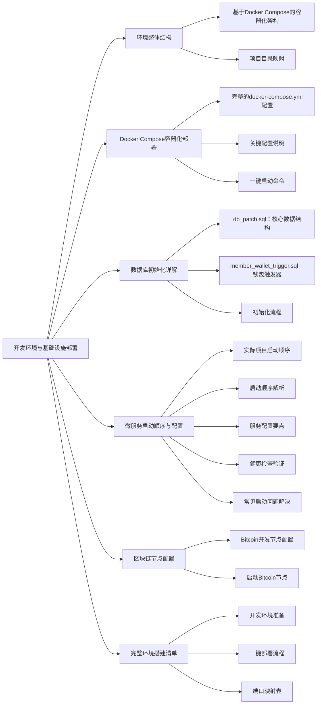
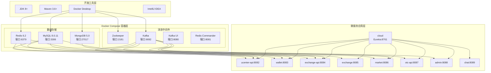
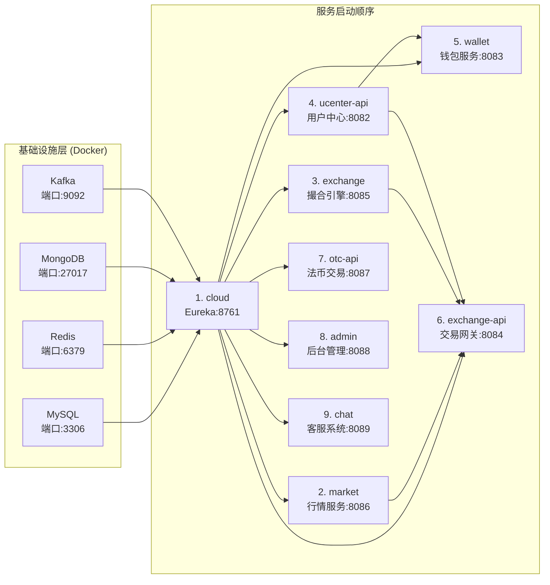

# 第 2 章：开发环境与基础设施部署

## 引言

在上一章中，我们了解了Bizzan交易所的整体技术架构。现在，让我们从理论走向实践，把这些复杂的微服务真正运行起来。

要把一个Web3交易所"跑起来"，第一步不是写业务代码，而是把一整套环境搭好。这就像建一座大楼，建筑师图纸画得再好，没有施工队伍和建筑材料也是白搭。和传统单体应用不同，Web3交易所至少要启动：注册中心、多个业务服务、数据库、缓存、消息队列，有时还要配合本地链节点或RPC服务。

新同学第一次拉起项目时，经常遇到各种令人头疼的问题：端口被占用、服务连不上数据库、Kafka不工作、某个微服务始终注册不到Eureka。这些问题就像高速公路上的堵车，一个小问题就能让整个系统瘫痪。

Bizzan交易所采用了Docker Compose容器化部署来简化中间件管理，这就像使用预制件建房子，大大降低了施工难度。

本章的目标很简单：从工程视角给你一张"环境地图"，帮你弄清楚有哪些基础设施、它们之间的依赖关系是什么、如何通过Docker Compose一键部署，以及本地开发时推荐的启动顺序和配置方式。

读完之后，你应该可以做到：
- 通过 `docker-compose up` 一键启动所有中间件
- 使用 `sql` 目录中的脚本正确初始化数据库
- 按照依赖顺序启动微服务，避免启动错误
- 理解每个基础设施组件在整个系统中的作用和配置要点

掌握了环境搭建，你就可以真正开始探索这个复杂的微服务世界了。



---

## 2.1 环境整体结构

### 基于Docker Compose的容器化架构

在深入具体的环境搭建之前，我们需要理解几个核心概念：

**Docker容器化**：将应用程序及其依赖项打包到轻量级、可移植的容器中，确保在不同环境中的一致性。

**Docker Compose**：用于定义和运行多容器Docker应用程序的工具，通过YAML文件配置所有服务。

**微服务基础设施**：支撑微服务运行的基础组件，包括数据库、缓存、消息队列等。

基于对 `01_bizzan_framework/01_bizzan_framework` 项目的分析，Bizzan交易所采用了现代化的容器化部署架构。这种设计思想很巧妙：把复杂的环境搭建问题，通过容器化技术变得简单可控。

整个开发环境可以分为三个层次，就像一座城市的规划：

**开发工具层**（施工工具）：
- **JDK 8+** 和 **Maven**：基础Java开发环境，这是Java项目的必备工具，就像建筑工人的锤子和扳手。
- **Docker Desktop**：容器运行环境，用于运行所有中间件。这是我们的"预制件工厂"，能够快速搭建各种环境。
- **IDEA/VSCode**：代码编辑器，这是建筑师的绘图桌。

**基础设施容器层**（城市基础设施）：
这些通过Docker Compose管理，就像城市的水电气网系统：
- **MySQL 8.0.11**：核心业务数据存储，相当于城市的数据档案库
- **Redis 6.2**：缓存和会话存储，相当于城市的便民服务站
- **MongoDB 5.0**：时序数据（K线、行情），相当于城市的历史博物馆
- **Kafka + Zookeeper**：消息队列和事件总线，相当于城市的邮政系统
- **管理界面**：Kafka UI、Redis Commander（可选），相当于城市监控中心

**微服务应用层**（城市功能区）：
- **cloud**：Eureka服务注册中心，相当于城市的通信管理局
- **业务服务**：ucenter-api、wallet、exchange-api、exchange、market、otc-api、admin、chat，这些是城市的各个功能区域



### 项目目录映射

了解了整体的架构层次，我们再来看看具体的项目目录结构。这就像查看城市的详细地图，知道每个建筑都在什么位置。

```
bizzan-exchange/
├── docker-compose.yml                    # 容器编排配置，相当于城市总体规划图
├── 01_bizzan_framework/01_bizzan_framework/  # 主项目区域
│   ├── cloud/                           # Eureka 注册中心，城市通信大厦
│   ├── ucenter-api/                     # 用户中心服务，市民服务中心
│   ├── wallet/                          # 钱包服务，城市银行
│   ├── exchange-api/                    # 交易网关服务，证券交易所
│   ├── exchange/                        # 撮合引擎服务，交易核心大厅
│   ├── market/                          # 行情服务，信息发布中心
│   ├── otc-api/                         # 法币交易服务，外汇兑换中心
│   ├── admin/                           # 后台管理服务，市政管理中心
│   ├── chat/                            # 客服系统，市民服务热线
│   └── sql/                             # 数据库初始化脚本，城市基础数据
│       ├── db_patch.sql                 # 主数据库脚本，城市建设规划
│       └── member_wallet_trigger.sql    # 钱包触发器，财务监控规则
└── 02_bizzan_wallet_rpc/                # 区块链RPC服务，国际连接处
    └── docker/
        └── docker-compose.yml           # Bitcoin节点配置，国际线路
```

从这个目录结构可以看出，项目组织得很清晰。主项目和区块链RPC服务分离，就像一个城市既要管理内部事务，也要与外部世界连接。每个模块都有明确的职责，这让整个项目更容易理解和维护。

---

## 2.2 Docker Compose 容器化部署

了解项目结构后，我们来看看如何实际运行这些基础设施。传统部署方式有很多痛点：版本不一致、配置复杂、启动顺序混乱等。就像手工制作家具，每个零件尺寸都可能不一样，组装起来问题多多。

Bizzan交易所通过Docker Compose统一管理所有中间件，这就像使用标准化的预制件，每个组件都有精确的规格，组装起来既快速又可靠。

### 完整的 docker-compose.yml 配置

项目根目录下的 `docker-compose.yml` 文件就是我们的"组装说明书"，定义了所有基础设施容器的规格和连接方式：

```yaml
services:
  mysql:
    image: mysql:8.0.42
    container_name: mysql
    environment:
      # 时区上海
      TZ: Asia/Shanghai
      # root 密码
      MYSQL_ROOT_PASSWORD: NjfKttzTsrWeJ8jA1
      # 初始化数据库
      MYSQL_DATABASE: exchange
      MYSQL_USER: exchange
      MYSQL_PASSWORD: NjfKttzTsrWeJ8jA1
    ports:
      - "3306:3306"
    volumes:
      # 数据挂载
      - ./mysql/data/:/var/lib/mysql/
      # 配置挂载
      - ./mysql/conf/:/etc/mysql/conf.d/
    command:
      # 将mysql8.0默认密码策略 修改为 原先 策略 (mysql8.0对其默认策略做了更改 会导致密码无法匹配)
      --default-authentication-plugin=mysql_native_password
      --character-set-server=utf8mb4
      --collation-server=utf8mb4_general_ci
      --explicit_defaults_for_timestamp=true
      --lower_case_table_names=1
    privileged: true

  redis:
    image: redis:7.2.8
    container_name: redis
    ports:
      - "6379:6379"
    environment:
      # 时区上海
      TZ: Asia/Shanghai
    volumes:
      # 配置文件
      - ./redis/conf:/redis/config
      # 数据文件
      - ./redis/data/:/redis/data/
    command: "redis-server /redis/config/redis.conf"
    privileged: true

  zookeeper:
    image: confluentinc/cp-zookeeper:7.0.1
    ports:
      - "2181:2181"
    environment:
      ZOOKEEPER_CLIENT_PORT: 2181
      ZOOKEEPER_TICK_TIME: 2000
    volumes:
      - ./zookeeper/data:/var/lib/zookeeper/data

  kafka:
    image: confluentinc/cp-kafka:7.0.1
    ports:
      - "9092:9092"
    environment:
      KAFKA_BROKER_ID: 1
      KAFKA_ZOOKEEPER_CONNECT: zookeeper:2181
      KAFKA_ADVERTISED_LISTENERS: PLAINTEXT://192.168.0.103:9092
      KAFKA_LISTENER_SECURITY_PROTOCOL_MAP: PLAINTEXT:PLAINTEXT
      KAFKA_INTER_BROKER_LISTENER_NAME: PLAINTEXT
      KAFKA_OFFSETS_TOPIC_REPLICATION_FACTOR: 1
      KAFKA_MESSAGE_MAX_BYTES: 2000000
    volumes:
      - /var/run/docker.sock:/var/run/docker.sock
      - ./kafka/data:/var/lib/kafka/data
    depends_on:
      - zookeeper

  mongo:
    image: mongo:3.6
    container_name: mongo
    restart: always
    ports:
      - "27017:27017"
    environment:
      TZ: Asia/Shanghai
      MONGO_INITDB_ROOT_USERNAME: mongo
      MONGO_INITDB_ROOT_PASSWORD: mongo
    volumes:
      - ./mongodb/db:/data/db
      - ./mongodb/log:/var/log/mongodb
    privileged: true

networks:
  default:
    name: web3-network

```

### 关键配置说明

这个配置文件中有很多值得学习的细节，让我们逐一分析：

**MySQL 配置亮点**：
- **版本精确匹配**：使用 `mysql:8.0.11` 与项目 pom.xml 中的版本完全一致。这就像选用指定规格的螺丝钉，确保与其他组件完美配合。
- **自动初始化**：通过 `./sql:/docker-entrypoint-initdb.d` 挂载初始化脚本。这就像新房装修时，开发商帮你提前做好了基础装修。
- **认证插件**：`--default-authentication-plugin=mysql_native_password` 解决连接兼容性问题。这就像准备了一把万能钥匙，确保各种工具都能打开数据库大门。
- **持久化存储**：`mysql_data` 卷确保数据不丢失。就像给房子配备了地下室，东西可以安全存储。

**Kafka 配置亮点**：
- **自动创建Topic**：`KAFKA_AUTO_CREATE_TOPICS_ENABLE: 'true'` 便于开发调试。这就像自动分拣系统，信件来了自动找到对应的邮箱。
- **管理界面**：Kafka UI 提供可视化的 Topic 和消息管理。这就像安装了监控摄像头，可以实时查看邮政系统的工作状态。
- **依赖管理**：通过 `depends_on` 确保 Zookeeper 先于 Kafka 启动。这就像先建好地基再盖房子，顺序不能乱。


### 一键启动命令

配置文件准备好了，现在来看看具体的使用方法。这些命令就像是基础设施工具箱的使用说明书：

```bash
# 启动所有中间件
docker-compose up -d
# 就像是按下城市基础设施的总开关，水电网开始供应

# 查看容器状态
docker-compose ps
# 就像是查看各个设施的运行状态仪表盘

# 查看日志
docker-compose logs -f mysql
# 就像是监听某个设施的运行日志，及时发现问题

# 停止所有容器
docker-compose down
# 就像是关闭城市的基础设施供应

# 停止并删除数据卷（谨慎使用）
docker-compose down -v
# 就像是拆除基础设施，这会导致数据丢失，所以要小心使用
```

---

## 2.3 数据库初始化详解

基础设施启动后，数据库就像一个空房子，需要家具和装修才能入住。数据库初始化就是为这个"房子"配置必要的数据结构和初始数据。

在深入了解具体的初始化脚本之前，让我们先理解几个重要概念：

**数据库表结构**：定义数据如何组织和存储的蓝图，包括字段类型、约束、索引等。

**触发器**：数据库中的自动执行程序，在特定事件（如INSERT、UPDATE、DELETE）发生时自动触发。

**数据迁移**：管理数据库结构变更的机制，确保团队开发过程中数据库的一致性。

基于对 `01_bizzan_framework/01_bizzan_framework/sql/` 目录的分析，数据库初始化包含两个核心脚本：

### db_patch.sql：核心数据结构

这个脚本包含了交易所的核心业务数据结构，主要包括：

**币种管理表**：
```sql
-- 支持的数字货币配置
CREATE TABLE `coin` (
  `name` varchar(255) NOT NULL,           -- 币种名称 (BTC, ETH, USDT等)
  `can_auto_withdraw` int(11),            -- 是否支持自动提币
  `can_recharge` int(11),                 -- 是否支持充值
  `can_withdraw` int(11),                 -- 是否支持提币
  `max_withdraw_amount` decimal(18,8),    -- 最大提币数量
  `min_withdraw_amount` decimal(18,8),    -- 最小提币数量
  `miner_fee` decimal(18,8),              -- 矿工费
  `withdraw_scale` int(11) DEFAULT '4',   -- 提币精度
  `cold_wallet_address` varchar(255),     -- 冷钱包地址
  PRIMARY KEY (`name`)
);

-- 初始币种数据
INSERT INTO `coin` VALUES ('Bitcoin', '0', '0', '1', '0', '0', '0', '0.0002', '5.00000000', '0.0002', '0.00100000', '比特币', '1', '0', 'BTC', '0', '0.10000000', '', null, '0.00000000', '4');
INSERT INTO `coin` VALUES ('USDT', '1', '1', '1', '1', '0', '1', '0', '0.0002', '5.00000000', '0.0002', '0.00100000', '泰达币T', '1', '0', 'USDT', '0', '0.10000000', '', null, '0.00000000', '4');
```

**交易对配置表**：
```sql
-- 币币交易对配置
CREATE TABLE `exchange_coin` (
  `symbol` varchar(255) NOT NULL,         -- 交易对符号 (BTC/USDT)
  `base_coin_scale` int(11) NOT NULL,     -- 基础币种精度
  `coin_scale` int(11) NOT NULL,          -- 计价币种精度
  `fee` decimal(8,4) DEFAULT NULL,        -- 交易手续费
  `enable_market_buy` int(11) DEFAULT '1', -- 是否启用市价买入
  `enable_market_sell` int(11) DEFAULT '1',-- 是否启用市价卖出
  `max_trading_order` int(11) DEFAULT '0', -- 最大同时交易订单数
  PRIMARY KEY (`symbol`)
);

-- 初始交易对
INSERT INTO `exchange_coin` VALUES ('BTC/USDT', '2', 'USDT', '2', 'BTC', '1', '0.0010', '1', '1', '1', '0.00000000', '1', '0', '0', null, '0.00000000');
```

**后台权限管理**：
- `admin`：后台用户表
- `admin_role`：角色表
- `admin_permission`：权限表
- `admin_role_permission`：角色权限关联表

### member_wallet_trigger.sql：钱包触发器

这个脚本实现了钱包余额变更的自动审计功能：

```sql
-- 钱包历史记录表
CREATE TABLE `member_wallet_history` (
  `id` bigint(20) NOT NULL AUTO_INCREMENT,
  `member_id` int(11) NOT NULL,            -- 用户ID
  `coin_id` varchar(255) NOT NULL,         -- 币种ID
  `before_balance` decimal(18,8) NOT NULL, -- 变更前余额
  `after_balance` decimal(18,8) DEFAULT NULL, -- 变更后余额
  `before_frozen_balance` decimal(18,8) DEFAULT '0.00000000', -- 变更前冻结余额
  `after_frozen_balance` decimal(18,8) DEFAULT '0.00000000',  -- 变更后冻结余额
  `op_time` datetime DEFAULT NULL,         -- 操作时间
  PRIMARY KEY (`id`)
);

-- 钱包余额变更触发器
DELIMITER $$
create trigger trigger_update_wallet
after update on member_wallet
for each row
begin
 INSERT INTO member_wallet_history(member_id,coin_id,before_balance,after_balance,before_frozen_balance,after_frozen_balance,op_time)
 VALUES (new.member_id,new.coin_id,old.balance,new.balance,old.frozen_balance,new.frozen_balance,now());
end$$
DELIMITER ;
```

**触发器的作用**：
- **自动审计**：每次钱包余额变更都会自动记录历史
- **数据追踪**：可以追踪每一笔余额变更的前后状态
- **安全保障**：为财务审计提供完整的数据链路

### 初始化流程

1. **Docker 自动执行**：当 MySQL 容器首次启动时，会自动执行 `/docker-entrypoint-initdb.d/` 目录下的 SQL 文件
2. **执行顺序**：
   - 先执行 `db_patch.sql` 创建表结构和基础数据
   - 后执行 `member_wallet_trigger.sql` 创建触发器
3. **验证初始化**：
   ```sql
   -- 检查币种数据
   SELECT * FROM coin;
   
   -- 检查交易对数据
   SELECT * FROM exchange_coin;
   
   -- 检查触发器
   SHOW TRIGGERS LIKE 'trigger_update_wallet';
   ```

---

## 2.4 微服务启动顺序与配置

基于 `01_bizzan_framework/01_bizzan_framework/启动顺序.txt` 的实际部署经验，微服务的启动顺序对系统稳定性至关重要。

### 实际项目启动顺序



### 启动顺序解析

**阶段1：基础设施准备**
```bash
# 确保所有中间件已启动
docker-compose up -d

# 验证容器状态
docker-compose ps
```

**阶段2：核心服务启动**
```bash
# 1. 启动 Eureka 注册中心 (必须最先启动)
cd 01_bizzan_framework/01_bizzan_framework/cloud
mvn spring-boot:run

# 验证 Eureka 控制台
# 访问: http://localhost:8761
```

**阶段3：业务服务启动**
```bash
# 按照依赖顺序依次启动各服务
cd 01_bizzan_framework/01_bizzan_framework

# 2. 行情服务 (依赖 MongoDB)
cd market
mvn spring-boot:run

# 3. 撮合引擎 (依赖 Kafka)
cd exchange
mvn spring-boot:run

# 4. 用户中心 (依赖 MySQL, Redis)
cd ucenter-api
mvn spring-boot:run

# 5. 钱包服务 (依赖用户中心)
cd wallet
mvn spring-boot:run

# 6. 交易网关 (依赖多个服务)
cd exchange-api
mvn spring-boot:run

# 7-9. 其他服务...
cd otc-api && mvn spring-boot:run
cd admin && mvn spring-boot:run
cd chat && mvn spring-boot:run
```

### 服务配置要点

基于对项目 `application-dev.properties` 的分析，关键配置包括：

**数据库连接配置**：
```properties
# 统一的数据源配置
spring.datasource.url=jdbc:mysql://localhost:3306/bizzan?useUnicode=true&characterEncoding=utf-8&serverTimezone=Asia/Shanghai
spring.datasource.username=bizzan
spring.datasource.password=bizzan123
spring.datasource.driver-class-name=com.mysql.cj.jdbc.Driver

# Druid 连接池配置
spring.datasource.type=com.alibaba.druid.pool.DruidDataSource
spring.datasource.druid.initial-size=5
spring.datasource.druid.min-idle=5
spring.datasource.druid.max-active=20
```

**Redis 配置**：
```properties
spring.redis.host=localhost
spring.redis.port=6379
spring.redis.timeout=3000
spring.redis.database=0
spring.redis.jedis.pool.max-active=8
spring.redis.jedis.pool.max-idle=8
spring.redis.jedis.pool.min-idle=0
```

**Kafka 配置**：
```properties
spring.kafka.bootstrap-servers=localhost:9092
spring.kafka.consumer.group-id=bizzan-group
spring.kafka.consumer.auto-offset-reset=latest
spring.kafka.consumer.key-deserializer=org.apache.kafka.common.serialization.StringDeserializer
spring.kafka.consumer.value-deserializer=org.apache.kafka.common.serialization.StringDeserializer
spring.kafka.producer.key-serializer=org.apache.kafka.common.serialization.StringSerializer
spring.kafka.producer.value-serializer=org.apache.kafka.common.serialization.StringSerializer
```

**Eureka 配置**：
```properties
eureka.client.service-url.defaultZone=http://localhost:8761/eureka/
eureka.instance.prefer-ip-address=true
eureka.instance.lease-renewal-interval-in-seconds=30
```

### 健康检查验证

启动完成后，通过以下方式验证服务状态：

```bash
# 检查 Eureka 注册中心
curl http://localhost:8761/eureka/apps

# 检查各服务健康状态
curl http://localhost:8082/health  # ucenter-api
curl http://localhost:8083/health  # wallet
curl http://localhost:8084/health  # exchange-api
```

### 常见启动问题解决

**端口冲突**：
```bash
# 查看端口占用
netstat -tulpn | grep :8761

# 修改服务端口 (在各服务的 application.properties)
server.port=8762
```

**数据库连接失败**：
```bash
# 验证 MySQL 容器状态
docker-compose logs mysql

# 进入 MySQL 容器检查
docker exec -it bizzan-mysql mysql -u root -p
```

**服务注册失败**：
```bash
# 检查 Eureka 日志
docker-compose logs cloud

# 验证网络连通性
ping localhost:8761
```

---

## 2.5 Nginx反向代理配置

在微服务架构中，前端应用无法直接访问多个后端微服务，需要通过Nginx作为反向代理来统一管理API请求。Nginx就像是一个智能的"前台接待员"，负责将前端的请求准确转发到对应的后端服务。

### Nginx在微服务架构中的作用

**请求路由**：根据URL路径将请求转发到不同的微服务，实现统一的API入口。

**负载均衡**：当某个微服务有多个实例时，Nginx可以分发请求，提高系统的可用性。

**WebSocket支持**：为实时通信功能（如行情推送、聊天）提供WebSocket代理支持。

**跨域处理**：解决前端跨域访问后端服务的问题。

### 完整的Nginx配置

创建 `nginx.conf` 文件，配置如下：

```nginx
events {
    worker_connections 1024;
}

http {
    # 定义上游服务组
    upstream uc {
        server 127.0.0.1:8082;  # ucenter-api 服务
    }

    upstream market {
        server 127.0.0.1:8086;  # market 服务
    }

    upstream chat {
        server 127.0.0.1:8089;  # chat 服务
    }

    upstream exchange {
        server 127.0.0.1:8085;  # exchange 服务
    }

    upstream otc {
        server 127.0.0.1:8087;  # otc-api 服务
    }

    upstream admin {
        server 127.0.0.1:8088;  # admin 服务
    }

    server {
        listen 8888;
        server_name 127.0.0.1 localhost;

        # 访问 /uc/ 开头的路径，代理到 ucenter-api 服务
        location /uc/ {
            proxy_pass http://uc;
            proxy_set_header Host $http_host;
            proxy_set_header X-Real-IP $remote_addr;
            proxy_set_header X-Forwarded-For $proxy_add_x_forwarded_for;
            proxy_set_header X-Forwarded-Proto $scheme;
        }

        # 访问 /market/ 开头的路径，代理到 market 服务
        # market 服务使用 WebSocket，需要特殊配置
        location /market/ {
            proxy_pass http://market;
            # WebSocket 特殊配置
            proxy_http_version 1.1;
            proxy_set_header Upgrade $http_upgrade;
            proxy_set_header Connection "upgrade";
            proxy_set_header Host $http_host;
            proxy_set_header X-Real-IP $remote_addr;
            proxy_set_header X-Forwarded-For $proxy_add_x_forwarded_for;
            proxy_set_header X-Forwarded-Proto $scheme;
        }

        location /chat/ {
            proxy_pass http://chat;
            proxy_set_header Host $http_host;
            proxy_set_header X-Real-IP $remote_addr;
            proxy_set_header X-Forwarded-For $proxy_add_x_forwarded_for;
            proxy_set_header X-Forwarded-Proto $scheme;
        }

        location /exchange/ {
            proxy_pass http://exchange;
            proxy_set_header Host $http_host;
            proxy_set_header X-Real-IP $remote_addr;
            proxy_set_header X-Forwarded-For $proxy_add_x_forwarded_for;
            proxy_set_header X-Forwarded-Proto $scheme;
        }

        location /otc/ {
            proxy_pass http://otc;
            proxy_set_header Host $http_host;
            proxy_set_header X-Real-IP $remote_addr;
            proxy_set_header X-Forwarded-For $proxy_add_x_forwarded_for;
            proxy_set_header X-Forwarded-Proto $scheme;
        }

        location /admin/ {
            proxy_pass http://admin;
            proxy_set_header Host $http_host;
            proxy_set_header X-Real-IP $remote_addr;
            proxy_set_header X-Forwarded-For $proxy_add_x_forwarded_for;
            proxy_set_header X-Forwarded-Proto $scheme;
        }
    }
}
```

### 配置解析

#### Upstream服务组定义

```nginx
upstream uc {
    server 127.0.0.1:8082;  # ucenter-api 服务
}
```

**作用**：定义后端服务组，便于统一管理。当某个服务需要部署多个实例时，可以添加多个server行实现负载均衡。

#### 代理配置说明

**基础代理配置**：
- `proxy_pass`：指定转发的目标服务
- `proxy_set_header Host`：保留原始请求的Host头
- `proxy_set_header X-Real-IP`：传递真实客户端IP
- `proxy_set_header X-Forwarded-For`：传递代理链信息
- `proxy_set_header X-Forwarded-Proto`：传递原始协议（http/https）

**WebSocket特殊配置**：
```nginx
proxy_http_version 1.1;
proxy_set_header Upgrade $http_upgrade;
proxy_set_header Connection "upgrade";
```

这些配置对于market服务的实时行情推送功能至关重要，确保WebSocket连接能够正常建立。

### Docker方式部署Nginx

为了保持环境一致性，推荐使用Docker方式部署Nginx：

```yaml
# 在docker-compose.yml中添加nginx服务
nginx:
  image: nginx:1.21-alpine
  container_name: bizzan-nginx
  ports:
    - "8888:8888"
  volumes:
    - ./nginx.conf:/etc/nginx/nginx.conf:ro
  depends_on:
    - mysql
    - redis
    - kafka
  restart: unless-stopped
```

### 启动Nginx服务

```bash
# 方式1：直接使用nginx命令
nginx -c /path/to/nginx.conf

# 方式2：使用Docker（推荐）
docker run -d \
  --name bizzan-nginx \
  -p 8888:8888 \
  -v $(pwd)/nginx.conf:/etc/nginx/nginx.conf:ro \
  nginx:1.21-alpine
```

### 验证代理配置

启动Nginx后，可以通过以下方式验证配置是否正确：

```bash
# 检查nginx配置文件语法
nginx -t -c /path/to/nginx.conf

# 测试用户中心接口
curl http://localhost:8888/uc/health

# 测试行情服务接口
curl http://localhost:8888/market/health

# 测试WebSocket连接
wscat -c ws://localhost:8888/market/ws
```

### 前端集成示例

前端应用通过统一的API地址访问后端服务：

```javascript
// API基础配置
const API_BASE_URL = 'http://localhost:8888';

// 用户中心API调用
const userAPI = {
    login: (data) => axios.post(`${API_BASE_URL}/uc/member/login`, data),
    getUserInfo: () => axios.get(`${API_BASE_URL}/uc/member/info`),
};

// 行情服务API调用
const marketAPI = {
    getKline: (symbol) => axios.get(`${API_BASE_URL}/market/kline/${symbol}`),
    subscribe: (symbol) => {
        const ws = new WebSocket(`ws://localhost:8888/market/ws/${symbol}`);
        return ws;
    },
};
```

### 常见问题解决

#### 502 Bad Gateway错误

**原因**：后端服务未启动或端口配置错误

**解决方案**：
1. 检查对应微服务是否正常启动
2. 验证upstream中的IP和端口是否正确
3. 查看Nginx错误日志：`tail -f /var/log/nginx/error.log`

#### WebSocket连接失败

**原因**：WebSocket代理配置不正确

**解决方案**：
1. 确保market服务已启动
2. 检查WebSocket相关配置
3. 使用浏览器开发者工具查看连接详情

#### 跨域问题

如果仍然出现跨域问题，可以添加CORS配置：

```nginx
location /uc/ {
    proxy_pass http://uc;
    # 添加CORS头
    add_header Access-Control-Allow-Origin *;
    add_header Access-Control-Allow-Methods 'GET, POST, OPTIONS';
    add_header Access-Control-Allow-Headers 'DNT,X-Mx-ReqToken,Keep-Alive,User-Agent,X-Requested-With,If-Modified-Since,Cache-Control,Content-Type,Authorization';

    if ($request_method = 'OPTIONS') {
        return 204;
    }

    # 其他代理配置...
}
```

Nginx反向代理配置完成后，前端应用就可以通过统一的入口（http://localhost:8888）访问所有后端微服务，大大简化了前端的部署和配置复杂性。

---

## 2.6 区块链节点配置

基于 `02_bizzan_wallet_rpc/docker/docker-compose.yml` 的分析，项目还包含 Bitcoin 节点的配置，用于测试和开发。

### Bitcoin 开发节点配置

```yaml
version: '3'

services:
  bitcoind:
    image: ruimarinho/bitcoin-core:22.0
    container_name: bitcoin-regtest
    volumes:
      - ./bitcoin-data:/bitcoin/.bitcoin
    ports:
      # RPC Port
      - "18443:18443"
      # P2P Port
      - "18444:18444"
    command:
      - "-regtest=1"                    # 使用回归测试网络
      - "-rpcuser=user"                 # RPC 用户名
      - "-rpcpassword=pass"             # RPC 密码
      - "-rpcallowip=0.0.0.0/0"         # 允许所有IP访问
      - "-rpcbind=0.0.0.0"              # 绑定所有接口
      - "-txindex=1"                    # 启用交易索引
      - "-server=1"                     # 启用服务器模式
      - "-fallbackfee=0.00001"          # 默认手续费
```

**配置特点**：
- **回归测试网络**：`-regtest=1` 用于本地开发测试
- **快速出块**：可以通过 RPC 命令手动生成区块
- **独立网络**：不与主网或测试网连接，完全隔离

### 启动 Bitcoin 节点

```bash
cd 02_bizzan_wallet_rpc/docker
docker-compose up -d

# 生成区块 (测试用)
docker exec bitcoin-regtest bitcoin-cli -regtest -rpcuser=user -rpcpassword=pass generate 101

# 查看钱包余额
docker exec bitcoin-regtest bitcoin-cli -regtest -rpcuser=user -rpcpassword=pass getbalance
```

---

## 2.6 完整环境搭建清单

### 开发环境准备

**基础工具**（一句话介绍）：
- **JDK 8+**：Java 开发环境，Spring Boot 1.5.9 的运行基础
- **Maven 3.6+**：项目构建和依赖管理工具
- **Docker Desktop**：容器运行环境，用于管理所有中间件

### 一键部署流程

```bash
# 1. 启动所有中间件
docker-compose up -d

# 2. 等待服务就绪
docker-compose ps

# 3. 验证数据库初始化
docker exec -it bizzan-mysql mysql -u bizzan -pbizzan123 -e "SHOW DATABASES;"

# 4. 启动微服务 (按顺序)
cd 01_bizzan_framework/01_bizzan_framework/cloud && mvn spring-boot:run &
cd 01_bizzan_framework/01_bizzan_framework/market && mvn spring-boot:run &
cd 01_bizzan_framework/01_bizzan_framework/exchange && mvn spring-boot:run &
cd 01_bizzan_framework/01_bizzan_framework/ucenter-api && mvn spring-boot:run &
cd 01_bizzan_framework/01_bizzan_framework/wallet && mvn spring-boot:run &
cd 01_bizzan_framework/01_bizzan_framework/exchange-api && mvn spring-boot:run &
```

### 端口映射表

| 服务 | 端口 | 访问地址 | 说明 |
|------|------|----------|------|
| Eureka | 8761 | http://localhost:8761 | 服务注册中心 |
| MySQL | 3306 | localhost:3306 | 数据库 |
| Redis | 6379 | localhost:6379 | 缓存 |
| MongoDB | 27017 | localhost:27017 | 时序数据库 |
| Kafka | 9092 | localhost:9092 | 消息队列 |
| Kafka UI | 8080 | http://localhost:8080 | Kafka 管理界面 |
| Redis Commander | 8081 | http://localhost:8081 | Redis 管理界面 |
| ucenter-api | 8082 | http://localhost:8082 | 用户中心 |
| wallet | 8083 | http://localhost:8083 | 钱包服务 |
| exchange-api | 8084 | http://localhost:8084 | 交易网关 |
| exchange | 8085 | http://localhost:8085 | 撮合引擎 |
| market | 8086 | http://localhost:8086 | 行情服务 |
| otc-api | 8087 | http://localhost:8087 | 法币交易 |
| admin | 8088 | http://localhost:8088 | 后台管理 |
| chat | 8089 | http://localhost:8089 | 客服系统 |
| **Nginx反向代理** | **8888** | **http://localhost:8888** | **统一API入口** |
| Bitcoin RPC | 18443 | localhost:18443 | Bitcoin 节点 |

---

## 2.7 小结

通过本章的学习，我们掌握了 Bizzan 交易所的完整开发环境搭建：

**容器化部署的优势**：
- **环境一致性**：Docker 确保开发、测试、生产环境完全一致
- **版本管理**：精确控制 MySQL 8.0.11、Kafka 0.10.0.0 等中间件版本
- **一键启动**：通过 `docker-compose up` 快速启动所有基础设施
- **数据持久化**：通过 Docker Volume 保证数据不丢失

**数据库自动化初始化**：
- **自动执行**：MySQL 容器启动时自动执行 SQL 脚本
- **完整结构**：包含币种管理、交易对、权限系统等核心表
- **审计支持**：钱包触发器实现余额变更的自动记录

**科学的启动顺序**：
- **基础设施优先**：先启动 Docker 容器
- **注册中心先行**：Eureka 必须最先启动
- **按依赖启动**：遵循服务间的依赖关系

经过本章的学习，我们已经成功搭建起一个完整的开发环境。这就像为一场大型演出搭建好了舞台：灯光（Docker）、音响（数据库）、后台（微服务）都已就绪，演员们可以开始表演了。

环境搭建看似是基础工作，但它的重要性往往被低估。一个好的开发环境就像是厨师的工具箱，工具齐全且摆放有序，做起菜来才能得心应手。通过Docker Compose，我们不仅解决了环境一致性问题，更重要的是建立了一套可重复、可验证的开发流程。

当我们未来需要扩展新的服务、添加新的中间件时，这套环境架构也能轻松应对。这种"一次搭建，处处使用"的理念，正是现代DevOps文化的核心价值。

记住，好的开始是成功的一半。有了这个稳固的基础设施，接下来我们就可以专注于业务逻辑的学习和实践了。
