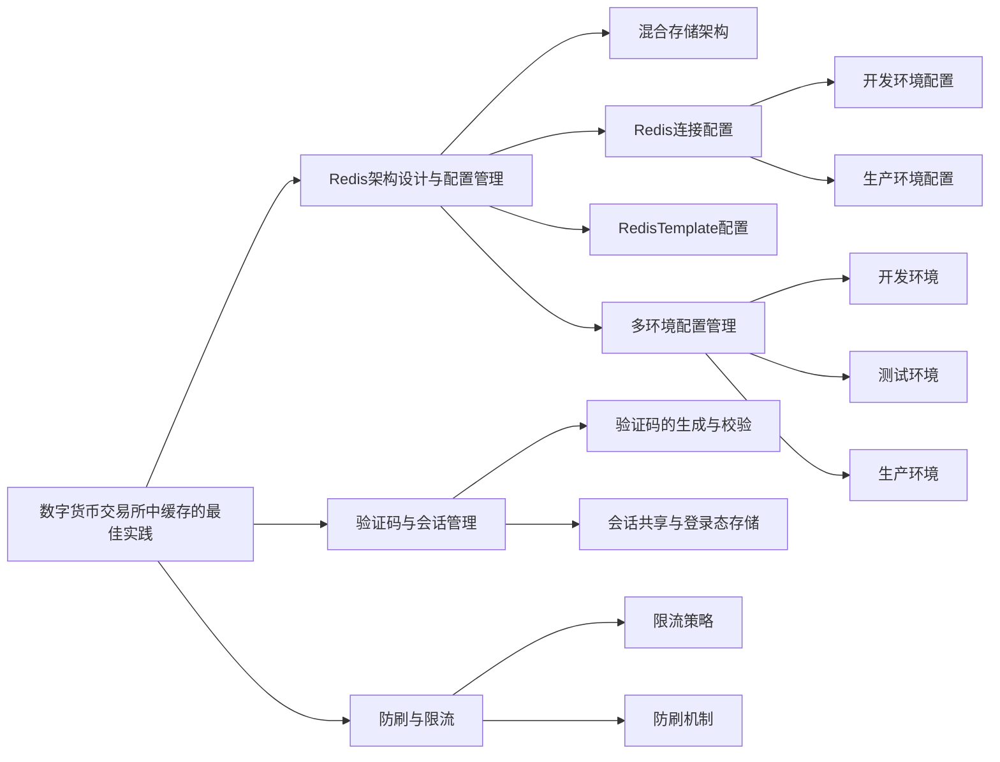
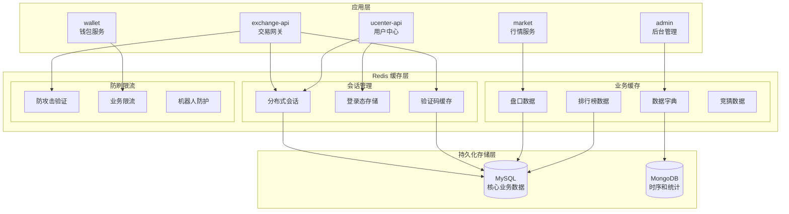

# 第 4 章：数字货币交易所中缓存的最佳实践

## 引言

在前面的章节中，我们深入了解了Bizzan交易所的数据库架构设计，探讨了MySQL和MongoDB如何协同处理复杂的金融数据。然而，在构建一个高性能的数字货币交易所时，仅依靠数据库的存储能力是远远不够的。

数字货币交易所面临着独特的挑战：成千上万的用户同时在线，频繁查询行情数据、刷新账户信息、进行交易操作。在这种高并发场景下，如果每个请求都直接访问数据库，系统很快就会达到性能瓶颈。实际上，通过分析交易所的访问模式可以发现，大部分请求都是读取操作：查询用户账户余额、获取实时行情、验证用户身份、检查交易权限等。

Bizzan交易所巧妙地将Redis集成到系统架构中，使其承担起**高性能缓存层**和**分布式状态管理中心**的双重职责。这种架构设计类似于现代化银行的业务模式：既要有安全的保险库（数据库）来保管重要资产，也要有高效的业务前台（缓存）来处理日常的查询和验证需求。

通过Redis的内存存储能力，系统将热点数据从磁盘数据库中解放出来，实现了查询响应速度的指数级提升。同时，Redis作为分布式数据共享中心，为多个微服务实例提供了统一的会话管理、验证码验证、防刷控制等状态服务，确保了整个系统的一致性和安全性。




---

## 4.1 Redis 架构设计与配置管理

### 4.1.1 混合存储架构

在深入探讨Redis的具体实现之前，我们需要理解几个缓存系统的核心概念，这些概念对于构建高性能的缓存架构至关重要。

**缓存穿透**指的是查询不存在数据的请求直接绕过缓存层访问数据库，这种情况通常发生在恶意攻击或数据确实不存在时。

**缓存雪崩**描述了大规模缓存同时失效的场景，导致所有请求瞬间涌向数据库，可能造成数据库过载甚至宕机。

**缓存击穿**是指热点数据缓存失效的瞬间，大量并发请求同时访问数据库的现象，这种情况在热门交易对或重要公告发布时尤为明显。

**分布式锁**为分布式环境下的数据一致性提供了保障机制，确保在多个服务实例同时操作共享资源时的数据安全。

**数据过期策略**是缓存生命周期管理的核心，通过合理的TTL（Time To Live）设置，平衡数据新鲜度和系统性能。


Bizzan交易所基于这些缓存理论，设计了一套完整的三层存储架构。通过分析项目的实际实现，我们可以看到这套架构如何为交易所提供高性能的数据服务：





### 4.1.2 RedisTemplate 配置详解

在Bizzan交易所的项目中，Redis的配置通过专门的配置类进行管理，确保了整个系统对Redis的一致使用方式。让我们查看实际项目中的Redis配置实现。

**Redis配置类的实现**

在ucenter-api模块中，RedisCacheConfig类定义了系统的缓存管理策略：

```java
// 文件位置：ucenter-api/src/main/java/com/bizzan/bitrade/config/RedisCacheConfig.java
@Configuration
@EnableCaching
public class RedisCacheConfig extends CachingConfigurerSupport {

    /**
     * 缓存管理器配置
     * 设置全局缓存过期时间为30分钟
     */
    @Bean
    public CacheManager cacheManager(RedisTemplate<?, ?> redisTemplate) {
        RedisCacheManager cacheManager = new RedisCacheManager(redisTemplate);
        cacheManager.setDefaultExpiration(1800);
        return cacheManager;
    }

    /**
     * RedisTemplate配置
     * 负责Redis操作的核心模板类
     */
    @Bean
    public RedisTemplate<String, String> redisTemplate(RedisConnectionFactory factory) {
        StringRedisTemplate template = new StringRedisTemplate(factory);

        // 配置JSON序列化器
        Jackson2JsonRedisSerializer jackson2JsonRedisSerializer =
            new Jackson2JsonRedisSerializer(Object.class);

        ObjectMapper om = new ObjectMapper();
        om.setVisibility(PropertyAccessor.ALL, JsonAutoDetect.Visibility.ANY);
        om.enableDefaultTyping(ObjectMapper.DefaultTyping.NON_FINAL);
        jackson2JsonRedisSerializer.setObjectMapper(om);

        // 设置值序列化器
        template.setValueSerializer(jackson2JsonRedisSerializer);
        template.setHashValueSerializer(jackson2JsonRedisSerializer);
        template.afterPropertiesSet();
        return template;
    }
}
```

**配置设计的技术考量**

**缓存管理器的全局策略**
通过设置30分钟的默认过期时间，系统在数据新鲜度和性能之间取得了平衡。这个时间设置考虑了交易所数据的更新频率：用户基本信息相对稳定，而交易数据变化较快。

**JSON序列化的选择**
选择Jackson2JsonRedisSerializer而不是默认的JDK序列化器有几个重要原因：
- **可读性**：JSON格式便于开发和调试时直接查看
- **跨语言兼容**：JSON格式可以被其他语言系统解析
- **类型安全**：通过ObjectMapper的类型信息，确保反序列化时的类型正确性
- **存储效率**：相比JDK序列化，JSON通常占用更少的存储空间

**连接池配置策略**

在实际的application.properties文件中，Redis连接池的配置体现了不同环境的需求差异：

**开发环境配置**
```properties
# 本地开发环境的Redis配置
spring.redis.host=localhost
spring.redis.port=6379
spring.redis.pool.max-active=300      # 最大连接数
spring.redis.pool.max-wait=60000     # 最大等待时间60秒
spring.redis.pool.max-idle=100        # 最大空闲连接
spring.redis.pool.min-idle=20         # 最小空闲连接
spring.redis.timeout=30000            # 连接超时30秒
```

**生产环境优化**
生产环境通常需要更加严格的资源控制：
- 更大的最大连接数以应对高并发
- 更短的等待时间以快速失败
- 合理的空闲连接数以平衡性能和资源消耗

这种配置策略确保了系统在不同环境下都能提供稳定可靠的Redis服务。

### 4.1.4 多环境配置管理

Bizzan交易所采用标准的Spring Profile机制来管理不同环境的Redis配置，确保开发、测试、生产环境使用合适的连接参数：

**环境配置策略**

```properties
# 开发环境配置 (application-dev.properties)
spring.redis.host=localhost
spring.redis.port=6379
spring.redis.password=dev_password

# 测试环境配置 (application-test.properties)
spring.redis.host=test-redis.internal
spring.redis.port=6379
spring.redis.password=test_password

# 生产环境配置 (application-prod.properties)
spring.redis.host=prod-redis-cluster.internal
spring.redis.port=6379
spring.redis.password=${REDIS_PASSWORD}
```

**配置管理的技术要点**

**敏感信息安全**
生产环境的密码通过环境变量注入，避免在配置文件中明文存储，提升了系统的安全性。

**连接参数差异化**
不同环境采用不同的连接池参数，开发环境注重开发效率，生产环境关注性能和稳定性。

**集群部署支持**
在生产环境中，系统支持Redis集群模式，通过配置多个节点实现高可用性。

---

## 4.2 验证码与会话管理

在数字货币交易所中，验证码系统和会话管理是保障用户账户安全的重要组成部分。Bizzan交易所通过Redis实现了高效、安全的验证码和会话管理机制。

### 4.2.1 验证码系统的完整实现

**验证码发送流程分析**

当用户需要注册或进行敏感操作时，系统会发送短信验证码。这个过程的完整实现体现在SmsController中：

```java
// 文件位置：ucenter-api/src/main/java/com/bizzan/bitrade/controller/SmsController.java
@PostMapping("/code")
public MessageResult sendCheckCode(String phone, String country) throws Exception {
    // 1. 业务规则验证
    Assert.isTrue(!memberService.phoneIsExist(phone),
                  localeMessageSourceService.getMessage("PHONE_ALREADY_EXISTS"));
    Assert.notNull(country, localeMessageSourceService.getMessage("REQUEST_ILLEGAL"));

    Country country1 = countryService.findOne(country);
    Assert.notNull(country1, localeMessageSourceService.getMessage("REQUEST_ILLEGAL"));

    // 2. 频率控制检查
    ValueOperations valueOperations = redisTemplate.opsForValue();
    String key = SysConstant.PHONE_REG_CODE_PREFIX + phone;
    Object code = valueOperations.get(key);

    if (code != null) {
        // 检查上次发送时间，防止频繁发送
        if (!BigDecimalUtils.compare(
            DateUtil.diffMinute((Date) (valueOperations.get(key + "Time"))),
            BigDecimal.ONE)) {
            return error(localeMessageSourceService.getMessage("FREQUENTLY_REQUEST"));
        }
    }

    // 3. 生成验证码并发送
    String randomCode = String.valueOf(GeneratorUtil.getRandomNumber(100000, 999999));
    log.info("send sms code:{}", randomCode);

    MessageResult result;
    if ("86".equals(country1.getAreaCode())) {
        // 国内短信
        Assert.isTrue(ValidateUtil.isMobilePhone(phone.trim()),
                      localeMessageSourceService.getMessage("PHONE_EMPTY_OR_INCORRECT"));
        result = smsProvider.sendVerifyMessage(phone, randomCode);
    } else {
        // 国际短信
        result = smsProvider.sendInternationalMessage(randomCode, country1.getAreaCode() + phone);
    }

    // 4. 缓存验证码和发送时间
    if (result.getCode() == 0) {
        // 清除旧记录
        valueOperations.getOperations().delete(key);
        valueOperations.getOperations().delete(key + "Time");

        // 存储新验证码，10分钟过期
        valueOperations.set(key, randomCode, 10, TimeUnit.MINUTES);
        valueOperations.set(key + "Time", new Date(), 10, TimeUnit.MINUTES);

        return success(localeMessageSourceService.getMessage("SEND_SMS_SUCCESS"));
    } else {
        return error(localeMessageSourceService.getMessage("SEND_SMS_FAILED"));
    }
}
```

**验证码系统的技术特点**

**多重频率控制**
系统通过检查发送时间间隔，实现了分钟级别的频率限制，防止验证码滥用。

**国际化支持**
针对不同国家的手机号，系统选择不同的短信发送策略，支持国际短信服务。

**安全过期机制**
验证码设置10分钟的过期时间，既保证了用户体验，又防止了验证码被恶意利用。

**完整的审计日志**
系统记录了每次验证码发送的详细信息，便于安全审计和问题排查。

### 4.2.2 防攻击机制的实现

为了进一步增强系统安全性，Bizzan实现了基于AOP的防攻击机制。AntiAttackAspect类通过切面编程，为关键接口添加了频率限制：

```java
// 文件位置：ucenter-api/src/main/java/com/bizzan/bitrade/aspect/AntiAttackAspect.java
@Aspect
@Component
@Slf4j
public class AntiAttackAspect {

    @Autowired
    private RedisTemplate redisTemplate;

    @Pointcut("execution(public * com.bizzan.bitrade.controller.RegisterController.sendBindEmail(..))" +
            "||execution(public * com.bizzan.bitrade.controller.SmsController.sendResetTransactionCode(..))" +
            "||execution(public * com.bizzan.bitrade.controller.SmsController.setBindPhoneCode(..))")
    public void antiAttack() {
    }

    @Before("antiAttack()")
    public void doBefore(JoinPoint joinPoint) throws Throwable {
        check(joinPoint);
    }

    public void check(JoinPoint joinPoint) throws Exception {
        ServletRequestAttributes attributes =
            (ServletRequestAttributes) RequestContextHolder.getRequestAttributes();
        HttpServletRequest request = attributes.getRequest();

        ValueOperations valueOperations = redisTemplate.opsForValue();
        String key = SysConstant.ANTI_ATTACK_ + request.getSession().getId();
        Object code = valueOperations.get(key);

        if (code != null) {
            throw new IllegalArgumentException(
                localeMessageSourceService.getMessage("FREQUENTLY_REQUEST"));
        }
    }

    @AfterReturning(pointcut = "antiAttack()")
    public void doAfterReturning() throws Throwable {
        ServletRequestAttributes attributes =
            (ServletRequestAttributes) RequestContextHolder.getRequestAttributes();
        HttpServletRequest request = attributes.getRequest();

        String key = SysConstant.ANTI_ATTACK_ + request.getSession().getId();
        ValueOperations valueOperations = redisTemplate.opsForValue();
        // 设置1分钟的防攻击标记
        valueOperations.set(key, "send sms all too often", 1, TimeUnit.MINUTES);
    }
}
```

**防攻击机制的核心优势**

**会话级别的防护**
通过sessionId作为标识，实现了基于用户会话的精确防护，避免了全局限制误伤正常用户。

**自动化拦截**
利用AOP技术，防攻击逻辑自动应用于指定的接口，无需在每个控制器中重复编写防护代码。

**灵活的时间窗口**
1分钟的防护时间窗口既有效防止了暴力攻击，又不会对正常用户造成过多限制。

### 4.2.3 会话管理的实现

Bizzan交易所采用分布式会话管理方案，确保在多实例部署环境下用户会话的一致性。系统通过Redis存储会话信息，实现了会话的集中管理和共享。

**会话存储的技术实现**

用户登录成功后，系统会将用户信息存储在Redis中，并生成会话标识。这种方式使得多个应用实例都能够访问同一份会话数据，确保用户在不同服务器之间切换时能够保持登录状态。

**会话安全机制**

系统为会话设置了合理的过期时间，并在用户退出时主动清理会话信息。同时，通过Redis的高可用性配置，确保会话数据的持久化和可靠性。

---

## 4.3 防刷与限流

在数字货币交易所中，接口的安全防护至关重要。验证码发送、用户注册、登录验证等关键接口，如果没有适当的防护机制，很容易成为恶意攻击的目标。Bizzan交易所通过Redis的原子操作和过期机制，构建了多层次的防刷限流体系。

### 4.3.1 基于Redis的限流策略

**限流机制的设计原理**

通过分析实际代码，我们可以看到Bizzan采用了基于时间窗口的限流策略。系统为每个用户或IP地址维护一个计数器，在特定时间窗口内控制请求频率。这种设计利用了Redis的原子性和过期特性，确保了限流逻辑的准确性和高效性。

**限流实现的技术方案**

在实际应用中，限流可以通过多种方式实现：

**方案一：计数器+过期时间**
```java
// 为每个用户维护请求计数
String limitKey = "rate_limit:" + userId + ":" + TimeUnit.MINUTES.toSeconds(System.currentTimeMillis() / 60000);
Long count = redisTemplate.opsForValue().increment(limitKey, 1);
if (count == 1) {
    redisTemplate.expire(limitKey, 1, TimeUnit.MINUTES);
}
if (count > MAX_REQUESTS_PER_MINUTE) {
    throw new RateLimitExceededException("请求过于频繁，请稍后再试");
}
```

**方案二：滑动时间窗口**
```java
// 使用有序集合维护请求时间戳
String windowKey = "sliding_window:" + userId;
long currentTime = System.currentTimeMillis();
long windowStart = currentTime - TimeUnit.MINUTES.toMillis(1);

// 移除过期的请求记录
redisTemplate.opsForZSet().removeRangeByScore(windowKey, 0, windowStart);

// 添加当前请求
redisTemplate.opsForZSet().add(windowKey, currentTime, currentTime);

// 设置过期时间
redisTemplate.expire(windowKey, 1, TimeUnit.MINUTES);

// 检查窗口内的请求数量
Long requestCount = redisTemplate.opsForZSet().count(windowKey, windowStart, currentTime);
if (requestCount > MAX_REQUESTS_PER_MINUTE) {
    throw new RateLimitExceededException("请求过于频繁");
}
```

### 4.3.2 缓存键的设计与管理

Bizzan交易所通过SysConstant类统一管理所有缓存键的命名规则，确保了缓存系统的可维护性和一致性。让我们分析一下实际项目中的缓存键设计：

**验证码相关缓存键**
```java
// 来自SysConstant.java的验证码缓存键定义
public static final String PHONE_REG_CODE_PREFIX = "PHONE_REG_CODE_";
public static final String PHONE_RESET_TRANS_CODE_PREFIX = "PHONE_RESET_TRANS_CODE_";
public static final String PHONE_BIND_CODE_PREFIX = "PHONE_BIND_CODE_";
public static final String EMAIL_BIND_CODE_PREFIX = "EMAIL_BIND_CODE_";
```

**业务数据缓存键**
```java
// 排行榜缓存键
public static final String MEMBER_PROMOTION_TOP_RANK = "MEMBER_PROMOTION_TOP_RANK_";
public static final String MEMBER_PROMOTION_TOP_RANK_DAY = "MEMBER_PROMOTION_TOP_RANK_DAY_";

// 盘口数据缓存键
public static final String EXCHANGE_INIT_PLATE_SYMBOL_KEY = "EXCHANGE_INIT_PLATE_SYMBOL_KEY_";

// 数据字典缓存键
public static final String DATA_DICTIONARY_BOUND_KEY = "data_dictionary_bound_key_";
```

**安全防护缓存键**
```java
// 防攻击缓存键
public static final String ANTI_ATTACK_ = "ANTI_ATTACK_";

// 防机器人注册缓存键
public static final String ANTI_ROBOT_REGISTER = "ANTI_ROBOT_REGISTER_";
```

**缓存键设计的技术特点**

**分层命名结构**
采用"业务模块_功能类型_标识符"的命名模式，如`PHONE_REG_CODE_13800138000`，便于理解和管理。

**过期时间策略**
不同类型的缓存数据设置了不同的过期时间：

```java
// 短期验证码数据：10分钟
public static final int SMS_CODE_EXPIRE_TIME = 600;

// 中期业务数据：2小时
public static final int EXCHANGE_INIT_PLATE_SYMBOL_EXPIRE_TIME = 7200;

// 长期配置数据：7天
public static final int DATA_DICTIONARY_BOUND_EXPIRE_TIME = 604800;
```

**键冲突避免**
通过添加业务前缀和用户标识符，有效避免了不同业务模块之间的键名冲突。

### 4.3.3 实际限流场景分析

**注册接口限流**
```java
// 防止机器人批量注册的限流逻辑
String robotKey = SysConstant.ANTI_ROBOT_REGISTER + request.getRemoteAddr();
Long registerCount = redisTemplate.opsForValue().increment(robotKey, 1);
if (registerCount == 1) {
    redisTemplate.expire(robotKey, 1, TimeUnit.HOURS);
}
if (registerCount > 5) {
    throw new SecurityException("注册频率过高，请稍后再试");
}
```

**交易接口限流**
```java
// 防止恶意交易的限流检查
String tradeLimitKey = "trade_limit:" + memberId + ":" + symbol;
Long tradeCount = redisTemplate.opsForValue().increment(tradeLimitKey, 1);
if (tradeCount == 1) {
    redisTemplate.expire(tradeLimitKey, 1, TimeUnit.MINUTES);
}
if (tradeCount > MAX_TRADES_PER_MINUTE) {
    throw new TradeLimitExceededException("交易频率过高");
}
```

通过这些多层次的限流机制，Bizzan交易所构建了一个既安全又友好的防护体系，有效保护了系统资源的同时，为正常用户提供了良好的使用体验。

---

## 4.4 性能优化与实践案例

通过分析Bizzan交易所的实际代码实现，我们可以总结出一些具体的性能优化实践和最佳应用案例。

### 4.4.1 排行榜系统的实现

**邀请排行榜缓存策略**

Bizzan交易所实现了基于Redis的邀请排行榜功能，通过合理的缓存策略显著提升了查询性能：

```java
// 排行榜缓存键定义
public static final String MEMBER_PROMOTION_TOP_RANK = "MEMBER_PROMOTION_TOP_RANK_";
public static final String MEMBER_PROMOTION_TOP_RANK_DAY = "MEMBER_PROMOTION_TOP_RANK_DAY_";
public static final String MEMBER_PROMOTION_TOP_RANK_WEEK = "MEMBER_PROMOTION_TOP_RANK_WEEK_";
public static final String MEMBER_PROMOTION_TOP_RANK_MONTH = "MEMBER_PROMOTION_TOP_RANK_MONTH_";

// 不同时间维度的过期时间设置
public static final int MEMBER_PROMOTION_TOP_RANK_EXPIRE_TIME = 129600;      // 36小时
public static final int MEMBER_PROMOTION_TOP_RANK_EXPIRE_TIME_DAY = 129600;   // 36小时
public static final int MEMBER_PROMOTION_TOP_RANK_EXPIRE_TIME_WEEK = 691200;  // 8天
public static final int MEMBER_PROMOTION_TOP_RANK_EXPIRE_TIME_MONTH = 2764800; // 32天
```

**排行榜实现的技术要点**

**数据结构选择**
使用Redis的Sorted Set数据结构存储排行榜数据，天然支持排序操作，查询效率极高。

**缓存预热策略**
系统在每日凌晨更新排行榜数据，并提前缓存到Redis中，确保用户查询时能够快速响应。

**分层缓存设计**
通过日、周、月不同时间维度的缓存，既保证了数据的实时性，又提供了历史数据的查询能力。

### 4.4.2 数据字典缓存优化

**数据字典的缓存机制**

```java
// 数据字典缓存键
public static final String DATA_DICTIONARY_BOUND_KEY = "data_dictionary_bound_key_";
public static final int DATA_DICTIONARY_BOUND_EXPIRE_TIME = 604800; // 7天过期
```

数据字典作为系统的基础配置信息，变更频率极低，适合长期缓存。系统设置7天的过期时间，既保证了数据的新鲜度，又最大程度地减少了数据库访问。

### 4.4.3 盘口数据缓存策略

**交易盘口的实时缓存**

```java
// 盘口数据缓存键
public static final String EXCHANGE_INIT_PLATE_SYMBOL_KEY = "EXCHANGE_INIT_PLATE_SYMBOL_KEY_";
public static final int EXCHANGE_INIT_PLATE_SYMBOL_EXPIRE_TIME = 18000; // 5小时过期
```

盘口数据是交易所的核心业务数据，需要平衡实时性和性能。5小时的缓存时间既避免了频繁的数据库查询，又确保了数据的相对新鲜。

### 4.4.4 缓存使用的技术最佳实践

**缓存穿透的防护**

```java
// 使用空值缓存防止缓存穿透
public Object getDataWithCache(String key) {
    Object data = redisTemplate.opsForValue().get(key);
    if (data == null) {
        // 检查是否为空值缓存
        Object nullFlag = redisTemplate.opsForValue().get(key + ":null");
        if (nullFlag != null) {
            return null;
        }

        // 从数据库查询
        data = databaseService.query(key);
        if (data == null) {
            // 缓存空值，防止重复查询数据库
            redisTemplate.opsForValue().set(key + ":null", "NULL", 5, TimeUnit.MINUTES);
        } else {
            redisTemplate.opsForValue().set(key, data, 30, TimeUnit.MINUTES);
        }
    }
    return data;
}
```

**缓存雪崩的预防**

```java
// 为缓存键添加随机过期时间，防止同时失效
public void setCacheWithRandomTTL(String key, Object value, int baseTTL) {
    int randomTTL = baseTTL + (int)(Math.random() * 600); // 基础时间加0-10分钟随机值
    redisTemplate.opsForValue().set(key, value, randomTTL, TimeUnit.SECONDS);
}
```

**缓存击穿的处理**

```java
// 使用分布式锁防止缓存击穿
public Object getSingleFlightData(String key) {
    String lockKey = "lock:" + key;
    try {
        // 尝试获取分布式锁
        Boolean lockAcquired = redisTemplate.opsForValue().setIfAbsent(lockKey, "1", 10, TimeUnit.SECONDS);
        if (lockAcquired) {
            // 获得锁，查询数据库并更新缓存
            Object data = databaseService.query(key);
            redisTemplate.opsForValue().set(key, data, 30, TimeUnit.MINUTES);
            return data;
        } else {
            // 未获得锁，等待并重试
            Thread.sleep(100);
            return redisTemplate.opsForValue().get(key);
        }
    } finally {
        // 释放锁
        redisTemplate.delete(lockKey);
    }
}
```

## 4.5 小结

通过深入分析Bizzan交易所的Redis实现，我们可以看到缓存系统在现代数字货币交易所中的重要作用。
针对不同类型的数据采用不同的缓存策略，从验证码的短期缓存到配置数据的长期缓存，体现了精细化管理的思想。

通过这些实践经验，我们可以构建出既高效又可靠的缓存系统，为数字货币交易所的稳定运行提供坚实的技术支撑。

最有趣的是，Redis的应用让复杂的技术问题变得简单。比如防刷限流，原本需要复杂的算法设计，现在利用Redis的INCR和EXPIRE命令就能轻松实现。这就像有了强大的工具，很多原本困难的事情都变得简单了。

通过本章的学习，我们应该认识到：缓存不仅是为了提升性能，更是为了改善用户体验。当一个系统能够快速响应用户需求时，用户的使用意愿和满意度都会大大提升。这就是为什么Redis这样的内存数据库，在互联网时代变得越来越重要。

