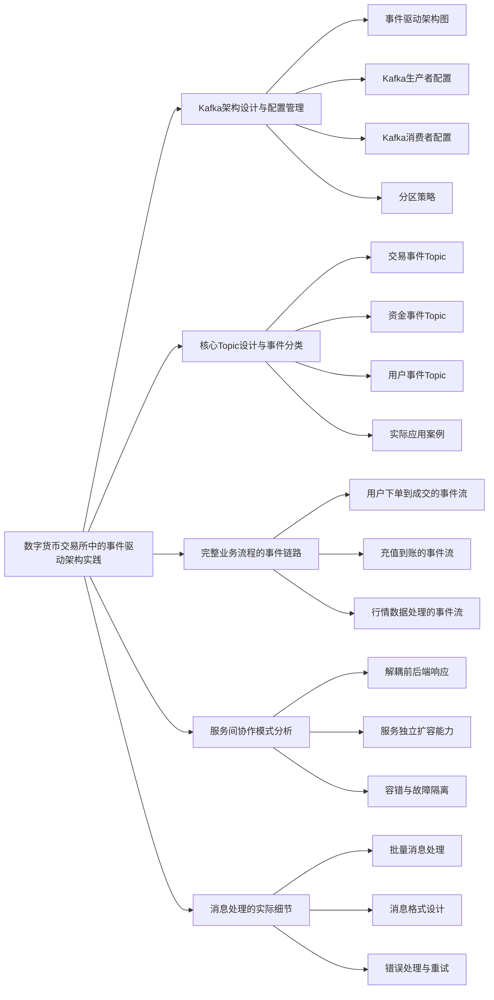
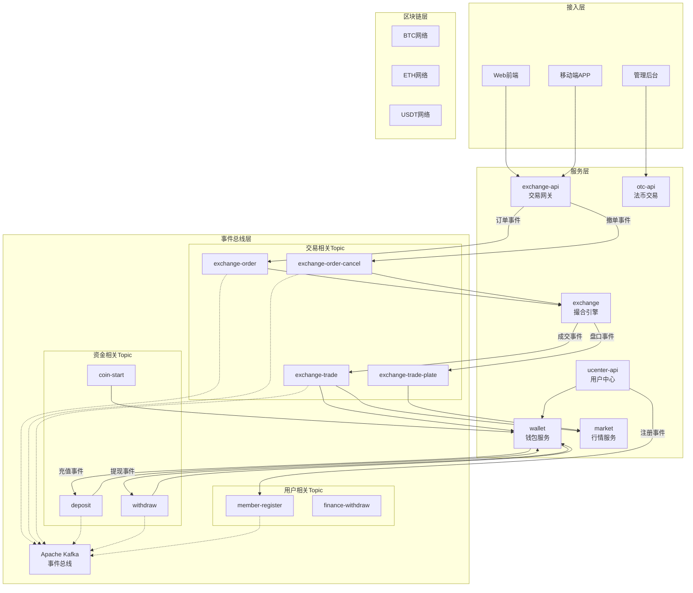
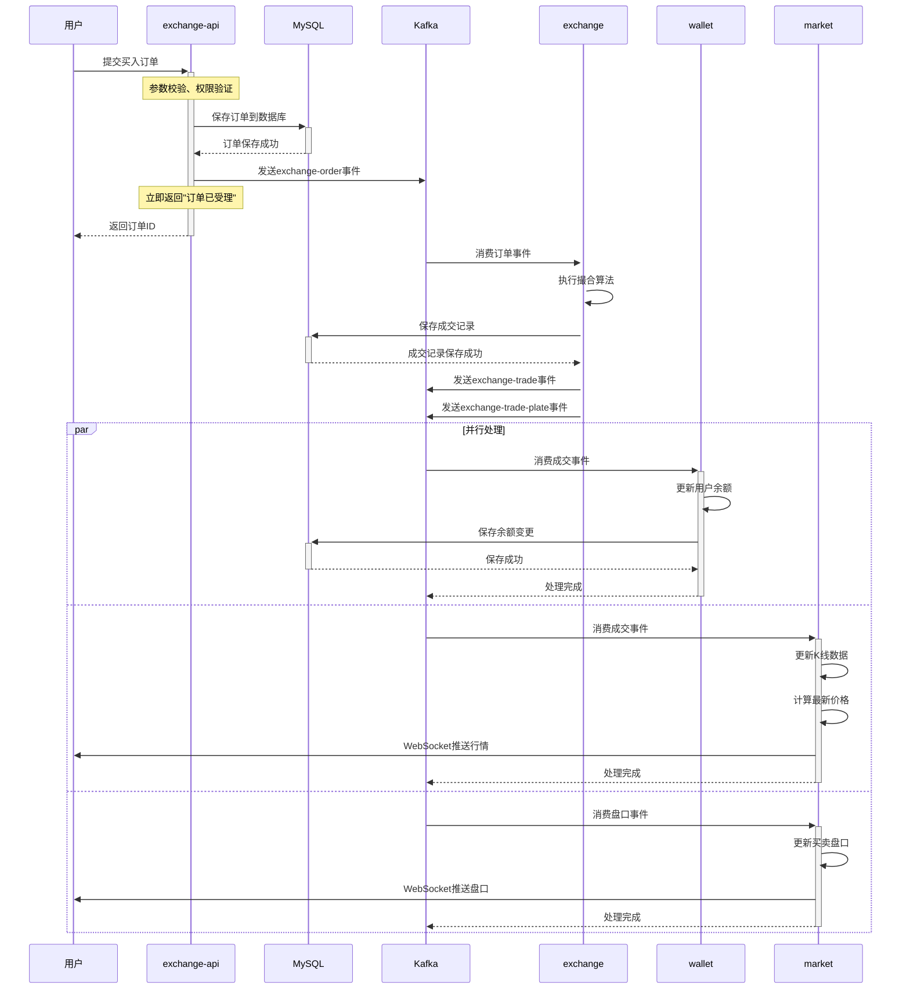
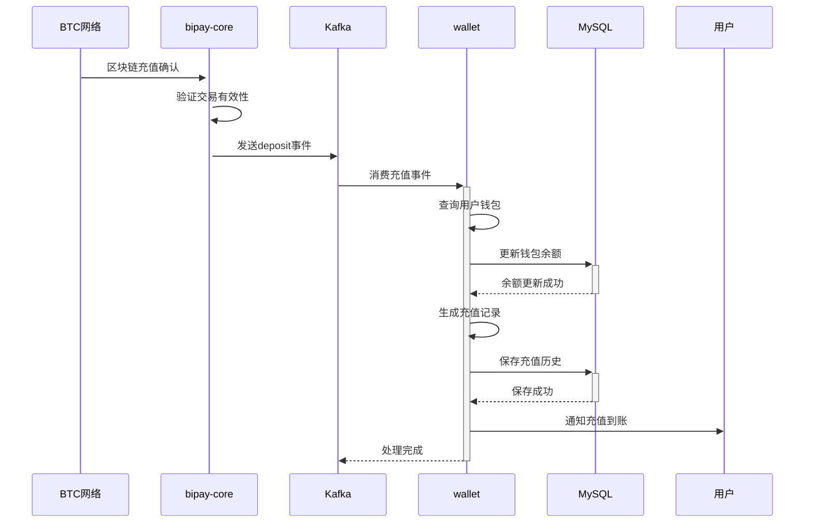
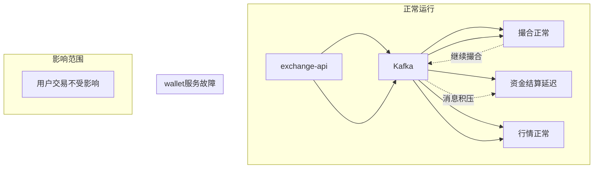

# 第 5 章：数字货币交易所中的事件驱动架构实践

## 引言

在前面的章节中，我们深入了解了交易所的基础架构、数据库设计和缓存策略。Redis缓存显著提升了系统读取性能，但真正的挑战在于如何高效协调复杂的写操作流程。

数字货币交易所就像一个永不停歇的金融交易中心，每一秒都有海量的交易请求在系统中流转。传统的同步调用模式在这种场景下显得力不从心——用户下单后需要等待撮合、结算、行情推送等一系列步骤全部完成，这种串行处理方式严重限制了系统的吞吐能力。

Bizzan交易所通过引入Apache Kafka作为事件总线，彻底改变了这一局面。系统将原本紧耦合的同步调用链重构为松耦合的异步事件流，让各个服务能够独立、高效地处理各自的任务。这种架构转换带来了质的飞跃：用户提交订单后系统立即响应，而订单撮合、资金结算、行情更新等后续操作在后台异步进行，互不干扰。

在市场剧烈波动的高峰期，事件驱动架构的价值更加凸显。成千上万的交易请求可以同时进入系统，每个服务都能按照自身的处理能力工作，避免了传统架构中的级联延迟和雪崩效应。


通过本章的详细分析，读者将全面掌握Kafka在数字货币交易所中的应用实践，为构建高性能、高可靠的分布式交易系统奠定坚实基础。



---

## 5.1 Kafka 架构设计与配置管理

在分布式系统中，事件驱动架构已经成为处理复杂业务流程的主流方案。这种架构模式的核心思想是将系统间的直接依赖转化为对事件的响应，从而实现真正的解耦。

**事件驱动架构**通过事件消息实现组件间的松耦合通信，每个组件专注于处理自己负责的业务逻辑，通过发布/订阅模式与其他组件协作。

**生产者-消费者模式**是消息队列的基础设计模式，生产者负责生成并发送事件消息，消费者订阅感兴趣的事件并进行相应处理。

**Topic分区机制**允许Kafka将大规模的消息流分散到多个分区中并行处理，每个分区维护着有序的消息序列，既保证了性能又维持了事件的时间顺序。

**Offset管理**为消费者提供了精确的消费进度跟踪能力，确保即使在系统故障的情况下，消息也不会丢失或重复处理。

**消息序列化**技术将复杂的业务对象转换为字节流，使其能够在分布式环境中高效传输和存储。

### 5.1.1 事件驱动架构图

理解了事件驱动架构的概念，我们来看看Bizzan的具体实现。基于对项目实际代码的分析，Bizzan交易所的事件驱动架构可以分为四个层次，就像一个现代化城市的物流系统：



### 5.1.2 Kafka 生产者配置

在Bizzan交易所的系统中，每个业务服务都需要将事件消息发送到Kafka。生产者配置直接影响消息的发送效率、可靠性和系统的整体性能。

让我们查看实际项目中的生产者配置实现，了解交易所是如何配置Kafka消息发送的：

**exchange模块的生产者配置**

交易所撮合引擎作为核心组件，需要高效地处理订单事件。以下是exchange服务中的Kafka生产者配置：

```java
// 文件位置：exchange/src/main/java/com/bizzan/bitrade/config/KafkaProducerConfiguration.java
@Configuration
@EnableKafka
public class KafkaProducerConfiguration {

    @Value("${spring.kafka.bootstrap-servers}")
    private String servers;
    @Value("${spring.kafka.producer.retries}")
    private int retries;
    @Value("${spring.kafka.producer.batch.size}")
    private int batchSize;
    @Value("${spring.kafka.producer.linger}")
    private int linger;
    @Value("${spring.kafka.producer.buffer.memory}")
    private int bufferMemory;

    public Map<String, Object> producerConfigs() {
        Map<String, Object> props = new HashMap<>();
        props.put(ProducerConfig.BOOTSTRAP_SERVERS_CONFIG, servers);
        props.put(ProducerConfig.RETRIES_CONFIG, retries);
        props.put(ProducerConfig.BATCH_SIZE_CONFIG, batchSize);
        props.put(ProducerConfig.LINGER_MS_CONFIG, linger);
        props.put(ProducerConfig.BUFFER_MEMORY_CONFIG, bufferMemory);
        // 当前使用默认的分区策略，自定义分区器配置被注释
        // props.put(ProducerConfig.PARTITIONER_CLASS_CONFIG, "com.bizzan.bitrade.kafka.kafkaPartitioner");
        props.put(ProducerConfig.KEY_SERIALIZER_CLASS_CONFIG, StringSerializer.class);
        props.put(ProducerConfig.VALUE_SERIALIZER_CLASS_CONFIG, StringSerializer.class);
        return props;
    }

    @Bean
    public ProducerFactory<String, String> producerFactory() {
        return new DefaultKafkaProducerFactory<>(producerConfigs());
    }

    @Bean
    public KafkaTemplate<String, String> kafkaTemplate() {
        return new KafkaTemplate<>(producerFactory());
    }
}
```

**技术配置分析**

当前配置采用了相对保守的参数设置，这在系统初期能够保证稳定性。随着业务量增长，可以从以下几个方面进行优化：

**消息可靠性保障**
- 当前配置中的重试次数设置为3次，这在网络不稳定的环境下可能不够充分
- 缺少acks=all配置，消息丢失风险较高
- 没有启用幂等性，可能产生重复消息

**性能优化空间**
- 批处理大小256字节相对较小，在高并发场景下可以适当增大
- linger时间1ms可以适当延长，以收集更多消息批量发送
- 可以启用消息压缩来减少网络传输开销

**分区策略配置**
项目中的自定义分区器实现了简单的业务逻辑分区：

```java
// 文件位置：core/src/main/java/com/bizzan/bitrade/kafka/kafkaPartitioner.java
public class kafkaPartitioner implements Partitioner {
    @Override
    public int partition(String topic, Object key, byte[] keyBytes,
                        Object value, byte[] valueBytes, Cluster cluster) {
        // 交易相关Topic随机分配到1-9分区，其他使用0分区
        if(topic.startsWith("exchange")) {
            return (int)(Math.random()*9)+1;
        } else {
            return 0;
        }
    }
}
```

这个分区器将exchange相关的消息分散到多个分区，有助于提高并行处理能力。建议在生产者配置中启用此分区策略，并进一步优化分区逻辑以适应实际的业务特点。

### 5.1.3 Kafka 消费者配置

在生产者将消息发送到Kafka之后，需要消费者来处理这些事件。消费者配置决定了消息的拉取策略、并发处理能力和可靠性保证。

让我们查看Bizzan交易所实际项目中的消费者配置实现：

**exchange模块消费者配置**

撮合引擎需要高效地处理订单事件，以下是exchange服务中的消费者配置：

```java
// 文件位置：exchange/src/main/java/com/bizzan/bitrade/config/KafkaConsumerConfiguration.java
@Configuration
@EnableKafka
public class KafkaConsumerConfiguration {

    @Value("${spring.kafka.bootstrap-servers}")
    private String servers;
    @Value("${spring.kafka.consumer.enable.auto.commit}")
    private boolean enableAutoCommit;
    @Value("${spring.kafka.consumer.session.timeout}")
    private String sessionTimeout;
    @Value("${spring.kafka.consumer.auto.commit.interval}")
    private String autoCommitInterval;
    @Value("${spring.kafka.consumer.group.id}")
    private String groupId;
    @Value("${spring.kafka.consumer.auto.offset.reset}")
    private String autoOffsetReset;
    @Value("${spring.kafka.consumer.concurrency}")
    private int concurrency;
    @Value("${spring.kafka.consumer.maxPollRecordsConfig}")
    private int maxPollRecordsConfig;

    public Map<String, Object> consumerConfigs() {
        Map<String, Object> propsMap = new HashMap<>();
        propsMap.put(ConsumerConfig.BOOTSTRAP_SERVERS_CONFIG, servers);
        propsMap.put(ConsumerConfig.ENABLE_AUTO_COMMIT_CONFIG, enableAutoCommit);
        propsMap.put(ConsumerConfig.AUTO_COMMIT_INTERVAL_MS_CONFIG, autoCommitInterval);
        propsMap.put(ConsumerConfig.SESSION_TIMEOUT_MS_CONFIG, sessionTimeout);
        propsMap.put(ConsumerConfig.KEY_DESERIALIZER_CLASS_CONFIG, StringDeserializer.class.getName());
        propsMap.put(ConsumerConfig.VALUE_DESERIALIZER_CLASS_CONFIG, StringDeserializer.class.getName());
        propsMap.put(ConsumerConfig.GROUP_ID_CONFIG, groupId);
        propsMap.put(ConsumerConfig.AUTO_OFFSET_RESET_CONFIG, autoOffsetReset);
        propsMap.put(ConsumerConfig.MAX_POLL_RECORDS_CONFIG, maxPollRecordsConfig);
        return propsMap;
    }

    @Bean
    public KafkaListenerContainerFactory<ConcurrentMessageListenerContainer<String, String>> kafkaListenerContainerFactory() {
        ConcurrentKafkaListenerContainerFactory<String, String> factory =
            new ConcurrentKafkaListenerContainerFactory<>();
        factory.setConsumerFactory(consumerFactory());
        factory.setConcurrency(concurrency);
        factory.getContainerProperties().setPollTimeout(1500);
        factory.setBatchListener(true);
        return factory;
    }
}
```

**配置参数解读**

当前配置体现了交易所对消息处理的几个核心需求：

**可靠性保障**
- `enable.auto.commit=false`：关闭自动提交，采用手动提交方式确保消息处理完成后才确认
- `session.timeout=15000`：会话超时设置为15秒，平衡了故障检测和性能
- `auto.offset.reset=earliest`：从最早的消息开始消费，确保消息不丢失

**并发处理能力**
- `concurrency`：并发消费线程数，可根据实际业务需要调整
- `maxPollRecordsConfig`：每次批量拉取的消息数量，通常设置为50-100
- `batchListener=true`：启用批量监听，提高处理效率

**实际消费者实现示例**

基于ExchangeOrderConsumer的实现，我们可以看到消费者如何处理交易事件：

```java
// 文件位置：exchange/src/main/java/com/bizzan/bitrade/consumer/ExchangeOrderConsumer.java
@Component
@Slf4j
public class ExchangeOrderConsumer {

    @Autowired
    private CoinTraderFactory traderFactory;

    @Autowired
    private KafkaTemplate<String,String> kafkaTemplate;

    @KafkaListener(topics = "exchange-order", containerFactory = "kafkaListenerContainerFactory")
    public void onOrderSubmitted(List<ConsumerRecord<String,String>> records) {
        for (int i = 0; i < records.size(); i++) {
            ConsumerRecord<String,String> record = records.get(i);
            log.info("接收订单>>topic={},value={},size={}", record.topic(), record.value(), records.size());
            ExchangeOrder order = JSON.parseObject(record.value(), ExchangeOrder.class);
            if(order == null) {
                return;
            }
            CoinTrader trader = traderFactory.getTrader(order.getSymbol());
            // 如果当前币种交易暂停会自动取消订单
            if (trader.isTradingHalt() || !trader.getReady()) {
                kafkaTemplate.send("exchange-order-cancel-success", JSON.toJSONString(order));
            } else {
                try {
                    long startTick = System.currentTimeMillis();
                    trader.trade(order);
                    log.info("complete trade,{}ms used!", System.currentTimeMillis() - startTick);
                } catch (Exception e) {
                    log.error("交易出错，退回订单", e);
                    kafkaTemplate.send("exchange-order-cancel-success", JSON.toJSONString(order));
                }
            }
        }
    }
}
```

这个消费者实现展示了几个重要的设计模式：批量处理、异常处理、事务性操作和日志记录。

### 5.1.4 分区策略

分区策略是Kafka消息系统的核心设计要素，它决定了消息在集群中的分布方式，直接影响系统的并行处理能力和消息的顺序性保证。

**当前项目的分区策略实现**

让我们查看Bizzan交易所项目中的分区策略实现：

```java
// 文件位置：core/src/main/java/com/bizzan/bitrade/kafka/kafkaPartitioner.java
public class kafkaPartitioner implements Partitioner {

    @Override
    public void configure(Map<String, ?> configs) {
        // 分区器初始化配置
    }

    @Override
    public int partition(String topic, Object key, byte[] keyBytes,
                        Object value, byte[] valueBytes, Cluster cluster) {
        // 交易相关的随机分配到1-9分区，其他分配到0分区
        if(topic.startsWith("exchange")) {
            return random(); // 返回1-9的随机数
        } else {
            return 0; // 非交易主题都分配到0分区
        }
    }

    @Override
    public void close() {
        // 分区器关闭时的清理工作
    }

    private static int random() {
        return (int)(Math.random()*9)+1;
    }
}
```

**当前分区策略的技术分析**

**设计思路**
- 将exchange相关的Topic消息随机分配到1-9分区，实现负载分散
- 其他类型的Topic统一使用0分区，简化非核心业务的处理逻辑
- 采用随机策略可以在统计意义上实现负载均衡

**实际配置状态**
查看生产者配置可以发现，当前自定义分区器并未启用：
```java
// 注释掉的分区器配置
// props.put(ProducerConfig.PARTITIONER_CLASS_CONFIG, "com.bizzan.bitrade.kafka.kafkaPartitioner");
```

**策略改进建议**

基于交易所的业务特点，可以从以下几个方面优化分区策略：

**按交易对分区**
确保同一交易对的订单按照时间顺序处理，这对于维护交易的一致性至关重要：

```java
public class SymbolBasedPartitioner implements Partitioner {

    @Override
    public int partition(String topic, Object key, byte[] keyBytes,
                        Object value, byte[] valueBytes, Cluster cluster) {

        String symbol = extractSymbolFromValue(value);
        if (symbol != null) {
            // 使用交易对符号计算分区，确保同一交易对的消息在同一个分区
            return Math.abs(symbol.hashCode()) % cluster.partitionCountForTopic(topic);
        }

        // 默认使用Key的哈希值
        return key != null ? Math.abs(key.hashCode()) % cluster.partitionCountForTopic(topic) : 0;
    }

    private String extractSymbolFromValue(Object value) {
        try {
            // 从JSON消息中提取交易对符号
            JSONObject json = JSON.parseObject(value.toString());
            return json.getString("symbol");
        } catch (Exception e) {
            return null;
        }
    }
}
```

**按用户ID分区**
对于用户相关的操作，按照用户ID进行分区可以保证单个用户操作的顺序性：

```java
public class UserBasedPartitioner implements Partitioner {

    @Override
    public int partition(String topic, Object key, byte[] keyBytes,
                        Object value, byte[] valueBytes, Cluster cluster) {

        Long userId = extractUserIdFromValue(value);
        if (userId != null) {
            // 按用户ID分区，确保同一用户的消息在同一个分区
            return Math.abs(userId.hashCode()) % cluster.partitionCountForTopic(topic);
        }

        return 0;
    }

    private Long extractUserIdFromValue(Object value) {
        try {
            JSONObject json = JSON.parseObject(value.toString());
            return json.getLong("memberId");
        } catch (Exception e) {
            return null;
        }
    }
}
```

**分区数量规划**

基于Bizzan交易所的业务规模，建议采用以下分区配置：

```properties
# 交易相关Topic的分区配置
exchange.order.partitions=16    # 订单Topic
exchange.trade.partitions=16    # 交易Topic
exchange.plate.partitions=8     # 盘口Topic

# 资金相关Topic的分区配置
wallet.deposit.partitions=8     # 充值Topic
wallet.withdraw.partitions=8    # 提现Topic

# 用户相关Topic的分区配置
user.activity.partitions=12     # 用户活动Topic
```

**启用自定义分区策略**

修改生产者配置以启用自定义分区器：

```java
@Bean
public ProducerFactory<String, String> producerFactory() {
    Map<String, Object> configProps = producerConfigs();

    // 根据Topic类型选择不同的分区器
    configProps.put(ProducerConfig.PARTITIONER_CLASS_CONFIG, "com.bizzan.bitrade.kafka.SymbolBasedPartitioner");

    return new DefaultKafkaProducerFactory<>(configProps);
}
```

**分区策略监控**

为了评估分区策略的效果，需要建立完善的监控体系：

- **消息分布监控**：跟踪各分区的消息数量和处理延迟
- **负载均衡分析**：识别热点分区和空闲分区
- **性能指标收集**：监控各分区的吞吐量和处理时间

通过合理的分区策略设计，可以显著提升系统的并发处理能力，同时保证关键业务的消息顺序性。

---

## 5.2 核心 Topic 设计与事件分类

### 5.2.1 交易事件 Topic

通过分析Bizzan交易所的实际代码，我们可以看到完整的事件Topic设计。这些Topic构成了交易系统的核心事件流，确保各个服务之间的协调运作。

**核心交易Topic分析**

基于ExchangeOrderConsumer和ExchangeTradeConsumer的实现，我们可以识别出以下关键Topic：

```java
// 订单处理Topic
@KafkaListener(topics = "exchange-order", containerFactory = "kafkaListenerContainerFactory")
public void onOrderSubmitted(List<ConsumerRecord<String,String>> records)

// 撤单处理Topic
@KafkaListener(topics = "exchange-order-cancel", containerFactory = "kafkaListenerContainerFactory")
public void onOrderCancel(List<ConsumerRecord<String,String>> records)

// 交易记录Topic
@KafkaListener(topics = "exchange-trade", containerFactory = "kafkaListenerContainerFactory")
public void handleTrade(List<ConsumerRecord<String, String>> records)

// 订单完成Topic
@KafkaListener(topics = "exchange-order-completed", containerFactory = "kafkaListenerContainerFactory")
public void handleOrderCompleted(List<ConsumerRecord<String, String>> records)

// 撤单成功Topic
@KafkaListener(topics = "exchange-order-cancel-success", containerFactory = "kafkaListenerContainerFactory")
public void handleOrderCanceled(List<ConsumerRecord<String, String>> records)

// 盘口信息Topic
@KafkaListener(topics = "exchange-trade-plate", containerFactory = "kafkaListenerContainerFactory")
public void handleTradePlate(List<ConsumerRecord<String, String>> records)
```

**事件流转过程分析**

**订单生命周期事件流**

1. **用户下单** (`exchange-order`)
   - 生产者：exchange-api
   - 消费者：exchange撮合引擎
   - 事件内容：订单ID、交易对、价格、数量、用户ID等

2. **订单撮合** (`exchange-trade`)
   - 生产者：exchange撮合引擎
   - 消费者：wallet钱包服务、market行情服务
   - 事件内容：成交ID、买卖方订单ID、成交价格、成交数量等

3. **订单完成** (`exchange-order-completed`)
   - 生产者：exchange撮合引擎
   - 消费者：market行情服务
   - 事件内容：订单ID、已成交数量、成交金额等

4. **撤单流程** (`exchange-order-cancel` → `exchange-order-cancel-success`)
   - 生产者：exchange-api
   - 消费者：exchange撮合引擎
   - 事件内容：订单ID、撤单原因等

**实际事件处理示例**

让我们看看ExchangeTradeConsumer是如何处理交易事件的：

```java
// 处理成交明细事件
@KafkaListener(topics = "exchange-trade", containerFactory = "kafkaListenerContainerFactory")
public void handleTrade(List<ConsumerRecord<String, String>> records) {
    for (int i = 0; i < records.size(); i++) {
        ConsumerRecord<String, String> record = records.get(i);
        executor.submit(new HandleTradeThread(record));
    }
}

// 成交处理线程
public class HandleTradeThread implements Runnable {
    private ConsumerRecord<String, String> record;

    @Override
    public void run() {
        try {
            List<ExchangeTrade> trades = JSON.parseArray(record.value(), ExchangeTrade.class);
            String symbol = trades.get(0).getSymbol();
            CoinProcessor coinProcessor = coinProcessorFactory.getProcessor(symbol);

            for (ExchangeTrade trade : trades) {
                // 成交明细处理
                exchangeOrderService.processExchangeTrade(trade, secondReferrerAward);

                // 推送订单成交订阅
                ExchangeOrder buyOrder = exchangeOrderService.findOne(trade.getBuyOrderId());
                ExchangeOrder sellOrder = exchangeOrderService.findOne(trade.getSellOrderId());

                // 实时推送成交信息
                messagingTemplate.convertAndSend(
                    "/topic/market/order-trade/" + symbol + "/" + buyOrder.getMemberId(), buyOrder);
                messagingTemplate.convertAndSend(
                    "/topic/market/order-trade/" + symbol + "/" + sellOrder.getMemberId(), sellOrder);

                // 处理K线行情
                if (coinProcessor != null) {
                    coinProcessor.process(trades);
                }
            }

            // 添加到推送队列
            pushJob.addTrades(symbol, trades);
        } catch (Exception e) {
            e.printStackTrace();
        }
    }
}
```

**Topic设计特点**

**事件粒度设计**
- 采用细粒度的事件设计，每个Topic负责特定的业务场景
- 事件之间通过订单ID建立关联关系
- 支持事件的追溯和重放

**异步处理模式**
- 每个事件都独立处理，避免阻塞
- 使用线程池处理高并发事件
- 通过WebSocket实时推送给前端

**错误处理机制**
- 异常情况下发送撤单事件
- 保留事件处理的日志记录
- 支持事件的补偿和恢复

通过这种精心设计的Topic架构，Bizzan交易所实现了高效的异步事件处理，确保了系统的稳定性和响应速度。

**其他相关Topic扩展**

除了核心的交易Topic，系统还包含了一些辅助功能的Topic：

- **exchange-trade-plate**：盘口数据更新，为行情服务提供实时买卖盘信息
- **exchange-trade-mocker**：模拟交易数据，用于测试环境的行情数据生成

**系统管理Topic**

- **reset-member-address**：用户钱包地址重置事件
- **user-activity**：用户行为日志记录事件

**Topic设计的技术特点**

**完整的事件生命周期管理**
系统设计了从订单创建到最终状态的完整事件链，每个关键状态变更都有对应的事件通知，确保所有相关服务能够及时响应状态变化。

**多维度的事件分发机制**
核心事件（如成交）会被同时发送到多个服务，实现事件的多路分发，保证了各业务系统的数据一致性。

**可扩展的事件架构**
通过Topic的模块化设计，系统可以方便地添加新的事件类型，支持业务功能的持续扩展。

**Topic命名规范建议**

当前系统使用简洁的Topic命名，在实际应用中可以考虑更加规范的命名方式，采用"服务-领域-事件"的命名模式，提高Topic的可读性和维护性。

**消息格式标准化**

系统目前采用JSON格式传输事件数据，为了进一步提高数据的结构化程度，可以考虑建立统一的事件消息格式标准，包含事件类型、时间戳、事件主体等标准字段。

### 5.2.2 资金事件 Topic

| Topic名称 | 生产者 | 消费者 | 事件类型 | 业务场景 |
|-----------|--------|--------|----------|----------|
| **deposit** | bipay-core | wallet | 充值到账 | 区块链充值确认 |
| **withdraw** | wallet | bipay-core | 提现请求 | 用户申请提现 |
| **coin-start** | admin | wallet | 新币种上线 | 为所有用户创建钱包 |
| **finance-withdraw** | ucenter-api | wallet | 提现审核 | 管理员审核提现 |

### 5.2.3 用户事件 Topic

| Topic名称 | 生产者 | 消费者 | 事件类型 | 业务场景 |
|-----------|--------|--------|----------|----------|
| **member-register** | ucenter-api | wallet | 用户注册 | 为新用户创建钱包 |
| **member-promotion** | ucenter-api | admin | 推广关系 | 推广奖励计算 |

### 5.2.4 实际应用案例

通过分析Bizzan交易所的实际代码实现，我们可以深入理解事件驱动架构的具体应用。让我们从真实的项目代码中探索事件处理的技术细节。

**订单事件处理实例**

在交易所的撮合引擎中，订单处理是核心业务流程。基于ExchangeOrderConsumer的实现，我们可以看到完整的订单事件处理逻辑：

```java
// 文件位置：exchange/src/main/java/com/bizzan/bitrade/consumer/ExchangeOrderConsumer.java
@Component
@Slf4j
public class ExchangeOrderConsumer {

    @Autowired
    private CoinTraderFactory traderFactory;

    @Autowired
    private KafkaTemplate<String,String> kafkaTemplate;

    // 处理用户提交的订单事件
    @KafkaListener(topics = "exchange-order", containerFactory = "kafkaListenerContainerFactory")
    public void onOrderSubmitted(List<ConsumerRecord<String,String>> records) {
        for (int i = 0; i < records.size(); i++) {
            ConsumerRecord<String,String> record = records.get(i);
            log.info("接收订单>>topic={},value={},size={}", record.topic(), record.value(), records.size());

            ExchangeOrder order = JSON.parseObject(record.value(), ExchangeOrder.class);
            if(order == null) {
                return;
            }

            CoinTrader trader = traderFactory.getTrader(order.getSymbol());

            // 交易暂停或撮合引擎未就绪时的处理
            if (trader.isTradingHalt() || !trader.getReady()) {
                kafkaTemplate.send("exchange-order-cancel-success", JSON.toJSONString(order));
            } else {
                try {
                    long startTick = System.currentTimeMillis();
                    trader.trade(order);
                    log.info("complete trade,{}ms used!", System.currentTimeMillis() - startTick);
                } catch (Exception e) {
                    log.error("交易出错，退回订单", e);
                    kafkaTemplate.send("exchange-order-cancel-success", JSON.toJSONString(order));
                }
            }
        }
    }

    // 处理订单取消事件
    @KafkaListener(topics = "exchange-order-cancel", containerFactory = "kafkaListenerContainerFactory")
    public void onOrderCancel(List<ConsumerRecord<String,String>> records) {
        for (int i = 0; i < records.size(); i++) {
            ConsumerRecord<String,String> record = records.get(i);
            log.info("取消订单topic={},key={},size={}", record.topic(), record.key(), records.size());

            ExchangeOrder order = JSON.parseObject(record.value(), ExchangeOrder.class);
            if(order == null) {
                return;
            }

            CoinTrader trader = traderFactory.getTrader(order.getSymbol());
            if(trader.getReady()) {
                try {
                    ExchangeOrder result = trader.cancelOrder(order);
                    if (result != null) {
                        kafkaTemplate.send("exchange-order-cancel-success", JSON.toJSONString(result));
                    }
                } catch (Exception e) {
                    log.error("取消订单出错", e);
                }
            }
        }
    }
}
```

**技术实现分析**

**批量处理机制**
消费者通过`List<ConsumerRecord<String,String>>`接收批量消息，提高了处理效率。这种设计在高并发场景下能够显著减少网络开销。

**异常处理与恢复**
当撮合引擎不可用或交易被暂停时，系统会自动发送取消事件，确保订单状态的一致性。这种自动化的错误处理机制提高了系统的可靠性。

**性能监控**
代码中包含了执行时间的统计，`System.currentTimeMillis()`用于跟踪交易处理耗时，便于性能分析和优化。

**成交事件处理实例**

ExchangeTradeConsumer展示了更复杂的事件处理逻辑，包括资金结算和行情更新：

```java
// 处理成交明细的独立线程
public class HandleTradeThread implements Runnable {
    @Override
    public void run() {
        try {
            List<ExchangeTrade> trades = JSON.parseArray(record.value(), ExchangeTrade.class);
            String symbol = trades.get(0).getSymbol();
            CoinProcessor coinProcessor = coinProcessorFactory.getProcessor(symbol);

            for (ExchangeTrade trade : trades) {
                // 资金结算处理
                exchangeOrderService.processExchangeTrade(trade, secondReferrerAward);

                // 获取交易双方订单信息
                ExchangeOrder buyOrder = exchangeOrderService.findOne(trade.getBuyOrderId());
                ExchangeOrder sellOrder = exchangeOrderService.findOne(trade.getSellOrderId());

                // 实时推送成交信息给交易双方
                messagingTemplate.convertAndSend(
                    "/topic/market/order-trade/" + symbol + "/" + buyOrder.getMemberId(), buyOrder);
                messagingTemplate.convertAndSend(
                    "/topic/market/order-trade/" + symbol + "/" + sellOrder.getMemberId(), sellOrder);

                // 通过Netty推送成交数据
                nettyHandler.handleOrder(NettyCommand.PUSH_EXCHANGE_ORDER_TRADE, buyOrder);
                nettyHandler.handleOrder(NettyCommand.PUSH_EXCHANGE_ORDER_TRADE, sellOrder);
            }

            // 处理K线数据
            if (coinProcessor != null) {
                coinProcessor.process(trades);
            }

            // 添加到推送队列
            pushJob.addTrades(symbol, trades);
        } catch (Exception e) {
            e.printStackTrace();
        }
    }
}
```

**事件处理的技术特点**

**异步线程处理**
使用独立的线程池处理成交事件，避免阻塞主线程，提高了系统的并发处理能力。

**多渠道实时推送**
通过WebSocket和Netty两种方式推送数据，确保不同客户端都能及时收到交易信息。

**业务逻辑集成**
将资金结算、推荐奖励计算、行情更新等多个业务步骤整合在一个事件处理流程中，保证了业务的一致性。

---

## 5.3 完整业务流程的事件链路

### 5.3.1 用户下单到成交的事件流



### 5.3.2 充值到账的事件流



### 5.3.3 行情数据处理的事件流

基于 `market` 模块的 `ExchangeTradeConsumer` 分析：

```java
// 模块：market/src/main/java/com/bizzan/bitrade/consumer/ExchangeTradeConsumer.java
@Component
@Slf4j
public class ExchangeTradeConsumer {

    @Autowired
    private CoinProcessorFactory coinProcessorFactory;

    @Autowired
    private ExchangeOrderService exchangeOrderService;

    @Autowired
    private SimpMessagingTemplate messagingTemplate;

    // 处理成交明细事件
    @KafkaListener(topics = "exchange-trade", containerFactory = "kafkaListenerContainerFactory")
    public void handleTrade(List<ConsumerRecord<String, String>> records) {
        for (ConsumerRecord<String, String> record : records) {
            executor.submit(new HandleTradeThread(record));
        }
    }

    // 内部线程处理成交数据
    public class HandleTradeThread implements Runnable {
        public void run() {
            List<ExchangeTrade> trades = JSON.parseArray(record.value(), ExchangeTrade.class);
            String symbol = trades.get(0).getSymbol();

            // 处理K线行情
            CoinProcessor coinProcessor = coinProcessorFactory.getProcessor(symbol);
            if (coinProcessor != null) {
                coinProcessor.process(trades);
            }

            // 推送实时成交给用户
            for (ExchangeTrade trade : trades) {
                ExchangeOrder buyOrder = exchangeOrderService.findOne(trade.getBuyOrderId());
                ExchangeOrder sellOrder = exchangeOrderService.findOne(trade.getSellOrderId());

                // WebSocket推送
                messagingTemplate.convertAndSend(
                    "/topic/market/order-trade/" + symbol + "/" + buyOrder.getMemberId(), buyOrder);
                messagingTemplate.convertAndSend(
                    "/topic/market/order-trade/" + symbol + "/" + sellOrder.getMemberId(), sellOrder);
            }
        }
    }
}
```

**行情处理特点**：
- **异步处理**：使用线程池处理成交事件，避免阻塞消费者线程
- **多服务通知**：同时处理K线计算和实时推送
- **WebSocket推送**：实时向用户推送成交更新

---

## 5.4 服务间协作模式分析

### 5.4.1 解耦前后端响应

**传统同步模式的问题**：
```
用户下单 → 撮合引擎(100ms) → 资金结算(50ms) → 行情推送(30ms) → 返回结果
总计：180ms+ 用户等待时间
```

**Kafka异步模式的优势**：
```
用户下单 → 写入数据库(10ms) → 发送Kafka事件(5ms) → 立即返回"订单已受理"
总计：15ms 用户等待时间
```

基于 `exchange-api` 模块的实际代码分析：

```java
// 模块：exchange-api/src/main/java/com/bizzan/bitrade/controller/OrderController.java
@PostMapping("/order")
public MessageResult placeOrder(@RequestBody PlaceOrderRequest request,
                              @SessionAttribute("authMember") AuthMember authMember) {
    // 1. 快速参数校验
    validateOrderRequest(request, authMember);

    // 2. 构造订单对象
    ExchangeOrder order = buildExchangeOrder(request, authMember);

    // 3. 持久化到数据库（同步操作）
    exchangeOrderService.save(order);

    // 4. 发送Kafka事件（异步操作）
    kafkaTemplate.send("exchange-order", JSON.toJSONString(order));

    // 5. 立即返回成功响应
    return MessageResult.success("订单已受理", order.getOrderId());
}
```

### 5.4.2 服务独立扩容能力

基于实际配置分析，各服务可以独立扩容：

| 服务名称 | 消费Topic | 并发度 | 扩容策略 |
|----------|-----------|--------|----------|
| **exchange** | exchange-order, exchange-order-cancel | 9线程 | 增加撮合引擎实例 |
| **wallet** | exchange-trade, deposit, withdraw | 默认 | 增加结算服务实例 |
| **market** | exchange-trade, exchange-trade-plate | 9线程 | 增加行情服务实例 |

**扩容配置示例**：
```properties
# exchange模块可以根据撮合压力调整
spring.kafka.consumer.concurrency=16  # 增加到16线程
spring.kafka.consumer.maxPollRecordsConfig=100  # 增加批处理大小

# market模块可以根据推送压力调整
spring.kafka.consumer.concurrency=20  # 增加推送线程
```

### 5.4.3 容错与故障隔离

**单个服务故障影响范围**：



**故障隔离机制**：
- **exchange**故障：撮合停止，但wallet和market仍可处理历史消息
- **wallet**故障：撮合继续，成交消息积压，恢复后批量处理
- **market**故障：撮合继续，行情推送延迟，数据不会丢失


---

## 小结

事件驱动架构就像是给交易所装上了一个"异步消息中转系统"，让原本同步调用的高峰时段变得井然有序。

这个设计最巧妙的地方在于"解耦"思想。各个服务不再需要直接相互调用，而是通过Kafka这个"消息中转站"来交流。这就像一个大型组织，员工之间不用直接打电话，而是通过内部邮件系统沟通，每个人都有时间处理自己的工作，不会被其他人的电话打断。

从性能角度看，这种架构的优势是显而易见的。用户提交订单后立即得到响应，不用等待后续所有处理完成。这就像餐厅点餐，你下了单就可以找座位，不用等菜炒好再坐下。用户体验大大提升。

事件驱动架构让整个系统变得更加灵活和健壮。当某个服务需要维护升级时，其他服务依然可以正常工作。这就像城市中的各个部门，一个部门暂停工作不会影响其他部门的正常运行。这种"故障隔离"的能力，在高可用系统中非常宝贵。

更重要的是，这种架构为系统的未来扩展奠定了坚实基础。新增业务功能时，只需要增加相应的消费者即可，不需要修改现有服务。这种松耦合的设计理念，正是现代微服务架构的核心价值所在。


