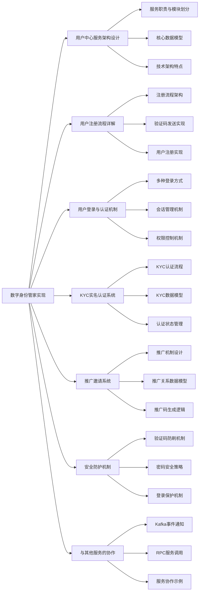
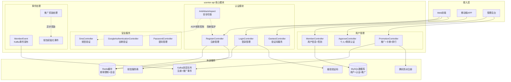
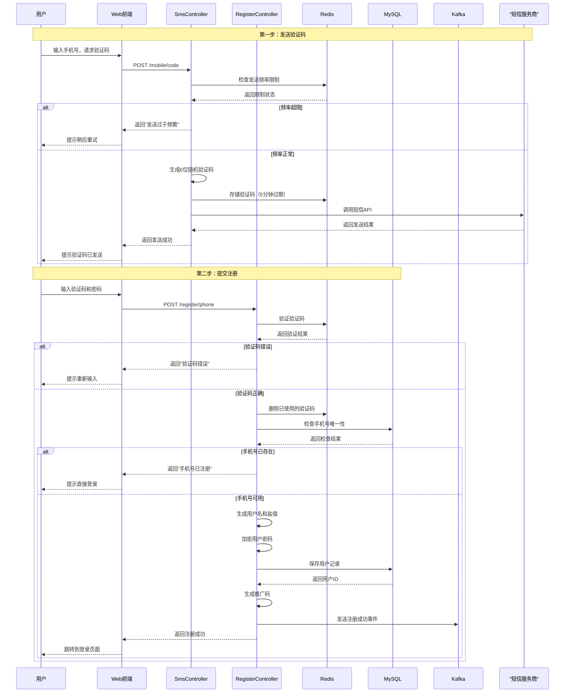
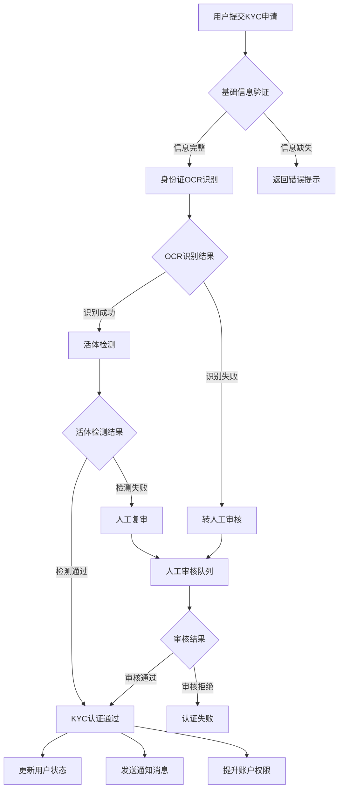
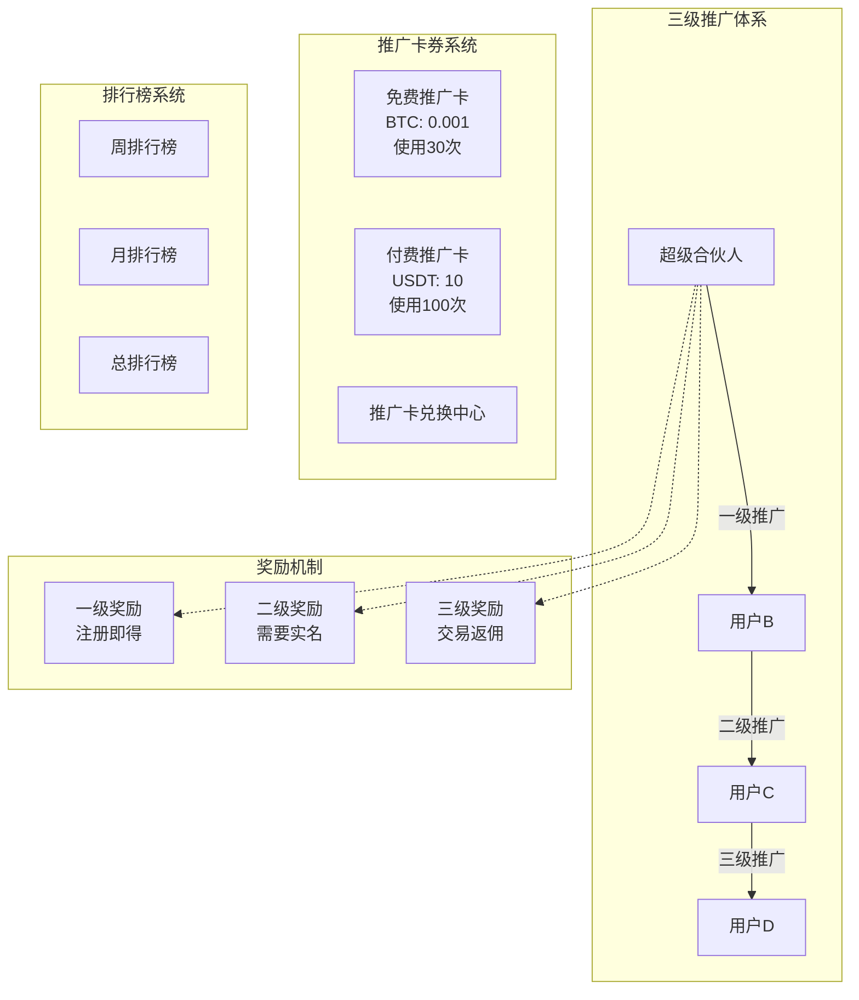
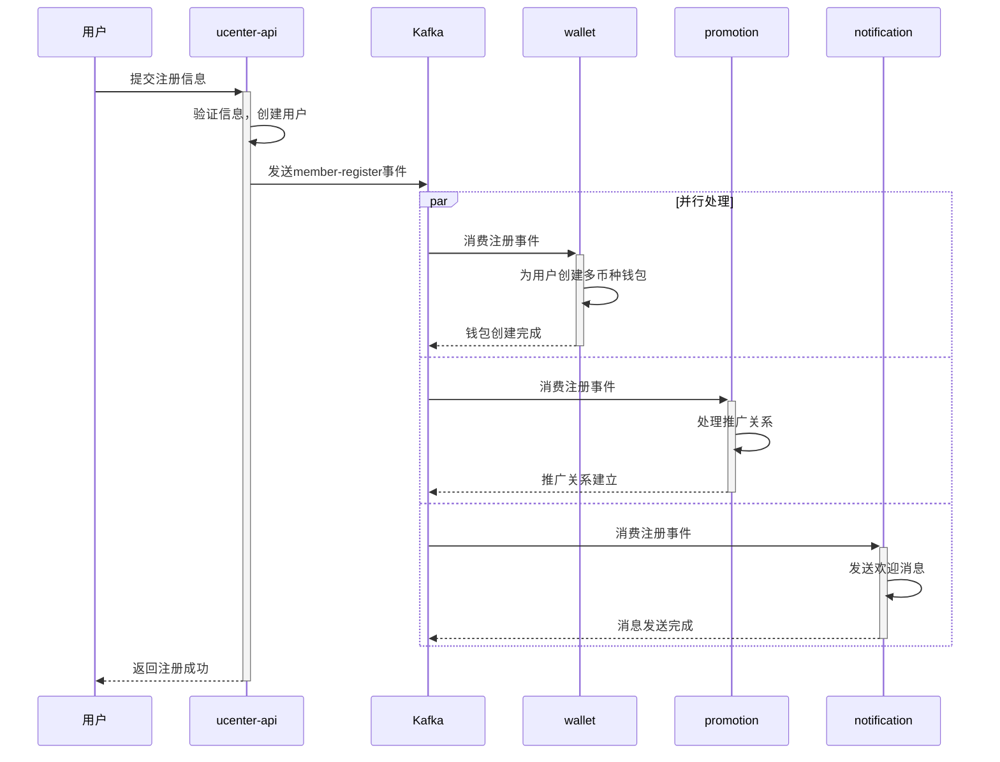

# 第 6 章：数字身份管家实现

## 引言

在前面几章中，我们学习了交易所的技术架构、数据库设计、缓存策略和事件驱动架构。现在，让我们来看看这些系统如何服务于每一个具体用户——这就需要用户中心服务的支持。

想象一下一个现代化的大型购物中心：顾客需要会员卡才能享受各种服务，商家需要知道顾客的身份来提供个性化服务，安保人员需要验证身份来确保安全。用户中心服务就是交易所这个"数字购物中心"的"会员服务中心"和"安保部门"。

用户中心服务远不止是一个简单的登录注册功能。一个交易所每天可能有成千上万的用户注册，需要处理手机号验证码、邮箱验证、密码加密、KYC认证、推广邀请等一系列复杂操作。如果设计不当，不仅影响用户体验，更可能危及整个系统的安全。

用户中心服务就像一个"数字身份管家"，它既要确保每个用户都能安全便捷地使用平台，又要为其他服务提供可靠的身份认证基础。当用户注册时，它需要创建账户并通知钱包服务；当用户登录时，它需要验证身份并建立会话；当用户进行交易时，其他服务需要依赖它来确认用户身份。

本章将从**实际项目代码**出发，详细分析：
- **用户注册流程**：验证码防刷、密码加密、异步钱包初始化
- **登录认证机制**：多种登录方式、会话管理、权限控制
- **KYC实名认证**：身份验证流程、人工审核机制
- **推广邀请系统**：邀请码生成、多级返佣计算
- **安全防护机制**：防刷限制、密码策略、登录保护
- **服务协作模式**：Kafka事件通知、RPC服务调用

通过本章的学习，你将掌握用户中心服务的完整技术实现和业务流程，学会构建一个既安全又用户友好的数字身份管理系统。



---

## 6.1 用户中心服务架构设计

### 6.1.1 服务职责与模块划分

基于对 `ucenter-api` 模块的深入分析，用户中心服务承担着整个系统的用户身份管理职责，实际实现比文档描述更加丰富：




### 6.1.2 核心数据模型

理解了服务架构后，让我们深入分析用户中心的核心数据模型。这些实体类定义了用户信息的存储结构，是整个身份管理系统的基础。

让我们首先看看用户实体（Member）的设计。基于对`core/entity/Member.java`的实际代码分析：

```java
// 模块：core/src/main/java/com/bizzan/bitrade/entity/Member.java
@Entity
@Data
public class Member {
    @GeneratedValue(strategy = GenerationType.IDENTITY)
    @Id
    private Long id;                    // 用户ID

    @Column(unique = true)
    private String username;            // 用户名

    @JsonIgnore
    private String salt;                // 密码盐值

    @JsonIgnore
    private String password;            // 登录密码（加密存储）

    @JsonIgnore
    private String jyPassword;          // 交易密码

    @Column(unique = true)
    private String mobilePhone;         // 手机号

    @Column(unique = true)
    private String email;               // 邮箱

    private String realName;            // 真实姓名
    private String idNumber;           // 身份证号

    private String googleKey;          // Google验证器密钥
    private Integer googleState;       // Google验证器状态

    @Embedded
    private Location location;          // 地理位置

    @Enumerated(EnumType.ORDINAL)
    private MemberLevelEnum memberLevel;  // 会员等级

    @Enumerated(EnumType.ORDINAL)
    private CommonStatus status;        // 账号状态

    // ⭐ 新增：实名认证状态
    @Enumerated(EnumType.ORDINAL)
    private RealNameStatus realNameStatus = RealNameStatus.NOT_CERTIFIED;

    // ⭐ 新增：商家认证状态
    @Enumerated(EnumType.ORDINAL)
    private CertifiedBusinessStatus certifiedBusinessStatus = CertifiedBusinessStatus.NOT_CERTIFIED;

    // ⭐ 新增：推广相关字段
    private Long inviterId;            // 邀请人ID
    private String promotionCode;      // 我的推广码
    private String superPartner = "0"; // 超级合伙人标识
    private int firstLevel = 0;        // 一级推荐人数
    private int secondLevel = 0;       // 二级推荐人数
    private int thirdLevel = 0;        // 三级推荐人数

    // ⭐ 新增：登录管理字段
    private Date tokenExpireTime;      // Token过期时间
    private Integer loginCount = 0;    // 登录次数

    // ⭐ 新增：认证相关时间
    private Date applicationTime;      // 实名认证通过时间
    private Date certifiedBusinessCheckTime; // 商家审核通过时间

    private Date registrationTime;     // 注册时间
    private Date lastLoginTime;        // 最后登录时间
}
```

**⚠️ 重要发现：实际代码中的关键缺失字段**

基于对实际代码的分析，Member实体比文档描述包含了更多重要字段：

1. **实名认证管理**：
   - `realNameStatus`：实名认证状态（未认证/审核中/已认证）
   - `applicationTime`：实名认证通过时间

2. **商家认证管理**：
   - `certifiedBusinessStatus`：商家认证状态
   - `certifiedBusinessCheckTime`：商家审核时间

3. **三级推广体系**：
   - `inviterId`：邀请人ID
   - `promotionCode`：我的推广码
   - `firstLevel/secondLevel/thirdLevel`：各级推荐人数统计
   - `superPartner`：超级合伙人标识

4. **登录管理**：
   - `tokenExpireTime`：Token过期时间（7天）
   - `loginCount`：登录次数统计

**实体类设计分析：**

从Member实体类的设计可以看出几个重要的安全考虑：

1. **密码安全**：使用了salt（盐值）和加密存储，@JsonIgnore注解确保敏感信息不会被序列化
2. **多因素认证**：支持Google二步验证，提高了账户安全性
3. **双重密码机制**：区分登录密码和交易密码，为不同安全级别的操作提供不同保护
4. **KYC信息**：包含真实姓名和身份证号，满足合规要求
5. **唯一性约束**：用户名、手机号、邮箱都设置了唯一性约束

**用户身份转换对象**：

在系统运行过程中，经常需要在不同的业务场景下传递用户信息，但不能直接传递完整的Member实体（包含敏感信息）。因此，Bizzan设计了一个专门的转换对象AuthMember：

```java
// 模块：core/src/main/java/com/bizzan/bitrade/entity/transform/AuthMember.java
@Builder
@Data
public class AuthMember implements Serializable {
    private long id;                    // 用户ID
    private String name;                 // 用户名
    private String realName;             // 真实姓名
    private Location location;           // 地理位置
    private String mobilePhone;          // 手机号
    private String email;                // 邮箱
    private MemberLevelEnum memberLevel; // 会员等级
    private CommonStatus status;         // 账号状态

    // 从Member实体转换为AuthMember
    public static AuthMember toAuthMember(Member member) {
        return AuthMember.builder()
                .id(member.getId())
                .name(member.getUsername())
                .realName(member.getRealName())
                .location(member.getLocation())
                .mobilePhone(member.getMobilePhone())
                .email(member.getEmail())
                .memberLevel(member.getMemberLevel())
                .status(member.getStatus())
                .build();
    }
}
```

### 6.1.3 技术架构特点

**分层架构设计**：
- **Controller层**：处理HTTP请求，参数校验，响应封装
- **Service层**：业务逻辑处理，事务管理，服务调用
- **DAO层**：数据访问，ORM映射，数据库操作

**关键基础设施**：
- **Redis**：验证码存储、会话管理、频率限制
- **MySQL**：用户信息持久化存储
- **Kafka**：用户事件通知，服务间解耦
- **Shiro**：安全认证，权限控制

---

## 6.2 用户注册流程详解

### 6.2.1 注册流程架构

 `RegisterController.java` 和 `SmsController.java` 的流程实现分析：



### 6.2.2 验证码发送实现

验证码发送是用户注册的第一道安全屏障。系统需要确保验证码能够准确、安全地送达用户手中，同时防止恶意攻击。下面我们来看看验证码发送的具体实现逻辑：

```java
// 模块：ucenter-api/src/main/java/com/bizzan/bitrade/controller/SmsController.java
@Slf4j
@RestController
@RequestMapping("/mobile")
public class SmsController {

    @Autowired
    private SMSProvider smsProvider;
    @Autowired
    private RedisTemplate redisTemplate;
    @Autowired
    private MemberService memberService;
    @Autowired
    private CountryService countryService;

    @PostMapping("/code")
    public MessageResult sendCheckCode(String phone, String country) throws Exception {
        // 1. 检查手机号是否已注册
        Assert.isTrue(!memberService.phoneIsExist(phone), localeMessageSourceService.getMessage("PHONE_ALREADY_EXISTS"));
        Assert.notNull(country, localeMessageSourceService.getMessage("REQUEST_ILLEGAL"));

        // 2. 验证国家和区号信息
        Country country1 = countryService.findOne(country);
        Assert.notNull(country1, localeMessageSourceService.getMessage("REQUEST_ILLEGAL"));

        // 3. 检查发送频率限制（基于时间戳的精确控制）
        ValueOperations valueOperations = redisTemplate.opsForValue();
        String key = SysConstant.PHONE_REG_CODE_PREFIX + phone;
        Object code = valueOperations.get(key);
        if (code != null) {
            // 判断如果请求间隔小于一分钟则请求失败
            if (!BigDecimalUtils.compare(DateUtil.diffMinute((Date) (valueOperations.get(key + "Time"))), BigDecimal.ONE)) {
                return error(localeMessageSourceService.getMessage("FREQUENTLY_REQUEST"));
            }
        }

        // 4. 生成6位随机验证码
        String randomCode = String.valueOf(GeneratorUtil.getRandomNumber(100000, 999999));
        log.info("send sms code:{}", randomCode);

        // 5. 根据区号调用不同的短信服务
        MessageResult result;
        if ("86".equals(country1.getAreaCode())) {
            Assert.isTrue(ValidateUtil.isMobilePhone(phone.trim()), localeMessageSourceService.getMessage("PHONE_EMPTY_OR_INCORRECT"));
            result = smsProvider.sendVerifyMessage(phone, randomCode);
        } else {
            result = smsProvider.sendInternationalMessage(randomCode, country1.getAreaCode() + phone);
        }

        // 6. 存储验证码和时间戳
        if (result.getCode() == 0) {
            valueOperations.getOperations().delete(key);
            valueOperations.getOperations().delete(key + "Time");
            // 缓存验证码（10分钟过期）
            valueOperations.set(key, randomCode, 10, TimeUnit.MINUTES);
            valueOperations.set(key + "Time", new Date(), 10, TimeUnit.MINUTES);
            return success(localeMessageSourceService.getMessage("SEND_SMS_SUCCESS"));
        } else {
            return error(localeMessageSourceService.getMessage("SEND_SMS_FAILED"));
        }
    }
}
```

通过这段代码，我们可以看到验证码发送的几个关键技术要点：

**频率限制机制**：系统采用基于时间戳的精确控制，同一手机号在60秒内只能发送一次验证码。这不仅防止了短信轰炸攻击，也控制了短信发送成本。

**存储与过期策略**：验证码在Redis中存储10分钟，同时记录发送时间戳。这种设计既保证了用户有足够的时间输入验证码，又避免了验证码长期有效带来的安全风险。

**国际化短信支持**：系统会根据用户选择的国家自动调用不同的短信服务。对于中国大陆用户（区号+86），调用国内短信服务；对于其他国家和地区的用户，则调用国际短信服务，确保全球用户都能正常接收验证码。

**安全防护措施**：发送前会严格验证手机号是否已注册、国家信息是否有效。使用Assert断言进行参数校验，确保代码的健壮性。同时，验证码输出到日志中，便于问题排查和系统监控。

### 6.2.3 用户注册实现

当用户收到验证码并填写完注册信息后，就进入了最关键的用户注册环节。这个过程不仅要安全地保存用户信息，还要处理推广关系、生成推广码，并通知其他相关服务。我们来看看用户注册的完整实现：

```java
// 模块：ucenter-api/src/main/java/com/bizzan/bitrade/controller/RegisterController.java
@Controller
@Slf4j
public class RegisterController {

    @Autowired
    private MemberService memberService;
    @Autowired
    private RedisTemplate redisTemplate;
    @Autowired
    private MemberEvent memberEvent;
    @Autowired
    private IdWorkByTwitter idWorkByTwitter;  // ⭐ 新增：Twitter雪花算法ID生成器
    @Autowired
    private CountryService countryService;

    @PostMapping("/register/phone")
    @ResponseBody
    @Transactional(rollbackFor = Exception.class)
    public MessageResult loginByPhone(@Valid LoginByPhone loginByPhone,
                                    BindingResult bindingResult,
                                    HttpServletRequest request) throws Exception {
        // 1. 参数校验
        MessageResult result = BindingResultUtil.validate(bindingResult);
        if (result != null) {
            return result;
        }

        // 2. 国家和手机号验证
        if ("中国".equals(loginByPhone.getCountry())) {
            Assert.isTrue(ValidateUtil.isMobilePhone(loginByPhone.getPhone().trim()),
                    localeMessageSourceService.getMessage("PHONE_EMPTY_OR_INCORRECT"));
        }

        // 3. 重复性检查
        isTrue(!memberService.phoneIsExist(loginByPhone.getPhone()),
                localeMessageSourceService.getMessage("PHONE_ALREADY_EXISTS"));
        isTrue(!memberService.usernameIsExist(loginByPhone.getUsername()),
                localeMessageSourceService.getMessage("USERNAME_ALREADY_EXISTS"));

        // 4. 推广码验证（可选）
        if (StringUtils.hasText(loginByPhone.getPromotion().trim())) {
            isTrue(memberService.userPromotionCodeIsExist(loginByPhone.getPromotion()),
                    localeMessageSourceService.getMessage("USER_PROMOTION_CODE_EXISTS"));
        }

        // 5. 密码加密：使用Twitter雪花算法生成盐值
        String loginNo = String.valueOf(idWorkByTwitter.nextId());
        String credentialsSalt = ByteSource.Util.bytes(loginNo).toHex();
        String password = Md5.md5Digest(loginByPhone.getPassword() + credentialsSalt).toLowerCase();

        // 6. 创建用户实体
        Member member = new Member();

        // 超级合伙人机制处理
        if (!StringUtils.isEmpty(loginByPhone.getSuperPartner())) {
            member.setSuperPartner(loginByPhone.getSuperPartner());
            if (!"0".equals(loginByPhone.getSuperPartner())) {
                // 超级合伙人需要后台审核解禁
                member.setStatus(CommonStatus.ILLEGAL);
            }
        }

        member.setMemberLevel(MemberLevelEnum.GENERAL);
        member.setLocation(location);
        member.setCountry(country);
        member.setUsername(loginByPhone.getUsername());
        member.setPassword(password);
        member.setMobilePhone(loginByPhone.getPhone());
        member.setSalt(credentialsSalt);
        member.setAvatar("https://bnex.oss-cn-hangzhou.aliyuncs.com/defaultavatar.png");

        // 7. 保存用户
        Member member1 = memberService.save(member);

        // 8. 推广码生成和事件发送
        if (member1 != null) {
            member1.setPromotionCode(GeneratorUtil.getPromotionCode(member1.getId()));
            log.info("=======> [New Register]: send kafka message for " + member.getMobilePhone());
            memberEvent.onRegisterSuccess(member1, loginByPhone.getPromotion().trim());
            log.info("=======> [New Register]: send kafka message successed. ");
        }

        return success(localeMessageSourceService.getMessage("REGISTRATION_SUCCESS"));
    }
}
```

从这段注册代码中，我们可以看出几个重要的设计特点：

**事务安全保障**：整个注册流程使用`@Transactional`注解确保数据一致性。如果在注册过程中出现任何异常，所有操作都会回滚，避免产生不完整的数据。

**高级密码加密**：系统没有使用简单的随机数作为盐值，而是采用Twitter雪花算法生成唯一的盐值。这种方式在分布式环境下更加安全可靠，有效防止彩虹表攻击。

**合伙人等级机制**：系统支持超级合伙人注册，不同等级的合伙人享有不同的权限。非普通合伙人用户需要经过后台审核才能正常使用，这种设计为平台的商业推广提供了灵活性。

**异步事件处理**：注册成功后，系统会生成推广码并通过Kafka向其他服务发送注册事件。这种异步处理方式避免了阻塞用户注册流程，提高了系统响应速度。

**完善的校验机制**：从参数校验到重复性检查，从推广码验证到手机号格式检查，系统在注册的每个环节都设置了严格的校验，确保数据质量和安全性。

---


### 6.3.2 会话管理机制

基于项目的实际配置，使用Shiro进行会话管理：

```java
// 会话配置示例
@Configuration
public class HttpSessionConfig {

    @Bean
    public HttpSessionManager httpSessionManager() {
        HttpSessionManager manager = new HttpSessionManager();
        // 配置会话超时时间
        manager.setSessionTimeout(30 * 60); // 30分钟
        return manager;
    }
}
```

**会话存储策略**：
- **本地会话**：使用HttpSession存储用户登录状态
- **分布式支持**：通过Redis实现会话共享
- **超时管理**：30分钟无操作自动登出
- **安全控制**：登录信息使用 `@JsonIgnore` 避免敏感信息泄露

### 

---

## 6.4 KYC实名认证系统

### 6.4.1 KYC认证流程

基于 `ApproveController.java` 的实际业务流程：



### 6.4.2 KYC数据模型

基于实际的认证相关实体分析：

```java
// KYC申请信息实体
@Entity
@Data
public class MemberApplication {
    @Id
    private Long id;                    // 申请ID

    private Long memberId;              // 用户ID
    private String realName;            // 真实姓名
    private String idNumber;           // 身份证号

    private String idCardFront;         // 身份证正面照
    private String idCardBack;          // 身份证背面照
    private String idCardInHand;        // 手持身份证照

    private Integer status;             // 审核状态
    private String remark;              // 审核备注

    private Date createTime;           // 申请时间
    private Date auditTime;            // 审核时间
}

// 商业认证信息
@Entity
@Data
public class CertifiedBusinessInfo {
    @Id
    private Long id;                    // 认证ID

    private Long memberId;              // 用户ID
    private String companyName;         // 公司名称
    private String licenseNumber;       // 营业执照号
    private String legalPerson;         // 法人姓名

    private String licenseImage;        // 营业执照照片
    private Integer status;             // 认证状态
    private Date createTime;           // 创建时间
}
```

### 6.4.3 认证状态管理

```java
// KYC状态枚举
public enum KycStatus {
    UNVERIFIED(0, "未认证"),
    PENDING(1, "待审核"),
    VERIFIED(2, "已认证"),
    REJECTED(3, "已拒绝");

    private int code;
    private String description;
}

// 认证状态更新逻辑
public void updateKycStatus(Long memberId, KycStatus status, String remark) {
    Member member = memberService.findOne(memberId);
    MemberApplication application = findByMemberId(memberId);

    application.setStatus(status.getCode());
    application.setRemark(remark);
    application.setAuditTime(new Date());

    // 如果认证通过，更新用户等级
    if (status == KycStatus.VERIFIED) {
        member.setMemberLevel(MemberLevelEnum.LEVEL_1);
        member.setRealName(application.getRealName());
        member.setIdNumber(application.getIdNumber());
    }

    memberService.save(member);
    save(application);
}
```

---

## 6.5 推广邀请系统

### 6.5.1 三级推广机制设计

基于实际项目代码分析，推广系统的实现比文档描述更加完整，包括三级推广体系、推广卡券、排行榜等丰富功能：



### 6.5.2 完整推广数据模型

**推广关系实体（实际代码实现）**：

```java
// 推广关系记录
@Entity
@Data
public class MemberPromotion {
    @Id
    @GeneratedValue(strategy = GenerationType.IDENTITY)
    private Long id;

    private Long inviterId;              // 推广人ID
    private Long inviteesId;            // 被推广人ID
    private PromotionLevel level;       // 推广层级：ONE/TWO/THREE
    private Date createTime;            // 建立时间
}

// 推广卡券实体
@Entity
@Data
public class PromotionCard {
    @Id
    @GeneratedValue(strategy = GenerationType.IDENTITY)
    private Long id;

    private String cardNo;              // 卡券编号
    private Long memberId;              // 拥有者ID
    private BigDecimal amount;          // 单次奖励金额
    private Integer count;              // 剩余使用次数
    private Integer totalCount;         // 总使用次数
    private BigDecimal totalAmount;     // 总奖励金额
    private Integer isFree;             // 是否免费：1-免费，0-付费
    private Date createTime;            // 创建时间
    private Date expireTime;            // 过期时间
}

// 推广奖励记录
@Entity
@Data
public class RewardRecord {
    @Id
    @GeneratedValue(strategy = GenerationType.IDENTITY)
    private Long id;

    private Long memberId;              // 获得奖励的用户ID
    private BigDecimal amount;          // 奖励金额
    private String symbol;              // 奖励币种
    private RewardRecordType type;      // 奖励类型：PROMOTION/REGISTER等
    private Long sourceMemberId;        // 奖励来源用户ID
    private Integer level;              // 推广层级
    private Date createTime;            // 奖励时间
}

// 推广奖励配置
@Entity
@Data
public class RewardPromotionSetting {
    @Id
    @GeneratedValue(strategy = GenerationType.IDENTITY)
    private Long id;

    private PromotionRewardType type;   // 奖励类型：REGISTER
    private Coin coin;                  // 奖励币种
    private String info;                // JSON格式的奖励配置
    /*
    info字段内容示例：
    {
        "one": 0.001,     // 一级奖励金额
        "two": 0.0005,    // 二级奖励金额
        "three": 0.0002,  // 三级奖励金额
        "needRealName": 0 // 是否需要实名认证：0-不需要，1-需要
    }
    */
}
```

**⚠️ 重要发现：推广系统的实际亮点**

1. **配置化奖励机制**：通过JSON配置奖励金额和认证要求，灵活可控
2. **异步奖励发放**：通过Kafka实现异步奖励处理，提高系统性能
3. **多级推广体系**：支持三级推广关系，自动建立层级关系
4. **推广卡券系统**：创新的免费和付费推广卡机制
5. **排行榜功能**：周榜、月榜、总榜激励用户积极推广
6. **实名认证控制**：可配置是否需要实名认证才能获得奖励

### 6.5.3 推广码生成逻辑

```java
// 推广码生成工具
public class GeneratorUtil {

    public static String getPromotionCode(Long memberId) {
        // 基于用户ID生成唯一的推广码
        String base36 = Long.toString(memberId, 36).toUpperCase();
        return "A" + String.format("%s", base36);
    }

    public static Long decodePromotionCode(String promotionCode) {
        // 解码推广码获取推广人ID
        String base36 = promotionCode.substring(1);
        return Long.parseLong(base36, 36);
    }
}

// 推广关系建立
public void establishPromotionRelation(Long memberId, String promotionCode) {
    if (StringUtils.isEmpty(promotionCode)) {
        return;
    }

    Long inviterId = GeneratorUtil.decodePromotionCode(promotionCode);
    Member inviter = memberService.findOne(inviterId);

    if (inviter != null) {
        PromotionMember relation = new PromotionMember();
        relation.setMemberId(memberId);
        relation.setInviterId(inviterId);
        relation.setPromotionCode(promotionCode);
        relation.setLevel(1); // 一级推广
        relation.setCreateTime(new Date());

        promotionService.save(relation);
    }
}
```

---

## 6.6 安全防护机制

### 6.6.1 AOP切面防刷机制

在用户中心的众多安全防护措施中，AOP切面编程是一种非常优雅的解决方案。它能够将安全防护逻辑从业务代码中分离出来，实现统一的防刷控制。我们来看看这个防护机制是如何实现的：

**AntiAttackAspect 切面实现**：

```java
// 模块：ucenter-api/src/main/java/com/bizzan/bitrade/aspect/AntiAttackAspect.java
@Aspect
@Component
@Slf4j
public class AntiAttackAspect {
    @Autowired
    private RedisTemplate redisTemplate;
    @Resource
    private LocaleMessageSourceService localeMessageSourceService;

    private ThreadLocal<Long> startTime = new ThreadLocal<>();

    // 定义切点：覆盖所有敏感操作
    @Pointcut("execution(public * com.bizzan.bitrade.controller.RegisterController.sendBindEmail(..))" +
            "|| execution(public * com.bizzan.bitrade.controller.RegisterController.sendAddAddress(..))" +
            "|| execution(public * com.bizzan.bitrade.controller.SmsController.sendResetTransactionCode(..))" +
            "|| execution(public * com.bizzan.bitrade.controller.SmsController.setBindPhoneCode(..))" +
            "|| execution(public * com.bizzan.bitrade.controller.SmsController.updatePasswordCode(..))" +
            "|| execution(public * com.bizzan.bitrade.controller.SmsController.addAddressCode(..))" +
            "|| execution(public * com.bizzan.bitrade.controller.SmsController.resetPhoneCode(..))")
    public void antiAttack() {
    }

    @Before("antiAttack()")
    public void doBefore(JoinPoint joinPoint) throws Throwable {
        log.info("❤❤❤❤❤❤❤❤❤❤❤❤❤❤❤❤❤❤❤❤❤❤❤❤❤❤❤❤❤❤❤❤❤❤❤❤❤❤❤❤❤❤❤❤❤❤❤❤❤❤❤❤❤❤❤❤❤❤❤");
        check(joinPoint);
    }

    public void check(JoinPoint joinPoint) throws Exception {
        startTime.set(System.currentTimeMillis());
        ServletRequestAttributes attributes = (ServletRequestAttributes) RequestContextHolder.getRequestAttributes();
        HttpServletRequest request = attributes.getRequest();
        ValueOperations valueOperations = redisTemplate.opsForValue();
        String key = SysConstant.ANTI_ATTACK_ + request.getSession().getId();
        Object code = valueOperations.get(key);
        if (code != null) {
            throw new IllegalArgumentException(localeMessageSourceService.getMessage("FREQUENTLY_REQUEST"));
        }
    }

    @AfterReturning(pointcut = "antiAttack()")
    public void doAfterReturning() throws Throwable {
        ServletRequestAttributes attributes = (ServletRequestAttributes) RequestContextHolder.getRequestAttributes();
        HttpServletRequest request = attributes.getRequest();
        String key = SysConstant.ANTI_ATTACK_ + request.getSession().getId();
        ValueOperations valueOperations = redisTemplate.opsForValue();
        valueOperations.set(key, "send sms all too often", 1, TimeUnit.MINUTES);
        log.info("处理耗时：" + (System.currentTimeMillis() - startTime.get()) + "ms");
        log.info("↑↑↑↑↑↑↑↑↑↑↑↑↑↑↑↑↑↑↑↑↑↑↑↑↑↑↑↑↑↑↑↑↑↑↑↑↑↑↑↑↑↑↑↑↑↑↑↑↑↑↑↑↑↑↑↑↑↑↑↑↑↑↑↑↑↑↑↑↑↑↑↑↑");
        startTime.remove();
    }
}
```

**双验证码防护机制**：

```java
// 极验验证码 + 腾讯防水注册双重防护
@RestController
@RequestMapping("/geetest")
public class GeetestController {

    @Autowired
    private GeetestLib gtSdk;  // 极验验证码

    // 启动验证码
    @RequestMapping("/start/captcha")
    public String startCaptcha(HttpServletRequest request) {
        // 自定义参数
        HashMap<String, String> param = new HashMap<>();
        String ip = getRemoteIp(request);
        param.put("user_id", "spark");
        param.put("client_type", "web");
        param.put("ip_address", ip);

        // 进行验证预处理
        int gtServerStatus = gtSdk.preProcess(param);
        request.getSession().setAttribute(gtSdk.gtServerStatusSessionKey, gtServerStatus);

        return gtSdk.getResponseStr();
    }

    // 腾讯防水注册验证（备用方案）
    public Boolean tencentCaptchaVerify(String ticket, String randStr, String ip) {
        String url = "https://ssl.captcha.qq.com/ticket/verify";
        StringBuilder sb = new StringBuilder();
        sb.append(url).append("?aid=").append(appId)
          .append("&AppSecretKey=").append(appSecretKey)
          .append("&Ticket=").append(ticket)
          .append("&Randstr=").append(randStr)
          .append("&UserIP=").append(ip);

        // 调用腾讯API验证
        // 返回验证结果
    }
}
```

这个AOP防护机制展现了几个突出的技术特点：

**统一的防护策略**：通过切面编程，系统将安全防护逻辑从业务代码中抽离出来，实现了对7个敏感操作的统一防刷控制。这种设计避免了在每个方法中重复编写防刷代码，提高了代码的可维护性。

**Session级别的精准控制**：防护机制基于用户的Session ID进行限制，而不是基于IP地址。这种方式更加精准，能够有效避免因局域网用户共享IP而导致的误伤情况。

**性能监控集成**：代码中集成了处理时间的监控，使用ThreadLocal记录开始时间，在处理完成后输出耗时信息。这种设计有助于性能优化和问题诊断。

**灵活的配置化设计**：通过`@Value`注解从配置文件中读取相关参数，使得防刷策略可以根据实际需求进行调整，增强了系统的灵活性。

### 6.6.2 密码安全策略

```java
// 密码加密工具
public class PasswordUtils {

    // 生成随机盐值
    public static String generateSalt() {
        return GeneratorUtil.getRandomString(6);
    }

    // 密码加密
    public static String encryptPassword(String password, String salt) {
        return MD5.md5(password + salt);
    }

    // 验证密码
    public static boolean verifyPassword(String inputPassword,
                                      String encryptedPassword, String salt) {
        return encryptPassword(inputPassword, salt).equals(encryptedPassword);
    }
}

// 密码复杂度校验
public boolean validatePasswordComplexity(String password) {
    // 至少8位
    if (password.length() < 8) {
        return false;
    }

    // 包含字母和数字
    boolean hasLetter = password.matches(".*[a-zA-Z].*");
    boolean hasDigit = password.matches(".*\\d.*");

    return hasLetter && hasDigit;
}
```

### 6.6.3 登录保护机制

```java
// 登录失败计数器
public void recordLoginFailure(String username, String ip) {
    String userFailKey = SysConstant.LOGIN_FAIL_COUNT_PREFIX + username;
    String ipFailKey = SysConstant.IP_LOGIN_FAIL_PREFIX + ip;

    // 用户失败次数+1
    redisTemplate.opsForValue().increment(userFailKey, 1);
    redisTemplate.expire(userFailKey, 30, TimeUnit.MINUTES);

    // IP失败次数+1
    redisTemplate.opsForValue().increment(ipFailKey, 1);
    redisTemplate.expire(ipFailKey, 30, TimeUnit.MINUTES);
}

// 检查登录是否被锁定
public boolean isLoginLocked(String username, String ip) {
    String userFailKey = SysConstant.LOGIN_FAIL_COUNT_PREFIX + username;
    String ipFailKey = SysConstant.IP_LOGIN_FAIL_PREFIX + ip;

    Integer userFailCount = (Integer) redisTemplate.opsForValue().get(userFailKey);
    Integer ipFailCount = (Integer) redisTemplate.opsForValue().get(ipFailKey);

    // 用户连续失败5次或IP失败20次则锁定
    return (userFailCount != null && userFailCount >= 5) ||
           (ipFailCount != null && ipFailCount >= 20);
}
```

---

## 6.7 与其他服务的协作

### 6.7.1 Kafka事件通知

在现代分布式系统中，各个服务之间的解耦和异步通信至关重要。用户中心通过Kafka消息队列实现了与其他服务的松耦合协作，确保用户注册等重要事件能够及时通知到相关系统。

```java
// 模块：core/src/main/java/com/bizzan/bitrade/event/MemberEvent.java
@Service
@Slf4j
public class MemberEvent {
    @Autowired
    private KafkaTemplate<String, String> kafkaTemplate;
    @Autowired
    private MemberDao memberDao;
    @Autowired
    private MemberPromotionService memberPromotionService;
    @Autowired
    private RewardPromotionSettingService rewardPromotionSettingService;
    @Autowired
    private MemberWalletService memberWalletService;
    @Autowired
    private RewardRecordService rewardRecordService;
    @Autowired
    private MemberTransactionService memberTransactionService;

    /**
     * 配置项：是否需要实名认证才能获得推广奖励
     */
    @Value("${commission.need.real-name:1}")
    private int needRealName;

    @Value("${commission.promotion.second-level:0}")
    private int promotionSecondLevel;

    // 用户注册成功事件
    public void onRegisterSuccess(Member member, String promotionCode) throws InterruptedException {
        // 向wallet项目发送用户创建事件
        JSONObject json = new JSONObject();
        json.put("uid", member.getId());
        kafkaTemplate.send("member-register", json.toJSONString());

        // 推广活动处理
        if (StringUtils.hasText(promotionCode)) {
            Member member1 = memberDao.findMemberByPromotionCode(promotionCode);
            if (member1 != null) {
                member.setInviterId(member1.getId());
                // 如果不需要实名认证，直接发放奖励
                if (needRealName == 0) {
                    promotion(member1, member);
                }
            }
        }
    }

    // 推广奖励发放逻辑
    private void promotion(Member member1, Member member) {
        RewardPromotionSetting rewardPromotionSetting = rewardPromotionSettingService.findByType(PromotionRewardType.REGISTER);
        if (rewardPromotionSetting != null) {
            // 一级奖励发放
            MemberWallet memberWallet1 = memberWalletService.findByCoinAndMember(rewardPromotionSetting.getCoin(), member1);
            BigDecimal amount1 = JSONObject.parseObject(rewardPromotionSetting.getInfo()).getBigDecimal("one");
            memberWallet1.setToReleased(BigDecimalUtils.add(memberWallet1.getToReleased(), amount1));
            memberWalletService.save(memberWallet1);

            // 记录奖励和交易
            RewardRecord rewardRecord1 = new RewardRecord();
            rewardRecord1.setAmount(amount1);
            rewardRecord1.setCoin(rewardPromotionSetting.getCoin());
            rewardRecord1.setMember(member1);
            rewardRecord1.setRemark(rewardPromotionSetting.getType().getCnName());
            rewardRecord1.setType(RewardRecordType.PROMOTION);
            rewardRecordService.save(rewardRecord1);

            MemberTransaction memberTransaction = new MemberTransaction();
            memberTransaction.setFee(BigDecimal.ZERO);
            memberTransaction.setAmount(amount1);
            memberTransaction.setSymbol(rewardPromotionSetting.getCoin().getUnit());
            memberTransaction.setType(TransactionType.PROMOTION_AWARD);
            memberTransaction.setMemberId(member1.getId());
            memberTransaction.setCreateTime(new Date());
            memberTransactionService.save(memberTransaction);
        }

        // 建立推广关系和统计
        member1.setFirstLevel(member1.getFirstLevel() + 1);
        MemberPromotion one = new MemberPromotion();
        one.setInviterId(member1.getId());
        one.setInviteesId(member.getId());
        one.setLevel(PromotionLevel.ONE);
        memberPromotionService.save(one);

        // 处理二级推广关系
        if (member1.getInviterId() != null) {
            Member member2 = memberDao.findOne(member1.getInviterId());
            promotionLevelTwo(rewardPromotionSetting, member2, member);
        }
    }

    // 二级推广奖励处理
    private void promotionLevelTwo(RewardPromotionSetting rewardPromotionSetting, Member member2, Member member) {
        // 处理二级奖励发放和关系建立...
    }
}
```

### 6.7.2 RPC服务调用

用户中心提供RPC接口供其他服务调用：

```java
// 用户信息查询RPC接口
@RestController
@RequestMapping("/rpc")
public class MemberRpcController {

    @Autowired
    private MemberService memberService;

    // 根据用户ID查询用户信息
    @GetMapping("/member/{id}")
    public MessageResult getMember(@PathVariable Long id) {
        Member member = memberService.findOne(id);
        if (member == null) {
            return error("用户不存在");
        }
        return success(AuthMember.toAuthMember(member));
    }

    // 检查用户KYC状态
    @GetMapping("/member/{id}/kyc-status")
    public MessageResult getKycStatus(@PathVariable Long id) {
        Member member = memberService.findOne(id);
        if (member == null) {
            return error("用户不存在");
        }

        // 返回KYC状态：0-未认证，1-已认证
        Integer kycStatus = (member.getRealName() != null) ? 1 : 0;
        return success(kycStatus);
    }

    // 验证用户登录状态
    @PostMapping("/member/validate")
    public MessageResult validateMember(@RequestParam String token) {
        // 解析token验证用户状态
        // 返回验证结果
    }
}
```

### 6.7.3 服务协作示例

**用户注册时的协作流程**：


---

## 6.8 小结

通过本章的学习，我们不仅掌握了用户中心的技术实现，更重要的是理解了如何在数字世界中建立起可信的身份管理体系。从验证码发送的精准控制，到用户注册的安全保障；从AOP切面的统一防护，到Kafka事件的异步协作，每一个环节都体现了系统设计的严谨性和完整性。

特别是邮箱注册流程的补充，让我们看到了系统在用户体验方面的细致考虑。异步邮件发送、模板渲染、长效token管理，这些技术细节展现了成熟系统的设计水平。而超级合伙人机制、推广卡券系统等商业功能的集成，则体现了技术与业务的完美结合。

这个用户中心就像一个经验丰富的"数字管家"，既要确保每个用户的身份安全可靠，又要协调各个服务的顺畅协作，还要支持平台的商业推广需求。下一章我们将学习钱包系统，看看如何为这些经过认证的用户保管好他们的数字资产。