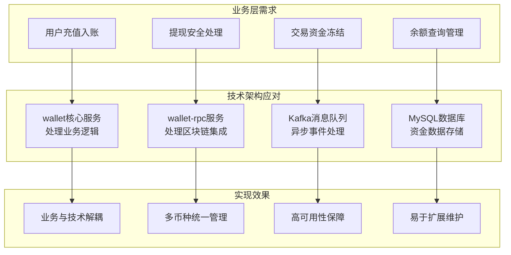
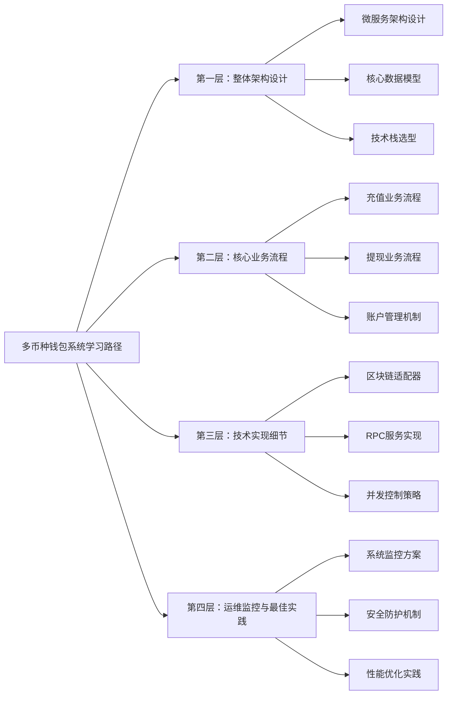
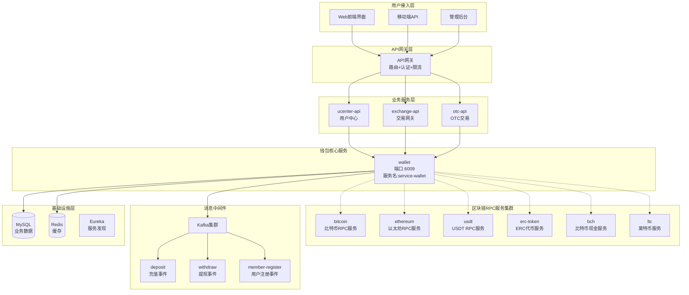
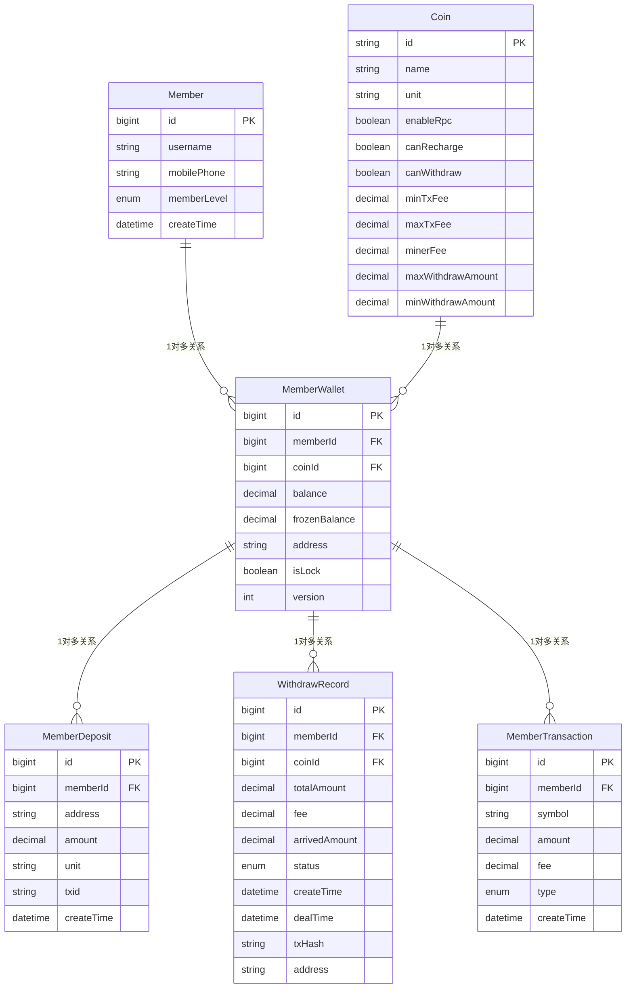
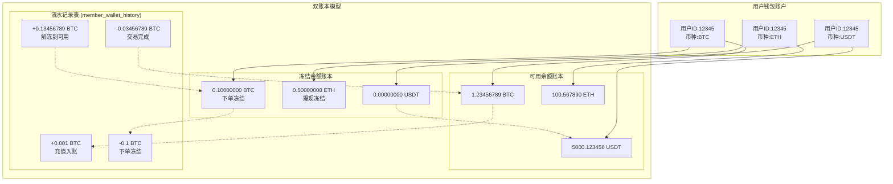
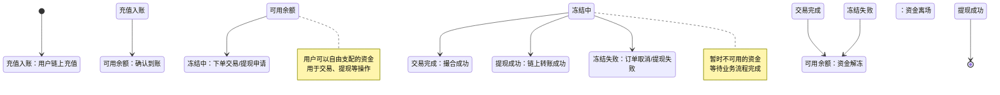
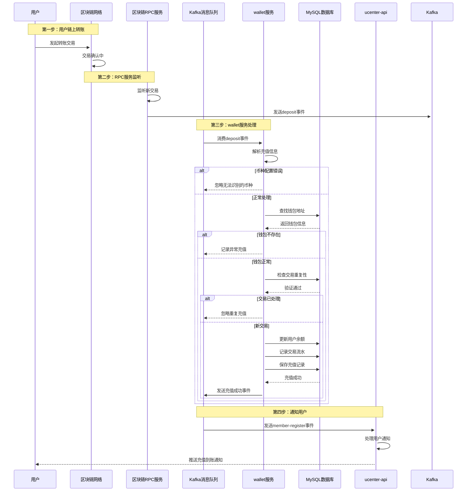
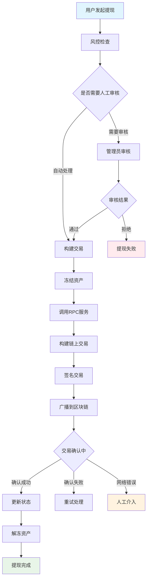
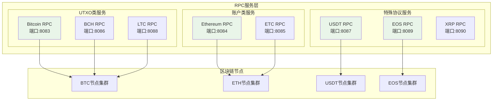

# 第 7 章：多币种钱包系统的完整技术实现和最佳实践

## 引言

在前面的章节中，我们学习了用户中心如何管理数字身份，Kafka如何协调各微服务间的异步通信。现在，让我们将目光投向整个交易所最核心、最关键的模块——**钱包系统**，它是所有资金的"大管家"，直接关系到用户资产的安全和平台的运营稳定。

想象一下，一个现代化的数字货币交易所就像一个繁忙的国际银行，需要同时处理多种"货币"（BTC、ETH、USDT等）的存取、转账和兑换业务。如果为每一种数字货币都建立独立的处理系统，不仅会造成资源浪费，更会增加系统复杂度和维护成本。

通过对 `01_bizzan_framework` 项目的深入分析，我们发现 Bizzan 交易所的钱包系统采用了一种**务实而高效的微服务架构**：将钱包业务逻辑与区块链技术细节分离。这种设计既保证了核心业务的稳定性和安全性，又能灵活应对不同区块链协议的技术挑战。

### 钱包系统的核心挑战

在数字货币交易所中，钱包系统面临着独特的挑战：

| 挑战类型 | 具体表现 | 技术影响 | 业务影响 |
|----------|----------|----------|----------|
| **技术复杂性** | 每种数字货币都有不同的区块链协议、交易确认机制、手续费标准 | 需要支持多种RPC协议和钱包实现 | 技术维护成本高，新币种接入难度大 |
| **安全性要求** | 任何资金操作都必须绝对安全，容不得半点差错 | 需要严格的数据一致性和并发控制 | 用户资金安全，平台声誉保障 |
| **实时性需求** | 用户充值需要及时到账，提现需要快速处理 | 需要高效的区块链监听和处理机制 | 用户体验，资金周转效率 |
| **可扩展性** | 需要支持新币种的快速接入和业务功能的扩展 | 需要灵活的架构设计和接口抽象 | 业务发展，市场竞争力 |


### 实际架构方案


Bizzan 交易所通过以下设计思路应对这些挑战：





通过这一章的学习，你不仅能掌握钱包系统的技术实现，更能理解如何在复杂的业务需求和技术约束之间找到最佳平衡点，这对于构建任何金融级别的系统都具有重要的参考价值。



---

## 第一层：整体架构设计

在深入具体的技术实现之前，让我们先理解钱包系统的整体架构设计思路。一个好的架构不仅能够解决当前的技术问题，更要为未来的业务发展预留足够的空间。

### 系统架构全景图

基于对 `01_bizzan_framework` 项目的深入分析，Bizzan 交易所的钱包系统采用了**分层的微服务架构**，将复杂的钱包业务分解为相互协作但职责明确的服务模块：



### 微服务架构设计原则

**业务与技术分离**：

- **wallet 服务**：专注于业务逻辑，如余额管理、资金冻结、交易流水等
- **wallet-rpc 服务**：专注于区块链技术细节，如交易构建、签名、广播等

这种分离设计的核心优势：
1. **专业化分工**：钱包团队专注业务逻辑，区块链团队专注协议实现
2. **独立部署**：两个服务可以独立升级和部署，互不影响
3. **故障隔离**：区块链服务的问题不会影响钱包核心业务
4. **技术栈灵活**：可以根据不同区块链的特点选择最适合的技术实现

**单一职责原则**：
每个 RPC 服务只负责一种数字货币，降低了系统的复杂性，也便于独立维护和升级。当需要支持新币种时，只需要开发对应的 RPC 服务即可。

### 核心数据模型设计

数据模型是系统的骨架，它决定了系统能够表达什么样的业务逻辑，也影响着系统的性能和可维护性。在钱包系统中，数据模型的设计尤为重要，因为任何错误都可能导致用户资产的损失。

#### 钱包系统实体关系图



#### MemberWallet - 用户钱包实体

MemberWallet 是整个钱包系统的核心实体，它记录了每个用户在每个币种下的资产状况。这个实体的设计体现了金融系统对**精确性**和**安全性**的极致追求：

```java
// 实际位置：core/src/main/java/com/bizzan/bitrade/entity/MemberWallet.java
@Entity
@Data
@Table(uniqueConstraints = {@UniqueConstraint(columnNames={"memberId", "coin_id"})})
public class MemberWallet {
    @GeneratedValue(strategy = GenerationType.IDENTITY)
    @Id
    private Long id;

    private Long memberId;                    // 用户ID

    @ManyToOne
    @JoinColumn(name = "coin_id")
    private Coin coin;                       // 币种信息

    // 可用余额 - 26位精度确保足够的小数位
    @Column(columnDefinition = "decimal(26,16) comment '可用余额'")
    private BigDecimal balance;

    // 冻结余额 - 用于订单冻结、提现冻结等
    @Column(columnDefinition = "decimal(26,16) comment '冻结余额'")
    private BigDecimal frozenBalance;

    // 充值地址 - 每个用户每个币种一个地址
    private String address;

    // 钱包锁定状态 - 0否，1是
    @Enumerated(EnumType.ORDINAL)
    @Column(columnDefinition = "int default 0 comment '钱包不是锁定'")
    private BooleanEnum isLock = BooleanEnum.IS_FALSE;

    // 乐观锁版本号
    @JsonIgnore
    @Version
    private int version;
}
```

**设计亮点分析**：

1. **精度保障**：使用 `decimal(26,16)` 类型，支持26位总长度和16位小数，这足以处理比特币的最小单位（1亿分之一）和以太坊的精度需求

2. **双账本分离**：`balance` 和 `frozenBalance` 的分离设计，使得系统可以同时处理用户的正常交易和冻结中的资金

3. **并发安全**：通过 `@Version` 乐观锁机制，防止高并发下的数据不一致问题

4. **唯一约束**：`(memberId, coin_id)` 的唯一性约束确保了每个用户每个币种只有一个钱包记录

#### Coin - 币种配置实体

Coin 实体定义了每种数字货币的特性和配置，是系统多币种支持的基础：

```java
// 实际位置：core/src/main/java/com/bizzan/bitrade/entity/Coin.java
@Entity
@Data
@Table(name = "coin")
public class Coin {
    @Id
    @NotBlank(message = "币名称不得为空")
    private String name;                    // 币种名称（全称）

    private String nameCn;                  // 中文名称
    private String unit;                    // 币种单位（如BTC、ETH）

    @Enumerated(EnumType.ORDINAL)
    private CommonStatus status = CommonStatus.NORMAL;  // 状态

    // 是否支持RPC接口
    @Enumerated(EnumType.ORDINAL)
    private BooleanEnum enableRpc = BooleanEnum.IS_FALSE;

    // 是否支持充值、提现
    @Enumerated(EnumType.ORDINAL)
    private BooleanEnum canRecharge;
    @Enumerated(EnumType.ORDINAL)
    private BooleanEnum canWithdraw;

    // 手续费配置
    private double minTxFee;
    private double maxTxFee;
    private BigDecimal minerFee;             // 矿工费

    // 汇率信息
    private double cnyRate;                 // 对人民币汇率
    private BigDecimal usdRate;             // 对美元汇率

    // 排序和限制
    private int sort;
    private BigDecimal maxWithdrawAmount;     // 最大提币数量
    private BigDecimal minWithdrawAmount;     // 最小提币数量
    private BigDecimal minRechargeAmount;     // 最小充值数量

    // 提现相关配置
    private BigDecimal withdrawThreshold;     // 提币阈值
    private BooleanEnum canAutoWithdraw;     // 是否能自动提币
    private int withdrawScale;               // 提币精度

    // 账户类型：0：默认  1：EOS类型
    private int accountType;
    private String depositAddress;           // 充值地址（仅账户类型为EOS类型有效）

    // 冷钱包配置
    private String coldWalletAddress;        // 冷钱包地址

    // 平台币和法币标识
    private BooleanEnum isPlatformCoin = BooleanEnum.IS_FALSE;  // 是否是平台币
    private Boolean hasLegal = false;        // 是否是合法币种

    // 币种信息
    private String infolink;                 // 币种资料链接
    private String information;              // 币种简介
}
```

### 双账本模型设计

在钱包系统中，如何管理用户的资金状态是一个核心的设计问题。传统的单账本模型（只记录总余额）无法满足数字货币交易所复杂的业务场景，比如：用户下单时需要冻结资金，提现时需要锁定资产，交易完成时需要解冻资金。

基于实际代码分析，Bizzan 钱包系统采用了**双账本模型**，这是一种在传统金融系统中广泛应用的成熟模式。

#### 双账本模型的工作原理



**双账本模型的核心优势**：

1. **业务清晰**：可用余额和冻结余额的分离，让业务逻辑更加直观和安全
2. **并发友好**：不同操作可以并发进行，不会相互阻塞
3. **审计追踪**：每笔资金变动都有清晰的记录，便于审计和问题排查
4. **风险控制**：可以精确控制用户的可操作资金，降低风险

#### 资金流转状态图

在实际的业务流程中，资金会在不同状态之间流转：





---

## 第二层：核心业务流程

理解了整体架构设计后，现在让我们深入分析钱包系统的核心业务流程。钱包系统的业务流程直接关系到用户资金的安全和体验，必须在**安全性**、**效率**和**可靠性**之间找到最佳平衡。

### 充值业务流程详解

充值是用户将数字货币从个人钱包转入交易所的第一步，也是最关键的用户体验环节。一个优秀的充值系统需要做到：**及时响应**（用户充值后能快速到账）、**准确识别**（正确识别每一笔链上交易）、**安全可靠**（防止重复充值和恶意攻击）。

#### 充值流程架构图



#### 充值监听机制实现

基于 `wallet/consumer/FinanceConsumer.java` 的实际实现分析，让我们看看充值监听是如何工作的：

```java
// 模块：wallet/src/main/java/com/bizzan/bizzanbitrade/consumer/FinanceConsumer.java
@Component
@Slf4j
public class FinanceConsumer {

    @Autowired
    private CoinService coinService;
    @Autowired
    private MemberWalletService walletService;
    @Autowired
    private MemberService memberService;
    @Autowired
    private WithdrawRecordService withdrawRecordService;

    /**
     * 处理充值消息，key值为币种的名称（如Bitcoin）
     */
    @KafkaListener(topics = {"deposit"})
    public void handleDeposit(ConsumerRecord<String, String> record) {
        logger.info("topic={},key={},value={}", record.topic(), record.key(), record.value());

        if (StringUtils.isEmpty(record.value())) {
            return;
        }

        JSONObject json = JSON.parseObject(record.value());
        if (json == null) {
            return;
        }

        // 解析充值信息
        BigDecimal amount = json.getBigDecimal("amount");
        String txid = json.getString("txid");
        String address = json.getString("address");
        Coin coin = coinService.findOne(record.key());

        // 区分不同类型的充值处理
        if (coin.getAccountType() == 1) {
            // Memo类型的充值（如EOS、XRP等）
            Long memoId = json.getLong("userId");
            Long userId = memoId - 345678; // 与前端memo保持一致
            Member m = memberService.findOne(userId);
            if (m != null && walletService.findDepositByTxid(txid) == null) {
                MessageResult mr = walletService.recharge2(userId, coin, address, amount, txid);
                logger.info("wallet recharge result:{}", mr);
            }
        } else {
            // 普通地址充值
            if (coin != null && walletService.findDeposit(address, txid) == null) {
                MessageResult mr = walletService.recharge(coin, address, amount, txid);
                logger.info("wallet recharge result: {}", mr);
            }
        }
    }
}
```

**充值监听机制的技术亮点**：

1. **Kafka消息驱动**：通过Kafka消息队列实现区块链监听与业务处理的解耦
2. **币种区分处理**：支持普通地址充值和Memo类型充值的差异化处理
3. **重复检查机制**：通过检查交易哈希防止重复充值
4. **异步处理**：非阻塞的消息处理提高了系统吞吐量

#### 充值处理核心逻辑

```java
// 模块：core/src/main/java/com/bizzan/bitrade/service/MemberWalletService.java
@Service
@Slf4j
public class MemberWalletService extends BaseService {

    /**
     * 普通地址充值处理
     */
    @Transactional(rollbackFor = Exception.class)
    public MessageResult recharge(Coin coin, String address, BigDecimal amount, String txid) {
        // 1. 根据地址和币种查找用户钱包
        MemberWallet wallet = findByCoinAndAddress(coin, address);
        if (wallet == null) {
            return new MessageResult(500, "wallet cannot be null");
        }

        // 2. 验证充值金额
        if (amount.compareTo(BigDecimal.ZERO) <= 0) {
            return new MessageResult(500, "amount must large then 0");
        }

        // 3. 保存充值记录
        MemberDeposit deposit = new MemberDeposit();
        deposit.setAddress(address);
        deposit.setAmount(amount);
        deposit.setMemberId(wallet.getMemberId());
        deposit.setTxid(txid);
        deposit.setUnit(wallet.getCoin().getUnit());
        depositDao.save(deposit);

        // 4. 更新用户余额
        wallet.setBalance(wallet.getBalance().add(amount));

        // 5. 记录交易流水
        MemberTransaction transaction = new MemberTransaction();
        transaction.setAmount(amount);
        transaction.setSymbol(wallet.getCoin().getUnit());
        transaction.setAddress(wallet.getAddress());
        transaction.setMemberId(wallet.getMemberId());
        transaction.setType(TransactionType.RECHARGE);
        transaction.setFee(BigDecimal.ZERO);
        transaction.setDiscountFee("0");
        transaction.setRealFee("0");
        transaction.setCreateTime(new Date());
        transactionService.save(transaction);

        // 6. 发送充值成功短信通知
        Member member = memberDao.findOne(wallet.getMemberId());
        if (member != null) {
            try {
                smsProvider.sendCustomMessage(member.getMobilePhone(),
                    "尊敬的用户：恭喜您充值" + wallet.getCoin().getUnit() +
                    "成功，充值数量为：" + amount.stripTrailingZeros().toPlainString());
            } catch (Exception e) {
                e.printStackTrace();
            }
        }

        return new MessageResult(0, "success");
    }
}
```

### 提现业务流程控制

如果说充值是用户资金的"入口"，那么提现就是资金安全的"出口"。提现业务流程的复杂性远超充值，因为它不仅涉及技术实现，还涉及风险控制、合规审查、资金安全等多个维度的考量。

#### 提现流程架构

下面的流程图展示了完整的提现业务流程，从用户发起请求到资金最终到账的全过程：



**提现流程的关键决策点**：

1. **风控检查**：基于金额、频率、用户等级等多维度风险评估
2. **审核决策**：自动处理 vs 人工审核的智能判断
3. **异常处理**：网络故障、区块链拥堵等异常情况的处理策略
4. **状态跟踪**：从申请到完成的全程状态管理和通知机制

#### 风控检查机制

基于实际项目的风控策略，提现风控检查涉及多个维度：

| 风控维度 | 检查项目 | 风险等级 | 处理策略 |
|----------|----------|----------|----------|
| **地址安全** | 黑名单地址检查 | 极高 | 直接拒绝 |
| **用户等级** | 实名认证等级 | 中等 | 人工审核 |
| **金额限制** | 单笔/日累计提现 | 高/中 | 分级处理 |
| **频率控制** | 提现频率限制 | 中等 | 人工审核 |
| **余额验证** | 账户余额充足性 | 低 | 前置检查 |
| **历史记录** | 异常行为模式 | 中等 | 延迟处理 |

```java
// 提现风控检查服务
@Service
public class WithdrawRiskService {

    @Autowired
    private BlacklistService blacklistService;
    @Autowired
    MemberWalletService walletService;

    public RiskCheckResult checkWithdrawRisk(WithdrawRequest request) {
        RiskCheckResult result = new RiskCheckResult();

        // 1. 黑名单地址检查
        if (blacklistService.isBlacklisted(request.getAddress())) {
            result.setRiskLevel(RiskLevel.HIGH);
            result.setBlockReason("提现地址在黑名单中");
            return result;
        }

        // 2. 用户等级检查
        Member member = memberService.findOne(request.getMemberId());
        if (member.getMemberLevel() == MemberLevelEnum.LEVEL_0) {
            result.setRiskLevel(RiskLevel.MEDIUM);
            result.setRequireManualReview(true);
            result.setBlockReason("新用户提现需要审核");
            return result;
        }

        // 3. 金额检查
        Coin coin = coinService.findByUnit(request.getSymbol());
        if (request.getAmount().compareTo(coin.getMaxWithdrawAmount()) > 0) {
            result.setRiskLevel(RiskLevel.HIGH);
            result.setBlockReason("超过最大提现限额");
            return result;
        }

        // 4. 频率检查
        if (checkWithdrawFrequency(request.getMemberId(), request.getSymbol())) {
            result.setRiskLevel(RiskLevel.MEDIUM);
            result.setRequireManualReview(true);
            result.setBlockReason("提现频率过高");
            return result;
        }

        result.setRiskLevel(RiskLevel.LOW);
        return result;
    }

    private boolean checkWithdrawFrequency(Long memberId, String symbol) {
        String key = "withdraw_frequency:" + memberId + ":" + symbol;
        Integer count = (Integer) redisTemplate.opsForValue().get(key);
        return count != null && count > 10; // 10次/天
    }
}
```

#### 提现处理核心实现

基于实际项目的提现处理，我们来看看提现申请的完整生命周期管理：

```java
// 模块：wallet/src/main/java/com/bizzan/bitrade/consumer/FinanceConsumer.java
/**
 * 处理提现请求，调用钱包RPC，自动转账
 */
@KafkaListener(topics = {"withdraw"})
public void handleWithdraw(ConsumerRecord<String, String> record) {
    logger.info("topic={},key={},value={}", record.topic(), record.key(), record.value());

    if (StringUtils.isEmpty(record.value())) {
        return;
    }

    JSONObject json = JSON.parseObject(record.value());
    Long withdrawId = json.getLong("withdrawId");

    try {
        // 1. 构建RPC服务调用URL
        String serviceName = "SERVICE-RPC-" + record.key().toUpperCase();
        String url = "http://" + serviceName + "/rpc/withdraw?address={1}&amount={2}&fee={3}";

        // 2. 获取币种配置
        Coin coin = coinService.findByUnit(record.key());
        logger.info("coin = {}", coin.toString());

        // 3. 检查是否支持自动提现
        if (coin != null && coin.getCanAutoWithdraw() == BooleanEnum.IS_TRUE) {
            BigDecimal minerFee = coin.getMinerFee();

            // 4. 调用RPC服务进行提现
            MessageResult result = restTemplate.getForObject(url,
                MessageResult.class,
                json.getString("address"),
                json.getBigDecimal("arriveAmount"),
                minerFee);

            logger.info("=========================rpc 结束================================");
            logger.info("result = {}", result);

            // 5. 处理RPC调用结果
            if (result.getCode() == 0 && result.getData() != null) {
                logger.info("====================== 处理成功,data为txid更新业务 ==================================");
                // 处理成功，data为txid，更新业务订单
                String txid = (String) result.getData();
                withdrawRecordService.withdrawSuccess(withdrawId, txid);
            } else {
                logger.info("====================== 自动转账失败，转为人工处理 ==================================");
                // 自动转账失败，转为人工处理
                withdrawRecordService.autoWithdrawFail(withdrawId);
            }
        } else {
            // 不支持自动提现的币种处理
            logger.info("币种 {} 不支持自动提现", record.key());
        }
    } catch (Exception e) {
        e.printStackTrace();
        logger.error("auto withdraw failed,error={}", e.getMessage());
        logger.info("====================== 自动转账失败，转为人工处理 ==================================");
        // 自动转账失败，转为人工处理
        withdrawRecordService.autoWithdrawFail(withdrawId);
    }
}
```

### 账户管理机制

账户管理是钱包系统的心脏，它负责处理所有与用户资金相关的操作：从充值入账到提现处理，从余额冻结到资金解冻，每一个操作都直接关系到用户的资产安全和平台的运营稳定。

#### 余额操作状态转换

```mermaid
stateDiagram-v2
    [*] --> 余额查询：用户查询余额
    余额查询 --> [*]：返回余额信息

    [*] --> 充值入账：链上充值确认
    充值入账 --> 余额更新：增加可用余额
    余额更新 --> 流水记录：记录交易流水
    流水记录 --> [*]：充值完成

    [*] --> 提现申请：用户发起提现
    提现申请 --> 余额冻结：冻结提现金额
    余额冻结 --> 链上转账：调用RPC服务
    链上转账 --> 提现成功：转账成功
    提现成功 --> 余额扣减：减少冻结余额
    余额扣减 --> 流水记录：记录提现流水
    流水记录 --> [*]：提现完成

    链上转账 --> 提现失败：转账失败
    提现失败 --> 余额解冻：解冻提现金额
    余额解冻 --> [*]：提现失败

    [*] --> 交易冻结：用户下单交易
    交易冻结 --> 余额检查：验证可用余额
    余额检查 --> 冻结成功：余额充足
    余额检查 --> 冻结失败：余额不足

    冻结成功 --> 可用转冻结：减少可用余额
    可用转冻结 --> 冻结转可用：增加冻结余额
    冻结转可用 --> [*]：冻结完成

    冻结失败 --> [*]：冻结失败

    [*] --> 交易完成：撮合成功
    交易完成 --> 资金结算：买方增加资产
    资金结算 --> 冻结解冻：解冻交易资金
    冻结解冻 --> 可用余额：增加可用余额
    可用余额 --> [*]：交易完成
```



#### 核心余额操作实现

```java
// 冻结用户资产（用于下单等场景）
@Transactional(rollbackFor = Exception.class)
public void freezeBalance(Long memberId, String symbol, BigDecimal amount) {
    // 1. 获取用户钱包
    MemberWallet wallet = findOrCreateWallet(memberId, symbol);

    // 2. 检查余额是否足够
    if (wallet.getBalance().compareTo(amount) < 0) {
        throw new BusinessException("余额不足");
    }

    // 3. 使用乐观锁更新余额
    int updated = memberWalletDao.freezeBalance(wallet.getId(), amount, wallet.getVersion());
    if (updated == 0) {
        throw new BusinessException("并发更新失败，请重试");
    }

    // 4. 记录冻结流水
    recordTransaction(memberId, symbol, amount, TransactionType.FREEZE);
}

// 解冻用户资产（用于订单完成等场景）
@Transactional(rollbackFor = Exception.class)
public void unfreezeBalance(Long memberId, String symbol, BigDecimal amount) {
    MemberWallet wallet = findByMemberIdAndSymbol(memberId, symbol);

    // 检查冻结余额是否足够
    if (wallet.getFrozenBalance().compareTo(amount) < 0) {
        throw new BusinessException("冻结余额不足");
    }

    // 使用乐观锁更新余额
    int updated = memberWalletDao.unfreezeBalance(wallet.getId(), amount, wallet.getVersion());
    if (updated == 0) {
        throw new BusinessException("并发更新失败，请重试");
    }

    // 记录解冻流水
    recordTransaction(memberId, symbol, amount, TransactionType.UNFREEZE);
}
```

**余额操作的技术保障**：

1. **事务保护**：所有余额操作都在数据库事务中执行，确保数据一致性
2. **乐观锁控制**：通过版本号防止并发修改导致的数据不一致
3. **原子操作**：余额变更和流水记录在同一个事务中，保证操作的原子性
4. **异常处理**：完善的异常处理机制，确保系统在异常情况下的一致性

---

## 第三层：技术实现细节

理解了核心业务流程后，现在让我们深入探讨钱包系统的技术实现细节。这些技术细节是系统稳定运行的基石，也是保障用户资产安全的关键技术手段。


### RPC服务实现

RPC服务是钱包系统与区块链网络交互的桥梁，它负责处理底层的区块链协议细节，为上层业务服务提供统一的接口。

#### 多币种RPC服务架构



#### RPC服务列表与配置

| 币种 | 服务名称 | 端口 | RPC协议 | 特殊处理 | 技术栈 |
|------|----------|------|----------|----------|--------|
| **BTC** | bitcoin | 8083 | Bitcoin RPC | UTXO模型 | BitcoinJ |
| **ETH** | ethereum | 8084 | Web3 JSON-RPC | 账户模型 | Web3j |
| **USDT** | usdt | 8085 | Omni Layer | Omni协议 | BitcoinJ + Omni |
| **BCH** | bch | 8086 | Bitcoin Cash | 大区块 | BitcoinJ |
| **EOS** | eos | 8087 | EOS RPC | Memo机制 | EOS4J |
| **LTC** | ltc | 8088 | Litecoin | 轻量级 | BitcoinJ |

#### Bitcoin RPC服务示例

```java
// 模块：02_bizzan_wallet_rpc/bitcoin/src/main/java/.../controller/WalletController.java
@RestController
@RequestMapping("/rpc")
@Slf4j
public class WalletController {

    @Autowired
    private BitcoinService bitcoinService;

    // 生成新的充值地址
    @PostMapping("/address")
    public MessageResult getNewAddress(@RequestParam String label) {
        try {
            String address = bitcoinService.getNewAddress(label);
            return MessageResult.success(address);
        } catch (Exception e) {
            log.error("生成地址失败: label={}", label, e);
            return MessageResult.error("生成地址失败: " + e.getMessage());
        }
    }

    // 查询地址余额
    @PostMapping("/balance")
    public MessageResult getBalance(@RequestParam String address) {
        try {
            BigDecimal balance = bitcoinService.getBalance(address);
            return MessageResult.success(balance);
        } catch (Exception e) {
            log.error("查询余额失败: address={}", address, e);
            return MessageResult.error("查询余额失败: " + e.getMessage());
        }
    }

    // 处理提现请求
    @PostMapping("/withdraw")
    public MessageResult withdraw(@RequestParam String address,
                                  @RequestParam BigDecimal amount,
                                  @RequestParam BigDecimal fee) {
        try {
            String txHash = bitcoinService.sendToAddress(address, amount, fee);
            return MessageResult.success(txHash);
        } catch (Exception e) {
            log.error("处理提现失败: address={}, amount={}", address, amount, e);
            return MessageResult.error("处理提现失败: " + e.getMessage());
        }
    }

    // 查询交易状态
    @GetMapping("/transaction/{txHash}")
    public MessageResult getTransactionStatus(@PathVariable String txHash) {
        try {
            TransactionStatus status = bitcoinService.getTransactionStatus(txHash);
            return MessageResult.success(status);
        } catch (Exception e) {
            log.error("查询交易状态失败: txHash={}", txHash, e);
            return MessageResult.error("查询交易状态失败: " + e.getMessage());
        }
    }

    // 获取区块高度
    @GetMapping("/height")
    public MessageResult getBlockHeight() {
        try {
            long height = bitcoinService.getBlockHeight();
            return MessageResult.success(height);
        } catch (Exception e) {
            log.error("获取区块高度失败", e);
            return MessageResult.error("获取区块高度失败: " + e.getMessage());
        }
    }
}
```

#### RPC服务健康检查

```java
// RPC服务健康检查端点
@RestController
@RequestMapping("/health")
public class HealthController {

    @Autowired
    private BitcoinService bitcoinService;

    @GetMapping
    public MessageResult healthCheck() {
        try {
            // 检查区块链连接
            long blockHeight = bitcoinService.getBlockHeight();

            // 检查钱包状态
            String masterAddress = bitcoinService.getMasterAddress();
            BigDecimal balance = bitcoinService.getBalance(masterAddress);

            Map<String, Object> health = new HashMap<>();
            health.put("status", "HEALTHY");
            health.put("blockHeight", blockHeight);
            health.put("masterAddress", masterAddress);
            health.put("balance", balance);
            health.put("timestamp", System.currentTimeMillis());

            return MessageResult.success(health);
        } catch (Exception e) {
            log.error("健康检查失败", e);
            Map<String, Object> health = new HashMap<>();
            health.put("status", "UNHEALTHY");
            health.put("error", e.getMessage());
            health.put("timestamp", System.currentTimeMillis());

            return MessageResult.error("RPC服务不健康", health);
        }
    }
}
```


### 总结

通过这个钱包系统的学习和实践，开发者可以掌握构建金融级数字资产管理系统的核心技术和最佳实践，为后续的系统开发和优化提供了坚实的基础。