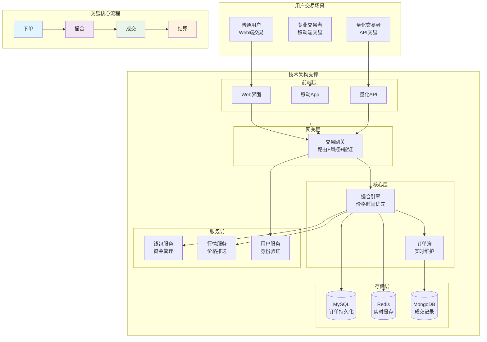
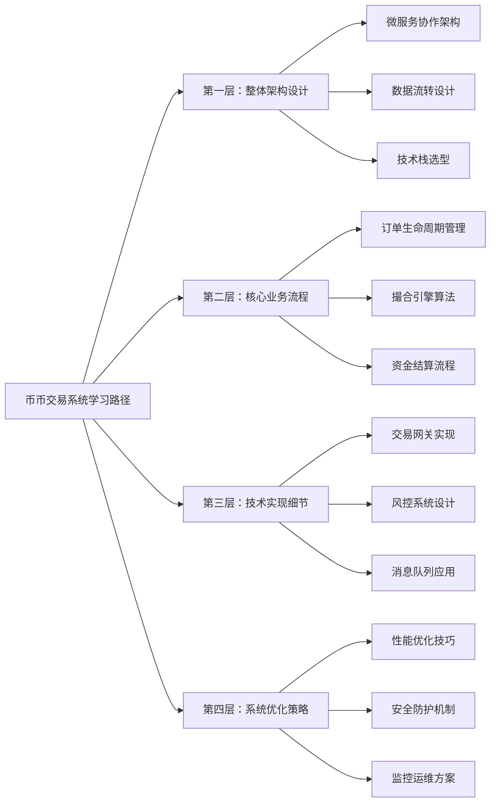
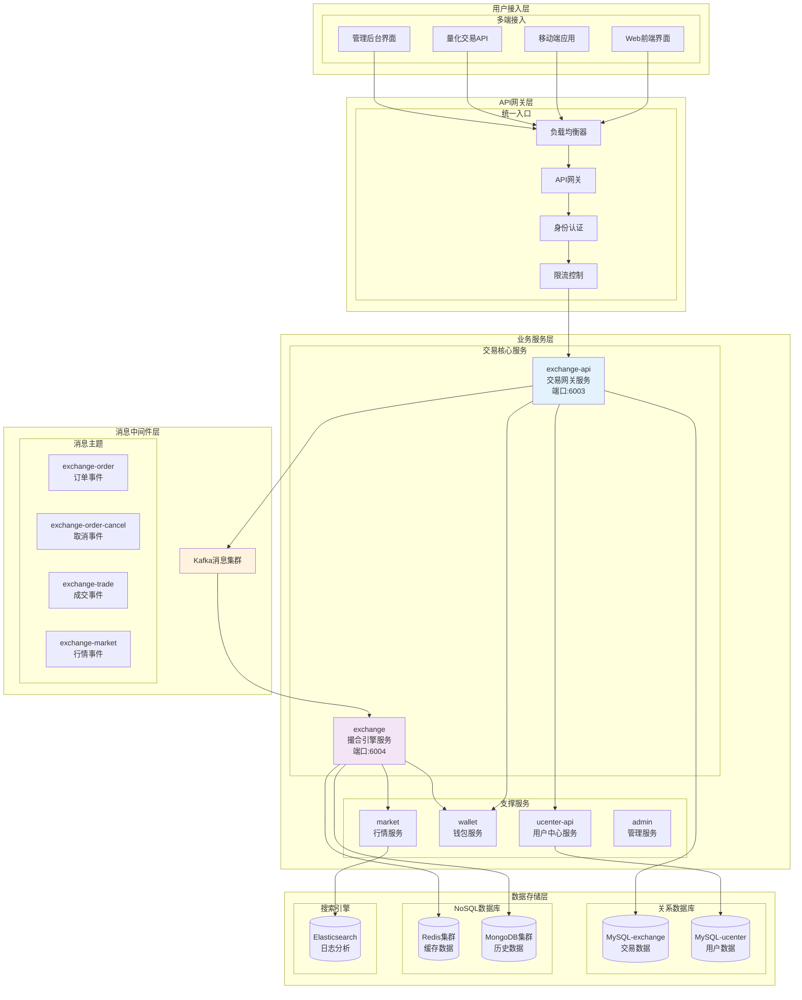
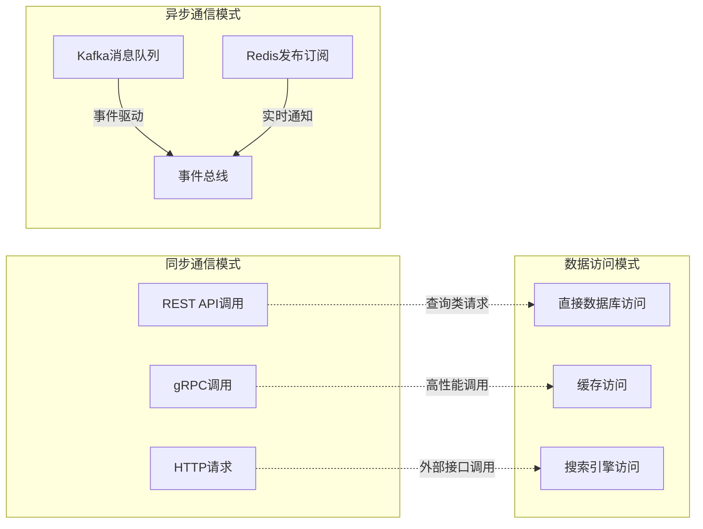
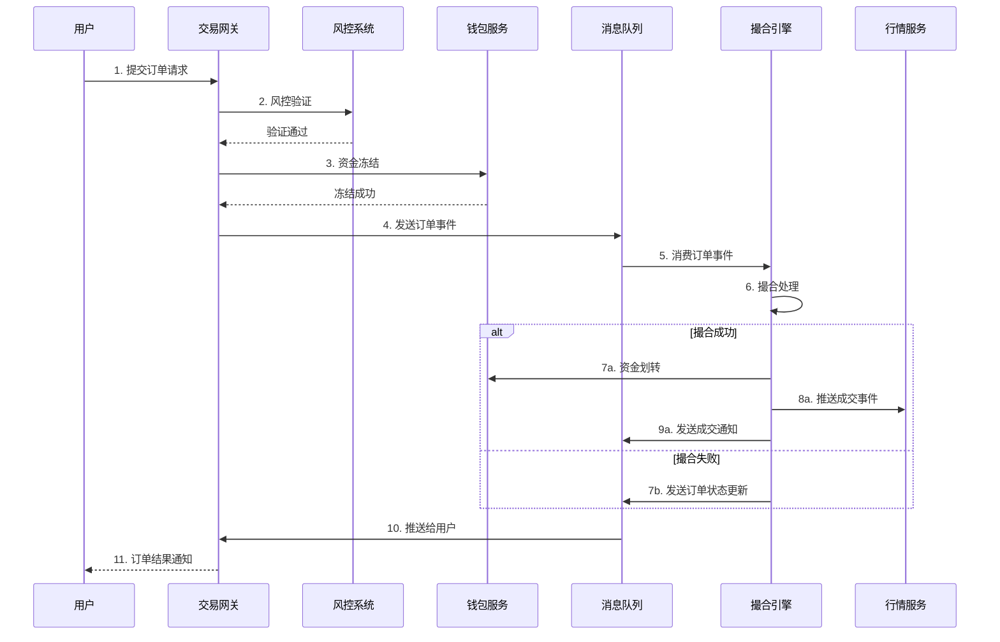
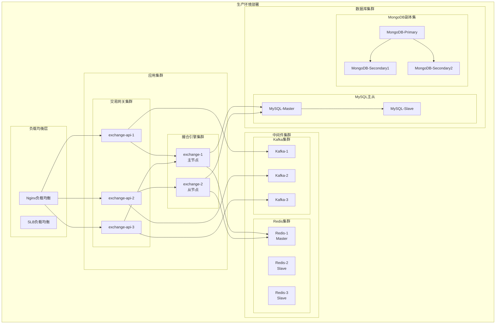
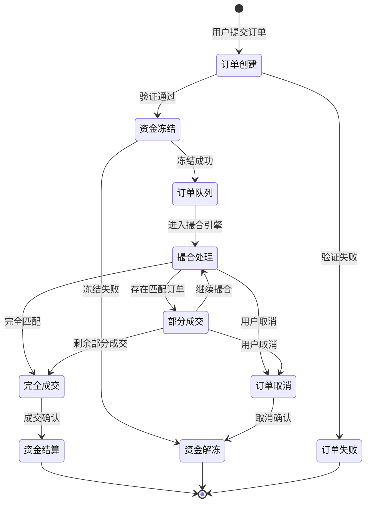
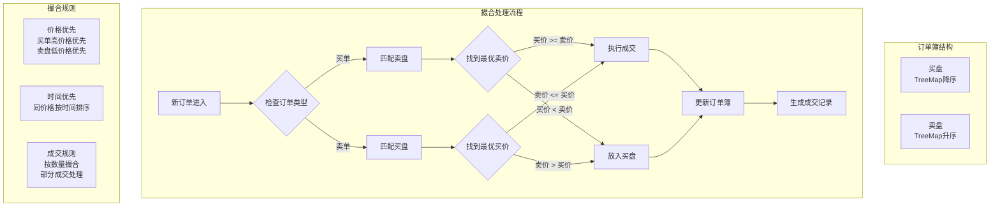
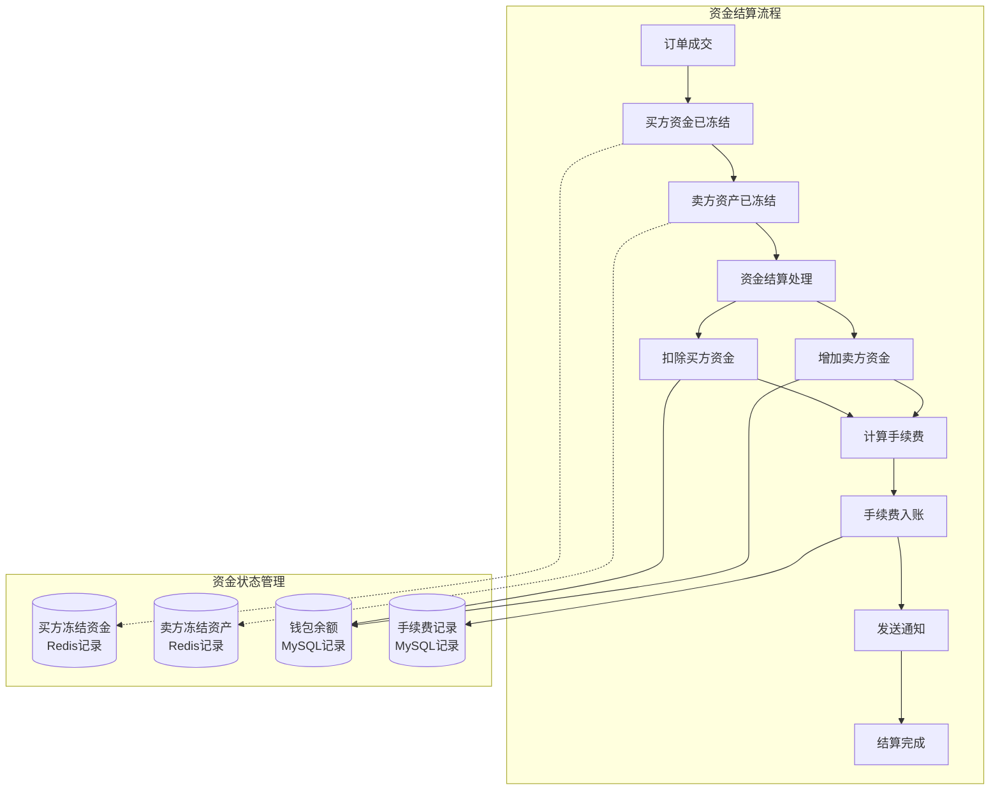
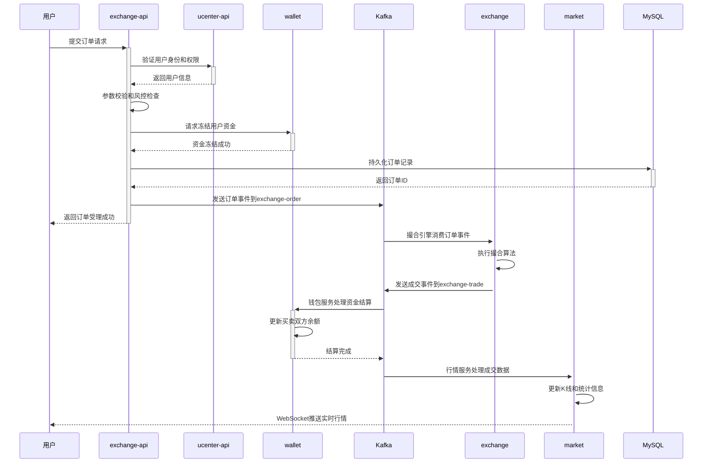

# 第 8 章：币币交易系统架构设计

## 引言

在上一章中，我们学习了钱包系统这个"资金大管家"如何管理用户的数字资产。现在，让我们来看看这些资产如何进行交易——这就是币币交易系统的核心职责。

### 币币交易业务全景图



### 什么是币币交易？

**币币交易**（Spot Trading）是指用一种数字资产直接兑换另一种数字资产的交易方式。例如，用比特币(BTC)购买以太坊(ETH)，就是BTC/ETH交易对的币币交易。与法币交易不同，币币交易不涉及法定货币，实现了数字资产之间的直接兑换。

### 交易对的基本概念

**交易对**（Trading Pair）是币币交易的基础单位，表示两种数字资产之间的兑换关系。例如：
- **BTC/USDT**：用比特币交易泰达币
- **ETH/BTC**：用以太坊交易比特币
- **交易对格式**：基础币/计价币，其中第一个是交易的标的，第二个是计价单位

### 订单类型详解

| 订单类型 | 价格设置 | 成交条件 | 适用场景 | 风险特点 |
|----------|----------|----------|----------|----------|
| **限价买单** | 指定最高买入价 | 价格≤指定价时成交 | 控制买入成本 | 可能无法成交 |
| **限价卖单** | 指定最低卖出价 | 价格≥指定价时成交 | 确保最低收益 | 可能无法成交 |
| **市价买单** | 市场最优价 | 按卖盘顺序成交 | 快速买入 | 价格滑点风险 |
| **市价卖单** | 市场最优价 | 按买盘顺序成交 | 快速卖出 | 价格滑点风险 |

### 撮合原则

币币交易系统遵循全球交易所通用的撮合原则：
- **价格优先**：买单价格从高到低排序，卖单价格从低到高排序
- **时间优先**：相同价格的订单，按提交时间先后顺序执行

### 系统架构价值

币币交易系统是数字货币交易所的"心脏"，它连接了买卖双方，实现不同数字资产之间的自由兑换。想象一下繁忙的证券交易所：无数的交易者同时下单、撤单、查询，系统需要在毫秒级响应时间内处理这些请求，确保每一笔交易都公平、准确、高效。

从用户下单到订单成交，再到资金结算，整个过程涉及多个微服务的精密协作。Bizzan交易所的币币交易系统采用微服务架构，通过交易网关和撮合引擎的分离，实现了高性能、高可用的交易服务。

### 技术挑战与解决路径

| 核心挑战 | 解决策略 | 技术方案 | 性能目标 |
|----------|----------|----------|----------|
| **高并发处理** | 微服务+异步架构 | Kafka消息队列+多线程处理 | 10万+TPS |
| **低延迟撮合** | 内存撮合算法 | TreeMap订单簿+红黑树 | <1ms撮合延迟 |
| **资金安全** | 多重验证机制 | 分布式锁+事务保证 | 0资金错误 |
| **系统可靠性** | 故障隔离+自动恢复 | 服务降级+熔断机制 | 99.99%可用性 |
| **数据一致性** | 事件驱动+最终一致性 | 消息队列+补偿机制 | 强一致性保证 |

### 本章学习路径



通过本章的系统学习，你将掌握币币交易系统的完整技术实现，从宏观架构到微观算法，从业务流程到技术细节，全面理解如何构建一个高性能、高可用的数字资产交易平台。

## 8.1 微服务协作架构

#### 币币交易系统分层架构



#### 微服务拆分策略

| 服务模块 | 核心职责 | 技术特点 | 性能要求 |
|----------|----------|----------|----------|
| **exchange-api** | 交易网关、订单管理、风控验证 | Spring Boot + Kafka | 高并发、低延迟 |
| **exchange** | 撮合引擎、订单簿维护 | Java内存计算 | 毫秒级撮合 |
| **wallet** | 资金管理、冻结解冻、手续费 | 分布式事务 | 强一致性 |
| **market** | 行情推送、K线生成、盘口深度 | WebSocket + Netty | 实时推送 |
| **ucenter-api** | 用户管理、身份认证、权限控制 | Spring Security | 高可用 |

#### 服务间通信模式



### 8.2 核心数据流转设计

#### 完整交易生命周期



#### 数据流向分析

| 数据流向 | 触发条件 | 处理方式 | 存储位置 |
|----------|----------|----------|----------|
| **用户下单** | 用户提交订单 | 同步验证 + 异步处理 | MySQL订单表 |
| **资金冻结** | 订单验证通过 | 同步调用钱包服务 | Redis冻结记录 |
| **撮合处理** | Kafka订单事件 | 内存撮合算法 | Redis订单簿 |
| **成交推送** | 撮合成功 | 异步事件推送 | WebSocket/Netty |
| **资金结算** | 成交确认 | 分布式事务 | MySQL钱包表 |

### 8.3 部署架构设计




---

### 核心业务流程

### 8.4 订单生命周期管理

#### 订单状态转换流程



#### 订单状态详解

| 状态码 | 状态名称 | 触发条件 | 可操作性 | 系统行为 |
|--------|----------|----------|----------|----------|
| **ORDER_SUBMIT** | 订单提交 | 用户点击下单 | 可取消 | 生成订单ID |
| **ORDER_PENDING** | 订单处理中 | 风控验证通过 | 可取消 | 资金冻结 |
| **ORDER_PARTIAL** | 部分成交 | 撮合部分成功 | 可取消 | 更新剩余数量 |
| **ORDER_COMPLETE** | 完全成交 | 订单完全撮合 | 不可操作 | 资金结算 |
| **ORDER_CANCELED** | 已取消 | 用户取消或系统取消 | 不可操作 | 资金解冻 |
| **ORDER_REJECTED** | 订单拒绝 | 风控未通过 | 不可操作 | 返回错误信息 |

### 8.5 撮合引擎核心算法


#### 价格时间优先撮合流程



#### 订单簿数据结构

```java
// 买盘：价格降序的TreeMap
TreeMap<BigDecimal, List<Order>> buyOrders = new TreeMap<>(Collections.reverseOrder());

// 卖盘：价格升序的TreeMap
TreeMap<BigDecimal, List<Order>> sellOrders = new TreeMap<>();

// 订单匹配逻辑
public void matchOrder(Order newOrder) {
    if (newOrder.isBuy()) {
        // 买单：查找最低价格的卖单
        while (!sellOrders.isEmpty() &&
               newOrder.getPrice().compareTo(sellOrders.firstKey()) >= 0) {
            executeTrade(newOrder, sellOrders.firstKey());
        }
        if (newOrder.getAmount() > 0) {
            addToBuyOrders(newOrder);
        }
    } else {
        // 卖单：查找最高价格的买单
        while (!buyOrders.isEmpty() &&
               buyOrders.firstKey().compareTo(newOrder.getPrice()) >= 0) {
            executeTrade(newOrder, buyOrders.firstKey());
        }
        if (newOrder.getAmount() > 0) {
            addToSellOrders(newOrder);
        }
    }
}
```

### 8.6 资金结算流程

#### 资金流转状态图



#### 手续费计算策略

| 用户等级 | 手续费率 | 计算基数 | 优惠策略 | 返佣比例 |
|----------|----------|----------|----------|----------|
| **VIP1** | 0.1% | 成交金额 | 交易量优惠 | 20% |
| **VIP2** | 0.08% | 成交金额 | 交易量优惠 | 30% |
| **VIP3** | 0.05% | 成交金额 | 交易量优惠 | 40% |
| **普通用户** | 0.15% | 成交金额 | 无优惠 | 10% |


### 8.1.4 数据存储架构

#### 多层存储架构理念

币币交易系统采用**分层存储策略**（Tiered Storage Strategy），不同类型的数据使用最适合的存储技术：

**数据特性差异**：
- **订单数据**：需要强一致性，支持事务
- **成交详情**：写入频繁，查询量大，需要高性能
- **缓存数据**：访问频繁，需要低延迟
- **配置数据**：变化较少，需要高可用

**存储技术选型**：
- **MySQL**：ACID事务保证数据一致性，适合订单和用户数据
- **MongoDB**：灵活Schema和高性能写入，适合成交详情存储
- **Redis**：微秒级响应，适合缓存和实时数据

**数据生命周期管理**：
- **热数据**(0-7天)：Redis + MySQL主库，实时访问
- **温数据**(7-90天)：MySQL从库 + MongoDB，定期访问
- **冷数据**(90天以上)：对象存储，历史分析

**分层存储策略：**

**1. MySQL - 核心交易数据**
```sql
-- 订单表（主要交易数据）
CREATE TABLE exchange_order (
    order_id VARCHAR(50) PRIMARY KEY,
    member_id BIGINT NOT NULL,
    symbol VARCHAR(20) NOT NULL,
    type TINYINT NOT NULL COMMENT '订单类型：0限价单，1市价单',
    direction TINYINT NOT NULL COMMENT '买卖方向：0卖出，1买入',
    status TINYINT NOT NULL DEFAULT 0 COMMENT '订单状态',
    price DECIMAL(20,8) COMMENT '委托价格',
    amount DECIMAL(20,8) NOT NULL COMMENT '委托数量',
    traded_amount DECIMAL(20,8) DEFAULT 0 COMMENT '已成交数量',
    turnover DECIMAL(20,8) DEFAULT 0 COMMENT '成交额',
    coin_symbol VARCHAR(10) NOT NULL COMMENT '交易币',
    base_symbol VARCHAR(10) NOT NULL COMMENT '基准币',
    time BIGINT NOT NULL COMMENT '创建时间',
    completed_time BIGINT COMMENT '完成时间',
    canceled_time BIGINT COMMENT '取消时间',
    INDEX idx_member_symbol (member_id, symbol),
    INDEX idx_status_time (status, time),
    INDEX idx_symbol_time (symbol, time)
);

-- 交易对配置表
CREATE TABLE exchange_coin (
    id INT PRIMARY KEY AUTO_INCREMENT,
    symbol VARCHAR(20) UNIQUE NOT NULL COMMENT '交易对符号',
    base_symbol VARCHAR(10) NOT NULL COMMENT '基准币',
    coin_symbol VARCHAR(10) NOT NULL COMMENT '交易币',
    enable TINYINT DEFAULT 1 COMMENT '是否启用',
    exchangeable TINYINT DEFAULT 1 COMMENT '是否可交易',
    sort TINYINT DEFAULT 0 COMMENT '排序',
    fee DECIMAL(6,4) DEFAULT 0.0010 COMMENT '手续费率',
    publish_type TINYINT DEFAULT 0 COMMENT '发行类型',
    max_trading_order INT DEFAULT 0 COMMENT '最大挂单数量限制',
    max_trading_time INT DEFAULT 0 COMMENT '订单超时时间(秒)',
    min_sell_price DECIMAL(20,8) DEFAULT 0 COMMENT '最低卖价限制',
    max_buy_price DECIMAL(20,8) DEFAULT 0 COMMENT '最高买价限制',
    enable_market_buy TINYINT DEFAULT 1 COMMENT '是否支持市价买入',
    enable_market_sell TINYINT DEFAULT 1 COMMENT '是否支持市价卖出'
);
```

**2. MongoDB - 订单详情数据**
```javascript
// exchange_order_detail 集合
{
  _id: ObjectId,
  orderId: "订单ID",
  price: NumberDecimal("成交价格"),
  amount: NumberDecimal("成交数量"),
  turnover: NumberDecimal("成交额"),
  fee: NumberDecimal("手续费"),
  time: NumberLong("成交时间戳")
}

// 索引优化
db.exchange_order_detail.createIndex({orderId: 1})
db.exchange_order_detail.createIndex({time: -1})
```

**3. Redis - 缓存与会话**
```java
// 缓存策略设计
@Component
public class ExchangeCacheManager {

    @Autowired
    private RedisTemplate<String, Object> redisTemplate;

    // 交易对配置缓存（30分钟）
    public ExchangeCoin getExchangeCoin(String symbol) {
        String key = "exchange:coin:" + symbol;
        ExchangeCoin coin = (ExchangeCoin) redisTemplate.opsForValue().get(key);
        if (coin == null) {
            coin = exchangeCoinService.findBySymbol(symbol);
            if (coin != null) {
                redisTemplate.opsForValue().set(key, coin, 30, TimeUnit.MINUTES);
            }
        }
        return coin;
    }

    // 用户当前订单缓存（1分钟）
    public List<ExchangeOrder> getCurrentOrders(Long memberId) {
        String key = "exchange:orders:current:" + memberId;
        return (List<ExchangeOrder>) redisTemplate.opsForValue().get(key);
    }

    // 盘口深度缓存（10秒）
    public void cacheTradePlate(String symbol, TradePlate buyPlate, TradePlate sellPlate) {
        String buyKey = "exchange:plate:buy:" + symbol;
        String sellKey = "exchange:plate:sell:" + symbol;
        redisTemplate.opsForValue().set(buyKey, buyPlate, 10, TimeUnit.SECONDS);
        redisTemplate.opsForValue().set(sellKey, sellPlate, 10, TimeUnit.SECONDS);
    }
}
```



---

## 8.2 交易网关服务深度解析

### 8.2.1 订单控制器核心实现

交易网关的核心功能实现在OrderController中，它是用户下单请求的第一站，负责订单的接收、验证和转发。让我们深入分析订单提交流程的完整实现：

**订单提交流程**：

```java
// 模块：exchange-api/src/main/java/com/bizzan/bitrade/controller/OrderController.java
@RequestMapping("add")
public MessageResult addOrder(@SessionAttribute(SESSION_MEMBER) AuthMember authMember,
                             ExchangeOrderDirection direction, String symbol, BigDecimal price,
                             BigDecimal amount, ExchangeOrderType type) {

    // 1. 基础参数验证
    if(direction == null || type == null){
        return MessageResult.error(500, msService.getMessage("ILLEGAL_ARGUMENT"));
    }

    // 2. 用户身份和权限检查
    Member member = memberService.findOne(authMember.getId());
    if(member.getTransactionStatus().equals(BooleanEnum.IS_FALSE)){
        return MessageResult.error(500, msService.getMessage("CANNOT_TRADE"));
    }

    // 3. 交易对状态和配置验证
    ExchangeCoin exchangeCoin = exchangeCoinService.findBySymbol(symbol);
    if (exchangeCoin == null || exchangeCoin.getEnable() != 1 || exchangeCoin.getExchangeable() != 1) {
        return MessageResult.error(500, msService.getMessage("COIN_FORBIDDEN"));
    }

    // 4. 价格和数量精度控制
    price = price.setScale(exchangeCoin.getBaseCoinScale(), BigDecimal.ROUND_DOWN);
    if (direction == ExchangeOrderDirection.BUY && type == ExchangeOrderType.MARKET_PRICE) {
        amount = amount.setScale(exchangeCoin.getBaseCoinScale(), BigDecimal.ROUND_DOWN);
    } else {
        amount = amount.setScale(exchangeCoin.getCoinScale(), BigDecimal.ROUND_DOWN);
    }

    // 5. 价格限制检查（最低卖价/最高买价）
    if (direction == ExchangeOrderDirection.SELL && exchangeCoin.getMinSellPrice().compareTo(BigDecimal.ZERO) > 0
            && ((price.compareTo(exchangeCoin.getMinSellPrice()) < 0) || type == ExchangeOrderType.MARKET_PRICE)) {
        return MessageResult.error(500, "不能低于最低限价: " + exchangeCoin.getMinSellPrice());
    }

    if(direction == ExchangeOrderDirection.BUY && exchangeCoin.getMaxBuyPrice().compareTo(BigDecimal.ZERO) > 0
            && ((price.compareTo(exchangeCoin.getMaxBuyPrice()) > 0) || type == ExchangeOrderType.MARKET_PRICE)) {
        return MessageResult.error(500, "不能高于最高限价:" + exchangeCoin.getMaxBuyPrice());
    }

    // 6. 市价交易开关检查
    if (type == ExchangeOrderType.MARKET_PRICE) {
        if (exchangeCoin.getEnableMarketBuy() == BooleanEnum.IS_FALSE && direction == ExchangeOrderDirection.BUY) {
            return MessageResult.error(500, "不支持市价购买");
        } else if (exchangeCoin.getEnableMarketSell() == BooleanEnum.IS_FALSE && direction == ExchangeOrderDirection.SELL) {
            return MessageResult.error(500, "不支持市价出售");
        }
    }

    // 7. 挂单数量限制检查
    if (exchangeCoin.getMaxTradingOrder() > 0 &&
        orderService.findCurrentTradingCount(member.getId(), symbol, direction) >= exchangeCoin.getMaxTradingOrder()) {
        return MessageResult.error(500, "超过最大挂单数量 " + exchangeCoin.getMaxTradingOrder());
    }

    // 8. 钱包状态检查
    MemberWallet baseCoinWallet = walletService.findByCoinUnitAndMemberId(exchangeCoin.getBaseSymbol(), member.getId());
    MemberWallet exCoinWallet = walletService.findByCoinUnitAndMemberId(exchangeCoin.getCoinSymbol(), member.getId());
    if (baseCoinWallet.getIsLock() == BooleanEnum.IS_TRUE || exCoinWallet.getIsLock() == BooleanEnum.IS_TRUE) {
        return MessageResult.error(500, msService.getMessage("WALLET_LOCKED"));
    }

    // 9. 特殊交易模式处理（抢购模式/分摊模式）
    MessageResult specialModeResult = processSpecialTradingMode(exchangeCoin, direction, type, price, member);
    if (specialModeResult.getCode() != 0) {
        return specialModeResult;
    }

    // 10. 创建订单并处理后续逻辑
    return processOrderCreation(member, exchangeCoin, direction, type, price, amount);
}
```

### 8.2.2 特殊交易模式实现

特殊交易模式包括抢购模式和分摊模式，它们为交易活动提供了灵活的规则控制。让我们看看这些模式的具体实现：

**抢购模式的完整验证逻辑**：

```java
// 抢购模式订单验证（从实际代码提取的核心逻辑）
long currentTime = Calendar.getInstance().getTimeInMillis();
SimpleDateFormat dateTimeFormat = new SimpleDateFormat("yyyy-MM-dd HH:mm:ss");

if(exchangeCoin.getPublishType() == ExchangeCoinPublishType.QIANGGOU) {
    try {
        // 活动开始前的规则验证
        if(currentTime < dateTimeFormat.parse(exchangeCoin.getStartTime()).getTime()) {
            if(direction == ExchangeOrderDirection.BUY) {
                return MessageResult.error(500, "活动尚未开始");
            } else {
                // 仅管理员(ID=2)可在活动开始前下卖单
                if(member.getId() != 2) {
                    return MessageResult.error(500, "活动开始前无法下单");
                }
            }
        } else {
            // 活动进行期间的规则验证
            if(currentTime < dateTimeFormat.parse(exchangeCoin.getEndTime()).getTime()) {
                if(direction == ExchangeOrderDirection.SELL) {
                    return MessageResult.error(500, "无法下卖单");
                }
                if(type == ExchangeOrderType.MARKET_PRICE) {
                    return MessageResult.error(500, "活动期间无法下市价单");
                }
            } else {
                // 清盘期间的规则验证
                if(currentTime < dateTimeFormat.parse(exchangeCoin.getClearTime()).getTime()) {
                    return MessageResult.error(500, "清盘期间无法下单");
                }
            }
        }
    } catch (ParseException e) {
        e.printStackTrace();
        return MessageResult.error(500, "未知错误:9000");
    }
}
```

**分摊模式的限制规则**：

```java
// 分摊模式订单验证（从实际代码提取的核心逻辑）
if(exchangeCoin.getPublishType() == ExchangeCoinPublishType.FENTAN) {
    try {
        if(currentTime < dateTimeFormat.parse(exchangeCoin.getStartTime()).getTime()) {
            // 活动开始前无法下单
            return MessageResult.error(500, "活动尚未开始");
        } else {
            // 活动进行期间的规则
            if(currentTime < dateTimeFormat.parse(exchangeCoin.getEndTime()).getTime()) {
                if(direction == ExchangeOrderDirection.SELL) {
                    return MessageResult.error(500, "活动进行期间无法下卖单");
                } else {
                    if(type == ExchangeOrderType.MARKET_PRICE) {
                        return MessageResult.error(500, "活动期间无法下市价单");
                    } else {
                        // 分摊模式必须按指定价格下单
                        if(price.compareTo(exchangeCoin.getPublishPrice()) != 0) {
                            return MessageResult.error(500, "下单价格必须为:" + exchangeCoin.getPublishPrice());
                        }
                    }
                }
            } else {
                // 清盘期间仅管理员可下单
                if(currentTime < dateTimeFormat.parse(exchangeCoin.getClearTime()).getTime()) {
                    if(member.getId() != 2 && member.getId() != 10001) {
                        return MessageResult.error(500, "清盘期间无法下单");
                    }
                }
            }
        }
    } catch (ParseException e) {
        e.printStackTrace();
        return MessageResult.error(500, "未知错误:9001");
    }
}
```

从这些实际代码中可以看出，特殊交易模式的设计有几个重要特点：

1. **时间精确控制**：使用SimpleDateFormat解析配置的时间字符串，精确到秒级控制
2. **权限分级管理**：不同阶段对普通用户和管理员设置不同的权限
3. **订单类型限制**：特定阶段禁止市价单，确保价格可控性
4. **价格固定机制**：分摊模式下必须按指定价格下单，保证公平性
5. **多阶段流程**：开始前、进行中、清盘期三个阶段的规则各不相同

**分摊模式 (FENTAN) 的比例计算**：
```java
// 分摊模式下的成交处理
private ExchangeTrade processMatchByFENTAN(ExchangeOrder focusedOrder,
                                          ExchangeOrder matchOrder,
                                          BigDecimal totalSellAmount) {
    // 成交数量 = 买单数量 * (该卖单数量 / 总卖单数量)
    BigDecimal tradedAmount = focusedOrder.getAmount()
        .multiply(matchOrder.getAmount())
        .divide(totalSellAmount, 8, BigDecimal.ROUND_HALF_DOWN);

    // 创建成交记录
    ExchangeTrade trade = new ExchangeTrade();
    trade.setAmount(tradedAmount);
    trade.setPrice(matchOrder.getPrice()); // 以卖单价格成交
    trade.setSymbol(focusedOrder.getSymbol());
    trade.setBuyOrderId(focusedOrder.getDirection() == ExchangeOrderDirection.BUY ?
        focusedOrder.getOrderId() : matchOrder.getOrderId());
    trade.setSellOrderId(focusedOrder.getDirection() == ExchangeOrderDirection.BUY ?
        matchOrder.getOrderId() : focusedOrder.getOrderId());
    trade.setTime(Calendar.getInstance().getTimeInMillis());

    return trade;
}
```

### 8.2.3 订单取消机制

```java
@PostMapping("/cancel/{orderId}")
@Transactional(rollbackFor = Exception.class)
public MessageResult cancelOrder(@PathVariable String orderId,
                                @SessionAttribute(SESSION_MEMBER) AuthMember member) {

    // 1. 查询订单并验证权限
    ExchangeOrder order = orderService.findOne(orderId);
    if (order.getMemberId() != member.getId()) {
        return MessageResult.error(500, "禁止操作");
    }

    // 2. 检查订单状态
    if (order.getStatus() != ExchangeOrderStatus.TRADING) {
        return MessageResult.error(500, "订单状态错误(已成交或已撤销)");
    }

    // 3. 清盘期间限制撤单
    ExchangeCoin exchangeCoin = exchangeCoinService.findBySymbol(order.getSymbol());
    if (exchangeCoin.getPublishType() == ExchangeCoinPublishType.QIANGGOU ||
        exchangeCoin.getPublishType() == ExchangeCoinPublishType.FENTAN) {
        if (System.currentTimeMillis() > exchangeCoin.getEndTime().getTime()) {
            return MessageResult.error(500, "清盘期间无法撤销订单");
        }
    }

    // 4. 发送撤单消息到撮合引擎
    kafkaTemplate.send("exchange-order-cancel", JSON.toJSONString(order));

    return MessageResult.success("撤单请求已提交");
}
```

---

## 8.3 交易网关服务实现

### 8.3.1 RESTful API 架构设计

#### 交易网关的核心职责

**交易网关**（Trading Gateway）是币币交易系统的入口，类似于传统证券交易所的前台系统。它的主要职责包括：

- **订单接入**：接收用户提交的各种交易订单
- **参数验证**：确保订单参数的合法性和有效性
- **风险控制**：执行交易前的各项安全检查
- **资金检查**：验证用户资金是否充足并执行冻结
- **消息转发**：将验证通过的订单发送给撮合引擎
- **状态同步**：处理订单状态变更并通知用户

#### 盘口与深度概念

**盘口**（Order Book）是交易所的核心数据结构，显示了当前所有未成交的买卖订单：

- **买盘**（Bid）：所有未成交的买入订单，按价格从高到低排序
- **卖盘**（Ask）：所有未成交的卖出订单，按价格从低到高排序
- **盘口深度**（Depth）：显示每个价格档位的订单数量

**最佳买价**（Best Bid）：买盘中的最高价格
**最佳卖价**（Best Ask）：卖盘中的最低价格
**买卖价差**（Spread）：最佳卖价与最佳买价之间的差额

#### 交易状态与订单生命周期

**订单状态**枚举：
- **交易中**（TRADING）：订单已提交，正在等待成交
- **已完成**（COMPLETED）：订单完全成交
- **已撤销**（CANCELED）：订单被用户取消或系统取消

**订单生命周期**：
1. 用户提交订单 → 状态：交易中
2. 系统验证参数和资金
3. 发送到撮合引擎
4. 部分或全部成交 → 状态：交易中或已完成
5. 用户取消或超时 → 状态：已撤销

#### API接口设计原则

**exchange-api 服务作为业务网关**，提供了完整的币币交易RESTful API接口，支持Web端、移动端和量化交易等多种客户端。API设计遵循以下原则：

- **RESTful设计**：使用标准的HTTP方法和状态码
- **统一响应格式**：所有接口返回统一的数据结构
- **版本兼容**：支持API版本演进
- **安全认证**：JWT令牌和会话管理
- **限流保护**：防止恶意请求和系统过载

**核心API接口设计**：

```java
@RestController
@RequestMapping("/order")
public class OrderController {

    /**
     * 创建订单 - 核心交易入口
     */
    @RequestMapping("add")
    public MessageResult addOrder(@SessionAttribute(SESSION_MEMBER) AuthMember authMember,
                                 ExchangeOrderDirection direction, String symbol,
                                 BigDecimal price, BigDecimal amount,
                                 ExchangeOrderType type) {

        // 业务处理流程将在下文详细分析
    }

    /**
     * 当前委托查询 - 用户活跃订单
     */
    @RequestMapping("current")
    public MessageResult currentOrder(@SessionAttribute(SESSION_MEMBER) AuthMember authMember,
                                    Integer pageNo, Integer pageSize,
                                    String symbol, Integer type, Integer direction) {

        // 动态查询构建
        Predicate predicate = QExchangeOrder.exchangeOrder.memberId.eq(authMember.getId())
            .and(QExchangeOrder.exchangeOrder.status.eq(ExchangeOrderStatus.TRADING));

        // 条件过滤
        if (StringUtils.hasText(symbol)) {
            predicate = predicate.and(QExchangeOrder.exchangeOrder.symbol.eq(symbol));
        }
        if (type != null) {
            predicate = predicate.and(QExchangeOrder.exchangeOrder.type.eq(ExchangeOrderType.values()[type]));
        }
        if (direction != null) {
            predicate = predicate.and(QExchangeOrder.exchangeOrder.direction.eq(
                ExchangeOrderDirection.values()[direction]));
        }

        // 分页查询
        Page<ExchangeOrder> page = exchangeOrderService.findAll(predicate,
            new PageRequest(pageNo - 1, pageSize, new Sort(Sort.Direction.DESC, "time")));

        return MessageResult.success("查询成功", page);
    }

    /**
     * 历史委托查询 - 完成订单记录
     */
    @RequestMapping("history")
    public MessageResult historyOrder(@SessionAttribute(SESSION_MEMBER) AuthMember authMember,
                                    Integer pageNo, Integer pageSize,
                                    String symbol, Integer startTime, Integer endTime,
                                    Integer type, Integer direction, Integer status) {

        Predicate predicate = QExchangeOrder.exchangeOrder.memberId.eq(authMember.getId())
            .and(QExchangeOrder.exchangeOrder.status.ne(ExchangeOrderStatus.TRADING));

        // 时间范围过滤
        if (startTime != null && endTime != null) {
            predicate = predicate.and(QExchangeOrder.exchangeOrder.time.between(
                Long.valueOf(startTime) * 1000, Long.valueOf(endTime) * 1000));
        }

        // 其他条件过滤...

        Page<ExchangeOrder> page = exchangeOrderService.findAll(predicate,
            new PageRequest(pageNo - 1, pageSize, new Sort(Sort.Direction.DESC, "time")));

        return MessageResult.success("查询成功", page);
    }

    /**
     * 订单详情查询 - 包含成交明细
     */
    @RequestMapping("detail/{orderId}")
    public MessageResult detailOrder(@SessionAttribute(SESSION_MEMBER) AuthMember authMember,
                                    @PathVariable String orderId) {

        ExchangeOrder order = exchangeOrderService.findOne(orderId);
        if (order == null || !order.getMemberId().equals(authMember.getId())) {
            return MessageResult.error("订单不存在或无权限查看");
        }

        // 查询成交详情
        List<ExchangeOrderDetail> details = exchangeOrderDetailService.findAllByOrderId(orderId);

        Map<String, Object> result = new HashMap<>();
        result.put("order", order);
        result.put("details", details);

        return MessageResult.success("查询成功", result);
    }

    /**
     * 取消订单 - 订单生命周期管理
     */
    @RequestMapping("cancel/{orderId}")
    @Transactional(rollbackFor = Exception.class)
    public MessageResult cancelOrder(@SessionAttribute(SESSION_MEMBER) AuthMember authMember,
                                    @PathVariable String orderId) {

        ExchangeOrder order = exchangeOrderService.findOne(orderId);
        if (order == null || !order.getMemberId().equals(authMember.getId())) {
            return MessageResult.error("订单不存在或无权限操作");
        }

        if (order.getStatus() != ExchangeOrderStatus.TRADING) {
            return MessageResult.error("订单状态不允许取消");
        }

        // 发送取消消息到撮合引擎
        kafkaTemplate.send("exchange-order-cancel", JSON.toJSONString(order));

        return MessageResult.success("撤单请求已提交");
    }

    /**
     * 批量取消订单 - 提升用户体验
     */
    @RequestMapping("cancel/batch")
    public MessageResult cancelBatchOrder(@SessionAttribute(SESSION_MEMBER) AuthMember authMember,
                                         @RequestParam String orderIds) {

        String[] orderIdArray = orderIds.split(",");
        List<String> successIds = new ArrayList<>();
        List<String> failedIds = new ArrayList<>();

        for (String orderId : orderIdArray) {
            try {
                MessageResult result = cancelOrder(authMember, orderId);
                if (result.getCode() == 0) {
                    successIds.add(orderId);
                } else {
                    failedIds.add(orderId + ":" + result.getMessage());
                }
            } catch (Exception e) {
                failedIds.add(orderId + ":系统异常");
            }
        }

        Map<String, Object> result = new HashMap<>();
        result.put("success", successIds);
        result.put("failed", failedIds);

        return MessageResult.success("批量取消完成", result);
    }
}
```

### 8.3.2 量化交易与机器人API

**专用机器人交易接口**：

```java
/**
 * 量化交易机器人专用API
 * 支持程序化交易和策略执行
 */
@RequestMapping("mockaddydhdnskd")
public MessageResult addOrderMock(Long uid, String sign, ExchangeOrderDirection direction,
                                String symbol, BigDecimal price, BigDecimal amount,
                                ExchangeOrderType type) {

    // 1. 签名验证 - 确保机器人身份
    if (!verifyRobotSignature(uid, sign)) {
        return MessageResult.error("机器人签名验证失败");
    }

    // 2. 获取用户信息
    Member member = memberService.findOne(uid);
    if (member == null || member.getTransactionStatus().equals(BooleanEnum.IS_FALSE)) {
        return MessageResult.error("用户不存在或禁止交易");
    }

    // 3. 机器人特权检查
    if (!member.getIsRobot()) {
        return MessageResult.error("非机器人账户无法使用此接口");
    }

    // 4. 创建模拟会话
    AuthMember authMember = new AuthMember();
    authMember.setId(uid);

    // 5. 调用标准订单创建逻辑
    return addOrderInternal(authMember, direction, symbol, price, amount, type);
}

/**
 * 行情机器人专用API
 * 用于生成模拟行情数据
 */
@RequestMapping("mockticker")
public MessageResult mockTicker(String symbol, BigDecimal price, BigDecimal volume) {

    // 验证权限 - 仅限系统管理员
    if (!hasSystemAdminPermission()) {
        return MessageResult.error("无权限操作");
    }

    // 构造模拟行情数据
    ExchangeTickerDTO ticker = new ExchangeTickerDTO();
    ticker.setSymbol(symbol);
    ticker.setBuyPrice(price);
    ticker.setSellPrice(price.add(new BigDecimal("0.01")));
    ticker.setHighPrice(price.add(new BigDecimal("0.05")));
    ticker.setLowPrice(price.subtract(new BigDecimal("0.05")));
    ticker.setVolume(volume);
    ticker.setChange(new BigDecimal("0.02"));
    ticker.setPercent(new BigDecimal("2.5"));

    // 发送到行情服务
    kafkaTemplate.send("exchange-ticker-update", JSON.toJSONString(ticker));

    return MessageResult.success("行情数据已更新");
}

/**
 * 机器人签名验证机制
 */
private boolean verifyRobotSignature(Long uid, String sign) {
    String secretKey = robotConfigService.getSecretKey(uid);
    if (secretKey == null) {
        return false;
    }

    // 使用MD5验证签名
    String expectedSign = DigestUtils.md5Hex(uid + secretKey + System.currentTimeMillis() / 60000);
    return expectedSign.equalsIgnoreCase(sign);
}
```

### 8.3.3 交易对管理与配置

**ExchangeCoinController - 交易对管理**：

```java
@RestController
@RequestMapping("/exchange-coin")
public class ExchangeCoinController {

    /**
     * 获取所有可用交易对
     */
    @RequestMapping("base-symbol")
    public MessageResult findAllBaseSymbol() {
        List<ExchangeCoin> coins = exchangeCoinService.findAllEnabled();

        // 按基准币分组
        Map<String, List<ExchangeCoin>> groupByBaseCoin = coins.stream()
            .collect(Collectors.groupingBy(ExchangeCoin::getBaseSymbol));

        // 构建返回结构
        List<Map<String, Object>> result = new ArrayList<>();
        for (Map.Entry<String, List<ExchangeCoin>> entry : groupByBaseCoin.entrySet()) {
            Map<String, Object> baseCoinInfo = new HashMap<>();
            baseCoinInfo.put("name", entry.getKey());
            baseCoinInfo.put("coins", entry.getValue());
            result.add(baseCoinInfo);
        }

        return MessageResult.success("查询成功", result);
    }

    /**
     * 获取交易对详细信息
     */
    @RequestMapping("symbol/{symbol}")
    public MessageResult getExchangeCoin(@PathVariable String symbol) {
        ExchangeCoin exchangeCoin = exchangeCoinService.findBySymbol(symbol);
        if (exchangeCoin == null) {
            return MessageResult.error("交易对不存在");
        }

        return MessageResult.success("查询成功", exchangeCoin);
    }

    /**
     * 获取用户收藏的交易对
     */
    @RequestMapping("favorite")
    public MessageResult getFavoriteCoins(@SessionAttribute(SESSION_MEMBER) AuthMember member) {
        List<String> favoriteSymbols = favorService.findSymbolsByMemberId(member.getId());
        List<ExchangeCoin> favoriteCoins = exchangeCoinService.findBySymbols(favoriteSymbols);

        return MessageResult.success("查询成功", favoriteCoins);
    }
}
```

### 8.3.4 风控系统架构

#### 交易风险控制的重要性

**风控系统**（Risk Control System）是币币交易系统的安全守护者，类似于传统银行的合规和风控部门。在数字货币交易中，由于交易的匿名性、不可逆性和高波动性，风控系统显得尤为重要。

#### 核心风控概念

**KYC（Know Your Customer）**：了解你的客户，是金融行业的基本合规要求
- 实名认证
- 身份验证
- 风险评估

**AML（Anti-Money Laundering）**：反洗钱，防止非法资金通过交易平台清洗
- 大额交易监控
- 异常行为检测
- 可疑交易报告

**交易限额**：为防范风险，对用户交易设置各种限制
- 单笔交易限额
- 日/月累计限额
- 新用户限额

**价格限制**：防止异常价格波动和市场操纵
- 涨跌停板
- 最大价格偏离
- 异常价格检测

#### 多层风控机制设计

**实时风控**：在订单提交时进行即时检查
- 用户权限验证
- 资金充足性检查
- 交易对状态验证
- 价格合理性检查

**事后风控**：交易完成后进行监控和分析
- 异常交易模式识别
- 大额交易告警
- 市场操纵检测
- 刷量行为识别

**系统风控**：保护系统本身的安全
- API限流
- 防DDoS攻击
- 异常访问检测
- 系统性能监控

#### 风控与用户体验的平衡

风控系统需要在安全性和用户体验之间找到平衡：
- **过度风控**：影响正常交易体验，降低用户满意度
- **风控不足**：可能带来资金安全风险和合规问题

Bizzan交易所采用智能风控策略，根据用户等级、交易历史、风险评分等因素动态调整风控阈值。

```java
@Component
public class ExchangeRiskControlManager {

    /**
     * 订单创建前的风控检查
     */
    public MessageResult checkOrderRisk(Member member, ExchangeCoin coin,
                                       ExchangeOrder order, BigDecimal price, BigDecimal amount) {

        // 1. 用户基础权限检查
        if (member.getTransactionStatus().equals(BooleanEnum.IS_FALSE)) {
            return MessageResult.error(500, "账户已被禁止交易");
        }

        // 2. 钱包状态检查
        if (isWalletLocked(member.getId(), coin)) {
            return MessageResult.error(500, "钱包已被锁定");
        }

        // 3. 交易对状态检查
        if (coin.getEnable() != 1 || coin.getExchangeable() != 1) {
            return MessageResult.error(500, "交易对已禁用");
        }

        // 4. 价格范围风控
        MessageResult priceCheck = checkPriceRange(order.getDirection(), coin, price);
        if (priceCheck.getCode() != 0) {
            return priceCheck;
        }

        // 5. 订单数量限制
        MessageResult orderCountCheck = checkOrderCountLimit(member.getId(), coin.getSymbol(),
                                                           order.getDirection(), coin.getMaxTradingOrder());
        if (orderCountCheck.getCode() != 0) {
            return orderCountCheck;
        }

        // 6. 资金充足性检查
        MessageResult balanceCheck = checkBalanceSufficiency(member, coin, order, price, amount);
        if (balanceCheck.getCode() != 0) {
            return balanceCheck;
        }

        // 7. 特殊交易模式检查
        MessageResult specialModeCheck = checkSpecialTradingMode(coin, member, order, price);
        if (specialModeCheck.getCode() != 0) {
            return specialModeCheck;
        }

        // 8. 反洗钱(AML)检查
        MessageResult amlCheck = checkAMLRules(member, order, price, amount);
        if (amlCheck.getCode() != 0) {
            return amlCheck;
        }

        return MessageResult.success("风控检查通过");
    }

    /**
     * 价格范围检查
     */
    private MessageResult checkPriceRange(ExchangeOrderDirection direction, ExchangeCoin coin,
                                         BigDecimal price) {

        // 卖单最低价格限制
        if (direction == ExchangeOrderDirection.SELL &&
            coin.getMinSellPrice().compareTo(BigDecimal.ZERO) > 0) {
            if (price.compareTo(coin.getMinSellPrice()) < 0) {
                return MessageResult.error(500, "不能低于最低限价: " + coin.getMinSellPrice());
            }
        }

        // 买单最高价格限制
        if (direction == ExchangeOrderDirection.BUY &&
            coin.getMaxBuyPrice().compareTo(BigDecimal.ZERO) > 0) {
            if (price.compareTo(coin.getMaxBuyPrice()) > 0) {
                return MessageResult.error(500, "不能高于最高限价: " + coin.getMaxBuyPrice());
            }
        }

        // 涨跌停板检查
        MessageResult limitCheck = checkPriceLimit(coin, price);
        if (limitCheck.getCode() != 0) {
            return limitCheck;
        }

        return MessageResult.success("价格检查通过");
    }

    /**
     * 资金充足性检查
     */
    private MessageResult checkBalanceSufficiency(Member member, ExchangeCoin coin,
                                                 ExchangeOrder order, BigDecimal price, BigDecimal amount) {

        MemberWallet wallet = memberWalletService.findByCoinUnitAndMemberId(
            order.getDirection() == ExchangeOrderDirection.BUY ? coin.getBaseSymbol() : coin.getCoinSymbol(),
            member.getId());

        if (wallet.getIsLock() == BooleanEnum.IS_TRUE) {
            return MessageResult.error(500, "钱包已被锁定");
        }

        BigDecimal availableBalance = wallet.getBalance();

        if (order.getDirection() == ExchangeOrderDirection.BUY) {
            // 买入订单：检查基准币余额
            BigDecimal requiredAmount = order.getType() == ExchangeOrderType.MARKET_PRICE ?
                amount : amount.multiply(price);

            if (availableBalance.compareTo(requiredAmount) < 0) {
                return MessageResult.error(500, "余额不足，需要: " + requiredAmount + "，可用: " + availableBalance);
            }
        } else {
            // 卖出订单：检查交易币余额
            if (availableBalance.compareTo(amount) < 0) {
                return MessageResult.error(500, "余额不足，需要: " + amount + "，可用: " + availableBalance);
            }
        }

        return MessageResult.success("余额检查通过");
    }

    /**
     * 反洗钱规则检查
     */
    private MessageResult checkAMLRules(Member member, ExchangeOrder order,
                                       BigDecimal price, BigDecimal amount) {

        // 1. 单笔交易金额限制
        BigDecimal tradeAmount = order.getType() == ExchangeOrderType.MARKET_PRICE ?
            amount : amount.multiply(price);

        BigDecimal maxSingleTrade = amlConfigService.getMaxSingleTradeAmount();
        if (tradeAmount.compareTo(maxSingleTrade) > 0) {
            return MessageResult.error(500, "单笔交易金额超过限制: " + maxSingleTrade);
        }

        // 2. 24小时交易频率限制
        long todayTradeCount = exchangeOrderService.countTodayTrades(member.getId());
        long maxDailyTrades = amlConfigService.getMaxDailyTradeCount();
        if (todayTradeCount >= maxDailyTrades) {
            return MessageResult.error(500, "今日交易次数已达上限");
        }

        // 3. 新用户交易限制
        long accountAge = System.currentTimeMillis() - member.getCreateTime();
        long minAccountAge = amlConfigService.getMinAccountAgeForTrading();
        if (accountAge < minAccountAge) {
            return MessageResult.error(500, "账户注册时间不足，暂时无法交易");
        }

        // 4. 可疑价格模式检查
        MessageResult suspiciousPriceCheck = checkSuspiciousPricePattern(order, price);
        if (suspiciousPriceCheck.getCode() != 0) {
            return suspiciousPriceCheck;
        }

        return MessageResult.success("AML检查通过");
    }
}
```

---

## 8.4 订单管理与服务协作

### 8.4.1 订单状态管理

**订单状态枚举定义**：
```java
public enum ExchangeOrderStatus {
    TRADING(0, "交易中"),      // 订单在订单簿中等待成交
    COMPLETED(1, "已完成"),    // 订单完全成交
    CANCELED(2, "已撤销")      // 订单被撤销
}

// 订单完成状态判断
public boolean isCompleted(ExchangeOrder order) {
    if (order.getStatus() != ExchangeOrderStatus.TRADING) {
        return true;
    }

    // 市价买单按成交额判断，其他按成交量判断
    if (order.getType() == ExchangeOrderType.MARKET_PRICE &&
        order.getDirection() == ExchangeOrderDirection.BUY) {
        return order.getAmount().compareTo(order.getTurnover()) <= 0;
    } else {
        return order.getAmount().compareTo(order.getTradedAmount()) <= 0;
    }
}
```

**订单取消处理**：
```java
public ExchangeOrder cancelOrder(ExchangeOrder exchangeOrder) {
    // 从订单簿中移除订单
    if (exchangeOrder.getType() == ExchangeOrderType.MARKET_PRICE) {
        // 市价单从队列中移除
        if (exchangeOrder.getDirection() == ExchangeOrderDirection.BUY) {
            buyMarketQueue.remove(exchangeOrder);
        } else {
            sellMarketQueue.remove(exchangeOrder);
        }
    } else {
        // 限价单从TreeMap中移除
        TreeMap<BigDecimal, MergeOrder> orderBook =
            exchangeOrder.getDirection() == ExchangeOrderDirection.BUY ?
            buyLimitPriceQueue : sellLimitPriceQueue;

        MergeOrder mergeOrder = orderBook.get(exchangeOrder.getPrice());
        if (mergeOrder != null) {
            mergeOrder.remove(exchangeOrder);
            if (mergeOrder.isEmpty()) {
                orderBook.remove(exchangeOrder.getPrice());
            }
        }
    }

    // 更新订单状态
    exchangeOrder.setStatus(ExchangeOrderStatus.CANCELED);
    exchangeOrder.setCanceledTime(Calendar.getInstance().getTimeInMillis());

    return exchangeOrder;
}
```

### 8.4.1 核心交易实体

#### ExchangeOrder 订单实体

订单实体是币币交易系统的核心数据模型，记录了用户交易的完整信息：

```java
// 文件路径：exchange-core/src/main/java/com/bizzan/bitrade/entity/ExchangeOrder.java
@Entity
@Table(name = "exchange_order")
public class ExchangeOrder implements Serializable {
    @Id
    private String orderId;              // 订单唯一标识

    private Long memberId;              // 用户ID，关联member表
    private ExchangeOrderType type;     // 订单类型：限价单/市价单
    private BigDecimal amount;          // 委托数量
    private String symbol;              // 交易对符号，如BTC/USDT
    private BigDecimal tradedAmount;    // 已成交数量
    private BigDecimal turnover;        // 已成交金额
    private String coinSymbol;          // 交易币符号（交易对象）
    private String baseSymbol;          // 基准币符号（计价单位）
    private ExchangeOrderStatus status;  // 订单状态：交易中/已完成/已取消/超时
    private ExchangeOrderDirection direction; // 交易方向：买入/卖出
    private BigDecimal price;           // 委托价格（市价单为null）
    private Long time;                  // 订单创建时间（时间戳）
    private Long completedTime;         // 订单完成时间
    private Long canceledTime;           // 订单取消时间
    private String useDiscount;         // 是否使用折扣标识

    @Transient
    private List<ExchangeOrderDetail> detail; // 成交详情（临时字段，不持久化）
}
```

**关键字段说明**：
- `orderId`：系统生成的唯一订单标识，格式为"E"+时间戳
- `tradedAmount`：累计已成交数量，用于判断订单是否完全成交
- `turnover`：累计成交额，市价买单使用该字段判断完成状态
- `status`：订单状态流转，TRADING → COMPLETED/CANCELED

#### ExchangeCoin 交易对配置实体

交易对实体定义了数字货币交易的基本规则和参数：

```java
// 文件路径：exchange-core/src/main/java/com/bizzan/bitrade/entity/ExchangeCoin.java
@Entity
public class ExchangeCoin {
    @Id
    private String symbol;                    // 交易对名称，如BTC/USDT

    private String coinSymbol;               // 交易币符号（被交易的币种）
    private String baseSymbol;               // 基准币符号（计价币种）

    private int enable;                       // 启用状态：1-启用，0-禁用
    private int exchangeable;                 // 可交易状态：1-可交易，0-暂停交易
    private int sort;                         // 显示排序
    private BigDecimal fee;                   // 交易手续费率，如0.001表示0.1%

    private int coinScale;                    // 交易币精度（小数位数）
    private int baseCoinScale;               // 基准币精度（小数位数）

    // 价格限制
    private BigDecimal minSellPrice;         // 最低卖价限制
    private BigDecimal maxBuyPrice;          // 最高买价限制

    // 市价单控制
    private BooleanEnum enableMarketSell;     // 是否启用市价卖出
    private BooleanEnum enableMarketBuy;      // 是否启用市价买入

    // 交易限制
    private int maxTradingTime;               // 最大挂单时间（秒）
    private int maxTradingOrder;             // 最大同时挂单数量
    private BigDecimal minVolume;             // 最小下单量
    private BigDecimal maxVolume;             // 最大下单量

    // 特殊交易模式
    private ExchangeCoinPublishType publishType; // 发行类型：普通/抢购/分摊
    private String startTime;                // 活动开始时间
    private String endTime;                  // 活动结束时间
    private String clearTime;                // 清盘时间
    private BigDecimal publishPrice;          // 发行价格
    private BigDecimal publishAmount;        // 发行数量

    private int visible;                     // 可见状态：1-显示，0-隐藏
    private int zone;                         // 交易区域分类
    private int robotType;                    // 机器人交易类型
}
```

**关键业务规则**：
- `fee`：手续费率计算基础，实际手续费根据买卖方向和用户等级可能调整
- `minVolume/maxVolume`：控制用户下单的规模范围
- `maxTradingTime`：超过此时间的订单会被系统自动取消
- `publishType`：支持三种发行模式的交易活动

### 8.4.2 订单详情实体

#### ExchangeOrderDetail 订单详情实体

订单详情记录每笔成交的详细信息，存储在MongoDB中：

```java
// 文件路径：exchange-core/src/main/java/com/bizzan/bitrade/entity/ExchangeOrderDetail.java
@Document(collection = "exchange_order_detail")
public class ExchangeOrderDetail {
    private String orderId;          // 关联的订单ID
    private BigDecimal price;        // 成交价格
    private BigDecimal amount;       // 成交数量
    private BigDecimal turnover;     // 成交额（价格×数量）
    private BigDecimal fee;         // 手续费
    private Long time;              // 成交时间戳

    // getter/setter方法省略
}
```

**存储设计特点**：
- 使用MongoDB存储，应对高写入频率
- 与主订单表分离，提高查询性能
- 按订单ID建立索引，支持快速查询

### 8.4.3 核心枚举类型

#### 订单状态枚举

```java
// 文件路径：exchange-core/src/main/java/com/bizzan/bitrade/enums/ExchangeOrderStatus.java
public enum ExchangeOrderStatus {
    TRADING,    // 交易中：订单在订单簿等待成交
    COMPLETED,  // 已完成：订单全部成交
    CANCELED,   // 已撤销：用户主动取消或系统取消
    OVERTIMED   // 已超时：超过最大挂单时间被系统取消
}
```

#### 订单类型枚举

```java
// 文件路径：exchange-core/src/main/java/com/bizzan/bitrade/enums/ExchangeOrderType.java
public enum ExchangeOrderType {
    MARKET_PRICE,   // 市价单：按市场最优价格立即成交
    LIMIT_PRICE     // 限价单：指定价格等待成交
}
```

#### 交易方向枚举

```java
// 文件路径：exchange-core/src/main/java/com/bizzan/bitrade/enums/ExchangeOrderDirection.java
public enum ExchangeOrderDirection {
    BUY,    // 买入：用基准币购买交易币
    SELL    // 卖出：卖出交易币获得基准币
}
```

#### 发布类型枚举

```java
// 文件路径：exchange-core/src/main/java/com/bizzan/bitrade/enums/ExchangeCoinPublishType.java
public enum ExchangeCoinPublishType {
    COMMON,   // 普通交易模式：常规的买卖交易
    QIANGGOU, // 抢购模式：限时抢购活动
    FENTAN    // 分摊模式：按比例分配交易
}
```

## 8.5 订单管理业务流程

### 8.5.1 订单创建流程

#### ExchangeOrderService 核心实现

订单创建服务实现了完整的业务流程，包括参数验证、资金检查、数据持久化和消息发送：

```java
// 文件路径：exchange-core/src/main/java/com/bizzan/bitrade/service/ExchangeOrderService.java
@Service
public class ExchangeOrderService {

    @Transactional
    public MessageResult addOrder(Long memberId, ExchangeOrder order) {
        // 1. 设置订单初始状态
        order.setTime(Calendar.getInstance().getTimeInMillis());
        order.setStatus(ExchangeOrderStatus.TRADING);
        order.setTradedAmount(BigDecimal.ZERO);
        order.setOrderId(GeneratorUtil.getOrderId("E")); // 生成订单ID

        // 2. 获取用户信息验证权限
        Member member = memberService.findOne(memberId);
        if(member.getTransactionStatus().equals(BooleanEnum.IS_FALSE)) {
            return MessageResult.error(500, "账户已被禁止交易");
        }

        // 3. 获取交易对配置验证规则
        ExchangeCoin exchangeCoin = exchangeCoinService.findBySymbol(order.getSymbol());
        if (exchangeCoin == null || exchangeCoin.getEnable() != 1) {
            return MessageResult.error(500, "交易对不存在或已禁用");
        }

        // 4. 验证价格和数量
        if(order.getType() == ExchangeOrderType.LIMIT_PRICE) {
            order.setPrice(order.getPrice().setScale(exchangeCoin.getBaseCoinScale(), BigDecimal.ROUND_DOWN));
            if(order.getPrice().compareTo(BigDecimal.ZERO) <= 0) {
                return MessageResult.error(500, "价格必须大于0");
            }
        }

        order.setAmount(order.getAmount().setScale(exchangeCoin.getCoinScale(), BigDecimal.ROUND_DOWN));

        // 5. 执行资金冻结
        MessageResult freezeResult = freezeMemberFunds(member, order, exchangeCoin);
        if(freezeResult.getCode() != 0) {
            return freezeResult;
        }

        // 6. 保存订单到数据库
        order = exchangeOrderRepository.saveAndFlush(order);

        // 7. 发送消息到撮合引擎
        kafkaTemplate.send("exchange-order", JSON.toJSONString(order));

        return MessageResult.success("订单创建成功");
    }

    /**
     * 冻结用户资金
     */
    private MessageResult freezeMemberFunds(Member member, ExchangeOrder order, ExchangeCoin exchangeCoin) {
        MemberWallet wallet;
        BigDecimal freezeAmount;

        if (order.getDirection() == ExchangeOrderDirection.BUY) {
            // 买入订单：冻结基准币
            wallet = memberWalletService.findByCoinUnitAndMemberId(
                exchangeCoin.getBaseSymbol(), member.getId());

            // 计算需要冻结的金额
            if (order.getType() == ExchangeOrderType.MARKET_PRICE) {
                freezeAmount = order.getAmount(); // 市价买单按金额冻结
            } else {
                freezeAmount = order.getAmount().multiply(order.getPrice()); // 限价单按预估金额冻结
            }

        } else {
            // 卖出订单：冻结交易币
            wallet = memberWalletService.findByCoinUnitAndMemberId(
                exchangeCoin.getCoinSymbol(), member.getId());
            freezeAmount = order.getAmount();
        }

        // 检查钱包状态和余额
        if (wallet.getIsLock() == BooleanEnum.IS_TRUE) {
            return MessageResult.error(500, "钱包已被锁定");
        }

        if (wallet.getBalance().compareTo(freezeAmount) < 0) {
            return MessageResult.error(500, "余额不足，需要: " + freezeAmount + "，可用: " + wallet.getBalance());
        }

        // 执行冻结
        memberWalletService.freezeBalance(wallet, freezeAmount);
        return MessageResult.success("资金冻结成功");
    }
}
```

**订单创建流程关键步骤**：
1. **订单初始化**：设置订单ID、状态和时间戳
2. **用户权限验证**：检查用户交易状态和权限
3. **交易对验证**：确认交易对可用性
4. **参数校验**：验证价格、数量、精度等参数
5. **资金冻结**：根据订单类型冻结相应资金
6. **数据持久化**：保存订单到MySQL
7. **消息发送**：发送Kafka消息到撮合引擎

### 8.5.2 订单状态管理

#### 订单状态判断逻辑

```java
// 文件路径：ExchangeOrderService.java
public boolean isCompleted(ExchangeOrder order) {
    // 非交易中状态的订单视为已完成
    if (order.getStatus() != ExchangeOrderStatus.TRADING) {
        return true;
    }

    // 市价买单按成交额判断完成状态
    if (order.getType() == ExchangeOrderType.MARKET_PRICE &&
        order.getDirection() == ExchangeOrderDirection.BUY) {
        return order.getAmount().compareTo(order.getTurnover()) <= 0;
    } else {
        // 其他订单按成交量判断
        return order.getAmount().compareTo(order.getTradedAmount()) <= 0;
    }
}
```

#### 订单取消实现

```java
// 文件路径：OrderController.java
@RequestMapping("cancel/{orderId}")
public MessageResult cancelOrder(@SessionAttribute(SESSION_MEMBER) AuthMember member,
                                @PathVariable String orderId) {
    ExchangeOrder order = exchangeOrderService.findOne(orderId);

    // 权限验证
    if (order == null || !order.getMemberId().equals(member.getId())) {
        return MessageResult.error(500, "订单不存在或无权限操作");
    }

    // 状态验证
    if (order.getStatus() != ExchangeOrderStatus.TRADING) {
        return MessageResult.error(500, "订单状态不允许取消");
    }

    // 特殊模式限制检查
    ExchangeCoin coin = exchangeCoinService.findBySymbol(order.getSymbol());
    if (coin.getPublishType() == ExchangeCoinPublishType.QIANGGOU ||
        coin.getPublishType() == ExchangeCoinPublishType.FENTAN) {

        long currentTime = System.currentTimeMillis();
        try {
            SimpleDateFormat dateFormat = new SimpleDateFormat("yyyy-MM-dd HH:mm:ss");

            if (currentTime > dateFormat.parse(coin.getEndTime()).getTime() &&
                currentTime < dateFormat.parse(coin.getClearTime()).getTime()) {
                return MessageResult.error(500, "清盘期间无法撤销订单");
            }
        } catch (ParseException e) {
            e.printStackTrace();
        }
    }

    // 发送取消消息
    kafkaTemplate.send("exchange-order-cancel", JSON.toJSONString(order));

    return MessageResult.success("撤单请求已提交");
}
```

### 8.5.3 特殊交易模式实现

#### 抢购模式 (QIANGGOU)

抢购模式实现了限时抢购活动的业务逻辑：

```java
// 文件路径：OrderController.java 第186-210行
if(exchangeCoin.getPublishType() == ExchangeCoinPublishType.QIANGGOU) {
    long currentTime = Calendar.getInstance().getTimeInMillis();
    SimpleDateFormat dateTimeFormat = new SimpleDateFormat("yyyy-MM-dd HH:mm:ss");

    try {
        // 活动开始前：仅允许管理员下卖单
        if(currentTime < dateTimeFormat.parse(exchangeCoin.getStartTime()).getTime()) {
            if(direction == ExchangeOrderDirection.BUY) {
                return MessageResult.error(500, "活动尚未开始");
            } else {
                // 检查管理员权限（ID为2和10001的用户）
                if(member.getId() != 2 && member.getId() != 10001) {
                    return MessageResult.error(500, "活动开始前无法下单");
                }
            }
        }
        // 活动期间：禁止下卖单，禁止下市价单
        else if(currentTime < dateTimeFormat.parse(exchangeCoin.getEndTime()).getTime()) {
            if(direction == ExchangeOrderDirection.SELL) {
                return MessageResult.error(500, "活动期间无法下卖单");
            }
            if(type == ExchangeOrderType.MARKET_PRICE) {
                return MessageResult.error(500, "活动期间无法下市价单");
            }
        }
        // 清盘期间：禁止所有下单
        else {
            if(currentTime < dateTimeFormat.parse(exchangeCoin.getClearTime()).getTime()) {
                return MessageResult.error(500, "清盘期间无法下单");
            }
        }
    } catch (ParseException e) {
        e.printStackTrace();
        return MessageResult.error(500, "时间解析错误");
    }
}
```

#### 分摊模式 (FENTAN)

分摊模式实现了按比例分配的交易机制：

```java
// 文件路径：OrderController.java 第211-244行
if(exchangeCoin.getPublishType() == ExchangeCoinPublishType.FENTAN) {
    long currentTime = Calendar.getInstance().getTimeInMillis();
    SimpleDateFormat dateTimeFormat = new SimpleDateFormat("yyyy-MM-dd HH:mm:ss");

    try {
        // 活动开始前：禁止所有人下单
        if(currentTime < dateTimeFormat.parse(exchangeCoin.getStartTime()).getTime()) {
            return MessageResult.error(500, "活动尚未开始");
        }
        // 活动期间：只允许下限价买单，价格必须等于发行价
        else if(currentTime < dateTimeFormat.parse(exchangeCoin.getEndTime()).getTime()) {
            if(direction == ExchangeOrderDirection.SELL) {
                return MessageResult.error(500, "活动进行期间无法下卖单");
            } else {
                if(type == ExchangeOrderType.MARKET_PRICE) {
                    return MessageResult.error(500, "活动期间无法下市价单");
                } else {
                    // 限价买单价格必须等于发行价
                    if(price.compareTo(exchangeCoin.getPublishPrice()) != 0) {
                        return MessageResult.error(500, "下单价格必须为:" + exchangeCoin.getPublishPrice());
                    }
                }
            }
        }
        // 清盘期间：仅管理员可下单
        else {
            if(currentTime < dateTimeFormat.parse(exchangeCoin.getClearTime()).getTime()) {
                if(member.getId() != 2 && member.getId() != 10001) {
                    return MessageResult.error(500, "清盘期间无法下单");
                }
            }
        }
    } catch (ParseException e) {
        e.printStackTrace();
        return MessageResult.error(500, "时间解析错误");
    }
}
```

## 8.6 消息队列与异步处理

### 8.6.1 Kafka 消息生产

#### Kafka配置与发送实现

系统使用Kafka实现订单的异步处理，提高系统吞吐量和响应速度：

```java
// 文件路径：exchange-api/src/main/java/com/bizzan/bitrade/config/KafkaProducerConfiguration.java
@Configuration
@EnableKafka
public class KafkaProducerConfiguration {

    @Value("${spring.kafka.bootstrap-servers}")
    private String servers;

    @Bean
    public KafkaTemplate<String, String> kafkaTemplate() {
        return new KafkaTemplate<>(producerFactory());
    }

    @Bean
    public ProducerFactory<String, String> producerFactory() {
        return new DefaultKafkaProducerFactory<>(producerConfigs());
    }

    @Bean
    public Map<String, Object> producerConfigs() {
        Map<String, Object> props = new HashMap<>();
        props.put(ProducerConfig.BOOTSTRAP_SERVERS_CONFIG, servers);
        props.put(ProducerConfig.RETRIES_CONFIG, 0);
        props.put(ProducerConfig.BATCH_SIZE_CONFIG, 256);
        props.put(ProducerConfig.LINGER_MS_CONFIG, 1);
        props.put(ProducerConfig.BUFFER_MEMORY_CONFIG, 1048576);
        props.put(ProducerConfig.KEY_SERIALIZER_CLASS_CONFIG, StringSerializer.class);
        props.put(ProducerConfig.VALUE_SERIALIZER_CLASS_CONFIG, StringSerializer.class);
        return props;
    }
}
```

#### 消息发送场景

**订单提交流程**（OrderController.java）：
```java
// 发送订单到撮合引擎
kafkaTemplate.send("exchange-order", JSON.toJSONString(order));
```

**订单取消流程**（OrderController.java）：
```java
// 发送取消订单消息
kafkaTemplate.send("exchange-order-cancel", JSON.toJSONString(order));
```

### 8.6.2 定时任务调度

#### 超时订单自动取消

系统实现了定时任务，自动取消超过最大挂单时间的订单：

```java
// 文件路径：exchange-api/src/main/java/com/bizzan/bitrade/job/OrderUpdateJob.java
@Component
public class OrderUpdateJob {

    @Scheduled(fixedRate = 300 * 1000) // 每5分钟执行一次
    public void autoCancelOrder() {
        log.info("开始执行超时订单自动取消任务");

        List<ExchangeCoin> coinList = exchangeCoinService.findAllEnabled();
        int canceledCount = 0;

        for (ExchangeCoin coin : coinList) {
            if (coin.getMaxTradingTime() > 0) {
                List<ExchangeOrder> orders = orderService.findOvertimeOrder(
                    coin.getSymbol(), coin.getMaxTradingTime());

                for (ExchangeOrder order : orders) {
                    try {
                        // 发送取消消息到撮合引擎
                        kafkaTemplate.send("exchange-order-cancel", JSON.toJSONString(order));
                        canceledCount++;
                        log.info("自动取消超时订单: {}", order.getOrderId());
                    } catch (Exception e) {
                        log.error("自动取消订单失败: {}", order.getOrderId(), e);
                    }
                }
            }
        }

        log.info("超时订单自动取消任务完成，共取消{}个订单", canceledCount);
    }
}
```

### 8.6.3 订单取消处理

#### 订单取消接口实现

```java
// 文件路径：exchange-core/src/main/java/com/bizzan/bitrade/service/ExchangeOrderService.java
@Transactional
public ExchangeOrder cancelOrder(ExchangeOrder exchangeOrder) {
    // 1. 更新订单状态
    exchangeOrder.setStatus(ExchangeOrderStatus.CANCELED);
    exchangeOrder.setCanceledTime(Calendar.getInstance().getTimeInMillis());

    // 2. 解冻被冻结的资金
    unfreezeOrderFunds(exchangeOrder);

    // 3. 保存更新
    return exchangeOrderRepository.save(exchangeOrder);
}

private void unfreezeOrderFunds(ExchangeOrder order) {
    MemberWallet wallet;
    BigDecimal unfreezeAmount;

    if (order.getDirection() == ExchangeOrderDirection.BUY) {
        // 买入订单：解冻基准币
        wallet = memberWalletService.findByCoinUnitAndMemberId(
            order.getBaseSymbol(), order.getMemberId());

        // 计算需要解冻的金额
        BigDecimal frozenAmount = order.getType() == ExchangeOrderType.MARKET_PRICE ?
            order.getAmount() : order.getAmount().multiply(order.getPrice());
        BigDecimal usedAmount = order.getTurnover();
        unfreezeAmount = frozenAmount.subtract(usedAmount);

    } else {
        // 卖出订单：解冻交易币
        wallet = memberWalletService.findByCoinUnitAndMemberId(
            order.getCoinSymbol(), order.getMemberId());

        BigDecimal frozenAmount = order.getAmount();
        BigDecimal usedAmount = order.getTradedAmount();
        unfreezeAmount = frozenAmount.subtract(usedAmount);
    }

    // 执行解冻
    if (unfreezeAmount.compareTo(BigDecimal.ZERO) > 0) {
        memberWalletService.unfreezeBalance(wallet, unfreezeAmount);
    }
}
```

## 8.7 资金管理与手续费机制

```java
/**
 * 订单创建时的资金冻结
 */
@Transactional(rollbackFor = Exception.class)
public MessageResult freezeOrderFunds(ExchangeOrder order, ExchangeCoin coin) {

    MemberWallet wallet;
    BigDecimal freezeAmount;

    if (order.getDirection() == ExchangeOrderDirection.BUY) {
        // 买入订单：冻结基准币
        wallet = memberWalletService.findByCoinUnitAndMemberId(
            coin.getBaseSymbol(), order.getMemberId());

        // 计算需要冻结的金额
        if (order.getType() == ExchangeOrderType.MARKET_PRICE) {
            freezeAmount = order.getAmount(); // 市价买单冻结指定金额
        } else {
            freezeAmount = order.getAmount().multiply(order.getPrice()); // 限价单冻结预估金额
        }

        // 检查余额充足性
        if (wallet.getBalance().compareTo(freezeAmount) < 0) {
            return MessageResult.error(500, "余额不足，需要: " + freezeAmount +
                "，可用: " + wallet.getBalance());
        }

    } else {
        // 卖出订单：冻结交易币
        wallet = memberWalletService.findByCoinUnitAndMemberId(
            coin.getCoinSymbol(), order.getMemberId());
        freezeAmount = order.getAmount();

        // 检查余额充足性
        if (wallet.getBalance().compareTo(freezeAmount) < 0) {
            return MessageResult.error(500, "余额不足，需要: " + freezeAmount +
                "，可用: " + wallet.getBalance());
        }
    }

    // 执行资金冻结
    memberWalletService.freezeBalance(wallet, freezeAmount);

    // 记录冻结日志
    TransactionLog log = new TransactionLog();
    log.setMemberId(order.getMemberId());
    log.setSymbol(wallet.getCoinUnit());
    log.setType(TransactionType.FREEZE);
    log.setAmount(freezeAmount);
    log.setRefId(order.getOrderId());
    log.setTime(System.currentTimeMillis());
    transactionLogService.save(log);

    return MessageResult.success("资金冻结成功");
}
```

**多层次手续费体系**：

```java
/**
 * 手续费计算器
 */
@Component
public class ExchangeFeeCalculator {

    /**
     * 计算交易手续费
     */
    public FeeResult calculateFee(ExchangeOrder order, ExchangeTrade trade, ExchangeCoin coin) {

        BigDecimal feeRate = coin.getFee(); // 基础手续费率
        BigDecimal feeAmount;

        if (order.getDirection() == ExchangeOrderDirection.BUY) {
            // 买单按成交数量计算手续费
            feeAmount = trade.getAmount().multiply(feeRate);
        } else {
            // 卖单按成交额计算手续费
            feeAmount = trade.getBuyTurnover().multiply(feeRate);
        }

        // 应用折扣
        BigDecimal discountRate = getUserDiscountRate(order.getMemberId());
        BigDecimal actualFeeAmount = feeAmount.multiply(BigDecimal.ONE.subtract(discountRate));

        // 返佣计算
        BigDecimal rebateAmount = actualFeeAmount.multiply(getRebateRate(order.getMemberId()));

        return new FeeResult(feeRate, discountRate, actualFeeAmount, rebateAmount);
    }

    /**
     * 推荐返佣处理
     */
    @Transactional
    public void processRebate(BigDecimal fee, Long memberId, String incomeSymbol) {

        Member member = memberService.findOne(memberId);
        if (member.getInviterId() == null) {
            return; // 无推荐人
        }

        // 一级推荐人返佣
        Member inviter = memberService.findOne(member.getInviterId());
        BigDecimal primaryRebate = fee.multiply(getPrimaryRebateRate());

        if (primaryRebate.compareTo(BigDecimal.ZERO) > 0) {
            // 增加推荐人余额
            memberWalletService.increaseBalance(
                inviter.getId(), incomeSymbol, primaryRebate);

            // 记录返佣日志
            recordRebateLog(memberId, inviter.getId(), primaryRebate, 1, incomeSymbol);
        }

        // 二级推荐人返佣（可选）
        if (isSecondRebateEnabled() && inviter.getInviterId() != null) {
            Member secondInviter = memberService.findOne(inviter.getInviterId());
            BigDecimal secondaryRebate = fee.multiply(getSecondaryRebateRate());

            if (secondaryRebate.compareTo(BigDecimal.ZERO) > 0) {
                memberWalletService.increaseBalance(
                    secondInviter.getId(), incomeSymbol, secondaryRebate);

                recordRebateLog(memberId, secondInviter.getId(), secondaryRebate, 2, incomeSymbol);
            }
        }
    }
}
```

### 8.4.3 Kafka 消息驱动协作

**订单事件生产者**：
```java
// 发送订单到撮合引擎
kafkaTemplate.send("exchange-order", JSON.toJSONString(order));

// 发送撤单到撮合引擎
kafkaTemplate.send("exchange-order-cancel", JSON.toJSONString(order));

// 发送成交记录到相关服务
for (ExchangeTrade trade : exchangeTrades) {
    kafkaTemplate.send("exchange-trade", JSON.toJSONString(trade));
}

// 发送订单完成事件
kafkaTemplate.send("exchange-order-completed", JSON.toJSONString(completedOrder));
```

**撮合引擎消费者实现**：

```java
// 模块：exchange/src/main/java/com/bizzan/bitrade/consumer/ExchangeOrderConsumer.java
@Slf4j
@Component
public class ExchangeOrderConsumer {

    @Autowired
    private CoinTraderFactory traderFactory;
    @Autowired
    private KafkaTemplate<String,String> kafkaTemplate;

    /**
     * 订单提交处理（支持批量消费提高性能）
     */
    @KafkaListener(topics = "exchange-order", containerFactory = "kafkaListenerContainerFactory")
    public void onOrderSubmitted(List<ConsumerRecord<String,String>> records){
        for (int i = 0; i < records.size(); i++) {
            ConsumerRecord<String,String> record = records.get(i);
            log.info("接收订单>>topic={},value={},size={}", record.topic(), record.value(), records.size());

            ExchangeOrder order = JSON.parseObject(record.value(), ExchangeOrder.class);
            if(order == null) {
                return;
            }

            CoinTrader trader = traderFactory.getTrader(order.getSymbol());

            // 检查交易状态，如果交易暂停则自动取消订单
            if (trader.isTradingHalt() || !trader.getReady()) {
                // 撮合器未准备完成，撤回当前等待的订单
                kafkaTemplate.send("exchange-order-cancel-success", JSON.toJSONString(order));
            } else {
                try {
                    long startTick = System.currentTimeMillis();
                    trader.trade(order);
                    log.info("complete trade,{}ms used!", System.currentTimeMillis() - startTick);
                } catch (Exception e) {
                    e.printStackTrace();
                    log.info("====交易出错，退回订单===", e);
                    kafkaTemplate.send("exchange-order-cancel-success", JSON.toJSONString(order));
                }
            }
        }
    }

    /**
     * 订单取消处理（支持批量消费）
     */
    @KafkaListener(topics = "exchange-order-cancel", containerFactory = "kafkaListenerContainerFactory")
    public void onOrderCancel(List<ConsumerRecord<String,String>> records){
        for (int i = 0; i < records.size(); i++) {
            ConsumerRecord<String,String> record = records.get(i);
            log.info("取消订单topic={},key={},size={}", record.topic(), record.key(), records.size());

            ExchangeOrder order = JSON.parseObject(record.value(), ExchangeOrder.class);
            if(order == null) {
                return;
            }

            CoinTrader trader = traderFactory.getTrader(order.getSymbol());
            if(trader.getReady()) {
                try {
                    ExchangeOrder result = trader.cancelOrder(order);
                    if (result != null) {
                        kafkaTemplate.send("exchange-order-cancel-success", JSON.toJSONString(result));
                    }
                } catch (Exception e) {
                    log.info("====取消订单出错===", e);
                    e.printStackTrace();
                }
            }
        }
    }
}
```

从实际代码可以看出，撮合引擎消费者设计有几个关键特点：

1. **批量处理优化**：使用`List<ConsumerRecord>`支持批量消费，提高处理效率
2. **状态检查机制**：在处理订单前检查`tradingHalt`和`ready`状态，确保交易安全
3. **性能监控**：记录撮合耗时，便于性能分析和优化
4. **异常容错处理**：交易出错时自动取消订单，保证资金安全
5. **详细日志记录**：完整的操作日志，便于问题排查和系统监控
```

### 8.4.3 资金结算协作

**成交事件驱动资金结算**：
```java
// 成交后发送到钱包服务进行资金结算
List<ExchangeTrade> exchangeTrades = new ArrayList<>();
// ... 撮合逻辑生成成交记录

// 批量发送成交事件到钱包服务
for (ExchangeTrade trade : exchangeTrades) {
    kafkaTemplate.send("exchange-trade", JSON.toJSONString(trade));
}

// 钱包服务消费成交事件并处理资金结算
// 在 wallet 服务中的 FinanceConsumer 处理
```

**盘口信息推送**：
```java
// 订单簿变更后推送盘口信息
public void pushTradePlate() {
    // 推送买盘信息
    List<TradePlateItem> buyItems = buyTradePlate.getItems();
    kafkaTemplate.send("exchange-trade-plate", JSON.toJSONString(new TradePlateMessage(
        symbol, ExchangeOrderDirection.BUY, buyItems
    )));

    // 推送卖盘信息
    List<TradePlateItem> sellItems = sellTradePlate.getItems();
    kafkaTemplate.send("exchange-trade-plate", JSON.toJSONString(new TradePlateMessage(
        symbol, ExchangeOrderDirection.SELL, sellItems
    )));
}
```

---

## 8.5 实体类与数据模型

### 8.5.1 核心交易实体

**ExchangeOrder 订单实体**：
```java
@Entity
@Table(name = "exchange_order")
public class ExchangeOrder implements Serializable {
    @Id
    private String orderId;                    // 订单ID

    private Long memberId;                    // 用户ID
    private String symbol;                    // 交易对符号
    private ExchangeOrderType type;           // 订单类型
    private ExchangeOrderDirection direction; // 买卖方向
    private ExchangeOrderStatus status;       // 订单状态

    private BigDecimal price;                 // 委托价格
    private BigDecimal amount;                // 委托数量
    private BigDecimal tradedAmount;          // 已成交数量
    private BigDecimal turnover;              // 成交额

    private String coinSymbol;                // 交易币符号
    private String baseSymbol;                // 基准币符号

    private Long time;                        // 创建时间
    private Long completedTime;               // 完成时间
    private Long canceledTime;                // 取消时间

    private String useDiscount;               // 是否使用折扣
    private Integer fee;                      // 手续费倍率

    @Transient
    private List<ExchangeOrderDetail> detail; // 成交详情（临时字段）
}
```

**ExchangeTrade 成交记录实体**：
```java
public class ExchangeTrade implements Serializable {
    private String symbol;                    // 交易对
    private BigDecimal price;                 // 成交价格
    private BigDecimal amount;                // 成交数量
    private BigDecimal buyTurnover;           // 买方成交额
    private BigDecimal sellTurnover;          // 卖方成交额
    private ExchangeOrderDirection direction; // 成交方向

    private String buyOrderId;                // 买方订单ID
    private String sellOrderId;               // 卖方订单ID

    private Long time;                        // 成交时间
}
```

**ExchangeOrderDetail 订单详情实体**：
```java
@Document(collection = "exchange_order_detail")
public class ExchangeOrderDetail {
    private String orderId;          // 订单ID
    private BigDecimal price;        // 成交价格
    private BigDecimal amount;       // 成交数量
    private BigDecimal turnover;     // 成交额
    private BigDecimal fee;         // 手续费
    private Long time;              // 成交时间
}
```

### 8.5.2 盘口信息实体

**TradePlate 盘口信息**：
```java
public class TradePlate {
    private LinkedList<TradePlateItem> items;  // 盘口档位列表
    private int maxDepth = 100;               // 最大深度
    private ExchangeOrderDirection direction; // 方向
    private String symbol;                    // 交易对

    // 添加订单到盘口
    public boolean add(ExchangeOrder exchangeOrder) {
        synchronized (items) {
            // 查找对应价格档位
            TradePlateItem item = findItemByPrice(exchangeOrder.getPrice());

            if (item == null) {
                // 创建新档位
                item = new TradePlateItem();
                item.setPrice(exchangeOrder.getPrice());
                item.setAmount(exchangeOrder.getAmount());
                insertItemByPrice(item);
            } else {
                // 更新现有档位
                item.setAmount(item.getAmount().add(exchangeOrder.getAmount()));
            }

            return true;
        }
    }

    // 从盘口移除成交部分
    public void remove(ExchangeOrder order, BigDecimal amount) {
        synchronized (items) {
            TradePlateItem item = findItemByPrice(order.getPrice());
            if (item != null) {
                BigDecimal newAmount = item.getAmount().subtract(amount);
                if (newAmount.compareTo(BigDecimal.ZERO) <= 0) {
                    items.remove(item);
                } else {
                    item.setAmount(newAmount);
                }
            }
        }
    }
}
```

**TradePlateItem 盘口档位**：
```java
public class TradePlateItem {
    private BigDecimal price;     // 价格
    private BigDecimal amount;    // 数量
    private int orderCount;       // 订单数量
}
```

---


## 8.6 资金管理与手续费机制

### 8.6.1 订单创建时的资金冻结

**资金冻结机制**确保交易安全，防止双重支付：

```java
/**
 * 订单创建时的资金冻结
 */
@Transactional(rollbackFor = Exception.class)
public MessageResult freezeOrderFunds(ExchangeOrder order, ExchangeCoin coin) {

    MemberWallet wallet;
    BigDecimal freezeAmount;

    if (order.getDirection() == ExchangeOrderDirection.BUY) {
        // 买入订单：冻结基准币
        wallet = memberWalletService.findByCoinUnitAndMemberId(
            coin.getBaseSymbol(), order.getMemberId());

        // 计算需要冻结的金额
        if (order.getType() == ExchangeOrderType.MARKET_PRICE) {
            freezeAmount = order.getAmount(); // 市价买单冻结指定金额
        } else {
            freezeAmount = order.getAmount().multiply(order.getPrice()); // 限价单冻结预估金额
        }

        // 检查余额充足性
        if (wallet.getBalance().compareTo(freezeAmount) < 0) {
            return MessageResult.error(500, "余额不足，需要: " + freezeAmount +
                "，可用: " + wallet.getBalance());
        }

    } else {
        // 卖出订单：冻结交易币
        wallet = memberWalletService.findByCoinUnitAndMemberId(
            coin.getCoinSymbol(), order.getMemberId());
        freezeAmount = order.getAmount();

        // 检查余额充足性
        if (wallet.getBalance().compareTo(freezeAmount) < 0) {
            return MessageResult.error(500, "余额不足，需要: " + freezeAmount +
                "，可用: " + wallet.getBalance());
        }
    }

    // 执行资金冻结
    memberWalletService.freezeBalance(wallet, freezeAmount);

    // 记录冻结日志
    TransactionLog log = new TransactionLog();
    log.setMemberId(order.getMemberId());
    log.setSymbol(wallet.getCoinUnit());
    log.setType(TransactionType.FREEZE);
    log.setAmount(freezeAmount);
    log.setRefId(order.getOrderId());
    log.setTime(System.currentTimeMillis());
    transactionLogService.save(log);

    return MessageResult.success("资金冻结成功");
}
```

### 8.6.2 手续费计算与资金结算

**交易匹配处理**实现了完整的资金流转：

```java
// 文件路径：exchange-core/src/main/java/com/bizzan/bitrade/service/ExchangeOrderService.java
@Transactional
public MessageResult processExchangeTrade(ExchangeTrade trade, boolean secondReferrerAward) {
    // 1. 获取买卖订单信息
    ExchangeOrder buyOrder = exchangeOrderRepository.findByOrderId(trade.getBuyOrderId());
    ExchangeOrder sellOrder = exchangeOrderRepository.findByOrderId(trade.getSellOrderId());

    // 2. 获取交易对配置
    ExchangeCoin coin = exchangeCoinService.findBySymbol(trade.getSymbol());

    // 3. 锁定用户钱包表防止死锁
    if(!buyOrder.getMemberId().equals(sellOrder.getMemberId())) {
        memberWalletService.findByCoinUnitAndMemberId(buyOrder.getBaseSymbol(), buyOrder.getMemberId());
        memberWalletService.findByCoinUnitAndMemberId(sellOrder.getCoinSymbol(), sellOrder.getMemberId());
    }

    // 4. 处理买入订单资金变动
    processOrder(buyOrder, trade, coin, secondReferrerAward);

    // 5. 处理卖出订单资金变动
    processOrder(sellOrder, trade, coin, secondReferrerAward);

    return MessageResult.success("process success");
}
```

**多层次手续费体系**：

```java
/**
 * 手续费计算器
 */
@Component
public class ExchangeFeeCalculator {

    /**
     * 计算交易手续费
     */
    public FeeResult calculateFee(ExchangeOrder order, ExchangeTrade trade, ExchangeCoin coin) {

        BigDecimal feeRate = coin.getFee(); // 基础手续费率
        BigDecimal feeAmount;

        if (order.getDirection() == ExchangeOrderDirection.BUY) {
            // 买单按成交数量计算手续费
            feeAmount = trade.getAmount().multiply(feeRate);
        } else {
            // 卖单按成交额计算手续费
            feeAmount = trade.getBuyTurnover().multiply(feeRate);
        }

        // 应用折扣
        BigDecimal discountRate = getUserDiscountRate(order.getMemberId());
        BigDecimal actualFeeAmount = feeAmount.multiply(BigDecimal.ONE.subtract(discountRate));

        // 返佣计算
        BigDecimal rebateAmount = actualFeeAmount.multiply(getRebateRate(order.getMemberId()));

        return new FeeResult(feeRate, discountRate, actualFeeAmount, rebateAmount);
    }

    /**
     * 推荐返佣处理
     */
    @Transactional
    public void processRebate(BigDecimal fee, Long memberId, String incomeSymbol) {

        Member member = memberService.findOne(memberId);
        if (member.getInviterId() == null) {
            return; // 无推荐人
        }

        // 一级推荐人返佣
        Member inviter = memberService.findOne(member.getInviterId());
        BigDecimal primaryRebate = fee.multiply(getPrimaryRebateRate());

        if (primaryRebate.compareTo(BigDecimal.ZERO) > 0) {
            // 增加推荐人余额
            memberWalletService.increaseBalance(
                inviter.getId(), incomeSymbol, primaryRebate);

            // 记录返佣日志
            recordRebateLog(memberId, inviter.getId(), primaryRebate, 1, incomeSymbol);
        }

        // 二级推荐人返佣（可选）
        if (isSecondRebateEnabled() && inviter.getInviterId() != null) {
            Member secondInviter = memberService.findOne(inviter.getInviterId());
            BigDecimal secondaryRebate = fee.multiply(getSecondaryRebateRate());

            if (secondaryRebate.compareTo(BigDecimal.ZERO) > 0) {
                memberWalletService.increaseBalance(
                    secondInviter.getId(), incomeSymbol, secondaryRebate);

                recordRebateLog(memberId, secondInviter.getId(), secondaryRebate, 2, incomeSymbol);
            }
        }
    }
}
```

### 8.6.3 成交详情记录

**MongoDB数据记录**：

```java
// 文件路径：exchange-core/src/main/java/com/bizzan/bitrade/service/ExchangeOrderDetailService.java
@Service
public class ExchangeOrderDetailService {

    @Autowired
    private MongoTemplate mongoTemplate;

    /**
     * 保存成交详情
     */
    public void saveDetail(ExchangeOrderDetail detail) {
        mongoTemplate.save(detail);
    }

    /**
     * 批量保存成交详情
     */
    public void batchSaveDetail(List<ExchangeOrderDetail> details) {
        if (details != null && !details.isEmpty()) {
            mongoTemplate.insertAll(details);
        }
    }

    /**
     * 查询订单的所有成交明细
     */
    public List<ExchangeOrderDetail> findByOrderId(String orderId) {
        Query query = Query.query(Criteria.where("orderId").is(orderId));
        return mongoTemplate.find(query, ExchangeOrderDetail.class);
    }

    /**
     * 查询用户指定时间段的成交记录
     */
    public List<ExchangeOrderDetail> findByMemberIdAndTime(Long memberId, Long startTime, Long endTime) {
        Query query = Query.query(
            Criteria.where("memberId").is(memberId)
            .andOperator(Criteria.where("time").gte(startTime))
            .andOperator(Criteria.where("time").lte(endTime))
        );
        return mongoTemplate.find(query, ExchangeOrderDetail.class);
    }
}
```

## 8.7 小结

通过本章对币币交易系统的深入解析，我们看到了一个完整的企业级数字货币交易平台的技术实现。

这个系统不仅展示了币币交易的技术实现，更重要的是体现了金融级系统在安全性、可靠性、可扩展性方面的设计思考。对于想要构建或优化数字货币交易系统的开发者来说，这个系统的设计思路和实现细节具有很高的参考价值。